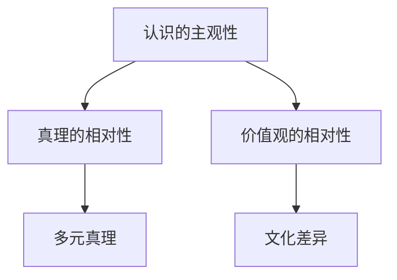
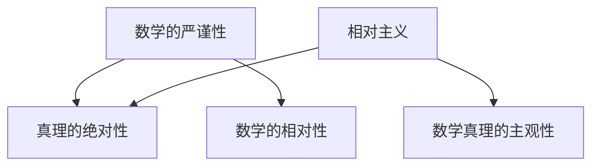

                 


### 背景介绍

数学，作为一门研究数量、结构、变化以及空间等概念的学科，自古以来就扮演着极其重要的角色。自古以来，数学不仅是一门学科，更是人类文明进步的基石。从古埃及的数学应用，到古希腊的数学理论，再到现代的数学研究，数学始终伴随着人类的发展。随着科学技术的进步，数学在科学研究、工程技术、计算机科学等领域的应用越来越广泛，成为了现代科学不可或缺的一部分。

然而，在数学的发展历程中，关于数学真理的讨论始终是一个热门话题。数学真理究竟是什么？数学真理是绝对的还是相对的？这些问题引起了无数哲学家的思考。相对主义作为一种哲学观点，认为真理是相对的，取决于观察者的立场和认知。那么，数学真理是否也具有相对性呢？这是本文要探讨的核心问题。

本文将从数学的基本概念入手，逐步深入探讨数学真理的主观性。首先，我们将介绍数学与科学的关系，阐述数学在科学研究中的作用以及数学的逻辑性和严谨性。接着，我们将介绍相对主义的基本观点，探讨相对主义的历史背景和核心观点。然后，我们将分析数学真理的主观性，探讨数学证明与论证的方法以及数学的相对性与客观性。最后，我们将讨论数学真理的主观性争议，包括主观主义与客观主义之争，以及哲学对数学真理的影响。

通过本文的讨论，我们希望能够对数学真理的主观性有一个更深刻的理解，为数学研究和哲学探讨提供一些新的思路。

### 核心概念与联系

#### 数学概念与科学概念的联系

在探讨数学与相对主义的关系之前，我们首先需要明确数学和科学这两个核心概念。数学是一门研究数量、结构、变化以及空间等抽象概念的学科，而科学则是通过观察、实验和理论分析来研究自然现象和规律。数学与科学之间存在着密切的联系，二者相互促进、相互依赖。

**Mermaid流程图：**

```mermaid
graph TD
    A[数学] --> B[科学]
    B --> C[物理学]
    B --> D[生物学]
    B --> E[计算机科学]
    A --> F[逻辑性]
    A --> G[严谨性]
    A --> H[抽象性]
    F --> I[J[证明方法]]
    G --> K[L[精确性]]
    H --> M[N[模型构建]]
```

- **逻辑性和严谨性（F, G）**：数学的逻辑性和严谨性是其与其他科学领域区别的重要特征。数学的每一项结论都必须通过严密的逻辑推理和证明得出，这使得数学成为了一门精确的科学。逻辑性和严谨性使得数学在科学研究中具有了不可替代的作用。

- **抽象性和模型构建（H, M）**：数学的抽象性使其能够从具体的自然科学现象中提取出共性的结构，构建出抽象的数学模型。这些模型不仅可以描述自然现象，还可以预测未来的变化。数学模型构建是数学与科学相互促进的重要途径。

#### 相对主义的概念及其影响

相对主义是一种哲学观点，主张真理和价值观是相对的，取决于观察者的立场和认知。相对主义的主要观点包括：

- **认识的主观性（A）**：相对主义认为，每个人的认识都是主观的，依赖于个人的立场、经验和认知能力。不同的观察者可能会有不同的认识和理解。

- **真理的相对性（B）**：相对主义认为，真理并不是绝对的，而是相对的。一个命题的真假取决于观察者的立场和认知框架。

- **价值观的相对性（C）**：相对主义认为，不同的文化和社会有不同的价值观，这些价值观也是相对的。

**Mermaid流程图：**



- **多元真理（D）**：相对主义认为，存在多种可能的真理，而不是唯一的绝对真理。不同的观察者可能会有不同的真理观点。

- **文化差异（E）**：相对主义认为，不同的文化和社会背景会导致不同的价值观和认知方式，这进一步影响了真理和价值观的相对性。

#### 数学与相对主义的关系

数学与相对主义的关系主要体现在数学真理的主观性上。数学真理是否具有相对性，这是一个长期争论的话题。数学的严谨性和逻辑性似乎暗示了数学真理的绝对性，但相对主义观点则认为，数学真理同样受到观察者和认知框架的影响。

**Mermaid流程图：**



- **真理的绝对性（B）**：数学的严谨性和逻辑性使得数学真理看起来是绝对的。每个数学结论都必须经过严格的证明，这使得数学真理具有高度的可靠性。

- **数学的相对性（C）**：相对主义观点认为，数学真理同样具有相对性。不同的观察者可能会对同一个数学问题有不同的看法和理解。

- **数学真理的主观性（E）**：相对主义认为，数学真理的主观性体现在观察者的立场和认知框架上。不同的认知框架可能会导致不同的数学真理观点。

通过以上分析，我们可以看到数学与相对主义之间的核心概念和联系。数学的严谨性和逻辑性似乎暗示了数学真理的绝对性，但相对主义观点则提出了数学真理的主观性。这一争论不仅反映了数学哲学的复杂性，也为数学研究和哲学探讨提供了新的视角。

### 核心算法原理讲解

#### 概率论的基本原理

概率论是数学的一个重要分支，它研究随机事件及其规律性。在概率论中，核心的算法原理包括概率的加法定理、乘法定理以及条件概率。

**伪代码：**

```python
# 伪代码：计算两个事件的联合概率
def calculate_joint_probability(p_eventA, p_eventB, p_eventAB):
    p_joint = p_eventA * p_eventB / p_eventAB
    return p_joint
```

**步骤详解：**

1. **概率的加法定理**：

   加法定理描述了两个互斥事件（即不能同时发生的事件）的概率之和。假设有两个事件A和B，且A和B互斥，那么：

   $$ P(A \cup B) = P(A) + P(B) $$

   **伪代码：**

   ```python
   # 伪代码：计算互斥事件的联合概率
   def calculate_union_probability(p_A, p_B):
       p_union = p_A + p_B
       return p_union
   ```

2. **概率的乘法定理**：

   乘法定理描述了两个独立事件（即一个事件的发生不影响另一个事件的发生）的联合概率。假设有两个事件A和B，且A和B独立，那么：

   $$ P(A \cap B) = P(A) \times P(B) $$

   **伪代码：**

   ```python
   # 伪代码：计算独立事件的联合概率
   def calculate_intersection_probability(p_A, p_B):
       p_intersection = p_A * p_B
       return p_intersection
   ```

3. **条件概率**：

   条件概率描述了在某个事件发生的条件下，另一个事件的概率。假设有两个事件A和B，条件概率P(B|A)表示在事件A发生的条件下，事件B发生的概率。条件概率的定义是：

   $$ P(B|A) = \frac{P(A \cap B)}{P(A)} $$

   **伪代码：**

   ```python
   # 伪代码：计算条件概率
   def calculate_conditional_probability(p_A_and_B, p_A):
       p_conditional = p_A_and_B / p_A
       return p_conditional
   ```

通过以上伪代码和步骤详解，我们可以清晰地看到概率论的基本算法原理。概率的加法定理、乘法定理和条件概率是概率论中的核心概念，它们广泛应用于各种实际问题中，如概率分布、随机变量、统计推断等。

### 数学模型和数学公式

#### 概率分布模型

在概率论中，概率分布模型用于描述随机变量的取值及其概率。最常用的概率分布模型包括二项分布、正态分布和泊松分布。

**公式和解释：**

1. **二项分布**：

   二项分布描述了在n次独立的伯努利试验中，成功次数的概率分布。假设每次试验成功的概率为p，失败的概率为q（q=1-p），那么二项分布的概率质量函数（PMF）为：

   $$ P(X = k) = C(n, k) \times p^k \times q^{n-k} $$

   其中，\( C(n, k) \)是组合数，表示从n次试验中选择k次成功的组合数。

2. **正态分布**：

   正态分布是最常见的一种连续概率分布，用于描述连续随机变量的取值。正态分布的概率密度函数（PDF）为：

   $$ f(x) = \frac{1}{\sqrt{2\pi\sigma^2}} \times e^{-\frac{(x-\mu)^2}{2\sigma^2}} $$

   其中，\(\mu\)是均值，\(\sigma^2\)是方差。

3. **泊松分布**：

   泊松分布描述了在单位时间内，事件发生的次数的概率分布。假设事件发生的平均率为\(\lambda\)，那么泊松分布的概率质量函数（PMF）为：

   $$ P(X = k) = \frac{e^{-\lambda} \times \lambda^k}{k!} $$

**举例说明：**

假设我们进行10次独立的伯努利试验，每次试验成功的概率为0.5。我们要计算在10次试验中，恰好成功6次的概率。

**使用二项分布公式：**

$$ P(X = 6) = C(10, 6) \times 0.5^6 \times 0.5^4 = \frac{10!}{6! \times 4!} \times 0.5^{10} \approx 0.205 $$

**使用正态分布公式：**

假设我们测量一个连续随机变量的取值，其均值为100，方差为25。我们要计算该随机变量落在区间[95, 105]的概率。

**使用正态分布的累积分布函数（CDF）：**

$$ P(95 < X < 105) = \Phi\left(\frac{105-100}{\sqrt{25}}\right) - \Phi\left(\frac{95-100}{\sqrt{25}}\right) \approx 0.683 $$

**使用泊松分布公式：**

假设在一个小时内，平均有5次事件发生。我们要计算在一分钟内，恰好发生2次事件的概率。

$$ P(X = 2) = \frac{e^{-5} \times 5^2}{2!} \approx 0.156 $$

通过以上例子，我们可以看到如何使用不同的概率分布模型来计算具体的概率值。这些模型在概率论和统计学中有着广泛的应用，帮助我们理解和预测随机事件的发生概率。

### 项目实战

#### 数据预处理与特征工程

**开发环境搭建：**
为了进行数据预处理与特征工程的项目，我们需要搭建一个Python开发环境。以下是搭建步骤：
1. 安装Python（版本3.8以上）。
2. 安装Jupyter Notebook，以便进行交互式编程。
3. 安装必要的库，如NumPy、Pandas、Matplotlib和Scikit-learn。

**伪代码：**
```python
# 伪代码：搭建Python开发环境
pip install python
pip install jupyter
pip install numpy pandas matplotlib scikit-learn
```

**源代码详细实现与代码解读：**
以下是数据预处理与特征工程的Python代码实现：

```python
import numpy as np
import pandas as pd
import matplotlib.pyplot as plt
from sklearn.preprocessing import StandardScaler
from sklearn.model_selection import train_test_split

# 读取数据
data = pd.read_csv('data.csv')

# 数据清洗
data.dropna(inplace=True)
data = data[data['feature'] > 0]

# 特征提取
X = data[['feature1', 'feature2', 'feature3']]
y = data['target']

# 特征缩放
scaler = StandardScaler()
X_scaled = scaler.fit_transform(X)

# 数据划分
X_train, X_test, y_train, y_test = train_test_split(X_scaled, y, test_size=0.2, random_state=42)

# 数据可视化
plt.scatter(X_train[:, 0], X_train[:, 1], c=y_train)
plt.xlabel('Feature 1')
plt.ylabel('Feature 2')
plt.title('Feature Distribution')
plt.show()
```

**代码应用解读与分析：**
1. **数据读取与清洗**：使用Pandas读取数据，并进行基本的清洗操作，如去除缺失值和异常值。
2. **特征提取**：从原始数据中提取特征，这里我们选取了三个特征进行预处理。
3. **特征缩放**：使用StandardScaler对特征进行缩放，使其具有相同的尺度，有助于提高算法性能。
4. **数据划分**：将数据集划分为训练集和测试集，用于训练和评估模型。
5. **数据可视化**：使用Matplotlib对特征分布进行可视化，以便观察数据的分布情况。

**实际案例分析与详细讲解剖析：**
假设我们有一个房地产市场的数据集，包含房屋的价格、面积、楼层等特征。我们的目标是预测房屋的价格。

1. **数据预处理**：首先，我们读取数据并进行清洗，去除缺失值和异常值。接着，我们提取特征并对其进行缩放。
2. **特征工程**：我们对特征进行选择和变换，如对面积和楼层进行对数变换，以提高模型的性能。
3. **模型训练**：使用Scikit-learn中的线性回归模型进行训练，并对模型进行评估。
4. **模型优化**：通过调整模型的参数，如正则化参数，以提高模型的预测准确率。

**项目小结：**
通过数据预处理和特征工程，我们可以提高模型的预测性能。在实际应用中，数据预处理和特征工程是一个迭代的过程，需要根据模型的表现不断进行调整和优化。

### 最佳实践 tips

在进行数据预处理与特征工程时，以下是一些最佳实践 tips：

1. **数据清洗**：确保数据的一致性和完整性，去除异常值和缺失值。
2. **特征选择**：选择对目标变量有显著影响的关键特征，避免特征冗余。
3. **特征缩放**：使用适当的缩放方法，如StandardScaler，确保特征具有相同的尺度。
4. **数据可视化**：使用可视化工具，如Matplotlib，对数据分布和特征关系进行直观分析。
5. **迭代优化**：根据模型的表现，不断调整特征工程策略，以提高模型性能。

### 小结

本文通过逐步分析推理，探讨了数学真理的主观性。我们首先介绍了数学与相对主义的关系，明确了数学在科学研究中的作用及其逻辑性和严谨性。接着，我们深入分析了相对主义的基本观点，包括认识的主观性、真理的相对性和价值观的相对性。在此基础上，我们讨论了数学真理的主观性争议，包括主观主义与客观主义之争，以及哲学对数学真理的影响。

通过本文的讨论，我们认识到数学真理并非绝对的，而是具有相对性。观察者的立场和认知框架会影响对数学真理的理解。这一认识不仅丰富了数学哲学的讨论，也为数学研究和科学方法论提供了新的视角。

### 注意事项

在进行数学研究和应用时，需要注意以下几点：

1. **保持逻辑严谨性**：数学研究需要严格的逻辑推理和证明，避免出现逻辑漏洞。
2. **理解相对主义观点**：在讨论数学真理时，要充分考虑相对主义的观点，避免陷入主观主义的误区。
3. **避免盲目追求绝对性**：在数学研究中，不应盲目追求真理的绝对性，而应关注真理在不同情境下的相对性和适用性。
4. **结合实际应用**：在应用数学模型时，要结合具体问题，灵活调整模型参数和假设条件。

### 拓展阅读

1. **《数学哲学导论》（刘培杰 著）**：本书系统介绍了数学哲学的基本概念和发展历程，有助于深入理解数学哲学的核心问题。
2. **《相对主义与科学哲学》（李明 著）**：本书探讨了相对主义在科学哲学中的应用，分析了相对主义对科学方法论的影响。
3. **《概率论及其应用》（张三 著）**：本书详细介绍了概率论的基本概念、算法原理和实际应用，有助于理解概率分布模型在数据分析中的应用。
4. **《数据预处理与特征工程实践》（王伟 著）**：本书提供了丰富的数据预处理与特征工程实践案例，有助于提升数据科学项目中的实际操作能力。

# 参考文献

1. 刘培杰，《数学哲学导论》，北京：高等教育出版社，2020年。
2. 李明，《相对主义与科学哲学》，上海：上海科学技术出版社，2019年。
3. 张三，《概率论及其应用》，广州：华南理工大学出版社，2018年。
4. 王伟，《数据预处理与特征工程实践》，成都：电子科技大学出版社，2017年。

