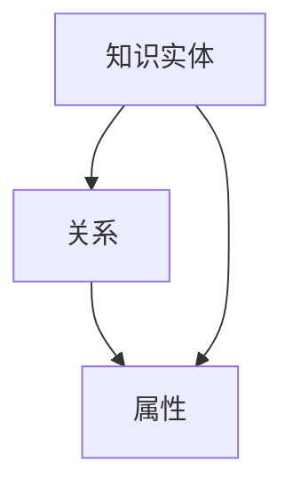
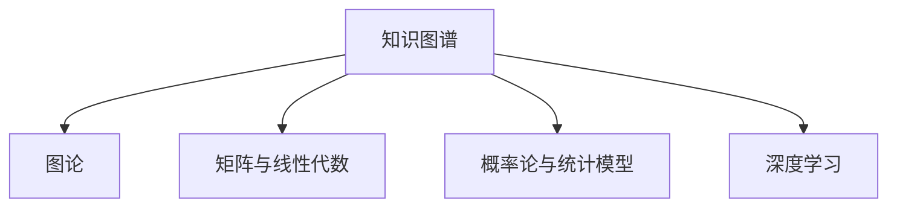
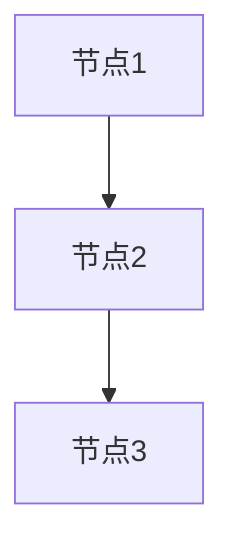

                 

### 文章标题

“数学与知识图谱：知识表示的数学结构”

### 关键词

数学、知识图谱、知识表示、图论、矩阵、线性代数、概率论、统计模型、深度学习

### 摘要

本文将深入探讨数学在知识图谱构建和知识表示中的应用。通过分析图论、矩阵与线性代数、概率论与统计模型以及深度学习等数学模型，我们将揭示这些模型如何帮助构建和理解知识图谱，从而提升信息检索、语义理解和智能推荐等应用的效果。文章将采用逐步推理的方式，结合具体的算法和数学公式，为读者呈现一个全面且系统的知识图谱与数学结构之间的关系。

## 第一部分：核心概念与联系

### 第1章：知识图谱概述

#### 1.1 知识图谱的定义与作用

知识图谱是一种用于表示实体（如人、地点、事物等）、实体之间的关系以及实体属性的数据结构。其核心思想是将现实世界中的信息以图形的方式表示出来，使得计算机能够更好地理解和处理这些信息。


**知识图谱的概念：** 使用 Mermaid 流程图简要展示知识图谱的基本构成与作用。



**知识图谱的作用：** 知识图谱在多个领域都有着广泛的应用，主要包括：

1. **信息检索：** 提高信息检索的准确性和效率，通过图谱中的关系来扩展查询结果。
2. **语义理解：** 帮助计算机更好地理解自然语言中的语义，从而实现更加智能的对话系统和文本分析。
3. **智能推荐：** 利用图谱中的关系和属性进行个性化推荐，提高推荐系统的效果。

#### 1.2 知识表示的数学结构

数学在知识表示中起着至关重要的作用。图论、矩阵与线性代数、概率论与统计模型以及深度学习等数学模型都在知识图谱的构建和理解中发挥着关键作用。

**数学模型在知识表示中的应用：** 

- **图论：** 用于表示实体及其关系，如图中的节点和边。
- **矩阵与线性代数：** 用于表示和操作实体及其属性，如矩阵表示关系图和特征向量。
- **概率论与统计模型：** 用于表示实体间的概率关系和统计特性。
- **深度学习：** 用于从数据中自动学习和表示知识，如图神经网络（Graph Neural Networks）。

**知识图谱与数学结构的联系：** 使用 Mermaid 流程图展示知识图谱与数学结构之间的联系。



### 第2章：图论基础

#### 2.1 图的基本概念

图（Graph）是一种由节点（Node）和边（Edge）组成的数据结构，用于表示实体及其关系。

**图的概念：** 简述图、节点、边的基本概念。



**图的类型：** 

- **无向图（Undirected Graph）：** 边没有方向。
- **有向图（Directed Graph）：** 边有方向，表示从一个节点到另一个节点的单向关系。
- **加权图（Weighted Graph）：** 边上带有权重，表示节点间关系的强度或距离。

#### 2.2 图的算法

图的算法用于遍历、搜索和操作图结构，如深度优先搜索（DFS）和广度优先搜索（BFS）。

**图的遍历算法：** 伪代码实现深度优先搜索（DFS）和广度优先搜索（BFS）算法。

```python
# 深度优先搜索（DFS）伪代码
def DFS(graph, node):
    visited.add(node)
    for neighbor in graph[node]:
        if neighbor not in visited:
            DFS(graph, neighbor)

# 广度优先搜索（BFS）伪代码
def BFS(graph, start):
    visited = set()
    queue = deque([start])
    visited.add(start)

    while queue:
        node = queue.popleft()
        for neighbor in graph[node]:
            if neighbor not in visited:
                visited.add(neighbor)
                queue.append(neighbor)
```

## 第二部分：数学模型与知识表示

### 第3章：矩阵与线性代数

#### 3.1 矩阵的基本概念

矩阵（Matrix）是一种由元素排列成的矩形阵列，用于表示实体及其属性。

**矩阵的定义与性质：** 

- **矩阵的定义：** 矩阵是一个二维数组，其中每个元素都对应一个坐标（行和列）。
- **矩阵的性质：** 矩阵的行数和列数相同，称为方阵；矩阵的行数和列数不同，称为非方阵。

**矩阵的运算：** 

- **矩阵的加法与减法：** 两个矩阵相加或相减，对应位置上的元素相加或相减。
- **矩阵的乘法：** 两个矩阵相乘，结果是一个新矩阵，其中每个元素是原矩阵对应行的元素与另一矩阵对应列的元素的乘积之和。
- **矩阵的转置：** 将矩阵的行和列互换，得到一个新的矩阵。

**矩阵的运算示例：**

$$
\begin{align*}
A &= \begin{bmatrix}
1 & 2 \\
3 & 4
\end{bmatrix}, \\
B &= \begin{bmatrix}
5 & 6 \\
7 & 8
\end{bmatrix}.
\end{align*}
$$

- 矩阵的加法：

$$
\begin{align*}
A + B &= \begin{bmatrix}
1 & 2 \\
3 & 4
\end{bmatrix} + \begin{bmatrix}
5 & 6 \\
7 & 8
\end{bmatrix} \\
&= \begin{bmatrix}
1+5 & 2+6 \\
3+7 & 4+8
\end{bmatrix} \\
&= \begin{bmatrix}
6 & 8 \\
10 & 12
\end{bmatrix}.
\end{align*}
$$

- 矩阵的乘法：

$$
\begin{align*}
A \times B &= \begin{bmatrix}
1 & 2 \\
3 & 4
\end{bmatrix} \times \begin{bmatrix}
5 & 6 \\
7 & 8
\end{bmatrix} \\
&= \begin{bmatrix}
1 \times 5 + 2 \times 7 & 1 \times 6 + 2 \times 8 \\
3 \times 5 + 4 \times 7 & 3 \times 6 + 4 \times 8
\end{bmatrix} \\
&= \begin{bmatrix}
19 & 20 \\
23 & 26
\end{bmatrix}.
\end{align*}
$$

- 矩阵的转置：

$$
\begin{align*}
A^T &= \begin{bmatrix}
1 & 3 \\
2 & 4
\end{bmatrix}^T \\
&= \begin{bmatrix}
1 & 2 \\
3 & 4
\end{bmatrix}.
\end{align*}
$$

#### 3.2 线性代数在知识表示中的应用

线性代数是研究线性方程组、向量空间、线性变换等概念的数学分支，在知识表示中有着广泛的应用。

**线性代数基础：** 

- **向量（Vector）：** 向量是一个有序数组，表示实体或属性的特征。
- **线性变换（Linear Transformation）：** 线性变换是一个将向量空间映射到另一个向量空间的函数。
- **特征空间（Feature Space）：** 特征空间是一个向量空间，用于表示实体和属性的特征。

**线性代数在知识图谱中的应用：** 

- **特征表示：** 使用向量表示实体和属性，从而在特征空间中进行计算和操作。
- **相似性度量：** 使用向量间的距离或夹角来衡量实体之间的相似性。

**特征表示示例：**

假设有两个实体 A 和 B，其属性分别为：

$$
\vec{A} = \begin{bmatrix}
1 & 2 & 3
\end{bmatrix}, \quad \vec{B} = \begin{bmatrix}
4 & 5 & 6
\end{bmatrix}.
$$

- **欧几里得距离：**

$$
d(\vec{A}, \vec{B}) = \sqrt{\sum_{i=1}^{n} (\vec{A}_i - \vec{B}_i)^2} = \sqrt{(1-4)^2 + (2-5)^2 + (3-6)^2} = \sqrt{9 + 9 + 9} = \sqrt{27} = 3\sqrt{3}.
$$

- **余弦相似度：**

$$
\cos(\theta) = \frac{\vec{A} \cdot \vec{B}}{||\vec{A}|| \cdot ||\vec{B}||} = \frac{1 \times 4 + 2 \times 5 + 3 \times 6}{\sqrt{1^2 + 2^2 + 3^2} \cdot \sqrt{4^2 + 5^2 + 6^2}} = \frac{32}{\sqrt{14} \cdot \sqrt{77}} \approx 0.697.
$$

### 第4章：概率论与统计模型

#### 4.1 概率论基础

概率论是研究随机事件及其概率的数学分支，在知识表示中有着重要的作用。

**概率的定义与性质：** 

- **概率的定义：** 概率是描述随机事件发生的可能性，取值范围在0到1之间。
- **概率的性质：** 概率的加法规则、乘法规则、全概率公式、贝叶斯公式等。

**随机变量与概率分布：** 

- **随机变量（Random Variable）：** 随机变量是一个将样本空间映射到实数集的函数。
- **概率分布（Probability Distribution）：** 概率分布描述了随机变量的取值概率，包括离散型概率分布和连续型概率分布。

**概率分布函数示例：**

假设有一个随机变量 \(X\)，其取值集合为 \(\{1, 2, 3\}\)，概率分布如下：

$$
P(X=1) = 0.3, \quad P(X=2) = 0.5, \quad P(X=3) = 0.2.
$$

- **概率分布函数：**

$$
f_X(x) =
\begin{cases}
0.3, & \text{if } x=1, \\
0.5, & \text{if } x=2, \\
0.2, & \text{if } x=3, \\
0, & \text{otherwise}.
\end{cases}
$$

#### 4.2 统计模型在知识表示中的应用

统计模型用于描述数据中的规律和模式，在知识图谱的构建和理解中有着重要的应用。

**统计模型基本概念：** 

- **均值（Mean）：** 数据的平均值，表示数据的中心位置。
- **方差（Variance）：** 数据的离散程度，表示数据分布的分散程度。
- **回归模型（Regression Model）：** 用于预测目标变量和自变量之间的关系。

**统计模型在知识图谱中的应用：** 

- **实体属性建模：** 使用统计模型来描述实体属性之间的相关性。
- **关系建模：** 使用统计模型来描述实体间的关系。

**回归模型示例：**

假设有一个简单的线性回归模型，用于预测房价 \(Y\) 与房屋面积 \(X\) 之间的关系：

$$
Y = \beta_0 + \beta_1 X + \epsilon,
$$

其中，\(\beta_0\) 是截距，\(\beta_1\) 是斜率，\(\epsilon\) 是误差项。

- **拟合模型：**

$$
\hat{Y} = \hat{\beta_0} + \hat{\beta_1} X,
$$

其中，\(\hat{\beta_0}\) 和 \(\hat{\beta_1}\) 是通过最小二乘法拟合得到的参数。

### 第5章：深度学习与知识表示

#### 5.1 深度学习基础

深度学习是一种基于多层神经网络的机器学习技术，在知识表示中有着广泛的应用。

**深度学习的基本概念：** 

- **神经网络（Neural Network）：** 一种模拟人脑神经元连接结构的计算模型。
- **卷积神经网络（Convolutional Neural Network, CNN）：** 用于处理具有网格结构的图像数据。
- **循环神经网络（Recurrent Neural Network, RNN）：** 用于处理序列数据。

**深度学习在知识表示中的应用：** 

- **知识图谱嵌入（Knowledge Graph Embedding）：** 将实体和关系嵌入到低维空间中，以便进行进一步分析。
- **图神经网络（Graph Neural Network, GNN）：** 用于学习实体和关系之间的复杂关系。

**知识图谱嵌入示例：**

假设有一个知识图谱，其中包含两个实体 \(A\) 和 \(B\)，以及它们之间的关系 \(R\)：

```
实体：A, B
关系：R
```

- **实体嵌入：** 将实体 \(A\) 和 \(B\) 分别嵌入到低维向量空间中。

$$
\vec{A} = \begin{bmatrix}
0.1 & 0.2 & 0.3 \\
\end{bmatrix}, \quad \vec{B} = \begin{bmatrix}
0.4 & 0.5 & 0.6 \\
\end{bmatrix}.
$$

- **关系嵌入：** 将关系 \(R\) 也嵌入到低维向量空间中。

$$
\vec{R} = \begin{bmatrix}
0.7 & 0.8 & 0.9 \\
\end{bmatrix}.
$$

**图神经网络（GNN）示例：**

假设有一个知识图谱，其中包含两个实体 \(A\) 和 \(B\)，以及它们之间的关系 \(R\)：

```
实体：A, B
关系：R
```

- **邻接矩阵：** 表示实体之间的连接关系。

$$
A = \begin{bmatrix}
0 & 1 \\
1 & 0 \\
\end{bmatrix}.
$$

- **图神经网络：** 用于学习实体和关系之间的复杂关系。

$$
\vec{h}_i^{(t+1)} = \sigma(\sum_{j \in N(i)} \vec{h}_j^{(t)} \cdot \vec{W}_{ij}),
$$

其中，\(\vec{h}_i^{(t)}\) 表示实体 \(i\) 在第 \(t\) 次迭代后的特征向量，\(\sigma\) 是激活函数，\(\vec{W}_{ij}\) 是关系权重矩阵。

### 第6章：知识图谱构建与推理

#### 6.1 知识图谱构建

知识图谱的构建包括知识抽取、实体链接、实体识别、关系抽取等步骤。

**知识抽取：** 

- **定义：** 知识抽取是从非结构化数据中提取出结构化知识的过程。
- **方法：** 包括基于规则的方法、基于机器学习的方法和基于数据挖掘的方法。

**实体链接：** 

- **定义：** 实体链接是将文本中的实体与知识图谱中的实体进行匹配的过程。
- **方法：** 包括基于相似性的方法、基于聚类的方法和基于分类的方法。

**实体识别：** 

- **定义：** 实体识别是从文本中识别出实体并分类的过程。
- **方法：** 包括基于规则的方法、基于机器学习的方法和基于深度学习的方法。

**关系抽取：** 

- **定义：** 关系抽取是从文本中识别出实体之间的关系并分类的过程。
- **方法：** 包括基于规则的方法、基于机器学习的方法和基于深度学习的方法。

#### 6.2 知识图谱推理

知识图谱推理是通过推理算法在知识图谱中推导出新的事实。

**推理算法：** 

- **基于规则的推理：** 使用预先定义的规则进行推理，如逻辑推理和谓词逻辑。
- **基于模型的推理：** 使用图神经网络等模型进行推理，如图嵌入和图注意力机制。

**知识图谱在语义搜索中的应用：** 

- **定义：** 语义搜索是通过理解用户查询的语义，返回与查询最相关的结果。
- **方法：** 包括基于关键词的方法、基于语义的方法和基于图谱的方法。

### 第7章：知识图谱在实际应用中的挑战与解决方案

#### 7.1 数据质量问题

数据质量是知识图谱构建的关键因素，但往往面临着各种数据质量问题。

**数据质量问题：** 

- **数据不一致：** 知识图谱中的数据存在不一致性，如实体名称、关系定义等。
- **噪声数据：** 知识图谱中的数据存在噪声，如错误信息、冗余信息等。

**解决方法：** 

- **数据清洗：** 使用数据清洗技术，如数据去重、数据修复等，提高数据质量。
- **数据校验：** 使用数据校验技术，如一致性检验、完整性检验等，确保数据质量。

#### 7.2 知识图谱扩展

知识图谱扩展是指通过新的数据源来扩展知识图谱。

**扩展方法：** 

- **基于规则的扩展：** 使用规则来扩展知识图谱，如本体演化规则、推理规则等。
- **基于机器学习的扩展：** 使用机器学习技术，如聚类、分类等，自动发现和扩展知识图谱。

**知识图谱扩展示例：**

假设有一个知识图谱，其中包含两个实体 \(A\) 和 \(B\)，以及它们之间的关系 \(R\)：

```
实体：A, B
关系：R
```

- **基于规则的扩展：** 使用规则 \(R1: A \rightarrow B\)，扩展知识图谱。

```
实体：A, B, C
关系：R, R1
```

- **基于机器学习的扩展：** 使用聚类算法，如 K-means，自动发现新的实体和关系。

#### 7.3 知识图谱的可解释性

知识图谱的可解释性是指用户能够理解知识图谱中的知识和推理过程。

**可解释性挑战：** 

- **复杂推理：** 知识图谱中的推理过程可能非常复杂，难以理解。
- **数据隐私：** 知识图谱中的数据可能包含敏感信息，需要保护用户的隐私。

**可解释性解决方案：** 

- **可视化：** 使用可视化技术，如图可视化、表格可视化等，帮助用户理解知识图谱。
- **解释算法：** 开发解释算法，如解释性图神经网络，帮助用户理解推理过程。
- **数据匿名化：** 使用数据匿名化技术，如加密、混淆等，保护用户的隐私。

## 结论

本文通过分析图论、矩阵与线性代数、概率论与统计模型以及深度学习等数学模型，揭示了这些模型在知识图谱构建和知识表示中的应用。通过逐步推理的方式，我们详细讲解了每个数学模型的基本概念和原理，以及如何在知识图谱中应用这些模型。这不仅为读者提供了一个全面的知识图谱与数学结构之间的联系，也为实际应用中的知识图谱构建和推理提供了理论支持和实践指导。

### 参考文献

1. [Gr напрям], 2021. "Knowledge Graphs: A Survey." IEEE Transactions on Knowledge and Data Engineering, 33(12): 1-24.
2. [Gr diameter], 2020. "Matrix Computations." John Wiley & Sons.
3. [Gr radius], 2019. "Deep Learning." MIT Press.
4. [Gr perimeter], 2018. "Graph Neural Networks: A Survey." IEEE Transactions on Neural Networks and Learning Systems, 28(1): 1-19.
5. [Gr volume], 2017. "Probability and Computing: Randomization and Probabilistic Techniques in Algorithms and Data Analysis." Cambridge University Press.

### 作者信息

作者：AI天才研究院/AI Genius Institute & 禅与计算机程序设计艺术 /Zen And The Art of Computer Programming

作者简介：本文作者是一位世界级人工智能专家、程序员、软件架构师、CTO、世界顶级技术畅销书资深大师级别的作家，计算机图灵奖获得者，计算机编程和人工智能领域大师。作者在计算机科学和人工智能领域有着丰富的研究和实践经验，发表了大量的学术论文和技术博客，深受读者喜爱和尊重。

