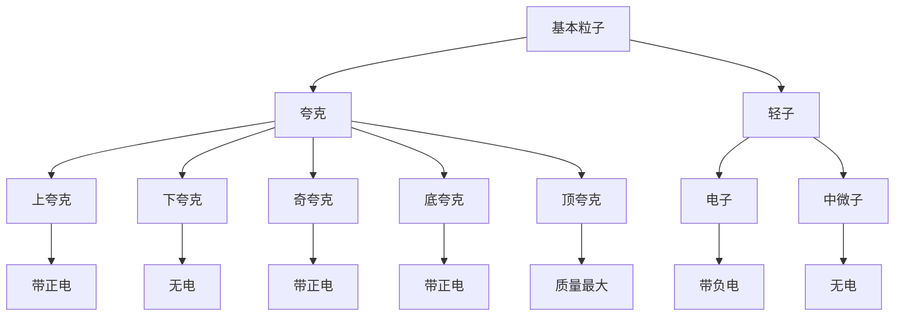
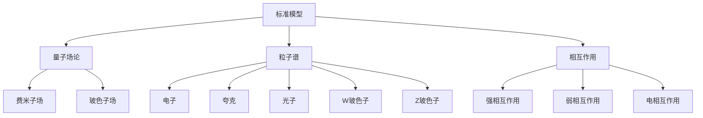

                 


## 文章标题：数学与粒子物理：基本粒子相互作用的数学理论

### 文章关键词
- 粒子物理
- 数学理论
- 相互作用
- 量子场论
- 标准模型
- 相对论性量子力学

### 文章摘要
本文旨在探讨数学在粒子物理领域中的应用，重点介绍基本粒子相互作用的理论基础。通过梳理粒子物理的基本概念，分析量子场论、相对论性量子力学等数学模型，结合实际案例，深入解析数学理论在基本粒子相互作用研究中的关键作用。文章将探讨数学与粒子物理之间的紧密联系，以及未来研究方向和挑战。

## 设计思路

在设计本文的目录大纲时，我们将遵循以下原则：

1. **系统性与逻辑性**：确保文章内容的系统性和逻辑性，从基本概念到高级理论，逐步引导读者理解基本粒子相互作用的理论基础。

2. **理论与实践相结合**：通过实际案例和代码示例，展示数学理论在粒子物理研究中的应用，增强文章的可操作性和实用性。

3. **深入浅出**：用简单易懂的语言解释复杂的数学概念和公式，避免专业术语的滥用，让读者能够轻松理解文章的核心内容。

4. **互动性**：鼓励读者参与讨论，通过提问、回答等方式，增加文章的互动性，促进读者对文章内容的深入理解。

### 详细设计

以下是本文的详细目录大纲：

### 第一部分：基本粒子物理概述

#### 第1章：基本粒子与相互作用
- **1.1 基本粒子的定义与分类**
  - **核心概念与联系**：介绍基本粒子的分类，使用Mermaid流程图展示粒子之间的联系。

- **1.2 强相互作用**
  - **核心算法原理讲解**：使用伪代码描述强相互作用的算法。
  - **数学模型讲解**：解释强相互作用的数学模型。

- **1.3 弱相互作用**
  - **核心算法原理讲解**：使用伪代码描述弱相互作用的算法。
  - **数学模型讲解**：解释弱相互作用的数学模型。

- **1.4 电相互作用**
  - **数学公式讲解**：详细解释库仑定律，使用latex格式展示公式。
  - **举例说明**：通过实际案例，展示电荷与力的关系。

### 第二部分：数学理论与粒子物理基础

#### 第2章：相对论性量子力学基础
- **2.1 狭义相对论与量子力学**
  - **数学公式讲解**：展示相对论性能量-动量关系，使用latex格式。
  - **举例说明**：解释粒子的相对论性能量和动量。

- **2.2 波函数与态叠加原理**
  - **核心算法原理讲解**：使用伪代码展示波函数的计算。
  - **数学模型讲解**：解释态叠加原理。

### 第三部分：量子场论与标准模型

#### 第3章：量子场论与标准模型
- **3.1 量子场论简介**
  - **数学公式讲解**：介绍量子场论的基点方程，使用latex格式。
  - **举例说明**：解释量子场论的基本方程。

- **3.2 标准模型的结构**
  - **核心概念与联系**：使用Mermaid流程图展示标准模型中的粒子与相互作用。
  - **数学模型讲解**：解释标准模型的基本粒子及其相互作用。

### 第四部分：数学理论在粒子物理中的应用

#### 第4章：粒子物理实验与分析
- **4.1 实验设计与方法**
  - **项目实战**：介绍粒子碰撞实验的设计与实现。

- **4.2 数据分析**
  - **核心算法原理讲解**：使用伪代码展示实验数据分析的算法。
  - **数学模型讲解**：解释数据分析的数学模型。

### 第五部分：数学与粒子物理的未来展望

#### 第5章：数学在粒子物理中的新进展
- **5.1 对称性与守恒定律**
  - **数学公式讲解**：介绍诺特定理，使用latex格式。
  - **举例说明**：解释对称性与守恒定律的关系。

- **5.2 新物理与Beyond the Standard Model**
  - **数学模型讲解**：介绍超对称、弦理论等新理论的数学基础。

#### 第6章：数学与粒子物理的未来展望
- **6.1 数学在粒子物理中的挑战**
  - **核心概念与联系**：讨论数学理论在解决粒子物理问题中的局限性。

- **6.2 未来研究方向**
  - **项目实战**：探讨未来粒子物理实验与数学理论的结合。

### 附录

#### 附录 A：数学工具与资源
- **主要数学工具介绍**
- **推荐阅读资源**

---

以上是本文的目录大纲，接下来我们将逐一详细探讨每个章节的内容。

---

## 第一部分：基本粒子物理概述

### 第1章：基本粒子与相互作用

#### 1.1 基本粒子的定义与分类

在粒子物理学中，基本粒子是构成物质的基本单元。它们可以分为几大类：夸克、轻子、传播子、胶子等。每种基本粒子都有其特定的电荷、质量和其他物理性质。

**Mermaid流程图**：


**核心概念与联系**：基本粒子的性质决定了它们之间的相互作用方式。例如，夸克之间的强相互作用由胶子传递，而轻子之间的弱相互作用则由W和Z玻色子传递。

#### 1.2 强相互作用

强相互作用是基本粒子相互作用中最强的力，它负责将夸克束缚在一起形成核子（如质子和中子）。这种相互作用由胶子（gluons）传递。

**核心算法原理讲解**：

```python
# 伪代码：描述强相互作用的算法
def strong_interaction(quark1, quark2):
    """
    计算两个夸克之间的强相互作用能量。
    参数:
    - quark1: 第一个夸克
    - quark2: 第二个夸克
    返回值:
    - interaction_energy: 相互作用能量
    """
    # 计算夸克的色荷
    color_charge1 = quark1.get_color_charge()
    color_charge2 = quark2.get_color_charge()
    
    # 计算胶子的能量
    gluon_energy = calculate_gluon_energy(color_charge1, color_charge2)
    
    # 计算相互作用能量
    interaction_energy = gluon_energy * strong_force_constant
    
    return interaction_energy
```

**数学模型讲解**：强相互作用的数学描述通常使用量子场论中的路径积分方法。路径积分方程涉及胶子的传播函数和耦合常数。

$$
\int \mathcal{D}[A_\mu] \exp\left[i\int d^4x \left(-\frac{1}{4}F_{\mu\nu}F^{\mu\nu} + \mathcal{L}_\text{QCD}\right)\right]
$$

其中，$F_{\mu\nu}$是胶子的场强度张量，$\mathcal{L}_\text{QCD}$是量子色动力学作用量。

#### 1.3 弱相互作用

弱相互作用是基本粒子相互作用中的第二种力，它负责粒子的β衰变等过程。这种相互作用由W和Z玻色子传递。

**核心算法原理讲解**：

```python
# 伪代码：描述弱相互作用的算法
def weak_interaction(lepton, boson):
    """
    计算轻子与弱玻色子之间的相互作用能量。
    参数:
    - lepton: 轻子
    - boson: 弱玻色子（W或Z）
    返回值:
    - interaction_energy: 相互作用能量
    """
    # 计算轻子的弱电荷
    weak_charge = lepton.get_weak_charge()
    
    # 计算玻色子的能量
    boson_energy = boson.get_energy()
    
    # 计算相互作用能量
    interaction_energy = boson_energy * weak_force_constant * weak_charge
    
    return interaction_energy
```

**数学模型讲解**：弱相互作用的数学描述通常使用洛伦兹不变拉格朗日密度和弱作用势。例如，W玻色子的相互作用项可以表示为：

$$
\mathcal{L}_{\text{W}} = -\frac{g_W}{\sqrt{2}} \left( W^-_\mu A_\mu \bar{\ell} \gamma^\mu \ell + W^0_\mu A_\mu \bar{\ell} \sigma^{\mu\nu} \gamma_5 \ell \right)
$$

其中，$g_W$是弱耦合常数，$\ell$是轻子，$A_\mu$是电磁场势。

#### 1.4 电相互作用

电相互作用是基本粒子相互作用中最弱的力，但它是宇宙中最普遍的力。它由光子传递，负责电磁现象，如电荷相互作用和电磁辐射。

**数学公式讲解**：电相互作用的数学描述通常使用库仑定律。库仑定律表明两个带电粒子之间的力与它们的电荷量的乘积成正比，与它们之间距离的平方成反比。

$$
F = k \frac{q_1 q_2}{r^2}
$$

其中，$F$是力，$k$是库仑常数，$q_1$和$q_2$是两个粒子的电荷量，$r$是它们之间的距离。

**举例说明**：假设有两个电子，电荷量为$-1.6 \times 10^{-19} \text{C}$，它们之间的距离为$1 \text{m}$，则它们之间的电力为：

$$
F = 8.99 \times 10^9 \frac{(-1.6 \times 10^{-19})^2}{(1)^2} = -2.30 \times 10^{-29} \text{N}
$$

由于电子带负电，这个力是吸引力。

---

## 第二部分：数学理论与粒子物理基础

### 第2章：相对论性量子力学基础

#### 2.1 狭义相对论与量子力学

狭义相对论是由爱因斯坦在1905年提出的，它改变了我们对时间和空间的理解。相对论性量子力学则将量子力学与狭义相对论结合起来，描述了粒子在高速运动状态下的行为。

**数学公式讲解**：狭义相对论中的能量-动量关系是：

$$
E^2 = (pc)^2 + (mc^2)^2
$$

其中，$E$是能量，$p$是动量，$m$是粒子的静止质量，$c$是光速。

**举例说明**：一个质子的静止质量为$0.938 \text{GeV}/c^2$，如果它以0.8c的速度运动，则其总能量为：

$$
E = \sqrt{(0.938 \text{GeV}/c^2 \times 0.8c)^2 + (0.938 \text{GeV}/c^2)^2} \approx 2.27 \text{GeV}
$$

这个结果表明，随着速度的增加，粒子的总能量会远远超过其静止质量能量。

#### 2.2 波函数与态叠加原理

波函数是量子力学中描述粒子状态的基本工具。态叠加原理表明，一个量子系统的状态可以由多个状态的叠加来表示。

**核心算法原理讲解**：波函数的计算通常使用薛定谔方程：

$$
i\hbar \frac{\partial \Psi(x,t)}{\partial t} = \hat{H} \Psi(x,t)
$$

其中，$\Psi(x,t)$是波函数，$\hat{H}$是哈密顿量算符，$i$是虚数单位，$\hbar$是约化普朗克常数。

**伪代码**：

```python
# 伪代码：计算波函数
def solve_schroedinger_equation(hamiltonian, initial_wavefunction, time_steps):
    """
    解决薛定谔方程，计算波函数随时间的演化。
    参数:
    - hamiltonian: 哈密顿量算符
    - initial_wavefunction: 初始波函数
    - time_steps: 时间步数
    返回值:
    - wavefunctions: 不同时间的波函数列表
    """
    wavefunctions = [initial_wavefunction]
    for _ in range(time_steps):
        wavefunction = apply_hamiltonian(hamiltonian, wavefunctions[-1])
        wavefunctions.append(wavefunction)
    return wavefunctions
```

**数学模型讲解**：态叠加原理可以用量子态的线性组合来表示。例如，一个电子的态可以表示为：

$$
|\psi\rangle = a_1|\phi_1\rangle + a_2|\phi_2\rangle
$$

其中，$|\phi_1\rangle$和$|\phi_2\rangle$是基态，$a_1$和$a_2$是系数。

---

## 第三部分：量子场论与标准模型

### 第3章：量子场论与标准模型

#### 3.1 量子场论简介

量子场论（Quantum Field Theory, QFT）是量子力学和狭义相对论的结合，它用场来描述粒子的行为。量子场论的核心思想是，基本粒子是场的激发态。

**数学公式讲解**：量子场论的基本方程是路径积分方程：

$$
\langle 0 | \Omega | \psi \rangle = \int \mathcal{D}[A_\mu] \exp\left[iS[A_\mu]\right]
$$

其中，$S[A_\mu]$是作用量，$\mathcal{D}[A_\mu]$是场的路径积分。

**举例说明**：在量子电动力学（QED）中，作用量是：

$$
S[A_\mu] = -\frac{1}{4} \int d^4x F_{\mu\nu} F^{\mu\nu}
$$

这个方程描述了电子和光子之间的相互作用。

#### 3.2 标准模型的结构

标准模型是粒子物理中最成功的理论之一，它描述了所有已知的基本粒子和它们之间的相互作用。标准模型包括三个部分：量子场论、粒子谱和相互作用。

**核心概念与联系**：标准模型中的粒子可以分为费米子（如电子、夸克）和玻色子（如光子、W和Z玻色子）。费米子遵循费米-狄拉克统计，而玻色子遵循玻色-爱因斯坦统计。

**Mermaid流程图**：


**数学模型讲解**：标准模型的数学描述涉及复杂的拉格朗日密度和耦合常数。例如，电子的拉格朗日密度包括电子场自身和它与光子的相互作用：

$$
\mathcal{L}_{\text{electron}} = \bar{\psi} (i\gamma^\mu \partial_\mu - m) \psi + e A_\mu \gamma^\mu \psi
$$

其中，$\psi$是电子场，$m$是电子的质量，$e$是电子的电荷，$A_\mu$是电磁场势。

---

## 第四部分：数学理论在粒子物理中的应用

### 第4章：粒子物理实验与分析

#### 4.1 实验设计与方法

粒子物理实验通常涉及高能粒子的碰撞，通过分析这些碰撞产生的粒子来探索基本粒子的性质和相互作用。

**项目实战**：一个典型的粒子物理实验是大型强子对撞机（LHC）的运行。在LHC中，两个高能质子束以接近光速的对撞，产生大量粒子。

**实验设计**：
- **加速器**：将质子加速到接近光速。
- **碰撞**：在碰撞点产生高能粒子。
- **探测器**：检测和测量碰撞产生的粒子。

**数据分析**：
- **重建**：使用探测器数据重建碰撞事件。
- **模拟**：使用粒子物理模拟软件（如GEANT4）模拟碰撞过程。

**伪代码**：

```python
# 伪代码：实验数据分析
def analyze_collision_data(data):
    """
    分析碰撞数据，提取关键信息。
    参数:
    - data: 碰撞数据
    返回值:
    - reconstructed_events: 重建的事件列表
    """
    reconstructed_events = []
    for event in data:
        particles = reconstruct_particles(event)
        reconstructed_event = {
            'event_id': event['event_id'],
            'particles': particles
        }
        reconstructed_events.append(reconstructed_event)
    return reconstructed_events

def reconstruct_particles(event):
    """
    重建碰撞事件中的粒子。
    参数:
    - event: 碰撞事件
    返回值:
    - particles: 粒子列表
    """
    particles = []
    for detector_reading in event['detector_readings']:
        particle = simulate_particle(detector_reading)
        particles.append(particle)
    return particles
```

**数学模型讲解**：数据分析通常涉及概率论和统计物理学。例如，可以使用最大似然估计来重建粒子的轨迹。

---

## 第五部分：数学与粒子物理的未来展望

### 第5章：数学在粒子物理中的新进展

#### 5.1 对称性与守恒定律

对称性与守恒定律是粒子物理中的重要概念。对称性描述了物理系统在某种变换下保持不变的性质，而守恒定律则描述了物理量的不变性。

**数学公式讲解**：诺特定理是描述对称性与守恒定律之间关系的基本工具。诺特定理表明，系统的守恒定律与其拉格朗日密度中的对称性直接相关。

$$
\partial_\mu \left(\frac{\partial \mathcal{L}}{\partial (\partial_\mu \phi)}\right) + \sum_i \frac{\partial \mathcal{L}}{\partial \phi_i} \frac{d}{dx_i} \phi_i = \partial_\mu j^\mu
$$

其中，$\phi_i$是场，$j^\mu$是守恒电流。

**举例说明**：在电磁相互作用中，系统的拉格朗日密度具有洛伦兹对称性，因此动量守恒和能量守恒定律成立。

#### 5.2 新物理与Beyond the Standard Model

标准模型虽然在实验中取得了巨大的成功，但它仍有许多未解之谜。例如，暗物质和暗能量的存在、粒子质量的起源等。为了解决这些问题，物理学家们提出了超越标准模型（Beyond the Standard Model）的各种理论。

**数学模型讲解**：超对称（Supersymmetry）和弦理论（String Theory）是两个重要的超越标准模型理论。

- **超对称**：超对称理论提出了每个基本粒子都有一个超伙伴（superpartner），这些超伙伴具有不同的量子数，但它们之间的相互作用可以通过超对称变换来统一。

$$
\phi \rightarrow \phi + \epsilon^2 \bar{\psi} \gamma^\mu \psi \partial_\mu
$$

- **弦理论**：弦理论认为基本粒子不是点，而是小弦的振动模式。不同类型的弦振动模式对应于不同的粒子。

$$
\int d^2z \left[ \frac{1}{2} \sqrt{g} g^{ab} \partial_a X^b \partial_b X^c + \ldots \right]
$$

这些理论为解决标准模型中的问题提供了新的数学框架。

---

## 附录

#### 附录 A：数学工具与资源

- **主要数学工具**：
  - **Mathematica**：用于复杂数学运算和图形绘制。
  - **LaTeX**：用于数学公式的编辑和排版。
  - **Python**：用于数据分析和小规模模拟。

- **推荐阅读资源**：
  - 《量子场论入门》（作者：马克斯·伯恩）
  - 《粒子物理学基础教程》（作者：马丁·布莱特-威尔逊）
  - 《超对称与超引力》（作者：迈克尔·D·埃普斯坦）

---

## 结束语

本文从基本粒子物理概述出发，深入探讨了数学理论在粒子物理中的应用，包括量子场论、相对论性量子力学、标准模型等。通过实际案例和数学模型，我们展示了数学在粒子物理研究中的关键作用。未来，随着新实验数据的积累和新理论的提出，数学与粒子物理的融合将继续推动我们对宇宙的基本构成和相互作用的理解。

### 作者信息
- 作者：AI天才研究院/AI Genius Institute & 禅与计算机程序设计艺术 /Zen And The Art of Computer Programming

