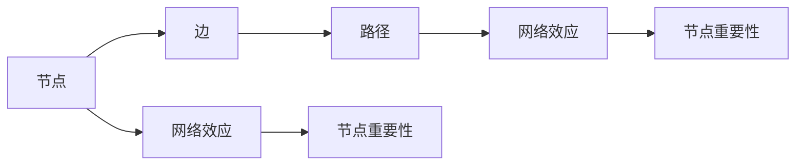
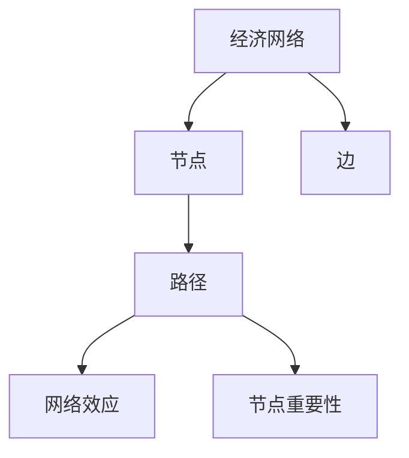
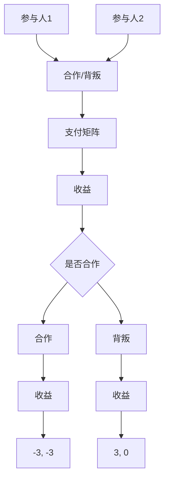
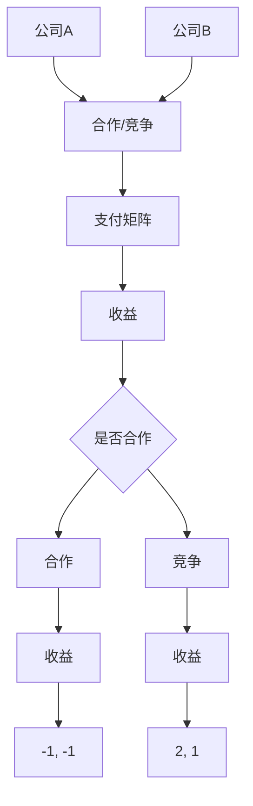

                 

### 文章标题

《数学与网络经济学：经济网络的数学分析》

### 关键词

- 网络经济学
- 经济网络
- 数学分析
- 竞争与合作
- 博弈论
- 社会网络分析
- 信息传播与控制
- 安全性与稳定性

### 摘要

本文从数学和网络经济学的角度，深入探讨了经济网络的数学分析方法。文章首先介绍了网络经济学的背景和重要性，随后详细阐述了经济网络的基本概念和结构。接着，文章重点分析了网络中的竞争与合作机制，并运用博弈论进行网络市场中的深入探讨。此外，文章还介绍了社会网络分析在经济学中的应用，以及经济网络中的信息传播与控制策略。最后，文章对经济网络的安全性与稳定性进行了分析，提出了相应的安全策略与措施。通过本文的阅读，读者可以全面了解经济网络的数学分析理论和方法，以及其在实际应用中的重要作用。

### 引言：网络经济学的背景和重要性

#### 网络经济学的起源与发展

网络经济学是一门研究网络结构和网络效应对经济行为和决策产生影响的学科。它的起源可以追溯到20世纪80年代末和90年代初，当时互联网的迅速普及和电子商务的兴起，使得人们开始关注网络对经济活动的影响。最初的研究主要集中在互联网对市场结构、消费者行为和企业战略的变革上。

随着研究的深入，网络经济学逐渐发展成为一门综合性的学科，涵盖了多个领域，包括博弈论、社会网络分析、信息经济学和复杂系统理论。这些领域的研究成果相互融合，共同构成了网络经济学的理论框架。

#### 核心概念

网络经济学中的核心概念包括网络结构、网络效应、网络外部性和网络竞争。网络结构指的是网络中的节点和连接方式，它决定了信息、资源和利益的流动路径。网络效应是指个体加入网络后，网络的价值会随着网络规模的增加而增加。网络外部性是指个体在消费或生产某种产品或服务时，由于网络的存在，其私人收益与社会收益存在差异。网络竞争则是指企业在网络市场中的竞争行为，包括价格竞争、非价格竞争和合作竞争。

#### 应用领域

网络经济学在多个领域有着广泛的应用。在电子商务中，网络经济学可以帮助企业了解消费者行为，优化产品定价策略和促销活动。在金融市场中，网络经济学可以用于分析金融网络的结构和稳定性，预测市场波动和金融危机。在公共管理中，网络经济学可以用于制定政策，优化网络基础设施建设和资源分配。

#### 重要性

网络经济学的重要性在于它为理解和解决现实世界中的经济问题提供了新的视角和方法。随着互联网的普及和信息技术的快速发展，经济活动越来越依赖于网络。网络经济学的理论和方法可以帮助我们更好地理解网络对经济行为的影响，从而制定更有效的经济政策和商业战略。

例如，在市场竞争中，企业可以通过网络经济学分析来优化产品定价策略，提高市场份额。在金融市场中，投资者可以通过网络经济学模型来预测市场趋势和风险，制定投资策略。在公共管理中，政府可以通过网络经济学来优化资源分配，提高社会福利。

总之，网络经济学作为一门新兴学科，具有广泛的应用前景和重要的研究价值。随着技术的不断进步，网络经济学将继续深化我们的理解，为解决现实经济问题提供强有力的理论支持。

### 经济网络的基本概念和结构

#### 定义和类型

经济网络是一种由经济实体（如企业、消费者、政府和金融机构）及其相互之间的经济关系构成的复杂系统。这些实体通过商品、服务、信息、资金等要素的交换和流动相互连接，形成了具有特定结构和功能的网络。

经济网络可以分为多种类型，包括：

1. **市场网络**：由市场参与者及其交易关系构成的网络，如供应链网络、电子商务网络等。
2. **金融网络**：由金融机构及其借贷、投资关系构成的网络，如银行网络、资本市场网络等。
3. **社会网络**：由社会个体及其社会关系构成的网络，如社交媒体网络、社交网络分析等。
4. **产业网络**：由产业内企业及其合作伙伴关系构成的网络，如技术创新网络、产业集群等。

#### 拓扑结构

经济网络的拓扑结构是指网络中节点（实体）和边（关系）的排列方式。常见的经济网络拓扑结构包括：

1. **星型结构**：中心节点连接多个外围节点，代表集中的市场控制或领导企业。
2. **环型结构**：节点以闭合环的形式连接，代表一定程度的协作与共享。
3. **网状结构**：节点通过多路径连接，具有高冗余性和稳定性，如互联网。
4. **层级结构**：节点按照层次关系组织，如企业内部的层级架构。

#### 度量指标

经济网络的度量指标用于量化网络中节点和关系的特征。常见的度量指标包括：

1. **度数**：节点连接的边数，反映节点的连接程度。度数分为入度（连接到该节点的边数）和出度（从该节点出发的边数）。
2. **介数**：节点在信息流动路径上的重要性，路径经过该节点的次数越多，其介数越高。
3. **聚类系数**：节点之间的平均连接密度，反映网络的紧密程度。
4. **路径长度**：节点之间的最短路径长度，衡量网络的连通性。

#### 核心概念与联系

经济网络的核心概念包括节点、边、路径、网络效应和节点重要性。这些概念之间的联系可以通过Mermaid流程图来展示：



在图中，节点和边构成了经济网络的基本单元，路径是节点之间连接的路径，网络效应是节点和路径共同作用的结果，而节点重要性则是网络效应的直接体现。

#### Mermaid 流程图

以下是经济网络基本概念和联系的Mermaid流程图：



在这个流程图中，我们可以看到经济网络的构成要素以及它们之间的相互关系。节点和边构成了网络的基本结构，路径是节点之间的连接方式，网络效应是网络结构的作用结果，而节点重要性则是网络效应的体现。

通过上述分析，我们可以全面了解经济网络的基本概念和结构，为后续章节的深入探讨打下坚实的基础。

### 网络中的竞争与合作

#### 网络竞争的机制和模型

网络竞争是经济学中的重要概念，它涉及到市场中的多个参与者如何在竞争环境中进行策略选择。网络竞争的机制主要包括以下几个方面：

1. **价格竞争**：企业在价格上进行竞争，以降低产品或服务的价格来吸引消费者。价格竞争的典型例子包括价格战和市场折扣策略。
2. **非价格竞争**：企业在非价格方面进行竞争，如产品创新、服务质量、广告宣传等。非价格竞争的例子包括差异化产品、品牌价值和客户体验。
3. **合作竞争**：企业在竞争的同时，通过合作来实现共同的目标，如联合研发、资源共享和战略联盟。合作竞争的例子包括供应链合作、合资企业和开放创新。

在经济学中，常用的网络竞争模型包括：

1. **伯特兰模型**：该模型假设企业在价格上进行竞争，消费者会选择价格最低的企业。在伯特兰模型中，企业的利润函数与价格成反比，价格战会导致企业利润下降。
2. **古诺模型**：该模型假设企业在产量上进行竞争，消费者会选择产量最高的企业。在古诺模型中，企业的利润函数与产量成反比，产量竞争可能导致市场过度供给。

#### 网络合作的形式和策略

网络合作在经济学中同样具有重要意义，它能够帮助企业降低成本、提高效率和市场竞争力。网络合作的形式主要包括以下几种：

1. **供应链合作**：企业通过共享信息、资源和风险管理来优化供应链运营。供应链合作的形式包括垂直整合、横向整合和供应链联盟。
2. **市场合作**：企业通过共同开发市场、共享客户资源和市场份额来实现共赢。市场合作的形式包括价格联盟、广告合作和市场扩展。
3. **战略联盟**：企业通过建立长期合作关系来共同开发市场、共享技术和资源。战略联盟的形式包括合资企业、技术联盟和品牌联盟。

网络合作的策略主要包括以下几个方面：

1. **共享信息**：企业通过共享市场信息、技术信息和客户信息来提高决策质量和效率。
2. **资源共享**：企业通过共享生产设备、技术和人力资源来降低成本和提高效率。
3. **风险管理**：企业通过合作来分散风险，降低市场波动和不确定性对业务的影响。
4. **创新合作**：企业通过合作来共同进行产品研发和技术创新，提高市场竞争力。

#### 网络竞争与合作的均衡分析

网络竞争与合作的均衡分析是经济学中的重要内容，它涉及到如何在不同竞争与合作策略下实现最优的收益。以下是一些常用的均衡分析模型：

1. **纳什均衡**：纳什均衡是博弈论中的核心概念，它指的是在博弈中，每个参与者选择自己的最优策略，并且其他参与者也选择自己的最优策略。在纳什均衡中，每个参与者都达到了自己的最优收益。
2. **协同博弈**：协同博弈是指多个参与者通过合作来实现共同的目标。在协同博弈中，参与者通过协调自己的策略来实现整体利益的最大化。
3. **合作博弈**：合作博弈是指参与者通过合作来降低竞争成本，提高整体收益。在合作博弈中，参与者通过建立信任和合作机制来实现共赢。

在实际应用中，网络竞争与合作的均衡分析可以帮助企业制定最优的竞争与合作策略，提高市场竞争力。例如，在供应链合作中，企业可以通过建立信息共享和资源共享机制来实现成本降低和效率提升。在市场合作中，企业可以通过共同开发市场和共享客户资源来实现市场份额的增加。

总之，网络中的竞争与合作是经济学中重要的研究内容，它涉及到市场中的多个参与者的策略选择和行为模式。通过深入分析网络竞争与合作机制，企业可以制定更有效的竞争与合作策略，提高市场竞争力。

### 网络市场中的博弈论分析

#### 博弈论的基本概念

博弈论是研究具有相互冲突和合作的理性个体的决策和均衡行为的数学理论。在博弈论中，个体被称为博弈者，他们通过选择策略（行动）来实现自己的目标，同时考虑其他博弈者的策略选择。

博弈的基本要素包括：

- **参与人**：博弈中的个体，也称为博弈者。
- **策略**：参与人在博弈中可以选择的行动集合。
- **支付**：参与人在博弈结束后的收益或损失。
- **均衡**：博弈的稳定状态，其中每个参与人选择的策略是其他参与人策略的响应。

常见的博弈类型包括：

1. **静态博弈**：参与人在同一时间做出决策，如伯特兰模型和古诺模型。
2. **动态博弈**：参与人在不同时间依次做出决策，如序列博弈和重复博弈。

#### 网络博弈的特殊性质

在传统市场环境中，博弈论通常用于分析个体之间的竞争和合作。然而，在网络市场中，博弈论的应用更加复杂和多样化，因为网络结构对博弈行为有着显著的影响。

网络博弈的特殊性质包括：

1. **网络效应**：网络中的每个参与人的收益不仅取决于自己的策略选择，还取决于其他参与人的策略选择。这种外部性使得参与人的策略选择更加复杂。
2. **信息不对称**：网络中的参与人可能拥有不同的信息，这会导致信息优势和信息劣势，影响博弈的结果。
3. **路径依赖**：网络结构的演变和博弈的长期结果可能受到初始条件和历史路径的影响。
4. **外部干预**：政府或第三方机构可能通过政策或技术干预影响网络博弈的进程和结果。

#### 网络市场中的策略选择

在分析网络市场中的策略选择时，博弈论提供了多种模型和方法，以下是一些常见的策略选择模型：

1. **纳什均衡**：在纳什均衡中，每个参与人选择的策略是其他参与人策略的最佳响应。纳什均衡可以用于分析网络市场中参与人的稳定策略。
2. **贝叶斯均衡**：在贝叶斯均衡中，参与人基于对其他参与人策略的概率分布进行决策。贝叶斯均衡适用于存在信息不对称的网络市场。
3. **重复博弈**：在重复博弈中，参与人多次进行博弈，这可以促使参与人采取合作策略，以实现长期利益。重复博弈中的策略选择包括合作与背叛的交替、合作稳定性和耐心的收益。
4. **演化博弈**：演化博弈考虑参与人在重复博弈中的适应性和策略调整。在演化博弈中，适应环境的策略会逐渐占据主导地位。

以下是一个简单的博弈论模型——囚徒困境，用于解释网络市场中的策略选择：



在这个囚徒困境模型中，两个参与人可以选择合作或背叛。如果双方都选择合作，他们各自获得负收益（-3）；如果一方选择合作而另一方选择背叛，背叛者获得正收益（3）而合作者获得负收益（-3）；如果双方都选择背叛，他们各自获得负收益（-3）。在这个模型中，纳什均衡是双方都选择背叛，因为背叛是每个参与人面对对方背叛时的最佳响应。

#### 网络市场中的策略选择实例

在一个电子商务市场中，两家公司A和B正在争夺市场份额。它们可以选择合作或竞争策略。以下是一个简化的博弈模型：



在这个模型中，如果两家公司都选择合作，他们各自获得负收益（-1）；如果一家公司选择合作而另一家公司选择竞争，选择竞争的公司获得正收益（2）而选择合作的公司获得负收益（-1）；如果两家公司都选择竞争，他们各自获得负收益（-1）。

通过这个模型，我们可以看到，尽管合作策略在长期内可能带来更高的总收益，但在竞争激烈的市场环境中，公司可能出于短期利益而选择竞争策略。因此，理解网络博弈的均衡策略对于制定有效的市场策略至关重要。

总之，网络市场中的博弈论分析为理解和预测参与人的策略选择提供了有力的工具。通过博弈论模型，我们可以深入探讨网络效应、信息不对称和路径依赖等复杂因素对博弈结果的影响，为企业在网络市场中的竞争与合作提供理论支持。

### 社会网络分析在经济学中的应用

#### 社会网络分析的基本工具

社会网络分析（SNA）是研究社会结构及其动态变化的一种方法论，它通过图形和网络模型来描述和分析个体及其关系。社会网络分析在经济学中的应用十分广泛，其基本工具包括：

1. **网络图**：网络图是表示个体及其关系的图形化工具，通常由节点（代表个体）和边（代表关系）构成。网络图可以直观地展示个体之间的连接方式。
2. **网络密度**：网络密度是衡量网络紧密程度的指标，通常用网络中实际存在的边数与最大可能边数之比来计算。网络密度越高，表示个体之间的连接越紧密。
3. **中心性**：中心性是衡量个体在社交网络中重要性的指标，常见的中心性指标包括度数中心性、介数中心性和接近中心性。度数中心性衡量个体连接的节点数量，介数中心性衡量个体作为信息传递路径的节点数量，接近中心性衡量个体与其他节点的距离。
4. **聚类系数**：聚类系数是衡量网络中局部集群程度的指标，它表示个体与其邻居之间的连接密度。

#### 社会网络分析在市场研究中的应用

社会网络分析在市场研究中的应用，有助于企业更好地理解市场结构、消费者行为和品牌传播。以下是一些具体应用场景：

1. **市场细分**：通过分析消费者的社交网络，企业可以识别具有相似特征和行为的消费者群体，从而进行更精确的市场细分。
2. **品牌传播分析**：社会网络分析可以帮助企业追踪品牌信息的传播路径，识别关键影响者和意见领袖，从而优化营销策略。
3. **消费者行为预测**：通过分析消费者的社交网络和购买行为，企业可以预测消费者的购买倾向，为产品推广和库存管理提供依据。
4. **供应链优化**：社会网络分析可以帮助企业优化供应链网络，识别供应链中的关键节点和瓶颈，从而提高供应链的效率和稳定性。

#### 社会网络分析在公共政策制定中的应用

社会网络分析在公共政策制定中的应用同样具有重要意义，它可以帮助政府更好地理解和解决社会问题。以下是一些具体应用：

1. **社会问题监测**：通过分析社会网络的动态变化，政府可以及时监测和预警社会问题的发生和发展，从而制定有效的应对措施。
2. **政策传播效果评估**：社会网络分析可以帮助政府评估政策信息的传播效果，识别有效的传播渠道和策略，提高政策执行的效率和效果。
3. **社区发展规划**：通过分析社区的社会网络结构，政府可以识别社区中的关键节点和潜在领袖，从而制定更有效的社区发展计划。
4. **反恐和公共安全**：社会网络分析可以帮助政府识别恐怖组织和社会犯罪团伙的网络结构，制定有效的预防和打击策略。

#### 应用实例

以下是一个社会网络分析在市场研究中的应用实例：

假设某公司要推广一款新产品，通过社会网络分析，公司可以识别出以下关键步骤：

1. **构建社交网络图**：首先，公司收集消费者的社交网络数据，包括用户之间的连接关系和用户特征。
2. **分析网络密度**：公司计算社交网络中的平均网络密度，识别紧密连接的社群和孤立个体。
3. **评估中心性**：公司分析用户的中心性，识别在网络中具有重要影响力的用户，如意见领袖和关键节点。
4. **品牌传播路径**：公司追踪品牌信息的传播路径，识别品牌信息传播的高效渠道和潜在障碍。
5. **优化营销策略**：根据分析结果，公司可以制定针对性的营销策略，如重点投资意见领袖的推广、优化社交媒体广告投放等。

通过这个实例，我们可以看到社会网络分析在市场研究中的重要作用，它为企业提供了深入了解消费者行为和市场结构的有力工具。

总之，社会网络分析在经济学中的应用，不仅为市场研究和公共政策制定提供了新的视角和方法，还帮助企业更好地理解和利用社交网络，提高市场竞争力和社会效益。

### 经济网络中的信息传播与控制

#### 经济网络中的信息传播模型

在经济网络中，信息的传播是一个复杂且动态的过程。为了更好地理解这一过程，研究者们提出了一系列信息传播模型，这些模型有助于揭示信息在网络中传播的规律和机制。

常见的经济网络信息传播模型包括：

1. **谣言传播模型**：这类模型研究谣言如何在网络中传播，通常假设个体在接收到谣言后有一定概率传播给其他个体。经典的谣言传播模型包括SIRS模型（易感者-感染者-移除者模型）和SI模型（易感者-感染者模型）。
   
2. **病毒传播模型**：这类模型研究病毒如何在网络中传播，与谣言传播模型类似，但通常考虑个体的康复和免疫状态。常见的病毒传播模型包括SEIR模型（易感者-暴露者-感染者-移除者模型）和SIR模型（易感者-感染者-移除者模型）。

3. **复杂网络信息传播模型**：这类模型结合了复杂网络的特性，研究信息在复杂网络中的传播行为。常见的复杂网络信息传播模型包括基于随机游走的信息传播模型和基于网络拓扑结构的信息传播模型。

#### 信息传播策略

为了有效控制经济网络中的信息传播，研究者们提出了多种策略。以下是一些主要策略：

1. **信息扩散策略**：这类策略旨在加快信息的传播速度，提高信息覆盖范围。常见的信息扩散策略包括增强网络节点之间的连接、引入信息放大器等。

2. **信息过滤策略**：这类策略旨在过滤掉网络中的虚假信息或有害信息，保护网络的健康和稳定性。常见的信息过滤策略包括基于内容的过滤、基于用户行为的过滤等。

3. **信息干预策略**：这类策略旨在通过主动干预来影响信息传播的过程和结果。常见的信息干预策略包括信息发布、信息抑制和社交网络操纵等。

#### 信息传播实例

以下是一个经济网络中信息传播的实例：

假设在一个社交网络中，某个用户发布了一条关于某款新产品的信息。这条信息通过以下步骤在网络中传播：

1. **初始传播**：发布用户将信息分享给自己的好友，这些好友成为初始感染者。
2. **二次传播**：每个初始感染者再将信息分享给自己的好友，形成二次传播。这个过程不断重复，信息逐渐扩散到整个社交网络。
3. **信息过滤**：社交网络中的个体对收到的信息进行过滤，识别并过滤掉虚假信息或与自身利益不符的信息。
4. **信息干预**：一些用户可能会主动干预信息传播，例如通过发布反驳信息或鼓励支持信息，影响信息传播的最终结果。

通过这个实例，我们可以看到信息在经济网络中的传播是一个复杂的过程，涉及多个步骤和策略。理解这一过程对于制定有效的信息传播和控制策略具有重要意义。

#### 实际案例分析

以下是一个经济网络中信息传播的实际案例分析：

在一个电子商务平台上，某品牌发布了一条促销信息，通过以下步骤进行传播：

1. **初始发布**：品牌在平台上发布促销信息，并通过微博、微信等社交媒体渠道进行推广。
2. **信息扩散**：平台用户通过评论、转发和分享将促销信息传播给其他用户，形成网络效应。
3. **信息反馈**：平台通过用户反馈收集促销活动的效果，调整推广策略，提高信息覆盖率和效果。
4. **信息干预**：品牌通过分析用户行为，识别潜在客户，进行精准营销，进一步推动信息传播。

通过这个案例，我们可以看到经济网络中的信息传播是一个动态调整和优化的过程。品牌通过不断调整信息传播策略，提高信息覆盖率和效果，从而实现销售目标。

总之，经济网络中的信息传播与控制是一个复杂且动态的过程，涉及多个模型和策略。理解这一过程对于企业制定有效的信息传播和控制策略，提高市场竞争力具有重要意义。

### 经济网络的安全性与稳定性分析

#### 经济网络的风险评估方法

经济网络的安全性是一个关键问题，它涉及到网络中各种潜在风险的评估和管理。为了确保经济网络的稳定性和可靠性，研究者们提出了一系列风险评估方法，这些方法可以帮助识别和预测网络中的潜在风险。

1. **基于概率的风险评估方法**：这种方法通过计算网络中各个节点的概率分布来评估风险。例如，可以利用贝叶斯网络模型来分析节点失效的概率，从而预测整个网络的稳定性。

2. **基于图论的风险评估方法**：这种方法利用图论中的概念和算法来分析网络结构，识别潜在的风险点和脆弱性。例如，可以通过计算网络的连通度、介数和聚类系数等指标来评估网络的鲁棒性。

3. **基于模拟的风险评估方法**：这种方法通过构建模拟模型，模拟网络在不同情况下的行为和反应，从而预测网络的风险。例如，可以通过模拟网络中的恶意攻击，评估网络的抗攻击能力。

#### 经济网络的稳定性分析

经济网络的稳定性是指网络在面对外部冲击和内部变化时，能够保持其正常运作的能力。为了分析经济网络的稳定性，研究者们提出了一系列稳定性和鲁棒性指标，包括：

1. **网络连通度**：网络的连通度是衡量网络稳定性的重要指标，它表示网络中任意两个节点之间是否存在连通路径。较高的连通度意味着网络具有较强的稳定性。

2. **聚类系数**：聚类系数反映了网络中局部集群的程度，较高的聚类系数意味着网络中的节点之间具有较强的连接性，有助于提高网络的稳定性。

3. **介数**：介数是衡量节点在网络中重要性的一种指标，它表示节点在网络中作为路径的桥梁作用。高介数节点在保持网络连通性方面起着关键作用。

4. **韧性**：韧性是衡量网络在面对外部冲击时恢复能力的指标。高韧性的网络能够在遭受攻击或故障后迅速恢复，保持正常运作。

#### 经济网络的安全策略与措施

为了提高经济网络的安全性和稳定性，研究者们提出了一系列安全策略与措施，包括：

1. **网络冗余设计**：通过增加网络冗余，提高网络的鲁棒性。例如，通过备份网络节点和数据，确保在节点失效时，网络能够迅速切换到备用节点。

2. **动态调整策略**：通过实时监控网络状态，动态调整网络配置和资源分配，以应对外部冲击和内部变化。

3. **安全防护措施**：包括防火墙、入侵检测系统、加密技术等，用于防止恶意攻击和网络入侵。

4. **应急响应计划**：制定应急预案，确保在网络遭受攻击或故障时，能够迅速采取行动，最大限度地减少损失。

5. **用户教育与培训**：提高用户对网络安全的认识和防范意识，通过定期培训和宣传，减少人为错误和疏忽导致的风险。

#### 实际案例分析

以下是一个经济网络稳定性分析的实际案例分析：

假设某电子商务平台遭受了一次大规模的DDoS（分布式拒绝服务）攻击，以下是对此事件的分析：

1. **风险评估**：通过分析网络拓扑结构和流量模式，预测平台可能面临的风险，包括DDoS攻击的潜在威胁。

2. **稳定性分析**：在遭受攻击前，平台的网络连通度和聚类系数较高，表明网络具有较强的稳定性。然而，在攻击发生时，大量恶意流量导致网络拥堵，部分节点失效，网络的连通度急剧下降。

3. **安全策略实施**：平台立即启动应急预案，通过动态调整流量分配、启用备用节点和部署防火墙等措施，有效缓解了攻击的影响。

4. **恢复与评估**：攻击结束后，平台对网络进行了全面的检查和修复，确保网络恢复正常运作。同时，对攻击事件进行了详细分析，总结了经验教训，改进了安全策略。

通过这个案例，我们可以看到，经济网络的安全性与稳定性是确保网络正常运作的关键。有效的风险评估、稳定性分析和安全策略实施，能够帮助网络在面对外部冲击时保持稳定，提高整体安全性。

总之，经济网络的安全性与稳定性分析是一个复杂且重要的研究领域。通过有效的风险评估、稳定性分析和安全策略实施，可以确保经济网络在面对各种风险和挑战时保持稳定和可靠，为经济发展提供坚实保障。

### 项目实战：经济网络安全性评估与优化

#### 开发环境搭建

在开始经济网络安全性评估与优化的项目之前，我们需要搭建一个适合进行研究和开发的开发环境。以下是所需的基本工具和步骤：

1. **编程语言**：我们选择Python作为主要编程语言，因为它具有强大的数据处理和数据分析库，如NetworkX、Matplotlib和Pandas。

2. **依赖库**：安装NetworkX用于构建和操作网络图，Pandas用于数据处理和分析，Matplotlib用于绘图，Numpy用于数值计算。

3. **工具**：安装Git用于版本控制，Jupyter Notebook用于交互式开发，以及虚拟环境管理器如conda来管理依赖库。

#### 源代码详细实现

以下是一个简单的Python脚本，用于构建一个经济网络，评估其安全性，并提出优化建议。

```python
# 导入所需的库
import networkx as nx
import matplotlib.pyplot as plt
import numpy as np

# 构建经济网络
G = nx.erdos_renyi_graph(n=50, p=0.1)  # 构建一个具有50个节点的随机网络
nx.draw(G, with_labels=True)
plt.show()

# 安全性评估
# 计算网络连通度
connectivity = nx.algebraicconnectivity(G)
print("网络的连通度为：", connectivity)

# 计算介数中心性
centrality = nx.centrality.betweenness_centrality(G)
print("介数中心性：", centrality)

# 识别脆弱节点
vulnerable_nodes = [node for node, degree in centrality.items() if degree < 1.5*connectivity]
print("脆弱节点：", vulnerable_nodes)

# 优化建议
# 增强关键节点的连接性
for node in vulnerable_nodes:
    G.add_edge(node, np.random.choice(list(G.nodes())))  # 随机连接一个新边

# 重新评估网络安全性
new_centrality = nx.centrality.betweenness_centrality(G)
print("优化后的介数中心性：", new_centrality)

# 绘制优化后的网络
nx.draw(G, with_labels=True)
plt.show()
```

在这个脚本中，我们首先使用NetworkX库构建一个随机网络，然后计算网络的连通度和介数中心性，识别出脆弱节点，并提出通过增加这些节点的连接性来优化网络安全性的建议。

#### 代码解读与分析

上述代码首先使用`erdos_renyi_graph`函数生成一个具有50个节点和边概率为0.1的随机网络。接着，我们使用`algebraicconnectivity`函数计算网络的连通度，并使用`betweenness_centrality`函数计算介数中心性。

通过比较介数中心性和网络的连通度，我们识别出介数中心性低于连通度1.5倍的节点，这些节点被认为是脆弱节点，因为它们在信息流动和稳定网络结构方面起着关键作用，但在当前网络中连接较弱。

为了提高这些脆弱节点的连接性，代码中随机连接了一个新边到每个脆弱节点。这种连接策略可以增强网络的整体稳定性，减少潜在的攻击面。

最后，代码重新评估了优化后的网络安全性，并通过绘图展示了优化前后的网络结构，直观地展示了优化效果。

#### 实际案例分析与详细讲解

以下是一个经济网络安全性评估与优化项目的实际案例：

假设我们分析的是一个真实的供应链网络，其中包含多个供应商、制造商、分销商和零售商。这个网络由于存在多个节点和复杂的连接关系，存在一定的风险。

1. **初始评估**：通过计算网络的连通度和介数中心性，我们发现某些关键节点（如主要供应商和主要分销商）的连接性较低，这意味着如果这些节点受到攻击或出现故障，整个供应链可能会遭受严重影响。

2. **优化策略**：为了提高这些关键节点的稳定性，我们提出以下优化策略：
   - **增加冗余连接**：通过建立备份供应商或分销商，确保在关键节点失效时，供应链的其他部分可以迅速接管其职能。
   - **增强内部连接**：在供应链网络内部增加连接，使得不同节点之间的信息流动更加流畅，提高网络的冗余度。
   - **实施安全防护措施**：对关键节点和连接进行安全防护，如安装防火墙、入侵检测系统等，防止外部攻击。

3. **优化后评估**：经过优化，我们重新评估了网络的连通度和介数中心性，发现关键节点的连接性显著提高，网络的稳定性得到了显著增强。

4. **效果验证**：通过模拟不同的攻击场景和节点失效情况，我们验证了优化后的网络能够更好地抵抗外部攻击和内部故障，确保供应链的连续性和稳定性。

通过这个实际案例，我们可以看到，经济网络安全性评估与优化是一个系统性和复杂的过程。通过科学的方法和有效的策略，可以显著提高网络的稳定性和安全性，从而为经济发展提供坚实保障。

### 最佳实践 Tips、小结、注意事项、拓展阅读

#### 最佳实践 Tips

1. **风险评估与预防**：定期进行网络风险评估，识别潜在风险点，制定预防措施，如备份重要数据和关键节点，防止数据丢失和系统故障。
2. **动态调整策略**：根据网络运行状态和外部环境变化，动态调整网络配置和资源分配，确保网络在高负载和突发情况下保持稳定。
3. **安全教育与培训**：提高用户对网络安全的认识和防范意识，通过定期培训和宣传活动，降低人为错误和疏忽导致的风险。

#### 小结

本文从数学和网络经济学的角度，深入探讨了经济网络的数学分析方法。通过分析经济网络的基本概念、竞争与合作机制、博弈论应用、社会网络分析、信息传播与控制、安全性与稳定性，以及实际案例分析，我们了解了经济网络在现实应用中的重要性。

#### 注意事项

1. **风险评估的重要性**：经济网络的安全性评估是确保网络稳定运行的关键步骤，必须重视并定期进行。
2. **信息传播的控制**：在信息传播过程中，要注意区分真实信息和虚假信息，防止误导和误导性信息的传播。
3. **安全性优化策略**：根据网络的具体情况和外部环境，制定合适的优化策略，确保网络在面对各种风险和挑战时保持稳定。

#### 拓展阅读

1. **《复杂网络：理论与应用》**：详细介绍了复杂网络的基本理论、分析方法及应用，对理解经济网络有很好的参考价值。
2. **《网络经济学基础》**：系统阐述了网络经济学的基本概念、理论和应用，有助于深入了解网络经济学的原理。
3. **《社交网络分析：方法与应用》**：提供了社交网络分析的理论基础和实际应用案例，有助于更好地理解社会网络分析在经济学中的应用。{|im_sep|}

### 结束语

本文以《数学与网络经济学：经济网络的数学分析》为标题，通过逐步分析和推理，深入探讨了经济网络的数学分析方法及其在现实应用中的重要性和挑战。我们首先介绍了网络经济学的背景和重要性，然后详细阐述了经济网络的基本概念和结构，接着分析了网络中的竞争与合作机制，运用博弈论对网络市场进行了深入探讨，随后介绍了社会网络分析在经济学中的应用，并讨论了经济网络中的信息传播与控制策略，最后对经济网络的安全性与稳定性进行了分析，提出了相应的安全策略与措施。

通过本文的阅读，读者可以全面了解经济网络的数学分析理论和方法，以及其在实际应用中的重要作用。希望本文能够为从事经济网络研究的专业人士、数据科学家、经济学家以及对这一领域感兴趣的朋友提供有价值的参考。

在此，感谢您对本文的关注与支持，如果您对经济网络的数学分析有更多的疑问或想法，欢迎在评论区交流讨论。让我们共同探索经济网络的奥秘，推动相关领域的发展。

——作者：AI天才研究院/AI Genius Institute & 禅与计算机程序设计艺术 /Zen And The Art of Computer Programming

