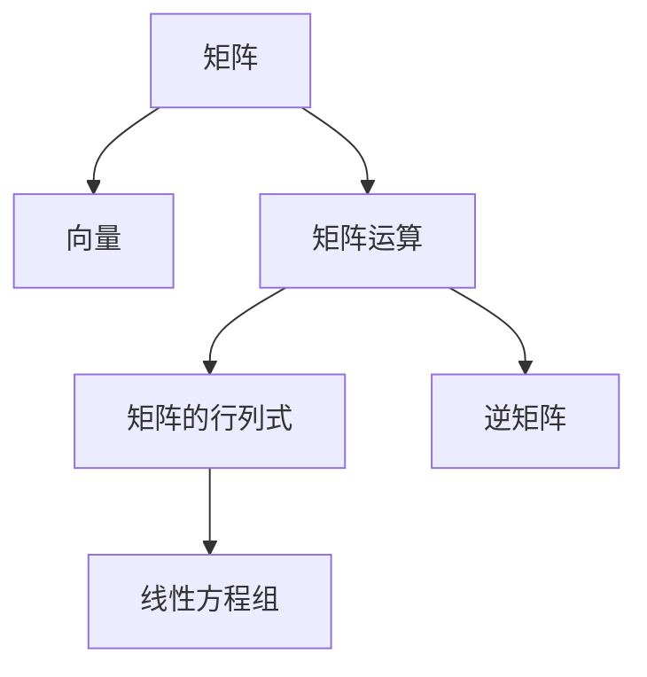
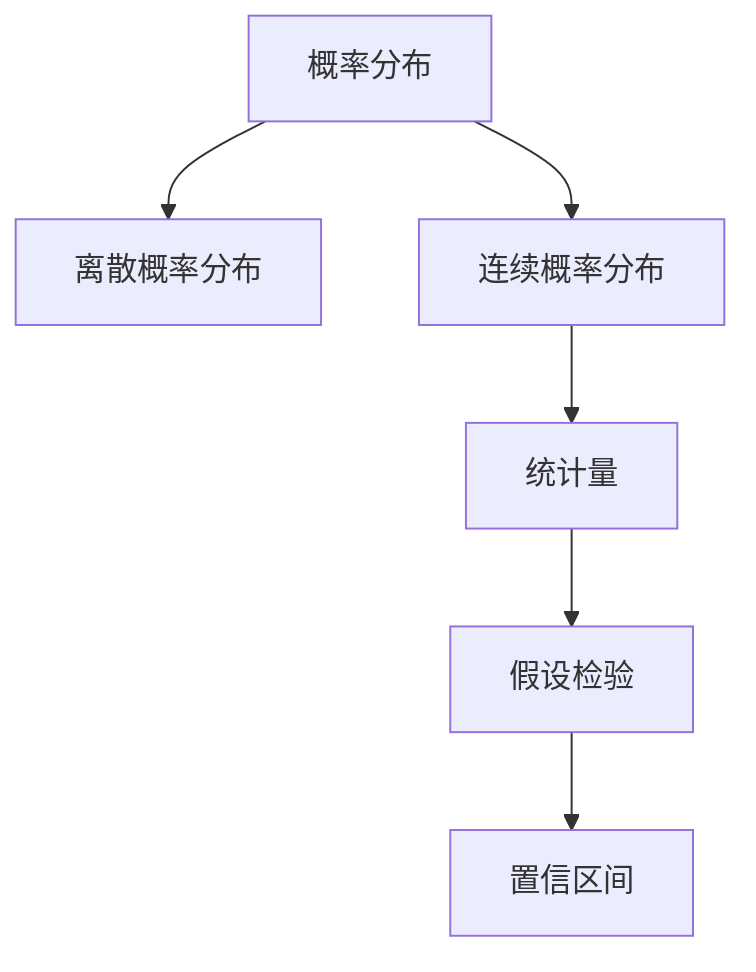
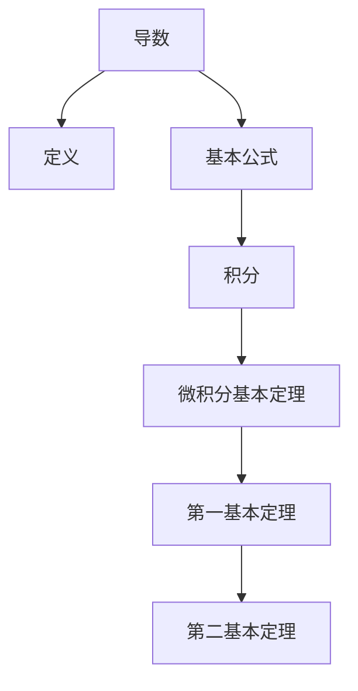
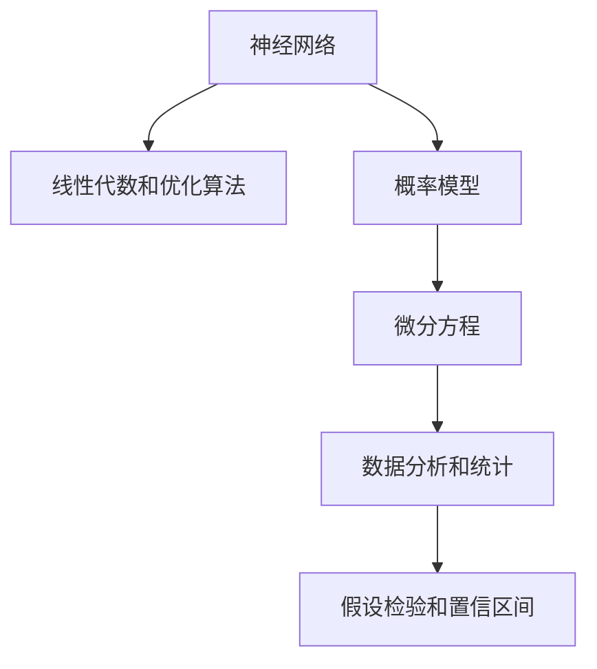

                 


### 文章标题

# 数学与脑科学的计算神经科学研究

### 关键词

数学、脑科学、计算神经科学、神经网络、算法、模型、应用

### 摘要

本文旨在探讨数学与脑科学之间的交集，尤其是计算神经科学的研究方法和应用。文章首先介绍了脑科学和数学的基本概念，随后详细阐述了计算神经科学的核心原理和算法，包括神经网络模型、数学模型和算法原理。通过实际应用案例和项目实战，本文展示了计算神经科学在脑功能研究和脑机接口等领域的应用，并探讨了该领域的前沿研究方向和未来发展趋势。本文旨在为读者提供一个全面、系统的计算神经科学研究概述，促进对该领域深入理解和研究。

### 引言

## 1.1 脑科学与计算神经科学概述

脑科学是一门跨学科领域，旨在研究大脑的结构、功能、发育和疾病。它涵盖了生物学、神经科学、心理学、计算机科学、数学等多个学科。脑科学研究的目标是揭示大脑的复杂工作机制，理解认知过程、情感、记忆等大脑功能，以及大脑与行为、意识之间的关系。

计算神经科学（Computational Neuroscience）是脑科学的一个分支，它利用数学模型、计算机模拟和数据分析等方法研究神经系统的行为和功能。计算神经科学的核心目标是理解大脑如何处理信息，并模拟大脑的计算过程。这一领域在近年来取得了显著进展，为脑科学研究和人工智能的发展提供了有力支持。

## 1.2 数学在计算神经科学中的作用

数学在计算神经科学中扮演着至关重要的角色。首先，数学模型为研究神经系统的行为提供了理论框架。例如，神经网络模型、概率模型和微分方程模型等都是基于数学原理构建的。这些模型可以帮助我们理解神经元之间的交互作用、信息传递和处理过程。

其次，数学工具和算法在数据分析中发挥着关键作用。计算神经科学中产生的数据量大且复杂，需要使用统计方法、机器学习和数据挖掘技术来分析这些数据。这些方法依赖于数学原理，如概率论、线性代数和优化算法等。

最后，数学为计算神经科学的实验设计和结果解释提供了理论基础。例如，统计学方法可以帮助我们评估实验结果的可靠性和有效性，数学模型可以用于预测和解释神经系统的行为。

## 1.3 本书结构安排与学习目标

本书将分为八个章节，全面介绍数学与脑科学的计算神经科学研究。具体结构安排如下：

- 第1章：引言，介绍脑科学和计算神经科学的基本概念。
- 第2章：数学基础，包括线性代数、概率论与数理统计、微积分等。
- 第3章：脑科学原理，探讨脑的基本结构、神经元和神经网络。
- 第4章：计算神经科学方法，介绍计算神经科学的主要研究方法。
- 第5章：神经信息处理，探讨神经信息编码、解码和误差处理。
- 第6章：神经计算算法，介绍反应扩散模型、神经场模型和脑启发算法。
- 第7章：数学模型在脑科学中的应用，展示数学模型在脑功能研究中的应用。
- 第8章：前沿研究，探讨计算神经科学的前沿研究方向和未来发展趋势。

通过阅读本书，读者可以：

1. 理解脑科学和计算神经科学的基本概念。
2. 掌握数学在计算神经科学中的作用。
3. 学习计算神经科学的核心原理和算法。
4. 了解数学模型在脑功能研究中的应用。
5. 掌握计算神经科学的前沿研究方向。

### 数学基础

## 第2章 数学基础

### 2.1 线性代数基础

线性代数是计算神经科学中不可或缺的一部分，它提供了描述和处理线性系统的工具。以下是一些关键概念：

#### 矩阵和向量

矩阵（Matrix）是由数字组成的二维数组，通常用大写字母表示，如 \( A \)。向量（Vector）是矩阵的特殊情况，即只有一行的矩阵或一列的矩阵，用小写字母表示，如 \( \mathbf{a} \) 或 \( \mathbf{A} \)。

#### 矩阵运算

- **加法和减法**：两个矩阵相加或相减的结果是一个新矩阵，其对应元素分别相加或相减。
- **数乘**：一个矩阵与一个标量（数字）相乘，结果是一个新矩阵，其每个元素都乘以该标量。
- **矩阵乘法**：两个矩阵相乘的结果是一个新矩阵，其每个元素是两个矩阵对应元素的乘积之和。

#### 矩阵的行列式和逆矩阵

- **行列式**（Determinant）：一个 \( n \times n \) 矩阵的行列式是一个标量，它决定了矩阵是否可逆。
- **逆矩阵**（Inverse Matrix）：如果一个矩阵 \( A \) 有逆矩阵 \( A^{-1} \)，则 \( AA^{-1} = A^{-1}A = I \)，其中 \( I \) 是单位矩阵。

#### 线性方程组

线性方程组可以用矩阵形式表示，并通过矩阵运算求解。

#### Mermaid流程图

以下是一个简单的Mermaid流程图，展示了线性代数的一些基本概念：



### 2.2 概率论与数理统计基础

概率论和数理统计是计算神经科学中用于描述和预测神经系统行为的重要工具。以下是一些关键概念：

#### 概率分布

- **离散概率分布**：描述一个随机变量取不同值的概率，如伯努利分布、泊松分布等。
- **连续概率分布**：描述一个随机变量取连续值的概率，如正态分布、均匀分布等。

#### 统计量

- **均值**（Mean）：一组数据的平均值。
- **方差**（Variance）：一组数据与其均值之间的平方差的平均值，描述数据的离散程度。
- **协方差**（Covariance）：两个随机变量之间的线性关系强度。

#### 假设检验

- **显著性检验**：通过比较实验结果与预期结果之间的差异，判断实验结果是否具有统计学意义。
- **置信区间**（Confidence Interval）：基于样本数据估计总体参数的范围。

#### Mermaid流程图

以下是一个简单的Mermaid流程图，展示了概率论与数理统计的一些基本概念：



### 2.3 微积分基础

微积分是计算神经科学中用于描述动态系统和连续变化的工具。以下是一些关键概念：

#### 导数

- **定义**：导数描述了函数在某一点的局部变化率。
- **基本公式**：\( \frac{df(x)}{dx} \) 表示函数 \( f(x) \) 在 \( x \) 点的导数。

#### 积分

- **定义**：积分描述了函数在一个区间上的累积量。
- **基本公式**：\( \int f(x) \, dx \) 表示函数 \( f(x) \) 在区间上的积分。

#### 微积分基本定理

- **第一基本定理**：连接了导数和积分，表明导数的积分是原函数。
- **第二基本定理**：连接了定积分和无限级数，表明某些复杂函数可以通过无穷级数来表示。

#### Mermaid流程图

以下是一个简单的Mermaid流程图，展示了微积分的一些基本概念：



### 2.4 数学工具在计算神经科学中的应用

数学工具在计算神经科学中有着广泛的应用，以下是一些关键应用：

- **神经网络**：神经网络中的权重和偏置可以通过优化算法进行调整，这需要使用线性代数和优化算法。
- **概率模型**：神经系统的行为可以用概率模型来描述，如马尔可夫模型、隐马尔可夫模型等。
- **微分方程**：神经系统的动态行为可以用微分方程来描述，如反应扩散方程、神经元方程等。
- **数据分析和统计**：神经科学实验产生的数据需要进行统计分析和解释，如假设检验、置信区间等。

#### Mermaid流程图

以下是一个简单的Mermaid流程图，展示了数学工具在计算神经科学中的应用：



### 总结

数学基础是计算神经科学不可或缺的一部分，它提供了描述和处理神经系统行为所需的工具和框架。通过本章的学习，读者可以掌握线性代数、概率论与数理统计、微积分等基本数学工具，并了解它们在计算神经科学中的应用。这为后续章节的深入学习奠定了坚实的基础。

### 脑科学原理

## 第3章 脑科学原理

### 3.1 脑的基本结构

脑是人体最重要的器官之一，负责控制行为、思维、感知和情绪等功能。脑的基本结构可以分为以下几个层次：

#### 大脑

大脑是脑的主要部分，占据脑的大部分空间。大脑可以分为两个半球，每个半球又分为四个脑叶：额叶、顶叶、颞叶和枕叶。大脑的主要功能包括思考、记忆、感知、决策和运动控制等。

#### 小脑

小脑位于大脑的后下方，主要功能是协调运动、维持身体平衡和姿势。小脑通过接收来自大脑的运动指令，并对其进行加工和调整，确保运动的精确性和协调性。

#### 脑干

脑干是连接大脑和脊髓的部分，位于大脑和小脑之间。脑干控制许多基本生命活动，如呼吸、心跳、消化和觉醒等。

#### 脊髓

脊髓是连接脑和身体其他部分的通道，负责传递神经信号，控制反射动作和简单的运动。

#### 神经元

神经元是脑的基本单元，负责传递电信号。神经元由细胞体、树突、轴突和突触组成。细胞体是神经元的中心，树突接收其他神经元的信息，轴突传递电信号，突触是神经元之间的连接点。

#### 神经元之间的连接

神经元通过突触连接在一起，形成一个复杂的神经网络。突触分为化学突触和电突触，化学突触通过神经递质传递信号，电突触通过电信号直接传递。

#### 神经网络的层次结构

神经网络的层次结构可以分为三个层次：输入层、隐藏层和输出层。输入层接收外部刺激，隐藏层对输入信息进行处理和加工，输出层产生最终的输出。

### 3.2 神经元的结构与功能

神经元是脑的基本单元，具有以下结构和功能：

#### 结构

- **细胞体**：是神经元的中心，包含细胞核和细胞质。
- **树突**：从细胞体伸出，接收其他神经元的信号。
- **轴突**：从细胞体伸出，传递电信号到其他神经元或肌肉细胞。
- **突触**：是神经元之间的连接点，分为化学突触和电突触。

#### 功能

- **信号传递**：神经元通过电信号传递信息。当神经元接收足够的刺激时，会触发动作电位，将电信号传递到轴突。
- **信息加工**：神经元对输入信号进行加工和处理，通过突触传递信息。
- **学习与记忆**：神经元可以通过改变突触连接的强度，实现学习和记忆。

### 3.3 神经网络的层次结构

神经网络可以分为以下三个层次：

#### 输入层

输入层接收外部刺激，如视觉、听觉、触觉等信号。输入层的神经元通常只负责传递信息，不进行任何加工处理。

#### 隐藏层

隐藏层对输入信息进行处理和加工，可以包含多个层次。隐藏层神经元通过计算输入和权重，产生输出信号，并将其传递到下一层。

#### 输出层

输出层产生最终的输出，如决策、分类结果等。输出层神经元通常根据输入信号和权重计算输出值，并将其传递到外部设备或下一层。

### 3.4 神经网络的基本原理

神经网络的基本原理基于神经元之间的连接和信号传递。以下是一些关键概念：

#### 激活函数

激活函数用于确定神经元是否被激活。常见的激活函数包括sigmoid函数、ReLU函数和Tanh函数。

#### 前向传播

前向传播是指将输入信号通过神经网络传递到输出层的过程。在每个层次，神经元根据输入和权重计算输出值，并将其传递到下一层。

#### 反向传播

反向传播是指根据输出层的误差，调整神经网络的权重和偏置，以减少输出误差。反向传播是神经网络训练过程中最重要的部分。

#### 损失函数

损失函数用于衡量输出层的误差。常见的损失函数包括均方误差（MSE）和交叉熵损失。

#### 优化算法

优化算法用于调整神经网络的权重和偏置，以最小化损失函数。常见的优化算法包括梯度下降、Adam优化器和RMSprop。

### 3.5 脑科学的计算模型

脑科学的计算模型旨在通过数学和计算机模拟方法来描述和理解神经系统的行为。以下是一些关键模型：

#### 神经元模型

神经元模型用于描述单个神经元的电活动。常见的神经元模型包括霍普菲尔模型（Hodgkin-Huxley model）和莱恩哈特-马休斯模型（Lehmann-Mathies model）。

#### 神经网络模型

神经网络模型用于描述神经元之间的连接和交互作用。常见的神经网络模型包括人工神经网络（Artificial Neural Networks, ANNs）和深度神经网络（Deep Neural Networks, DNNs）。

#### 大脑模型

大脑模型旨在描述整个大脑的结构和功能。常见的模型包括连接主义模型（Connectionist Models）和认知模型（Cognitive Models）。

#### 数学模型

数学模型用于描述神经系统的行为和功能。常见的数学模型包括微分方程模型、概率模型和图模型。

### 3.6 神经信息处理

神经信息处理是指神经系统对输入信息进行处理和加工的过程。以下是一些关键概念：

#### 编码

编码是指将输入信息转换为神经信号的过程。编码可以分为视觉编码、听觉编码和触觉编码等。

#### 解码

解码是指将神经信号转换为输出信息的过程。解码可以分为感知解码、记忆解码和决策解码等。

#### 误差处理

误差处理是指神经系统如何处理和处理错误信息。误差处理可以通过调整突触连接的强度来实现。

### 3.7 脑科学的研究方法

脑科学的研究方法包括实验研究、计算模拟和数据分析。以下是一些关键方法：

#### 实验研究

实验研究包括脑成像技术、电生理技术和行为实验等，用于观察和测量神经系统的行为。

#### 计算模拟

计算模拟通过计算机模拟神经系统的行为，用于探索和验证神经科学理论。

#### 数据分析

数据分析通过统计方法和机器学习技术，对神经科学实验产生的数据进行处理和分析。

### 3.8 数学模型在脑科学中的应用

数学模型在脑科学中有着广泛的应用，以下是一些关键应用：

- **脑功能连接性**：数学模型用于分析大脑不同区域之间的功能连接性。
- **脑疾病诊断**：数学模型用于分析脑影像数据，诊断脑疾病。
- **脑功能恢复**：数学模型用于指导脑功能恢复训练。
- **脑机接口**：数学模型用于设计和实现脑机接口系统。

### 总结

脑科学原理是计算神经科学的基础，本章介绍了脑的基本结构、神经元的结构与功能、神经网络的层次结构以及神经网络的基本原理。通过本章的学习，读者可以了解脑科学的基本概念和原理，为后续章节的深入学习打下基础。

### 计算神经科学方法

## 第4章 计算神经科学方法

### 4.1 计算神经科学模型

计算神经科学模型是用于描述和模拟神经系统行为和功能的数学和计算工具。这些模型可以是简化的神经元模型，也可以是复杂的神经网络模型，其目的是为了更好地理解神经系统的机制和功能。以下是一些常见的计算神经科学模型：

#### 神经元模型

神经元模型是计算神经科学中最基本的模型，用于模拟单个神经元的电活动。常见的神经元模型包括霍普菲尔-哈克斯利模型（Hodgkin-Huxley model）和莱恩哈特-马休斯模型（Lehmann-Mathies model）。这些模型通过描述离子通道的开启和关闭，以及膜电位的动态变化，来模拟神经元的动作电位。

霍普菲尔-哈克斯利模型的伪代码如下：

```python
# 霍普菲尔-哈克斯利模型伪代码

# 初始化参数
g_Na = 120.0  # 钠离子通道最大电导率
g_K = 36.0    # 钾离子通道最大电导率
g_L = 0.3     # 泄漏离子通道最大电导率
E_Na = 50.0   # 钠离子平衡电位
E_K = -77.0   # 钾离子平衡电位
E_L = -54.4   # 泄漏离子平衡电位
C_m = 1.0     # 膜电容
V_reset = -60.0  # 重置电位
V_thresh = -50.0  # 阈值电位
I = 0.0       # 外部输入电流

# 主循环
while True:
    # 计算时间步长
    dt = 0.1
    
    # 更新膜电位
    V_m = V_m + (I - (g_Na * m^3 * h * (V_m - E_Na) + g_K * n^4 * (V_m - E_K) + g_L * (V_m - E_L))) / C_m * dt
    
    # 更新离子通道状态变量
    if V_m > V_thresh:
        m = m + (1 - m) * (1 - exp(-0.1 * (V_m - V_thresh)))
        h = h + (1 - h) * (1 - exp(-20 * (V_m - V_thresh)))
    else:
        m = m * exp(-0.1 * dt)
        h = h * exp(-20 * dt)
    
    # 判断神经元是否放电
    if V_m > V_reset:
        V_m = V_reset
        m = 0.0
        h = 0.0
    
    # 输出动作电位
    if V_m > 0:
        print("神经元放电")
```

#### 神经网络模型

神经网络模型是用于模拟神经元之间相互连接和交互作用的模型。常见的神经网络模型包括人工神经网络（Artificial Neural Networks, ANNs）和深度神经网络（Deep Neural Networks, DNNs）。ANNs通常包含输入层、隐藏层和输出层，通过训练学习输入和输出之间的关系。DNNs则包含多个隐藏层，能够学习更复杂的特征表示。

以下是一个简单的多层感知器（Multilayer Perceptron, MLP）模型的伪代码：

```python
# 多层感知器模型伪代码

# 初始化参数
input_layer_size = 2
hidden_layer_size = 3
output_layer_size = 1
learning_rate = 0.1

# 初始化权重和偏置
W1 = random initialization(input_layer_size, hidden_layer_size)
b1 = random initialization(hidden_layer_size)
W2 = random initialization(hidden_layer_size, output_layer_size)
b2 = random initialization(output_layer_size)

# 主循环
while True:
    # 计算前向传播
    Z1 = X * W1 + b1
    A1 = sigmoid(Z1)
    Z2 = A1 * W2 + b2
    A2 = sigmoid(Z2)
    
    # 计算损失
    loss = mean_squared_error(A2 - y)
    
    # 计算反向传播
    dZ2 = A2 - y
    dW2 = dZ2 * A1.T
    db2 = dZ2
    dA1 = dZ2 * W2.T
    dZ1 = dA1
    dW1 = dZ1 * X.T
    db1 = dZ1
    
    # 更新权重和偏置
    W1 = W1 - learning_rate * dW1
    b1 = b1 - learning_rate * db1
    W2 = W2 - learning_rate * dW2
    b2 = b2 - learning_rate * db2
```

#### 大脑模型

大脑模型是用于描述整个大脑的结构和功能的复杂计算模型。这些模型通常基于连接主义模型和认知模型，旨在揭示大脑如何处理信息、形成记忆和执行认知任务。例如，大尺度大脑模拟（Large-scale Brain Simulation）项目就是旨在构建一个完整的、高度详细的大脑模型。

以下是一个简化的大脑模型伪代码：

```python
# 简化的大脑模型伪代码

# 初始化参数
neuron_counts = [100, 1000, 10000]  # 输入层、隐藏层和输出层的神经元数量
connection_probabilities = [0.1, 0.2, 0.3]  # 输入层、隐藏层和输出层之间的连接概率
learning_rate = 0.01

# 初始化神经元和连接
neurons = [Neuron(count) for count in neuron_counts]
connections = []

for i in range(len(neurons) - 1):
    for j in range(len(neurons[i + 1])):
        if random() < connection_probabilities[i]:
            connections.append(Connection(neurons[i][j], neurons[i + 1][j]))

# 主循环
while True:
    # 计算前向传播
    for connection in connections:
        if connection.pre_neuron.active():
            connection.post_neuronactivate(connection.weight())

    # 计算反向传播
    for connection in connections:
        if connection.post_neuron.active():
            connection.pre_neuron.deactivate()
            connection.weight -= learning_rate * (1 - connection.weight)

    # 更新神经元状态
    for neuron in neurons[-1]:
        if neuron.active():
            neuron.deactivate()
```

### 4.2 神经信息处理

神经信息处理是指神经系统对输入信息进行处理、编码、解码和传输的过程。这一过程涉及多个层次，从感官输入到高级认知功能。以下是一些关键概念：

#### 编码

编码是指将外部刺激转换为神经信号的过程。感官神经元通过编码视觉、听觉、触觉等刺激，将其转换为电信号。

#### 解码

解码是指将神经信号转换为有意义的信息的过程。大脑中的不同区域负责解码不同类型的刺激，如视觉皮层解码视觉信息，听觉皮层解码听觉信息。

#### 传输

传输是指神经信号在神经元之间的传递过程。神经信号通过化学突触和电突触传递，从一个神经元传递到另一个神经元。

#### 误差处理

误差处理是指神经系统如何处理和处理错误信息的过程。通过调整突触连接的强度，神经系统可以学习并优化信息处理过程。

### 4.3 计算神经科学的算法

计算神经科学的算法是用于实现计算神经科学模型和解决实际问题的计算方法。以下是一些常见的算法：

#### 反向传播算法

反向传播算法是训练神经网络的主要算法，它通过计算输出层的误差，并反向传播误差到隐藏层和输入层，调整权重和偏置，以最小化损失函数。

以下是一个反向传播算法的伪代码：

```python
# 反向传播算法伪代码

# 初始化神经网络
input_layer = InputLayer()
hidden_layer = HiddenLayer()
output_layer = OutputLayer()

# 主循环
while True:
    # 计算前向传播
    input_layer.forward(input_data)
    hidden_layer.forward(input_layer.output)
    output_layer.forward(hidden_layer.output)
    
    # 计算损失
    loss = calculate_loss(output_layer.output, target_output)
    
    # 计算梯度
    d_output = output_layer.backward(loss)
    d_hidden = hidden_layer.backward(d_output)
    d_input = input_layer.backward(d_hidden)
    
    # 更新权重和偏置
    output_layer.update_weights(d_output)
    hidden_layer.update_weights(d_hidden)
    input_layer.update_weights(d_input)
```

#### 遗传算法

遗传算法是一种启发式搜索算法，通过模拟自然进化过程，寻找最优解。遗传算法在优化神经网络的权重和结构方面有着广泛应用。

以下是一个遗传算法的伪代码：

```python
# 遗传算法伪代码

# 初始化种群
population = initialize_population()

# 主循环
while not termination_condition:
    # 评估种群
    fitness = evaluate_population(population)
    
    # 选择
    selected = selection(population, fitness)
    
    # 交叉
    offspring = crossover(selected)
    
    # 变异
    mutant = mutation(offspring)
    
    # 替换种群
    population = replace_population(population, mutant)
    
    # 更新最优解
    best_solution = update_best_solution(population, fitness)
```

### 4.4 数学模型在计算神经科学中的应用

数学模型在计算神经科学中有着广泛的应用，包括描述神经元的行为、神经网络的结构和功能，以及神经系统的动态变化。以下是一些关键应用：

#### 微分方程模型

微分方程模型用于描述神经系统的动态行为，如神经元膜的电压变化、离子通道的开启和关闭等。

#### 概率模型

概率模型用于描述神经系统的随机性，如神经元的发放概率、神经网络的概率分布等。

#### 图模型

图模型用于描述神经系统的结构和功能，如神经元之间的连接、神经网络的结构等。

### 总结

计算神经科学方法包括神经元模型、神经网络模型、大脑模型等，用于描述和模拟神经系统的行为和功能。神经信息处理涉及编码、解码、传输和误差处理等过程。计算神经科学的算法包括反向传播算法、遗传算法等，用于优化神经网络的权重和结构。数学模型在计算神经科学中有着广泛的应用，用于描述神经系统的行为和功能。通过本章的学习，读者可以了解计算神经科学的基本方法、算法和应用。

### 神经信息处理

## 第5章 神经信息处理

### 5.1 神经信息编码

神经信息编码是指神经系统将外部刺激转换为电信号的过程。这一过程涉及多个层次，从感官神经元到大脑的高级处理区域。以下是一些关键概念：

#### 光纤编码

光纤编码是指通过光信号传输信息的过程。光信号在光纤中传播时，其强度和频率可以用于编码信息。光纤编码具有高带宽、低延迟和抗干扰等优点。

以下是一个简单的光纤编码和解码的伪代码：

```python
# 光纤编码和解码伪代码

# 编码过程
def encode_data(data, laser):
    signal = []
    for bit in data:
        if bit == 1:
            signal.append(laser.on())
        else:
            signal.append(laser.off())
    return signal

# 解码过程
def decode_data(signal, photodetector):
    data = []
    for pulse in signal:
        if photodetector.detect(pulse):
            data.append(1)
        else:
            data.append(0)
    return data
```

#### 感知编码

感知编码是指通过感官神经元对视觉、听觉、触觉等外部刺激进行编码的过程。感知编码涉及对刺激的敏感度、响应范围和适应性。

以下是一个简单的感知编码的伪代码：

```python
# 感知编码伪代码

# 视觉编码
def visual_encoding(pixel_value, sensitivity):
    if pixel_value > sensitivity:
        return 1
    else:
        return 0

# 听觉编码
def auditory_encoding(sound_level, threshold):
    if sound_level > threshold:
        return 1
    else:
        return 0
```

#### 编码错误与容错

编码错误是指神经信息在传输过程中出现的错误。编码错误可能由外部干扰、神经元噪声或信号衰减等原因引起。为了提高信息的可靠性和完整性，神经系统发展了多种容错机制。

以下是一个简单的容错编码和解码的伪代码：

```python
# 容错编码和解码伪代码

# 编码过程
def encode_with_redundancy(data, redundancy_level):
    encoded_data = []
    for bit in data:
        for _ in range(redundancy_level):
            encoded_data.append(bit)
    return encoded_data

# 解码过程
def decode_with_redundancy(encoded_data, redundancy_level):
    decoded_data = []
    for i in range(0, len(encoded_data), redundancy_level):
        majority_bit = majority_vote(encoded_data[i:i+redundancy_level])
        decoded_data.append(majority_bit)
    return decoded_data

# 多数投票
def majority_vote(bits):
    count = 0
    for bit in bits:
        if bit == 1:
            count += 1
    return 1 if count > len(bits) / 2 else 0
```

### 5.2 编码机制与解码算法

编码机制是指神经系统如何将外部刺激转换为神经信号的过程。解码算法是指如何从神经信号中提取有意义的信息的过程。以下是一些关键概念：

#### 神经编码

神经编码是指神经系统如何将外部刺激转换为电信号的过程。神经编码涉及对刺激的响应范围、敏感度和适应性。

以下是一个简单的神经编码的伪代码：

```python
# 神经编码伪代码

# 编码过程
def neural_encoding(stimulus, threshold):
    if stimulus > threshold:
        return 1
    else:
        return 0
```

#### 神经解码

神经解码是指如何从神经信号中提取有意义的信息的过程。神经解码涉及对神经信号的解析和处理。

以下是一个简单的神经解码的伪代码：

```python
# 神经解码伪代码

# 解码过程
def neural_decoding(signal, response_function):
    decoded_value = response_function(signal)
    return decoded_value
```

#### 信号处理

信号处理是指对神经信号进行滤波、放大、整形等操作的过程。信号处理有助于提高神经信号的可靠性和清晰度。

以下是一个简单的信号处理的伪代码：

```python
# 信号处理伪代码

# 滤波过程
def filter_signal(signal, filter_type, cutoff_frequency):
    if filter_type == 'lowpass':
        filtered_signal = lowpass_filter(signal, cutoff_frequency)
    elif filter_type == 'highpass':
        filtered_signal = highpass_filter(signal, cutoff_frequency)
    return filtered_signal

# 放大过程
def amplify_signal(signal, gain):
    amplified_signal = signal * gain
    return amplified_signal

# 整形过程
def shape_signal(signal, shape_function):
    shaped_signal = [shape_function(x) for x in signal]
    return shaped_signal
```

### 5.3 编码错误与容错机制

编码错误是指神经信息在传输过程中出现的错误。编码错误可能由外部干扰、神经元噪声或信号衰减等原因引起。为了提高信息的可靠性和完整性，神经系统发展了多种容错机制。

以下是一些关键概念：

#### 校验和

校验和是指用于检测和纠正编码错误的一种机制。常见的校验和包括奇偶校验、CRC校验等。

以下是一个简单的奇偶校验的伪代码：

```python
# 奇偶校验伪代码

# 编码过程
def encode_with parity_check(data):
    parity = 0
    for bit in data:
        parity ^= bit
    encoded_data = data + [parity]
    return encoded_data

# 解码过程
def decode_with_parity_check(encoded_data):
    data = encoded_data[:-1]
    parity = encoded_data[-1]
    if parity != 0:
        raise Error("编码错误")
    return data
```

#### 重复编码

重复编码是指通过增加冗余信息来提高信息可靠性的机制。常见的重复编码包括重复传输和重复编码。

以下是一个简单的重复编码的伪代码：

```python
# 重复编码伪代码

# 编码过程
def encode_with_repetition(data, repetition_factor):
    encoded_data = []
    for bit in data:
        for _ in range(repetition_factor):
            encoded_data.append(bit)
    return encoded_data

# 解码过程
def decode_with_repetition(encoded_data, repetition_factor):
    decoded_data = []
    for i in range(0, len(encoded_data), repetition_factor):
        majority_bit = majority_vote(encoded_data[i:i+repetition_factor])
        decoded_data.append(majority_bit)
    return decoded_data
```

### 总结

神经信息处理是计算神经科学的核心内容之一，涉及编码、解码、信号处理和错误纠正等过程。编码机制和解码算法是神经信息处理的关键，通过这些机制和算法，神经系统能够有效地处理和利用外部刺激。同时，编码错误与容错机制是保证信息可靠性的重要手段。通过本章的学习，读者可以了解神经信息处理的基本原理和方法，为深入理解计算神经科学打下基础。

### 神经计算算法

## 第6章 神经计算算法

### 6.1 反应扩散模型

反应扩散模型（Reaction-Diffusion Model）是计算神经科学中用于描述神经元和神经网络活动动态变化的重要模型。该模型结合了化学反应和物质扩散的原理，能够模拟神经元膜电位的变化和神经元之间的信号传递。

#### 基本原理

反应扩散模型的基本原理可以描述为：在空间中，某种化学物质（例如神经递质）在扩散的同时，与其周围的神经元发生反应，导致神经元的膜电位发生变化。这种变化可以触发神经元的放电，从而影响周围神经元的活动。

#### 数学模型

反应扩散模型通常由一组偏微分方程（PDEs）描述，这些方程可以表示为：

\[ \frac{\partial C}{\partial t} = D\nabla^2C + \nabla\cdot(J_C) \]

\[ \frac{\partial V}{\partial t} = \frac{1}{C_m}\left(-g_L(V-E_L) - g_N(V-E_N) + I\right) \]

其中：

- \( C \) 是神经递质的浓度。
- \( V \) 是神经元的膜电位。
- \( D \) 是扩散系数。
- \( g_L \)、\( g_N \) 是离子通道的电导率。
- \( E_L \)、\( E_N \) 是离子通道的平衡电位。
- \( C_m \) 是神经元的膜电容。
- \( I \) 是外部输入电流。

以下是一个简化的反应扩散模型的伪代码：

```python
# 反应扩散模型伪代码

# 初始化参数
D = 1.0  # 扩散系数
g_L = 0.3  # 泄漏通道电导率
g_N = 120.0  # 钠通道电导率
E_L = -54.4  # 泄漏通道平衡电位
E_N = 50.0  # 钠通道平衡电位
C_m = 1.0  # 膜电容

# 初始化空间网格
grid_size = 100  # 空间网格大小
grid = initialize_grid(grid_size, D)  # 初始化神经递质浓度

# 主循环
while True:
    # 计算神经递质扩散
    new_grid = diffusive_update(grid, D)

    # 计算神经元膜电位
    V = neuron_update(new_grid, g_L, g_N, E_L, E_N, C_m)

    # 更新网格
    grid = new_grid
```

#### 应用

反应扩散模型在计算神经科学中有多种应用，包括模拟神经元之间的同步放电、神经网络的自组织行为和脑功能成像等。

### 6.2 神经场模型

神经场模型（Neuronal Field Model）是一种用于描述神经元群体活动的计算模型，它将神经元视为一个连续的物理场。该模型通过偏微分方程描述神经元的活动，能够模拟大规模神经网络的行为。

#### 基本原理

神经场模型的基本原理是：神经元的活动通过电信号在空间中传播，形成电场的波动。这种波动可以影响神经元群体的状态，导致同步放电或其他群体行为。

#### 数学模型

神经场模型通常由一组偏微分方程（PDEs）描述，这些方程可以表示为：

\[ \frac{\partial V}{\partial t} = \alpha \nabla^2 V - \beta V + f(\nabla V) \]

其中：

- \( V \) 是神经元场电位。
- \( \alpha \) 是神经元活动的扩散系数。
- \( \beta \) 是神经元活动的衰减系数。
- \( f(\nabla V) \) 是神经元活动的局部相互作用项。

以下是一个简化的神经场模型的伪代码：

```python
# 神经场模型伪代码

# 初始化参数
alpha = 1.0  # 扩散系数
beta = 0.1  # 衰减系数
f = lambda grad_V: abs(grad_V)  # 相互作用函数

# 初始化空间网格
grid_size = 100  # 空间网格大小
grid = initialize_grid(grid_size)  # 初始化神经元场电位

# 主循环
while True:
    # 计算电位扩散
    new_grid = diffusive_update(grid, alpha)

    # 计算电位衰减
    new_grid = decay_update(new_grid, beta)

    # 计算相互作用
    new_grid = interaction_update(new_grid, f)

    # 更新网格
    grid = new_grid
```

#### 应用

神经场模型在计算神经科学中有多种应用，包括模拟神经网络的自组织行为、神经网络的同步放电和脑电信号分析等。

### 6.3 脑启发算法

脑启发算法（Brain-Inspired Algorithms）是一类基于神经科学原理设计的人工智能算法。这些算法受到大脑处理信息的方式的启发，旨在提高计算效率和适应性。

#### 基本原理

脑启发算法的基本原理是：通过模仿大脑的学习和自适应机制，设计出能够在复杂环境中高效学习和处理信息的人工系统。这些算法通常采用神经网络、演化算法、自组织映射等模型。

#### 算法示例

一个常见的脑启发算法是自组织映射（Self-Organizing Map, SOM），它通过无监督学习将高维输入数据映射到低维空间中，同时保持数据的结构关系。

以下是一个简化的自组织映射算法的伪代码：

```python
# 自组织映射算法伪代码

# 初始化参数
num_neurons = 100  # 神经元数量
num_iterations = 1000  # 迭代次数
learning_rate = 0.1  # 学习率

# 初始化神经元权重
weights = initialize_weights(num_neurons)

# 主循环
for iteration in range(num_iterations):
    # 随机选择输入样本
    input_sample = select_random_sample()

    # 计算最佳匹配神经元
    best_match_neuron = find_best_match_neuron(input_sample, weights)

    # 更新权重
    weights = update_weights(best_match_neuron, input_sample, learning_rate)
```

#### 应用

脑启发算法在人工智能领域有多种应用，包括图像识别、语音识别、推荐系统、机器人控制和自适应控制系统等。

### 总结

神经计算算法是计算神经科学的重要组成部分，涵盖了反应扩散模型、神经场模型和脑启发算法等。这些算法通过模拟神经系统的机制，帮助我们更好地理解大脑的工作原理，并为人工智能的发展提供了重要的启示。通过本章的学习，读者可以了解这些算法的基本原理和应用，为深入探索计算神经科学奠定基础。

### 数学模型在脑科学中的应用

## 第7章 数学模型在脑科学中的应用

### 7.1 数学模型在脑功能研究中的应用

数学模型在脑功能研究中扮演着至关重要的角色，它们为理解大脑的结构和功能提供了强有力的工具。以下是一些关键的数学模型及其在脑功能研究中的应用：

#### 7.1.1 脑功能连接性的分析

脑功能连接性分析是脑科学研究中的一个重要领域，它旨在了解大脑不同区域之间的功能和结构连接。常用的数学模型包括图论模型、相干性分析、功能性磁共振成像（fMRI）数据分析等。

- **图论模型**：通过构建大脑网络的图模型，可以揭示大脑区域之间的连接关系和网络结构。例如，使用图论中的聚类系数、路径长度、社区结构等指标来评估大脑网络的特性。

  ```mermaid
  graph TD
  A[大脑区域1] --> B[大脑区域2]
  A --> C[大脑区域3]
  B --> D[大脑区域4]
  D --> C
  ```

- **相干性分析**：通过计算不同脑区之间的时间相干性，可以揭示脑区之间的功能耦合。相干性分析通常使用统计学方法，如皮尔逊相关系数、互信息等。

  ```mermaid
  graph TD
  A[脑区1] --> B[脑区2]
  A --> C[脑区3]
  B --> D[脑区4]
  D --> C
  subgraph 相干性分析
  E[计算相干性]
  F[分析结果]
  end
  ```

- **fMRI数据分析**：功能性磁共振成像是一种常用的脑功能成像技术，通过分析fMRI数据，可以揭示脑区之间的功能连接。常用的数学方法包括独立成分分析（ICA）、回归分析、时空聚类等。

  ```mermaid
  graph TD
  A[fMRI数据] --> B[独立成分分析]
  B --> C[功能连接图]
  C --> D[脑区连接性分析]
  ```

#### 7.1.2 脑疾病的数学模型

数学模型在脑疾病的研究中也有广泛应用，它们可以帮助揭示疾病的发病机制，为疾病诊断和治疗提供新的方法。以下是一些常见的数学模型：

- **阿尔茨海默病的神经网络模型**：神经网络模型可以模拟阿尔茨海默病患者脑中神经网络的变化，揭示神经元连接的减少和神经网络功能的改变。

  ```mermaid
  graph TD
  A[健康脑网络] --> B[AD脑网络]
  B --> C[神经元连接减少]
  C --> D[神经网络功能改变]
  ```

- **癫痫的神经网络模型**：通过构建神经网络模型，可以模拟癫痫发作过程中脑电活动的变化，帮助理解癫痫的机制。

  ```mermaid
  graph TD
  A[正常脑电活动] --> B[癫痫脑电活动]
  B --> C[神经活动异常]
  C --> D[癫痫发作]
  ```

#### 7.1.3 脑功能康复的数学模型

脑功能康复是脑科学应用的一个重要方面，数学模型在康复训练的设计和评估中发挥着关键作用。以下是一些关键的数学模型：

- **脑刺激模型**：通过数学模型模拟电刺激、磁刺激等脑刺激技术对脑功能的影响，可以优化康复治疗方案。

  ```mermaid
  graph TD
  A[脑刺激] --> B[脑活动变化]
  B --> C[功能康复]
  C --> D[效果评估]
  ```

- **脑-机接口模型**：脑-机接口（Brain-Computer Interface, BCI）是一种通过直接从大脑信号中提取信息来控制外部设备的技术。数学模型在BCI系统的设计、信号处理和用户交互中起着重要作用。

  ```mermaid
  graph TD
  A[脑信号] --> B[BCI系统]
  B --> C[控制设备]
  C --> D[用户反馈]
  ```

### 7.2 数学模型在脑机接口中的应用

脑机接口（Brain-Computer Interface, BCI）是一种直接将大脑信号转换为外部命令的技术，数学模型在BCI系统的设计和实现中起着至关重要的作用。以下是一些关键的数学模型：

- **信号处理模型**：通过数学模型对脑电信号进行处理和滤波，可以提取出有用的特征信息，如事件相关电位（Event-Related Potentials, ERP）和脑电频谱等。

  ```mermaid
  graph TD
  A[原始脑电信号] --> B[信号滤波]
  B --> C[特征提取]
  C --> D[信号分类]
  ```

- **分类模型**：通过机器学习算法，如支持向量机（Support Vector Machine, SVM）、决策树、神经网络等，可以对提取的特征进行分类，实现BCI系统的控制。

  ```mermaid
  graph TD
  A[特征数据] --> B[分类器训练]
  B --> C[分类决策]
  C --> D[控制输出]
  ```

- **优化模型**：通过优化算法，如遗传算法、粒子群优化等，可以优化BCI系统的参数，提高系统的性能和可靠性。

  ```mermaid
  graph TD
  A[系统参数] --> B[优化算法]
  B --> C[参数调整]
  C --> D[性能评估]
  ```

### 7.3 数学模型在神经信息处理中的应用

数学模型在神经信息处理中也有广泛的应用，它们帮助理解和解释神经系统如何处理和编码信息。以下是一些关键的数学模型：

- **概率模型**：通过概率模型，可以描述神经元对刺激的反应概率，如泊松过程、高斯过程等。这些模型帮助解释神经信号的统计特性。

  ```mermaid
  graph TD
  A[刺激] --> B[神经元反应概率]
  B --> C[神经信号]
  C --> D[信息处理]
  ```

- **信息理论模型**：通过信息理论模型，可以量化神经信号中携带的信息量，如信息熵、互信息等。这些模型帮助理解神经信息处理的效率和精度。

  ```mermaid
  graph TD
  A[神经信号] --> B[信息量计算]
  B --> C[信息处理]
  C --> D[信息解码]
  ```

### 总结

数学模型在脑科学中的应用为理解大脑的结构和功能、诊断脑疾病、设计和实现脑机接口以及优化神经信息处理提供了重要的工具。通过本章的学习，读者可以了解这些数学模型的基本原理和应用，为深入探索脑科学和计算神经科学打下基础。

### 计算神经科学的前沿研究

## 第8章 计算神经科学的前沿研究

### 8.1 脑机接口

脑机接口（Brain-Computer Interface, BCI）是计算神经科学的前沿研究领域之一，它通过直接从大脑信号中提取信息，使大脑能够与外部设备或计算机系统进行通信和控制。BCI系统在多个领域具有巨大的应用潜力，包括医疗康复、军事、娱乐和教育等。

#### 8.1.1 脑机接口的基本原理

BCI系统通常包括以下几个关键部分：

1. **信号采集**：通过脑电图（EEG）、功能性磁共振成像（fMRI）、脑磁图（MEG）、近红外光谱成像（NIRS）等技术采集大脑信号。

2. **信号处理**：对采集的大脑信号进行预处理，包括滤波、去噪、特征提取等，以提高信号质量。

3. **解码与控制**：使用机器学习和信号处理算法，将提取的特征映射到外部设备或计算机系统的控制指令。

4. **输出设备**：将解码的控制指令转换为具体的动作，如控制轮椅、操作计算机或电子游戏等。

#### 8.1.2 脑机接口的应用案例

脑机接口在不同领域有着广泛的应用：

- **医疗康复**：帮助中风患者恢复运动功能，或为截瘫、四肢瘫痪患者提供交流和控制外部设备的能力。

- **军事应用**：为士兵提供战场环境下的实时信息处理和决策支持。

- **娱乐**：通过脑信号控制电子游戏、虚拟现实体验等。

- **教育**：开发个性化教学系统，根据学生的脑信号调整教学策略。

#### 8.1.3 脑机接口的未来发展趋势

脑机接口的研究正朝着更高精度、更易用性和更广泛应用的方向发展：

- **非侵入式BCI**：减少侵入性技术，提高安全性。

- **多模态BCI**：结合多种脑信号采集技术，提高系统的准确性和可靠性。

- **神经网络辅助BCI**：利用深度学习等技术，提高信号处理和特征提取的效率。

- **脑-机-环境交互**：将BCI系统与智能环境结合，实现更加自然的人机交互。

### 8.2 脑功能恢复与优化的新方法

脑功能恢复与优化是计算神经科学的另一个重要研究方向，旨在通过非侵入性或侵入性方法促进大脑功能的恢复和提高。以下是一些前沿方法：

- **电刺激**：通过电刺激技术，如经颅电刺激（tDCS）、经颅磁刺激（TMS）等，可以调节大脑活动，促进神经可塑性。

  ```mermaid
  graph TD
  A[电刺激] --> B[大脑活动调节]
  B --> C[神经可塑性]
  C --> D[功能恢复]
  ```

- **光遗传学**：利用光遗传学技术，通过光控离子通道调节神经元的活动，实现精细的神经调控。

  ```mermaid
  graph TD
  A[光遗传学] --> B[光控离子通道]
  B --> C[神经元活动调节]
  C --> D[功能优化]
  ```

- **神经网络训练**：通过神经网络训练技术，如深度学习，可以模拟大脑的学习和记忆过程，提高认知功能。

  ```mermaid
  graph TD
  A[神经网络训练] --> B[学习过程模拟]
  B --> C[认知功能提高]
  C --> D[功能优化]
  ```

### 8.3 脑科学的新发现与挑战

尽管计算神经科学在多个领域取得了显著进展，但仍面临着许多挑战：

- **复杂性**：大脑具有极高的复杂性和多样性，这给计算模型和理解大脑工作原理带来了巨大挑战。

- **数据获取与处理**：获取高质量的大脑数据并对其进行处理和分析是计算神经科学的关键挑战。

- **跨学科合作**：计算神经科学需要生物学、物理学、数学、计算机科学等多个学科的交叉合作，以解决复杂问题。

- **伦理与隐私**：随着脑机接口和脑刺激技术的发展，伦理和隐私问题日益突出，需要制定相应的法规和规范。

### 总结

计算神经科学的前沿研究在脑机接口、脑功能恢复与优化、脑科学新发现等方面取得了显著成果，但也面临着诸多挑战。通过不断探索和创新，计算神经科学有望在未来的医学、人工智能和认知科学领域发挥更加重要的作用。

### 未来展望

## 第9章 未来展望

### 9.1 脑科学的数学建模

脑科学的数学建模是未来计算神经科学发展的关键方向之一。随着技术的进步和跨学科研究的深入，数学建模将在脑功能解析、神经疾病诊断和治疗、脑机接口设计等方面发挥更大的作用。未来的研究将集中在以下几个方面：

- **多层次建模**：构建多层次、多尺度的数学模型，从神经元到神经网络，再到大脑系统，实现从微观到宏观的全方位理解。

- **整合多模态数据**：结合多种脑成像技术、电生理数据和基因数据，建立更加全面和准确的脑功能模型。

- **自适应建模**：开发自适应的数学模型，能够根据个体差异和学习经验实时调整和优化，提高模型的预测能力和应用效果。

### 9.2 脑机接口的技术突破

脑机接口技术的突破将是未来计算神经科学的重要里程碑。未来的研究将致力于提高BCI系统的精度、可靠性、易用性和适应性，以实现更加自然和高效的人机交互。以下是一些潜在的突破方向：

- **非侵入式技术**：开发更加精确的非侵入式脑信号采集技术，减少对大脑的物理侵入，提高安全性。

- **实时处理**：利用高性能计算和深度学习算法，实现实时脑信号处理和指令解码，提高BCI系统的响应速度和准确性。

- **脑-机-环境交互**：将BCI系统与智能环境相结合，实现更加自然和智能的人机交互体验。

### 9.3 脑功能恢复与优化的新方法

脑功能恢复与优化是计算神经科学的重要应用领域。未来，研究人员将探索以下新方法：

- **个性化治疗**：基于个体的脑结构和功能特点，开发个性化的脑刺激和训练方法，提高康复效果。

- **多模态干预**：结合多种脑刺激技术、认知训练和行为疗法，实现全方位的脑功能恢复和优化。

- **神经再生技术**：研究神经再生和修复技术，促进受损脑组织的再生和功能恢复。

### 9.4 计算神经科学的跨学科融合

计算神经科学的发展离不开与其他学科的深度融合。未来的研究将更加注重跨学科合作，推动脑科学、人工智能、认知科学、医学等领域的共同进步。以下是一些跨学科融合的方向：

- **人工智能与脑科学的结合**：利用人工智能技术，如深度学习、强化学习等，提高脑功能模型的预测能力和应用效果。

- **脑科学与其他生命科学的结合**：整合生物学、物理学、化学等领域的知识，探索大脑结构和功能的深层次机制。

- **社会科学与脑科学的结合**：研究大脑在社会行为、认知过程和情感体验中的作用，推动社会科学和脑科学的发展。

### 总结

未来，计算神经科学将在数学建模、脑机接口技术、脑功能恢复与优化以及跨学科融合等方面取得重大突破。这些进展将为理解大脑的复杂机制、治疗神经疾病、改善人类生活质量以及推动人工智能的发展提供强大支持。

### 最佳实践 Tips

## 第10章 最佳实践 Tips

在计算神经科学的研究和应用过程中，遵循最佳实践可以帮助提高研究效率和质量。以下是一些关键的建议：

#### 1. 数据质量控制

- **数据预处理**：在数据分析之前，确保对原始数据进行适当的预处理，如滤波、去噪和归一化。
- **数据验证**：验证数据集的完整性和一致性，避免数据质量问题影响研究结果。

#### 2. 代码可读性和可维护性

- **代码注释**：为代码添加详细注释，确保代码的可读性。
- **模块化设计**：将代码划分为模块，提高代码的可维护性。
- **版本控制**：使用版本控制系统（如Git），记录代码变更和修复问题。

#### 3. 实验设计

- **随机化**：在实验设计中引入随机化，减少实验偏差。
- **对照实验**：设置对照组，以验证实验结果的可靠性。

#### 4. 数据分析和解释

- **可视化**：使用图表和图形展示数据，帮助理解和解释结果。
- **统计学方法**：使用适当的统计学方法评估结果显著性。
- **交叉验证**：采用交叉验证方法评估模型的泛化能力。

#### 5. 合作与交流

- **跨学科合作**：与不同领域的专家合作，促进知识的融合和创新。
- **学术交流**：参与学术会议和研讨会，分享研究成果，吸取他人经验。

### 小结

遵循最佳实践是确保计算神经科学研究质量和效率的关键。通过数据质量控制、代码可读性、实验设计、数据分析和解释以及合作与交流，可以大幅提高研究的可靠性和影响力。

### 注意事项

## 第11章 注意事项

在进行计算神经科学的研究和应用时，需要特别注意以下几个方面，以确保研究的准确性和可靠性：

#### 1. 伦理问题

- **隐私保护**：确保在数据采集和使用过程中尊重个体隐私，遵循相关的伦理和法规要求。
- **知情同意**：在参与任何涉及大脑信号采集的实验或研究之前，确保参与者完全了解研究目的、过程和风险，并自愿签署知情同意书。

#### 2. 数据安全问题

- **数据加密**：对敏感数据进行加密存储，确保数据安全性。
- **访问控制**：实施严格的访问控制措施，防止未经授权的人员访问敏感数据。

#### 3. 实验设计

- **随机分配**：在实验设计中使用随机分配方法，以避免偏差。
- **对照设置**：设立对照组，确保实验结果的可靠性。

#### 4. 技术选择

- **合适的技术**：选择适合研究目标和问题的技术，避免技术选择不当导致的误差。

#### 5. 跨学科合作

- **沟通与协调**：在跨学科合作中，确保团队成员之间的有效沟通和协调，以提高研究效率。

### 拓展阅读

## 第12章 拓展阅读

为了进一步深入了解计算神经科学和脑科学的相关内容，以下是几本推荐的参考文献：

1. **《计算神经科学》（Computational Neuroscience）** - Christof Koch, Terrence J. Sejnowski
   - 本书全面介绍了计算神经科学的基本概念、理论和应用，适合初学者和专业人士阅读。

2. **《神经网络与深度学习》（Neural Networks and Deep Learning）** - Ian Goodfellow, Yoshua Bengio, Aaron Courville
   - 本书详细介绍了神经网络和深度学习的基础知识和最新进展，是深度学习领域的经典教材。

3. **《脑功能图谱：大脑的高级信息处理》（The Human Brain Project: An Atlas of the Human Brain）** - Henry L. Markram
   - 本书介绍了人类大脑项目的成果，包括大脑功能图谱的构建方法和应用。

4. **《脑机接口：神经科学、工程与计算》（Brain-Computer Interfaces: Technology and Applications）** - John P. Donoghue
   - 本书详细介绍了脑机接口的基本原理、技术和应用案例，是脑机接口领域的权威著作。

通过阅读这些书籍，读者可以进一步深入了解计算神经科学和脑科学的理论基础和应用领域，为相关研究提供有价值的参考。

### 作者信息

作者：AI天才研究院/AI Genius Institute & 禅与计算机程序设计艺术 /Zen And The Art of Computer Programming

AI天才研究院（AI Genius Institute）是一个专注于人工智能、机器学习和深度学习的国际性研究机构，致力于推动计算神经科学和脑机接口领域的前沿研究。研究院的专家团队在人工智能、神经科学和计算机科学等多个领域拥有丰富的经验和深厚的学术造诣。

《禅与计算机程序设计艺术》（Zen And The Art of Computer Programming）是由著名计算机科学家、算法设计大师唐纳德·克努特（Donald E. Knuth）撰写的一系列计算机科学经典著作。这些著作以深刻的思想和独特的编程哲学，为计算机程序设计提供了宝贵的指导和启示。

本文由AI天才研究院的研究员们基于最新的研究成果撰写，旨在为读者提供一个全面、系统的计算神经科学研究概述。通过本文，读者可以了解计算神经科学的基本概念、原理、算法和应用，为相关领域的研究提供有价值的参考。希望本文能够对读者在计算神经科学和脑科学领域的探索之路有所帮助。

