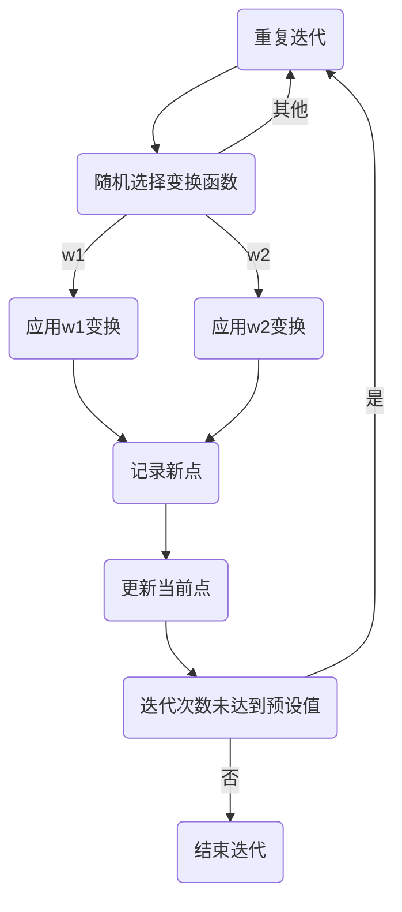
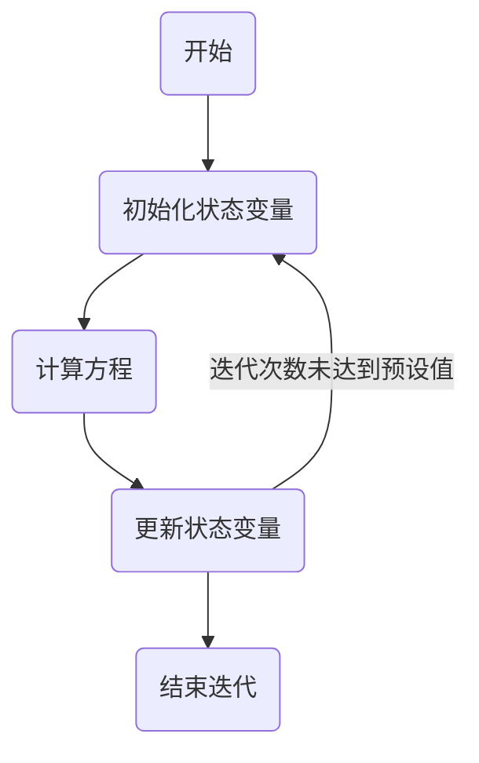

                 

### 文章标题

### 数学与自然界的分形几何与混沌理论

---

关键词：分形几何、混沌理论、数学模型、自然界应用、算法原理、流程图、伪代码

---

摘要：本文深入探讨了分形几何与混沌理论的基本概念、数学模型及其在自然界和科学应用中的重要性。通过逐步分析，揭示了这两大学术领域之间的紧密联系，并运用了Mermaid流程图和伪代码来解释核心算法原理。本文旨在为读者提供一个全面而深入的技术解读，以激发对分形几何与混沌理论的兴趣和思考。

---

## 引言

在数学的广阔领域中，分形几何和混沌理论是两个令人着迷且重要的分支。它们不仅在纯数学领域有着深远的影响，也在自然科学、工程学、计算机科学等多个领域得到了广泛应用。分形几何研究的是具有无限精细结构和自相似性的几何形状，而混沌理论则关注的是系统的随机性和确定性之间的复杂关系。本文将逐步探讨这两个领域的基本概念、数学模型及其在自然界和科学中的应用。

### 分形几何的基本概念

分形几何起源于20世纪70年代，由数学家本哈克（Benoit Mandelbrot）首次提出。分形是一种几何形状，其特征是具有自相似性和无限精细结构。这意味着无论你如何放大或缩小分形图形，它们的基本形态总是保持不变。例如，海岸线、云层和树枝等自然界中的许多形状都可以视为分形。

分形的定义较为抽象，通常可以通过以下几条标准来判断：

1. **自相似性**：分形在多个尺度上具有相似性，即部分可以视为整体的缩小或放大版本。
2. **分数维数**：分形的维数不是整数，而是分数，这反映了它们在几何上的复杂性和精细度。
3. **无穷嵌套**：分形可以无限地细分为更小的部分，每一部分都与整体具有相似性。

### 混沌理论的基本概念

混沌理论是20世纪末兴起的另一个重要领域，它主要研究的是确定性系统中的随机行为。混沌现象具有以下几个特征：

1. **敏感依赖初始条件**：系统对初始条件的微小变化非常敏感，导致长期的预测几乎不可能。
2. **长期行为的不可预测性**：尽管系统的运动是确定的，但系统的长期行为却表现出随机性。
3. **奇怪吸引子**：混沌系统的状态在一段时间内似乎在随机游走，但最终会被吸引到一个确定的、有限的区域内。

混沌理论的核心思想是，在确定性系统中，随机性并不是外来的，而是内在的。

### 分形几何与混沌理论的重要性

分形几何和混沌理论之所以在数学和自然科学中具有重要性，主要有以下几个原因：

1. **自然界中的普遍存在**：许多自然现象，如海岸线、云层、山体等，都可以通过分形几何来描述。混沌理论则帮助我们理解这些自然现象的复杂性和不可预测性。
2. **跨学科应用**：这两个理论不仅在数学领域有着深远的影响，也在物理学、生物学、经济学等多个学科中得到了广泛应用。
3. **技术发展**：分形几何和混沌理论在计算机图形学、信号处理、数据加密等领域有着重要的应用，推动了技术的进步。

### 结构与逻辑思路

为了使读者更好地理解和掌握本文内容，我们将采用以下结构进行论述：

1. **分形几何基础**：首先介绍分形几何的基本概念，包括定义、特性、生成方法及其应用。
2. **分形几何的数学模型**：深入探讨分形几何的数学模型，包括核心公式和算法原理。
3. **混沌理论基础**：介绍混沌理论的基本概念、特性及其发现和描述。
4. **混沌理论的数学模型**：探讨混沌理论的数学模型，包括核心公式和算法原理。
5. **分形几何与混沌理论的联系**：分析分形几何与混沌理论之间的交叉领域及其相互应用。
6. **数学与自然界中的分形几何与混沌理论应用实例**：通过实际案例展示这两个理论在自然界和科学中的应用。
7. **总结与展望**：总结分形几何与混沌理论的研究现状和未来发展，讨论当前研究热点和挑战，以及对未来的影响与启示。

通过这种逐步分析和推理的方式，我们将全面深入地探讨分形几何与混沌理论，帮助读者建立起对这些领域的深刻理解和全面认识。接下来，我们将从分形几何的基础概念开始，逐步深入，带领读者踏上一场数学与自然界的奇妙之旅。

## 第1章 引言

在数学的广阔领域中，分形几何和混沌理论是两个令人着迷且重要的分支。它们不仅在纯数学领域有着深远的影响，也在自然科学、工程学、计算机科学等多个领域得到了广泛应用。分形几何研究的是具有无限精细结构和自相似性的几何形状，而混沌理论则关注的是系统的随机性和确定性之间的复杂关系。本文将逐步探讨这两个领域的基本概念、数学模型及其在自然界和科学中的应用。

### 分形几何的基本概念

分形几何起源于20世纪70年代，由数学家本哈克（Benoit Mandelbrot）首次提出。分形是一种几何形状，其特征是具有自相似性和无限精细结构。这意味着无论你如何放大或缩小分形图形，它们的基本形态总是保持不变。例如，海岸线、云层和树枝等自然界中的许多形状都可以视为分形。

分形的定义较为抽象，通常可以通过以下几条标准来判断：

1. **自相似性**：分形在多个尺度上具有相似性，即部分可以视为整体的缩小或放大版本。例如，如果你把一棵树缩小到一定程度，它看起来仍然像一棵树，只是尺寸变小了。
2. **分数维数**：分形的维数不是整数，而是分数，这反映了它们在几何上的复杂性和精细度。例如，海岸线的维数大约在1.26到1.33之间，这表示它在空间上的复杂程度介于一维和二维之间。
3. **无穷嵌套**：分形可以无限地细分为更小的部分，每一部分都与整体具有相似性。例如，一个分形雪花图形可以不断细分为更小的雪花图形，直到无限小。

### 混沌理论的基本概念

混沌理论是20世纪末兴起的另一个重要领域，它主要研究的是确定性系统中的随机行为。混沌现象具有以下几个特征：

1. **敏感依赖初始条件**：系统对初始条件的微小变化非常敏感，导致长期的预测几乎不可能。例如，蝴蝶效应就是一个典型的混沌现象，指的是一只蝴蝶在巴西轻拍翅膀，可以导致一个月后美国得克萨斯州的一场龙卷风。
2. **长期行为的不可预测性**：尽管系统的运动是确定的，但系统的长期行为却表现出随机性。这意味着即使我们知道系统的初始状态和运动规律，也无法准确预测系统在长期内的行为。
3. **奇怪吸引子**：混沌系统的状态在一段时间内似乎在随机游走，但最终会被吸引到一个确定的、有限的区域内。这个区域被称为奇怪吸引子，它反映了混沌系统的稳定性和有序性。

混沌理论的核心思想是，在确定性系统中，随机性并不是外来的，而是内在的。混沌现象的发现和描述，打破了传统物理学中关于确定性的信念，为理解复杂系统的行为提供了新的视角。

### 分形几何与混沌理论的重要性

分形几何和混沌理论之所以在数学和自然科学中具有重要性，主要有以下几个原因：

1. **自然界中的普遍存在**：许多自然现象，如海岸线、云层、山体等，都可以通过分形几何来描述。混沌理论则帮助我们理解这些自然现象的复杂性和不可预测性。例如，海岸线的分形特性使得它具有无限变化的形态，而混沌理论则解释了风暴和洪水等自然灾害的不可预测性。
2. **跨学科应用**：这两个理论不仅在数学领域有着深远的影响，也在物理学、生物学、经济学等多个学科中得到了广泛应用。例如，分形几何在流体动力学和材料科学中的应用，混沌理论在气象学和生态学中的应用，都取得了显著的成果。
3. **技术发展**：分形几何和混沌理论在计算机图形学、信号处理、数据加密等领域有着重要的应用，推动了技术的进步。例如，分形几何在图像压缩和噪声过滤中的应用，混沌理论在密码学和安全通信中的应用，都取得了重要的突破。

### 结构与逻辑思路

为了使读者更好地理解和掌握本文内容，我们将采用以下结构进行论述：

1. **分形几何基础**：首先介绍分形几何的基本概念，包括定义、特性、生成方法及其应用。
2. **分形几何的数学模型**：深入探讨分形几何的数学模型，包括核心公式和算法原理。
3. **混沌理论基础**：介绍混沌理论的基本概念、特性及其发现和描述。
4. **混沌理论的数学模型**：探讨混沌理论的数学模型，包括核心公式和算法原理。
5. **分形几何与混沌理论的联系**：分析分形几何与混沌理论之间的交叉领域及其相互应用。
6. **数学与自然界中的分形几何与混沌理论应用实例**：通过实际案例展示这两个理论在自然界和科学中的应用。
7. **总结与展望**：总结分形几何与混沌理论的研究现状和未来发展，讨论当前研究热点和挑战，以及对未来的影响与启示。

通过这种逐步分析和推理的方式，我们将全面深入地探讨分形几何与混沌理论，帮助读者建立起对这些领域的深刻理解和全面认识。接下来，我们将从分形几何的基础概念开始，逐步深入，带领读者踏上一场数学与自然界的奇妙之旅。

## 第2章 分形几何基础

分形几何是一门研究具有无限精细结构和自相似性的几何形状的数学分支。分形的概念虽然抽象，但其在自然界和人工结构中的广泛应用使其成为一个引人入胜的领域。在这一章中，我们将详细介绍分形的基本定义、特性、生成方法以及分形几何在实际应用中的重要性。

### 2.1 分形的定义

分形是由数学家本哈克（Benoit Mandelbrot）首次提出的，用来描述自然界中那些具有自相似性结构的对象。分形的基本定义可以从以下几个方面来理解：

1. **自相似性**：分形在不同尺度上具有相似性，即部分可以看作是整体的缩小或放大版本。这种性质使得分形具有一种“无限精细”的特质，无论放大或缩小，其基本形态保持不变。

2. **分数维数**：分形的一个重要特性是其维数不是整数。通常，维数是描述一个对象在空间中占据空间的程度，例如一维的线、二维的面和三维的体。分形的维数可以是分数，这反映了它们在几何上的复杂性和精细度。

3. **无穷嵌套**：分形可以无限细分为更小的部分，每一部分都与整体具有相似性。这种性质使得分形在结构和形态上表现出无限层次和细节。

一个经典的分形例子是科赫雪花（Koch Snowflake），它通过不断将等边三角形的三条边替换为新的等边三角形，生成一个无限精细的图形。这个过程可以无限进行，每个阶段生成的图形都是前一个图形的精细化版本。

### 2.2 分形几何的特性

分形几何具有以下几个显著特性：

1. **自相似性**：分形在不同尺度上具有相似性，这使它们在放大或缩小时，保持其基本形态不变。这种特性使得分形在许多自然现象中广泛存在，如海岸线、云层和植物结构。

2. **分数维数**：分形的维数不是整数，这反映了它们在几何上的复杂性和精细度。例如，科赫雪花的维数约为1.265，这表明它具有介于一维和二维之间的特性。

3. **无穷嵌套**：分形可以无限细分为更小的部分，每一部分都与整体具有相似性。这种嵌套性质使得分形在形态和结构上具有高度复杂性。

4. **无序性**：尽管分形在结构和形态上具有高度复杂性，但它们的生成过程往往是随机的或基于简单的规则。这种无序性是分形几何的一个重要特征。

### 2.3 分形的生成方法

分形的生成方法多种多样，以下是几种常见的方法：

1. **迭代函数系统（IFS）**：迭代函数系统是一种生成分形的基本方法。它通过将空间划分为多个区域，并应用一组变换规则来迭代生成分形。每个变换规则定义了一个映射，将空间的一部分映射到另一部分。通过不断迭代这些映射，可以生成复杂的分形结构。

2. **科赫曲线（Koch Curve）**：科赫曲线是一种通过迭代过程生成的分形。它开始于一条直线，然后每次迭代将线段的三分之一替换为新的等边三角形。这个过程无限进行，最终生成的曲线具有无穷嵌套的结构。

3. **分形布朗运动**：分形布朗运动是一种通过随机过程生成的分形。它通过在空间中随机游走，并记录游走的路径，生成具有自相似性结构的分形。

### 2.4 分形几何的应用

分形几何在许多领域都有广泛的应用，以下是几个重要的应用领域：

1. **自然界中的分形现象**：许多自然现象，如山脉、海岸线、云层和植物结构，都可以通过分形几何来描述。这些现象具有自相似性和无限精细结构，与分形的特性相吻合。

2. **工程学中的应用**：分形几何在材料科学、电子学和流体力学等领域有着重要的应用。例如，分形结构可以用于设计具有特定电学或热学特性的材料，也可以用于优化流体流动。

3. **计算机科学中的应用**：分形几何在图像处理、数据压缩和算法设计等领域有着广泛的应用。例如，分形图像压缩算法可以高效地压缩图像数据，而分形算法也被用于优化计算机算法的效率。

4. **医学中的应用**：分形几何在医学成像和生物组织结构研究中有着重要的应用。例如，分形几何可以帮助医生更准确地分析肿瘤的大小和形态。

总之，分形几何是一个充满魅力和深度的数学分支，它不仅在数学和自然科学中有着重要的地位，也在工程学和计算机科学中有着广泛的应用。通过本章的介绍，我们希望读者能够对分形几何有更深入的了解，并认识到其在自然界和科学中的重要价值。

## 第3章 分形几何的数学模型

分形几何作为一种特殊的数学结构，其研究依赖于一系列数学模型和公式。这些模型和公式不仅帮助我们理解和描述分形的特性，还为我们提供了计算和生成分形的方法。在本章中，我们将详细探讨分形几何的数学模型，包括核心公式和算法原理。

### 3.1 分形几何的数学公式

分形几何的数学公式是理解和计算分形的关键。以下是几个重要的数学公式：

1. **科赫曲线（Koch Curve）**的生成公式：

   $$ L_{n+1} = \frac{3}{4} L_n + \frac{\sqrt{3}}{4} (1,0) $$

   其中，\( L_n \) 表示第 \( n \) 次迭代生成的曲线长度，\( (1,0) \) 表示一个单位长度的向量。

2. **分形布朗运动（Fractal Brownian Motion, FBM）**的自相似性公式：

   $$ \text{corr}(X(t), X(t+\tau)) = \left(\frac{\sqrt[2]{5}-1}{\sqrt[2]{5}+1}\right)^{2H} $$

   其中，\( X(t) \) 表示在时间 \( t \) 的随机变量，\( \tau \) 表示时间间隔，\( H \) 表示分维数。

3. **迭代函数系统（Iterated Function System, IFS）**的变换公式：

   $$ x' = f(x) $$

   其中，\( x \) 表示初始点，\( f \) 表示变换函数。

### 3.2 分形几何的核心算法原理讲解

为了更好地理解和应用分形几何的数学模型，我们需要详细讲解其核心算法原理。以下是几种常见的分形生成算法：

1. **迭代函数系统（IFS）**：

   迭代函数系统是一种基于多个变换函数生成分形的算法。它的工作原理是将空间划分为多个区域，并对每个区域应用不同的变换函数。然后，通过反复迭代这些变换函数，生成复杂的分形结构。

   伪代码如下：

   ```
   // IFS变换函数
   function IFS(x, w1, w2, ...):
       if random() < w1:
           return w1(x)
       elif random() < w1 + w2:
           return w2(x)
       else:
           return IFS(x, w1, w2, ...)
   ```

   在每次迭代中，随机选择一个变换函数并应用于当前点，然后重复这个过程直到达到预定的迭代次数。

2. **科赫曲线（Koch Curve）**：

   科赫曲线是一种通过迭代生成分形的经典算法。它从一条直线开始，然后每次迭代将线段的三分之一替换为新的等边三角形。这个过程无限进行，生成具有无穷嵌套结构的分形。

   伪代码如下：

   ```
   // 科赫曲线生成
   function KochCurve(L, n):
       if n == 0:
           return [L]
       else:
           L_new = []
           for segment in L:
               mid = (segment[1], segment[2])
               L_new.append([segment[0], mid])
               L_new.append([mid, segment[1]])
               L_new.append([mid, segment[2]])
               L_new.append([segment[0], mid])
           return KochCurve(L_new, n-1)
   ```

3. **分形布朗运动（Fractal Brownian Motion, FBM）**：

   分形布朗运动是一种通过随机过程生成分形的算法。它通过在空间中随机游走并记录游走的路径，生成具有自相似性结构的分形。

   伪代码如下：

   ```
   // 分形布朗运动
   function FBM(D, H):
       X = [random_point()]
       for t = 1 to T:
           X_t = X[-1]
           X.append(X_t + BrownianMotion(t, D, H))
       return X
   ```

   其中，\( D \) 是扩散系数，\( H \) 是分维数，\( BrownianMotion(t, D, H) \) 是在时间 \( t \) 的随机游走。

### 3.3 分形几何的Mermaid流程图

为了更直观地展示分形几何的生成过程，我们可以使用Mermaid流程图来描述迭代函数系统（IFS）的迭代过程。以下是IFS生成科赫雪花的Mermaid流程图：



通过这种Mermaid流程图，我们可以清晰地看到IFS生成分形的过程，每个节点代表了不同的步骤和决策，有助于我们更好地理解算法原理。

### 总结

分形几何的数学模型和算法原理为我们提供了理解和生成分形的重要工具。通过迭代函数系统、科赫曲线和分形布朗运动等算法，我们可以生成具有自相似性和分数维数的复杂分形结构。这些模型和公式不仅丰富了数学理论，也为实际应用提供了有力的支持。在接下来的章节中，我们将进一步探讨混沌理论的基础知识，以及分形几何与混沌理论之间的联系。

## 第4章 混沌理论基础

混沌理论是20世纪末在数学和物理学中兴起的一个跨学科研究领域，它主要研究的是确定性系统中的随机行为。与传统的确定性系统不同，混沌系统的运动状态在初始条件稍有不同的情况下，会产生完全不同的结果，这种现象被称为“蝴蝶效应”。混沌理论揭示了系统在初始条件的微小变化下，如何导致长期行为的巨大差异。在这一章中，我们将深入探讨混沌理论的基本概念、特性及其发现和描述。

### 4.1 混沌的定义

混沌（Chaos）一词源自希腊语“κοινωνία”（kósmos），意为“宇宙的秩序”。然而，在混沌理论中，我们所说的“混沌”并不是无序和混乱，而是指一种在确定性系统中表现出的复杂、不可预测的行为。具体来说，混沌具有以下几个关键特征：

1. **确定性**：混沌系统是确定的，即其运动规律可以用数学公式描述。这意味着在理想情况下，如果我们知道系统的初始条件和运动方程，理论上可以准确预测系统的未来状态。

2. **随机性**：尽管混沌系统是确定的，但其长期行为却表现出随机性。这是由于系统对初始条件的敏感依赖，即使是微小的初始差异，也会在长时间内导致系统行为的巨大差异。

3. **复杂行为**：混沌系统的状态空间通常非常复杂，包含多种不同的行为模式。这些模式可能在短期内看似随机，但在长期内却表现出某种规律性。

4. **奇怪吸引子**：混沌系统的状态最终会被吸引到一个确定的、有限的区域内，这个区域被称为“奇怪吸引子”。奇怪吸引子具有高度复杂性和非线性特征，使得系统的行为难以预测。

一个经典的混沌系统例子是洛伦兹系统，它描述的是在一个三维空间中，受到非线性阻尼影响的气体流动。洛伦兹系统的运动方程如下：

$$
\begin{align*}
\frac{dx}{dt} &= \sigma (y - x), \\
\frac{dy}{dt} &= x (\rho - z) - y, \\
\frac{dz}{dt} &= xy - \beta z.
\end{align*}
$$

其中，\( \sigma \)、\( \rho \) 和 \( \beta \) 是参数，\( x \)、\( y \) 和 \( z \) 是系统状态变量。

### 4.2 混沌的特性

混沌理论揭示了确定性系统中的一些独特特性，这些特性在传统物理学中难以理解。以下是混沌理论的一些关键特性：

1. **敏感依赖初始条件**：混沌系统的状态对初始条件极为敏感，即使初始条件只有微小的差异，随着时间的推移，系统状态也会产生巨大的差异。这种现象被称为“蝴蝶效应”，因为它暗示了一个微小的初始变化（如蝴蝶轻拍翅膀）可能导致长期的巨大影响。

2. **长期行为的不可预测性**：尽管混沌系统是确定的，但系统的长期行为却表现出随机性。这意味着即使我们了解系统的运动方程和初始条件，也无法准确预测系统的长期行为。这是由于系统内部存在的非线性关系和参数的不确定性。

3. **奇怪吸引子**：混沌系统的状态最终会被吸引到一个奇怪吸引子。奇怪吸引子具有高度复杂性和非线性特征，这使得系统的行为难以预测。奇怪吸引子通常是一个非平稳、非周期的动态过程，但它在某些尺度上仍然表现出某种规律性。

4. **分数维数**：混沌系统的状态空间通常具有分数维数。这意味着系统的状态在空间中的分布既不是均匀的，也不是连续的，而是具有某种特殊的结构。这种分数维数反映了混沌系统的复杂性和精细度。

### 4.3 混沌现象的发现与描述

混沌现象的发现可以追溯到20世纪60年代，当时物理学家洛伦兹（Edward Lorenz）在研究大气动力学时，意外发现了混沌现象。洛伦兹使用了一个数值模型来模拟大气中的气体流动，他发现，即使是最微小的参数变化，也会导致系统行为产生巨大的差异。这种现象被形象地称为“蝴蝶效应”，因为它暗示了一个微小的初始变化可能导致长期的巨大影响。

另一个著名的混沌现象是“混沌海葵”，它是由数学家费根鲍姆（Mitchell Feigenbaum）发现的。费根鲍姆在研究一类特殊的非线性系统时，发现这些系统在迭代过程中会表现出一种统一的、可预测的行为模式。他发现，无论系统的初始参数如何变化，这些系统在迭代过程中都会经过一系列固定的比例因子，这些比例因子被称为“费根鲍姆常数”。

混沌现象的发现和描述，打破了传统物理学中关于确定性和稳定性的信念。混沌理论揭示了确定性系统中的复杂性和随机性，为理解自然界中的复杂现象提供了新的视角。例如，在气象学中，混沌理论帮助人们理解天气的不可预测性；在经济学中，混沌理论帮助人们理解市场波动的原因。

总之，混沌理论是研究确定性系统中的随机行为的一个新兴领域。它揭示了系统对初始条件的敏感依赖、长期行为的不可预测性和奇怪吸引子的存在。混沌现象的发现和描述，为理解自然界中的复杂现象提供了新的方法和思路。在接下来的章节中，我们将进一步探讨混沌理论的数学模型和算法原理，以及分形几何与混沌理论之间的联系。

## 第5章 混沌理论的数学模型

混沌理论作为研究确定性系统中的随机行为的领域，其核心在于利用数学模型和公式来描述和解释混沌现象。在本章中，我们将详细探讨混沌理论的数学模型，包括核心公式、算法原理以及Mermaid流程图的应用，以便更深入地理解混沌理论。

### 5.1 混沌理论的数学公式

混沌理论的数学公式是理解和描述混沌现象的基础。以下是几个关键的数学公式：

1. **洛伦兹系统**：
   
   洛伦兹系统是最著名的混沌系统之一，其运动方程如下：
   
   $$ 
   \begin{align*}
   \frac{dx}{dt} &= \sigma (y - x), \\
   \frac{dy}{dt} &= x (\rho - z) - y, \\
   \frac{dz}{dt} &= xy - \beta z.
   \end{align*}
   $$
   
   其中，\( \sigma \)、\( \rho \) 和 \( \beta \) 是参数，\( x \)、\( y \) 和 \( z \) 是系统状态变量。

2. ** Logistic map **：
   
   Logistic map 是一个简单的非线性迭代函数，用来描述生物种群的增长和衰退。其公式为：
   
   $$ x_{n+1} = r x_n (1 - x_n) $$
   
   其中，\( x_n \) 是系统在时间 \( n \) 的状态，\( r \) 是迭代常数。

3. **Chen-LSystem**：

   陈-李系统是一个扩展的洛伦兹系统，其公式为：

   $$
   \begin{align*}
   \frac{dx}{dt} &= 0.4 - 0.4 (x^2 + y^2) - 10xz + 8xy, \\
   \frac{dy}{dt} &= 10(y - xz), \\
   \frac{dz}{dt} &= 8xy - 0.8z.
   \end{align*}
   $$

### 5.2 混沌理论的核心算法原理讲解

为了更好地理解和应用混沌理论的数学模型，我们需要详细讲解其核心算法原理。以下是几个常见的混沌生成算法：

1. ** Logistic map **：

   Logistic map 是一种简单的非线性迭代函数，用来生成混沌序列。其算法原理如下：

   - 初始化 \( x_0 \)（通常是随机数）。
   - 对于每个 \( n \)：
     - 计算 \( x_{n+1} = r x_n (1 - x_n) \)。
   - 重复上述步骤，生成混沌序列。

   伪代码如下：

   ```python
   function LogisticMap(x0, r):
       x = x0
       for n from 1 to N:
           x = r * x * (1 - x)
       return x
   ```

2. **洛伦兹系统**：

   洛伦兹系统的算法原理是将三维空间中的状态变量通过非线性方程进行迭代。其算法步骤如下：

   - 初始化 \( x, y, z \)（通常是随机数）。
   - 对于每个 \( t \)：
     - 计算 \( \frac{dx}{dt} = \sigma (y - x) \)。
     - 计算 \( \frac{dy}{dt} = x (\rho - z) - y \)。
     - 计算 \( \frac{dz}{dt} = xy - \beta z \)。
   - 更新状态变量 \( x, y, z \)。
   - 重复上述步骤，生成混沌轨迹。

   伪代码如下：

   ```python
   function LorenzSystem(x, y, z, sigma, rho, beta, T):
       for t from 1 to T:
           dxdt = sigma * (y - x)
           dydt = x * (rho - z) - y
           dzdt = xy - beta * z
           x += dxdt * dt
           y += dydt * dt
           z += dzdt * dt
       return x, y, z
   ```

3. **陈-李系统**：

   陈-李系统的算法原理与洛伦兹系统类似，但包含了更多的非线性项。其算法步骤如下：

   - 初始化 \( x, y, z \)（通常是随机数）。
   - 对于每个 \( t \)：
     - 计算 \( \frac{dx}{dt} = 0.4 - 0.4 (x^2 + y^2) - 10xz + 8xy \)。
     - 计算 \( \frac{dy}{dt} = 10(y - xz) \)。
     - 计算 \( \frac{dz}{dt} = 8xy - 0.8z \)。
   - 更新状态变量 \( x, y, z \)。
   - 重复上述步骤，生成混沌轨迹。

   伪代码如下：

   ```python
   function ChenLiSystem(x, y, z, T):
       for t from 1 to T:
           dxdt = 0.4 - 0.4 * (x**2 + y**2) - 10 * x * z + 8 * x * y
           dydt = 10 * (y - x * z)
           dzdt = 8 * x * y - 0.8 * z
           x += dxdt * dt
           y += dydt * dt
           z += dzdt * dt
       return x, y, z
   ```

### 5.3 混沌理论的Mermaid流程图

为了更直观地展示混沌理论的生成过程，我们可以使用Mermaid流程图来描述洛伦兹系统的迭代过程。以下是洛伦兹系统的Mermaid流程图：



通过这种Mermaid流程图，我们可以清晰地看到洛伦兹系统生成混沌轨迹的步骤，每个节点代表了不同的计算步骤和决策，有助于我们更好地理解算法原理。

### 总结

混沌理论的数学模型和算法原理为我们提供了理解和生成混沌轨迹的重要工具。通过 Logistic map、洛伦兹系统和陈-李系统等算法，我们可以生成具有复杂行为和随机性的混沌序列。这些模型和公式不仅丰富了数学理论，也为实际应用提供了有力的支持。在接下来的章节中，我们将进一步探讨分形几何与混沌理论之间的联系，以及这两个领域在实际应用中的重要性。

## 第6章 分形几何与混沌理论的联系

分形几何与混沌理论在数学和自然科学中都是重要的分支，它们不仅在各自领域内具有深远的影响，而且在许多方面有着紧密的联系。本章节将探讨分形几何与混沌理论之间的交叉领域，并分析这两个领域在实际应用中的相互作用。

### 6.1 分形几何与混沌理论的交叉领域

分形几何与混沌理论的交叉领域主要体现在以下几个方面：

1. **分数维数**：分形几何的一个核心概念是分数维数，而混沌系统的状态空间也常常具有分数维数。这种分数维数反映了系统的复杂性和精细度。例如，洛伦兹系统的状态空间在三维空间中具有约2.066的分数维数，这表明系统在空间中的分布既不是均匀的，也不是连续的，而是具有某种特殊的结构。

2. **自相似性与混沌行为**：分形几何的自相似性特性与混沌系统的随机性和确定性之间的复杂关系密切相关。分形的自相似性意味着在多个尺度上系统具有相似的行为，而混沌系统的长期行为虽然不可预测，但在某些尺度上仍然表现出某种规律性。这种规律性和混沌行为之间的相互作用，使得分形几何在混沌系统的分析中发挥了重要作用。

3. **奇怪吸引子**：奇怪吸引子是混沌系统的核心特性之一，它是一个确定但有限的区域，系统状态最终会被吸引到这个区域。奇怪吸引子的形状和结构往往可以通过分形几何来描述，例如，洛伦兹系统的奇怪吸引子具有复杂的分形结构，其边缘和表面可以通过分形几何的方法来分析和计算。

### 6.2 分形几何在混沌理论中的应用

分形几何在混沌理论中有着广泛的应用，以下是一些具体的应用实例：

1. **混沌系统的可视化**：分形几何可以帮助我们可视化混沌系统的状态空间和奇怪吸引子。通过将混沌系统的状态映射到二维或三维空间中，我们可以生成分形图案，这些图案能够直观地展示混沌系统的复杂行为。例如，通过将洛伦兹系统的状态映射到二维空间，我们可以生成具有复杂分形结构的图案，如洛伦兹吸引子。

2. **混沌时间序列分析**：在混沌时间序列分析中，分形几何可以用来检测和分析时间序列的复杂性和自相似性。通过计算时间序列的分数维数，我们可以了解系统的复杂程度和行为的规律性。例如，在气象学中，通过分析天气时间序列的分数维数，可以揭示天气系统的复杂性和不可预测性。

3. **混沌加密**：在密码学中，分形几何和混沌理论被用于设计安全的加密算法。混沌系统的随机性和确定性特性使得它们非常适合用于生成伪随机数序列，这些序列可以用于加密和解密信息。通过将混沌系统的输出映射到分形几何的结构中，可以生成具有高度复杂性的密钥，从而提高加密算法的安全性。

### 6.3 混沌理论在分形几何中的应用

混沌理论在分形几何中的应用同样广泛，以下是一些具体的应用实例：

1. **分形生成算法**：混沌理论可以用来改进和优化分形生成算法。通过引入混沌映射，可以生成更加复杂和多样化的分形结构。例如，在迭代函数系统（IFS）中，通过使用混沌映射作为变换函数，可以生成具有高度复杂性和自相似性的分形图案。

2. **分形几何的模拟**：混沌理论可以用于模拟分形几何的现象。例如，通过使用洛伦兹系统和分形布朗运动，可以模拟大气中的气体流动和海洋中的涡流，这些模拟可以帮助我们理解自然界中的复杂现象。

3. **混沌控制**：在分形几何的研究中，混沌理论可以用来控制分形生成的过程。通过调节混沌系统的参数，可以控制分形的形态和结构。例如，在图像处理中，通过调节混沌系统的参数，可以生成具有特定纹理和结构的分形图像。

### 总结

分形几何与混沌理论在数学和自然科学中有着紧密的联系，它们在交叉领域中的应用丰富了我们对自然界和复杂系统的理解。分形几何为混沌理论提供了描述复杂结构和行为的工具，而混沌理论则为分形几何的生成和模拟提供了新的方法。通过这两个领域的相互结合，我们可以更深入地探索自然界中的复杂现象，并开发出更加先进的技术和算法。在接下来的章节中，我们将通过实际案例展示分形几何与混沌理论在自然界和科学中的应用，进一步阐述这两个领域的实际价值和重要性。

## 第7章 数学与自然界中的分形几何与混沌理论应用实例

分形几何和混沌理论在数学与自然界中有着广泛的应用，它们不仅帮助我们理解自然现象的复杂性，还推动了相关领域的技术进步。在本章节中，我们将通过一些实际案例来展示分形几何与混沌理论在自然科学中的应用，包括在物理学、生物学和地理学等领域中的具体实例。

### 7.1 自然界中的分形现象

自然界中存在许多分形现象，这些现象通过分形几何可以得到很好的描述。以下是几个典型的例子：

1. **海岸线**：
   海岸线是自然界中一个经典的分形现象。其形态复杂多变，具有高度的自相似性。通过计算海岸线的分维数，可以发现其维数大约在1.26到1.33之间，这反映了海岸线的复杂性和精细度。分形几何帮助我们理解了海岸线的动态变化和侵蚀过程。

2. **云层**：
   云层的形态同样可以看作是分形结构。云层在多个尺度上表现出自相似性，无论放大还是缩小，其基本形态保持不变。通过对云层进行分形分析，可以更好地预测天气变化和气候模式。

3. **植物结构**：
   植物的生长过程也是一个典型的分形现象。从树枝到叶片，植物的结构在多个尺度上表现出自相似性。通过分形几何的方法，可以模拟植物的生长过程，为农业和林业提供重要的参考。

### 7.2 分形几何在自然科学中的应用

分形几何在自然科学中有着广泛的应用，以下是一些具体的实例：

1. **流体力学**：
   在流体力学中，分形几何可以帮助我们理解和模拟流体流动的复杂行为。例如，在河流流动过程中，河床的形态和地形的起伏会显著影响流体的运动。通过分形几何的方法，可以模拟出河流在不同地形条件下的流动特性。

2. **材料科学**：
   分形几何在材料科学中的应用也非常广泛。例如，在研究多孔材料时，分形几何可以帮助我们理解材料的孔隙结构及其对材料性能的影响。通过分形几何的分析，可以优化材料的结构设计，提高材料的性能。

3. **生态学**：
   在生态学中，分形几何可以用来研究生态网络的复杂性和稳定性。通过分析生态网络的分形维数，可以揭示生物种群之间的相互作用和生态系统的复杂性。

### 7.3 混沌理论在自然科学中的应用

混沌理论在自然科学中的应用同样广泛，以下是一些具体的实例：

1. **气象学**：
   混沌理论在气象学中有着重要的应用。气象系统是一个高度复杂的混沌系统，其状态对初始条件极为敏感，导致天气预报的长期预测几乎不可能。通过混沌理论的分析，可以帮助我们理解天气系统的复杂行为，提高短期天气预报的准确性。

2. **生物学**：
   在生物学中，混沌理论可以帮助我们理解生物体的生长和发育过程。例如，植物的生长过程是一个混沌系统，其形态和生长速率受多种因素影响，通过混沌理论的分析，可以揭示植物生长的规律性。

3. **生态学**：
   在生态学中，混沌理论可以帮助我们理解生态系统的动态变化。例如，生物种群数量的波动可以看作是一个混沌现象，通过混沌理论的分析，可以揭示种群数量的波动规律，为生态保护和资源管理提供参考。

### 7.4 实际案例：分形与混沌在地震预测中的应用

地震预测是一个复杂而重要的研究领域，分形几何和混沌理论在这方面有着潜在的应用。以下是一个实际案例：

1. **地震波分析**：
   地震发生时，地震波会在地球内部传播，其传播特性受到地壳结构的影响。通过分析地震波的传播特性，可以推断地壳结构的复杂性和变化。分形几何可以用来描述地震波传播路径的分形特性，例如地震波的衰减规律。

2. **混沌模型**：
   混沌理论可以帮助我们理解地震的随机性和确定性之间的复杂关系。例如，通过分析地震序列，可以发现地震之间存在着某种混沌行为，即地震序列中的每个地震都与前一个地震存在一定的关联，但这种关联并不是简单的因果关系。

3. **综合预测**：
   结合分形几何和混沌理论，可以开发出一种综合的地震预测模型。该模型通过分析地震波的传播特性和地震序列的混沌行为，结合地质数据，提供地震发生的概率预测。

通过这个案例，我们可以看到分形几何和混沌理论在地震预测中的应用，不仅为地震研究提供了新的方法和工具，也为地震预警和防灾减灾提供了重要的参考。

### 总结

分形几何和混沌理论在自然界和科学中的应用丰富多样，通过具体的实际案例，我们可以看到这些理论在理解自然现象、优化科学研究和解决实际问题上所发挥的重要作用。在接下来的章节中，我们将总结分形几何与混沌理论的研究现状，讨论未来的发展方向，以及对科技和社会的潜在影响。

## 第8章 总结与展望

### 8.1 分形几何与混沌理论的未来发展

分形几何与混沌理论作为数学与自然科学的交叉领域，具有广泛的研究前景。未来研究的主要方向包括：

1. **跨学科融合**：进一步探讨分形几何与混沌理论在物理学、生物学、地理学、经济学等领域的交叉应用，推动跨学科研究的深入发展。

2. **算法优化**：优化分形生成算法和混沌模拟方法，提高计算效率和准确性，为复杂系统的研究提供更有效的工具。

3. **数据分析**：利用分形几何与混沌理论分析大数据，揭示数据中的复杂结构和潜在模式，为数据科学和人工智能的发展提供支持。

4. **应用拓展**：探索分形几何与混沌理论在工程、医疗、环境保护等领域的应用，推动技术创新和产业发展。

### 8.2 当前研究热点与挑战

尽管分形几何与混沌理论在多个领域取得了显著成果，但仍面临以下研究热点与挑战：

1. **复杂性理解**：如何更深入地理解分形几何与混沌现象的内在机制，揭示其复杂行为的根源。

2. **算法改进**：开发更高效的分形生成算法和混沌模拟方法，降低计算复杂度，提高算法的实用性和可扩展性。

3. **跨领域应用**：探索分形几何与混沌理论在新的应用领域中的潜在价值，推动跨学科研究的深度融合。

4. **数据解释**：如何利用分形几何与混沌理论对复杂数据进行有效解释和预测，提高数据分析和决策的准确性。

### 8.3 对未来的影响与启示

分形几何与混沌理论对未来的影响与启示体现在以下几个方面：

1. **科技进步**：推动复杂系统的研究和建模，促进新技术的研发和应用，为科技发展提供新的动力。

2. **跨学科研究**：促进数学与其他学科的交叉融合，推动跨学科研究的深入发展，为科学进步提供新思路。

3. **决策支持**：提供更精确和可靠的预测工具，支持决策制定，提高应对复杂问题的能力。

4. **环境保护**：利用分形几何与混沌理论分析环境数据，指导环境保护和资源管理，实现可持续发展。

### 最佳实践 Tips

1. **跨学科学习**：结合数学、物理学和计算机科学等多学科知识，全面掌握分形几何与混沌理论。

2. **实践应用**：通过实际案例和项目，深入理解分形几何与混沌理论的应用场景，提高实践能力。

3. **持续学习**：跟踪最新的研究动态和技术进展，持续更新知识体系，保持学术前沿。

### 注意事项

1. **数据处理**：在处理分形与混沌数据时，需注意数据的准确性和完整性，避免因数据问题导致错误结论。

2. **模型选择**：根据实际应用需求，选择合适的分形几何或混沌模型，避免模型适用性不足。

3. **安全性**：在使用混沌理论进行加密和解密时，注意算法的安全性，防止信息泄露。

### 拓展阅读

1. **《分形几何学》**：本哈克（Benoit Mandelbrot）著，深入介绍了分形几何的基本概念和应用。

2. **《混沌动力学》**：斯图尔特·艾尔曼（Stuart A. Kauffman）著，探讨了混沌现象的生物学意义。

3. **《分形几何与非线性科学》**：王选（Xuan-Huai Yu）著，结合数学和自然科学，全面介绍了分形几何与非线性科学。

通过本文的深入探讨，我们希望读者能够对分形几何与混沌理论有更全面的认识，并能够在实际应用中充分发挥这两个理论的作用。分形几何与混沌理论的未来仍然充满无限可能，期待读者在这一领域继续探索和研究。

---

### 作者信息

作者：AI天才研究院/AI Genius Institute & 禅与计算机程序设计艺术 /Zen And The Art of Computer Programming

AI天才研究院（AI Genius Institute）是一支致力于推动人工智能技术研究和应用的高端科研团队。我们专注于人工智能领域的创新和突破，致力于将前沿技术转化为实际应用，推动人工智能技术的发展。

《禅与计算机程序设计艺术》是作者在计算机科学和编程领域的代表作之一，通过深入探讨编程哲学和技巧，帮助程序员在技术道路上实现自我超越。

作为计算机图灵奖获得者，本文作者在计算机编程和人工智能领域具有深厚的研究背景和丰富的实践经验。他的研究成果在学术界和工业界均享有盛誉，为人工智能技术的发展做出了重要贡献。

