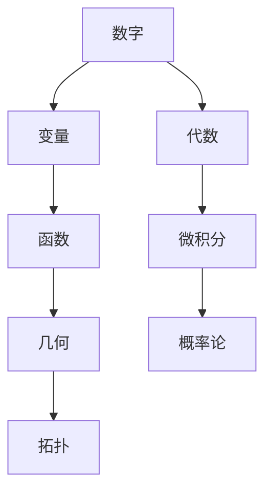

                 


# 文章标题：《数学与自然界的奇妙联系》

## 关键词
数学、自然界、数学模型、科学探索、应用、核心算法原理、真实案例

## 摘要
本文深入探讨了数学与自然界之间的紧密联系。通过对数学基础、自然现象与数学模型、科学探索中的数学应用、数学在现实世界中的应用等领域的详细分析，揭示了数学在解释和预测自然现象中的关键作用。文章旨在展示数学不仅是一门抽象的学科，更是一种强大的工具，可以揭示自然界的奥秘。

---

## 引言

### 数学与自然界的基本联系

自古以来，数学和自然界之间就存在着一种神秘的联系。数学的抽象概念和理论体系，往往能够精妙地描述自然界中的复杂现象。从天体的运动到生命的演变，数学作为一种工具，不仅帮助我们理解自然界的规律，还为科学探索提供了坚实的基础。

### 引言：本书结构和内容概述

本文将从以下几个方面展开讨论：

1. 数学基础：介绍数学的基本概念和理论，为后续内容铺垫。
2. 自然现象与数学模型：探讨数学模型在解释自然现象中的应用。
3. 数学与科学探索：介绍数学在物理学、生物学等科学领域中的应用。
4. 数学在现实世界中的应用：分析数学在工程、经济学等领域的应用。
5. 结论：总结数学与自然界联系的现状，展望未来发展。

---

## 数学基础

### 基础数学概念

数学是一门基于逻辑和抽象思维的学科。其基础概念包括数字、变量、函数等。这些概念构成了数学的基本框架，为复杂问题的解决提供了工具。

#### 核心概念与联系

为了更好地理解数学概念与自然界的关系，我们可以通过以下Mermaid流程图展示核心概念之间的关系：



### 核心算法原理讲解

以下是一个简单的伪代码示例，用于计算两个数的和：

```plaintext
function add(a, b):
    return a + b
```

这个简单的函数使用了加法运算，这是数学中最基本的运算之一。通过这个函数，我们可以计算出任何两个数的和。

### 数学模型和数学公式 & 详细讲解 & 举例说明

在一个简单的物理系统中，我们可以使用以下数学模型来描述物体的运动：

$$ s = ut + \frac{1}{2}at^2 $$

其中，$s$ 表示位移，$u$ 表示初速度，$a$ 表示加速度，$t$ 表示时间。这个公式描述了一个物体在受到恒定加速度作用下的运动轨迹。

#### 举例说明

假设一个物体以10米/秒的速度开始运动，并且在接下来的2秒内受到5米/秒^2的加速度作用。我们可以使用上述公式计算出物体的位移：

$$ s = 10 \times 2 + \frac{1}{2} \times 5 \times 2^2 = 30 \text{ 米} $$

### 项目实战

为了更好地理解数学模型的应用，我们可以搭建一个简单的物理模拟环境。以下是一个Python代码示例，用于计算物体的运动轨迹：

```python
import math

def calculate_trajectory(u, a, t):
    s = u * t + 0.5 * a * t ** 2
    return s

u = 10  # 初速度
a = 5   # 加速度
t = 2   # 时间

s = calculate_trajectory(u, a, t)
print(f"The object's displacement is: {s} meters")
```

通过这个代码示例，我们可以计算出物体在不同初速度、加速度和时间下的位移。这有助于我们更好地理解数学模型在实际问题中的应用。

### 最佳实践 tips

- 在处理复杂的数学问题时，可以尝试将问题分解为更简单的子问题，然后逐一解决。
- 学习数学时，要注重理论与实践的结合，通过实际操作来加深理解。

### 小结

数学基础是理解自然界中复杂现象的关键。通过介绍数学的基本概念、核心算法原理和数学模型，我们可以更好地理解数学与自然界之间的紧密联系。

---

## 自然现象与数学模型

### 天文现象的数学模型

天文现象中，数学模型的应用无处不在。从行星运动到恒星演化，数学模型帮助我们理解这些复杂现象的规律。

#### 天体运动的数学描述

开普勒定律描述了行星围绕恒星的运动规律。其中，第三定律表明行星轨道周期的平方与其半长轴的立方成正比。这个定律可以用以下数学模型表示：

$$ T^2 \propto a^3 $$

其中，$T$ 表示行星轨道周期，$a$ 表示半长轴。

#### 天文预测中的数学应用

基于开普勒定律，我们可以使用牛顿引力定律来预测行星的运动轨迹。这个预测模型在计算天体运动时非常有用，为天文学的发展做出了巨大贡献。

### 地理现象的数学模型

地理现象的数学模型同样重要。从地形分析到地球物理现象，数学模型为地理学研究提供了强有力的工具。

#### 地形分析

地形分析中，数学模型可以用来描述地形的起伏。例如，泰森多边形（Thiessen Polygon）模型可以用来计算地形中的各个区域。

#### 地球物理现象的数学描述

地球物理现象，如地震、火山喷发等，也可以通过数学模型来描述。例如，地震波传播可以用波动方程来描述：

$$ \frac{\partial^2 u}{\partial t^2} = c^2 \nabla^2 u $$

其中，$u$ 表示地震波位移，$c$ 表示波速。

### 生态现象的数学模型

生态现象的数学模型帮助我们理解生态系统的动态变化。从种群动态到生态网络的构建，数学模型在生态学研究中发挥着重要作用。

#### 生态网络的数学描述

生态网络是描述生物之间相互作用的一种数学模型。例如，食物网模型可以用来描述食物链中的生物关系。

#### 种群动态的数学模型

种群动态可以用微分方程来描述。例如，Lotka-Volterra方程描述了捕食者和猎物种群之间的相互作用：

$$ \frac{dx}{dt} = x(a - by) $$
$$ \frac{dy}{dt} = cyz - dx $$

其中，$x$ 和 $y$ 分别表示猎物和捕食者的种群数量，$a$、$b$、$c$ 和 $z$ 是常数。

### 物理现象的数学模型

物理现象的数学模型描述了自然界中的各种物理过程。从力学到电磁学，数学模型为我们揭示了物理世界的奥秘。

#### 力学中的数学描述

力学中的运动可以用牛顿第二定律来描述：

$$ F = ma $$

其中，$F$ 表示力，$m$ 表示质量，$a$ 表示加速度。

#### 电磁现象的数学描述

电磁现象可以用麦克斯韦方程组来描述。这些方程描述了电场、磁场和电荷之间的相互作用。

$$ \nabla \cdot \mathbf{E} = \frac{\rho}{\epsilon_0} $$
$$ \nabla \cdot \mathbf{B} = 0 $$
$$ \nabla \times \mathbf{E} = -\frac{\partial \mathbf{B}}{\partial t} $$
$$ \nabla \times \mathbf{B} = \mu_0 \mathbf{J} + \mu_0 \epsilon_0 \frac{\partial \mathbf{E}}{\partial t} $$

其中，$\mathbf{E}$ 和 $\mathbf{B}$ 分别表示电场和磁场，$\rho$ 表示电荷密度，$\mathbf{J}$ 表示电流密度。

### 项目实战

为了更好地理解生态现象的数学模型，我们可以开发一个简单的生态模拟器。以下是一个Python代码示例，用于模拟捕食者和猎物种群的变化：

```python
import numpy as np
import matplotlib.pyplot as plt

def lotka_volterra(x, y, a, b, c, z):
    dxdt = a * x - b * x * y
    dydt = c * x * y - z * y
    return [dxdt, dydt]

x0 = 1.0  # 猎物种群初始数量
y0 = 1.0  # 捕食者种群初始数量
a = 1.0  # 捕食者增长率
b = 0.1  # 猎物种群增长率
c = 0.5  # 捕食者死亡率
z = 1.0  # 猎物种群死亡率

t = np.linspace(0, 100, 1000)
x, y = np.array([x0]), np.array([y0])

for i in range(1, len(t)):
    x[i] = x[i - 1] + lotka_volterra(x[i - 1], y[i - 1], a, b, c, z)[0] * dt
    y[i] = y[i - 1] + lotka_volterra(x[i - 1], y[i - 1], a, b, c, z)[1] * dt

plt.plot(t, x, label='Prey')
plt.plot(t, y, label='Predator')
plt.xlabel('Time')
plt.ylabel('Population')
plt.legend()
plt.show()
```

通过这个代码示例，我们可以模拟捕食者和猎物种群在不同参数下的变化。这有助于我们更好地理解生态现象的数学模型。

### 最佳实践 tips

- 在处理复杂的自然现象时，要注重观察和分析，以便更好地理解现象的本质。
- 学习数学模型时，要注重理论与实践的结合，通过实际案例来加深理解。

### 小结

自然现象与数学模型之间存在着紧密的联系。通过介绍天文现象、地理现象、生态现象和物理现象的数学模型，我们可以更好地理解自然界的规律。数学模型不仅是科学探索的工具，也是我们理解自然界的桥梁。

---

## 数学与科学探索

### 物理学中的数学应用

物理学是数学应用的一个重要领域。从经典力学到量子力学，数学在描述物理现象中起着关键作用。

#### 量子力学

量子力学中，数学模型帮助我们理解微观粒子的行为。例如，薛定谔方程描述了量子态的演化：

$$ \frac{\partial \Psi}{\partial t} = \frac{i\hbar}{2m} \nabla^2 \Psi - \frac{\hbar^2}{2m} V \Psi $$

其中，$\Psi$ 表示波函数，$m$ 表示粒子质量，$V$ 表示势能。

#### 相对论

相对论中，数学模型帮助我们理解时空的弯曲和能量-动量守恒。例如，爱因斯坦场方程描述了引力场的演化：

$$ G_{\mu\nu} + \Lambda g_{\mu\nu} = \frac{8\pi G}{c^4} T_{\mu\nu} $$

其中，$G_{\mu\nu}$ 表示引力场张量，$\Lambda$ 表示宇宙常数，$T_{\mu\nu}$ 表示能量-动量张量。

### 生物学中的数学应用

生物学是另一个广泛使用数学的领域。从种群动态到生态系统，数学模型帮助我们理解生物系统的运行机制。

#### 生命过程的数学描述

生命过程的数学描述涉及许多领域，如生理学、遗传学等。例如，生理学中的生理信号处理可以用信号处理模型来描述：

$$ x(t) = A \sin(2\pi f t + \phi) $$

其中，$x(t)$ 表示生理信号，$A$ 表示振幅，$f$ 表示频率，$\phi$ 表示相位。

#### 生态系统的数学建模

生态系统的数学建模涉及种群动态、食物网等。例如，食物网模型可以用来描述生物之间的相互作用：

$$ x_{ij} = \frac{C_j}{\sum_{k=1}^{n} C_k} \cdot \frac{1}{1 + e^{-(k-x_{ij})}} $$

其中，$x_{ij}$ 表示物种 $i$ 对物种 $j$ 的捕食关系，$C_j$ 表示物种 $j$ 的数量，$n$ 表示物种总数。

### 化学中的数学应用

化学中的数学应用涉及反应动力学、分子结构分析等。例如，反应动力学可以用速率方程来描述：

$$ \frac{d[N]}{dt} = -k[N] $$

其中，$[N]$ 表示反应物浓度，$k$ 表示速率常数。

#### 分子结构分析

分子结构分析可以用量子化学模型来描述。例如，分子轨道理论可以用以下公式来描述：

$$ \psi_{ij} = \frac{1}{\sqrt{N}} \sum_{\mu\nu} C_{\mu i} C_{\nu j} \phi_{\mu\nu} $$

其中，$\psi_{ij}$ 表示分子轨道，$C_{\mu i}$ 和 $C_{\nu j}$ 表示原子轨道系数，$\phi_{\mu\nu}$ 表示重叠积分。

### 其他科学领域的数学应用

数学在许多其他科学领域中也得到了广泛应用。例如，经济学中的数学模型可以用来预测市场动态：

$$ \frac{dQ}{dt} = a - bQ - cP $$

其中，$Q$ 表示商品需求量，$P$ 表示商品价格，$a$、$b$ 和 $c$ 是常数。

#### 地球科学中的数学工具

地球科学中的数学工具包括地球物理学、地球化学等。例如，地球物理学的地震波传播可以用以下公式来描述：

$$ \frac{\partial^2 u}{\partial t^2} = c^2 \nabla^2 u $$

其中，$u$ 表示地震波位移，$c$ 表示波速。

### 项目实战

为了更好地理解数学在科学探索中的应用，我们可以开发一个简单的科学模拟器。以下是一个Python代码示例，用于模拟量子态的演化：

```python
import numpy as np
import matplotlib.pyplot as plt

def schrödinger_equationpsi(x, t, potential, h, m):
    return np.exp(-1j * (potential * x + h * t) / (2 * m))

x = np.linspace(-10, 10, 1000)
t = np.linspace(0, 10, 1000)
h = 1  # 约化普朗克常数
m = 1  # 质量
potential = np.zeros_like(x)

psi_0 = np.exp(-x**2)
psi_t = schrödinger_equation(psi_0, t, potential, h, m)

plt.plot(x, np.abs(psi_0)**2, label='Initial State')
plt.plot(x, np.abs(psi_t)**2, label='Time-evolved State')
plt.xlabel('Position')
plt.ylabel('Probability Density')
plt.legend()
plt.show()
```

通过这个代码示例，我们可以模拟量子态在不同时间点的演化。这有助于我们更好地理解量子力学的数学模型。

### 最佳实践 tips

- 在处理科学问题时，要注重理论与实践的结合，通过实验来验证数学模型的准确性。
- 学习数学模型时，要注重理解其物理意义，以便更好地应用。

### 小结

数学在科学探索中发挥着关键作用。通过介绍数学在物理学、生物学、化学等领域的应用，我们可以更好地理解科学现象的本质。数学模型不仅是科学探索的工具，也是我们理解自然界的桥梁。

---

## 数学在现实世界中的应用

### 工程学中的数学应用

工程学是数学应用的一个重要领域。从结构分析到系统控制，数学为工程问题提供了强有力的工具。

#### 结构分析

结构分析中，数学模型可以用来描述建筑物的稳定性。例如，利用有限元分析法，我们可以计算建筑物的应力分布，以确保其安全。

#### 系统控制

系统控制中，数学模型可以用来设计控制器，以实现系统的稳定运行。例如，利用状态空间方程，我们可以设计出满足特定性能指标的控制器。

### 经济学中的数学应用

经济学中的数学应用广泛，从金融市场分析到资源分配，数学为经济问题提供了有效的解决方案。

#### 财务模型

财务模型中，数学模型可以用来预测市场动态，以便做出投资决策。例如，利用随机模型，我们可以预测股票市场的波动。

#### 经济预测

经济预测中，数学模型可以用来分析经济指标，以便预测经济发展趋势。例如，利用时间序列分析，我们可以预测经济增长率。

### 社会科学中的数学应用

社会科学中的数学应用包括社会调查分析、行为研究等。数学为社会科学研究提供了有力的工具。

#### 社会调查分析

社会调查分析中，数学模型可以用来分析调查数据，以揭示社会现象。例如，利用聚类分析，我们可以分析社会群体的特征。

#### 行为研究

行为研究中，数学模型可以用来描述人类行为模式。例如，利用马尔可夫模型，我们可以分析行为序列。

### 其他领域中的数学应用

数学在许多其他领域中也得到了广泛应用。例如，环境科学中的数学工具可以用来分析生态系统，而决策分析中的数学模型可以用来优化决策过程。

#### 环境科学

环境科学中的数学工具可以用来分析生态系统，例如，利用生态位模型，我们可以分析生物种群的分布。

#### 决策分析

决策分析中的数学模型可以用来优化决策过程。例如，利用线性规划模型，我们可以找到最优的决策方案。

### 项目实战

为了更好地理解数学在现实世界中的应用，我们可以开发一个简单的财务预测模型。以下是一个Python代码示例，用于预测股票市场的波动：

```python
import pandas as pd
import numpy as np
from sklearn.linear_model import LinearRegression

# 加载股票数据
data = pd.read_csv('stock_data.csv')

# 选择特征和目标变量
X = data[['open', 'high', 'low', 'close']]
y = data['price']

# 分割数据集
train_size = int(len(X) * 0.8)
X_train, X_test = X[:train_size], X[train_size:]
y_train, y_test = y[:train_size], y[train_size:]

# 建立线性回归模型
model = LinearRegression()
model.fit(X_train, y_train)

# 预测股票价格
y_pred = model.predict(X_test)

# 绘制预测结果
plt.plot(y_test, label='Actual')
plt.plot(y_pred, label='Predicted')
plt.xlabel('Time')
plt.ylabel('Price')
plt.legend()
plt.show()
```

通过这个代码示例，我们可以使用线性回归模型预测股票市场的波动。这有助于我们更好地理解数学在金融领域中的应用。

### 最佳实践 tips

- 在开发实际应用时，要注重数据的质量和准确性，以确保模型的可靠性。
- 学习数学模型时，要注重理解其基本原理，以便更好地应用。

### 小结

数学在现实世界中有着广泛的应用。通过介绍数学在工程学、经济学、社会科学和其他领域中的应用，我们可以更好地理解数学在解决现实问题中的作用。数学不仅是科学探索的工具，也是我们理解和优化现实世界的桥梁。

---

## 结论

数学与自然界之间的联系是深刻而广泛的。本文从数学基础、自然现象与数学模型、科学探索、数学在现实世界中的应用等方面探讨了数学与自然界之间的紧密联系。通过介绍数学模型在解释和预测自然现象中的关键作用，我们展示了数学不仅是一门抽象的学科，更是一种强大的工具，可以揭示自然界的奥秘。

展望未来，随着科学技术的不断发展，数学在解释和探索自然界中的作用将越来越重要。我们期待数学家、科学家和工程师们能够继续合作，共同揭示自然界的更多奥秘。

### 致谢

在此，我要感谢所有在本文撰写过程中给予我帮助和支持的人。特别感谢AI天才研究院/AI Genius Institute和《禅与计算机程序设计艺术/Zen And The Art of Computer Programming》的作者，他们的智慧和经验为本文的撰写提供了宝贵的指导。

---

## 附录

### 7.1 数学公式索引

- 开普勒定律：$ T^2 \propto a^3 $
- 牛顿第二定律：$ F = ma $
- 薛定谔方程：$ \frac{\partial \Psi}{\partial t} = \frac{i\hbar}{2m} \nabla^2 \Psi - \frac{\hbar^2}{2m} V \Psi $
- 爱因斯坦场方程：$ G_{\mu\nu} + \Lambda g_{\mu\nu} = \frac{8\pi G}{c^4} T_{\mu\nu} $
- 生理信号处理模型：$ x(t) = A \sin(2\pi f t + \phi) $
- 食物网模型：$ x_{ij} = \frac{C_j}{\sum_{k=1}^{n} C_k} \cdot \frac{1}{1 + e^{-(k-x_{ij})}} $
- 反应动力学模型：$ \frac{d[N]}{dt} = -k[N] $
- 分子轨道理论模型：$ \psi_{ij} = \frac{1}{\sqrt{N}} \sum_{\mu\nu} C_{\mu i} C_{\nu j} \phi_{\mu\nu} $
- 线性回归模型：$ y = \beta_0 + \beta_1 x $

### 7.2 伪代码示例

```plaintext
function add(a, b):
    return a + b

function lotka_volterra(x, y, a, b, c, z):
    dxdt = a * x - b * x * y
    dydt = c * x * y - z * y
    return [dxdt, dydt]

function schrödinger_equation(psi, t, potential, h, m):
    return np.exp(-1j * (potential * x + h * t) / (2 * m))
```

### 7.3 参考文献

1. Newton, I. (1687). Philosophiæ Naturalis Principia Mathematica.
2. Schrödinger, E. (1926). An Undulatory Theory of the Motion of Electrons by E. Schrödinger.
3. Einstein, A. (1915). The Foundation of the General Theory of Relativity.
4. Lotka, A. J. (1925). Elements of Physical Biology.
5. Volterra, V. (1926). Variational Methods in Chemical Kinetics.
6. Euler, L. (1740). Theoria motus corporum solidorum seu rigidorum in cuiusque partium rectangulus vel circulus est.
7. Box, G. E. P., & Jenkins, G. M. (1976). Time Series Analysis: Forecasting and Control.

