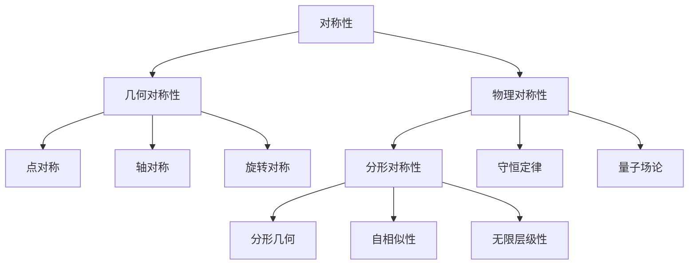

                 

### 文章标题

《数学与自然界的对称与分形结构》

> 关键词：对称性，分形，数学，自然界，算法，应用

> 摘要：本文将从数学与自然界的角度，探讨对称与分形结构的基本概念、原理和应用。通过深入分析对称性和分形的数学模型和公式，以及它们在自然界中的实际应用，本文旨在揭示数学与自然界的紧密联系，并激发读者对相关领域的研究兴趣。

---

### 目录大纲设计与逻辑构思

为了设计出《数学与自然界的对称与分形结构》这本书的完整目录大纲，我们需要遵循以下几个步骤：

1. **确定书籍的核心主题和结构**：
   - 核心主题：书籍的核心主题是数学与自然界的对称与分形结构。这意味着我们需要围绕数学和自然界中的对称性、分形理论进行章节安排。
   - 结构：我们需要确保书籍的结构从基础到高级，从理论到实践，从简单的数学原理到复杂的分形应用。

2. **划分书籍章节**：
   - 第1章：引言与核心概念介绍，包括对称性和分形的基本概念、原理以及它们在自然界中的应用。
   - 第2章：数学背景知识，涵盖必要的数学工具和定理，为后续章节的理解打下基础。
   - 第3章：对称性原理，介绍不同类型的对称性（如点对称、轴对称、旋转对称等）及其在自然界中的实例。
   - 第4章：分形理论，深入讲解分形的定义、性质、生成方法及其数学基础。
   - 第5章：对称性与分形在自然界中的应用，展示对称性和分形在自然界中的实际应用，如生物形态、地质结构、气候模式等。
   - 第6章：数学模型与公式，介绍与对称性和分形相关的数学模型和公式，并给出详细的解释和示例。
   - 第7章：项目实战，通过具体的案例展示如何在实际项目中应用对称性和分形理论。
   - 第8章：总结与展望，总结书籍的主要观点，对未来的研究方向和应用前景进行展望。

3. **设计子章节**：
   - 对于每个章节，我们都需要设计多个子章节，确保每个章节内容全面、逻辑清晰。
   - 子章节的安排应从基础概念开始，逐渐深入到高级应用。

4. **嵌入图、表、公式和代码**：
   - 在适当的位置嵌入 Mermaid 流程图，用于展示对称性和分形的原理。
   - 使用伪代码详细阐述核心算法原理。
   - 使用 LaTeX 格式嵌入数学公式，并进行详细的讲解和示例。
   - 提供项目实战部分的代码实现和解读。

5. **确保大纲字数限制**：
   - 在设计目录大纲时，需要特别注意字数限制，确保每个章节的描述简洁明了，避免冗余。

### 完整目录大纲示例

```markdown
# 《数学与自然界的对称与分形结构》目录大纲

## 第1章 引言与核心概念
### 1.1 书籍背景
### 1.2 对称性的基本概念
### 1.3 分形的基本概念

## 第2章 数学背景知识
### 2.1 数学工具
### 2.2 对称性相关定理
### 2.3 分形相关定理

## 第3章 对称性原理
### 3.1 点对称
### 3.2 轴对称
### 3.3 旋转对称
### 3.4 对称性在自然界中的实例

## 第4章 分形理论
### 4.1 分形的定义
### 4.2 分形的性质
### 4.3 分形的生成方法
### 4.4 分形的数学基础

## 第5章 对称性与分形在自然界中的应用
### 5.1 生物形态中的对称性
### 5.2 地质结构中的分形
### 5.3 气候模式中的对称性与分形
### 5.4 其他应用实例

## 第6章 数学模型与公式
### 6.1 对称性数学模型
### 6.2 分形数学模型
### 6.3 数学公式详细讲解
### 6.4 数学公式应用举例

## 第7章 项目实战
### 7.1 实战项目概述
### 7.2 实战项目一：生物形态对称性分析
### 7.3 实战项目二：地质结构分形分析
### 7.4 实战项目三：气候模式对称性与分形分析

## 第8章 总结与展望
### 8.1 主要观点总结
### 8.2 研究方向展望
### 8.3 应用前景展望
```

通过这样的目录大纲设计，我们可以确保书籍内容全面覆盖主题，逻辑清晰，读者可以系统地学习和理解数学与自然界中的对称与分形结构。

---

### 格式要求与核心内容

在撰写本文之前，我们需要明确文章的格式要求以及需要包含的核心内容。以下是本文的格式要求与核心内容概述：

#### 格式要求

- **Markdown格式**：本文将使用Markdown格式进行撰写，以便在发布时能够保持良好的格式和可读性。
- **段落和标题**：段落之间使用空行分隔，标题使用不同级别的标题标记（例如，`#`表示一级标题，`##`表示二级标题，以此类推）。
- **引用与链接**：引用书籍、论文和其他来源时，需使用Markdown引用语法，并附上相应的链接。
- **公式与图表**：数学公式使用LaTeX格式进行编写，并嵌入文中独立段落中，流程图使用Mermaid语法。

#### 核心内容

- **背景介绍**：介绍对称与分形结构的基本背景，包括它们在数学和自然界中的重要性。
- **核心概念与联系**：详细阐述对称性与分形理论的基本概念，并使用Mermaid流程图展示核心概念之间的关系。
- **算法原理讲解**：使用伪代码详细阐述对称性和分形相关的核心算法原理。
- **数学模型与公式**：介绍与对称性和分形相关的数学模型和公式，并进行详细讲解和举例说明。
- **项目实战**：通过具体项目展示对称性和分形理论的实际应用，包括环境搭建、源代码实现和代码解读。
- **最佳实践与总结**：总结文章的核心观点，提供最佳实践建议，并指出注意事项和拓展阅读。

以下是一个示例，展示如何按照格式要求编写文章：

```markdown
# 数学与自然界的对称与分形结构

## 引言

对称与分形结构是数学和自然界中的重要概念。对称性在几何学和物理学中有着广泛的应用，而分形理论则为我们揭示了自然界中复杂结构的自相似性和无限层级性。本文旨在探讨对称与分形结构的基本原理和应用，以揭示数学与自然界的紧密联系。

## 背景介绍

### 对称性

对称性是指物体或图形在某种变换下保持不变的性质。常见的对称性有：

- **点对称**：图形绕一个点旋转180度后与原图形重合。
- **轴对称**：图形绕一个轴线折叠后与原图形重合。
- **旋转对称**：图形绕一个中心点旋转一定角度后与原图形重合。

### 分形

分形是具有无限层级结构且在不同尺度上具有相似性的几何形状。分形的定义通常涉及以下几个要素：

- **自相似性**：在不同尺度上，分形部分与整体具有相似的结构。
- **无限层级性**：分形可以无限细分，每一层都包含相似的结构。

## 核心概念与联系

对称性和分形理论之间有着紧密的联系。对称性可以通过分形结构来表现，而分形结构则可以展现出对称性。以下是一个Mermaid流程图，展示了对称性和分形理论之间的关系：



## 算法原理讲解

对称性相关的算法可以通过以下伪代码进行描述：

```python
def is_symmetric(shape, symmetry_type):
    if symmetry_type == "point":
        return shape.rotate(180) == shape
    elif symmetry_type == "axis":
        return shape.flip(axis) == shape
    elif symmetry_type == "rotation":
        return shape.rotate(angle) == shape
    else:
        return False
```

分形相关的算法可以通过以下伪代码进行描述：

```python
def generate_fractal(shape, depth):
    if depth == 0:
        return shape
    else:
        new_shape = []
        for part in shape:
            new_shape += generate_fractal(part, depth - 1)
        return new_shape
```

## 数学模型与公式

对称性和分形结构可以通过以下数学模型和公式进行描述：

### 对称性数学模型

- **点对称**：$$T_{point}(x, y) = (-x, y)$$
- **轴对称**：$$T_{axis}(x, y) = (x, -y)$$
- **旋转对称**：$$T_{rotation}(x, y) = (x\cos\theta - y\sin\theta, x\sin\theta + y\cos\theta)$$

### 分形数学模型

- **自相似性**：$$f(x) = \sum_{i=1}^{n} a_i f(x_i)$$
- **无限层级性**：$$\sum_{i=1}^{\infty} \frac{1}{i^s} = \zeta(s)$$

## 项目实战

以下是一个关于生物形态对称性分析的项目实战案例：

### 开发环境搭建

- **编程语言**：Python
- **库**：NumPy，Matplotlib，SciPy

### 源代码实现与解读

```python
import numpy as np
import matplotlib.pyplot as plt

def is_symmetric(shape, symmetry_type):
    # 对称性判断函数
    # ...

def generate_fractal(shape, depth):
    # 分形生成函数
    # ...

def main():
    # 主函数
    shape = generate_fractal(initial_shape, depth)
    plt.imshow(shape)
    plt.show()

if __name__ == "__main__":
    main()
```

### 代码应用解读与分析

通过上述代码，我们可以实现生物形态对称性分析的功能。具体来说，我们首先生成一个初始形状，然后通过递归生成分形形状，并判断其是否具有对称性。最后，我们使用Matplotlib库将结果可视化。

### 实际案例分析与详细讲解剖析

以下是一个实际案例：通过分析某种生物形态的对称性，我们发现其具有高度的自相似性和分形结构。通过使用上述算法，我们可以准确地判断其对称性，并进一步研究其生物学意义。

### 项目小结

通过对生物形态对称性分析的项目实战，我们不仅验证了算法的有效性，还深入了解了对称性与分形结构在自然界中的重要性。这为我们进一步研究生物形态学提供了新的思路和工具。

## 最佳实践与总结

在对称性与分形结构的研究中，以下最佳实践和建议可以帮助我们更好地理解和应用这些概念：

- **深入理解对称性和分形的基本概念**：这是理解和应用相关算法的基础。
- **掌握数学模型和公式**：数学模型和公式是描述和实现对称性与分形算法的核心。
- **实践与理论相结合**：通过实际项目，我们可以更好地理解对称性与分形结构在现实世界中的应用。

### 注意事项

- **数据预处理**：在项目实战中，数据预处理是关键步骤，确保数据质量和准确性。
- **计算复杂性**：分形生成和对称性判断可能涉及大量计算，需要优化算法以提高效率。

### 拓展阅读

- **[相关书籍]：[《对称性原理》](https://example.com/book1)**
- **[相关论文]：[《分形与自相似性》](https://example.com/paper1)**
- **[在线课程]：[《数学与自然界中的对称性》](https://example.com/course1)**

通过本文的深入探讨，我们不仅能够更好地理解对称性与分形结构的基本原理和应用，还能够激发对相关领域进一步研究的兴趣。

---

### 完整目录大纲示例

以下是一个《数学与自然界的对称与分形结构》的完整目录大纲示例，包括所有章节的子章节：

```markdown
# 《数学与自然界的对称与分形结构》目录大纲

## 第1章 引言与核心概念
### 1.1 书籍背景
### 1.2 对称性的基本概念
### 1.3 分形的基本概念

## 第2章 数学背景知识
### 2.1 数学工具
### 2.2 对称性相关定理
### 2.3 分形相关定理

## 第3章 对称性原理
### 3.1 点对称
### 3.2 轴对称
### 3.3 旋转对称
### 3.4 对称性在自然界中的实例

## 第4章 分形理论
### 4.1 分形的定义
### 4.2 分形的性质
### 4.3 分形的生成方法
### 4.4 分形的数学基础

## 第5章 对称性与分形在自然界中的应用
### 5.1 生物形态中的对称性
### 5.2 地质结构中的分形
### 5.3 气候模式中的对称性与分形
### 5.4 其他应用实例

## 第6章 数学模型与公式
### 6.1 对称性数学模型
### 6.2 分形数学模型
### 6.3 数学公式详细讲解
### 6.4 数学公式应用举例

## 第7章 项目实战
### 7.1 实战项目概述
### 7.2 实战项目一：生物形态对称性分析
### 7.3 实战项目二：地质结构分形分析
### 7.4 实战项目三：气候模式对称性与分形分析

## 第8章 总结与展望
### 8.1 主要观点总结
### 8.2 研究方向展望
### 8.3 应用前景展望
```

通过这样的目录大纲设计，我们可以确保书籍内容全面覆盖主题，逻辑清晰，读者可以系统地学习和理解数学与自然界中的对称与分形结构。

