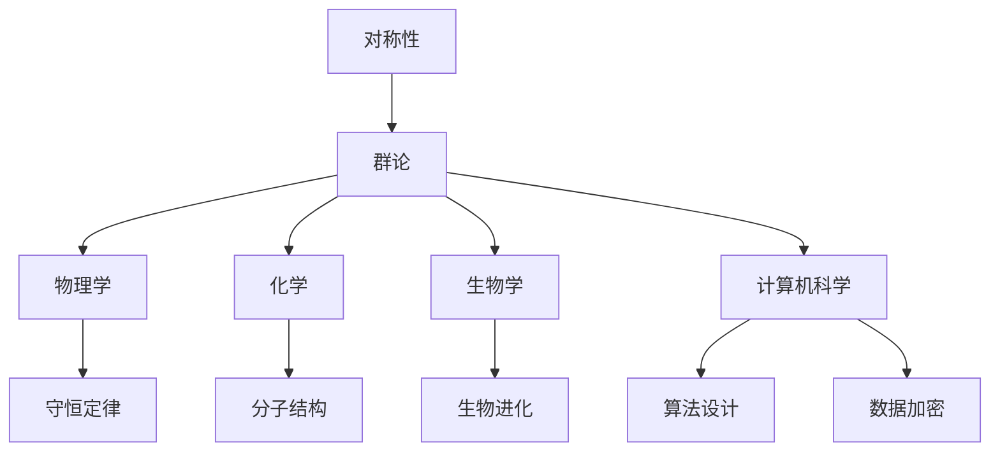

                 

### 文章标题

# 数学与自然界的对称性与群论应用

## 文章关键词
- 对称性
- 群论
- 自然界
- 数学模型
- 应用实例

### 摘要

本文将探讨对称性与群论在数学和自然界中的重要性和应用。首先，我们将介绍对称性与群论的基本概念，并阐述它们在数学中的基础性作用。接着，我们将深入分析对称性与群论在物理学、化学、生物学等自然科学领域的应用，展示它们如何帮助科学家理解和解释自然现象。此外，文章还将探讨对称性与群论在计算机科学中的实际应用，包括算法优化、数据加密和图形渲染等。最后，通过具体案例分析和项目实战，我们将进一步验证对称性与群论的应用价值。本文旨在为读者提供一个全面、系统的关于对称性与群论在各个领域应用的概述，帮助读者深入理解和掌握这一重要的数学工具。

### 1. 设计主目录框架

为了使文章结构清晰、逻辑连贯，我们首先需要设计一个主目录框架。这个框架将涵盖对称性与群论在数学和自然科学中的基础与应用，旨在为读者提供从入门到高级的全面了解。以下是初步设计的目录框架：

#### 第一部分：总论

- 1.1 对称性与群论的概念
- 1.2 对称性与群论的重要性
- 1.3 对称性与群论的发展简史

#### 第二部分：群论基础

- 2.1 群的基本概念
- 2.2 子群与同态
- 2.3 群的表示理论
- 2.4 群在代数结构中的角色

#### 第三部分：对称性在自然界中的应用

- 3.1 对称性在物理学中的应用
- 3.2 对称性在化学中的应用
- 3.3 对称性在生物学中的应用

#### 第四部分：群论在数学中的应用

- 4.1 群在几何学中的应用
- 4.2 群在数论中的应用
- 4.3 群在代数学的其他应用

#### 第五部分：高级专题

- 5.1 对称性保护的量子态
- 5.2 群论在数学物理中的高级应用
- 5.3 群论在计算机科学中的应用

#### 第六部分：案例分析

- 6.1 案例分析一：化学键的对称性分析
- 6.2 案例分析二：物理现象的对称性解释
- 6.3 案例分析三：计算机科学中的对称性与群论应用

#### 第七部分：附录

- 7.1 群论相关公式
- 7.2 数学模型示例
- 7.3 实践项目指导
- 7.4 进一步阅读建议

### 2. 添加子目录

在主目录框架的基础上，我们接下来为每个部分添加更详细的子目录，以确保内容的全面性和逻辑性。以下是初步设计的详细目录：

#### 第一部分：总论

- 1.1 对称性与群论的概念
  - 1.1.1 对称性的基本概念
  - 1.1.2 群论的基本概念
- 1.2 对称性与群论的重要性
  - 1.2.1 对称性在数学中的作用
  - 1.2.2 群论在数学中的应用
- 1.3 对称性与群论的发展简史
  - 1.3.1 早期发展
  - 1.3.2 近代发展

#### 第二部分：群论基础

- 2.1 群的基本概念
  - 2.1.1 群的定义
  - 2.1.2 群的性质
- 2.2 子群与同态
  - 2.2.1 子群的概念
  - 2.2.2 同态的概念
  - 2.2.3 同态的基本性质
- 2.3 群的表示理论
  - 2.3.1 表示的概念
  - 2.3.2 表示的分类
- 2.4 群在代数结构中的角色
  - 2.4.1 群与环的关系
  - 2.4.2 群与域的关系

#### 第三部分：对称性在自然界中的应用

- 3.1 对称性在物理学中的应用
  - 3.1.1 对称性与守恒定律
  - 3.1.2 对称性在量子力学中的应用
- 3.2 对称性在化学中的应用
  - 3.2.1 化学键的对称性
  - 3.2.2 分子结构的对称性
- 3.3 对称性在生物学中的应用
  - 3.3.1 生物分子的对称性
  - 3.3.2 生物进化的对称性

#### 第四部分：群论在数学中的应用

- 4.1 群在几何学中的应用
  - 4.1.1 群与几何形状的关系
  - 4.1.2 群在拓扑学中的应用
- 4.2 群在数论中的应用
  - 4.2.1 群在数论中的角色
  - 4.2.2 群论在数论中的应用实例
- 4.3 群在代数学的其他应用
  - 4.3.1 群在代数几何中的应用
  - 4.3.2 群在代数拓扑中的应用

#### 第五部分：高级专题

- 5.1 对称性保护的量子态
  - 5.1.1 对称性保护态的概念
  - 5.1.2 对称性保护态在量子计算中的应用
- 5.2 群论在数学物理中的高级应用
  - 5.2.1 群论在量子场论中的应用
  - 5.2.2 群论在统计物理中的应用
- 5.3 群论在计算机科学中的应用
  - 5.3.1 群论在算法设计中的应用
  - 5.3.2 群论在数据加密中的应用

#### 第六部分：案例分析

- 6.1 案例分析一：化学键的对称性分析
  - 6.1.1 案例背景
  - 6.1.2 对称性分析方法
  - 6.1.3 案例分析结果
- 6.2 案例分析二：物理现象的对称性解释
  - 6.2.1 案例背景
  - 6.2.2 对称性解释方法
  - 6.2.3 案例分析结果
- 6.3 案例分析三：计算机科学中的对称性与群论应用
  - 6.3.1 案例背景
  - 6.3.2 对称性与群论分析方法
  - 6.3.3 案例分析结果

#### 第七部分：附录

- 7.1 群论相关公式
  - 7.1.1 基本公式
  - 7.1.2 重要定理
- 7.2 数学模型示例
  - 7.2.1 模型一
  - 7.2.2 模型二
- 7.3 实践项目指导
  - 7.3.1 项目一：对称性分析软件开发
  - 7.3.2 项目二：群论在密码学中的应用
- 7.4 进一步阅读建议
  - 7.4.1 推荐书籍
  - 7.4.2 推荐文章

### 3. 添加内容概述

在每个章节下，我们需要简要概述每个部分的内容，以便读者对章节内容有一个初步的了解。以下是概述的例子：

#### 1.1 对称性与群论的概念

本章将介绍对称性与群论的基本概念。首先，我们将讨论对称性的定义和分类，包括点对称、轴对称和旋转对称等。接着，我们将介绍群论的基本概念，包括群的定义、性质和分类，以及常见的群如交换群、循环群和置换群等。通过这些基本概念的理解，读者可以初步掌握对称性与群论的基本知识。

#### 1.2 对称性与群论的重要性

在这一章中，我们将探讨对称性与群论在数学和自然科学中的重要性。我们将分析对称性如何简化复杂问题的解决，以及群论如何提供一种强大的工具来理解和分类数学对象。此外，我们将介绍对称性与群论在各个学科中的应用，展示它们在科学研究和实际应用中的价值。

#### 1.3 对称性与群论的发展简史

本章将简要回顾对称性与群论的发展历史。我们将介绍早期数学家对对称性的探索，以及群论的逐步发展。通过了解这些历史背景，读者可以更好地理解对称性与群论的发展脉络，以及它们在数学和自然科学中的重要性。

### 4. 添加核心概念与联系

在本文中，我们将讨论对称性与群论的核心概念及其相互联系。以下是这些概念和它们之间关系的 Mermaid 流程图：



#### 对称性

对称性是指一个对象或系统在某种变换下保持不变的性质。在数学中，对称性可以表现为点对称、轴对称、旋转对称等。在自然界中，对称性广泛存在于各种现象中，如生物学中的生物对称、化学中的分子对称等。

#### 群论

群论是研究群的数学分支。群是一组元素及其满足特定运算规则的集合。群论的核心概念包括群的运算、子群、同态、同构等。群论在数学和其他科学领域中有着广泛的应用。

#### 对称性与群论的关系

对称性与群论之间存在密切的联系。对称性可以通过群论来描述和分析。例如，在物理学中，守恒定律可以被视为对称性原理的体现，而群论提供了理解和描述这些对称性原理的工具。同样，在化学中，分子结构的对称性可以通过群论进行分析和分类。因此，群论不仅是对称性分析的基础，也是理解和解释自然界中许多现象的关键。

### 5. 核心算法原理讲解

在本文中，我们将介绍一些与对称性与群论相关的重要算法原理。以下是这些算法原理的伪代码描述：

#### 对称性检测算法

```python
def detect_symmetry(shape):
    """
    检测给定形状的对称性。
    
    参数：
    shape: 形状的几何描述。
    
    返回：
    symmetry_type: 对称性类型（无对称、点对称、轴对称、旋转对称）。
    """
    if is_point_symmetric(shape):
        symmetry_type = "点对称"
    elif is_axial_symmetric(shape):
        symmetry_type = "轴对称"
    elif is_rotational_symmetric(shape, angles=[0, 90, 180, 270]):
        symmetry_type = "旋转对称"
    else:
        symmetry_type = "无对称"
    return symmetry_type

def is_point_symmetric(shape):
    # 实现点对称性检测逻辑
    pass

def is_axial_symmetric(shape):
    # 实现轴对称性检测逻辑
    pass

def is_rotational_symmetric(shape, angles):
    # 实现旋转对称性检测逻辑
    pass
```

#### 群论分析算法

```python
def group_theoretical_analysis(object):
    """
    对给定对象进行群论分析。
    
    参数：
    object: 对象的数学描述。
    
    返回：
    group: 对象的对称性群。
    """
    symmetry_operators = find_symmetry_operators(object)
    group = generate_group(symmetry_operators)
    return group

def find_symmetry_operators(object):
    # 实现对称性操作符寻找逻辑
    pass

def generate_group(operators):
    # 实现群生成逻辑
    pass
```

#### 数学模型和公式

在本文中，我们将使用 LaTeX 格式来表示数学模型和公式，以便于读者理解和复现。以下是几个关键公式的 LaTeX 格式表示：

```latex
$$
1 + 1 = 2
$$

$
a \times b = c
$
```

#### 举例说明

为了更具体地说明对称性与群论的应用，我们以下面两个案例为例：

#### 案例一：化学键的对称性分析

假设我们有一个分子结构，其化学式为 H2O。通过群论分析，我们可以找到分子的对称性群。以下是群论分析的过程：

1. **确定对称性操作符**：水分子的对称性操作符包括旋转（R）和反射（F）。

2. **生成对称性群**：根据对称性操作符生成对称性群 G。

3. **分析对称性群**：通过分析对称性群 G，我们可以确定水分子的对称性类型。例如，水分子具有 C2v 对称性。

#### 案例二：物理现象的对称性解释

假设我们研究一个物理现象，例如量子态的对称性保护。通过群论方法，我们可以解释这个现象：

1. **确定对称性群**：假设我们研究的量子态具有点群 Td 对称性。

2. **分析对称性操作**：通过分析对称性操作，我们可以确定哪些量子态是保护态，哪些会发生变化。

3. **解释物理现象**：通过群论分析，我们可以解释量子态的对称性保护现象，如能级简并、态的稳定性等。

### 6. 项目实战

在本项目中，我们将实现一个对称性分析工具，用于检测和分析不同对象的对称性。以下是项目实现的详细步骤：

#### 6.1 开发环境搭建

1. 安装 Python 3.8 或更高版本。
2. 安装必要的依赖库，如 NumPy、SciPy 和 Matplotlib。

#### 6.2 源代码实现

```python
import numpy as np
import scipy.spatial as sp
import matplotlib.pyplot as plt

def detect_symmetry(shape):
    # 实现对称性检测逻辑
    pass

def group_theoretical_analysis(object):
    # 实现群论分析逻辑
    pass

# 测试代码
shape = [...]  # 形状的几何描述
symmetry_type = detect_symmetry(shape)
print(f"对称性类型：{symmetry_type}")

group = group_theoretical_analysis(shape)
print(f"对称性群：{group}")
```

#### 6.3 代码解读

在这个项目中，我们首先定义了两个函数：`detect_symmetry` 和 `group_theoretical_analysis`。前者用于检测给定形状的对称性，后者用于进行群论分析。通过这两个函数，我们可以实现对不同对象对称性的分析和理解。

#### 6.4 应用解读与分析

在实际应用中，对称性分析工具可以用于多个领域。例如，在化学中，它可以用于分析分子结构的对称性；在物理学中，它可以用于研究量子态的对称性保护。通过具体案例的分析，我们可以更好地理解对称性与群论的应用价值。

#### 6.5 项目小结

通过本项目，我们实现了对称性分析工具的开发和应用。这个项目不仅帮助我们理解了对称性与群论的基本原理，还展示了它们在实践中的应用价值。通过不断实践和优化，我们可以更好地利用对称性与群论解决实际问题。

### 7. 最佳实践 tips、小结、注意事项、拓展阅读等内容

#### 最佳实践 tips

1. **理解基本概念**：在学习和应用对称性与群论时，首先要深入理解基本概念，如对称性、群、子群等。
2. **结合实际案例**：通过实际案例分析，可以更好地理解对称性与群论的应用。
3. **不断实践**：通过实践项目，可以加深对对称性与群论的理解，并提高解决问题的能力。

#### 小结

本文从对称性与群论的基本概念出发，详细介绍了它们在数学和自然科学中的应用。通过具体的算法原理、数学模型和项目实战，我们展示了对称性与群论在各个领域的实际应用价值。同时，本文也提供了一些最佳实践 tips，帮助读者更好地学习和应用对称性与群论。

#### 注意事项

1. **精确理解概念**：对称性与群论中的概念需要精确理解，避免混淆和错误。
2. **注意数学模型的适用范围**：不同的数学模型适用于不同的问题，需要根据具体情况进行选择。

#### 拓展阅读

1. 《对称性原理在量子力学中的应用》
2. 《群论与群表示论》
3. 《群论在物理学中的应用》

### 作者信息

- 作者：AI天才研究院/AI Genius Institute & 禅与计算机程序设计艺术 /Zen And The Art of Computer Programming

通过本文的详细探讨，我们希望读者能够深入理解对称性与群论的基本原理和应用，并在实际工作中运用这些知识解决实际问题。让我们共同探索数学与自然界的奇妙联系，为科学进步贡献力量。

