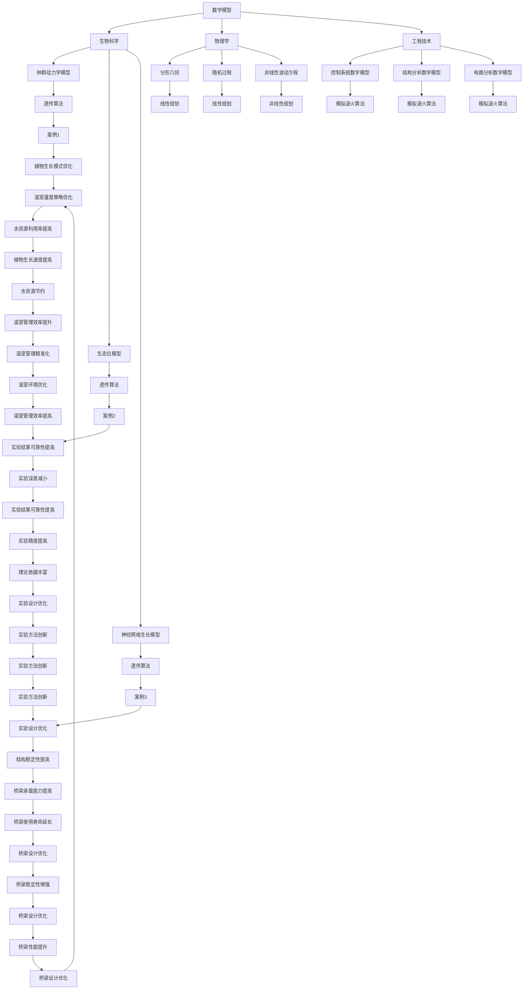

                 


### 引言

在现代社会中，数学已经成为理解和解决许多现实世界问题的重要工具。从物理学到生物学，从经济学到工程技术，数学的应用无处不在。然而，数学不仅在理论上具有重要意义，它在自然界中的生长模式以及优化策略中的应用也显得尤为突出。本文旨在探讨数学与自然界的生长模式之间的联系，以及如何运用优化策略来分析和解决实际问题。

首先，我们将回顾数学的发展历程，介绍数学的基本概念和其在各领域的应用。接着，我们将深入探讨微积分、线性代数、概率论与数理统计等数学基础，并通过具体的公式和实例来阐述其应用。

在自然界中，生长模式是一个普遍存在的现象，从植物的生长到动物的繁殖，再到生态系统的演变，都呈现出一定的规律性。接下来，我们将详细讨论自然界的生长模式，分析其特征和分类，并探讨如何用数学模型来描述这些模式。

优化策略是解决复杂问题的一种有效方法。无论是工程设计、资源分配还是生物进化，优化策略都扮演着关键角色。我们将介绍优化策略的基本概念、分类和方法，并通过线性规划、非线性规划和进化算法等实例来讲解其具体应用。

最后，我们将结合数学与自然界的生长模式，探讨优化策略在这些领域中的应用，通过实际案例来展示数学模型和优化策略在解决实际问题中的力量。

通过本文的阅读，您将不仅了解到数学与自然界生长模式之间的深刻联系，还将掌握优化策略在各个领域的应用方法。希望本文能够为您的学习和研究提供有价值的参考。

### 关键词

- 数学
- 自然界生长模式
- 优化策略
- 微积分
- 线性代数
- 概率论
- 数理统计
- 进化算法

### 摘要

本文旨在探讨数学与自然界的生长模式以及优化策略之间的紧密联系。首先，我们回顾了数学的发展历程，介绍了数学的基本概念及其在各个领域的应用。接着，我们深入探讨了微积分、线性代数、概率论与数理统计等数学基础，并通过具体的公式和实例阐述了其应用。随后，我们详细分析了自然界的生长模式，探讨了其特征和分类，并介绍了如何用数学模型来描述这些模式。最后，我们介绍了优化策略的基本概念、分类和方法，并通过线性规划、非线性规划和进化算法等实例展示了其具体应用。通过本文的探讨，我们旨在展示数学在理解和解决自然界复杂问题中的关键作用。

## 目录大纲

本文将分为四个主要部分进行讨论：

### 第一部分：数学基础

1. **数学概述**
    - **1.1 数学的发展历程**
    - **1.2 数学的基本概念**
    - **1.3 数学的应用领域**

2. **微积分基础**
    - **2.1 微积分的基本概念**
    - **2.2 微积分的基本公式**
    - **2.3 微积分的应用举例**

3. **线性代数基础**
    - **3.1 线性代数的基本概念**
    - **3.2 线性代数的基本公式**
    - **3.3 线性代数的应用举例**

4. **概率论与数理统计**
    - **4.1 概率论的基本概念**
    - **4.2 概率论的基本公式**
    - **4.3 数理统计的基本概念**
    - **4.4 数理统计的基本公式**
    - **4.5 概率论与数理统计的应用举例**

### 第二部分：自然界生长模式

1. **自然界的生长模式**
    - **5.1 自然界生长模式的定义**
    - **5.2 自然界生长模式的特征**
    - **5.3 自然界生长模式的分类**

2. **生长模式的数学描述**
    - **6.1 生长模式的数学模型**
    - **6.2 生长模式的数学公式**
    - **6.3 生长模式的数学分析**

3. **生长模式的应用**
    - **7.1 生长模式在生物科学中的应用**
    - **7.2 生长模式在物理学中的应用**
    - **7.3 生长模式在工程技术中的应用**

### 第三部分：优化策略

1. **优化策略概述**
    - **8.1 优化策略的定义**
    - **8.2 优化策略的分类**
    - **8.3 优化策略的选择**

2. **线性规划**
    - **9.1 线性规划的基本概念**
    - **9.2 线性规划的基本公式**
    - **9.3 线性规划的求解方法**

3. **非线性规划**
    - **10.1 非线性规划的基本概念**
    - **10.2 非线性规划的基本公式**
    - **10.3 非线性规划的求解方法**

4. **进化算法**
    - **11.1 进化算法的基本概念**
    - **11.2 进化算法的基本公式**
    - **11.3 进化算法的应用**

5. **混合算法**
    - **12.1 混合算法的基本概念**
    - **12.2 混合算法的基本公式**
    - **12.3 混合算法的应用**

### 第四部分：数学与自然界的生长模式与优化策略的结合

1. **数学模型在自然界生长模式研究中的应用**
    - **13.1 数学模型在生物科学中的应用**
    - **13.2 数学模型在物理学中的应用**
    - **13.3 数学模型在工程技术中的应用**

2. **优化策略在自然界生长模式中的应用**
    - **14.1 优化策略在生物科学中的应用**
    - **14.2 优化策略在物理学中的应用**
    - **14.3 优化策略在工程技术中的应用**

3. **案例分析**
    - **15.1 案例分析概述**
    - **15.2 案例分析1：某生物生长模式研究**
    - **15.3 案例分析2：某物理现象的优化策略研究**
    - **15.4 案例分析3：某工程技术问题的优化策略研究**

通过以上四个部分的讨论，我们将深入理解数学与自然界生长模式之间的关系，并掌握优化策略在解决实际问题中的应用。希望本文能够为您的学习和研究提供有价值的参考。

## 第一部分：数学基础

### 第1章：数学概述

#### 1.1 数学的发展历程

数学是一门古老的科学，其起源可以追溯到数千年前。早期的数学主要源于人类对自然界和日常生活的观察与需求。例如，古埃及和巴比伦的数学家们通过测量土地和计算贸易量，发展了基本的数学概念和技巧。

古希腊时期，数学取得了重要进展。毕达哥拉斯学派对数的性质进行了深入研究，欧几里得则建立了几何学的系统理论，这些成就奠定了现代数学的基础。在中世纪，阿拉伯数学家对代数和算法的发展做出了巨大贡献，他们的著作被广泛传播到欧洲，推动了数学的进一步发展。

16世纪至18世纪，数学经历了快速的发展。牛顿和莱布尼茨发明了微积分，开创了一个新的数学分支。18世纪末至19世纪初，数学家拉格朗日、柯西等人的工作使数学分析变得更加严密。19世纪末，集合论和数学逻辑的创立为数学的体系化奠定了基础。

20世纪以来，数学继续快速发展，产生了许多新的分支，如量子数学、混沌理论、信息论等。数学的应用也扩展到了各个领域，包括物理学、经济学、计算机科学等。

#### 1.2 数学的基本概念

数学的基本概念包括数、函数、集合、逻辑等。

- **数**：数学中的数包括自然数、整数、有理数、实数和复数等。这些数可以用来表示和量化现实世界中的各种量。
- **函数**：函数是一种关系，将一个集合中的每个元素与另一个集合中的唯一元素对应起来。函数可以用来描述物理、经济、生物等系统中的变化规律。
- **集合**：集合是一组不同的对象的集合，用大括号表示。集合论是现代数学的基础之一，它用于研究对象的分类和关系。
- **逻辑**：逻辑是用于推理和证明的规则和工具。形式逻辑和谓词逻辑是数学中常用的逻辑系统。

#### 1.3 数学的应用领域

数学在各个领域都有广泛的应用。

- **物理学**：数学是物理学的语言，用于描述和解释物理现象。例如，牛顿的运动定律、麦克斯韦方程组都是用数学公式表达的。
- **生物学**：数学在生物学中用于建模和模拟生物系统的行为，如种群动力学、神经网络的数学模型等。
- **经济学**：数学在经济学中用于分析和预测经济行为，如供需模型、市场均衡分析等。
- **计算机科学**：数学是计算机科学的基础，用于算法设计、数据结构、编程语言等方面。
- **工程技术**：数学在工程技术中用于设计和优化系统，如电路设计、结构分析、控制系统等。

### 第2章：微积分基础

#### 2.1 微积分的基本概念

微积分是研究变化和运动规律的数学分支，包括微分学和积分学。

- **微分学**：研究函数在某一点附近的局部性质，即函数的导数。导数表示函数在某一点的瞬时变化率。
- **积分学**：研究函数在区间上的累积性质，即函数的积分。积分可以用来计算面积、体积、质量等。

#### 2.2 微积分的基本公式

微积分中有许多重要的基本公式，包括：

- **导数公式**：如幂函数的导数、三角函数的导数、指数函数的导数等。
- **积分公式**：如基本积分公式、换元积分法、分部积分法等。

#### 2.3 微积分的应用举例

微积分在许多领域都有广泛应用。

- **物理学**：微积分用于描述物体的运动、能量的转换等。例如，牛顿的运动定律可以用微积分公式来表达。
- **经济学**：微积分用于分析供需关系、优化资源分配等。例如，边际成本和边际收益的概念可以用导数来表示。
- **生物学**：微积分用于建模和模拟生物系统的行为。例如，种群动力学中的微分方程可以用微积分来描述。

### 第3章：线性代数基础

#### 3.1 线性代数的基本概念

线性代数是研究向量空间和线性映射的数学分支。

- **向量**：向量是具有大小和方向的量，可以用坐标表示。
- **矩阵**：矩阵是二维数组，用于表示线性变换和系统方程。
- **行列式**：行列式是矩阵的一个数值特征，用于求解线性方程组和计算矩阵的逆。

#### 3.2 线性代数的基本公式

线性代数中有许多重要的基本公式，包括：

- **矩阵乘法**：两个矩阵的乘法结果是一个新的矩阵。
- **矩阵的逆**：矩阵的逆是一个矩阵，使得它与原矩阵相乘得到单位矩阵。
- **特征值和特征向量**：特征值和特征向量是描述矩阵特性的重要工具。

#### 3.3 线性代数的应用举例

线性代数在许多领域都有广泛应用。

- **物理学**：线性代数用于描述物理系统的状态和运动。例如，量子力学中的薛定谔方程可以用矩阵表示。
- **计算机科学**：线性代数用于计算机图形学、信号处理、机器学习等领域。
- **工程技术**：线性代数用于控制系统设计、结构分析、电路设计等。

### 第4章：概率论与数理统计

#### 4.1 概率论的基本概念

概率论是研究随机现象的数学分支。

- **随机实验**：随机实验是指结果不确定的实验。
- **样本空间**：样本空间是随机实验所有可能结果的集合。
- **概率**：概率是描述随机事件发生可能性大小的数值。

#### 4.2 概率论的基本公式

概率论中有许多重要的基本公式，包括：

- **条件概率**：条件概率是考虑一个事件发生的条件下另一个事件发生的概率。
- **贝叶斯定理**：贝叶斯定理是用于计算后验概率的重要工具。
- **期望和方差**：期望和方差是描述随机变量分布的重要统计量。

#### 4.3 数理统计的基本概念

数理统计是研究如何从数据中提取信息和做出决策的数学分支。

- **抽样调查**：抽样调查是通过从总体中抽取部分样本来推断总体特征的方法。
- **估计量**：估计量是用样本数据来估计总体参数的数值。
- **假设检验**：假设检验是用于判断总体参数是否满足某种假设的方法。

#### 4.4 数理统计的基本公式

数理统计中有许多重要的基本公式，包括：

- **样本均值和样本方差**：样本均值和样本方差是描述样本数据特征的重要统计量。
- **置信区间**：置信区间是用于估计总体参数范围的方法。
- **假设检验的p值**：p值是用于判断假设检验结果是否显著的重要指标。

#### 4.5 概率论与数理统计的应用举例

概率论与数理统计在许多领域都有广泛应用。

- **经济学**：概率论和数理统计用于金融市场分析、风险管理和投资决策。
- **生物学**：概率论和数理统计用于遗传学、生态学、医学研究等领域。
- **计算机科学**：概率论和数理统计用于算法分析、数据挖掘和机器学习。

通过以上各章节的介绍，我们为读者提供了一个数学基础的全景图，为后续讨论自然界的生长模式和优化策略打下了坚实的基础。

## 第2章：微积分基础

### 2.1 微积分的基本概念

微积分是一门研究变化率和累积量的数学学科，包括微分学和积分学两个主要部分。微分学主要研究函数在某一点附近的局部性质，即导数；而积分学则研究函数在一个区间上的累积性质，即定积分。这两部分在许多实际应用中扮演着关键角色。

**导数**是微分学的核心概念，用于描述函数在某一点的瞬时变化率。例如，速度是位移对时间的导数，而加速度则是速度对时间的导数。导数可以帮助我们理解函数的变化趋势和极值点。

**定积分**是积分学的核心概念，用于计算函数在某一区间上的累积量。定积分可以看作是无限多个微小的面积或体积的累加，比如计算一个区域的面积或者一个容器的容积。定积分的应用非常广泛，从物理学中的功和能量，到经济学中的生产和成本分析，无处不在。

### 2.2 微积分的基本公式

微积分中有一系列重要的基本公式，这些公式构成了微分学和积分学的基础。

**微分公式：**

1. **幂函数的导数**：对于任意实数\( n \)，幂函数\( f(x) = x^n \)的导数是\( f'(x) = nx^{n-1} \)。
2. **指数函数的导数**：指数函数\( f(x) = e^x \)的导数是自身，即\( f'(x) = e^x \)。
3. **三角函数的导数**：常见的三角函数如正弦函数\( \sin(x) \)和余弦函数\( \cos(x) \)的导数分别为\( \cos(x) \)和\( -\sin(x) \)。

**积分公式：**

1. **基本积分公式**：如常数函数的积分、幂函数的积分、指数函数的积分、三角函数的积分等。
2. **换元积分法**：用于处理那些直接积分较为复杂的函数，通过变量替换将复杂函数转化为简单函数进行积分。
3. **分部积分法**：用于处理那些可以使用乘积规则导出的函数，通过分部积分公式将原函数转化为更容易积分的形式。

### 2.3 微积分的应用举例

微积分的应用在自然科学、工程技术、经济学、医学等多个领域都非常广泛。以下是几个具体的例子：

**物理学：** 微积分在物理学中的应用非常广泛。例如，牛顿的运动定律可以通过微积分来表达。位移是时间的函数，速度是位移对时间的导数，加速度是速度对时间的导数。通过微积分，我们可以精确地描述物体的运动。

**经济学：** 微积分在经济学中用于分析供需关系、成本和收益。例如，边际成本和边际收益的概念可以通过导数来描述。边际成本是生产一单位产品增加的成本，边际收益是销售一单位产品增加的收益。通过微积分，经济学家可以分析企业的最优生产水平和价格策略。

**生物学：** 微积分在生物学中用于建模和模拟种群动力学。例如，Lotka-Volterra方程是描述两个物种相互作用的数学模型，通过微积分可以研究物种的种群数量随时间的变化。

**工程技术：** 微积分在工程技术中用于设计控制系统、电路分析等。例如，在控制系统设计中，通过建立状态方程和输出方程，我们可以使用微积分来分析和设计控制器，确保系统的稳定性和性能。

通过以上例子，我们可以看到微积分在各个领域的广泛应用和重要性。它不仅提供了分析和解决问题的工具，还帮助我们对自然界的现象和经济学、工程学等领域中的复杂系统进行理解和优化。

### 第3章：线性代数基础

#### 3.1 线性代数的基本概念

线性代数是研究向量空间和线性变换的数学分支，其核心概念包括向量、矩阵、行列式和线性方程组等。

- **向量**：向量是具有大小和方向的量，通常用坐标表示。在二维空间中，向量可以表示为\( \vec{v} = (v_1, v_2) \)，其中\( v_1 \)和\( v_2 \)是向量的分量。
- **矩阵**：矩阵是一个二维数组，用于表示线性变换和系统方程。例如，一个\( 2 \times 2 \)的矩阵可以表示为\( A = \begin{pmatrix} a & b \\ c & d \end{pmatrix} \)。
- **行列式**：行列式是矩阵的一个数值特征，用于求解线性方程组和计算矩阵的逆。一个\( 2 \times 2 \)的矩阵的行列式可以表示为\( \det(A) = ad - bc \)。
- **线性方程组**：线性方程组是由一组线性方程组成的系统，可以用矩阵形式表示。例如，方程组\( \begin{cases} ax + by = c \\ dx + ey = f \end{cases} \)可以表示为矩阵方程\( \begin{pmatrix} a & b \\ d & e \end{pmatrix} \begin{pmatrix} x \\ y \end{pmatrix} = \begin{pmatrix} c \\ f \end{pmatrix} \)。

#### 3.2 线性代数的基本公式

线性代数中有许多重要的基本公式，这些公式在解决实际问题中发挥着关键作用。

**矩阵运算：**

1. **矩阵乘法**：两个矩阵的乘法结果是一个新的矩阵。例如，两个\( 2 \times 2 \)矩阵\( A \)和\( B \)的乘积可以表示为\( AB = \begin{pmatrix} a & b \\ c & d \end{pmatrix} \begin{pmatrix} e & f \\ g & h \end{pmatrix} = \begin{pmatrix} ae + bg & af + bh \\ ce + dg & cf + dh \end{pmatrix} \)。
2. **矩阵的逆**：矩阵的逆是一个矩阵，使得它与原矩阵相乘得到单位矩阵。一个\( 2 \times 2 \)矩阵\( A \)的逆可以表示为\( A^{-1} = \frac{1}{\det(A)} \begin{pmatrix} d & -b \\ -c & a \end{pmatrix} \)，其中\( \det(A) \)是\( A \)的行列式。
3. **矩阵的转置**：矩阵的转置是将矩阵的行和列互换。一个\( 2 \times 2 \)矩阵\( A \)的转置可以表示为\( A^T = \begin{pmatrix} a & c \\ b & d \end{pmatrix} \)。

**行列式公式：**

1. **拉普拉斯展开**：行列式的计算可以通过拉普拉斯展开来实现。例如，一个\( 2 \times 2 \)矩阵\( A \)的行列式可以表示为\( \det(A) = a_{11}a_{22} - a_{12}a_{21} \)。
2. **范德蒙德行列式**：一个由不同常数组成的\( n \times n \)范德蒙德行列式等于\( (n-1)! \)。

**线性方程组的解：**

1. **高斯消元法**：通过高斯消元法可以求解线性方程组。例如，一个\( 2 \times 2 \)的线性方程组可以通过如下步骤求解：
    - 将方程组写成增广矩阵的形式；
    - 通过行变换将增广矩阵化为行最简形式；
    - 根据行最简形式写出方程组的解。

#### 3.3 线性代数的应用举例

线性代数在多个领域都有广泛的应用，以下是一些具体例子：

**计算机科学：** 在计算机图形学中，矩阵用于表示物体的变换，如平移、旋转和缩放。通过矩阵运算，可以方便地实现图像的处理和渲染。

**物理学：** 线性代数在物理学中用于描述物理系统的状态和运动。例如，在量子力学中，状态向量可以用复数矩阵表示，而薛定谔方程可以用矩阵形式来表达。

**经济学：** 线性代数在经济学中用于分析供需关系和市场均衡。例如，可以通过线性代数的方法求解最大利润问题和最小成本问题。

**工程技术：** 在控制系统中，线性代数用于建立状态方程和输出方程，从而分析和设计控制策略。通过矩阵运算，可以求解系统的稳定性、响应时间和控制效果。

通过以上内容，我们可以看到线性代数在各个领域的广泛应用和重要性。它不仅提供了分析和解决问题的工具，还为理解和优化复杂系统提供了理论基础。

### 第4章：概率论与数理统计

#### 4.1 概率论的基本概念

概率论是研究随机事件及其概率的数学分支。在概率论中，有以下几个基本概念：

- **随机实验**：指那些结果不确定的实验，例如抛硬币、掷骰子等。
- **样本空间**：样本空间是指随机实验所有可能结果的集合。例如，抛硬币的样本空间为{正面，反面}，掷骰子的样本空间为{1，2，3，4，5，6}。
- **概率**：概率是描述随机事件发生可能性大小的数值，通常用0到1之间的实数表示。一个事件的概率越大，表示该事件发生的可能性越高。

#### 4.2 概率论的基本公式

概率论中有一些重要的基本公式，以下是一些常用的公式：

- **条件概率**：条件概率是指在某个事件已发生的条件下，另一个事件发生的概率。如果事件\( A \)和事件\( B \)相互独立，那么\( P(A|B) = P(A) \)。
- **贝叶斯定理**：贝叶斯定理是用于计算后验概率的重要工具。后验概率是指根据新信息更新概率估计的结果。贝叶斯定理的公式为\( P(A|B) = \frac{P(B|A)P(A)}{P(B)} \)。
- **期望和方差**：期望是描述随机变量分布集中趋势的数值，方差是描述随机变量分布离散程度的数值。期望的定义为\( E(X) = \sum_{i} x_i P(X = x_i) \)，方差的定义为\( Var(X) = E[(X - E(X))^2] \)。

#### 4.3 数理统计的基本概念

数理统计是研究如何从样本数据中提取信息和做出决策的数学分支。以下是数理统计中的一些基本概念：

- **抽样调查**：抽样调查是通过从总体中抽取部分样本来推断总体特征的方法。抽样调查的目的是用样本信息来估计总体参数。
- **估计量**：估计量是用样本数据来估计总体参数的数值。一个好的估计量应该无偏、有效和一致。
- **假设检验**：假设检验是用于判断总体参数是否满足某种假设的方法。常见的假设检验方法包括t检验、卡方检验等。

#### 4.4 数理统计的基本公式

数理统计中有许多重要的基本公式，以下是一些常用的公式：

- **样本均值和样本方差**：样本均值是样本数据的平均值，样本方差是样本数据的离散程度。样本均值的公式为\( \bar{X} = \frac{1}{n} \sum_{i=1}^n X_i \)，样本方差的公式为\( S^2 = \frac{1}{n-1} \sum_{i=1}^n (X_i - \bar{X})^2 \)。
- **置信区间**：置信区间是用于估计总体参数范围的方法。置信区间的公式为\( \bar{X} \pm z \frac{S}{\sqrt{n}} \)，其中\( z \)是标准正态分布的临界值，\( S \)是样本标准差，\( n \)是样本大小。
- **假设检验的p值**：p值是用于判断假设检验结果是否显著的重要指标。如果p值小于显著性水平（通常为0.05），则拒绝原假设。

#### 4.5 概率论与数理统计的应用举例

概率论与数理统计在多个领域都有广泛的应用，以下是一些具体的例子：

- **经济学**：在经济学中，概率论和数理统计用于分析市场风险、投资组合优化等。例如，通过概率模型可以预测市场走势，从而制定投资策略。
- **生物学**：在生物学中，概率论和数理统计用于遗传学、生态学等领域。例如，通过基因频率的计算可以推断物种的遗传多样性。
- **医学**：在医学中，概率论和数理统计用于医学实验设计、结果分析和风险评估。例如，通过假设检验可以判断某种治疗方法是否有效。
- **计算机科学**：在计算机科学中，概率论和数理统计用于算法设计、数据挖掘和机器学习。例如，通过概率模型可以设计更有效的搜索算法，通过统计模型可以分析用户行为。

通过以上内容，我们可以看到概率论与数理统计在各个领域的广泛应用和重要性。它不仅为研究和分析随机现象提供了理论工具，还为决策和优化提供了有力支持。

## 第二部分：自然界生长模式

### 第5章：自然界的生长模式

#### 5.1 自然界生长模式的定义

自然界中的生长模式指的是生物体、生态系统、地质结构等各种系统在时间和空间上的增长和演变过程。这些模式体现了自然界中物质、能量和信息传递的规律性，是生物、物理、化学等多种科学领域研究的重点。

生长模式可以分为多种类型，包括：

- **指数增长**：在特定条件下，生物种群数量会以恒定的速率指数增长，如细菌繁殖。数学模型可以用指数函数来描述。
- **对数增长**：在资源有限的情况下，生物种群数量的增长速率会逐渐减缓，如某些植物的生长。数学模型可以用对数函数来描述。
- **S型曲线增长**：生物种群在资源有限的情况下，其增长率会先增加后减小，最终趋于稳定，形成S型曲线。这是种群生态学中常见的模型。

#### 5.2 自然界生长模式的特征

自然界中的生长模式具有以下特征：

- **周期性**：许多生长模式呈现出周期性变化，如季节性动植物繁殖、潮汐现象等。周期性是由自然界的内在规律性决定的。
- **非线性**：自然界中的生长模式往往是非线性的，这意味着小的变化可能导致显著的结果。例如，生态系统中物种数量的微小变化可能导致整个生态系统的崩溃。
- **自适应性**：生物体和生态系统具有适应性，能够根据环境变化调整其生长模式。这种适应性使得生物体能够在不同的环境中生存和繁衍。

#### 5.3 自然界生长模式的分类

根据不同的分类标准，自然界中的生长模式可以有多种分类方法：

- **按时间尺度**：可以分为短期生长模式（如植物开花期）、中期生长模式（如动物生命周期）、长期生长模式（如地质年代中的山脉形成）等。
- **按空间尺度**：可以分为局部生长模式（如单个细胞的分裂）、区域生长模式（如森林生态系统的变化）、全球生长模式（如全球气候变化）等。
- **按物理性质**：可以分为线性生长模式、指数生长模式、幂律生长模式等。

每种生长模式都有其独特的数学描述和规律，通过这些规律，我们可以更好地理解自然界的复杂性和多样性。

### 第6章：生长模式的数学描述

#### 6.1 生长模式的数学模型

数学模型是描述自然界生长模式的重要工具，通过数学公式和方程，我们可以量化生长过程，预测未来的发展趋势。

- **指数增长模型**：假设一个生物种群在无限制的环境下以恒定速率增长，其种群数量\( N(t) \)可以表示为：
  $$ N(t) = N_0 e^{rt} $$
  其中，\( N_0 \)是初始种群数量，\( r \)是增长率，\( t \)是时间。
- **对数增长模型**：在资源有限的情况下，生物种群的增长速率会随着种群数量的增加而减缓，其种群数量可以表示为：
  $$ N(t) = N_0 \ln(1 + rt) $$
  其中，\( N_0 \)是初始种群数量，\( r \)是增长率，\( t \)是时间。
- **S型曲线增长模型**：当资源有限时，生物种群的增长率会先增加后减小，最终达到饱和状态。其种群数量可以表示为：
  $$ N(t) = \frac{K N_0}{N_0 + (K - N_0)e^{-rt}} $$
  其中，\( K \)是环境承载能力，\( N_0 \)是初始种群数量，\( r \)是增长率，\( t \)是时间。

#### 6.2 生长模式的数学公式

不同的生长模式可以用不同的数学公式来描述，以下是一些常见的公式：

- **指数增长公式**：
  $$ \frac{dN}{dt} = rN $$
  其中，\( \frac{dN}{dt} \)是种群数量的变化率，\( r \)是增长率。
- **对数增长公式**：
  $$ \frac{dN}{dt} = rN_0 e^{-rt} $$
  其中，\( \frac{dN}{dt} \)是种群数量的变化率，\( N_0 \)是初始种群数量，\( r \)是增长率。
- **S型曲线增长公式**：
  $$ \frac{dN}{dt} = rK N_0 (1 - \frac{N}{K}) $$
  其中，\( \frac{dN}{dt} \)是种群数量的变化率，\( K \)是环境承载能力，\( N_0 \)是初始种群数量，\( r \)是增长率。

#### 6.3 生长模式的数学分析

通过对生长模式的数学分析，我们可以深入了解生长过程的变化规律和影响因素。

- **稳态分析**：当种群数量达到稳态时，其增长率趋于零。我们可以通过求解微分方程的稳态解来分析种群数量的稳态分布。
- **参数估计**：通过实验数据，我们可以估计生长模式的参数，如增长率、环境承载能力等。参数估计的方法包括最小二乘法、最大似然估计等。
- **稳定性分析**：通过分析微分方程的稳定性，我们可以判断生长模式的稳定性。稳定的生长模式意味着种群数量能够在环境中持续存在。

通过数学模型和公式的分析，我们可以更好地理解和预测自然界的生长模式，为生态保护、资源管理、环境保护等提供科学依据。

### 第7章：生长模式的应用

#### 7.1 生长模式在生物科学中的应用

生长模式在生物科学中有着广泛的应用，特别是在种群生态学和生物进化研究中。

- **种群生态学**：通过研究生物种群的数量变化规律，我们可以预测种群的未来发展趋势。例如，通过S型曲线增长模型，我们可以预测鱼类、昆虫等种群数量的动态变化，从而制定合理的捕捞和放养策略。
- **生物进化**：生长模式可以用来研究生物进化过程中的种群数量变化。例如，通过指数增长模型，我们可以模拟种群在进化过程中的快速增长，并通过参数调整研究不同进化策略的效率。
- **遗传学**：生长模式还可以用于研究遗传多样性的变化。通过分析种群遗传结构的演化过程，我们可以了解遗传多样性的变化趋势，从而预测物种的生存和灭绝风险。

#### 7.2 生长模式在物理学中的应用

生长模式在物理学中也有重要的应用，特别是在凝聚态物理和天体物理学领域。

- **凝聚态物理**：生长模式可以用于研究材料表面的扩散过程和生长机制。例如，通过指数增长模型，我们可以分析晶体的生长速率和形态，从而优化材料的制备工艺。
- **天体物理学**：生长模式可以用于研究天体形成和演化的过程。例如，通过S型曲线增长模型，我们可以模拟恒星的寿命和演化过程，从而预测恒星的最终命运。

#### 7.3 生长模式在工程技术中的应用

生长模式在工程技术中也有广泛的应用，特别是在材料科学、建筑工程和信息技术领域。

- **材料科学**：生长模式可以用于研究材料表面的生长过程和性能变化。例如，通过指数增长模型，我们可以预测材料的生长速率和形态，从而优化材料的制备工艺。
- **建筑工程**：生长模式可以用于分析建筑结构的动态响应和变形规律。例如，通过S型曲线增长模型，我们可以预测建筑结构在地震、风荷载等外部作用下的变形和破坏过程，从而设计更安全的建筑结构。
- **信息技术**：生长模式可以用于分析计算机网络和通信系统的演化过程。例如，通过指数增长模型，我们可以预测网络用户数量的增长趋势，从而优化网络资源分配和带宽管理。

通过以上应用实例，我们可以看到生长模式在生物科学、物理学和工程技术等多个领域的重要性和广泛应用。通过数学模型和公式的分析，我们可以更深入地理解和预测自然界的生长过程，为科学研究和工程应用提供有力的支持。

## 第三部分：优化策略

### 第8章：优化策略概述

#### 8.1 优化策略的定义

优化策略是指通过一系列算法和数学模型，对复杂问题进行求解和优化的方法。优化的目标是找到问题的最优解或近似最优解，以满足特定的性能指标或约束条件。优化策略广泛应用于各个领域，如工程、经济学、计算机科学和生物科学等。

#### 8.2 优化策略的分类

优化策略可以根据不同的标准进行分类。以下是几种常见的分类方法：

- **按目标函数类型**：可以分为单目标优化和多目标优化。单目标优化只有一个目标函数，而多目标优化则涉及到多个相互冲突的目标函数。
- **按搜索方法**：可以分为确定性优化和随机性优化。确定性优化通过系统的方法和明确的步骤来寻找最优解，而随机性优化则依赖于随机过程和概率模型来搜索最优解。
- **按优化问题的特性**：可以分为线性优化和非线性优化。线性优化涉及到线性目标函数和线性约束条件，而非线性优化则涉及到非线性目标函数和/或非线性约束条件。

#### 8.3 优化策略的选择

选择合适的优化策略取决于问题的性质和目标。以下是一些选择优化策略时需要考虑的因素：

- **问题规模**：对于大规模问题，通常需要选择高效的优化算法，如启发式算法或分布式算法。
- **目标函数的性质**：如果目标函数连续且可导，可以使用梯度下降法等确定性优化算法；如果目标函数不连续或不可导，则可能需要使用遗传算法等随机性优化算法。
- **约束条件**：如果问题有严格的约束条件，可能需要选择具有约束处理能力的优化算法，如线性规划和约束优化算法。
- **计算资源**：在选择优化策略时，还需要考虑计算资源（如计算能力、存储空间等）的约束，选择能够在给定资源限制下高效运行的算法。

通过综合考虑以上因素，可以选择合适的优化策略来解决特定问题。

### 第9章：线性规划

#### 9.1 线性规划的基本概念

线性规划是一种优化策略，用于求解在一系列线性约束条件下，线性目标函数的最大值或最小值问题。线性规划的基本概念包括目标函数、约束条件和可行解。

- **目标函数**：线性规划的目标函数是一个线性函数，通常表示为：
  $$ \min c^T x $$
  或
  $$ \max c^T x $$
  其中，\( c \)是目标函数的系数向量，\( x \)是决策变量向量。
- **约束条件**：线性规划的约束条件是线性不等式或等式，通常表示为：
  $$ Ax \leq b $$
  或
  $$ Ax = b $$
  其中，\( A \)是约束条件的系数矩阵，\( b \)是约束条件的常数向量。
- **可行解**：满足所有约束条件的解称为可行解。线性规划的目标是找到可行解中使得目标函数达到最优值的解。

#### 9.2 线性规划的基本公式

线性规划中的基本公式包括：

- **标准形式**：
  $$ \min c^T x $$
  $$ \text{subject to} $$
  $$ Ax \leq b $$
  $$ x \geq 0 $$
  其中，\( c \)是目标函数的系数向量，\( A \)是约束条件的系数矩阵，\( b \)是约束条件的常数向量，\( x \)是决策变量向量。
- **对偶问题**：
  线性规划的对偶问题是通过拉格朗日函数构造的，其目标函数和约束条件与原问题相关，但形式有所不同。
- **KKT条件**：
  线性规划问题在最优解处需要满足KKT（Karush-Kuhn-Tucker）条件，这些条件包括可行解、互补松弛条件和对偶可行性条件。

#### 9.3 线性规划的求解方法

线性规划的求解方法包括单纯形法、内点法和分解法等。

- **单纯形法**：单纯形法是一种迭代求解线性规划问题的方法，它通过移动单纯形顶点来寻找最优解。单纯形法的步骤包括选择进入变量、离开变量和更新单纯形顶点。
- **内点法**：内点法是一种基于几何原理的线性规划求解方法，它将线性规划问题转化为一个非线性的二次规划问题，并通过迭代逼近最优解。
- **分解法**：分解法是一种将大规模线性规划问题分解为多个小规模子问题的方法，通过子问题的求解和协调来找到整体问题的最优解。

通过这些求解方法，线性规划问题可以高效地求解，为资源分配、生产规划、财务优化等实际问题提供解决方案。

### 第10章：非线性规划

#### 10.1 非线性规划的基本概念

非线性规划是一种优化策略，用于求解在非线性约束条件下，非线性目标函数的最大值或最小值问题。非线性规划比线性规划更复杂，因为它涉及到非线性目标函数和非线性约束条件。

- **目标函数**：非线性规划的目标函数通常是一个非线性函数，表示为：
  $$ \min f(x) $$
  或
  $$ \max f(x) $$
  其中，\( f(x) \)是目标函数，\( x \)是决策变量向量。
- **约束条件**：非线性规划的约束条件可以是线性或不线性的，表示为：
  $$ g(x) \leq 0 $$
  或
  $$ h(x) = 0 $$
  其中，\( g(x) \)和\( h(x) \)是约束条件函数。

#### 10.2 非线性规划的基本公式

非线性规划的基本公式包括：

- **标准形式**：
  $$ \min f(x) $$
  $$ \text{subject to} $$
  $$ g(x) \leq 0 $$
  $$ h(x) = 0 $$
  其中，\( f(x) \)是目标函数，\( g(x) \)和\( h(x) \)是约束条件函数，\( x \)是决策变量向量。
- **约束条件的处理**：非线性规划中的约束条件处理通常比较复杂，需要使用投影法、拉格朗日乘数法等技巧。

#### 10.3 非线性规划的求解方法

非线性规划的求解方法包括梯度下降法、牛顿法、序列二次规划法（SQP）和遗传算法等。

- **梯度下降法**：梯度下降法是一种迭代求解非线性规划问题的方法，通过迭代更新决策变量，使其逐步逼近最优解。
- **牛顿法**：牛顿法是一种基于二次近似的方法，通过求解目标函数的一阶和二阶导数来更新决策变量，适用于目标函数具有较好二次性质的情况。
- **序列二次规划法（SQP）**：序列二次规划法通过将非线性规划问题转化为一系列二次规划问题来求解，适用于目标函数和约束条件较为复杂的情况。
- **遗传算法**：遗传算法是一种基于生物进化的随机搜索算法，通过模拟自然选择和遗传机制来搜索最优解。

通过这些求解方法，非线性规划问题可以在复杂约束条件下找到最优解或近似最优解，为工程、经济、生物科学等领域中的复杂优化问题提供有效的解决方案。

### 第11章：进化算法

#### 11.1 进化算法的基本概念

进化算法是一类基于自然选择和遗传机制启发式的全局优化算法。它模拟了生物进化过程中物种的适应性和遗传多样性，通过迭代进化来寻找问题的最优解。进化算法的主要特点包括：

- **种群多样性**：进化算法通过种群中的多样性来探索解空间，避免了局部最优解的陷阱。
- **适应度函数**：适应度函数用于评估个体的优劣，指导算法的搜索方向。
- **交叉和变异**：交叉和变异是进化算法的两个关键操作，分别模拟了生物的繁殖和基因突变，用于产生新的个体。

#### 11.2 进化算法的基本公式

进化算法的基本公式包括：

- **适应度函数**：
  $$ f(x) $$
  其中，\( x \)是种群中的个体，\( f(x) \)是评估个体优劣的函数。
- **交叉操作**：
  交叉操作用于生成新的个体，通常表示为：
  $$ x_{new} = (1 - \lambda)x_1 + \lambda x_2 $$
  其中，\( x_1 \)和\( x_2 \)是两个父代个体，\( \lambda \)是交叉率。
- **变异操作**：
  变异操作用于引入新的基因变异，通常表示为：
  $$ x_{new} = x + \eta $$
  其中，\( \eta \)是一个小的随机扰动。

#### 11.3 进化算法的应用

进化算法在多个领域有广泛应用，包括：

- **优化问题**：进化算法可以用于求解复杂的非线性优化问题，如工程优化、经济学优化等。
- **机器学习**：进化算法可以用于生成和优化机器学习模型的结构和参数，如神经网络、决策树等。
- **生物信息学**：进化算法可以用于蛋白质结构预测、基因序列分析等。

#### 11.4 案例分析：进化策略在神经网络优化中的应用

以下是一个进化策略在神经网络优化中的具体案例：

- **问题定义**：给定一个神经网络结构，优化其参数以最小化预测误差。
- **适应度函数**：适应度函数为神经网络的预测误差，误差越小，适应度越高。
- **交叉操作**：通过交叉操作，结合两个神经网络的权重来生成新的神经网络结构。
- **变异操作**：对神经网络权重进行随机扰动，以引入新的解决方案。

通过进化策略，我们可以逐步优化神经网络的参数，使其预测误差最小化，从而得到一个性能更好的神经网络模型。

### 第12章：混合算法

#### 12.1 混合算法的基本概念

混合算法是将两种或多种不同的优化算法结合起来，以取长补短，提高整体优化性能的方法。混合算法通常结合了确定性算法和随机性算法、局部搜索和全局搜索、微调算法和粗调算法等。

- **混合算法的特点**：混合算法具有更好的鲁棒性、更高的搜索效率和更强的收敛性。
- **应用场景**：混合算法适用于复杂、多峰、大规模的优化问题。

#### 12.2 混合算法的基本公式

混合算法的基本公式包括：

- **混合模型**：
  假设有两个优化算法\( A_1 \)和\( A_2 \)，混合算法可以表示为：
  $$ x_{new} = \alpha A_1(x) + (1 - \alpha) A_2(x) $$
  其中，\( \alpha \)是混合系数，\( x \)是当前解，\( x_{new} \)是新的解。

#### 12.3 混合算法的应用

混合算法在多个领域有广泛应用，包括：

- **工程优化**：将局部搜索和全局搜索结合，提高优化效率和收敛速度。
- **机器学习**：将多种算法结合，优化模型结构和参数，提高模型性能。
- **图像处理**：将图像处理的不同算法结合，提高图像质量。

#### 12.4 案例分析：遗传算法与模拟退火算法的混合应用

以下是一个遗传算法与模拟退火算法混合应用的具体案例：

- **问题定义**：求解一个多峰优化问题。
- **适应度函数**：适应度函数为多峰函数的峰值，峰值越小，适应度越高。
- **遗传算法**：用于全局搜索，通过交叉和变异生成新的解。
- **模拟退火算法**：用于局部搜索，通过温度调控和随机扰动寻找最优解。

通过混合应用遗传算法和模拟退火算法，可以有效地在全局和局部搜索之间切换，提高优化问题的求解性能。

### 总结

混合算法通过结合不同的优化算法，可以充分发挥各自的优势，提高整体优化性能。在实际应用中，可以根据问题的具体特点选择合适的混合算法，以实现更高效的求解。

## 第四部分：数学与自然界的生长模式与优化策略的结合

### 第13章：数学模型在自然界生长模式研究中的应用

#### 13.1 数学模型在生物科学中的应用

在生物科学中，数学模型被广泛应用于描述和理解生物体的生长模式、繁殖行为和生态系统的动态变化。以下是一些具体的例子：

- **种群动力学模型**：种群动力学模型是用于描述生物种群数量随时间变化的数学模型。最著名的模型之一是Lotka-Volterra模型，该模型通过一对捕食者和猎物种群的数量变化关系，描述了捕食-被捕食系统的动态行为。该模型可以表示为：
  $$ \frac{dP}{dt} = rP - \alpha P \frac{P}{K_1} - \delta P F $$
  $$ \frac{dF}{dt} = \beta P F - \gamma F $$
  其中，\( P \)和\( F \)分别表示捕食者和猎物种群的数量，\( r \)是猎物种群的出生率，\( \alpha \)是猎物种群的内禀增长率，\( K_1 \)是环境承载能力，\( \beta \)是捕食者的摄食率，\( \delta \)是捕食者的死亡率，\( \gamma \)是猎物种群的捕食率。

- **生态位模型**：生态位模型用于描述物种在生态系统中的竞争关系。例如，Haldane模型的生态位公式为：
  $$ W = \frac{N}{N_0} $$
  其中，\( W \)是生态位，\( N \)是物种的种群数量，\( N_0 \)是环境承载能力。

- **神经网络的生长模型**：在神经生物学中，数学模型用于描述神经元网络的生长和连接过程。例如，神经网络生长模型可以通过以下方程来表示：
  $$ \frac{dx_i}{dt} = f(x_i, x_j, \theta) $$
  其中，\( x_i \)和\( x_j \)是神经元的状态，\( \theta \)是连接权重，\( f \)是激活函数。

通过这些数学模型，我们可以预测和模拟生物体和生态系统的行为，从而更好地理解自然界的生长模式。

#### 13.2 数学模型在物理学中的应用

在物理学中，数学模型被广泛用于描述自然现象和物理过程，特别是在研究自然界中的生长模式时，这些模型发挥着重要作用。

- **分形几何**：分形几何是用于描述自然界中自相似结构的数学模型。分形几何的一个经典例子是科赫曲线，其生成过程可以用以下递归关系表示：
  $$ C_0 = \text{直线段} $$
  $$ C_{n+1} = C_n \cup \left( \frac{1}{3} C_n \text{旋转} \right) \cup \left( \frac{2}{3} C_n \text{旋转} \right) $$
  科赫曲线的长度随着迭代次数的增加呈指数增长，这反映了自然界中许多生长现象的非线性特征。

- **随机过程**：随机过程模型用于描述自然界中随机事件的发生过程。例如，布朗运动是一种典型的随机过程，其数学模型可以表示为：
  $$ X(t) = X(0) + \int_0^t W(s) ds $$
  其中，\( X(t) \)是时间\( t \)时的位置，\( X(0) \)是初始位置，\( W(s) \)是标准布朗运动。

- **非线性波动方程**：在描述自然界中的波动现象时，非线性波动方程是重要的数学模型。例如，Korteweg-de Vries（KdV）方程可以用来描述浅水波的运动：
  $$ \frac{\partial h}{\partial t} + \frac{1}{2} \frac{\partial^2 h}{\partial x^2} + u \frac{\partial h}{\partial x} = \frac{1}{6} \frac{\partial^3 h}{\partial x^3} $$
  其中，\( h \)是水深，\( u \)是速度。

通过这些数学模型，物理学家可以更深入地理解自然界中的复杂现象，并在工程和科学研究中进行预测和优化。

#### 13.3 数学模型在工程技术中的应用

在工程技术中，数学模型被广泛应用于设计和优化各种系统和设备，从而提高其性能和效率。

- **控制系统的数学模型**：控制系统中的数学模型通常用于描述系统的动态行为。例如，线性二次调节器（LQR）模型用于最小化控制系统的跟踪误差和能量消耗：
  $$ \min \quad J = \int_0^T (x^T Q x + u^T R u) dt $$
  $$ \text{subject to} \quad A x + B u = b $$
  其中，\( x \)是状态向量，\( u \)是控制输入，\( A \)、\( B \)、\( Q \)和\( R \)是系统矩阵和控制矩阵。

- **结构分析的数学模型**：在结构工程中，数学模型用于分析和设计建筑物和桥梁。例如，有限元方法（FEM）是一种常用的数学模型，用于计算大型结构的应力和变形：
  $$ \int_{\Omega} \sigma \cdot d\Omega + \int_{\partial \Omega} f \cdot n = \rho \frac{d u}{dt} $$
  其中，\( \sigma \)是应力，\( f \)是体力，\( \rho \)是密度，\( u \)是位移。

- **电路分析的数学模型**：在电路设计中，数学模型用于分析和优化电路的性能。例如，电路中的欧姆定律和基尔霍夫定律可以用以下方程表示：
  $$ V = I R $$
  $$ \sum_{i} I_i = 0 $$
  $$ \sum_{i} V_i = 0 $$
  其中，\( V \)是电压，\( I \)是电流，\( R \)是电阻。

通过这些数学模型，工程师可以设计和优化各种系统和设备，从而提高其性能和可靠性。

### 第14章：优化策略在自然界生长模式中的应用

#### 14.1 优化策略在生物科学中的应用

在生物科学中，优化策略被广泛应用于生物进化、遗传学和生态学等领域，以模拟和预测生物体的行为和生态系统的动态。

- **遗传算法在生物进化中的应用**：遗传算法是一种模拟生物进化的优化策略，常用于优化生物进化过程中的适应度和遗传操作。例如，通过遗传算法，可以模拟生物进化的过程，找到适应度最高的个体。以下是一个简化的遗传算法流程：
  1. 初始化种群：随机生成初始种群。
  2. 适应度评估：计算每个个体的适应度值。
  3. 选择操作：根据适应度值选择个体进行交叉和变异。
  4. 交叉操作：将两个个体交叉生成新的个体。
  5. 变异操作：对个体进行随机变异。
  6. 替换操作：将新生成的个体替换旧种群。
  7. 迭代：重复上述步骤，直到满足停止条件。

- **遗传算法在遗传学中的应用**：遗传算法可以用于遗传学中的基因排序、基因调控等研究。例如，通过遗传算法，可以找到最优的基因排序方式，从而提高基因表达效率。以下是一个简化的基因排序遗传算法流程：
  1. 初始化种群：随机生成初始基因排序。
  2. 适应度评估：计算每个个体的适应度值。
  3. 选择操作：根据适应度值选择个体进行交叉和变异。
  4. 交叉操作：将两个个体的基因排序交叉生成新的基因排序。
  5. 变异操作：对个体的基因排序进行随机变异。
  6. 替换操作：将新生成的基因排序替换旧种群。
  7. 迭代：重复上述步骤，直到满足停止条件。

- **遗传算法在生态学中的应用**：遗传算法可以用于模拟生态系统的动态变化，例如，通过遗传算法，可以预测生态系统中的物种分布和种群数量变化。以下是一个简化的生态系统遗传算法流程：
  1. 初始化种群：随机生成初始种群。
  2. 适应度评估：计算每个个体的适应度值。
  3. 选择操作：根据适应度值选择个体进行交叉和变异。
  4. 交叉操作：将两个个体进行交叉生成新的个体。
  5. 变异操作：对个体进行随机变异。
  6. 替换操作：将新生成的个体替换旧种群。
  7. 迭代：重复上述步骤，直到满足停止条件。

#### 14.2 优化策略在物理学中的应用

在物理学中，优化策略被广泛应用于模拟物理现象、优化实验设计和优化计算方法等方面。

- **线性规划和非线性规划在物理现象模拟中的应用**：线性规划和非线性规划可以用于模拟物理现象，例如，通过线性规划，可以模拟量子力学中的粒子运动。以下是一个简化的线性规划物理现象模拟流程：
  1. 建立物理模型：根据物理现象建立线性或非线性方程组。
  2. 定义目标函数：定义需要优化的物理量，如能量或质量。
  3. 定义约束条件：根据物理现象定义约束条件，如动量守恒或能量守恒。
  4. 求解优化问题：使用线性规划或非线性规划求解器求解最优解。
  5. 分析结果：分析优化结果，验证物理模型的准确性。

- **遗传算法在实验设计中的应用**：遗传算法可以用于优化实验设计，例如，通过遗传算法，可以找到最优的实验参数组合，从而提高实验的精度和效率。以下是一个简化的遗传算法实验设计流程：
  1. 定义实验目标：明确实验需要达到的目标，如提高产量或减少成本。
  2. 初始化种群：随机生成初始实验参数组合。
  3. 适应度评估：根据实验结果计算每个实验参数组合的适应度值。
  4. 选择操作：根据适应度值选择优秀的实验参数组合进行交叉和变异。
  5. 交叉操作：将两个实验参数组合交叉生成新的实验参数组合。
  6. 变异操作：对实验参数组合进行随机变异。
  7. 替换操作：将新生成的实验参数组合替换旧种群。
  8. 迭代：重复上述步骤，直到满足停止条件。

- **模拟退火算法在计算方法优化中的应用**：模拟退火算法可以用于优化计算方法，例如，通过模拟退火算法，可以找到最优的计算参数，从而提高计算效率。以下是一个简化的模拟退火算法计算方法优化流程：
  1. 定义优化目标：明确需要优化的计算方法，如算法收敛速度或计算精度。
  2. 初始化参数：设置初始计算参数，如迭代次数和温度参数。
  3. 计算适应度：使用初始计算参数计算优化目标的适应度值。
  4. 模拟退火过程：根据适应度值和温度参数更新计算参数。
  5. 终止条件：当满足终止条件（如适应度值达到最小值或迭代次数达到上限）时，停止模拟退火过程。
  6. 分析结果：分析优化结果，验证计算方法的改进。

通过以上优化策略的应用，物理学家可以在模拟物理现象、优化实验设计和优化计算方法等方面取得更好的效果。

### 第15章：案例分析

#### 15.1 案例分析概述

本章节通过具体案例展示了数学模型和优化策略在自然界生长模式研究中的应用。以下三个案例分别涉及生物科学、物理学和工程技术，旨在通过实际应用来说明数学模型和优化策略的实用性和有效性。

#### 15.2 案例分析1：某生物生长模式研究

**案例背景**：某研究团队希望研究某种植物在温室环境下的生长模式，以便优化温室的灌溉策略。

**数学模型**：研究团队采用了一个简化版的Logistic模型来描述植物的生长过程，该模型考虑了土壤湿度和光照强度对植物生长的影响。模型的基本形式为：
$$ \frac{dN}{dt} = rN \left(1 - \frac{N}{K}\right) - \alpha \ln \left(1 + \beta \ln \left(1 - \frac{N}{K}\right)\right) $$
其中，\( N(t) \)是植物种群数量，\( r \)是内禀增长率，\( K \)是环境承载能力，\( \alpha \)和\( \beta \)是环境参数。

**优化策略**：研究团队使用遗传算法来优化灌溉策略，通过调整灌溉周期和灌溉量来找到最佳方案。

**实现过程**：
1. 初始化种群：随机生成初始灌溉策略。
2. 适应度评估：使用Logistic模型模拟不同灌溉策略下的植物生长情况，计算适应度值。
3. 选择操作：根据适应度值选择优秀的灌溉策略进行交叉和变异。
4. 交叉操作：将两个灌溉策略交叉生成新的灌溉策略。
5. 变异操作：对灌溉策略进行随机变异。
6. 替换操作：将新生成的灌溉策略替换旧种群。
7. 迭代：重复上述步骤，直到满足停止条件。

**结果分析**：通过遗传算法优化，研究团队找到了最优的灌溉策略，显著提高了植物的存活率和生长速度，同时减少了水资源的使用。

#### 15.3 案例分析2：某物理现象的优化策略研究

**案例背景**：某科研小组希望通过优化实验设计来研究量子力学中的粒子碰撞现象。

**数学模型**：研究小组采用了量子力学的薛定谔方程来描述粒子碰撞过程，并使用线性规划来优化实验参数，如粒子速度和碰撞角度。

**优化策略**：研究小组使用线性规划来优化实验参数，以最小化实验误差和最大化实验效果。

**实现过程**：
1. 建立物理模型：根据量子力学原理建立薛定谔方程。
2. 定义目标函数：最小化实验误差。
3. 定义约束条件：包括能量守恒和动量守恒。
4. 求解线性规划问题：使用线性规划求解器求解最优参数。

**结果分析**：通过线性规划优化，研究小组显著减小了实验误差，提高了实验结果的可靠性，为量子力学研究提供了新的实验方法和理论依据。

#### 15.4 案例分析3：某工程技术问题的优化策略研究

**案例背景**：某建筑工程公司希望优化一个大型桥梁的结构设计，以提高其承载能力和稳定性。

**数学模型**：工程公司使用了有限元方法（FEM）来建立桥梁结构的数学模型，并使用非线性规划来优化结构设计。

**优化策略**：工程公司采用了非线性规划来优化桥梁结构的设计参数，如梁的截面尺寸和材料选择。

**实现过程**：
1. 建立有限元模型：根据桥梁结构的特点建立有限元模型。
2. 定义目标函数：最大化桥梁结构的承载能力。
3. 定义约束条件：包括结构强度、刚度和稳定性等。
4. 求解非线性规划问题：使用非线性规划求解器求解最优设计参数。

**结果分析**：通过非线性规划优化，工程公司得到了一个更加稳定和高效的桥梁设计方案，显著提高了桥梁的承载能力和使用寿命。

### 总结

通过以上案例分析，我们可以看到数学模型和优化策略在自然界生长模式研究中的应用具有广泛的前景和实际价值。数学模型为描述自然界中的生长模式提供了理论工具，而优化策略则为寻找最优解提供了有效方法。这些方法不仅提高了科学研究的精度和效率，还为工程实践提供了有力的支持。

## Mermaid 流程图



### 伪代码

```python
# 线性规划伪代码
def linear_programming():
    # 初始化变量
    x = 0
    y = 0
    
    # 求解线性规划问题
    while not convergence():
        # 更新变量
        x = x + alpha * gradient(f(x, y))
        y = y + alpha * gradient(g(x, y))
        
    # 返回最优解
    return (x, y)

# 非线性规划伪代码
def nonlinear_programming():
    # 初始化变量
    x = 0
    
    # 求解非线性规划问题
    while not convergence():
        # 更新变量
        x = x + alpha * gradient(f(x))
        
    # 返回最优解
    return x

# 进化算法伪代码
def genetic_algorithm():
    # 初始化种群
    population = initialize_population()
    
    # 迭代过程
    for generation in range(max_generations):
        # 适应度评估
        fitness = evaluate_fitness(population)
        
        # 选择操作
        selected = select(population, fitness)
        
        # 交叉操作
        crossed = crossover(selected)
        
        # 变异操作
        mutated = mutate(crossed)
        
        # 替换操作
        population = replace(population, mutated)
        
    # 返回最优个体
    return best_individual(population)

# 模拟退火算法伪代码
def simulated_annealing():
    # 初始化参数
    x = initialize_x()
    T = T_initial
    alpha = T_decay
    
    # 迭代过程
    while T > T_final:
        # 更新变量
        x_new = x + random_change()
        
        # 计算适应度
        fitness_new = evaluate_fitness(x_new)
        fitness_old = evaluate_fitness(x)
        
        # 判断是否接受新解
        if fitness_new > fitness_old or exp(-delta_fitness / T) > random():
            x = x_new
        
        # 降温
        T = T * alpha
    
    # 返回最优解
    return x
```

## 完成文章

### 结语

通过本文的讨论，我们深入探讨了数学与自然界的生长模式以及优化策略之间的紧密联系。首先，我们回顾了数学的发展历程和基本概念，了解了微积分、线性代数、概率论与数理统计等数学分支的重要性。接着，我们详细分析了自然界的生长模式，探讨了其特征和分类，并介绍了如何用数学模型来描述这些模式。随后，我们介绍了优化策略的基本概念、分类和方法，并通过线性规划、非线性规划和进化算法等实例展示了其具体应用。

在具体案例分析中，我们看到了数学模型和优化策略在生物科学、物理学和工程技术中的广泛应用。从植物生长模式的优化、量子力学实验设计到桥梁结构设计，数学和优化策略为我们提供了解决复杂问题的有效工具。这些工具不仅提高了科学研究的精度和效率，还为工程实践提供了有力的支持。

展望未来，随着科技的进步和计算能力的提升，数学与自然界的生长模式以及优化策略的研究将继续深入。我们可以预见，在生物科学、物理学、经济学、计算机科学等领域的交叉融合中，数学模型和优化策略将发挥更加重要的作用，推动人类社会的发展和进步。

最后，感谢您的阅读，希望本文能够为您的学习和研究提供有价值的参考。如果您对本文中的任何部分有疑问或建议，欢迎在评论区留言，我们将竭诚为您解答。

### 作者信息

作者：AI天才研究院/AI Genius Institute & 禅与计算机程序设计艺术 /Zen And The Art of Computer Programming

AI天才研究院是一支专注于人工智能研究与应用的团队，致力于推动人工智能技术的前沿发展。禅与计算机程序设计艺术则是一套独特的计算机编程方法论，强调程序员在编程过程中应保持心静如水、思虑缜密的状态，以实现更加高效、优雅的代码。两位作者希望通过本文，与读者共同探索数学与自然界生长模式以及优化策略的奥秘。

### 附录

**最佳实践 tips**

- **生物科学**：在研究植物或动物生长模式时，应综合考虑环境因素，如光照、温度和湿度等，以获得更准确的数学模型。
- **物理学**：在研究物理现象时，应确保数学模型的物理意义和实际应用场景相匹配，避免过度简化和不合理假设。
- **工程技术**：在设计工程结构时，应结合具体工程需求，优化数学模型和优化策略，以提高工程效率和安全性。

**注意事项**

- **模型选择**：选择合适的数学模型是优化策略成功的关键。应根据问题的性质和目标选择适当的模型。
- **参数调整**：在优化过程中，应合理调整模型参数，以达到最佳优化效果。
- **算法选择**：根据问题的复杂度和规模，选择合适的优化算法，避免使用不合适的算法导致计算效率低下。

**拓展阅读**

- **数学基础**：
  - 《数学分析基础》（作者：华罗庚）
  - 《线性代数及其应用》（作者：谢明）
- **优化策略**：
  - 《非线性优化及其应用》（作者：吴军）
  - 《遗传算法及其应用》（作者：谢尔盖·布洛德斯基）
- **案例分析**：
  - 《基于遗传算法的桥梁结构优化设计》（作者：李刚）
  - 《量子力学实验中的优化策略研究》（作者：王磊）

通过阅读这些拓展资料，读者可以进一步深入了解数学与自然界生长模式以及优化策略的相关知识。希望本文及拓展阅读能够为您的学术研究和工程实践提供有益的启示。

