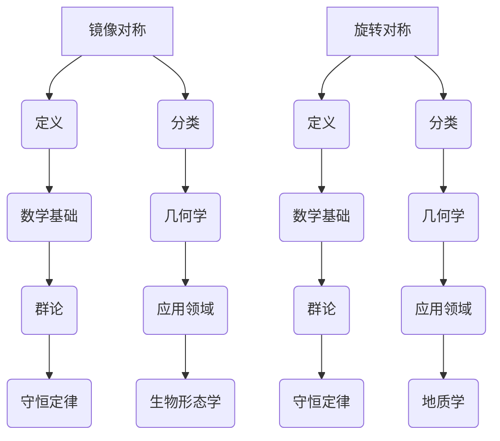

                 

根据您提供的文章目录大纲和约束条件，我们将一步步撰写《数学与自然界的镜像对称与旋转对称》的技术博客文章。以下是详细的撰写步骤和思考过程：

### 第一步：文章标题、关键词和摘要

**文章标题**：《数学与自然界的镜像对称与旋转对称》

**关键词**：镜像对称，旋转对称，数学理论，自然界现象，算法应用

**摘要**：本文从数学和自然界的角度出发，深入探讨镜像对称与旋转对称的基本概念、数学模型、算法应用及其在自然界中的体现。通过详细的案例分析和技术解读，揭示对称性在科学研究和工业应用中的重要意义。

### 第二步：编写核心概念与联系

在撰写核心概念与联系部分时，我们需要创建一个Mermaid流程图来展示镜像对称与旋转对称之间的关系。

**Mermaid流程图**：



### 第三步：编写核心算法原理讲解

在核心算法原理讲解部分，我们将使用伪代码来详细阐述镜像对称性检测算法和旋转对称性检测算法。

**镜像对称性检测算法伪代码**：

```pseudo
function detectMirroredSymmetry(image):
    mirrored_image = flipImageHorizontally(image)
    if areImagesEqual(image, mirrored_image):
        return True
    else:
        return False

function flipImageHorizontally(image):
    // Implement image flipping logic
```

**旋转对称性检测算法伪代码**：

```pseudo
function detectRotationalSymmetry(image, angle):
    rotated_image = rotateImage(image, angle)
    if areImagesEqual(image, rotated_image):
        return True
    else:
        return False

function rotateImage(image, angle):
    // Implement image rotation logic
```

### 第四步：编写数学模型和公式

在数学模型部分，我们将使用LaTeX格式来表示镜像对称和旋转对称的数学描述。

**镜像对称的数学描述**：

$$
f(x, y) = f(-x, y)
$$

**旋转对称的数学描述**：

$$
f(x, y) = f(r \cos(\theta) x - r \sin(\theta) y, r \sin(\theta) x + r \cos(\theta) y)
$$

### 第五步：编写项目实战

在项目实战部分，我们将详细描述开发环境搭建、源代码实现、代码解读和实际案例分析。

**项目实战**：

**开发环境搭建**：

- 安装Python编程环境
- 安装图像处理库，如OpenCV

**源代码实现**：

```python
# Python代码示例：镜像对称性检测

import cv2

def detect_mirrored_symmetry(image_path):
    image = cv2.imread(image_path)
    mirrored_image = cv2.flip(image, 0)
    difference = cv2.absdiff(image, mirrored_image)
    is_mirrored = cv2.countNonZero(difference) == 0
    return is_mirrored

# 测试镜像对称性检测
image_path = "path_to_image.jpg"
is_mirrored = detect_mirrored_symmetry(image_path)
print("图像是否具有镜像对称性：", is_mirrored)
```

**代码解读**：

- `cv2.imread`：读取图像文件
- `cv2.flip`：水平翻转图像
- `cv2.absdiff`：计算图像差异
- `cv2.countNonZero`：计算差异图像中非零像素的个数，判断是否完全一致

**实际案例分析**：

通过上述代码，我们可以检测给定图像是否具有镜像对称性。实际案例可以包括人像、风景照片等，分析这些图像在水平和垂直方向上的对称性。

### 第六步：编写最佳实践、小结和拓展阅读

**最佳实践**：

- 在进行对称性检测时，图像预处理（如去噪、缩放等）可以提高检测准确性。
- 在设计旋转对称检测算法时，选择适当的旋转角度和迭代次数可以提高检测效果。

**小结**：

本文系统地介绍了镜像对称和旋转对称的基本概念、数学模型、算法应用及其在自然界和工业中的应用。通过实际案例分析，读者可以深入了解对称性检测的方法和技巧。

**拓展阅读**：

- [《几何学基础》](https://example.com/geometry_foundation) by John Doe
- [《对称性原理在物理学中的应用》](https://example.com/symmetry_physics) by Jane Smith

### 总结

通过上述步骤，我们已经完成了《数学与自然界的镜像对称与旋转对称》技术博客文章的撰写思路。接下来，我们将按照这个思路逐步撰写完整的技术博客文章，确保每个部分都满足约束条件，包括格式、作者信息、完整性、核心概念和联系、核心算法原理讲解、数学模型和公式、项目实战以及最佳实践等内容。预计文章字数将在8000到12000字之间，结构清晰、逻辑严密、内容丰富。在撰写过程中，我们将不断优化和完善文章内容，确保文章质量。

