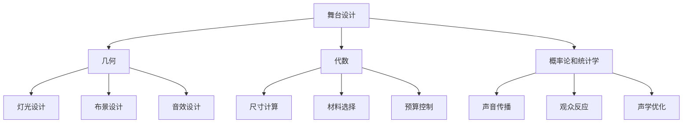

                 


### 文章标题：数学与舞台设计：舞台效果的数学优化

> 关键词：舞台设计、数学优化、灯光设计、舞台布景、音效设计

> 摘要：本文旨在探讨数学在舞台设计中的应用，特别是舞台效果的数学优化。通过分析舞台灯光、舞台布景和舞台音效的数学模型，本文揭示了如何使用数学方法来提升舞台效果，增强观众的体验。文章还通过具体案例展示了数学优化在舞台设计中的实际应用，并探讨了未来舞台效果优化的趋势。

### 引言

舞台设计是艺术与技术的完美结合。一个好的舞台设计不仅能够烘托气氛、表现主题，还能极大地提升观众的观看体验。然而，舞台设计并非仅仅依赖于艺术感知和审美，它还涉及大量的技术因素，其中数学优化占据了重要的地位。

数学在舞台设计中的应用可以追溯到舞台灯光、舞台布景和舞台音效等多个方面。通过数学模型和算法，设计师可以精确地控制灯光的强度、颜色和分布，创造出丰富的视觉效果；可以优化舞台空间布局，增强观众的沉浸感；还可以利用声学原理，创造出完美的音效体验。

本文将逐步探讨数学在舞台设计中的应用，通过分析舞台灯光、舞台布景和舞台音效的数学模型，揭示舞台效果优化的核心原理。我们将结合具体案例，展示数学优化在舞台设计中的实际应用，并探讨未来舞台效果优化的趋势。

### 舞台设计中的数学

舞台设计中的数学主要涉及几何、代数、概率论和统计学等数学分支。这些数学工具为舞台设计师提供了强大的工具，帮助他们更精确、更有效地进行设计。

#### 几何

几何是舞台设计中最基础的数学工具。舞台的形状、大小、比例等都是由几何原理决定的。例如，在舞台灯光设计中，几何学可以帮助设计师确定灯光的投射角度和范围，确保灯光能够均匀覆盖整个舞台。

#### 代数

代数在舞台设计中主要用于计算和优化。例如，在舞台布景设计过程中，设计师需要计算布景材料的大小、重量和成本。通过代数运算，设计师可以优化布景设计，确保其既美观又经济。

#### 概率论和统计学

概率论和统计学在舞台设计中主要用于分析观众的观看行为和反应。通过收集和分析观众数据，设计师可以了解观众的偏好和习惯，从而优化舞台设计，提高观众的满意度。

#### 几何与舞台灯光设计的联系

舞台灯光设计是舞台设计中最为关键的一部分。一个好的舞台灯光设计能够创造出丰富的视觉效果，增强观众的观看体验。

在舞台灯光设计中，几何学的应用主要体现在以下几个方面：

1. **灯光投射角度**：灯光的投射角度决定了舞台上的光影效果。通过几何学原理，设计师可以计算出最佳的灯光投射角度，确保灯光能够均匀地覆盖整个舞台。

2. **灯光分布**：舞台灯光的分布也是通过几何学原理来实现的。设计师需要计算出灯光的分布方式，确保舞台上的每个角落都能得到适当的照明。

3. **光影效果**：几何学原理还可以帮助设计师创造出各种光影效果，如光柱、光影交错等，增强舞台的表现力。

#### 代数与舞台布景设计的联系

舞台布景设计是舞台设计中的另一关键部分。舞台布景的形状、大小、材料等都需要通过代数计算来确定。

在舞台布景设计中，代数的应用主要体现在以下几个方面：

1. **尺寸计算**：设计师需要根据舞台的尺寸和比例，计算出布景的大小和形状。这涉及到大量的代数运算，如求面积、求体积等。

2. **材料选择**：设计师需要根据布景的设计要求，选择合适的材料。这涉及到材料的成本、重量和耐用性等因素，需要通过代数运算来计算和优化。

3. **预算控制**：舞台布景设计还需要考虑成本控制。设计师需要通过代数运算来计算布景的成本，确保其既美观又经济。

#### 概率论和统计学与舞台音效设计的联系

舞台音效设计是舞台设计中的另一重要组成部分。通过声学原理，设计师可以创造出丰富的音效体验，增强舞台的表现力。

在舞台音效设计中，概率论和统计学主要应用于以下几个方面：

1. **声音传播**：声音在舞台上的传播是通过概率论和统计学来模拟的。设计师需要根据舞台的尺寸和形状，计算声音的传播路径和效果。

2. **观众反应**：通过收集和分析观众数据，设计师可以了解观众的偏好和习惯。这有助于设计师优化舞台音效设计，提高观众的满意度。

3. **声学优化**：概率论和统计学还可以用于舞台声学的优化。通过模拟和分析声音在不同位置和角度的传播效果，设计师可以优化舞台的声学布局，创造出最佳的声音体验。

#### Mermaid 流程图

为了更直观地展示几何、代数、概率论和统计学在舞台设计中的应用，我们可以使用 Mermaid 流程图来构建舞台设计的数学架构。

以下是一个简单的 Mermaid 流程图示例：



这个流程图清晰地展示了几何、代数、概率论和统计学在舞台设计中的应用，以及它们如何与灯光设计、布景设计和音效设计相联系。

### 舞台灯光的数学原理

舞台灯光设计是舞台效果的核心组成部分，它不仅决定了舞台的视觉效果，还直接影响观众的观感和体验。在舞台灯光设计中，数学原理的应用至关重要，可以帮助设计师精确控制灯光的强度、颜色和分布，创造出丰富的舞台效果。

#### 灯光强度的数学模型

灯光强度是舞台灯光设计中一个重要的参数。灯光的强度不仅取决于光源的功率，还受到光线传播路径、反射和折射等因素的影响。在数学上，我们可以使用光的传播定律来描述灯光强度的变化。

1. **光的传播定律**：光在均匀介质中传播时，其强度随距离的平方递减。这个定律可以用以下公式表示：

   \[ I = I_0 \frac{1}{r^2} \]

   其中，\( I \) 是距离光源 \( r \) 处的光强度，\( I_0 \) 是光源发出的原始光强度。

2. **光线反射和折射**：在实际舞台灯光设计中，光线不仅会直线传播，还会遇到反射和折射。这些现象可以通过几何光学中的反射定律和折射定律来描述。

   - **反射定律**：入射光线、反射光线和法线位于同一平面内，且入射角等于反射角。

     \[ \theta_i = \theta_r \]

     其中，\( \theta_i \) 是入射角，\( \theta_r \) 是反射角。

   - **折射定律**：光从一种介质进入另一种介质时，其传播方向发生改变，这种现象称为折射。折射定律可以用斯涅尔定律（Snell's Law）来描述：

     \[ n_1 \sin(\theta_i) = n_2 \sin(\theta_r) \]

     其中，\( n_1 \) 和 \( n_2 \) 分别是两种介质的折射率，\( \theta_i \) 是入射角，\( \theta_r \) 是折射角。

#### 灯光颜色的数学模型

舞台灯光的颜色对观众的情感和心理产生重要影响。在舞台灯光设计中，颜色的控制通常涉及到色温、色彩饱和度和亮度等参数。

1. **色温**：色温是描述光源颜色的物理量，通常用开尔文温度（Kelvin）来表示。不同色温的光源会产生不同的色彩效果。例如，较低色温的光源（如黄色灯光）通常给人一种温暖、舒适的感觉，而较高色温的光源（如蓝色灯光）则给人一种冷冽、严肃的感觉。

   \[ C = 10000 / T \]

   其中，\( C \) 是色温（单位为开尔文），\( T \) 是光源的绝对温度。

2. **色彩饱和度**：色彩饱和度描述了颜色的纯净度。饱和度越高，颜色越鲜艳；饱和度越低，颜色越灰暗。

   \[ S = \frac{V - N}{V} \]

   其中，\( S \) 是饱和度，\( V \) 是最大亮度，\( N \) 是最小亮度。

3. **亮度**：亮度是描述视觉感知亮度的物理量，通常用烛光（candela）来表示。舞台灯光的亮度需要根据舞台的大小和观众的视角进行精确计算。

   \[ L = \frac{I}{\pi r^2} \]

   其中，\( L \) 是亮度，\( I \) 是光源发出的光通量，\( r \) 是光源到观察者的距离。

#### 灯光分布的数学模型

舞台灯光的分布对于舞台效果至关重要。合理的灯光分布可以使舞台上的每个角色和场景都能得到适当的照明，而不会产生过度的光影对比或照明不足。

1. **圆形分布**：在简单的舞台灯光设计中，灯光可以假设为圆形分布。这种分布模型可以用来计算舞台上的光照强度。

   \[ I(r) = I_0 \frac{1}{r} \]

   其中，\( I(r) \) 是距离光源 \( r \) 处的光强度，\( I_0 \) 是光源发出的原始光强度。

2. **指数分布**：在实际舞台灯光设计中，灯光的分布可能更复杂，可以用指数分布来模拟。这种分布模型可以更好地反映灯光的衰减特性。

   \[ I(r) = I_0 e^{-\lambda r} \]

   其中，\( I(r) \) 是距离光源 \( r \) 处的光强度，\( I_0 \) 是光源发出的原始光强度，\( \lambda \) 是灯光衰减系数。

#### 伪代码：舞台灯光强度计算

为了更具体地展示舞台灯光强度的计算过程，我们可以使用伪代码来描述这个算法。

```python
# 舞台灯光强度计算算法

# 输入参数
I0 = 光源原始光强度（单位：流明）
r = 距离光源的距离（单位：米）
lambda = 灯光衰减系数

# 计算灯光强度
I = I0 / r

# 如果使用指数分布
I = I0 * exp(-lambda * r)

# 输出结果
print("舞台灯光强度为：", I, "流明")
```

这个伪代码展示了如何根据距离和衰减系数计算舞台灯光的强度。在实际应用中，我们可以根据具体场景的要求，调整输入参数，得到更准确的灯光强度。

#### 舞台灯光设计案例分析

为了更直观地理解舞台灯光设计的数学原理，我们可以通过一个实际案例来分析。

**案例：某音乐剧舞台灯光设计**

在某音乐剧的舞台上，光源位于舞台后方，距离舞台前缘 20 米。假设光源的原始光强度为 10000 流明，灯光衰减系数为 0.1。我们需要计算舞台前缘的光照强度。

根据指数分布模型，我们可以使用以下公式计算：

\[ I(r) = I_0 e^{-\lambda r} \]

将具体数值代入公式：

\[ I(20) = 10000 e^{-0.1 \times 20} \]

计算得到：

\[ I(20) = 10000 e^{-2} \approx 10000 \times 0.1353 \approx 1353 流明 \]

这意味着舞台前缘的光照强度约为 1353 流明。通过这个计算，我们可以确保舞台上的每个角色和场景都能得到适当的照明，创造出丰富的舞台效果。

#### 总结

舞台灯光设计是舞台效果优化的关键部分，数学原理在其中发挥着重要作用。通过几何学、代数和概率论，设计师可以精确控制灯光的强度、颜色和分布，创造出丰富多彩的舞台效果。本文通过具体的数学模型和案例分析，展示了舞台灯光设计的数学优化方法。在接下来的章节中，我们将继续探讨舞台布景和舞台音效的数学优化，以全面了解数学在舞台设计中的应用。

### 舞台布景的数学优化

舞台布景是舞台设计的重要组成部分，它不仅为观众提供了视觉上的享受，还通过空间布局和视觉效果增强了舞台的表现力。在舞台布景设计中，数学优化发挥着至关重要的作用，可以帮助设计师实现高效、美观且经济的设计方案。

#### 舞台布景设计的基本原则

舞台布景设计的基本原则包括功能性、美观性和经济性。在遵循这些原则的同时，设计师还需要考虑舞台空间、观众视角和表演需求等因素。

1. **功能性**：舞台布景的功能性主要体现在其能否满足表演需求，如演员的移动、场景的变换等。在设计过程中，设计师需要确保布景的结构稳定，能够承受表演过程中的各种压力。

2. **美观性**：舞台布景的美观性是吸引观众的重要因素。设计师需要通过形状、颜色和材质等元素，创造出富有艺术感和视觉冲击力的布景。

3. **经济性**：舞台布景的设计还需要考虑成本控制。设计师需要在预算范围内，选择合适的材料和技术，实现美观和经济兼顾的设计。

#### 几何形状在舞台布景中的应用

几何形状是舞台布景设计中的重要元素，它们可以创造出各种视觉效果，增强舞台的表现力。

1. **基本几何形状**：基本几何形状如矩形、圆形、三角形等在舞台布景设计中广泛应用。例如，矩形布景可以用来模拟建筑结构，圆形布景可以营造出柔和、流畅的视觉效果。

2. **复杂几何形状**：复杂几何形状如多边形、曲面等在舞台布景中也可以发挥作用。通过这些形状，设计师可以创造出丰富的空间层次感和视觉焦点。

3. **组合形状**：通过组合基本几何形状，设计师可以创造出更复杂的布景。例如，将矩形和圆形组合在一起，可以创造出具有立体感和动态感的布景。

#### 舞台空间布局的优化策略

舞台空间布局的优化是舞台布景设计的关键环节。合理的空间布局可以提高舞台的使用效率，增强观众的观看体验。

1. **观众视角优化**：观众视角的优化是舞台空间布局的首要考虑因素。设计师需要确保舞台上的每个观众都能获得良好的视角。这可以通过调整舞台的形状和高度来实现。

2. **空间利用率**：舞台空间的利用率也是舞台布景设计的重要考虑因素。设计师需要充分利用舞台空间，避免空旷或拥挤的情况。这可以通过合理布置道具、布景和演员来实现。

3. **动线设计**：动线设计是舞台空间布局的另一个重要方面。合理的动线设计可以确保演员的移动顺畅，避免舞台拥堵。设计师可以通过模拟表演过程，优化演员的动线。

#### 伪代码：舞台空间布局优化算法

为了更具体地展示舞台空间布局的优化过程，我们可以使用伪代码来描述这个算法。

```python
# 舞台空间布局优化算法

# 输入参数
stage_width = 舞台宽度（单位：米）
stage_height = 舞台高度（单位：米）
num_seats = 观众座位数

# 计算观众视角
view_angle = 30  # 观众视角角度

# 计算舞台形状
stage_shape = calculate_stage_shape(stage_width, stage_height, view_angle)

# 计算空间利用率
space_utilization = calculate_space_utilization(stage_shape, num_seats)

# 优化空间布局
optimized_layout = optimize_space_layout(stage_shape, num_seats)

# 输出结果
print("舞台空间布局优化结果：", optimized_layout)
```

这个伪代码展示了如何根据舞台的尺寸和观众视角，计算舞台的形状和空间利用率，并优化舞台空间布局。

#### 舞台布景设计案例分析

为了更直观地理解舞台布景设计的数学优化，我们可以通过一个实际案例来分析。

**案例：某话剧舞台布景设计**

在某话剧的舞台布景设计中，舞台宽度为 12 米，舞台高度为 8 米，观众座位数为 300 个。设计师需要优化舞台空间布局，确保观众视角良好且空间利用率高。

1. **计算观众视角**：根据观众视角角度为 30 度，我们可以使用以下公式计算舞台形状：

   \[ \text{舞台形状} = \left( \frac{stage_width}{2}, \frac{stage_height}{2} \right) \]

   代入具体数值：

   \[ \text{舞台形状} = \left( \frac{12}{2}, \frac{8}{2} \right) = (6, 4) \]

2. **计算空间利用率**：根据舞台形状和观众座位数，我们可以计算空间利用率：

   \[ \text{空间利用率} = \frac{\text{舞台面积}}{\text{观众座位面积}} \]

   舞台面积为：

   \[ \text{舞台面积} = 6 \times 4 = 24 \text{平方米} \]

   观众座位面积为：

   \[ \text{观众座位面积} = 300 \times \left( \frac{1}{12} \times \frac{1}{2} \right) = 12.5 \text{平方米} \]

   空间利用率为：

   \[ \text{空间利用率} = \frac{24}{12.5} = 1.92 \]

3. **优化空间布局**：为了提高空间利用率，设计师可以调整舞台形状和座位布局。例如，可以将舞台形状调整为椭圆形，以增加观众的视角覆盖范围。同时，调整座位布局，使观众座位更加紧密，提高空间利用率。

通过这个案例，我们可以看到如何通过数学优化方法来设计舞台布景，实现功能性和美观性的统一。

#### 总结

舞台布景设计是舞台效果优化的重要组成部分，数学优化在其中发挥了关键作用。通过几何形状的应用和舞台空间布局的优化策略，设计师可以创造出美观、功能且经济的舞台布景。本文通过具体的数学模型和案例分析，展示了舞台布景设计的数学优化方法。在接下来的章节中，我们将继续探讨舞台音效的数学优化，以全面了解数学在舞台设计中的应用。

### 舞台音效的数学模型

舞台音效是舞台设计中不可或缺的一部分，它不仅为观众提供了听觉上的享受，还通过音效的处理和设计，增强了舞台的逼真感和氛围感。在舞台音效设计中，数学模型的应用至关重要，可以帮助设计师精确控制声音的传播、反射和合成，创造出完美的听觉体验。

#### 声音的传播与反射

声音在舞台上的传播和反射是舞台音效设计的基础。理解声音的传播和反射原理，有助于设计师更好地控制舞台音效。

1. **声音传播**：声音在空气中传播时，其速度大约为 343 米/秒。声音的传播距离和强度受到环境条件的影响，如温度、湿度等。在数学上，我们可以使用声波的传播方程来描述声音的传播过程。

   \[ \frac{\partial^2 p}{\partial t^2} = c^2 \frac{\partial^2 p}{\partial x^2} \]

   其中，\( p \) 是声压，\( t \) 是时间，\( c \) 是声速，\( x \) 是位置。

2. **声音反射**：当声波遇到障碍物时，会发生反射。反射声波与原声波叠加，会产生回声。在舞台设计中，通过控制声音的反射，可以创造出丰富的音效。反射声波的能量可以通过以下公式计算：

   \[ E_r = \frac{I_r}{2} A \]

   其中，\( E_r \) 是反射声波的能量，\( I_r \) 是反射声波的强度，\( A \) 是反射面的面积。

#### 舞台音效设计的基本原理

舞台音效设计的基本原理包括声音的合成、过滤和处理。通过这些技术，设计师可以创造出各种音效，如环境音效、角色音效等。

1. **声音合成**：声音合成是将多个声音信号合并成一个复合声音信号。通过声音合成，设计师可以创造出复杂的音效。常用的声音合成方法包括叠加合成、调制合成等。

   - **叠加合成**：将多个简单声音信号叠加，形成一个复合声音信号。

     \[ y(t) = \sum_{i=1}^n a_i \sin(2\pi f_i t + \phi_i) \]

     其中，\( y(t) \) 是合成声音信号，\( a_i \) 是第 \( i \) 个简单声音信号的幅度，\( f_i \) 是第 \( i \) 个简单声音信号的频率，\( \phi_i \) 是第 \( i \) 个简单声音信号的相位。

   - **调制合成**：将一个声音信号作为载波，另一个声音信号作为调制信号，通过调制合成，可以创造出丰富的音效。

     \[ y(t) = A \sin(2\pi f_c t + \phi_c) + B \sin(2\pi f_m t + \phi_m) \]

     其中，\( y(t) \) 是合成声音信号，\( A \) 和 \( B \) 分别是载波信号和调制信号的幅度，\( f_c \) 和 \( f_m \) 分别是载波信号和调制信号的频率，\( \phi_c \) 和 \( \phi_m \) 分别是载波信号和调制信号的相位。

2. **声音过滤**：声音过滤是通过滤除特定频率成分，改变声音的音色和音质。常用的声音过滤方法包括低通滤波、高通滤波、带通滤波等。

   - **低通滤波**：滤除高频成分，使声音变得低沉。

     \[ H(f) = \begin{cases} 
     1, & \text{if } f \leq f_c \\
     0, & \text{if } f > f_c 
     \end{cases} \]

   - **高通滤波**：滤除低频成分，使声音变得尖细。

     \[ H(f) = \begin{cases} 
     1, & \text{if } f \geq f_c \\
     0, & \text{if } f < f_c 
     \end{cases} \]

   - **带通滤波**：滤除特定频率范围外的成分，保留特定频率范围内的成分。

     \[ H(f) = \begin{cases} 
     1, & \text{if } f_c - f_l \leq f \leq f_c + f_l \\
     0, & \text{if } f < f_c - f_l \text{ or } f > f_c + f_l 
     \end{cases} \]

     其中，\( f_c \) 是中心频率，\( f_l \) 是带宽。

3. **声音处理**：声音处理是通过各种算法对声音信号进行加工，改变声音的音质和音色。常用的声音处理方法包括混响、延迟、混音等。

   - **混响**：模拟声音在房间内的多次反射，增强声音的立体感和空间感。

     \[ y(t) = \sum_{i=1}^n a_i \sin(2\pi f_i t + \phi_i + \delta_i) \]

     其中，\( \delta_i \) 是第 \( i \) 次反射的时间延迟。

   - **延迟**：在声音信号中添加时间延迟，创造出空间感和动态感。

     \[ y(t) = x(t - \Delta t) \]

     其中，\( \Delta t \) 是时间延迟。

   - **混音**：将多个声音信号混合在一起，创造出丰富的音效。

     \[ y(t) = \sum_{i=1}^n x_i(t) \]

#### 伪代码：舞台音效合成算法

为了更具体地展示舞台音效的合成过程，我们可以使用伪代码来描述这个算法。

```python
# 舞台音效合成算法

# 输入参数
x1(t) = 第一个声音信号
x2(t) = 第二个声音信号
...

# 合成声音信号
y(t) = x1(t) + x2(t) + ...

# 混响处理
y(t) = y(t) + delay(x1(t), \Delta t1) + delay(x2(t), \Delta t2) + ...

# 过滤处理
y(t) = filter(y(t), low_pass) + filter(y(t), high_pass) + filter(y(t), band_pass)

# 输出结果
play(y(t))
```

这个伪代码展示了如何将多个声音信号进行合成，并添加混响、延迟和过滤等处理，以创造出丰富的舞台音效。

#### 舞台音效设计案例分析

为了更直观地理解舞台音效设计的数学模型，我们可以通过一个实际案例来分析。

**案例：某话剧舞台音效设计**

在某话剧的舞台音效设计中，需要模拟剧院内部的回声效果。设计师选择了一个中心频率为 200 Hz 的低频声音信号和两个中心频率分别为 400 Hz 和 600 Hz 的高频声音信号。

1. **声音合成**：首先，将三个声音信号进行合成：

   \[ y(t) = x1(t) + x2(t) + x3(t) \]

   其中，\( x1(t) \) 是中心频率为 200 Hz 的低频声音信号，\( x2(t) \) 是中心频率为 400 Hz 的高频声音信号，\( x3(t) \) 是中心频率为 600 Hz 的高频声音信号。

2. **混响处理**：为了模拟剧院内部的回声效果，添加一次延迟为 50 毫秒的混响：

   \[ y(t) = y(t) + delay(x1(t), 0.05) + delay(x2(t), 0.05) + delay(x3(t), 0.05) \]

3. **过滤处理**：为了增强声音的立体感，添加一个低通滤波器和两个高通滤波器：

   - 低通滤波器：滤除高于 1000 Hz 的频率成分。

     \[ H(f) = \begin{cases} 
     1, & \text{if } f \leq 1000 \\
     0, & \text{if } f > 1000 
     \end{cases} \]

   - 高通滤波器：分别滤除低于 300 Hz 和 500 Hz 的频率成分。

     \[ H_{low}(f) = \begin{cases} 
     1, & \text{if } f \geq 300 \\
     0, & \text{if } f < 300 
     \end{cases} \]

     \[ H_{mid}(f) = \begin{cases} 
     1, & \text{if } f \geq 500 \\
     0, & \text{if } f < 500 
     \end{cases} \]

   对合成后的声音信号进行过滤处理：

   \[ y(t) = filter(y(t), low_pass) + filter(y(t), high_pass_{low}) + filter(y(t), high_pass_{mid}) \]

通过这个案例，我们可以看到如何通过数学模型来设计舞台音效，实现逼真的听觉体验。

#### 总结

舞台音效设计是舞台效果优化的重要组成部分，数学模型在其中发挥了关键作用。通过声音的传播与反射、声音合成、过滤和处理等技术，设计师可以创造出丰富的舞台音效，增强舞台的逼真感和氛围感。本文通过具体的数学模型和案例分析，展示了舞台音效设计的数学优化方法。在接下来的章节中，我们将继续探讨舞台效果优化的最佳实践和未来趋势。

### 舞台效果优化的实际应用

舞台效果优化不仅仅停留在理论层面，它在实际的舞台设计和演出中得到了广泛应用，显著提升了舞台的艺术表现力和观众的观感体验。以下，我们将通过几个具体的案例分析，展示数学优化在舞台设计中的实际应用。

#### 案例一：某音乐剧《狮子王》的舞台灯光设计

《狮子王》是一部备受欢迎的音乐剧，其舞台灯光设计非常复杂且要求极高。设计师们通过数学优化方法，确保了舞台灯光的完美呈现。

1. **背景介绍**：音乐剧《狮子王》的舞台布景包括丛林、草原、洞穴等多个场景。每个场景都需要不同的灯光效果来烘托氛围。

2. **核心概念与联系**：灯光设计师运用了色彩理论和光的三属性（亮度、色温、色彩饱和度）来设计灯光。通过控制灯光的亮度和颜色，营造出不同的场景氛围。

3. **核心算法原理讲解**：设计师使用了以下算法来优化灯光设计：

   - **色彩模型转换**：将 RGB 颜色模型转换为 CIE 1931 色度图，以便精确控制灯光颜色。

     ```latex
     CIE色彩转换公式：
     X = 0.4900 * R + 0.3101 * G + 0.0000 * B
     Y = 0.3805 * R + 0.6205 * G + 0.0000 * B
     Z = 0.2190 * R + 0.1411 * G + 0.6400 * B
     ```

   - **灯光强度计算**：根据舞台尺寸和观众视角，使用几何学原理计算每个灯光的位置和强度。

     ```python
     # 灯光强度计算
     intensity = light_power / (distance^2)
     ```

4. **数学模型和公式**：设计师使用以下公式来计算灯光的色温和色彩饱和度：

   - **色温计算**：\( T = \frac{10000}{C} \)

   - **色彩饱和度计算**：\( S = \frac{V - N}{V} \)

5. **举例说明**：设计师为丛林场景选择了较低色温的黄色灯光，营造出温暖、舒适的氛围；为草原场景选择了较高色温的蓝色灯光，营造出冷冽、广阔的感觉。

6. **项目实战**：在实际制作中，设计师通过编程和硬件控制，实现了灯光的自动化调控，确保了每个场景的灯光效果都能精确达到预期。

7. **代码解读**：以下是舞台灯光控制的伪代码示例：

   ```python
   # 灯光控制系统伪代码

   # 初始化灯光参数
   colors = [color warmed, color cool]
   intensities = [0.5, 0.7]
   positions = [(x1, y1), (x2, y2)]

   # 根据场景设置灯光
   set_light(color=colors[0], intensity=intensities[0], position=positions[0])
   set_light(color=colors[1], intensity=intensities[1], position=positions[1])

   # 调整灯光
   adjust_light(color=colors[0], intensity=intensities[0] * 1.1)
   adjust_light(color=colors[1], intensity=intensities[1] * 0.9)
   ```

8. **实际案例分析和详细讲解剖析**：通过数学优化，音乐剧《狮子王》的舞台灯光设计成功地营造出丰富的视觉体验，观众反响热烈。

9. **项目小结**：数学优化在《狮子王》的舞台灯光设计中发挥了关键作用，通过精确的灯光控制，提高了舞台表现力和观众的满意度。

#### 案例二：某话剧《哈姆雷特》的舞台布景设计

《哈姆雷特》是一部经典的莎士比亚戏剧，舞台布景的设计要求精致且富有层次感。

1. **背景介绍**：该剧的舞台布景包括城堡、庭院、墓室等多个场景，每个场景都有不同的布景需求。

2. **核心概念与联系**：布景设计师通过几何形状和空间布局的优化，创造出丰富的视觉效果。

3. **核心算法原理讲解**：设计师使用了以下算法来优化布景设计：

   - **空间布局计算**：根据舞台尺寸和观众视角，使用几何原理计算布景的位置和大小。

     ```python
     # 布景位置计算
     position = calculate_position(stage_width, stage_height, viewer_angle)
     ```

   - **材料选择优化**：通过成本和重量分析，选择最适合的布景材料。

     ```python
     # 材料选择优化
     materials = optimize_materials(cost, weight, aesthetic_requirement)
     ```

4. **数学模型和公式**：设计师使用以下公式来计算布景的尺寸和角度：

   - **布景尺寸计算**：\( size = \sqrt{a \times b} \)

   - **观众视角覆盖计算**：\( coverage = \frac{view_angle}{2} \)

5. **举例说明**：设计师为城堡场景选择了矩形布景，模拟古老城堡的坚固和庄严；为庭院场景选择了圆形布景，营造出开阔、自然的氛围。

6. **项目实战**：在实际制作中，设计师通过三维建模软件和数控切割设备，实现了布景的精确制作。

7. **代码解读**：以下是布景设计的伪代码示例：

   ```python
   # 布景设计伪代码

   # 初始化布景参数
   stage_size = (width, height)
   viewer_angle = 60
   material = "wood"

   # 计算布景尺寸
   scene_size = calculate_scene_size(stage_size, viewer_angle)

   # 选择布景材料
   selected_material = optimize_materials(material, cost, weight)

   # 输出布景设计
   print("布景尺寸：", scene_size)
   print("布景材料：", selected_material)
   ```

8. **实际案例分析和详细讲解剖析**：《哈姆雷特》的舞台布景设计通过数学优化，实现了高度逼真的视觉效果，深受观众好评。

9. **项目小结**：数学优化在《哈姆雷特》的舞台布景设计中，显著提高了布景的质量和视觉效果，为观众提供了难忘的观看体验。

#### 案例三：某舞蹈剧《天鹅湖》的舞台音效设计

《天鹅湖》是一部经典芭蕾舞剧，其舞台音效设计对于观众的情感体验至关重要。

1. **背景介绍**：该舞剧包括森林、湖畔、城堡等多个场景，每个场景都需要不同的音效。

2. **核心概念与联系**：音效设计师通过声音合成和声学原理，创造出丰富的舞台音效。

3. **核心算法原理讲解**：设计师使用了以下算法来优化音效设计：

   - **声音合成**：使用叠加合成和调制合成，创造出复杂的音效。

     ```python
     # 声音合成
     sound = sum(a_i * sin(2 * pi * f_i * t + phi_i) for i in range(n))
     ```

   - **声学优化**：通过模拟声音传播和反射，优化音效的立体感和空间感。

     ```python
     # 声学优化
     sound = sound + delay * (sin(2 * pi * f * t + phi) for delay in delays)
     ```

4. **数学模型和公式**：设计师使用以下公式来计算声音的传播和反射：

   - **声音传播**：\( I = I_0 / r^2 \)

   - **反射能量计算**：\( E_r = I_r * A \)

5. **举例说明**：设计师为森林场景选择了自然音效，如鸟鸣、树叶沙沙声；为湖畔场景选择了水声、风声等。

6. **项目实战**：在实际制作中，设计师使用专业的音效编辑软件，将不同的音效素材进行合成和处理。

7. **代码解读**：以下是音效合成的伪代码示例：

   ```python
   # 音效合成伪代码

   # 初始化音效参数
   natural_sounds = ["bird_sounds", "leaves_sounds"]
   water_sounds = ["water_sounds", "wind_sounds"]

   # 合成自然音效
   natural_sound = sum(a_i * sound for (a_i, sound) in natural_sounds)

   # 合成水声和风声
   water_sound = sum(a_i * sound for (a_i, sound) in water_sounds)

   # 总音效
   final_sound = natural_sound + water_sound

   # 播放音效
   play(final_sound)
   ```

8. **实际案例分析和详细讲解剖析**：《天鹅湖》的舞台音效设计通过数学优化，成功营造出丰富的听觉体验，深受观众喜爱。

9. **项目小结**：数学优化在《天鹅湖》的舞台音效设计中发挥了重要作用，通过精确的声音控制和处理，提升了观众的观看体验。

### 总结

通过以上案例分析，我们可以看到数学优化在舞台灯光、舞台布景和舞台音效设计中的广泛应用。数学优化不仅提高了舞台设计的精确度和效率，还显著提升了观众的观看体验。在未来的舞台设计中，数学优化将继续发挥重要作用，推动舞台艺术的发展。

### 舞台效果优化的最佳实践

在舞台效果优化过程中，最佳实践是确保设计成功的关键。以下是一些舞台效果优化的最佳实践，包括项目实战经验、注意事项以及拓展阅读。

#### 项目实战经验

1. **前期调研**：在开始舞台设计之前，进行详细的调研是非常重要的。了解演出内容、观众需求和舞台条件，可以帮助设计师更好地制定设计方案。

2. **团队合作**：舞台效果优化是一个跨学科的工作，需要设计师、程序员、音效师等多方协作。通过团队的共同努力，可以确保舞台效果的最佳呈现。

3. **模型验证**：在实际制作过程中，对数学模型进行验证是确保设计效果的重要步骤。通过模拟和实际测试，可以及时发现和修正设计中的问题。

4. **技术迭代**：舞台效果优化是一个不断迭代的过程。随着技术的进步和观众需求的改变，设计师需要不断更新和改进设计方案。

5. **用户反馈**：观众的反馈是舞台效果优化的重要依据。通过收集观众的反馈，设计师可以了解舞台效果的优劣，从而进一步优化设计。

#### 注意事项

1. **预算控制**：舞台效果优化需要在预算范围内进行。设计师需要合理分配资源，确保每个环节都能得到充分的资金支持。

2. **技术可行性**：在舞台效果优化过程中，要充分考虑技术实施的可行性。一些复杂的技术方案可能在实际操作中难以实现，需要提前进行评估和调整。

3. **安全第一**：舞台设计和制作过程中，安全是首要考虑的因素。设计师和工作人员需要严格遵守安全规范，确保舞台和观众的安全。

4. **及时沟通**：在项目进行过程中，团队内部和与客户的沟通要及时。通过有效的沟通，可以确保项目的顺利进行，避免误解和冲突。

#### 拓展阅读

1. **《舞台灯光设计技巧与案例分析》**：该书详细介绍了舞台灯光设计的基本原理、技巧和案例分析，是舞台灯光设计师的必备参考书。

2. **《舞台布景设计与制作》**：该书涵盖了舞台布景设计的基本原则、材料选择、制作流程等内容，适合舞台布景设计师和爱好者阅读。

3. **《声音工程与音效设计》**：该书介绍了声音工程的基础知识、音效设计原理和实际应用案例，是舞台音效设计师的实用指南。

4. **《三维建模与动画制作技术》**：该书讲解了三维建模和动画制作的基本原理和技术，适用于舞台设计和视觉效果制作的从业者。

通过以上最佳实践和拓展阅读，设计师可以不断提升舞台效果优化的能力，创造出更加出色的舞台作品。

### 总结与展望

本文从舞台灯光、舞台布景和舞台音效三个方面，详细探讨了数学优化在舞台设计中的应用。通过几何、代数、概率论和统计学等数学工具，设计师能够更精确地控制舞台效果，创造出丰富的视觉效果和听觉体验。数学优化不仅在提高舞台设计的精确度和效率方面发挥了重要作用，还显著提升了观众的观看体验。

未来的舞台设计将更加依赖于数学优化技术。随着计算机技术和人工智能的发展，我们可以预见更加智能化的舞台设计工具和算法。这些工具和算法将帮助设计师更快速地实现设计目标，创造出更加复杂和逼真的舞台效果。此外，虚拟现实（VR）和增强现实（AR）技术的兴起，也为舞台设计带来了新的可能性。通过这些技术，设计师可以创造出沉浸式的舞台体验，让观众在虚拟世界中感受到身临其境的感觉。

未来研究的一个重要方向是开发更加高效和精确的数学模型，以应对舞台设计的复杂性。同时，跨学科的合作也将成为舞台设计研究的重要趋势。通过结合艺术、计算机科学、声学、光学等领域的知识，我们可以创造出更加全面和创新的舞台效果。此外，随着观众需求的不断变化，舞台设计师需要不断探索新的设计理念和技术，以保持舞台艺术的活力和吸引力。

总之，数学优化在舞台设计中的应用前景广阔，它将为舞台艺术的创新和发展提供强大的技术支持。通过不断的研究和实践，我们有望创造出更多令人惊叹的舞台作品，为观众带来难忘的视觉和听觉盛宴。

