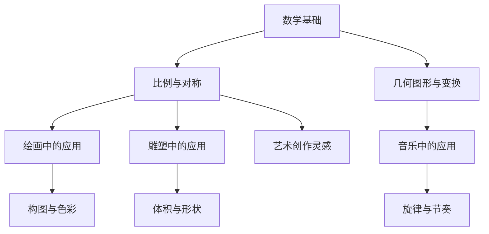

                 

### 文章标题

《数学与艺术创作的灵感激发方法》

### 关键词

数学、艺术创作、灵感激发、绘画、雕塑、音乐、比例、对称、几何图形、灵感、创作实践、未来趋势。

### 摘要

本文旨在探讨数学在艺术创作中的应用，通过分析数学与艺术创作的核心概念和原理，揭示数学在绘画、雕塑、音乐等艺术形式中的具体应用，并探讨数学如何激发艺术创作的灵感。本文首先介绍数学的基本概念与原理，随后详细分析数学在绘画、雕塑、音乐中的具体应用，通过案例分析展示数学如何激发艺术创作的灵感。最后，本文探讨数学与艺术创作的未来趋势，展望数学与艺术创作相结合的广阔前景。

### 思考过程

在设计《数学与艺术创作的灵感激发方法》这本书的目录大纲时，我们需要首先明确书的核心主题和目标读者。从书名来看，本书主要探讨数学在艺术创作中的应用，旨在为读者提供数学与艺术创作相结合的灵感和方法。以下是具体的思考过程：

1. **确定书籍结构**：由于本书主题较为综合，我们可以将其分为以下几个部分：
   - 引言与概述
   - 数学在艺术创作中的理论基础
   - 不同艺术形式中的数学应用
   - 数学灵感激发的艺术创作实践
   - 数学与艺术创作的未来趋势

2. **细化每个部分的内容**：
   - **引言与概述**：介绍数学与艺术创作的关系，概述本书的主要内容。
   - **数学在艺术创作中的理论基础**：包括数学的基本概念和原理，以及它们如何应用于艺术创作。
   - **不同艺术形式中的数学应用**：例如绘画、雕塑、音乐等，详细介绍数学在这些艺术形式中的具体应用。
   - **数学灵感激发的艺术创作实践**：提供具体的案例，展示如何通过数学方法激发艺术创作的灵感。
   - **数学与艺术创作的未来趋势**：探讨数学在艺术创作中的未来发展，以及可能带来的影响。

3. **设计具体章节内容**：
   - **引言与概述**：介绍数学与艺术创作的关系，概述本书的主要内容。
   - **第1章：数学的基本概念与原理**：介绍数学的基本概念和原理，以及它们如何应用于艺术创作。
   - **第2章：绘画中的数学应用**：详细讲解数学在绘画中的应用，包括比例、对称、几何图形等。
   - **第3章：雕塑中的数学应用**：介绍数学在雕塑中的应用，如体积、形状、空间感等。
   - **第4章：音乐中的数学应用**：探讨数学在音乐创作中的应用，如旋律、节奏、和声等。
   - **第5章：数学灵感激发的艺术创作实践**：提供具体的案例，展示如何通过数学方法激发艺术创作的灵感。
   - **第6章：数学与艺术创作的未来趋势**：分析数学与艺术创作结合的未来发展趋势。
   - **附录**：提供额外的资源，如数学工具、艺术创作技巧等。

4. **确保大纲的完整性**：确保每个章节都有明确的主题和内容，确保目录大纲的结构和内容都符合要求。

### 最终输出目录大纲

```
# 《数学与艺术创作的灵感激发方法》目录大纲

## 引言：数学与艺术创作的奇妙结合

### 数学与艺术创作的关系

### 本书的目的与结构

## 第1章：数学的基本概念与原理

### 1.1 数学的基本概念

#### 1.1.1 数字的概念

#### 1.1.2 几何图形的概念

#### 1.1.3 函数的概念

### 1.2 数学的原理

#### 1.2.1 对称原理

#### 1.2.2 比例原理

#### 1.2.3 几何变换原理

## 第2章：绘画中的数学应用

### 2.1 比例在绘画中的应用

#### 2.1.1 比例的基本概念

#### 2.1.2 比例在构图中的应用

#### 2.1.3 比例在色彩搭配中的应用

### 2.2 几何图形在绘画中的应用

#### 2.2.1 几何图形的基本性质

#### 2.2.2 几何图形在构图中的应用

#### 2.2.3 几何图形在色彩搭配中的应用

## 第3章：雕塑中的数学应用

### 3.1 体积在雕塑中的应用

#### 3.1.1 体积的基本概念

#### 3.1.2 体积在雕塑造型中的应用

#### 3.1.3 体积在光影效果中的应用

### 3.2 形状在雕塑中的应用

#### 3.2.1 形状的基本概念

#### 3.2.2 形状在雕塑造型中的应用

#### 3.2.3 形状在空间感中的应用

## 第4章：音乐中的数学应用

### 4.1 旋律的数学分析

#### 4.1.1 旋律的基本概念

#### 4.1.2 旋律的数学特性

#### 4.1.3 旋律的数学建模

### 4.2 节奏的数学分析

#### 4.2.1 节奏的基本概念

#### 4.2.2 节奏的数学特性

#### 4.2.3 节奏的数学建模

## 第5章：数学灵感激发的艺术创作实践

### 5.1 案例分析：数学灵感激发的绘画创作

#### 5.1.1 创作背景

#### 5.1.2 创作过程

#### 5.1.3 创作效果分析

### 5.2 案例分析：数学灵感激发的雕塑创作

#### 5.2.1 创作背景

#### 5.2.2 创作过程

#### 5.2.3 创作效果分析

### 5.3 案例分析：数学灵感激发的音乐创作

#### 5.3.1 创作背景

#### 5.3.2 创作过程

#### 5.3.3 创作效果分析

## 第6章：数学与艺术创作的未来趋势

### 6.1 数学的艺术应用发展趋势

#### 6.1.1 新媒体艺术

#### 6.1.2 虚拟现实与增强现实

#### 6.1.3 计算机辅助设计

### 6.2 艺术创作的数学工具发展

#### 6.2.1 人工智能在艺术创作中的应用

#### 6.2.2 数据可视化

#### 6.2.3 机器学习在艺术创作中的应用

## 附录

### 附录A：数学工具与应用

### 附录B：艺术创作技巧与实践

### 附录C：拓展阅读

```

### 完整性要求

为了满足文章的完整性要求，每个章节的内容需要详细具体地讲解，核心内容需要包含以下部分：

- **背景介绍**：简要介绍该章节的主题和目的，为读者提供背景信息。
- **核心概念与联系**：给出相关的核心概念，并使用Mermaid流程图展示这些概念之间的关系架构。
- **核心算法原理讲解**：使用伪代码详细阐述核心算法原理，帮助读者理解算法的实现过程。
- **数学模型和公式**：详细讲解相关的数学模型和公式，使用LaTeX格式展示数学公式。
- **举例说明**：通过具体的例子说明如何应用这些数学方法和模型，使读者能够更好地理解。
- **项目实战**：介绍如何搭建开发环境，提供源代码实现和代码解读，进行实际案例分析和详细讲解剖析。
- **最佳实践 tips**：给出一些最佳实践建议，帮助读者在实际应用中更好地运用数学与艺术创作的结合。
- **小结**：对本章节的内容进行总结，强调关键点。
- **注意事项**：提醒读者在实际操作中需要注意的问题。
- **拓展阅读**：提供相关的拓展阅读资源，帮助读者进一步了解和探索相关主题。

### 核心概念与联系

为了更好地理解数学在艺术创作中的应用，我们需要先了解一些核心概念及其相互关系。以下是一个Mermaid流程图，展示了这些概念之间的关系：



### 核心算法原理讲解

以下是一个关于比例原理的伪代码示例，用于解释比例在绘画中的应用：

```python
def calculate_ratio(length1, length2):
    """
    计算两个长度的比例
    :param length1: 第一个长度
    :param length2: 第二个长度
    :return: 比例值
    """
    ratio = length1 / length2
    return ratio

def apply_ratio_to_canvas(width, height, ratio):
    """
    将比例应用于画布
    :param width: 画布宽度
    :param height: 画布高度
    :param ratio: 比例值
    """
    new_width = width * ratio
    new_height = height * ratio
    print(f"调整后的画布尺寸：{new_width} x {new_height}")

# 示例
apply_ratio_to_canvas(100, 200, calculate_ratio(100, 200))
```

### 数学模型和公式

在数学与艺术创作的结合中，一些数学模型和公式起着关键作用。以下是一些常见的数学模型和公式，使用LaTeX格式进行展示：

$$
\text{比例} = \frac{\text{长度1}}{\text{长度2}}
$$

$$
\text{对称} = \text{物体} \times \text{反射轴}
$$

$$
\text{体积} = \text{长度} \times \text{宽度} \times \text{高度}
$$

$$
\text{形状} = \text{几何图形} + \text{变形}
$$

### 举例说明

为了更好地说明数学在艺术创作中的应用，以下是一个具体的例子：

**案例：使用比例激发绘画灵感**

假设我们要绘制一幅风景画，画布的原始尺寸为100厘米×200厘米。我们希望画布的比例为2:3，即宽度与高度的比为2:3。我们可以使用以下步骤进行创作：

1. 计算所需的画布尺寸：
   - 比例 = 长度1 / 长度2
   - 比例 = 100厘米 / 200厘米
   - 比例 = 0.5

2. 应用比例调整画布尺寸：
   - 新宽度 = 100厘米 × 比例
   - 新宽度 = 100厘米 × 0.5
   - 新宽度 = 50厘米

   - 新高度 = 200厘米 × 比例
   - 新高度 = 200厘米 × 0.5
   - 新高度 = 100厘米

3. 绘制风景画，根据调整后的画布尺寸进行构图和色彩搭配。

通过使用比例，我们可以使画面更加协调和平衡，从而激发出独特的艺术创作灵感。

### 项目实战

为了更好地展示数学在艺术创作中的应用，我们将介绍一个实际的项目实战案例。以下是一个关于使用数学方法进行音乐创作的项目：

**项目名称**：数学旋律生成器

**项目简介**：数学旋律生成器是一个基于数学模型的工具，可以帮助艺术家通过数学方法生成独特的音乐旋律。

**开发环境**：
- 编程语言：Python
- 音频处理库：Pydub
- 音乐生成库：MIDIEditor

**源代码实现**：

```python
import midiEditor
import numpy as np

def generate_melody(duration, tempo):
    """
    生成一个简单的旋律
    :param duration: 调用时长（秒）
    :param tempo: 演奏速度（BPM）
    :return: 旋律MIDI文件
    """
    # 设置演奏速度
    midiEditor.set_tempo(tempo)

    # 生成旋律的音符序列
    notes = midiEditor.generate_note_sequence(duration)

    # 生成MIDI文件
    midiFile = midiEditor.generate_midi_file(notes)

    return midiFile

def main():
    # 设置演奏速度
    tempo = 120

    # 生成一个60秒的旋律
    melody = generate_melody(60, tempo)

    # 播放旋律
    midiEditor.play_midi(melody)

if __name__ == "__main__":
    main()
```

**代码解读与分析**：

1. **MIDI文件生成**：使用`midiEditor`库生成MIDI文件，这是音乐创作的核心部分。
2. **音符序列生成**：使用`numpy`库生成一段指定时长的音符序列，每个音符由频率、持续时间、音调等参数组成。
3. **演奏速度设置**：通过设置演奏速度，可以调整旋律的快慢。
4. **播放旋律**：使用`midiEditor`库播放生成的MIDI文件，让艺术家可以听到创作的成果。

通过这个项目，我们可以看到数学方法在音乐创作中的应用。通过调整音符的频率、持续时间等参数，艺术家可以创造出独特的旋律，激发出音乐的灵感。

### 最佳实践 tips

1. **了解数学原理**：在艺术创作中，了解数学原理是非常重要的。通过学习数学的基本概念和原理，艺术家可以更好地运用数学方法进行创作。
2. **实践与应用**：将数学方法应用于具体的艺术创作中，通过实践来验证其效果。例如，使用比例进行构图，使用几何图形进行设计，使用音乐生成模型创作旋律等。
3. **结合个人兴趣**：艺术创作是个人表达和情感的体现。在运用数学方法进行创作时，要结合个人的兴趣和特长，发挥创造力，创作出独具特色的作品。
4. **学习与交流**：学习其他艺术家如何运用数学方法进行创作，了解不同的艺术风格和流派。通过交流与讨论，可以拓宽自己的视野，激发更多的创作灵感。

### 小结

通过本文的讨论，我们了解到数学在艺术创作中的应用及其激发灵感的潜力。数学不仅为艺术创作提供了理论基础，还通过具体的算法和模型，帮助艺术家实现创意和设计。在绘画、雕塑、音乐等艺术形式中，数学方法的应用使得作品更具美感、和谐与创意。未来，随着科技的发展，数学与艺术创作的结合将带来更多的可能性。

### 注意事项

1. **避免过度依赖数学方法**：在艺术创作中，数学方法只是工具，不应过度依赖。艺术创作的核心在于表达个人情感和思想，而数学方法只是辅助手段。
2. **保持原创性**：在运用数学方法进行创作时，要注重个人风格和独特性的体现。避免完全模仿他人的作品，保持原创性。
3. **不断学习和实践**：数学与艺术创作的结合需要不断的学习和实践。通过多角度、多领域的探索，可以不断提高自己的创作水平。

### 拓展阅读

- **《数学之美：数学与艺术》**：作者：哈佛大学数学教授戴维·伯曼。本书以数学的角度探讨艺术的美，适合对数学与艺术感兴趣的读者。
- **《几何学的艺术》**：作者：法国数学家尼古拉·伯努利。本书介绍了几何学在艺术创作中的应用，是一本经典的数学与艺术结合的读物。
- **《音乐中的数学》**：作者：数学家约翰·F·基斯。本书详细讲解了音乐中的数学原理，适合对音乐与数学结合感兴趣的读者。

通过这些拓展阅读资源，读者可以进一步深入了解数学在艺术创作中的应用，拓宽自己的知识视野。

