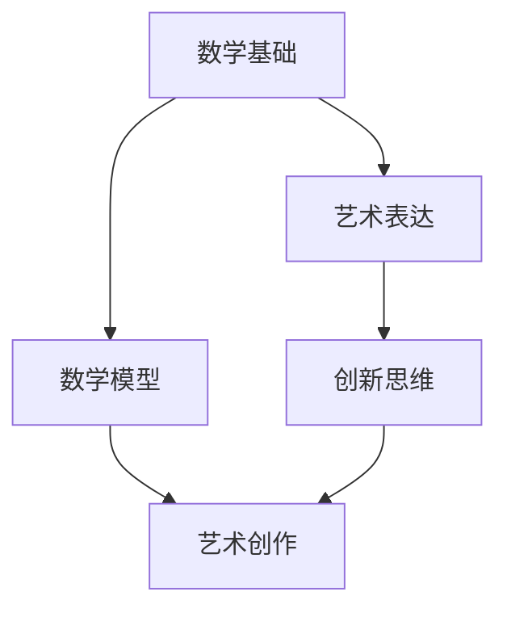
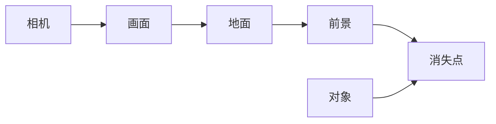

                 

# 数学与艺术创新的思维方式

## 背景介绍

数学与艺术自古以来就有着密切的联系。从古希腊的几何图案到文艺复兴时期的透视画法，再到现代艺术中的抽象表现，数学元素无处不在。数学不仅仅是自然科学的基础，它同样也是艺术创新的重要工具。本文旨在探讨数学在艺术创新中的思维方式，通过深入分析数学的基本概念、数学模型以及数学在艺术中的具体应用，揭示数学与艺术创新之间深厚的联系。

本文将分为四个主要部分进行讨论：

1. **数学与艺术基础**：介绍数学的基本概念和艺术中的数学元素。
2. **创新思维方式的数学原理**：探讨数学模型在创新思维中的应用。
3. **数学在艺术创新中的应用**：分析数学在雕塑和建筑设计等艺术形式中的应用。
4. **数学与艺术创新案例分析**：通过实际案例展示数学在艺术创新中的具体应用。

本文将使用markdown格式进行内容组织，并在文末附上相关资源和拓展阅读建议。

## 核心概念与联系

在探讨数学与艺术创新的关系之前，我们需要明确几个核心概念及其相互关系。以下是使用Mermaid绘制的流程图，展示了这些概念之间的关系：



- **数学基础（A）**：包括数学的基本概念、定理和结构，是所有数学应用的基础。
- **艺术表达（B）**：指的是艺术作品中的形式、色彩、构图等元素。
- **数学模型（C）**：将现实世界的复杂问题简化为数学问题，用于分析和解决问题。
- **创新思维（D）**：一种以新颖、独特的思维方式解决问题的关键能力。
- **艺术创作（E）**：通过数学模型和数学原理进行艺术创作，实现艺术形式的创新。

这些概念相互交织，共同推动了艺术创新的发展。数学为艺术提供了形式化的语言和工具，而艺术则通过创新的思维方式和表现形式，丰富了数学的应用领域。

## 数学模型在创新思维中的应用

### 1. 发散思维与收敛思维

创新思维可以分为发散思维和收敛思维。发散思维是指从一个问题出发，探索多种可能的解决方案。收敛思维则是在多种方案中筛选出最优解。这两种思维方式都可以借助数学模型来加强。

**发散思维：**

发散思维的一个典型案例是“随机漫步”。在随机漫步中，每个步骤都是随机的，但整体趋势可以通过数学模型预测。以下是一个简单的随机漫步模型：

```python
# 随机漫步模型伪代码
def random_walk(n):
    position = 0
    for i in range(n):
        step = random.choice([-1, 1]) # 步长为±1
        position += step
    return position
```

通过模拟大量随机漫步，我们可以发现，尽管每个步骤都是随机的，但整体趋势是向某个方向移动。

**收敛思维：**

收敛思维的一个典型应用是“线性回归”。线性回归是一种通过找到最佳拟合线来预测未知数据的方法。以下是一个简单的线性回归模型：

```latex
y = mx + b
```

其中，\( y \) 是因变量，\( x \) 是自变量，\( m \) 是斜率，\( b \) 是截距。通过最小化误差平方和，我们可以找到最佳拟合线，从而进行预测。

### 2. 横向思维与纵向思维

横向思维和纵向思维也是创新思维的重要组成部分。横向思维是指从不同的角度、领域寻找解决方案，而纵向思维则是在一个领域内深入挖掘。

**横向思维：**

横向思维的一个典型应用是“类比思维”。类比思维通过将一个领域的问题映射到另一个领域，寻找解决方案。以下是一个类比思维的例子：

```python
# 类比思维：将图像处理中的滤波算法应用于文本处理
def text_filter(text, filter_function):
    filtered_text = ""
    for char in text:
        filtered_char = filter_function(char)
        filtered_text += filtered_char
    return filtered_text
```

**纵向思维：**

纵向思维的一个典型应用是“微积分”。微积分通过研究函数的变化率，帮助我们理解动态系统。以下是一个简单的微积分例子：

```latex
f'(x) = \lim_{h \to 0} \frac{f(x+h) - f(x)}{h}
```

通过微积分，我们可以研究函数的局部性质，例如导数、积分等。

## 数学在艺术创新中的应用

### 1. 数学在雕塑艺术中的应用

数学在雕塑艺术中的应用非常广泛，特别是在结构设计和形态生成方面。以下是一些数学在雕塑中的应用：

**结构力学：**

在雕塑中，结构力学是确保雕塑稳定性的关键。通过数学模型，我们可以计算雕塑的重量分布和支撑力，从而设计出结构稳固的雕塑。

**形态生成：**

形态生成是一种通过数学方法生成复杂形态的技术。以下是一个简单的形态生成算法：

```python
# 形态生成算法伪代码
def morph_generation(shape1, shape2, t):
    result_shape = []
    for i in range(len(shape1)):
        x = (1-t) * shape1[i] + t * shape2[i]
        result_shape.append(x)
    return result_shape
```

通过调整参数 \( t \)，我们可以生成不同阶段的形态，从而实现形态的动态变化。

### 2. 数学在建筑设计中的应用

数学在建筑设计中的应用同样非常重要，特别是在空间结构设计和美学原则方面。

**空间结构设计：**

在建筑设计中，空间结构设计是确保建筑稳定性和结构强度的关键。通过数学模型，我们可以计算建筑的结构力学性能，从而设计出结构合理、安全耐用的建筑。

**美学原则：**

美学原则是建筑设计中的重要组成部分。数学为美学原则提供了理论支持，例如比例、对称和黄金分割等。以下是一个简单的美学原则的例子：

```latex
\frac{L_1}{L_2} = \frac{L_2}{L_3}
```

其中，\( L_1 \)、\( L_2 \) 和 \( L_3 \) 分别是三个相邻部分的比例。通过调整比例，我们可以实现美观的视觉效果。

### 3. 数学在绘画艺术中的应用

数学在绘画艺术中的应用也非常丰富，特别是在透视、色彩和构图等方面。

**透视原理：**

透视原理是绘画中常用的技巧，用于模拟三维空间。以下是一个简单的透视原理的例子：



通过绘制消失点和对象，我们可以实现三维效果的绘画。

**色彩理论：**

色彩理论是绘画中的重要组成部分。数学为色彩理论提供了基础，例如加法混色和减法混色。以下是一个简单的色彩理论的例子：

```latex
RGB色彩空间: \begin{cases}
R + G = Y \\
R + B = M \\
G + B = C
\end{cases}
```

通过调整RGB值，我们可以实现不同的颜色效果。

## 数学与艺术创新案例分析

### 1. 莫奈的《睡莲》

**案例分析：**

莫奈的《睡莲》系列作品通过捕捉光线和色彩的变化，展现了自然的美感。莫奈使用了黄金分割原理来构图，使画面具有视觉上的和谐与平衡。

**数学原理：**

黄金分割比约为 \( \phi = \frac{1 + \sqrt{5}}{2} \)。在莫奈的《睡莲》中，黄金分割被用于画面的垂直和水平比例，从而创造出优美的视觉效果。

**数学公式：**

```latex
L_1 = \phi \cdot L_2
```

其中，\( L_1 \) 和 \( L_2 \) 分别是画面的两个相邻部分。

### 2. 安德烈·布尔的《圆环》

**案例分析：**

安德烈·布尔的《圆环》通过复杂几何形状的重复和排列，形成了一种独特的视觉体验。布尔使用了分形几何来构建圆环，实现了从简单到复杂的演变。

**数学原理：**

分形几何是一种研究复杂结构的数学方法。在布尔的《圆环》中，分形几何用于构建圆环的细节，从而创造出丰富的视觉效果。

**数学公式：**

分形几何通常使用迭代函数系统（IFS）来生成复杂图形。以下是一个简单的IFS示例：

```latex
\begin{aligned}
    f_1(x) &= x + \frac{1}{x} \\
    f_2(x) &= 2x - 1 \\
    f_3(x) &= \sqrt{x}
\end{aligned}
```

通过迭代这些函数，我们可以生成复杂分形图形。

## 项目实战

### 1. 数学模型在雕塑创作中的应用

**开发环境搭建：**

- 使用Python和matplotlib进行图形绘制。

- 安装必要的库，如NumPy和SciPy。

**源代码实现：**

```python
import numpy as np
import matplotlib.pyplot as plt

# 形态生成算法
def morph_generation(shape1, shape2, t):
    result_shape = []
    for i in range(len(shape1)):
        x = (1-t) * shape1[i] + t * shape2[i]
        result_shape.append(x)
    return result_shape

# 生成两个简单的点
shape1 = [0, 0]
shape2 = [1, 1]

# 形态生成
t = 0.5
result_shape = morph_generation(shape1, shape2, t)

# 绘制结果
plt.plot(result_shape)
plt.show()
```

**代码解读与分析：**

- 形态生成算法通过线性插值，将两个点逐渐过渡，实现了形态的动态变化。

- 结果通过matplotlib进行绘制，展示了形态生成的过程。

**实际案例分析和详细讲解剖析：**

- 通过这个简单的案例，我们可以看到数学模型在雕塑创作中的应用。形态生成算法不仅适用于点，还可以扩展到线和面，从而实现更复杂的雕塑形态。

**项目小结：**

- 数学模型为雕塑创作提供了有力的工具，使得艺术家可以更加精确地表达自己的创意。

- 在实际应用中，我们可以通过调整参数，实现不同的形态变化，从而创造出独特的艺术作品。

## 最佳实践 tips、小结、注意事项、拓展阅读等内容

### 最佳实践 tips

1. **深入理解数学原理**：在应用数学模型进行艺术创新时，需要深入理解数学原理，以便更好地应用这些模型。

2. **灵活运用数学工具**：掌握各种数学工具，如计算软件、图形绘制工具等，可以大大提高艺术创作的效率。

3. **跨学科合作**：艺术创作可以与其他学科如计算机科学、物理学等相结合，从而创造出更加多样化的艺术作品。

### 小结

本文探讨了数学与艺术创新的关系，通过分析数学的基本概念、数学模型以及数学在艺术中的应用，揭示了数学在艺术创新中的重要作用。数学为艺术提供了形式化的语言和工具，而艺术则通过创新的思维方式和表现形式，丰富了数学的应用领域。

### 注意事项

1. **确保数学模型的准确性**：在应用数学模型进行艺术创作时，需要确保模型的准确性和可靠性。

2. **遵循艺术创作的原则**：尽管数学提供了工具和方法，但艺术创作仍需要遵循艺术创作的基本原则，如美学、创意等。

3. **尊重知识产权**：在借鉴他人的艺术作品时，需要尊重知识产权，避免侵犯他人的权益。

### 拓展阅读

1. **《数学与艺术》**：这本书详细介绍了数学在艺术中的应用，适合对数学与艺术感兴趣的人士阅读。

2. **《几何学的艺术》**：这本书通过实例展示了几何在艺术中的应用，有助于读者更好地理解几何在艺术创新中的价值。

3. **《分形几何学》**：这本书介绍了分形几何的基本概念和应用，对于想深入了解分形几何在艺术创新中作用的人士具有很高的参考价值。

### 作者信息

作者：AI天才研究院/AI Genius Institute & 禅与计算机程序设计艺术 /Zen And The Art of Computer Programming

