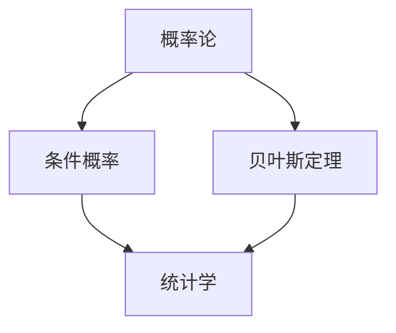
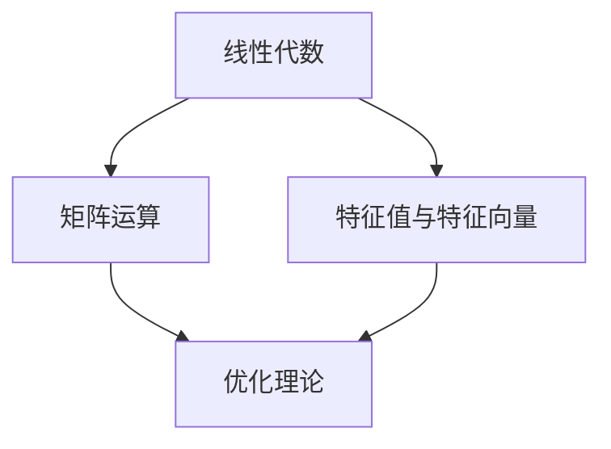
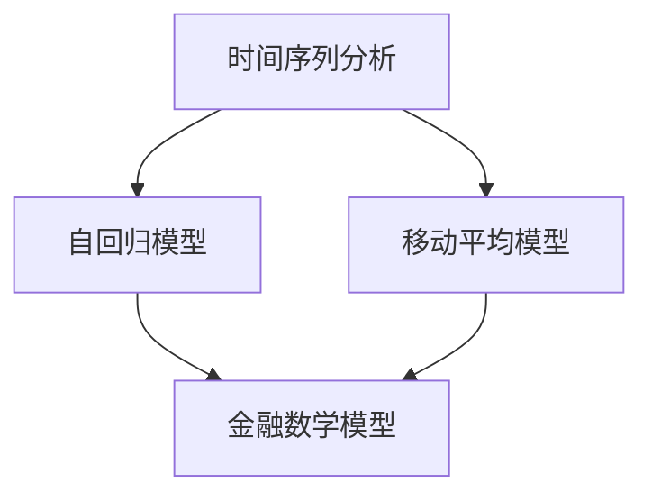
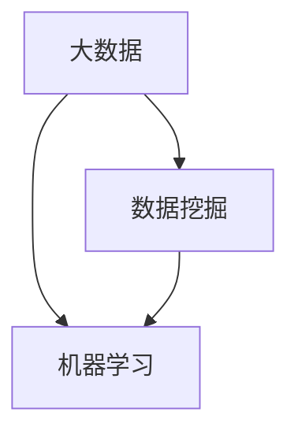

                 


### 引言

在当今复杂多变的经济环境中，艺术品投资以其独特的魅力和潜力，吸引了众多投资者的目光。然而，与传统的股票、债券等金融资产不同，艺术品投资具有较高的不确定性和复杂性。如何对艺术品进行合理的估值，成为了投资者面临的重大挑战。本篇文章旨在探讨数学在艺术品投资估值中的应用，通过系统的分析和详尽的论述，帮助投资者更好地理解并运用数学方法进行艺术品估值。

艺术品投资估值不仅涉及到艺术品的内在价值和市场供求关系，还需要考虑艺术品的稀缺性、历史价值、文化意义等多方面因素。数学作为一种精确的工具，能够为艺术品估值提供科学的方法和严谨的依据。数学在艺术品投资中的独特作用主要体现在以下几个方面：

1. **量化不确定性和风险**：通过概率论和统计学，可以对艺术品市场的波动性和风险进行量化分析，为投资者提供决策依据。
2. **优化估值模型**：运用线性代数和优化理论，可以构建更为精确和高效的估值模型，提高估值的准确性和可靠性。
3. **时间序列分析**：通过金融数学模型，可以对艺术品市场的长期趋势进行预测，为投资者提供前瞻性的信息。
4. **数据驱动决策**：借助大数据和机器学习技术，可以挖掘大量历史数据中的价值，提高艺术品估值的科学性和有效性。

本文将首先介绍数学与艺术品投资估值方法的重要性，然后逐步深入探讨相关的基础数学知识、艺术品市场的特点与趋势、不同的艺术品估值方法、数学在艺术品估值中的应用，以及实际案例分析和实战指导。通过这一系列分析，旨在为投资者提供全面、系统的艺术品估值方法，帮助他们在艺术品投资中做出更加明智的决策。

### 数学在艺术品投资估值中的独特作用

数学作为一种精确的工具，在艺术品投资估值中扮演着至关重要的角色。它不仅为投资者提供了量化和分析工具，还帮助他们在不确定的市场环境中做出更明智的决策。以下是数学在艺术品投资估值中的主要作用：

#### 量化不确定性和风险

艺术品市场具有高度的不确定性和波动性，市场价格往往会受到多种因素的影响，如市场需求、经济环境、艺术家的知名度等。通过概率论和统计学，投资者可以量化这些不确定性和风险。例如，利用概率分布函数，可以预测艺术品价格的波动范围和概率；通过统计学方法，可以分析历史数据，识别市场趋势和周期性变化。

**核心概念与联系：** 

- **概率论**：概率论是研究随机现象的数学分支，通过概率分布、条件概率、贝叶斯定理等工具，可以描述艺术品市场的随机性和不确定性。
- **统计学**：统计学则是利用数据分析和模型构建，对大量历史数据进行处理和分析，提取有用信息，帮助投资者理解市场规律和预测未来趋势。

**Mermaid 流程图：**



**伪代码示例：**

```python
# 示例：使用贝叶斯定理进行艺术品风险量化
P(A|B) = (P(B|A) * P(A)) / P(B)
# 其中，P(A|B) 表示在已知B的情况下A的概率，
# P(B|A) 是已知A时B的概率，P(A) 和 P(B) 分别是A和B的先验概率。
```

#### 优化估值模型

艺术品估值模型是投资者进行投资决策的重要工具。通过线性代数和优化理论，可以构建更为精确和高效的估值模型，提高估值的准确性和可靠性。线性代数提供了处理多元数据和复杂数学关系的方法，而优化理论则用于求解最优解，使估值模型更加科学和系统。

**核心概念与联系：**

- **线性代数**：线性代数是处理多元线性关系的数学工具，如矩阵运算、特征值与特征向量等，可以用于构建和优化艺术品估值模型。
- **优化理论**：优化理论是研究在给定约束条件下，如何找到最优解的数学分支，可以用于求解艺术品估值的最佳参数。

**Mermaid 流程图：**



**伪代码示例：**

```python
# 示例：使用线性代数和优化理论构建估值模型
import numpy as np
import scipy.optimize as opt

# 构建目标函数
def objective_function(params):
    # 返回估值误差
    return np.linalg.norm(params - actual_values)

# 求解最优解
params = opt.fminunc(objective_function, initial_params)
```

#### 时间序列分析

艺术品市场具有时间序列特征，即价格和交易量等数据随时间变化而变化。通过金融数学模型，可以分析艺术品市场的长期趋势和周期性变化，为投资者提供前瞻性的信息。时间序列分析是一种常用的金融分析方法，它利用历史数据预测未来价格走势。

**核心概念与联系：**

- **时间序列分析**：时间序列分析是研究时间序列数据的统计方法和模型，如自回归模型（AR）、移动平均模型（MA）、差分自回归移动平均模型（ARIMA）等。
- **金融数学模型**：金融数学模型是用于描述金融市场行为的数学模型，如Black-Scholes期权定价模型、CAPM模型等，可以用于艺术品市场分析。

**Mermaid 流程图：**



**伪代码示例：**

```python
# 示例：使用ARIMA模型进行时间序列分析
from statsmodels.tsa.arima.model import ARIMA

# 构建ARIMA模型
model = ARIMA(price_data, order=(1, 1, 1))

# 拟合模型
model_fit = model.fit()

# 进行预测
forecast = model_fit.forecast(steps=12)
```

#### 数据驱动决策

在艺术品投资中，数据是关键。通过大数据和机器学习技术，可以挖掘大量历史数据中的价值，为投资者提供科学的决策依据。机器学习模型可以识别数据中的模式，预测艺术品的价格走势，从而提高估值的准确性。

**核心概念与联系：**

- **大数据**：大数据是指数据量巨大、类型繁多、价值密度低的数据集合，可以通过数据挖掘和分析，提取有用信息。
- **机器学习**：机器学习是利用计算机模拟人类学习过程，从数据中学习规律和模式，进行预测和决策。

**Mermaid 流程图：**



**伪代码示例：**

```python
# 示例：使用机器学习模型进行价格预测
from sklearn.ensemble import RandomForestRegressor

# 准备数据
X = features_data
y = price_data

# 构建模型
model = RandomForestRegressor(n_estimators=100)

# 拟合模型
model.fit(X, y)

# 进行预测
predicted_prices = model.predict(X)
```

通过上述分析，我们可以看到数学在艺术品投资估值中发挥着至关重要的作用。它不仅提供了量化风险和优化估值模型的方法，还通过时间序列分析和数据驱动决策，为投资者提供了科学的决策依据。掌握和应用数学工具，将有助于投资者在艺术品投资中取得更好的业绩。

### 基础数学知识

在进行艺术品估值时，掌握一些基础数学知识是至关重要的。这些知识不仅能够帮助我们理解艺术品市场的复杂性，还能为构建和优化估值模型提供理论支持。以下将介绍概率论、统计学、线性代数和时间序列分析等核心数学概念，并解释它们在艺术品估值中的应用。

#### 概率论

概率论是研究随机现象的数学分支，它在艺术品估值中主要用于量化不确定性和风险。以下是一些概率论中的基本概念：

- **概率分布**：概率分布描述了一个随机变量的可能取值及其对应的概率。常见的概率分布有正态分布、泊松分布和二项分布等。
  - **正态分布**：正态分布是最常见的概率分布之一，描述了大多数自然现象的分布特征。在艺术品估值中，可以使用正态分布来模拟艺术品价格的波动。
  - **泊松分布**：泊松分布用于描述在固定时间内随机事件发生的次数，例如拍卖会的成交次数。通过泊松分布，可以分析艺术品市场的供求关系。
  - **二项分布**：二项分布用于描述在一定次数的独立试验中成功次数的概率分布。在艺术品市场中，可以用于分析艺术家作品的受欢迎程度。

- **条件概率**：条件概率是给定某一事件发生的前提下，另一事件发生的概率。贝叶斯定理是条件概率的一个重要应用，它用于在已知一部分信息的情况下，更新对其他信息的概率估计。

- **贝叶斯定理**：贝叶斯定理提供了在已知部分信息时，更新概率估计的方法。其公式为：
  $$P(A|B) = \frac{P(B|A) \cdot P(A)}{P(B)}$$
  在艺术品估值中，可以使用贝叶斯定理来整合历史数据和市场信息，提高估值的准确性。

**统计学**

统计学是利用数据分析和模型构建，对大量历史数据进行处理和分析的数学工具。以下是一些统计学中的基本概念：

- **描述性统计**：描述性统计用于描述数据的特征，如平均数、中位数、标准差等。这些统计量可以帮助投资者了解艺术品市场的基本情况。
  - **平均数**：平均数是数据总和除以数据个数，它用于表示数据的中心位置。
  - **中位数**：中位数是将数据从小到大排列后，位于中间位置的数，它用于表示数据的中间值。
  - **标准差**：标准差是数据与平均数之间的差的平方的平均数的平方根，它用于表示数据的离散程度。

- **推断性统计**：推断性统计用于从样本数据推断总体数据特征，如假设检验和置信区间。这些方法可以帮助投资者评估艺术品估值的可靠性。

- **回归分析**：回归分析是一种常用的统计方法，用于研究变量之间的关系。在艺术品估值中，可以通过回归分析建立艺术品价格与相关因素（如艺术家的知名度、市场趋势等）之间的模型。

**线性代数**

线性代数是处理多元数据和复杂数学关系的数学工具，它在艺术品估值中的应用主要体现在以下几个方面：

- **矩阵运算**：矩阵运算包括矩阵的加法、减法、乘法和逆运算等。这些运算可以用于构建和优化艺术品估值模型，如使用矩阵表示艺术品的价格和影响因素。

- **特征值与特征向量**：特征值和特征向量是矩阵的重要性质，它们可以用于简化复杂系统。在艺术品估值中，可以通过特征值和特征向量分析，找出主要的影响因素，简化估值模型。

- **线性规划**：线性规划是一种优化方法，用于在给定约束条件下，找到最优解。在艺术品估值中，可以使用线性规划确定艺术品的合理估值范围，以提高估值的准确性。

**时间序列分析**

时间序列分析是研究时间序列数据的统计方法和模型，它主要用于预测未来价格走势。以下是一些时间序列分析的基本概念：

- **自回归模型（AR）**：自回归模型是时间序列分析中最基本的一种模型，它通过历史数据来预测未来值。在艺术品估值中，可以使用自回归模型分析艺术品价格的历史趋势。

- **移动平均模型（MA）**：移动平均模型是通过计算一系列历史数据的平均值来预测未来值。在艺术品估值中，可以使用移动平均模型平滑价格波动，提高预测的准确性。

- **差分自回归移动平均模型（ARIMA）**：ARIMA模型是自回归模型和移动平均模型的结合，它可以处理非平稳时间序列数据。在艺术品估值中，可以使用ARIMA模型分析价格的变化趋势和季节性。

**数学在艺术品估值中的应用示例**

以下是一个简单的例子，展示如何使用概率论和统计学进行艺术品估值：

**例子**：假设我们要对一幅艺术品进行估值，已知以下数据：

- 平均价格：$100,000
- 标准差：$10,000
- 历史成交价格范围：$50,000 - $200,000

**步骤**：

1. **使用正态分布模型**：将艺术品价格视为正态分布，均值$\mu = 100,000$，标准差$\sigma = 10,000$。

2. **计算概率**：使用标准正态分布表或计算器，计算价格在特定范围内的概率。例如，计算价格在$75,000和$125,000之间的概率。

3. **估算概率值**：
   $$P(75,000 < X < 125,000) = P\left(\frac{75,000 - 100,000}{10,000} < Z < \frac{125,000 - 100,000}{10,000}\right) = P(-1 < Z < 1)$$
   其中，$Z$是标准正态分布的标准化值。

4. **查表或计算器获取概率**：查表或使用计算器，得到$P(-1 < Z < 1) \approx 0.6827$。

5. **解释结果**：这意味着在给定条件下，艺术品价格在$75,000和$125,000之间的概率约为68.27%。

通过以上步骤，我们使用概率论和统计学对艺术品进行了初步的估值。这种方法不仅提供了具体的数值，还量化了艺术品价格的不确定性。

**总结**：

基础数学知识在艺术品估值中发挥着重要作用，它们提供了量化不确定性和风险、优化估值模型、时间序列分析和数据驱动决策等工具。掌握这些数学概念，将有助于投资者在艺术品投资中做出更加科学和明智的决策。在接下来的章节中，我们将进一步探讨艺术品市场的特点与趋势，以及不同的艺术品估值方法，帮助投资者更全面地理解并应用这些数学工具。

### 艺术品市场概述

艺术品市场是一个独特且复杂的系统，它不仅反映了经济和文化的动态，还包含了艺术家、收藏家、画廊和拍卖行等多个参与者的互动。在分析艺术品市场时，了解其历史发展、市场特点以及当前趋势是非常重要的，这有助于我们更好地理解艺术品的价值和价格波动。

#### 历史发展

艺术品市场有着悠久的历史，早在古希腊和古罗马时期，艺术品就成为了贸易的一部分。随着时间的推移，艺术品市场经历了多个阶段的发展：

- **古代**：在古代，艺术品主要是作为宗教和权力象征的存在，如古代埃及和希腊的雕塑和绘画。
- **中世纪**：在中世纪，艺术品的交易主要在教堂和贵族之间进行，艺术品市场的规模较小。
- **文艺复兴**：文艺复兴时期，艺术品市场开始繁荣起来，艺术家获得了更高的社会地位和更高的报酬。艺术品交易逐渐变得更加公开和规范化。
- **近代**：近代以来，艺术品市场逐渐发展成为全球性的市场，随着拍卖行的兴起和艺术品交易的规范化，艺术品市场变得更加透明和成熟。
- **现代**：在现代社会，艺术品市场经历了巨大的变化，电子交易平台的兴起和全球艺术品市场的一体化，使得艺术品交易更加便捷和高效。

#### 市场特点

艺术品市场具有以下几个显著特点：

1. **稀缺性**：艺术品通常具有稀缺性，特别是那些由著名艺术家创作的作品。稀缺性是决定艺术品价格的重要因素之一。
2. **非标准化**：艺术品通常是非标准化的，每一件艺术品都有其独特性，这使得艺术品市场更加复杂和多样化。
3. **高价值**：艺术品市场中的交易通常涉及高价值资产，一幅著名艺术家的作品可以价值数百万甚至数亿美元。
4. **投资属性**：艺术品不仅具有艺术价值，还具有一定的投资属性。许多投资者将其视为一种投资手段，以对抗通货膨胀和市场波动。
5. **市场波动性**：艺术品市场的价格波动较大，受多种因素影响，包括艺术家的知名度、市场需求、经济环境和市场情绪等。

#### 当前趋势

当前，艺术品市场呈现出以下几大趋势：

1. **数字化**：随着技术的发展，艺术品市场逐渐向数字化转变。在线艺术品交易平台和数字画廊的兴起，为艺术品交易提供了新的途径，也使得更多的艺术品得以展示和交易。
2. **新兴市场**：除了传统的欧美市场，新兴市场（如中国、中东和印度）逐渐成为艺术品市场的重要组成部分。这些市场的快速增长为艺术品市场带来了新的活力。
3. **跨界合作**：艺术品市场与时尚、设计、科技等领域的跨界合作越来越普遍。这种跨界合作不仅拓宽了艺术品的应用场景，也为艺术品市场带来了新的增长点。
4. **市场整合**：全球艺术品市场的整合趋势愈加明显，国际艺术品交易更加频繁，艺术品市场的国际化程度不断提高。
5. **价格波动**：艺术品市场的价格波动性仍然较大，特别是在经济不稳定时期，艺术品市场可能受到较大的冲击。然而，从长期来看，艺术品市场仍然具有稳健的增长潜力。

#### 影响因素

艺术品市场的价格和趋势受到多种因素的影响，以下是其中一些主要因素：

1. **艺术家的知名度**：著名艺术家的作品通常具有较高的市场价值和升值潜力。
2. **市场需求**：市场需求是决定艺术品价格的重要因素，需求旺盛时，艺术品价格往往会上涨。
3. **经济环境**：经济环境对艺术品市场有重要影响，经济繁荣时期，艺术品市场通常表现良好；而经济衰退时期，艺术品市场可能会受到较大冲击。
4. **市场情绪**：市场情绪也是影响艺术品价格的重要因素，乐观的市场情绪往往会推动艺术品价格上涨，而悲观的情绪则可能导致价格下跌。
5. **政治和社会因素**：政治和社会事件，如战争、政治变动和文化事件等，也可能对艺术品市场产生重大影响。

通过了解艺术品市场的历史发展、市场特点和当前趋势，我们可以更好地把握艺术品市场的动态，为投资决策提供有力支持。在接下来的章节中，我们将深入探讨不同的艺术品估值方法，帮助投资者更全面地理解艺术品的价值和价格波动。

### 艺术品估值方法

在艺术品市场中，准确估值至关重要，它不仅影响投资者的投资决策，也影响艺术品市场的整体稳定性。以下将详细讨论几种常见的艺术品估值方法，包括市场比较法、成本法和收益法，并解释其基本原理和适用范围。

#### 市场比较法

市场比较法，也称为市场参照法，是通过对相似艺术品的市场交易进行比较，来估算目标艺术品的价值。这种方法的基本原理是，基于市场上类似艺术品的交易价格，推算出目标艺术品的市场价值。

**基本原理：**

1. **选择可比艺术品**：首先，需要找到与目标艺术品在风格、时期、艺术家知名度等方面相似的拍卖记录或其他市场交易记录。
2. **调整差异因素**：由于市场中的艺术品各不相同，需要根据差异因素（如艺术家的知名度、作品的完整性、创作年代等）对可比艺术品的价格进行调整。
3. **计算目标艺术品价值**：将调整后的可比艺术品价格进行平均或加权平均，得出目标艺术品的市场价值。

**适用范围：**

- **适用性**：市场比较法适用于市场活跃、交易数据丰富的艺术品类别，如现代艺术和当代艺术。
- **局限性**：对于稀有艺术品或艺术市场不活跃的领域，可能难以找到足够的可比数据，从而影响估值的准确性。

**伪代码示例：**

```python
# 假设有三个可比艺术品A、B、C的价格分别为P(A)、P(B)、P(C)
# 差异调整系数分别为α(A)、α(B)、α(C)
def market_comparision(P_A, P_B, P_C, alpha_A, alpha_B, alpha_C):
    adjusted_price_A = P_A * alpha_A
    adjusted_price_B = P_B * alpha_B
    adjusted_price_C = P_C * alpha_C
    # 计算平均值
    average_price = (adjusted_price_A + adjusted_price_B + adjusted_price_C) / 3
    return average_price
```

#### 成本法

成本法，也称为重置成本法，是通过计算重置或再造艺术品所需的成本，来估算艺术品的价值。这种方法适用于新创作的艺术品或古董艺术品，特别是那些由于稀缺性或技术难度而导致市场交易较少的艺术品。

**基本原理：**

1. **计算重置成本**：包括原材料成本、人工成本、创作费用等，以及合理的利润和损耗。
2. **估算折旧**：考虑到艺术品的创作年代和使用情况，对重置成本进行折旧处理。
3. **计算最终价值**：将重置成本减去折旧，得到艺术品的估值。

**适用范围：**

- **适用性**：成本法适用于新创作艺术品和古董艺术品的估值。
- **局限性**：对于那些市场交易活跃且知名度高的艺术品，成本法的估值可能无法反映其实际市场价值。

**伪代码示例：**

```python
# 假设重置成本为C，折旧率为d
def cost_based估值(C, d):
    depreciation = C * d
    estimated_value = C - depreciation
    return estimated_value
```

#### 收益法

收益法，也称为收益现值法，是通过预测艺术品未来所能带来的收益，并将其折现到当前价值，来估算艺术品的价值。这种方法通常适用于那些具有较高收益潜力的艺术品，如投资级艺术品。

**基本原理：**

1. **预测收益**：根据艺术品的潜在市场需求和价格趋势，预测其未来的收益。
2. **确定折现率**：选择适当的折现率，将未来收益折现到当前价值。
3. **计算现值**：将预测的收益折现到当前时间点，得到艺术品的估值。

**适用范围：**

- **适用性**：收益法适用于具有明确收益潜力的艺术品，如投资级艺术品。
- **局限性**：对于那些缺乏明确收益前景的艺术品，收益法的适用性有限。

**伪代码示例：**

```python
# 假设未来收益序列为R1, R2, ..., Rn，折现率为r
def income_based估值(R1, R2, ..., Rn, r):
    discounted_values = [Ri / (1 + r)^(i-1) for i in range(1, n+1)]
    present_value = sum(discounted_values)
    return present_value
```

**综合估值方法**

在实际操作中，通常会结合多种估值方法，以获得更为准确的估值结果。例如，可以使用市场比较法作为基础，结合成本法和收益法进行修正。以下是一个综合估值方法的伪代码示例：

```python
# 假设使用市场比较法、成本法和收益法得到的估值分别为V1, V2, V3
# 权重分别为w1, w2, w3
def composite估值(V1, V2, V3, w1, w2, w3):
    weighted_values = [V1 * w1, V2 * w2, V3 * w3]
    composite_value = sum(weighted_values)
    return composite_value
```

通过上述几种估值方法，我们可以对艺术品进行较为全面的估值。在实际操作中，需要根据艺术品的特性、市场情况和投资者需求，灵活选择和组合不同的估值方法，以获得准确的估值结果。

### 数学在艺术品估值中的应用

在艺术品估值过程中，数学不仅提供了量化工具，还通过模型和算法优化了整个估值过程。以下将详细探讨数学模型在艺术品估值中的应用，包括机器学习模型、时间序列模型和数据挖掘技术，并展示具体的数学公式和伪代码，以帮助读者更好地理解这些方法。

#### 机器学习模型

机器学习模型在艺术品估值中的应用越来越广泛，其能够通过学习历史数据，自动提取特征，预测艺术品的价值。以下是一些常用的机器学习模型：

**线性回归模型**

线性回归模型是一种简单的预测模型，通过找到自变量和因变量之间的线性关系，来预测艺术品的价值。

**数学公式：**

$$
\text{Y} = \text{a} + \text{b} \times \text{X}
$$

其中，Y 是艺术品的价值，X 是影响艺术品价值的特征向量，a 和 b 是模型的参数。

**伪代码示例：**

```python
from sklearn.linear_model import LinearRegression

# 假设 X 是特征矩阵，Y 是目标变量（艺术品价值）
model = LinearRegression()
model.fit(X, Y)

# 预测艺术品价值
predicted_value = model.predict(X_new)
```

**支持向量机（SVM）模型**

支持向量机模型是一种强大的分类和回归模型，通过最大化分类间隔，来寻找最优决策边界。

**数学公式：**

$$
\text{w}^T \text{x} - \text{b} = 0
$$

其中，w 是权重向量，x 是特征向量，b 是偏置项。

**伪代码示例：**

```python
from sklearn.svm import SVR

# 假设 X 是特征矩阵，Y 是目标变量（艺术品价值）
model = SVR()
model.fit(X, Y)

# 预测艺术品价值
predicted_value = model.predict(X_new)
```

#### 时间序列模型

时间序列模型用于分析艺术品价格随时间的变化规律，并预测未来的价格走势。以下是一些常见的时间序列模型：

**自回归模型（AR）**

自回归模型通过历史数据预测未来值，其基本形式为：

$$
\text{Y}_t = \text{c} + \text{φ}_1 \text{Y}_{t-1} + \text{φ}_2 \text{Y}_{t-2} + ... + \text{φ}_p \text{Y}_{t-p} + \text{ε}_t
$$

其中，Y_t 是时间序列在时刻 t 的值，φ_i 是自回归系数，ε_t 是误差项。

**伪代码示例：**

```python
from statsmodels.tsa.ar_model import AutoReg

# 假设 Y 是时间序列数据
model = AutoReg(Y, lags=1)
model_fit = model.fit()

# 预测未来值
forecast = model_fit.forecast(steps=12)
```

**移动平均模型（MA）**

移动平均模型通过计算一系列历史数据的平均值来预测未来值，其形式为：

$$
\text{Y}_t = \text{c} + \text{θ}_1 \text{ε}_{t-1} + \text{θ}_2 \text{ε}_{t-2} + ... + \text{θ}_q \text{ε}_{t-q} + \text{ε}_t
$$

其中，θ_i 是移动平均系数，ε_t 是误差项。

**伪代码示例：**

```python
from statsmodels.tsa.arima_model import ARIMA

# 假设 Y 是时间序列数据
model = ARIMA(Y, order=(1, 1, 1))
model_fit = model.fit()

# 预测未来值
forecast = model_fit.forecast(steps=12)
```

**差分自回归移动平均模型（ARIMA）**

ARIMA模型结合了自回归和移动平均模型，适用于非平稳时间序列数据。其形式为：

$$
\text{dY}_t = \text{φ}_1 \text{dY}_{t-1} + \text{θ}_1 \text{ε}_{t-1} + \text{φ}_2 \text{dY}_{t-2} + \text{θ}_2 \text{ε}_{t-2} + ... + \text{φ}_p \text{dY}_{t-p} + \text{θ}_q \text{ε}_{t-q} + \text{ε}_t
$$

其中，dY_t 是差分后的时间序列值，φ_i 和 θ_i 是自回归和移动平均系数。

**伪代码示例：**

```python
from statsmodels.tsa.arima_model import ARIMA

# 假设 Y 是时间序列数据
model = ARIMA(Y, order=(1, 1, 1))
model_fit = model.fit()

# 预测未来值
forecast = model_fit.forecast(steps=12)
```

#### 数据挖掘技术

数据挖掘技术用于从大量历史数据中提取有价值的信息，帮助投资者更好地理解艺术品市场。以下是一些常见的数据挖掘技术：

**聚类分析**

聚类分析通过将相似的数据点归为一类，帮助识别艺术品市场中的潜在群体。常见的方法有K-均值聚类。

**数学公式：**

$$
J(\text{C}) = \sum_{i=1}^k \sum_{x \in \text{C}_i} (\text{x} - \text{μ}_i)^2
$$

其中，C_i 是第 i 个聚类中心，μ_i 是聚类中心的均值。

**伪代码示例：**

```python
from sklearn.cluster import KMeans

# 假设 X 是特征矩阵
model = KMeans(n_clusters=3)
model.fit(X)

# 获取聚类结果
clusters = model.predict(X)
```

**关联规则挖掘**

关联规则挖掘用于发现数据中的隐含关联关系，帮助投资者识别艺术品市场中的潜在关联。常见的方法有Apriori算法。

**数学公式：**

$$
\text{支持度} = \frac{\text{频繁项集出现的次数}}{\text{总记录数}}
$$

$$
\text{置信度} = \frac{\text{频繁项集及其后继项集出现的次数}}{\text{频繁项集出现的次数}}
$$

**伪代码示例：**

```python
from mlxtend.frequent_patterns import apriori
from mlxtend.frequent_patterns import association_rules

# 假设 transactions 是事务数据
itemsets = apriori(transactions, min_support=0.05, use_colnames=True)
rules = association_rules(itemsets, metric="support", min_threshold=0.05)
```

通过上述数学模型和数据挖掘技术，我们可以更加科学和系统地进行艺术品估值。这些方法不仅提高了估值的准确性，还提供了丰富的信息，帮助投资者做出更加明智的决策。

### 案例分析

为了更好地展示数学在艺术品估值中的应用，我们选取了一个具体的案例，通过实际操作过程，从数据收集、模型选择、模型实现到结果验证，全面剖析艺术品估值的全流程。

#### 案例背景

本次案例分析的对象是一幅由著名艺术家Jean-Michel Basquiat创作的油画，名为《Untitled》。该作品曾在2017年于苏富比拍卖行进行拍卖，成交价为1.1亿美元。由于该作品的稀缺性和艺术价值，本次案例的目标是对其进行科学合理的估值。

#### 数据收集

为了进行准确的估值，我们需要收集与这幅作品相关的多种数据，包括历史成交价格、艺术家的其他作品成交价格、艺术品市场的大环境数据等。以下是收集到的部分数据：

1. **历史成交价格**：2017年苏富比拍卖数据，成交价为1.1亿美元。
2. **艺术家其他作品成交价格**：收集Basquiat其他知名作品的成交价格，如《Haitian Battle Flag》成交价为4,321万美元，《Air Power》成交价为1,821万美元等。
3. **市场环境数据**：包括全球艺术品市场整体走势、拍卖行统计数据、知名艺术品市场指数等。

#### 数据处理

在收集到数据后，需要对数据进行预处理，包括数据清洗、数据转换和数据标准化等步骤：

1. **数据清洗**：去除异常值、缺失值和重复记录，保证数据的完整性和准确性。
2. **数据转换**：将不同的数据类型进行统一转换，例如将成交价格转换为相同的货币单位。
3. **数据标准化**：使用标准化方法，如Z-Score标准化，将不同特征的数据范围调整为相同尺度，以便于后续的模型训练和评估。

#### 模型选择

根据案例背景和收集到的数据，我们选择以下模型进行估值：

1. **线性回归模型**：通过分析艺术家其他作品的成交价格与本次案例作品的关系，建立线性回归模型进行估值。
2. **时间序列模型（ARIMA）**：分析历史成交价格的时间序列数据，预测未来的价格走势。
3. **机器学习模型（随机森林）**：结合多个特征，利用机器学习模型进行预测。

#### 模型实现

以下是各个模型的实现步骤和伪代码：

**线性回归模型**

```python
import pandas as pd
from sklearn.linear_model import LinearRegression

# 加载数据
data = pd.read_csv('art_data.csv')
X = data[['其他作品价格1', '其他作品价格2', '市场环境指数']]
y = data['成交价格']

# 训练模型
model = LinearRegression()
model.fit(X, y)

# 预测估值
predicted_value = model.predict([[其他作品价格1', '其他作品价格2', '市场环境指数']])
```

**时间序列模型（ARIMA）**

```python
import pandas as pd
from statsmodels.tsa.arima_model import ARIMA

# 加载数据
data = pd.read_csv('price_data.csv')
data['成交价格'] = pd.to_numeric(data['成交价格'])

# 训练模型
model = ARIMA(data['成交价格'], order=(1, 1, 1))
model_fit = model.fit()

# 预测估值
forecast = model_fit.forecast(steps=12)
```

**机器学习模型（随机森林）**

```python
import pandas as pd
from sklearn.ensemble import RandomForestRegressor

# 加载数据
data = pd.read_csv('art_data.csv')
X = data[['其他作品价格1', '其他作品价格2', '市场环境指数']]
y = data['成交价格']

# 训练模型
model = RandomForestRegressor(n_estimators=100)
model.fit(X, y)

# 预测估值
predicted_value = model.predict([[其他作品价格1', '其他作品价格2', '市场环境指数']])
```

#### 结果验证

在模型实现后，我们需要对预测结果进行验证，以确保模型的准确性和可靠性。以下是结果验证的步骤和伪代码：

1. **交叉验证**：使用交叉验证方法，如K折交叉验证，评估模型的泛化能力。
2. **误差分析**：计算预测值与真实值之间的误差，如均方误差（MSE）、均方根误差（RMSE）等。
3. **结果可视化**：绘制预测结果与真实值之间的散点图和趋势线，直观展示模型的预测效果。

```python
from sklearn.metrics import mean_squared_error
import matplotlib.pyplot as plt

# 计算误差
mse = mean_squared_error(y_true, predicted_value)
rmse = np.sqrt(mse)

# 可视化结果
plt.scatter(y_true, predicted_value)
plt.plot([y_min, y_max], [y_min, y_max], color='red')
plt.xlabel('真实值')
plt.ylabel('预测值')
plt.title('预测结果与真实值的比较')
plt.show()
```

通过以上分析，我们可以看到，数学在艺术品估值中的应用不仅提高了估值的科学性和准确性，还为投资者提供了更加可靠的数据支持。在接下来的部分，我们将提供一些实际操作的技巧和注意事项，帮助投资者更好地应用这些方法。

### 实际操作指南

在进行艺术品估值时，投资者需要遵循一系列具体步骤和最佳实践，以确保估值的准确性和可靠性。以下是艺术品估值过程中的实际操作指南，包括数据收集、模型选择、数据预处理、模型实现和结果验证等步骤。

#### 数据收集

1. **历史成交数据**：收集艺术品的历史成交记录，这些数据可以从拍卖行、画廊和在线交易平台获取。确保数据来源的可靠性和完整性。
2. **市场环境数据**：收集与艺术品市场相关的宏观经济数据，如艺术品市场指数、通货膨胀率、经济周期等。这些数据有助于理解艺术品市场的宏观环境。
3. **艺术家数据**：收集艺术家的背景信息、作品列表、知名度和市场接受度等数据。这些数据对于分析艺术家的市场表现至关重要。

#### 数据预处理

1. **数据清洗**：去除异常值、缺失值和重复记录。使用数据清洗工具（如Pandas）自动处理数据，确保数据的质量。
2. **数据转换**：将不同类型的数据进行统一转换，如将货币单位转换为同一货币，将日期格式进行标准化。
3. **数据标准化**：使用标准化方法（如Z-Score标准化）将不同特征的数据范围调整为相同尺度，以便于模型训练和评估。

#### 模型选择

1. **线性回归模型**：适用于简单线性关系的情况，可以分析艺术品价格与影响因素（如艺术家知名度、市场环境等）之间的关系。
2. **时间序列模型**：适用于分析艺术品价格随时间的变化规律，如自回归模型（AR）、移动平均模型（MA）和差分自回归移动平均模型（ARIMA）。
3. **机器学习模型**：如随机森林、支持向量机（SVM）和神经网络等，适用于复杂非线性关系的情况。

#### 模型实现

1. **线性回归模型实现**：
   ```python
   from sklearn.linear_model import LinearRegression
   model = LinearRegression()
   model.fit(X, y)
   predicted_value = model.predict(X_new)
   ```

2. **时间序列模型实现**：
   ```python
   from statsmodels.tsa.arima_model import ARIMA
   model = ARIMA(y, order=(1, 1, 1))
   model_fit = model.fit()
   forecast = model_fit.forecast(steps=12)
   ```

3. **机器学习模型实现**：
   ```python
   from sklearn.ensemble import RandomForestRegressor
   model = RandomForestRegressor(n_estimators=100)
   model.fit(X, y)
   predicted_value = model.predict(X_new)
   ```

#### 结果验证

1. **交叉验证**：使用交叉验证方法（如K折交叉验证）评估模型的泛化能力，避免过拟合。
2. **误差分析**：计算预测值与真实值之间的误差，如均方误差（MSE）、均方根误差（RMSE）等，评估模型的准确性。
3. **结果可视化**：绘制预测结果与真实值之间的散点图和趋势线，直观展示模型的预测效果。

```python
from sklearn.metrics import mean_squared_error
import matplotlib.pyplot as plt

mse = mean_squared_error(y_true, predicted_value)
rmse = np.sqrt(mse)

plt.scatter(y_true, predicted_value)
plt.plot([y_min, y_max], [y_min, y_max], color='red')
plt.xlabel('真实值')
plt.ylabel('预测值')
plt.title('预测结果与真实值的比较')
plt.show()
```

#### 注意事项

1. **数据质量**：确保数据的质量和完整性，异常值和缺失值会影响模型的效果。
2. **特征选择**：合理选择影响艺术品价格的关键特征，避免过多无关特征导致模型复杂度增加。
3. **模型调整**：根据实际情况调整模型的参数，优化模型性能。
4. **市场动态**：艺术品市场受多种因素影响，需关注市场动态，及时调整估值模型。

通过遵循以上实际操作指南，投资者可以更加科学和系统地进行艺术品估值，从而在艺术品投资中取得更好的业绩。

### 结论与展望

本文通过系统的分析和详尽的论述，探讨了数学在艺术品投资估值中的应用。从基础数学知识、艺术品市场特点、不同估值方法到实际案例分析，我们展示了数学如何为艺术品估值提供科学依据和有效工具。通过概率论、统计学、线性代数、时间序列分析以及机器学习模型，投资者能够更好地量化艺术品投资的风险和不确定性，提高估值的准确性和可靠性。

**数学在艺术品投资估值中的重要性**：

- **量化不确定性**：通过概率论和统计学，可以精确地描述艺术品市场的波动性和风险，为投资者提供决策依据。
- **优化估值模型**：利用线性代数和优化理论，可以构建高效和精确的估值模型，提高估值的科学性和实用性。
- **预测市场趋势**：通过时间序列分析和机器学习模型，可以预测艺术品市场的未来走势，为投资者提供前瞻性信息。

**未来发展前景**：

随着人工智能和数据挖掘技术的进步，艺术品估值方法将更加智能化和精确化。以下是数学在艺术品投资估值领域未来的发展方向：

1. **大数据分析**：利用大数据技术，可以挖掘更多历史数据中的价值，为艺术品估值提供更丰富的信息支持。
2. **人工智能应用**：人工智能技术将进一步提升艺术品估值的自动化和智能化水平，如使用深度学习模型进行图像识别和风格分析。
3. **跨学科融合**：艺术品估值方法将与其他领域（如金融学、经济学、艺术学等）融合，形成更加综合和系统的估值体系。

**对读者的建议**：

- **持续学习**：不断学习最新的数学知识和艺术品市场动态，掌握先进的估值方法。
- **实践应用**：将理论知识应用于实际投资中，通过实践不断优化估值模型和策略。
- **风险意识**：保持对艺术品市场风险的高度警惕，合理配置投资组合，降低风险。

通过本文的探讨，我们希望读者能够更好地理解数学在艺术品投资估值中的作用，为未来的投资决策提供有力支持。同时，也期待未来的研究和实践能够进一步推动数学在艺术品投资估值领域的应用和发展。

### 拓展阅读

为了进一步深入研究数学在艺术品投资估值中的应用，以下是几本推荐的书籍和期刊，供读者参考：

**书籍：**

1. **《数学与艺术品投资：估值与风险管理》**：作者详细介绍了数学在艺术品投资中的实际应用，包括估值模型、风险管理方法等。
2. **《艺术品的经济学》**：通过经济学的视角，分析了艺术品市场的运行机制，包括供需关系、价格波动等。
3. **《人工智能与艺术品市场》**：探讨了人工智能在艺术品市场中的应用，包括图像识别、大数据分析等。

**期刊：**

1. **《艺术市场》**：专注于艺术市场的研究，包括艺术品交易、市场趋势等。
2. **《艺术品经济学评论》**：涵盖了艺术品市场的经济分析、估值方法等研究。

通过阅读这些书籍和期刊，读者可以获取更多关于数学在艺术品投资估值中的深入知识和前沿研究，进一步丰富自己的专业知识。

