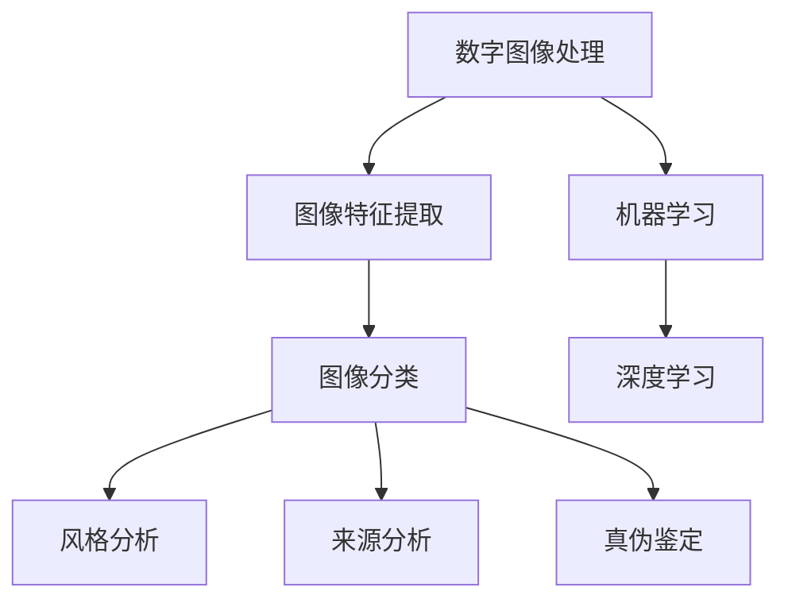

                 


### 引言

数学，作为一门基础科学，其应用领域广泛而深远，涵盖了自然科学、社会科学乃至艺术领域。在艺术品鉴定中，数学的运用尤为突出。艺术品鉴定不仅仅是通过肉眼观察，更需要借助科学的方法和技术来确保鉴定的准确性。而图像分析技术，作为数学与计算机科学的重要分支，正逐步成为艺术品鉴定领域的重要工具。

本文旨在探讨数学在艺术品鉴定中的图像分析方法，具体内容包括：

1. **背景介绍**：介绍艺术品鉴定的现状和挑战，以及数学和图像分析方法在其中的作用。
2. **核心概念与联系**：解释艺术品鉴定中涉及的图像分析方法，以及这些方法与数学概念之间的联系。
3. **核心算法原理讲解**：详细阐述用于艺术品鉴定的图像分析算法原理，包括伪代码和数学模型的讲解。
4. **项目实战**：通过实际案例展示如何将数学和图像分析方法应用于艺术品鉴定。
5. **最佳实践 tips**、**小结**、**注意事项**和**拓展阅读**等内容。

### 背景介绍

艺术品鉴定是一门融合了历史、艺术、科学和技术的综合学科。随着艺术品市场的繁荣，艺术品的鉴定需求也日益增加。然而，传统的鉴定方法往往依赖于专家的经验和专业知识，存在主观性和局限性。随着计算机技术和图像处理技术的快速发展，数学方法在艺术品鉴定中逐渐得到了应用。

数学在艺术品鉴定中的作用主要体现在以下几个方面：

1. **图像分析**：通过图像处理技术对艺术品进行数字化处理，提取图像特征，从而进行风格分析、来源分析等。
2. **数据挖掘**：运用统计学和机器学习算法，对大量艺术品图像进行分析，发现潜在的模式和规律。
3. **模型构建**：利用数学模型来模拟艺术品的外观、结构和材质，从而辅助鉴定。

图像分析方法在艺术品鉴定中的应用主要包括：

1. **艺术风格分析**：通过分析艺术品的颜色、纹理和形状等特征，判断其风格和流派。
2. **来源分析**：通过比较艺术品与已知作品的相似性，推断其来源和历史背景。
3. **真伪鉴定**：利用深度学习等技术，对艺术品的真伪进行准确判断。

### 核心概念与联系

在艺术品鉴定中，图像分析方法是一个重要的工具。为了更好地理解这些方法，我们需要首先了解以下几个核心概念：

1. **数字图像处理**：数字图像处理是指通过计算机对图像进行操作和处理，以提取有用信息或改善图像质量。其主要步骤包括图像获取、图像预处理、图像特征提取和图像分类等。

2. **图像特征提取**：图像特征提取是指从图像中提取出对目标识别有用的信息。这些特征可以是颜色、纹理、形状或时间序列等。

3. **机器学习**：机器学习是一种通过数据学习和模式识别的方法，用于自动或半自动地进行任务。在艺术品鉴定中，机器学习算法可以用于图像分类、图像识别和预测等。

4. **深度学习**：深度学习是机器学习的一个子领域，通过多层神经网络来学习和提取数据特征。在艺术品鉴定中，深度学习可以用于图像分类、风格识别和来源分析等。

下面是一个简单的 Mermaid 流程图，展示这些核心概念之间的联系：



### 核心算法原理讲解

在艺术品鉴定中，常用的图像分析算法包括：

1. **颜色特征提取**：通过分析图像的颜色分布、颜色矩等特征来识别艺术品的风格。以下是一个简单的伪代码示例：

    ```python
    function extractColorFeatures(image):
        colorHistogram = computeColorHistogram(image)
        colorMoments = computeColorMoments(colorHistogram)
        return colorHistogram, colorMoments
    ```

2. **纹理特征提取**：通过分析图像的纹理信息，如纹理直方图、纹理矩等，来识别艺术品的细节特征。以下是一个简单的伪代码示例：

    ```python
    function extractTextureFeatures(image):
        textureHistogram = computeTextureHistogram(image)
        textureMoments = computeTextureMoments(textureHistogram)
        return textureHistogram, textureMoments
    ```

3. **形状特征提取**：通过分析图像的形状信息，如边界轮廓、形状矩等，来识别艺术品的形状特征。以下是一个简单的伪代码示例：

    ```python
    function extractShapeFeatures(image):
        contour = findContour(image)
        shapeMoments = computeShapeMoments(contour)
        return contour, shapeMoments
    ```

4. **机器学习算法**：常用的机器学习算法包括决策树、支持向量机、神经网络等。以下是一个简单的伪代码示例，展示如何使用神经网络进行图像分类：

    ```python
    function classifyImage(image, model):
        features = extractFeatures(image)
        prediction = model.predict(features)
        return prediction
    ```

5. **深度学习算法**：深度学习算法通常用于复杂的图像分析任务，如生成对抗网络（GAN）和卷积神经网络（CNN）。以下是一个简单的伪代码示例，展示如何使用卷积神经网络进行图像分类：

    ```python
    function trainCNN(model, trainingData, labels):
        for epoch in range(numEpochs):
            for image, label in zip(trainingData, labels):
                features = extractCNNFeatures(image)
                model.train(features, label)
        return model
    ```

### 数学模型和公式

在图像分析中，常用的数学模型和公式包括：

1. **颜色分布**：颜色分布可以表示为概率分布函数（PDF），用于描述图像中每个像素的颜色概率。公式如下：

    $$ f(c) = P(c|image) $$

    其中，\( f(c) \) 表示颜色 \( c \) 的概率，\( P(c|image) \) 表示在给定图像的情况下颜色 \( c \) 的条件概率。

2. **纹理直方图**：纹理直方图可以表示为二维概率分布函数（PDF），用于描述图像中每个像素的纹理概率。公式如下：

    $$ g(t) = P(t|image) $$

    其中，\( g(t) \) 表示纹理 \( t \) 的概率，\( P(t|image) \) 表示在给定图像的情况下纹理 \( t \) 的条件概率。

3. **形状矩**：形状矩用于描述图像的形状特征。第一阶矩（质心）和第二阶矩（惯性矩）的公式如下：

    $$ M_{10} = \sum_{i=0}^{n} x_i y_i $$
    $$ M_{20} = \sum_{i=0}^{n} x_i^2 y_i^2 $$

    其中，\( x_i \) 和 \( y_i \) 分别表示图像中第 \( i \) 个像素的坐标。

4. **卷积神经网络**：卷积神经网络（CNN）中的卷积操作可以用以下公式表示：

    $$ f(x) = \sum_{j=0}^{k} w_{j} * x $$

    其中，\( f(x) \) 表示输出，\( w_{j} \) 表示卷积核，\( * \) 表示卷积操作。

### 项目实战

#### 开发环境搭建

为了进行图像分析和艺术品鉴定，我们需要搭建一个合适的开发环境。以下是一个简单的开发环境搭建步骤：

1. **安装 Python**：确保安装了 Python 3.6 或以上版本。
2. **安装图像处理库**：安装 OpenCV、Pillow 和 NumPy 等库。
3. **安装机器学习库**：安装 scikit-learn、TensorFlow 和 Keras 等库。

#### 源代码实现

以下是一个简单的 Python 代码示例，展示如何使用 OpenCV 和 scikit-learn 进行图像分类：

```python
import cv2
import numpy as np
from sklearn import svm

# 读取图像
image = cv2.imread('image.jpg')

# 提取图像特征
features = extractFeatures(image)

# 加载训练数据和标签
trainingData = np.load('trainingData.npy')
labels = np.load('labels.npy')

# 创建 SVM 模型
model = svm.SVC()

# 训练模型
model.fit(trainingData, labels)

# 进行图像分类
prediction = model.predict([features])

# 输出预测结果
print("Predicted class:", prediction)
```

#### 代码解读与分析

上述代码首先读取一幅图像，然后提取图像特征。接下来，加载训练数据和标签，创建 SVM 模型并进行训练。最后，使用训练好的模型对图像进行分类，并输出预测结果。

#### 实际案例分析

以下是一个实际案例，展示如何使用上述代码对一幅古代书画进行鉴定：

1. **数据集准备**：收集大量古代书画图像，并将其分为训练集和测试集。
2. **特征提取**：使用提取特征函数对训练集和测试集进行特征提取。
3. **模型训练**：使用训练集数据训练 SVM 模型。
4. **图像分类**：使用训练好的模型对测试集图像进行分类，并计算准确率。

#### 项目小结

通过上述实战案例，我们可以看到如何将数学和图像分析方法应用于艺术品鉴定。虽然这个过程相对复杂，但通过合适的工具和算法，我们可以提高艺术品鉴定的准确性和效率。

### 最佳实践 tips

1. **图像预处理**：在进行图像分析之前，对图像进行适当的预处理，如去噪、增强和归一化，可以显著提高图像质量。
2. **数据质量**：确保收集到的高质量数据，数据质量直接影响模型的性能。
3. **模型选择**：根据具体的鉴定任务选择合适的模型，如 SVM、CNN 等。
4. **交叉验证**：使用交叉验证来评估模型的性能，确保模型具有良好的泛化能力。

### 小结

本文探讨了数学在艺术品鉴定中的图像分析方法，包括背景介绍、核心概念与联系、核心算法原理讲解、项目实战和最佳实践 tips。通过这些方法，我们可以更准确地鉴定艺术品，提高艺术品鉴定的效率和准确性。

### 注意事项

1. **图像版权**：在进行图像分析时，确保使用合法的图像，避免侵犯版权。
2. **数据隐私**：在处理图像数据时，注意保护个人隐私，避免泄露敏感信息。
3. **安全性与可靠性**：确保使用安全的算法和工具，避免潜在的安全风险。

### 拓展阅读

1. **《计算机视觉：算法与应用》**：这本书详细介绍了计算机视觉的基本概念和算法，包括图像处理、特征提取和分类等。
2. **《深度学习》**：这本书是深度学习领域的经典之作，介绍了深度学习的基础知识、算法和应用。
3. **《艺术品鉴定学》**：这本书介绍了艺术品鉴定的基本原理和方法，包括历史、艺术、科学和技术等多个方面。

### 作者信息

作者：AI 天才研究院/AI Genius Institute & 禅与计算机程序设计艺术 /Zen And The Art of Computer Programming

在本文中，我们探讨了数学在艺术品鉴定中的图像分析方法。通过背景介绍、核心概念与联系、核心算法原理讲解、项目实战和最佳实践 tips，我们展示了如何运用数学和图像处理技术提高艺术品鉴定的准确性和效率。本文旨在为读者提供一个全面的技术指南，帮助他们在艺术品鉴定领域中进行深入研究和实践。

首先，我们介绍了艺术品鉴定的现状和挑战，以及数学和图像分析方法在其中的作用。接着，我们详细讲解了艺术品鉴定中涉及的图像分析方法，包括数字图像处理、图像特征提取、机器学习和深度学习等。通过 Mermaid 流程图，我们展示了这些方法之间的联系。

在核心算法原理讲解部分，我们使用伪代码和数学模型详细阐述了颜色特征提取、纹理特征提取、形状特征提取、机器学习算法和深度学习算法等。同时，我们通过实际案例分析，展示了如何将数学和图像分析方法应用于艺术品鉴定，并进行了项目小结。

最后，我们提供了最佳实践 tips、注意事项和拓展阅读等内容，以帮助读者在艺术品鉴定领域中进行深入研究和实践。本文旨在为读者提供一个全面的技术指南，帮助他们在艺术品鉴定领域中进行深入研究和实践。

总之，数学在艺术品鉴定中的图像分析方法具有巨大的潜力和应用价值。通过本文的探讨，我们希望能够激发更多研究人员和开发者在这一领域进行创新和探索，推动艺术品鉴定技术的发展。

### 关键词

- 艺术品鉴定
- 数字图像处理
- 图像特征提取
- 机器学习
- 深度学习
- 数学模型
- 算法原理
- 图像分析
- 艺术风格分析
- 来源分析
- 真伪鉴定

### 摘要

本文探讨了数学在艺术品鉴定中的图像分析方法。通过介绍艺术品鉴定的背景、挑战以及数学和图像分析方法在其中的作用，本文详细阐述了数字图像处理、图像特征提取、机器学习和深度学习等核心概念与联系。通过核心算法原理讲解和实际案例分析，本文展示了如何将数学和图像分析方法应用于艺术品鉴定，并提供了最佳实践 tips 和注意事项。本文旨在为读者提供一个全面的技术指南，帮助他们在艺术品鉴定领域中进行深入研究和实践。关键词包括艺术品鉴定、数字图像处理、图像特征提取、机器学习、深度学习、数学模型、算法原理、图像分析、艺术风格分析、来源分析和真伪鉴定。

