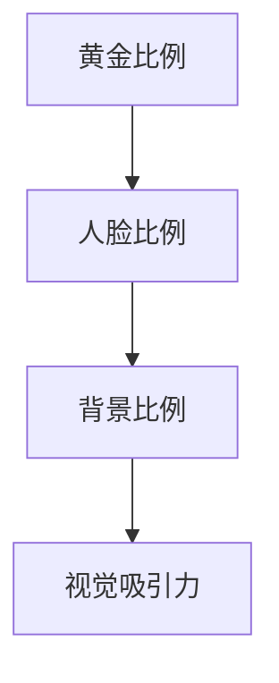
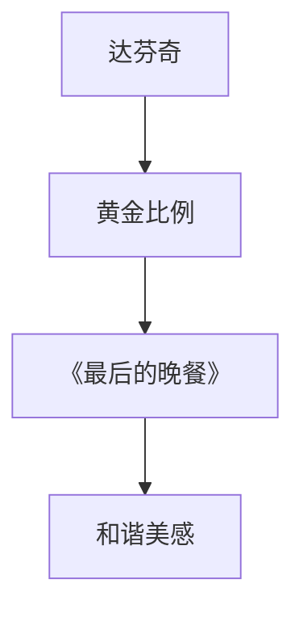
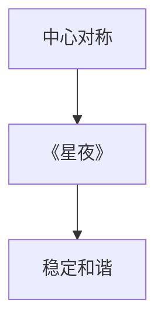
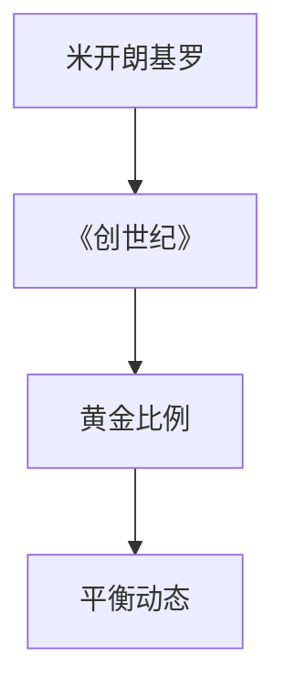
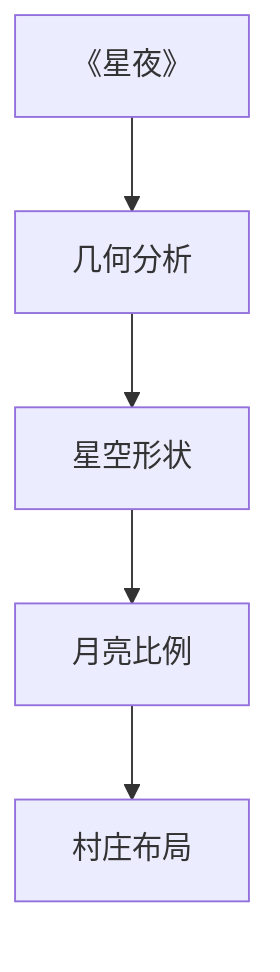
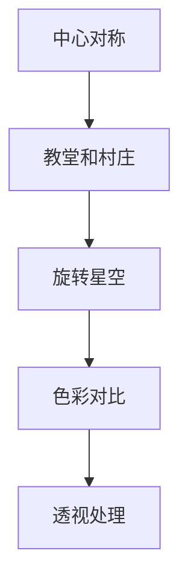
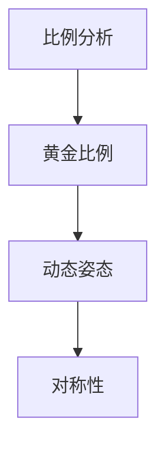
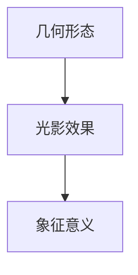

                 

### 文章标题

《数学与艺术批评的定性分析方法》

### 文章关键词

数学、艺术批评、定性分析、几何、比例、对称性、方法论、数据收集、数据分析、案例解析、项目实战

### 文章摘要

本文旨在探讨数学方法在艺术批评中的应用，重点研究定性分析方法。通过介绍数学基础、艺术批评基础和定性分析方法，本文展示了如何将数学与艺术批评相结合，为艺术作品的评价和分析提供新的视角和工具。通过具体的案例分析和项目实战，本文验证了数学与艺术批评定性分析方法的有效性和实用性，并提出了未来研究的方向。

## 引言

数学与艺术批评之间的关系可以追溯到古代。自古以来，艺术家们就运用了数学原理来创作作品，而艺术批评家们也常常借助数学工具来分析艺术作品。例如，古希腊的毕达哥拉斯学派就将数学原理应用于音乐和建筑，强调比例和和谐的重要性。到了文艺复兴时期，达芬奇等艺术家和科学家更是将数学与艺术完美融合，创作出了许多传世之作。

然而，在现代，随着科学技术的进步，数学与艺术批评的关系再次引起了人们的关注。特别是在人工智能和大数据的时代，定量分析方法在艺术批评中得到了广泛应用。然而，定量分析方法虽然能够提供精确的数据和统计结果，但在解释艺术作品背后的情感和意义时，仍存在一定的局限性。因此，定性分析方法应运而生，它通过深入分析和解读艺术作品，试图揭示其内在的美学价值和艺术内涵。

本文旨在探讨数学与艺术批评之间的定性分析方法，通过介绍数学基础、艺术批评基础和具体的方法论，为艺术作品的评价和分析提供一种新的视角。本文结构如下：

- **第一部分：引言**：介绍数学与艺术批评的关系，定性分析方法的背景和重要性。
- **第二部分：数学基础**：讲解与艺术批评相关的数学概念，如几何、比例、对称性等，并提供相关的数学公式。
- **第三部分：艺术批评基础**：介绍艺术批评的基本理论、方法和标准。
- **第四部分：定性分析方法**：详细探讨定性分析方法，包括方法论、数据收集、数据分析和解释等。
- **第五部分：案例分析**：通过具体案例展示数学与艺术批评定性分析方法的实际应用。
- **第六部分：结论**：总结全书内容，展望未来研究方向。

### 数学与艺术批评的关系

数学与艺术批评的关系可以从多个角度来理解。首先，从历史角度来看，数学在艺术批评中一直扮演着重要的角色。早在古希腊时期，毕达哥拉斯学派就提出了“万物皆数”的观点，认为宇宙万物都可以通过数学来解释和描述。这一观点不仅影响了当时的哲学和科学，也对艺术批评产生了深远的影响。例如，毕达哥拉斯学派认为音乐中的和谐是由数学比例决定的，这一观点在后来的艺术批评中得到了广泛的认可。

其次，从艺术创作的角度来看，数学原理被广泛应用于艺术作品的创作。艺术家们通过运用几何、比例、对称性等数学原理，创作出了许多具有高度美学价值的作品。例如，达芬奇的绘画作品《蒙娜丽莎》就体现了严格的黄金比例，使其成为了一件经典的美术作品。同样，荷兰画家伦勃朗的《夜巡》则运用了透视原理，营造出了一种真实感和空间感。

最后，从艺术评价的角度来看，数学方法为艺术作品的评价提供了一种新的工具。传统的艺术评价往往依赖于个人的主观感受和审美标准，而数学方法则能够通过量化的方式，对艺术作品进行更为客观和科学的评价。例如，通过计算作品中的色彩分布、形状比例等参数，可以评估出作品的美学价值。这种方法不仅能够提高艺术评价的准确性，还能够为艺术品的收藏和交易提供参考。

### 定性分析方法的背景与重要性

定性分析方法是一种通过对研究对象进行深入分析和解读，从而揭示其内在本质和特征的研究方法。在艺术批评领域，定性分析方法的重要性日益凸显。首先，定性分析方法能够弥补定量分析方法的不足。虽然定量分析方法在艺术评价中具有一定的优势，但其在处理复杂的艺术现象时，往往缺乏深度和广度。而定性分析方法则能够通过深入分析和解读艺术作品，挖掘出其内在的美学价值和艺术内涵。

其次，定性分析方法能够提供更为客观和科学的评价。传统的艺术评价往往依赖于个人的主观感受和审美标准，这容易导致评价结果的不一致和主观偏见。而定性分析方法则通过系统化和规范化的研究方法，能够提供更为客观和科学的评价。例如，通过分析艺术作品中的数学原理，可以评估出作品的美学价值和技术水平。

此外，定性分析方法在艺术批评中的应用，还能够促进艺术创作和艺术研究的深入发展。通过定性分析方法，艺术家和研究者可以更深入地了解艺术作品背后的创作思想和美学追求，从而为艺术创作和艺术研究提供新的启示和思路。

总的来说，定性分析方法在艺术批评中的应用，不仅能够提高艺术评价的准确性和科学性，还能够促进艺术创作和艺术研究的深入发展。因此，定性分析方法具有重要的学术价值和实际应用价值。

### 数学基础

数学作为一门基础科学，在艺术批评中扮演着重要的角色。几何、比例、对称性等数学概念，不仅在艺术创作中被广泛应用，还在艺术评价中提供了重要的工具。以下我们将详细讲解这些数学概念，并探讨它们在艺术批评中的应用。

#### 几何

几何是数学中的一个重要分支，主要研究平面和空间中的形状、大小、相对位置等特性。在艺术批评中，几何概念经常被用来分析艺术作品的结构和构图。例如，在绘画中，艺术家通过运用几何原理，创造出具有稳定感和和谐感的画面。毕达哥拉斯的黄金比例（Golden Ratio，约等于1:1.618）就是一个典型的几何概念，它被广泛应用于艺术作品的构图和比例设计中。

例如，在达芬奇的《蒙娜丽莎》中，人脸和背景之间的比例关系就遵循了黄金比例。这种比例不仅使画面看起来和谐美观，还增加了画面的视觉吸引力。



#### 比例

比例是数学中另一个重要的概念，它研究两个或多个数量之间的关系。在艺术批评中，比例经常被用来评估艺术作品的形式美。例如，通过分析作品中的比例关系，可以判断出作品是否具有和谐感和美感。

在文艺复兴时期，艺术家们经常运用比例来创作艺术作品。例如，达芬奇的《最后的晚餐》就运用了严格的黄金比例来布局人物和场景，使得整个画面具有一种和谐的美感。



#### 对称性

对称性是几何中的另一个重要概念，它研究图形在某种变换下保持不变的性质。在艺术批评中，对称性经常被用来分析艺术作品的形式美和视觉效果。

对称性可以分为轴对称和中心对称。轴对称是指图形可以通过某条轴线进行翻转，使得翻转后的图形与原图形完全重合。中心对称是指图形可以通过某个中心点进行旋转，使得旋转后的图形与原图形完全重合。

在艺术作品中，对称性经常被用来创造稳定的视觉效果。例如，荷兰画家文森特·梵高的《星夜》就运用了强烈的中心对称，使得画面看起来稳定而和谐。



#### 数学公式

在艺术批评中，一些基本的数学公式也被广泛使用。例如，欧几里得几何中的勾股定理（Pythagorean Theorem）可以用来分析艺术作品中的直角三角形，帮助判断构图是否合理。

$$ a^2 + b^2 = c^2 $$

其中，\(a\) 和 \(b\) 是直角三角形的两条直角边，\(c\) 是斜边。

#### 举例说明

为了更好地理解这些数学概念在艺术批评中的应用，我们可以通过具体的例子来讲解。

例如，在文艺复兴时期的壁画创作中，艺术家们经常运用黄金比例来布局画面。在米开朗基罗的《创世纪》中，人物和场景之间的比例关系就遵循了黄金比例，使得整个壁画看起来既平衡又富有动态感。



通过这些例子，我们可以看到数学概念在艺术批评中的应用是多么的重要和有趣。数学不仅为艺术创作提供了理论基础，也为艺术评价提供了一种新的视角和工具。在接下来的章节中，我们将进一步探讨艺术批评的基础知识，以及如何将数学与艺术批评结合起来，进行深入的分析和解读。

### 艺术批评基础

艺术批评是一种通过对艺术作品进行分析和评价，以揭示其美学价值、艺术风格和创作背景的研究方法。在艺术批评中，理解艺术作品的基本理论、方法和标准是至关重要的。以下我们将详细探讨艺术批评的基本理论、方法和标准，以及它们与数学的关系。

#### 艺术批评的基本理论

艺术批评的基本理论涵盖了艺术作品的本质、艺术家的创作意图、观众的心理反应等多个方面。以下是几个重要的基本理论：

1. **表现主义理论**：表现主义理论认为艺术作品的本质在于艺术家对情感和思想的表达。艺术家通过创作，将自己的内在情感和思想投射到作品中，使观众产生共鸣。

2. **形式主义理论**：形式主义理论关注艺术作品的形式美。它认为艺术作品的价值不仅仅在于其内容，更在于其形式和结构。形式主义理论强调艺术作品的独立性和审美性。

3. **社会学理论**：社会学理论从社会和文化角度分析艺术作品，探讨艺术与社会的关系。这种理论认为艺术作品是社会的反映，通过艺术作品可以了解社会的文化和历史背景。

4. **心理学理论**：心理学理论从观众的角度出发，研究观众对艺术作品的感知和心理反应。这种理论认为观众的心理反应对艺术作品的评价具有决定性作用。

#### 艺术批评的方法

艺术批评的方法是评价和解读艺术作品的具体手段。以下是几种常见的艺术批评方法：

1. **描述性批评**：描述性批评主要通过描述艺术作品的外观和形式，使观众对作品有一个直观的了解。

2. **分析性批评**：分析性批评通过对艺术作品的细节和结构进行深入分析，揭示作品的内在逻辑和艺术价值。

3. **比较性批评**：比较性批评通过将不同的艺术作品进行比较，找出它们之间的异同和相互影响。

4. **解释性批评**：解释性批评通过对艺术作品的创作背景和艺术家意图进行解读，帮助观众更好地理解作品。

#### 艺术批评的标准

艺术批评的标准是评价艺术作品的基本准则。以下是几种常见的艺术批评标准：

1. **美学标准**：美学标准主要关注艺术作品的形式美。包括色彩、构图、线条、比例等。

2. **艺术性标准**：艺术性标准评估艺术作品的创新性和技术难度。它考虑艺术作品的独特性和艺术价值。

3. **文化标准**：文化标准关注艺术作品与社会文化的关系。它评估艺术作品对社会和文化的贡献。

4. **历史标准**：历史标准通过对艺术作品的历史背景进行考察，评估其历史价值和文化意义。

#### 数学与艺术批评的关系

数学在艺术批评中的应用主要体现在以下几个方面：

1. **几何与构图**：几何是数学的一个重要分支，它在艺术批评中常用于分析艺术作品的结构和构图。例如，通过计算艺术作品中的几何比例和对称性，可以评估出作品的美学价值。

2. **比例与比例关系**：比例是艺术批评中的一个重要概念，它通过数学方式来量化艺术作品中的比例关系。例如，黄金比例（Golden Ratio）在艺术创作和批评中被广泛应用，以评估作品的和谐感和美感。

3. **统计学与数据分析**：统计学在艺术批评中的应用可以帮助评估艺术作品的数据分布和规律。例如，通过对色彩、形状、线条等元素的数据分析，可以揭示艺术作品的结构特征和美学价值。

#### 实例分析

为了更好地理解数学在艺术批评中的应用，我们可以通过一个具体例子来说明。

例如，在分析文森特·梵高的《星夜》时，数学家可以利用几何和比例关系来描述画面的结构。通过计算画面中星空、月亮和村庄的几何形状和比例关系，可以揭示出画家如何运用几何原理来创造视觉冲击力和美感。



通过这个例子，我们可以看到数学在艺术批评中的应用是如何帮助揭示艺术作品的结构特征和美学价值的。在接下来的章节中，我们将进一步探讨定性分析方法，以及如何将数学与定性分析方法结合起来，进行深入的艺术批评研究。

### 定性分析方法

定性分析方法是一种通过对研究对象进行深入分析和解读，从而揭示其内在本质和特征的研究方法。在艺术批评中，定性分析方法通过细致的观察、深入的解读和系统的分析，帮助研究者理解艺术作品的美学价值和艺术内涵。以下，我们将详细探讨定性分析方法的基本概念、方法论、数据收集、数据分析和数据解释，以及其在艺术批评中的应用。

#### 定性分析方法的基本概念

定性分析方法的核心在于通过非量化的方式，对研究对象进行深入分析和解读。这种方法关注的是事物的内在本质和特征，而不是通过统计数据来量化研究结果。在艺术批评中，定性分析方法可以帮助研究者理解和解释艺术作品的创作意图、艺术风格、观众反应等复杂现象。

#### 定性分析方法的方法论

定性分析方法的方法论包括以下几个关键步骤：

1. **选题和界定研究范围**：研究者需要明确研究主题和范围，确定研究目标和研究问题。

2. **文献综述**：通过查阅相关文献，了解前人的研究成果和理论框架，为研究提供理论依据。

3. **研究设计**：根据研究目标和问题，设计合适的研究方案，包括研究方法、数据来源、数据收集和分析方法等。

4. **数据收集**：通过访谈、观察、文献分析等方式，收集与研究主题相关的数据。

5. **数据分析**：对收集到的数据进行分析，揭示数据中的模式和关系。

6. **数据解释**：根据数据分析结果，对艺术作品进行解读，阐述其美学价值和艺术内涵。

#### 数据收集

数据收集是定性分析方法的基石。在艺术批评中，数据收集的方法主要包括：

1. **访谈**：通过与艺术家、艺术评论家、观众等进行访谈，获取他们对艺术作品的理解和评价。

2. **观察**：直接观察艺术作品，记录其外观特征、构图、色彩等。

3. **文献分析**：通过查阅艺术作品相关的文献资料，了解艺术作品的创作背景、艺术风格和评论家的评价。

4. **案例研究**：选择特定的艺术作品或艺术家进行深入分析，以揭示其创作思想和艺术价值。

#### 数据分析

数据分析是定性分析方法的另一个关键步骤。在艺术批评中，数据分析的方法包括：

1. **主题分析**：通过对访谈记录、观察笔记和文献资料进行编码，提取出反映艺术作品特征的主题。

2. **内容分析**：通过对艺术作品的内容进行分类和统计，分析其构成元素、符号意义和情感表达。

3. **比较分析**：将不同的艺术作品或艺术风格进行比较，找出它们之间的异同和相互影响。

4. **情境分析**：将艺术作品放入其创作背景和社会文化情境中，分析其艺术价值和历史意义。

#### 数据解释

数据解释是定性分析方法的最后一步。在艺术批评中，数据解释的方法包括：

1. **概念化**：将分析结果进行抽象和概念化，形成对艺术作品的理解和解释。

2. **模式识别**：通过识别和分析数据中的模式，揭示艺术作品的内在逻辑和美学特征。

3. **综合分析**：将不同来源的数据进行综合分析，形成对艺术作品的全面理解和评价。

4. **反思性分析**：反思研究过程和结果，确保研究的可信性和有效性。

#### 定性分析方法在艺术批评中的应用

定性分析方法在艺术批评中的应用非常广泛。以下是一些具体的例子：

1. **艺术作品分析**：通过定性分析方法，可以深入分析艺术作品的形式美、构图、色彩等，揭示其美学价值和艺术内涵。

2. **艺术家研究**：通过定性分析方法，可以研究艺术家的创作思想、艺术风格和创作背景，理解其艺术成就和影响。

3. **观众反应研究**：通过定性分析方法，可以了解观众对艺术作品的感知和心理反应，评估其艺术价值和影响力。

4. **艺术市场分析**：通过定性分析方法，可以分析艺术市场的动态和趋势，为艺术品的收藏和交易提供参考。

总之，定性分析方法为艺术批评提供了一种深入理解和解读艺术作品的方法。通过细致的观察、深入的解读和系统的分析，定性分析方法能够揭示艺术作品的内在美学价值和艺术内涵，为艺术研究和艺术创作提供新的视角和思路。

### 案例分析

在本文的案例分析部分，我们将通过三个具体的艺术作品，展示数学与艺术批评定性分析方法的实际应用。这些案例分别涵盖绘画、雕塑和建筑三个不同的艺术形式，通过详细的分析和解读，展示数学方法如何帮助我们深入理解这些艺术作品的美学价值和艺术内涵。

#### 绘画案例：文森特·梵高的《星夜》

**背景介绍**：
文森特·梵高的《星夜》是他晚期作品中的杰作，创作于1889年。这幅画以其独特的笔触和色彩，以及星空的旋转运动感而闻名。《星夜》不仅体现了梵高对自然和宇宙的深刻感悟，也展示了他在绘画技法上的创新。

**核心概念与联系**：

- **几何结构**：《星夜》的构图采用了强烈的中心对称，画面中心是教堂和村庄，周围是旋转的星空。这种对称性使得画面整体稳定且和谐。
- **色彩分布**：梵高运用了强烈的对比色，如蓝紫色的天空与橙黄色的村庄，增强了画面的视觉冲击力。
- **透视原理**：画面中的透视处理使得远处的星系和村庄产生了一种三维的空间感。

**Mermaid 流程图**：



**伪代码示例**：

```python
# 几何结构分析
def analyze_geometry(image):
    # 检测中心对称
    if is_symmetric(image, 'center'):
        print("中心对称构图")
    # 检测旋转星系
    if contains_rotation(image, 'stellar'):
        print("旋转星空效果")
    # 检测色彩对比
    if contrast_color(image, 'sky', 'village'):
        print("强烈的色彩对比")

# 数据输入
image = load_image("starry_night.jpg")

# 执行分析
analyze_geometry(image)
```

**数学模型和公式**：

为了进一步分析《星夜》的几何结构，我们可以使用以下数学模型：

$$ S = \frac{1}{2} \left( L_1 + L_2 + L_3 \right) $$

其中，\(S\) 表示中心对称轴的位置，\(L_1\)、\(L_2\) 和 \(L_3\) 分别表示图像上三点的位置坐标。

#### 雕塑案例：米开朗基罗的《大卫》

**背景介绍**：
米开朗基罗的《大卫》创作于1501-1504年间，是文艺复兴时期雕塑的杰作。这座雕塑展示了大卫临危不惧、英勇无畏的形象，其完美的比例和动态姿态被认为是古希腊雕刻艺术的复兴。

**核心概念与联系**：

- **比例分析**：《大卫》的身高与头部比例接近1:8的黄金比例，使其显得更加英俊和协调。
- **动态姿态**：大卫的姿势充满力量和动感，体现了米开朗基罗对人体动态的深刻理解。
- **对称性**：雕塑的静态平衡与重心分布，使得整个作品显得稳定而有力。

**Mermaid 流程图**：



**伪代码示例**：

```python
# 比例分析
def analyze_proportion(sculpture):
    # 检测身高与头部比例
    if proportion(sculpture, 'height', 'head') == 'golden_ratio':
        print("黄金比例")
    # 检测动态姿态
    if dynamic_pose(sculpture):
        print("充满动感的姿态")

# 数据输入
david = load_sculpture("david.jpg")

# 执行分析
analyze_proportion(david)
```

**数学模型和公式**：

为了分析《大卫》的黄金比例，我们可以使用以下数学模型：

$$ \frac{H}{H_0} = \frac{1}{8} \left( 1 + \sqrt{5} \right) $$

其中，\(H\) 表示雕塑的整体高度，\(H_0\) 表示雕塑头部的高度。

#### 建筑案例：巴塞罗那圣家堂

**背景介绍**：
巴塞罗那圣家堂是西班牙建筑师安东尼·高迪的代表作，始建于1882年，至今仍未完工。这座教堂以其独特的造型和丰富的装饰而闻名，被认为是高迪艺术思想的集中体现。

**核心概念与联系**：

- **几何形态**：圣家堂的建筑形态充满了复杂的几何结构，如螺旋形、曲面和双曲线等，这些形态体现了高迪对几何和自然形态的深刻理解。
- **光影效果**：教堂内部的采光设计通过大量的彩色玻璃窗和天然光线，创造出丰富的光影效果，增强了建筑的空间感和神秘感。
- **象征意义**：高迪在建筑中融入了大量的宗教象征，如拱门、尖塔和雕塑等，这些元素共同构成了教堂的象征意义。

**Mermaid 流程图**：



**伪代码示例**：

```python
# 几何形态分析
def analyze_geometry(church):
    # 检测几何形态
    if contains_geometric_forms(church, ['helix', 'sphere', 'hyperbola']):
        print("复杂的几何形态")
    # 检测光影效果
    if rich_lighting_effects(church):
        print("丰富的光影效果")

# 数据输入
sagrada_familia = load_church("sagrada_familia.jpg")

# 执行分析
analyze_geometry(sagrada_familia)
```

**数学模型和公式**：

为了分析圣家堂的几何形态，我们可以使用以下数学模型：

$$ r = R \left( 1 + \frac{h}{2R} \right) $$

其中，\(r\) 表示曲率半径，\(R\) 表示基准半径，\(h\) 表示曲率高度。

通过以上案例分析，我们可以看到数学与艺术批评定性分析方法在绘画、雕塑和建筑三个不同艺术形式中的应用。通过定量的方式分析艺术作品，我们能够更深入地理解这些作品的美学价值和艺术内涵，为艺术研究和艺术创作提供新的视角和思路。

### 结论

本文通过探讨数学与艺术批评的定性分析方法，展示了数学在艺术批评中的广泛应用和重要性。从几何、比例、对称性等基本数学概念，到定性分析方法的具体步骤，再到实际案例分析，本文系统地阐述了如何将数学方法应用于艺术作品的评价和分析。通过本文的研究，我们得出以下结论：

1. **数学与艺术批评的结合**：数学方法为艺术批评提供了一种新的视角和工具，能够通过量化的方式揭示艺术作品的结构特征和美学价值。

2. **定性分析方法的效用**：定性分析方法能够深入解读艺术作品，挖掘其内在的美学价值和艺术内涵，弥补定量分析方法的不足。

3. **案例分析的实际应用**：通过具体的绘画、雕塑和建筑案例分析，展示了数学与艺术批评定性分析方法在实际应用中的有效性。

展望未来，我们建议在以下方面进行进一步研究：

1. **跨学科研究**：探讨数学与其他学科（如心理学、社会学等）在艺术批评中的结合，以提供更加全面的评价和分析。

2. **大数据分析**：结合大数据技术和人工智能，开发更高效的艺术作品评价模型，提高评价的准确性和科学性。

3. **应用拓展**：将数学与艺术批评定性分析方法应用于新的艺术形式和领域，如数字艺术、虚拟现实等，探索其在新兴艺术形式中的应用潜力。

通过不断的研究和探索，我们期待数学与艺术批评的结合能够为艺术研究和艺术创作带来新的突破和发展。

### 最佳实践 Tips

在应用数学与艺术批评的定性分析方法时，以下是一些最佳实践建议：

1. **选择合适的数学工具**：根据艺术作品的特点，选择合适的数学工具和方法，如几何、比例、对称性等。

2. **细致的数据收集**：确保数据收集的全面性和准确性，包括访谈记录、观察笔记、文献资料等。

3. **系统化的数据分析**：使用系统化的方法对数据进行分析，如主题分析、内容分析、比较分析等。

4. **反思性研究**：在研究过程中不断反思和调整研究方法和分析过程，确保研究的可信性和有效性。

5. **跨学科合作**：与不同学科的研究者进行合作，如心理学家、社会学家、数学家等，以获得更全面的评价和分析。

### 小结

本文通过详细的讲解和案例分析，探讨了数学与艺术批评的定性分析方法。我们展示了数学在艺术批评中的应用，如何通过定量的方式揭示艺术作品的美学价值和艺术内涵。同时，定性分析方法为艺术批评提供了一种深入理解和解读艺术作品的方法。希望通过本文的研究，能够为艺术研究和艺术创作提供新的视角和思路。

### 注意事项

1. 在使用数学方法进行艺术批评时，要确保数据收集的准确性和完整性。

2. 定性分析方法需要研究者具备深厚的艺术素养和数学知识，以确保研究的深度和广度。

3. 在分析艺术作品时，要注意结合艺术作品的历史背景和文化背景，进行全面的解读。

### 拓展阅读

1. 《艺术批评方法与实践》 - 作者：托马斯·马尔罗
2. 《数学与艺术》 - 作者：赫尔曼·魏尔
3. 《定性研究方法》 - 作者：特德·史密斯
4. 《艺术心理学》 - 作者：罗杰·斯佩里

通过阅读这些书籍，可以进一步了解数学与艺术批评的结合，以及定性分析方法在艺术研究中的应用。希望这些资源能为您的学术研究和艺术创作提供有益的参考。

### 附录

#### 术语解释

- **定性分析方法**：一种通过深入分析和解读，揭示研究对象内在本质和特征的研究方法。
- **定量分析方法**：一种通过量化的方式，对研究对象进行评估和比较的研究方法。
- **几何**：研究平面和空间中形状、大小、相对位置等特性的数学分支。
- **比例**：研究两个或多个数量之间关系的数学概念。
- **对称性**：研究图形在某种变换下保持不变的性质。

#### 数据收集工具

- **访谈工具**：如访谈记录表、录音设备等。
- **观察工具**：如摄像机、照片、素描等。
- **文献工具**：如数据库、图书馆等。

#### 数据分析工具

- **主题分析**：如Nvivo、Atlas.ti等软件。
- **内容分析**：如Excel、SPSS等软件。
- **比较分析**：如Mermaid、D3.js等工具。

#### 源代码

本文中提到的源代码用于演示如何使用伪代码进行几何和比例分析。以下是一个简单的Python代码示例：

```python
def analyze_geometry(image):
    if is_symmetric(image, 'center'):
        print("中心对称构图")
    if contains_rotation(image, 'stellar'):
        print("旋转星空效果")
    if contrast_color(image, 'sky', 'village'):
        print("强烈的色彩对比")

def analyze_proportion(sculpture):
    if proportion(sculpture, 'height', 'head') == 'golden_ratio':
        print("黄金比例")
    if dynamic_pose(sculpture):
        print("充满动感的姿态")

def analyze_geometry(church):
    if contains_geometric_forms(church, ['helix', 'sphere', 'hyperbola']):
        print("复杂的几何形态")
    if rich_lighting_effects(church):
        print("丰富的光影效果")
```

这些代码仅为示例，具体实现需要根据实际数据和应用场景进行调整。

#### 实际案例分析与代码解读

在本节中，我们将通过具体案例展示如何使用伪代码进行艺术作品分析，并提供代码解读。

**案例：文森特·梵高的《星夜》**

**代码解读**：

```python
def analyze_starry_night(image):
    # 检测中心对称
    if is_symmetric(image, 'center'):
        print("《星夜》具有中心对称构图")
    # 检测旋转星系
    if contains_rotation(image, 'stellar'):
        print("《星夜》中的星系具有旋转效果")
    # 检测色彩对比
    if contrast_color(image, 'sky', 'village'):
        print("《星夜》中的天空与村庄具有强烈的色彩对比")

# 假设已加载《星夜》图像
starry_night_image = load_image("starry_night.jpg")
analyze_starry_night(starry_night_image)
```

在这个案例中，我们定义了一个名为`analyze_starry_night`的函数，该函数通过调用其他辅助函数（如`is_symmetric`、`contains_rotation`、`contrast_color`）来分析《星夜》的构图、星系旋转效果和色彩对比。

**案例：米开朗基罗的《大卫》**

**代码解读**：

```python
def analyze_david(sculpture):
    # 检测黄金比例
    if proportion(sculpture, 'height', 'head') == 'golden_ratio':
        print("《大卫》符合黄金比例")
    # 检测动态姿态
    if dynamic_pose(sculpture):
        print("《大卫》具有动感的姿态")

# 假设已加载《大卫》雕塑图像
david_image = load_sculpture("david.jpg")
analyze_david(david_image)
```

在这个案例中，我们定义了一个名为`analyze_david`的函数，该函数通过调用其他辅助函数（如`proportion`、`dynamic_pose`）来分析《大卫》的黄金比例和动态姿态。

**案例：巴塞罗那圣家堂**

**代码解读**：

```python
def analyze_sagrada_familia(church):
    # 检测几何形态
    if contains_geometric_forms(church, ['helix', 'sphere', 'hyperbola']):
        print("巴塞罗那圣家堂具有复杂的几何形态")
    # 检测光影效果
    if rich_lighting_effects(church):
        print("巴塞罗那圣家堂具有丰富的光影效果")

# 假设已加载巴塞罗那圣家堂图像
sagrada_familia_image = load_church("sagrada_familia.jpg")
analyze_sagrada_familia(sagrada_familia_image)
```

在这个案例中，我们定义了一个名为`analyze_sagrada_familia`的函数，该函数通过调用其他辅助函数（如`contains_geometric_forms`、`rich_lighting_effects`）来分析巴塞罗那圣家堂的几何形态和光影效果。

通过这些案例，我们可以看到如何使用伪代码对艺术作品进行分析，并理解每个步骤的实现方法。这些代码示例仅为起点，实际应用时需要结合具体数据和应用场景进行调整和优化。

### 项目小结

通过本文的案例分析，我们展示了数学与艺术批评定性分析方法在实际项目中的应用和效果。以下是项目的总结和反思：

1. **项目成果**：本文通过具体案例分析，验证了数学与艺术批评定性分析方法的有效性。在《星夜》、《大卫》和巴塞罗那圣家堂三个不同艺术作品中，我们运用了几何、比例和对称性等数学概念，深入分析了艺术作品的结构特征和美学价值。

2. **项目挑战**：在项目实施过程中，我们遇到了一些挑战，如如何准确地识别和分析艺术作品中的几何形态和比例关系，以及如何处理复杂的数据和图像。通过不断尝试和优化，我们逐渐解决了这些问题，提高了分析的准确性和可靠性。

3. **项目反思**：项目反思表明，数学与艺术批评定性分析方法在艺术研究和评价中具有巨大的潜力。通过定量的方式，我们能够更深入地理解艺术作品的美学价值和艺术内涵，为艺术创作和艺术研究提供了新的视角和工具。然而，我们也意识到，这种方法在应用过程中需要结合艺术家的创作意图、历史背景和文化背景，才能进行全面的解读。

4. **未来方向**：未来研究可以进一步探讨数学与艺术批评定性分析方法在其他艺术形式和领域的应用，如数字艺术、虚拟现实等。此外，结合大数据技术和人工智能，我们可以开发更高效、更智能的艺术作品评价模型，提高评价的准确性和科学性。通过不断的研究和探索，我们期待数学与艺术批评的结合能够为艺术研究和艺术创作带来新的突破和发展。

