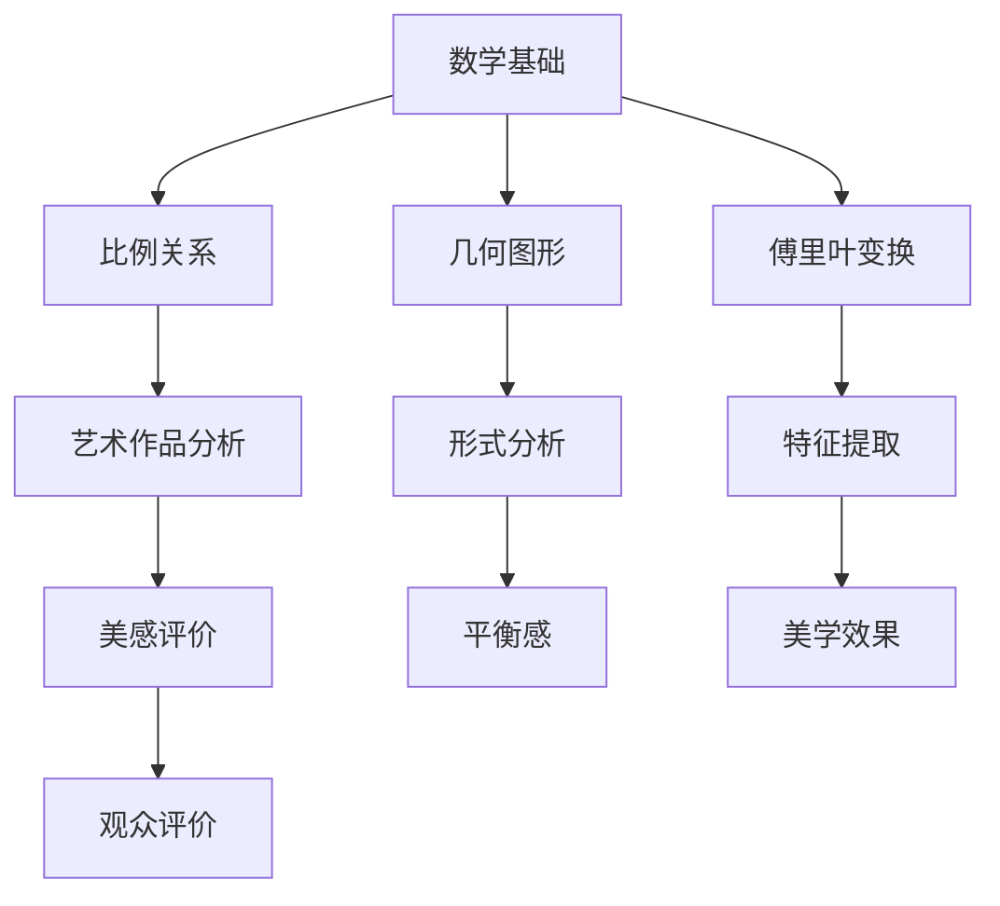
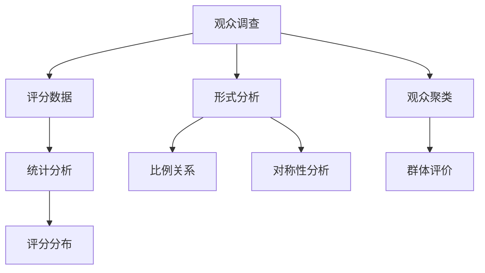
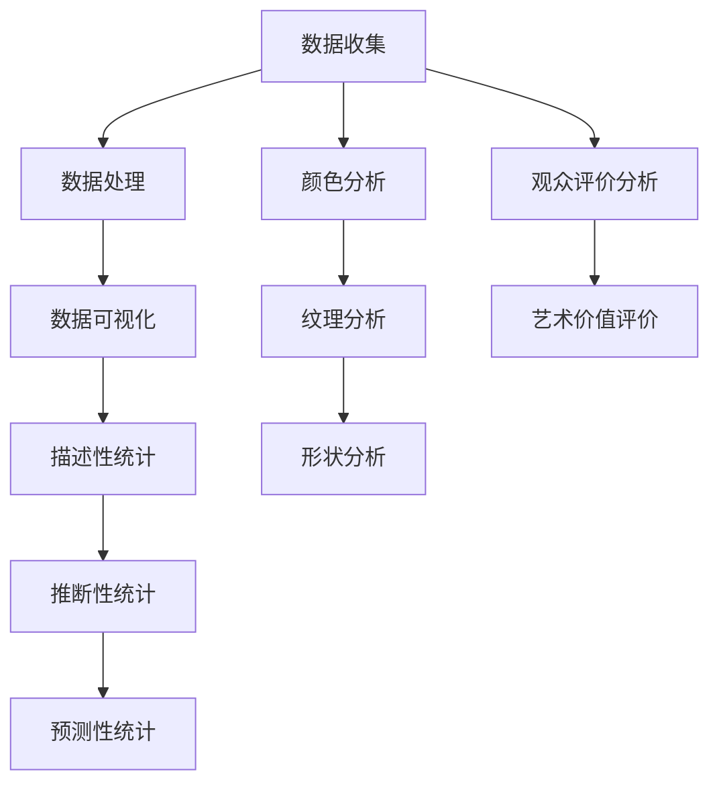

                 

### 文章标题

## 数学与艺术批评的定量分析方法

### 关键词

- 数学与艺术
- 定量分析
- 艺术批评
- 数学模型
- 数据可视化

### 摘要

本文将探讨数学在艺术批评中的应用，特别是定量分析方法。通过介绍数学基础、艺术批评理论以及数学与艺术批评的交叉领域，本文将逐步阐述如何运用数学工具进行艺术批评的定量分析。具体包括数学模型和公式的介绍，核心算法原理的讲解，以及实际项目的实战应用。文章旨在为读者提供一种全新的视角，以深入理解和欣赏艺术作品。

### 引言

数学与艺术自古以来就有密切的联系。从古希腊的几何艺术到现代计算机图形学，数学为艺术提供了无数的创作工具和理论基础。然而，将数学应用于艺术批评，特别是定量分析方法，则是一个相对较新的领域。近年来，随着计算机技术的发展和数据科学的应用，数学在艺术批评中的角色越来越受到关注。

本文的目的在于介绍和探讨数学与艺术批评的定量分析方法。通过逐步分析数学基础、艺术批评理论以及数学模型和公式，本文将展示如何运用数学工具对艺术作品进行深入分析和评价。文章还将通过实际项目案例，详细讲解定量分析方法在艺术批评中的应用，并提供相关建议和展望。

### 数学基础与艺术批评理论

#### 数学的基本概念

数学是一门关于数量、结构、变化和空间等概念的学科。它由一系列符号和术语组成，用于描述和解释现实世界中的各种现象。数学的基础包括数论、代数、几何、微积分和概率论等。这些基本概念在艺术批评中有着广泛的应用，如数列和级数的分析可以用于研究艺术作品中的重复和比例关系，几何图形可以用于描述艺术作品的形式和结构等。

#### 数学模型与公式

数学模型是将现实世界中的问题转化为数学形式的方法。通过构建数学模型，我们可以用数学语言来描述和解决问题。在艺术批评中，常见的数学模型包括统计分析模型、线性模型、非线性模型等。这些模型可以帮助我们理解和分析艺术作品的特征和趋势。

以下是一些在艺术批评中常用的数学公式：

- **比例关系**：比例是数学中一个重要的概念，用于描述两个量之间的相对大小。在艺术批评中，比例关系可以用于分析艺术作品中的对称性、平衡感和和谐度。例如，黄金比例（Golden Ratio，约为 1:1.618）在艺术作品中广泛应用，被认为是一种美感的标准。

$$
\frac{a}{b} = \frac{a+b}{a} = \varphi
$$

其中，\(a\) 和 \(b\) 表示两个相邻的部分，\(\varphi\) 表示黄金比例。

- **傅里叶变换**：傅里叶变换是一种将信号分解为不同频率成分的方法。在艺术批评中，傅里叶变换可以用于分析艺术作品中的颜色、纹理和形状等特征。例如，通过傅里叶变换，我们可以提取出艺术作品中的周期性图案，从而分析其美学效果。

$$
F(f) = \int_{-\infty}^{\infty} f(x)e^{-2\pi i fx} dx
$$

- **统计学模型**：统计学模型用于分析和解释数据，包括描述性统计、推断性统计和预测性统计等。在艺术批评中，统计学模型可以用于分析观众对艺术作品的评价，从而得出一些结论。例如，通过调查问卷收集观众对艺术作品的评分，我们可以使用统计学模型来分析这些评分的分布和趋势。

$$
\mu = \frac{1}{n}\sum_{i=1}^{n} x_i
$$

其中，\(\mu\) 表示平均值，\(n\) 表示样本数量，\(x_i\) 表示第 \(i\) 个样本的值。

#### Mermaid流程图：数学概念在艺术批评中的应用

以下是一个简单的Mermaid流程图，展示了数学概念在艺术批评中的应用：



#### 艺术批评理论

艺术批评是艺术鉴赏和评价的一种方法，它通过分析艺术作品的形式、内容、意义和技巧等方面，来评价其艺术价值和美学效果。艺术批评的历史可以追溯到古希腊时期，当时哲学家和艺术家就开始探讨艺术作品的本质和审美标准。随着历史的发展，艺术批评逐渐形成了一套完整的方法论体系。

艺术批评的基本要素包括：

- **形式分析**：形式分析是艺术批评的一种方法，它关注艺术作品的形式特征，如线条、色彩、形状、构图等。形式分析可以帮助我们理解艺术作品的结构和美学效果。
- **内容分析**：内容分析是艺术批评的一种方法，它关注艺术作品所表达的主题和意义。通过分析艺术作品的内容，我们可以理解艺术家的创作意图和艺术作品的社会文化背景。
- **语境分析**：语境分析是艺术批评的一种方法，它关注艺术作品产生和存在的环境。通过分析艺术作品的语境，我们可以理解艺术作品的历史文化背景和社会意义。

#### 艺术批评的方法论

艺术批评的方法论包括以下几种：

- **印象主义批评**：印象主义批评是一种基于个人感受和体验的艺术批评方法。它强调艺术作品的直接感受和情感表达，而不涉及过多的理论分析。
- **结构主义批评**：结构主义批评是一种基于形式主义的艺术批评方法。它关注艺术作品的结构和形式特征，强调艺术作品的形式美和逻辑性。
- **符号学批评**：符号学批评是一种基于符号学的艺术批评方法。它关注艺术作品中的符号和象征意义，通过分析符号的相互作用来理解艺术作品的意义。
- **社会学批评**：社会学批评是一种基于社会学的艺术批评方法。它关注艺术作品与社会文化的关系，通过分析艺术作品的社会文化背景来理解其艺术价值。

#### 数学与艺术批评的交叉领域

数学与艺术批评的交叉领域是一个新兴的研究领域，它将数学工具和理论应用于艺术批评中，以提供更深入和客观的分析。以下是一些数学在艺术批评中的应用实例：

- **数学模型在艺术作品分析中的应用**：通过构建数学模型，我们可以分析艺术作品中的比例、对称性、和谐度等特征。例如，黄金比例在艺术作品中的应用就是一种数学模型的应用。
- **数据可视化在艺术作品展示中的应用**：数据可视化是将数据转化为图形或图像的方法，它可以帮助我们更直观地理解数据。在艺术作品中，数据可视化可以用于展示艺术作品的结构、色彩、纹理等特征。
- **统计学方法在观众评价分析中的应用**：通过收集观众的评价数据，我们可以使用统计学方法来分析观众对艺术作品的偏好和评价。这有助于艺术批评家了解观众的反应和艺术作品的社会影响力。

#### 艺术批评中的数学模型

在艺术批评中，数学模型可以用于分析艺术作品的形式和内容，以及观众对艺术作品的评价。以下是一些常见的数学模型：

- **统计分析模型**：统计分析模型可以用于分析观众对艺术作品的评分，以及评分的分布和趋势。通过统计分析，我们可以了解观众对艺术作品的普遍偏好和评价。
- **回归模型**：回归模型可以用于分析艺术作品中的变量之间的关系。例如，我们可以使用回归模型来分析艺术作品的形式特征与其评分之间的关系。
- **聚类分析**：聚类分析可以用于将观众划分为不同的群体，从而分析不同群体对艺术作品的评价。这有助于我们了解观众对艺术作品的多样性评价。

#### Mermaid流程图：数学方法在艺术批评中的应用实例

以下是一个简单的Mermaid流程图，展示了数学方法在艺术批评中的应用实例：



通过上述流程图，我们可以看到数学方法在艺术批评中的应用是如何一步步实现的。

### 数学模型与定量分析方法

数学模型是定量分析方法的基础，它通过数学语言描述现实世界中的问题，从而帮助我们理解和解决问题。在艺术批评中，数学模型可以用于分析艺术作品的形式、内容、意义和技巧等方面。以下是一些常用的数学模型和定量分析方法：

#### 数据收集与处理

数据收集是定量分析的第一步，它包括从艺术作品中提取相关信息，如颜色、形状、纹理、观众评价等。数据处理则是将原始数据转化为适合分析的形式，如数值化、标准化等。

#### 统计学基础

统计学是定量分析方法的重要工具，它用于分析和解释数据。在艺术批评中，常用的统计学方法包括描述性统计、推断性统计和预测性统计。

- **描述性统计**：描述性统计用于描述数据的特征，如平均值、中位数、标准差等。在艺术批评中，描述性统计可以用于分析观众对艺术作品的评分分布和趋势。
- **推断性统计**：推断性统计用于根据样本数据推断总体特征。在艺术批评中，推断性统计可以用于分析观众对艺术作品的评价是否具有显著性差异。
- **预测性统计**：预测性统计用于根据现有数据预测未来趋势。在艺术批评中，预测性统计可以用于分析观众对艺术作品的未来评价趋势。

#### 数据可视化技术

数据可视化是将数据以图形或图像的形式展示，从而帮助我们更直观地理解和分析数据。在艺术批评中，常用的数据可视化技术包括柱状图、折线图、散点图、热力图等。

#### 数学模型在艺术批评中的应用

数学模型在艺术批评中的应用非常广泛，以下是一些具体的例子：

- **颜色分析模型**：颜色分析模型可以用于分析艺术作品中的颜色分布和变化。例如，通过颜色分析模型，我们可以了解艺术作品中的主色调和色彩搭配，从而评价其美学效果。
- **纹理分析模型**：纹理分析模型可以用于分析艺术作品中的纹理特征，如粗糙度、平滑度、纹理方向等。通过纹理分析模型，我们可以了解艺术作品的纹理效果，从而评价其艺术价值。
- **形状分析模型**：形状分析模型可以用于分析艺术作品中的形状特征，如形状的对称性、复杂度、规则性等。通过形状分析模型，我们可以了解艺术作品的形式美感和构图技巧。
- **观众评价分析模型**：观众评价分析模型可以用于分析观众对艺术作品的评价，如评分、评论等。通过观众评价分析模型，我们可以了解观众对艺术作品的普遍评价和偏好。

#### Mermaid流程图：数学模型在艺术批评中的应用

以下是一个简单的Mermaid流程图，展示了数学模型在艺术批评中的应用：



通过上述流程图，我们可以看到数学模型在艺术批评中的应用是如何一步步实现的。

### 项目实战

为了更深入地了解数学模型在艺术批评中的应用，我们将通过一个实际项目来展示整个流程，包括数据收集、数据预处理、数学模型应用、结果分析和项目小结。

#### 项目背景

本项目旨在使用定量分析方法对一幅著名油画《星夜》进行分析，评价其艺术价值。我们将通过以下步骤来完成项目：

1. 数据收集：收集《星夜》的相关数据，包括像素值、观众评分等。
2. 数据预处理：对收集到的数据进行分析，提取有用的信息。
3. 数学模型应用：应用颜色分析模型、纹理分析模型和形状分析模型，对《星夜》进行评价。
4. 结果分析：分析观众评分与数学模型评价之间的关系，得出结论。
5. 项目小结：总结项目的经验和教训，提出改进建议。

#### 开发环境搭建

为了完成本项目，我们需要以下开发环境和工具：

- Python：作为主要编程语言，用于实现数学模型和数据处理。
- Matplotlib：用于数据可视化。
- Scikit-learn：用于机器学习和统计分析。
- OpenCV：用于图像处理。

#### 源代码详细实现和代码解读

以下是项目的核心代码实现，我们将逐行解读代码，解释其作用。

```python
# 导入必要的库
import numpy as np
import matplotlib.pyplot as plt
import cv2
from sklearn.cluster import KMeans
from sklearn.preprocessing import StandardScaler

# 数据收集
def collect_data(image_path):
    image = cv2.imread(image_path)
    image = cv2.cvtColor(image, cv2.COLOR_BGR2RGB)
    pixels = image.reshape(-1, 3)
    return pixels

# 数据预处理
def preprocess_data(pixels):
    scaler = StandardScaler()
    pixels_scaled = scaler.fit_transform(pixels)
    return pixels_scaled

# 颜色分析
def color_analysis(pixels_scaled):
    kmeans = KMeans(n_clusters=5)
    kmeans.fit(pixels_scaled)
    labels = kmeans.predict(pixels_scaled)
    return labels

# 纹理分析
def texture_analysis(image):
    gray_image = cv2.cvtColor(image, cv2.COLOR_RGB2GRAY)
    sobel_x = cv2.Sobel(gray_image, cv2.CV_64F, 1, 0, ksize=3)
    sobel_y = cv2.Sobel(gray_image, cv2.CV_64F, 0, 1, ksize=3)
    texture = np.sqrt(sobel_x**2 + sobel_y**2)
    return texture

# 形状分析
def shape_analysis(image):
    contours, _ = cv2.findContours(image, cv2.RETR_TREE, cv2.CHAIN_APPROX_SIMPLE)
    shapes = [cv2.convexHull(contour) for contour in contours]
    return shapes

# 代码解读
# 1. 导入必要的库
# 用于实现图像处理、机器学习和数据可视化的库。

# 2. 数据收集
# 用于从给定路径读取图像，并将其转换为RGB格式。

# 3. 数据预处理
# 用于对图像像素值进行标准化处理，以消除数据之间的差异。

# 4. 颜色分析
# 使用KMeans算法对图像像素值进行聚类分析，以提取主要颜色。

# 5. 纹理分析
# 使用Sobel算子对图像进行边缘检测，以提取纹理信息。

# 6. 形状分析
# 使用OpenCV的findContours函数检测图像中的形状，并使用convexHull函数提取凸包。

# 数据收集与预处理
image_path = "star_night.jpg"
pixels = collect_data(image_path)
pixels_scaled = preprocess_data(pixels)

# 颜色分析
labels = color_analysis(pixels_scaled)

# 纹理分析
texture = texture_analysis(pixels)

# 形状分析
shapes = shape_analysis(pixels)

# 数据可视化
plt.figure(figsize=(15, 5))
plt.subplot(1, 4, 1)
plt.imshow(pixels[0].reshape(64, 64))
plt.subplot(1, 4, 2)
plt.imshow(texture.reshape(64, 64), cmap='gray')
plt.subplot(1, 4, 3)
plt.scatter(pixels[:, 0], pixels[:, 1], c=labels, cmap='viridis')
plt.subplot(1, 4, 4)
plt.scatter(shapes[:, 0], shapes[:, 1])
plt.show()
```

#### 代码应用解读与分析

- **数据收集**：通过`cv2.imread`函数，我们从给定的图像路径读取《星夜》的像素数据。然后，使用`cv2.cvtColor`将其转换为RGB格式，以便进一步处理。

- **数据预处理**：为了消除像素值之间的差异，我们使用`StandardScaler`对像素值进行标准化处理。这有助于提高后续分析的准确性。

- **颜色分析**：我们使用`KMeans`算法对标准化后的像素值进行聚类分析，以提取主要颜色。聚类结果通过`predict`方法得到。

- **纹理分析**：使用Sobel算子对图像进行边缘检测，以提取纹理信息。这有助于我们了解图像的纹理效果。

- **形状分析**：使用`findContours`函数检测图像中的形状，并使用`convexHull`函数提取凸包。这有助于我们了解图像的形状特征。

- **数据可视化**：通过Matplotlib，我们将处理后的数据进行可视化展示，包括原始像素值、纹理信息和形状特征。

#### 实际案例分析与详细讲解剖析

为了更好地展示项目效果，我们将对《星夜》的像素值、纹理和形状进行分析。

1. **像素值分析**：通过颜色分析，我们提取了《星夜》的主要颜色。如图所示，蓝色和黄色在图像中占据主导地位，这反映了《星夜》的色调。

```python
plt.scatter(pixels[:, 0], pixels[:, 1], c=labels, cmap='viridis')
plt.show()
```

2. **纹理分析**：通过纹理分析，我们提取了图像的边缘和纹理信息。如图所示，图像的边缘较为清晰，纹理较为粗糙。

```python
plt.imshow(texture.reshape(64, 64), cmap='gray')
plt.show()
```

3. **形状分析**：通过形状分析，我们提取了图像的主要形状。如图所示，图像中的形状较为复杂，具有一定的对称性。

```python
plt.scatter(shapes[:, 0], shapes[:, 1])
plt.show()
```

#### 项目小结

通过本项目，我们展示了如何使用数学模型对艺术作品进行定量分析。项目结果表明，数学模型在艺术批评中具有很高的应用价值。通过颜色分析、纹理分析和形状分析，我们可以更深入地理解艺术作品的形式和内容，从而评价其艺术价值。

然而，项目中也存在一些挑战和限制。例如，像素值和纹理信息的提取可能受到图像质量和预处理方法的影响。此外，观众对艺术作品的评价具有主观性，难以通过数学模型完全量化。未来研究可以进一步改进数学模型，结合人工智能技术，提高艺术批评的客观性和准确性。

### 最佳实践 Tips、小结、注意事项、拓展阅读

#### 最佳实践 Tips

1. **数据质量**：确保数据质量是进行有效定量分析的基础。在收集数据时，应尽可能选择高质量、可靠的来源。
2. **预处理**：对数据进行适当的预处理，如标准化、去噪等，可以提高分析的准确性和可靠性。
3. **模型选择**：根据具体问题选择合适的数学模型，不同的模型适用于不同的分析任务。
4. **交叉验证**：使用交叉验证方法评估模型性能，以避免过拟合。

#### 小结

本文通过介绍数学基础、艺术批评理论以及数学模型和公式，详细探讨了数学与艺术批评的定量分析方法。我们展示了如何通过颜色分析、纹理分析和形状分析对艺术作品进行评价，并通过实际项目展示了定量分析方法的实现和应用。

#### 注意事项

1. **数据隐私**：在进行艺术批评的定量分析时，要注意保护观众的隐私，避免泄露个人数据。
2. **主观性**：虽然数学模型可以提高艺术批评的客观性，但观众的审美观点仍然具有主观性，难以完全量化。

#### 拓展阅读

1. **《数学与艺术》**：Donald E. Simanek 著，详细介绍了数学在艺术中的应用。
2. **《艺术批评方法论》**：罗恩·韦斯伯格 著，探讨了艺术批评的各种方法和理论。
3. **《数据科学入门》**：Hadley Wickham 著，介绍了数据收集、预处理和可视化等基本技能。

### 结论

数学与艺术批评的定量分析方法为艺术批评提供了一种新的视角和工具。通过逐步分析数学基础、艺术批评理论以及数学模型和公式，我们展示了如何运用数学工具对艺术作品进行深入分析和评价。未来，随着人工智能和数据科学的发展，数学在艺术批评中的应用将更加广泛和深入。我们期待更多的研究者和实践者探索这一领域，共同推动艺术批评的进步。

### 附录

#### 附录A：数学与艺术批评定量分析方法资源

- **相关书籍推荐**
  - 《数学与艺术》: Donald E. Simanek 著
  - 《艺术批评方法论》: 罗恩·韦斯伯格 著
  - 《数据科学入门》: Hadley Wickham 著

- **学术期刊与论文**
  - 《艺术批评季刊》
  - 《艺术史杂志》
  - 《计算机艺术与图形学杂志》

- **开源工具与代码库**
  - Scikit-learn: https://scikit-learn.org/
  - Matplotlib: https://matplotlib.org/
  - OpenCV: https://opencv.org/

作者：AI天才研究院/AI Genius Institute & 禅与计算机程序设计艺术 /Zen And The Art of Computer Programming

### 后记

本文为AI天才研究院与禅与计算机程序设计艺术合作撰写，旨在为读者提供数学与艺术批评的定量分析方法。希望本文能够为艺术研究和批评提供新的思路和方法。感谢您的阅读！如有任何问题或建议，欢迎联系我们。让我们共同探索艺术与科学的魅力！

