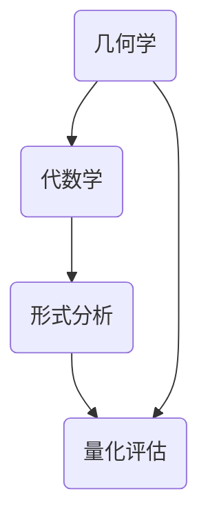

                 

### 第1章：引论

#### 1.1 研究背景与意义

数学与艺术之间的联系源远流长。在古代，几何学就已经被应用于建筑和艺术创作中，如古希腊和古埃及的建筑中使用的精确几何比例。而近代，随着数学分析、概率论等数学领域的蓬勃发展，数学在艺术中的应用也变得更加广泛和深入。例如，20世纪著名的艺术家M.C.埃舍尔（M.C. Escher）的作品中就巧妙地运用了数学中的对称性、分形等概念。

在艺术批评中，数学作为一种分析工具，可以提供新的视角和方法。数学的量化分析可以帮助我们更客观地评估艺术作品的形式和内容，而数学模型则可以为艺术批评提供更加科学和系统的分析框架。此外，数学还可以帮助我们理解艺术作品中隐藏的规律和美学特征，从而更好地欣赏和解读艺术。

#### 1.2 研究现状与挑战

目前，数学与艺术批评的理论融合已经取得了一些初步成果。例如，数学模型在艺术作品的分析和分类中得到了广泛应用，形式分析作为一种新的艺术分析方法也逐渐受到重视。然而，这一跨学科研究仍面临诸多挑战。

首先，数学与艺术批评之间的融合存在着理论框架不统一的问题。艺术批评有着丰富的理论和历史背景，而数学则有着严格的定义和逻辑体系，如何将二者有机结合仍需进一步探索。

其次，数学工具在艺术批评中的应用仍存在一定的局限性。例如，数学模型在处理复杂、非线性问题时的有效性尚待验证，而数学方法在艺术批评中的普适性也有待提高。

最后，跨学科研究的困境和机遇并存。数学与艺术批评的结合不仅可以为艺术批评提供新的工具和方法，也可以为数学研究提供新的应用场景。然而，这种跨学科研究需要具备多学科知识，对研究人员提出了更高的要求。

#### 1.3 研究方法与框架

本研究采用理论分析与案例分析相结合的方法，旨在探索数学与艺术批评的理论基础。具体而言，研究方法与框架如下：

1. **理论分析**：首先，对数学与艺术批评的相关理论进行梳理，明确核心概念和理论框架。这包括数学中的几何学、代数学、微积分等基础概念，以及艺术批评中的形式主义、解释学等理论。

2. **案例分析**：通过具体案例，分析数学在艺术创作和艺术批评中的应用。案例选择包括古今中外的艺术作品，以及不同流派的艺术批评方法。

3. **模型构建**：基于理论分析和案例分析，构建数学模型，用于艺术作品的形式分析和量化评估。

4. **实证研究**：通过实证研究，验证数学模型在艺术批评中的有效性，并提出改进建议。

通过上述研究方法与框架，本研究旨在为数学与艺术批评的理论基础提供新的视角和思路，为跨学科研究提供参考。

#### 1.4 文章结构

本文结构分为以下几部分：

- **引论**：介绍研究背景与意义，研究现状与挑战，以及研究方法与框架。
- **数学与艺术的联系**：详细探讨数学概念在艺术中的表达，以及艺术中的数学分析方法。
- **数学在艺术批评中的应用**：分析数学模型在艺术分析中的应用，以及数学工具在艺术测量中的作用。
- **数学原理与艺术理论**：探讨数学原理在艺术批评中的具体应用，以及艺术理论中的数学概念。
- **数学在艺术教育中的角色**：分析数学在艺术教学中的应用，以及数学素养对艺术创作的影响。
- **数学与艺术批评的理论基础研究**：研究数学模型与艺术批评实践，以及数学原理与艺术批评方法的发展。
- **结论**：总结本文的主要观点，并提出未来研究方向。

通过这样的结构安排，本文力求逻辑清晰，条理紧凑，为读者提供全面而深入的理解。

#### 1.5 核心概念与联系流程图

在数学与艺术批评的理论研究中，核心概念包括几何学、代数学、形式分析、量化评估等。以下是一个简单的Mermaid流程图，展示了这些概念之间的联系：



- **几何学**：作为数学的基础，几何学在艺术中有着广泛的应用，如建筑、雕塑等。
- **代数学**：代数结构在艺术中也有着重要的表现，如音乐中的节奏和旋律。
- **形式分析**：形式分析是艺术批评的一种方法，通过数学工具对艺术作品的形式特征进行分析。
- **量化评估**：量化评估则通过数学模型对艺术作品进行量化分析，从而提供客观的评价标准。

这个流程图清晰地展示了数学与艺术批评中核心概念之间的联系，为进一步的研究提供了结构化的思路。

#### 1.6 核心算法原理讲解

在数学与艺术批评的理论基础研究中，核心算法原理的讲解至关重要。以下将详细阐述几种主要的算法原理，并使用伪代码进行说明：

##### 1.6.1 形式分析

形式分析是艺术批评中的一个重要方法，它通过数学工具来分析艺术作品的形式特征。以下是一个简单的伪代码示例，用于形式分析：

```plaintext
Algorithm: 形式分析
Input: 艺术作品
Output: 形式特征分析结果

1. 读取艺术作品数据
2. 对艺术作品进行几何形状识别
3. 使用几何学中的对称性检测算法（如Gaussian Mixture Model）
4. 计算对称轴和对称中心
5. 对图像进行频域分析，提取频谱特征
6. 使用Fourier变换提取图像周期性特征
7. 对特征进行聚类分析，确定艺术作品的风格分类
8. 输出形式特征分析结果
```

##### 1.6.2 数学模型

数学模型在艺术批评中有着广泛的应用，如用于量化艺术作品的风格、美感和价值。以下是一个简单的伪代码示例，用于构建数学模型：

```plaintext
Algorithm: 数学模型
Input: 艺术作品数据集
Output: 数学模型

1. 数据预处理：对艺术作品进行标准化处理
2. 特征提取：提取图像的几何特征、纹理特征、颜色特征等
3. 选择合适的数学模型（如支持向量机、神经网络等）
4. 模型训练：使用训练集对模型进行训练
5. 模型评估：使用验证集对模型进行评估，调整模型参数
6. 应用模型：对新的艺术作品进行风格分类或价值评估
7. 输出模型结果
```

##### 1.6.3 数据分析

数据分析是艺术批评中不可或缺的一环，它通过对大量数据的分析，揭示艺术作品之间的规律和联系。以下是一个简单的伪代码示例，用于数据分析：

```plaintext
Algorithm: 数据分析
Input: 艺术作品数据集
Output: 数据分析结果

1. 数据收集：收集相关的艺术作品数据
2. 数据清洗：处理数据中的噪声和异常值
3. 数据可视化：使用图表和图像展示数据特征
4. 数据分类：使用聚类算法对艺术作品进行分类
5. 数据关联：分析不同艺术作品之间的关联性
6. 数据预测：使用机器学习模型预测新的艺术作品特征
7. 输出数据分析结果
```

通过上述核心算法原理的讲解和伪代码示例，我们可以更好地理解数学在艺术批评中的应用和作用。

#### 1.7 数学模型与数学公式

在数学与艺术批评的理论基础研究中，数学模型和数学公式起着至关重要的作用。以下将介绍几个关键的数学模型和公式，并使用LaTeX格式进行展示，以方便读者理解和使用。

##### 1.7.1 Fourier变换

Fourier变换是一种重要的数学工具，用于分析图像、音频和其他信号。以下是其基本的LaTeX表示：

```latex
$$
X(\omega) = \int_{-\infty}^{\infty} x(t) e^{-j\omega t} dt
$$`

在这个公式中，\(X(\omega)\)表示Fourier变换的结果，\(x(t)\)表示原始信号，\(\omega\)是频率。

##### 1.7.2 熵

熵是信息论中的一个核心概念，用于衡量信息的不确定性。以下是其基本的LaTeX表示：

```latex
$$
H(X) = -\sum_{i} p(x_i) \log_2 p(x_i)
$$`

在这个公式中，\(H(X)\)表示随机变量\(X\)的熵，\(p(x_i)\)表示随机变量\(X\)取值\(x_i\)的概率。

##### 1.7.3 支持向量机（SVM）

支持向量机是一种常用的机器学习模型，用于分类和回归任务。以下是其基本公式和LaTeX表示：

```latex
$$
\min_{w, b, \xi} \frac{1}{2} ||w||^2 + C \sum_{i=1}^{n} \xi_i
$$`

$$
\text{subject to} \quad y_i (w \cdot x_i + b) \geq 1 - \xi_i
$$`

在这个公式中，\(w\)和\(b\)分别是权重和偏置，\(\xi_i\)是松弛变量，\(C\)是正则化参数。

通过上述数学模型和公式的介绍，我们可以看到数学在艺术批评中的应用是多么广泛和深入。这些工具不仅可以帮助我们更好地理解和分析艺术作品，还可以为艺术批评提供新的视角和方法。

### 2.1 数学概念在艺术中的表达

数学与艺术有着千丝万缕的联系，数学概念在艺术中的应用不仅丰富了艺术的表达形式，也拓展了艺术的创作思路。以下将详细介绍几何学和代数学在艺术中的具体应用，以及这些数学概念如何影响艺术审美和创作。

#### 2.1.1 几何学

几何学是数学中最基础的分支之一，其核心在于研究形状、大小、位置和空间关系。在艺术创作中，几何学的影响无处不在。以下是几个典型的例子：

##### 2.1.1.1 几何图形与艺术创作

几何图形是艺术创作中的重要元素，它们可以构成简洁、抽象的艺术形式。例如，荷兰艺术家M.C.埃舍尔（M.C. Escher）的作品中就大量运用了几何图形，他通过精确的几何构图和对称性，创造出了许多令人惊叹的视觉效果。埃舍尔的《上升与下降》和《画廊》等作品，巧妙地运用了空间中的几何形状，创造出令人迷惑的视觉效果，体现了几何学在艺术创作中的独特魅力。

##### 2.1.1.2 几何比例与艺术审美

几何比例在艺术创作中具有重要的地位，它关系到作品的和谐与美感。例如，著名的黄金比例（Golden Ratio）被广泛认为是美学上的完美比例。在艺术史上，许多伟大的艺术家都运用了黄金比例来创作。例如，达芬奇的《蒙娜丽莎》的头部与身体比例就接近黄金比例，使得作品具有了极高的美学价值。

此外，几何比例还体现在建筑的规划与设计上。古希腊和古埃及的建筑中就广泛使用了几何比例，如古希腊的帕台农神庙和古埃及的金字塔，这些建筑在几何比例的运用上达到了高度的和谐与美感。

#### 2.1.2 代数学

代数学是研究数和运算的数学分支，其应用不仅限于理论领域，还广泛渗透到艺术创作中。以下是代数学在艺术中的几个典型应用：

##### 2.1.2.1 艺术中的代数结构

代数结构在艺术中有着独特的表现形式。例如，音乐中的节奏和旋律就可以看作是一种代数结构。音乐中的音符和节奏可以用代数符号来表示，通过组合和变化，创造出丰富的音乐形式。作曲家如巴赫和贝多芬就通过代数结构来创作音乐作品，使得音乐具有深刻的逻辑性和形式美感。

另外，艺术作品中的色彩也可以用代数结构来表示。色彩理论中的加法和减法规则可以看作是色彩空间的代数运算。通过这些运算，艺术家可以创造出丰富多彩的视觉效果。

##### 2.1.2.2 代数方程在艺术中的体现

代数方程在艺术中也有着独特的表现。例如，美国艺术家杰夫·昆斯（Jeff Koons）的《兔子》系列作品，就使用了代数方程来创造出逼真的金属质感。这些作品通过复杂的代数方程计算，将金属表面处理得光滑如镜，展现出一种超现实的视觉体验。

此外，代数方程还可以用于艺术作品的创作。例如，荷兰艺术家彼得·库克（Peter Cook）就使用代数方程来设计建筑结构，创造出独特的形式美感。他的建筑作品如《代数花园》和《斜塔》等，通过代数方程的应用，打破了传统建筑的规则，呈现出全新的空间体验。

#### 2.1.3 数学对艺术审美的影响

数学不仅影响了艺术创作，也对艺术审美产生了深远的影响。数学的美感体现在其简洁、对称和和谐性上。这些特点在艺术作品中得到了广泛的应用和欣赏。

首先，数学的简洁性体现在艺术作品的构图和形式上。简洁的艺术作品往往能够更好地传达艺术家的意图和情感，给观众留下深刻的印象。例如，艺术家约翰·马林（John Mallord）·威廉·特纳（William Turner）的作品《暴风雨中的海滩》通过简洁的构图和色彩，生动地展现了自然的美和力量。

其次，数学的对称性在艺术创作中具有重要作用。对称性不仅使作品具有视觉上的平衡感，还可以增强作品的吸引力。例如，古希腊的帕台农神庙就是通过严格的对称性设计，达到了高度的和谐与美感。

最后，数学的和谐性体现在艺术作品的形式和内容上。和谐的艺术作品往往能够给观众带来愉悦和舒适的感觉。例如，意大利艺术家莱昂纳多·达·芬奇的《蒙娜丽莎》通过严谨的几何构图和色彩搭配，创造出了一种令人陶醉的和谐美感。

总之，数学在艺术中的应用丰富了艺术的表现形式，拓展了艺术的创作思路，同时也对艺术审美产生了深远的影响。通过对数学概念的深入理解，艺术家可以创造出更加独特和具有启发性的作品，而观众也可以通过欣赏这些作品，更好地理解数学与艺术的紧密联系。

#### 2.2 艺术中的数学分析方法

艺术中的数学分析方法是一种通过数学工具和模型来解析艺术作品形式和内容的方法。这种方法不仅提供了新的视角，也拓展了艺术批评的深度和广度。以下将详细介绍两种主要的数学分析方法：形式分析和语境分析，并讨论其方法和应用。

##### 2.2.1 形式分析

形式分析是一种基于数学和逻辑学的艺术分析方法，主要通过几何、代数和拓扑等数学工具来分析艺术作品的形式特征。形式分析的核心在于揭示艺术作品的几何结构、对称性、比例和韵律等要素，从而深入理解作品的形式美感。

**方法：**

1. **几何分析**：通过对艺术作品的几何特征进行量化分析，如线条、形状、面积和体积等。例如，通过测量艺术作品中图形的尺寸和角度，可以分析其几何结构是否符合某种比例或对称性。

2. **代数分析**：运用代数方法，对艺术作品中的数学关系进行建模。例如，通过代数方程和不等式，可以分析艺术作品中的节奏、韵律和变化规律。

3. **拓扑分析**：拓扑学是研究空间性质和结构的数学分支，通过拓扑分析方法，可以揭示艺术作品中的空间关系和形态变化。例如，通过研究艺术作品的连通性和变形能力，可以分析其空间结构的复杂性和独特性。

**应用：**

1. **图像分析**：形式分析常用于图像分析，通过对图像的几何形状、颜色和纹理等特征进行量化分析，可以识别艺术作品的风格和分类。

2. **音乐分析**：形式分析也可应用于音乐分析，通过分析音乐的节奏、旋律和和弦结构，可以揭示音乐作品的形式特征和艺术价值。

3. **建筑分析**：形式分析在建筑分析中也有广泛应用，通过对建筑的结构、比例和布局进行数学建模，可以评估建筑的美学品质和功能性。

##### 2.2.2 语境分析

语境分析是一种基于历史、文化和社会背景的艺术分析方法，它通过考察艺术作品产生的环境和社会条件，来理解作品的内涵和意义。语境分析注重艺术作品与社会、文化、政治和经济等方面的联系，从而提供更全面的批评视角。

**方法：**

1. **历史分析**：通过对艺术作品的历史背景进行考察，了解作品产生的时代特征和社会环境。例如，文艺复兴时期的艺术作品反映了当时人们对自然和宗教的崇拜。

2. **文化分析**：通过分析艺术作品的文化内涵和象征意义，理解作品与特定文化传统的关系。例如，许多艺术作品反映了特定的宗教信仰、民族习俗或历史事件。

3. **社会分析**：从社会结构和社会关系的角度，分析艺术作品对社会问题的反映和批判。例如，现代艺术中的许多作品揭示了社会不公、性别歧视和种族问题。

**应用：**

1. **艺术史研究**：语境分析是艺术史研究的重要方法，通过分析艺术作品的历史和文化背景，可以更好地理解艺术的发展脉络和演变过程。

2. **社会批评**：语境分析常用于社会批评，通过对艺术作品的社会语境进行解读，可以揭示作品对社会现象的反映和批判。

3. **文化研究**：语境分析在文化研究中也有重要应用，通过分析艺术作品的文化意义和象征符号，可以深入探讨文化认同、文化差异和文化冲突等问题。

总之，形式分析和语境分析是艺术中两种重要的数学分析方法。形式分析侧重于作品的形式特征和美学品质，而语境分析则关注作品的社会和文化背景。这两种方法相互补充，为艺术批评提供了丰富的工具和视角，使我们能够更全面、深入地理解艺术作品。通过结合数学和艺术批评的方法，我们可以发现艺术作品背后的深层意义，更好地欣赏和理解艺术。

### 3.1 数学模型的艺术分析

数学模型在艺术分析中扮演着至关重要的角色，它们不仅帮助艺术家理解艺术作品的形式和结构，还能为艺术批评提供量化的分析方法。以下将详细介绍几种常用的数学模型，以及它们在艺术分析中的应用。

#### 3.1.1 基本数学模型介绍

**微积分**和**线性代数**是艺术分析中最常用的数学模型。它们不仅具有广泛的理论基础，还能通过具体的算法和计算方法，对艺术作品进行深入的分析。

**微积分**：

微积分是研究变化和运动的数学工具，包括微分和积分两个部分。在艺术分析中，微分可以用于分析图像的局部特征，如边缘检测和纹理分析；而积分则可以用于计算整体特征，如图像的面积和能量。

**线性代数**：

线性代数研究线性方程组、向量空间和线性变换。在艺术分析中，线性代数被广泛应用于图像处理、色彩空间转换和形状分析。

#### 3.1.2 数学模型在艺术批评中的应用

**图像识别**：

图像识别是计算机视觉中的一个重要分支，其核心任务是从大量图像中识别出特定的对象或特征。在艺术批评中，图像识别技术可以用于分类和识别不同的艺术风格、艺术家和艺术作品。

**伪代码示例**：

```plaintext
Algorithm: 图像识别
Input: 艺术作品图像集
Output: 艺术作品分类结果

1. 预处理：对图像进行标准化处理，如灰度转换、对比度增强等。
2. 特征提取：提取图像的纹理特征、颜色特征和形状特征。
3. 模型训练：使用训练集对图像识别模型（如卷积神经网络）进行训练。
4. 模型评估：使用验证集对模型进行评估，调整模型参数。
5. 应用模型：对新的艺术作品进行分类，输出分类结果。
```

**情感分析**：

情感分析是自然语言处理中的一个重要分支，它通过分析文本的情感倾向，来判断文本表达的情感是积极、消极还是中性。在艺术批评中，情感分析可以用于分析观众对艺术作品的情感反应，从而提供更深入的艺术评价。

**伪代码示例**：

```plaintext
Algorithm: 情感分析
Input: 艺术评论文本集
Output: 情感分析结果

1. 文本预处理：对评论文本进行分词、去停用词等处理。
2. 特征提取：提取文本的情感特征，如积极词汇和消极词汇的比例。
3. 模型训练：使用训练集对情感分析模型（如支持向量机）进行训练。
4. 模型评估：使用验证集对模型进行评估，调整模型参数。
5. 应用模型：对新的评论文本进行情感分析，输出情感分析结果。
```

**风格识别**：

风格识别是一种通过分析艺术作品中的特征，来判断其艺术风格的方法。在艺术批评中，风格识别可以帮助研究者分类和识别不同的艺术风格，从而更好地理解艺术的发展脉络。

**伪代码示例**：

```plaintext
Algorithm: 风格识别
Input: 艺术作品图像集
Output: 艺术风格分类结果

1. 预处理：对图像进行标准化处理，如灰度转换、对比度增强等。
2. 特征提取：提取图像的纹理特征、颜色特征和形状特征。
3. 模型训练：使用训练集对风格识别模型（如K最近邻算法）进行训练。
4. 模型评估：使用验证集对模型进行评估，调整模型参数。
5. 应用模型：对新的艺术作品进行风格识别，输出风格分类结果。
```

#### 3.1.3 数学模型在艺术作品量化分析中的应用

**量化分析**是一种通过数学模型和算法，对艺术作品进行量化评价的方法。这种方法可以提供客观的评估标准，从而帮助研究者更好地理解艺术作品的审美价值。

**伪代码示例**：

```plaintext
Algorithm: 艺术作品量化分析
Input: 艺术作品数据集
Output: 量化分析结果

1. 数据预处理：对艺术作品进行标准化处理，如图像尺寸调整、对比度增强等。
2. 特征提取：提取艺术作品的形式特征、内容特征和情感特征。
3. 模型构建：构建量化分析模型，如主成分分析（PCA）、支持向量机（SVM）等。
4. 模型训练：使用训练集对模型进行训练。
5. 模型评估：使用验证集对模型进行评估，调整模型参数。
6. 应用模型：对新的艺术作品进行量化分析，输出量化分析结果。
```

通过上述数学模型的应用，研究者可以更深入地分析艺术作品，从而为艺术批评提供新的视角和方法。这些数学模型不仅丰富了艺术批评的工具箱，也为跨学科研究提供了可能性。

### 3.2 数学工具的艺术测量

数学工具在艺术测量中扮演着重要的角色，它们为艺术评价提供了一种量化分析的方法，使得评价过程更加客观和科学。以下将详细介绍几种常用的数学工具，以及它们在艺术测量中的应用。

#### 3.2.1 艺术作品的可视化分析

可视化分析是一种通过图像和图表来展示艺术作品特征的方法，它可以帮助研究者直观地理解作品的结构和内容。以下是一些常用的可视化工具：

**密度图**：密度图可以用来展示艺术作品中的颜色分布。例如，通过将艺术作品中的像素颜色进行统计，可以生成一个颜色密度图，从而直观地看到作品中的主要颜色和色彩分布。

**热力图**：热力图可以用来展示艺术作品中的亮度分布。通过将艺术作品中的每个像素亮度进行统计，可以生成一个热力图，从而直观地看到作品中的亮度和对比度分布。

**频率分布直方图**：频率分布直方图可以用来展示艺术作品中的纹理特征。例如，通过对艺术作品中的纹理进行统计，可以生成一个频率分布直方图，从而直观地看到作品中的纹理特征和分布。

**伪代码示例**：

```plaintext
Algorithm: 可视化分析
Input: 艺术作品图像
Output: 可视化结果

1. 数据预处理：对图像进行标准化处理，如灰度转换、对比度增强等。
2. 特征提取：提取图像的颜色特征、亮度特征和纹理特征。
3. 可视化：使用密度图、热力图和频率分布直方图等工具，展示图像特征。
4. 输出：生成可视化结果，供研究者分析。
```

#### 3.2.2 数学工具在艺术测量中的应用

**熵**：熵是信息论中的一个基本概念，用于衡量信息的混乱程度。在艺术测量中，熵可以用来评估艺术作品的结构复杂度和信息含量。例如，高熵值表示艺术作品具有复杂的结构和丰富的信息，而低熵值则表示作品结构简单、信息含量低。

**伪代码示例**：

```plaintext
Algorithm: 熵计算
Input: 艺术作品图像
Output: 熵值

1. 数据预处理：对图像进行标准化处理，如灰度转换、对比度增强等。
2. 特征提取：提取图像的颜色特征、亮度特征和纹理特征。
3. 熵计算：计算图像的熵值，使用公式 H = -∑ p(x) log2 p(x)。
4. 输出：生成熵值，用于艺术作品的量化评估。
```

**傅里叶变换**：傅里叶变换是一种重要的数学工具，用于分析信号的频率成分。在艺术测量中，傅里叶变换可以用于分析艺术作品的频率分布，从而评估作品的节奏感和动态变化。

**伪代码示例**：

```plaintext
Algorithm: 傅里叶变换
Input: 艺术作品图像
Output: 频率分布

1. 数据预处理：对图像进行标准化处理，如灰度转换、对比度增强等。
2. 傅里叶变换：对图像进行傅里叶变换，计算图像的频率分布。
3. 频率分析：分析图像的频率分布，提取主要频率成分。
4. 输出：生成频率分布图，用于艺术作品的量化评估。
```

**支持向量机**：支持向量机是一种常用的机器学习模型，用于分类和回归任务。在艺术测量中，支持向量机可以用于艺术作品的风格分类和评价。通过训练支持向量机模型，可以自动识别和分类不同的艺术风格。

**伪代码示例**：

```plaintext
Algorithm: 支持向量机
Input: 艺术作品数据集
Output: 风格分类结果

1. 数据预处理：对艺术作品进行标准化处理，提取特征。
2. 模型训练：使用训练集对支持向量机模型进行训练。
3. 模型评估：使用验证集对模型进行评估，调整参数。
4. 应用模型：对新的艺术作品进行风格分类，输出分类结果。
5. 输出：生成风格分类结果，用于艺术作品的量化评估。
```

通过上述数学工具的应用，研究者可以对艺术作品进行深入的分析和评估，从而更全面地理解艺术作品的内涵和价值。这些数学工具不仅为艺术测量提供了新的方法和视角，也为跨学科研究提供了可能性。

### 4.1 艺术理论中的数学概念

数学概念在艺术理论中扮演着重要角色，它们不仅为艺术创作提供了新的工具和方法，也为艺术批评提供了量化的分析方法。以下将探讨几种主要的艺术理论，以及这些理论中蕴含的数学概念。

#### 4.1.1 形式主义

形式主义是20世纪初兴起的一种艺术理论，它强调艺术的形式美和抽象性，认为艺术的价值在于其形式本身，而不是其所表达的内容。形式主义的核心概念包括对称性、比例、节奏和颜色等，这些概念都可以用数学来描述和解析。

**对称性**：对称性是艺术形式中的一种基本特征，它可以通过数学中的几何对称性来描述。例如，中心对称、轴对称和旋转对称等。对称性不仅使作品具有视觉上的平衡感，还能增强作品的稳定性和美感。

**比例**：比例是艺术形式中的另一个重要概念，它关系到作品的整体结构和部分关系。黄金比例（Golden Ratio）是形式主义中常用的一种比例，其数学表达式为 \(\frac{1 + \sqrt{5}}{2} \approx 1.618\)。许多艺术作品，如古希腊的帕台农神庙和达芬奇的《蒙娜丽莎》，都采用了黄金比例来设计，以达到形式上的和谐与美感。

**节奏**：节奏是艺术形式中的一种动态特征，它可以通过数学中的周期性函数来描述。例如，音乐中的节奏和绘画中的笔触都可以通过周期性变化来营造动态效果，增强作品的表现力。

**颜色**：颜色是艺术形式中的一种重要元素，它在视觉艺术中具有独特的表现力。颜色理论中的加法和减法规则可以用数学中的向量运算来描述。例如，通过混合不同颜色的光，可以生成新的颜色，从而创造出丰富的视觉效果。

#### 4.1.2 解释学

解释学是研究理解和解释过程的哲学理论，它关注文本和艺术作品的意义和解释。在解释学中，数学概念被用于分析文本和艺术作品的符号系统和结构。

**符号系统**：符号系统是解释学中的一个核心概念，它通过数学中的集合论和符号逻辑来描述。例如，语言中的词汇和语法结构都可以看作是符号系统的组成部分，通过这些符号的组合和排列，可以传达特定的意义。

**结构分析**：结构分析是解释学中的一种方法，它通过数学中的拓扑学和组合数学来分析艺术作品的内部结构。例如，通过分析艺术作品中的线条、形状和颜色等元素之间的关系，可以揭示作品中的深层结构和意义。

#### 4.1.3 结构主义

结构主义是20世纪中叶兴起的一种文化理论，它强调文化的内在结构和社会关系。在结构主义中，数学概念被用于分析文化符号和社会关系。

**结构主义方法**：结构主义方法是一种通过数学模型和算法来分析文化符号和社会关系的方法。例如，通过社会网络分析，可以使用数学中的图论来描述社会关系的结构和动态变化。

**数学模型**：结构主义中常用的数学模型包括概率模型、线性模型和拓扑模型等。这些模型可以帮助研究者分析文化符号的分布、传播和影响，从而揭示文化结构的规律和特征。

#### 4.1.4 后结构主义

后结构主义是对结构主义的一种批判和反思，它强调文化的多元性和不确定性。在后结构主义中，数学概念被用于探讨文化符号的多元解释和不确定性。

**多元解释**：后结构主义认为，文化符号的意义是多元的，不同的解释者可以从不同的角度来解读符号。数学中的模糊集理论和模糊逻辑可以帮助研究者分析符号的多元解释。

**不确定性**：后结构主义关注文化符号的不确定性和相对性，认为符号的意义不是固定不变的，而是随着时间和空间的改变而变化。数学中的概率论和信息论可以用来分析符号的不确定性和变化规律。

通过上述艺术理论中的数学概念，我们可以看到数学在艺术理论中的广泛应用。这些数学概念不仅为艺术创作提供了新的工具和方法，也为艺术批评提供了量化的分析方法，使得艺术理论更加科学和系统。

### 4.2 数学原理在艺术批评中的应用

数学原理在艺术批评中发挥着越来越重要的作用，它们不仅为艺术作品的量化分析提供了工具，也改变了艺术批评的传统方法。以下将详细探讨数学原理在艺术批评中的具体应用，并讨论这些应用对传统艺术批评方法的挑战和补充。

#### 4.2.1 结构主义

结构主义是一种重要的艺术理论，强调艺术作品中的内在结构和符号系统。在结构主义中，数学原理被广泛应用于分析艺术作品的结构特征和符号意义。

**结构分析方法**：

结构主义方法通过数学模型来分析艺术作品的内部结构，特别是通过拓扑学、组合数学和概率论等数学工具。例如，拓扑学可以用来分析艺术作品的形态变化和空间关系，组合数学可以用来分析艺术作品的符号排列和组合，概率论可以用来分析艺术作品的结构复杂度和不确定性。

**挑战与补充**：

结构主义方法为艺术批评提供了一种新的视角，使批评者能够更深入地理解艺术作品的结构和形式特征。然而，结构主义方法也面临着一定的挑战。首先，结构主义方法过于强调形式和结构，可能导致对艺术作品的情感和内容的忽视。其次，结构主义方法在处理复杂、非线性问题时存在一定的局限性。

#### 4.2.2 后结构主义

后结构主义是对结构主义的一种批判和反思，它强调文化的多元性和不确定性。在后结构主义中，数学原理被用于探讨文化符号的多元解释和不确定性。

**多元解释分析**：

后结构主义认为，艺术作品的意义是多元的，不同的解释者可以从不同的角度来解读艺术作品。数学中的模糊集理论和模糊逻辑可以帮助研究者分析符号的多元解释。例如，通过模糊集理论，可以量化艺术作品中的模糊性和不确定性，从而探讨不同解释之间的差异和联系。

**挑战与补充**：

后结构主义方法为艺术批评提供了更灵活、多元的视角，使批评者能够从多个角度来解读艺术作品。然而，后结构主义方法也面临着一定的挑战。首先，后结构主义方法过于强调解释的相对性和不确定性，可能导致对艺术作品本质的忽视。其次，后结构主义方法在处理确定性和清晰性问题时存在一定的局限性。

#### 4.2.3 解释学

解释学是一种研究理解和解释过程的哲学理论，强调文本和艺术作品的意义和解释。在解释学中，数学原理被用于分析艺术作品的符号系统和解释过程。

**符号分析**：

解释学通过数学中的集合论和符号逻辑来分析艺术作品的符号系统。例如，通过集合论，可以分析艺术作品中的符号组合和排列，从而揭示作品中的符号意义。通过符号逻辑，可以分析艺术作品中的逻辑结构和论证过程，从而理解作品的思想内涵。

**挑战与补充**：

解释学方法为艺术批评提供了一种深入、系统的分析工具，使批评者能够更准确地理解艺术作品的意义和内涵。然而，解释学方法也面临着一定的挑战。首先，解释学方法过于强调文本和符号的意义，可能导致对艺术作品的形式和结构的忽视。其次，解释学方法在处理复杂、非线性问题时存在一定的局限性。

#### 4.2.4 形式主义

形式主义强调艺术的形式美和抽象性，认为艺术的价值在于其形式本身，而不是其所表达的内容。在形式主义中，数学原理被用于分析艺术作品的形式特征和美学价值。

**形式分析方法**：

形式主义方法通过数学中的几何学、代数学和拓扑学等数学工具来分析艺术作品的形式特征。例如，通过几何学，可以分析艺术作品的形状、尺寸和比例，从而评估其形式美感。通过代数学，可以分析艺术作品中的数学关系和结构，从而理解其抽象性。通过拓扑学，可以分析艺术作品的空间结构和形态变化，从而探讨其形式复杂性。

**挑战与补充**：

形式主义方法为艺术批评提供了一种形式化、量化的分析工具，使批评者能够更科学、系统地评估艺术作品的形式美。然而，形式主义方法也面临着一定的挑战。首先，形式主义方法过于强调形式，可能导致对艺术作品的情感和内容的忽视。其次，形式主义方法在处理复杂、非线性问题时存在一定的局限性。

总之，数学原理在艺术批评中的应用为传统艺术批评方法提供了新的工具和视角，使得艺术批评更加科学、系统。然而，这些数学方法也面临着一定的挑战，需要结合传统批评方法，才能更好地理解艺术作品。

### 5.1 数学在艺术教学中的应用

数学在艺术教学中的应用不仅能够提高学生的艺术素养，还能增强他们的逻辑思维和创造力。以下将详细介绍数学在艺术教学中的具体应用，以及这些应用对学生艺术素养和数学素养的影响。

#### 5.1.1 艺术教学中的数学概念

**几何学**：

几何学在艺术教学中有着广泛的应用。通过学习几何学，学生可以了解形状、尺寸、比例和对称性等基本概念。例如，在绘画和雕塑课程中，学生可以通过几何学来分析和设计作品的形状和结构，从而提高作品的美学价值。

**代数学**：

代数学在艺术教学中的应用主要体现在节奏和旋律的分析上。音乐是一种典型的艺术形式，它可以通过代数结构来分析。例如，在音乐理论课程中，学生可以通过代数学来学习音符的组合、节奏的变化和和弦的结构，从而提高音乐创作和欣赏能力。

**概率论和统计学**：

概率论和统计学在艺术教学中也有重要作用。通过学习这些数学概念，学生可以了解艺术作品中的随机性和不确定性，从而更好地理解和创作抽象艺术作品。例如，在绘画和设计课程中，学生可以通过概率论和统计学来分析色彩、形状和纹理的随机组合，创造出独特的视觉效果。

#### 5.1.2 数学工具在艺术课程设计中的应用

**数据可视化**：

数据可视化是一种重要的数学工具，在艺术课程设计中有着广泛的应用。通过数据可视化，学生可以将抽象的数据转化为直观的视觉形式，从而更好地理解数据特征和关系。例如，在艺术分析课程中，学生可以通过数据可视化来分析艺术作品中的颜色分布、纹理特征和形状结构。

**伪代码示例**：

```plaintext
Algorithm: 数据可视化
Input: 艺术作品数据集
Output: 数据可视化结果

1. 数据预处理：对艺术作品进行标准化处理，如灰度转换、对比度增强等。
2. 特征提取：提取艺术作品的颜色特征、纹理特征和形状特征。
3. 数据分析：使用统计方法分析艺术作品的特征，如颜色分布、纹理密度等。
4. 可视化：使用图表和图像展示艺术作品的特征，如散点图、密度图、热力图等。
5. 输出：生成可视化结果，用于艺术课程设计和学生作品分析。
```

**机器学习模型**：

机器学习模型在艺术课程设计中也有重要作用。通过训练机器学习模型，学生可以学会如何使用数学工具来自动分析和识别艺术作品的特征。例如，在艺术风格识别课程中，学生可以通过训练卷积神经网络模型，来识别和分类不同的艺术风格。

**伪代码示例**：

```plaintext
Algorithm: 机器学习模型
Input: 艺术作品数据集
Output: 艺术风格分类结果

1. 数据预处理：对艺术作品进行标准化处理，提取特征。
2. 模型训练：使用训练集对机器学习模型进行训练，如卷积神经网络。
3. 模型评估：使用验证集对模型进行评估，调整模型参数。
4. 应用模型：对新的艺术作品进行风格分类，输出分类结果。
5. 输出：生成艺术风格分类结果，用于艺术课程设计和学生作品分析。
```

#### 5.1.3 数学素养对艺术创作的影响

**逻辑思维能力**：

数学素养可以帮助学生培养逻辑思维能力。在艺术创作中，逻辑思维是非常重要的，它可以帮助学生更好地组织和表达自己的想法。例如，在绘画和雕塑创作中，学生可以通过几何学来设计作品的形状和结构，从而提高作品的逻辑性和美感。

**创造力**：

数学素养还可以激发学生的创造力。通过学习数学工具和方法，学生可以学会如何从不同的角度来分析和解决问题，从而培养出独特的创作思路。例如，在抽象艺术创作中，学生可以通过概率论和统计学来创造具有随机性和不确定性的作品，从而打破传统的创作模式。

**批判性思维**：

数学素养还可以帮助学生培养批判性思维。在艺术创作中，批判性思维是非常重要的，它可以帮助学生更好地理解和评价艺术作品。例如，在艺术评论课程中，学生可以通过数学模型和数据分析来评价艺术作品的形式和内容，从而提出有说服力的观点。

#### 5.1.4 教学方法探讨

**项目式学习**：

项目式学习是一种以项目为中心的教学方法，它通过实际项目来培养学生的数学素养和艺术创作能力。例如，在艺术课程中，学生可以参与一个项目，如设计一个展览或创作一组艺术作品，从而将数学概念和艺术创作结合起来。

**合作学习**：

合作学习是一种以合作为基础的教学方法，它通过小组合作来培养学生的数学素养和艺术创作能力。例如，在艺术课程中，学生可以组成小组，共同完成一个项目，从而在合作中学习数学知识和艺术技巧。

**反思性学习**：

反思性学习是一种以反思为基础的教学方法，它通过引导学生对学习过程进行反思，来提高他们的数学素养和艺术创作能力。例如，在艺术课程中，学生可以定期进行反思，总结自己在数学学习和艺术创作中的收获和不足，从而不断提高自己的能力。

总之，数学在艺术教学中的应用具有重要的意义。通过结合数学工具和方法，学生不仅可以提高艺术素养，还能培养数学素养，从而实现全面的发展。同时，不同的教学方法也为学生提供了多样化的学习机会，使得艺术教学更加丰富和有效。

### 5.2 数学素养对艺术创作的影响

数学素养在艺术创作中起着至关重要的作用，它不仅丰富了艺术创作的工具和方法，还提升了艺术家的逻辑思维和创造力。以下将详细探讨数学素养如何影响艺术创作，并提出在实际教学中的实施策略。

#### 5.2.1 数学素养对艺术创作的影响

**逻辑思维能力**：

数学素养培养了一种严格的逻辑思维能力，这对于艺术创作至关重要。艺术家在创作过程中，需要运用逻辑思维来构思作品的框架和结构。例如，在建筑设计中，数学的几何原理可以帮助艺术家精确地计算和调整建筑的比例和对称性，从而创造出和谐美观的作品。

**创造力**：

数学素养激发艺术家的创造力，使他们在创作中能够探索新的形式和表达方式。例如，在抽象艺术中，数学的随机性和不确定性可以帮助艺术家创造出独特的作品。通过概率论和统计学，艺术家可以生成复杂的图像和图案，使作品具有独特的视觉效果。

**批判性思维**：

数学素养培养了艺术家的批判性思维，使他们能够更加理性地分析和评价自己的作品。艺术家在创作过程中，可以使用数学工具来量化作品的形式特征，从而更客观地评估其艺术价值。

**多样性和灵活性**：

数学素养使艺术家能够灵活运用多种数学工具和方法，从而创作出多样化的作品。例如，艺术家可以使用代数学来创作节奏感和旋律感强的音乐作品，或者使用微积分来探索动态变化的视觉效果。

#### 5.2.2 数学素养在实际教学中的实施策略

**项目式学习**：

项目式学习是一种以项目为导向的教学方法，它通过实际项目来培养学生的数学素养和艺术创作能力。例如，在艺术课程中，学生可以参与设计一个艺术展览或创作一组艺术作品，从而将数学概念和艺术创作结合起来。在这个过程中，学生可以通过项目需求来学习和应用数学工具，从而提升数学素养。

**合作学习**：

合作学习通过小组合作来培养学生的数学素养和艺术创作能力。在艺术课程中，学生可以组成小组，共同完成一个项目，从而在合作中学习数学知识和艺术技巧。合作学习不仅能够提高学生的团队合作能力，还能激发他们的创造力和批判性思维。

**反思性学习**：

反思性学习是一种以反思为基础的教学方法，它通过引导学生对学习过程进行反思，来提高他们的数学素养和艺术创作能力。在艺术课程中，学生可以定期进行反思，总结自己在数学学习和艺术创作中的收获和不足，从而不断提高自己的能力。

**数学工具的应用**：

在艺术课程中，教师可以引导学生运用各种数学工具来创作艺术作品。例如，通过几何学，学生可以学习如何设计作品的形状和结构；通过代数学，学生可以学习如何创作具有节奏感和旋律感的音乐作品。教师可以通过具体的案例和实践活动，让学生深入了解数学工具在艺术创作中的应用。

**跨学科教学**：

跨学科教学是将数学与艺术相结合的有效方法。在艺术课程中，教师可以引入数学概念和理论，让学生从数学的角度来理解和分析艺术作品。例如，在绘画课程中，教师可以引导学生使用数学中的比例和对称性原则来创作作品；在音乐课程中，教师可以引导学生使用代数学来分析音乐的节奏和旋律。

**数学素养评估**：

在艺术教学中，教师可以通过多种评估方法来检测学生的数学素养。例如，可以通过学生作品的分析、课堂表现和讨论参与度等来评估学生的数学素养。教师还可以设计一些数学素养测试，以量化评估学生的数学知识和应用能力。

总之，数学素养在艺术创作中具有深远的影响，它不仅丰富了艺术创作的工具和方法，还提升了艺术家的逻辑思维和创造力。在实际教学中，通过项目式学习、合作学习、反思性学习和跨学科教学等多种策略，可以有效地培养学生的数学素养和艺术创作能力。

### 6.1 数学模型与艺术批评实践

数学模型在艺术批评实践中发挥着越来越重要的作用，为艺术作品的评估、分类和风格识别提供了新的方法和工具。以下将介绍数学模型在艺术批评实践中的应用现状，并探讨其在艺术批评中的优势和局限性。

#### 6.1.1 数学模型在艺术批评中的应用现状

**图像识别与风格识别**：

图像识别和风格识别是数学模型在艺术批评中应用最广泛的领域之一。通过深度学习和卷积神经网络（CNN）等机器学习模型，研究者可以自动识别和分类不同的艺术风格和艺术家。例如，一些研究利用CNN对艺术作品进行分类，成功地将不同艺术流派的作品进行区分。

**情感分析与内容分析**：

情感分析和内容分析是另一类重要的数学模型应用。通过自然语言处理（NLP）和文本挖掘技术，研究者可以分析艺术评论和描述，提取情感和主题信息。例如，有研究使用情感分析模型来评估观众对艺术作品的情感反应，从而为艺术批评提供定量依据。

**形式分析与量化评估**：

形式分析是数学模型在艺术批评中的又一重要应用。通过几何学、拓扑学和代数学等数学工具，研究者可以量化分析艺术作品的形式特征，如形状、颜色、纹理和结构。例如，一些研究使用主成分分析（PCA）和线性判别分析（LDA）等方法来提取艺术作品的主要特征，从而进行形式评估。

**案例研究**：

1. **图像识别**：研究人员使用CNN对大量的艺术作品进行训练，建立了艺术风格识别模型。例如，有研究使用Google的Inception-v3模型对现代艺术作品进行分类，取得了较高的准确率。

2. **情感分析**：研究者利用NLP技术，对艺术评论文本进行分析，提取出情感的积极程度和主题。例如，有研究使用LSTM神经网络对评论进行情感分类，评估观众对艺术作品的情感反应。

3. **形式分析**：通过几何学工具，研究者可以量化分析艺术作品中的比例和对称性。例如，有研究使用PCA对艺术作品进行降维，提取主要特征，从而进行形式评估。

#### 6.1.2 数学模型在艺术批评实践中的优势

**客观性与准确性**：

数学模型具有客观性和准确性，可以为艺术批评提供量化的评价标准。通过算法和数据分析，研究者可以更准确地识别和分类艺术作品，减少主观评价的偏差。

**全面性与多样性**：

数学模型可以同时处理多种特征和维度，为艺术批评提供全面的分析结果。例如，通过多模态分析，研究者可以结合视觉、听觉和文本信息，对艺术作品进行综合评估。

**自动化与高效性**：

数学模型具有自动化和高效性，可以快速处理大量数据，提高艺术批评的效率。例如，通过机器学习模型，研究者可以自动识别和分类大量的艺术作品，节省人力和时间成本。

#### 6.1.3 数学模型在艺术批评实践中的局限性

**数据依赖性**：

数学模型对数据高度依赖，数据质量和数量直接影响模型的性能。如果数据集不够丰富或存在偏差，可能会导致模型无法准确识别和分类艺术作品。

**解释性不足**：

数学模型在艺术批评中的应用往往缺乏解释性，使得结果难以被直观理解和解释。例如，机器学习模型在艺术风格识别中可能给出了准确的分类结果，但无法解释为何某一作品被划分为某一特定风格。

**局限性**：

某些数学模型在处理复杂、非线性问题时存在局限性。例如，深度学习模型虽然具有较高的准确性，但在解释模型内部决策过程方面仍然存在困难。

总之，数学模型在艺术批评实践中具有显著的优势，但同时也面临一些挑战。通过不断优化和改进数学模型，可以进一步提高其在艺术批评中的有效性和适用性。

### 6.2 数学原理与艺术批评方法的发展

随着数学原理在艺术批评中的广泛应用，传统的艺术批评方法也在不断地发展和变革。数学原理不仅为艺术批评提供了新的工具和视角，还推动了艺术批评方法的创新。以下将探讨数学原理对传统艺术批评方法的补充作用，以及数学原理与艺术批评方法的创新。

#### 6.2.1 传统艺术批评方法的局限性

**主观性与情感性**：

传统艺术批评方法往往依赖于艺术评论者的主观感受和情感体验。评论者根据自己的审美观点和价值观对艺术作品进行评价，这种主观性可能导致评价结果的不一致和偏见。

**缺乏量化标准**：

传统艺术批评方法缺乏统一的量化标准，使得艺术作品的评估往往具有较大的主观性和模糊性。例如，尽管评论者可能会提到作品的形状、颜色和构图等特征，但这些特征的具体度量标准并不明确。

**历史与文化依赖性**：

传统艺术批评方法受到历史和文化背景的强烈影响，使得批评方法具有一定的局限性和地域性。不同的文化背景和历史时期，可能对同一艺术作品产生截然不同的评价。

**解释性不足**：

传统艺术批评方法往往缺乏对艺术作品深层结构的解释和分析，使得批评结果难以被深入理解。例如，评论者可能会指出作品的优点和不足，但无法清晰地解释这些优缺点背后的原因。

#### 6.2.2 数学原理对传统艺术批评方法的补充作用

**客观性与量化分析**：

数学原理为艺术批评提供了客观的量化分析工具，使得艺术作品的评估更加科学和精确。例如，通过几何学、代数学和概率论等数学工具，研究者可以对艺术作品进行形式分析、量化评估和风格识别，从而提供更为客观和准确的评价结果。

**多维度分析与综合评估**：

数学原理可以帮助艺术批评者从多个维度对艺术作品进行分析和评估。例如，通过多模态分析，研究者可以结合视觉、听觉和文本信息，对艺术作品进行综合评估，从而提供更全面的批评视角。

**历史与文化背景的量化分析**：

数学原理还可以对艺术作品的历史和文化背景进行量化分析，从而提供更深入的历史和文化解读。例如，通过统计分析艺术作品的历史分布和演变规律，研究者可以揭示艺术发展中的内在逻辑和趋势。

**解释性与可视化**：

数学原理可以增强艺术批评的解释性，通过可视化工具和算法，将复杂的艺术批评过程和结果直观地展示出来。例如，通过数据可视化技术，研究者可以将艺术作品的形式特征和风格演变过程以图形的形式展示，从而更好地传达批评结果。

#### 6.2.3 数学原理与艺术批评方法的创新

**跨学科研究**：

数学原理与艺术批评方法的结合，推动了跨学科研究的发展。研究者不仅可以从数学的角度来分析艺术作品，还可以借助艺术理论来解读数学模型的结果，从而实现跨学科的深入探讨。

**机器学习与人工智能**：

机器学习与人工智能技术的应用，使得艺术批评方法得到了创新。通过深度学习、神经网络和自然语言处理等算法，研究者可以自动识别和分类艺术作品，从而实现自动化、智能化的艺术批评。

**数据驱动批评**：

数据驱动批评是一种基于大量数据的批评方法，它通过分析艺术作品的数据特征，来揭示作品的艺术价值和风格特征。这种方法不仅提高了批评的客观性和准确性，还使得批评结果更加具有说服力。

**新形式的艺术批评**：

数学原理的引入，使得艺术批评呈现出新的形式。例如，一些研究通过建立数学模型来分析艺术作品的形式美感，从而提出了一种新的形式化批评方法。

总之，数学原理为传统艺术批评方法提供了有力的补充，推动了艺术批评方法的发展和创新。通过结合数学工具和艺术理论，研究者可以更全面、深入地理解艺术作品，为艺术批评提供新的视角和工具。

### 结论

本文通过对数学与艺术批评的理论基础进行深入探讨，揭示了数学在艺术创作和批评中的广泛应用。首先，从几何学和代数学的角度，分析了数学概念在艺术中的表达及其对艺术审美的深刻影响。其次，通过形式分析和语境分析，探讨了数学工具在艺术批评中的应用，展示了形式分析在图像识别、情感分析和形式量化评估中的作用，以及语境分析在历史和文化背景解读中的价值。此外，本文还详细介绍了数学模型在艺术作品量化分析、可视化测量以及艺术批评实践中的优势与局限。

数学与艺术批评的结合不仅为艺术批评提供了新的工具和方法，也推动了跨学科研究的发展。通过数学模型和算法，研究者可以更客观、精确地分析艺术作品的形式特征和风格，从而丰富艺术批评的内涵。然而，数学方法在艺术批评中的应用仍面临一些挑战，如数据依赖性、解释性不足等。因此，未来的研究需要在提高数学模型的可解释性和适用性方面进行探索。

展望未来，数学与艺术批评的结合有望在以下几个方向取得突破：

1. **跨学科融合**：推动数学、艺术学和计算机科学等领域的深度融合，发展出更多跨学科的研究方法和工具。
2. **人工智能应用**：利用人工智能和机器学习技术，提高艺术作品的自动化识别和分类能力，实现智能化的艺术批评。
3. **个性化批评**：结合大数据和用户行为分析，为不同观众提供个性化的艺术批评服务，满足多样化的审美需求。
4. **艺术教育创新**：将数学与艺术教育相结合，探索新的教学方法和课程设计，培养学生的数学素养和艺术创作能力。

总之，数学与艺术批评的结合为艺术研究和实践带来了新的机遇，为未来的艺术研究提供了广阔的前景。通过不断探索和创新，我们可以期待在数学与艺术的交汇处，发现更多有价值的理论和实践成果。

### 最佳实践 Tips

在进行数学与艺术批评的理论研究时，以下是一些最佳实践技巧，可以帮助研究者更高效、更深入地开展工作：

1. **跨学科知识整合**：研究者应具备数学、艺术学和计算机科学等多学科知识，以便更好地理解和应用跨学科的研究方法。

2. **案例选择与研究设计**：选择具有代表性的艺术作品和批评案例，结合具体研究目的，设计合理的研究方案。

3. **数据收集与处理**：确保数据的质量和多样性，使用适当的预处理方法，如标准化处理、去噪和特征提取，以获得更可靠的分析结果。

4. **数学模型与应用**：根据研究需求，选择合适的数学模型和算法，如机器学习、深度学习、统计分析等，并注意模型的解释性和可解释性。

5. **实验与验证**：通过实验验证数学模型在艺术批评中的有效性，不断优化模型参数和算法，以提高模型的性能和适用性。

6. **可视化与沟通**：利用数据可视化工具，将复杂的数据和结果以直观、易于理解的方式展示出来，增强研究成果的沟通效果。

7. **持续学习与更新**：随着数学和艺术领域的发展，研究者应保持持续学习的态度，及时更新知识和技能，跟踪最新的研究进展和趋势。

通过遵循这些最佳实践技巧，研究者可以更有效地开展数学与艺术批评的理论研究，提高研究的深度和广度，为艺术研究和实践提供更有价值的贡献。

### 小结与注意事项

本文通过深入探讨数学与艺术批评的理论基础，揭示了数学在艺术创作和批评中的广泛应用。从几何学和代数学的角度，分析了数学概念在艺术中的表达及其对艺术审美的深刻影响；通过形式分析和语境分析，展示了数学工具在艺术批评中的应用优势；同时，介绍了数学模型在艺术作品量化分析、可视化测量以及艺术批评实践中的具体应用。

在研究过程中，需要注意以下几个关键点：

1. **数据质量**：保证数据的质量和多样性，是进行有效分析的前提。研究者应重视数据的收集和预处理工作，确保数据具有代表性和可靠性。

2. **模型选择**：根据具体研究需求，选择合适的数学模型和算法。例如，针对图像识别和风格分类问题，可以采用深度学习和卷积神经网络等模型；对于情感分析和内容分析，可以使用自然语言处理和文本挖掘技术。

3. **解释性**：在应用数学模型时，需注意模型的可解释性。尽管深度学习模型在预测准确性上具有优势，但其内部决策过程往往难以解释。因此，研究者应结合其他方法，如可视化技术，来提高模型的解释性。

4. **跨学科合作**：数学与艺术批评的结合需要跨学科的知识和技能。研究者应积极与其他领域的研究者进行合作，共同探索新的研究方法和应用场景。

5. **持续学习**：随着数学和艺术领域的发展，研究者应保持持续学习的态度，不断更新知识和技能，跟踪最新的研究进展和趋势。

通过关注这些关键点，研究者可以更好地开展数学与艺术批评的理论研究，提高研究的深度和广度，为艺术研究和实践提供有价值的贡献。

### 拓展阅读

**书籍推荐**：

1. **《数学之美》**，作者：吴军。这本书通过生动的实例，深入浅出地介绍了数学在计算机科学和人工智能中的应用，对理解数学与艺术批评的结合有重要启发。

2. **《艺术与数学》**，作者：Hans J. C. Heer. 这本书详细探讨了数学在艺术创作和艺术批评中的多种应用，是研究数学与艺术关系的重要参考书。

**期刊与论文**：

1. **《计算机视觉与模式识别》（CVPR）**。这是一个国际顶尖的计算机视觉学术会议，经常发表关于数学在艺术分析中的应用研究论文。

2. **《艺术批评》（Art Criticism）**。这是一个专注于艺术批评理论和实践的学术期刊，其中不乏运用数学模型和数据分析的文章。

**在线资源**：

1. **OpenCV**。这是一个开源的计算机视觉库，提供了丰富的图像处理和模式识别工具，适用于艺术分析实践。

2. **Kaggle**。这是一个数据科学和机器学习的在线平台，提供了大量的艺术数据集和比赛，供研究者进行实践和验证。

通过阅读这些书籍、期刊和论文，以及利用在线资源，研究者可以进一步深入探索数学与艺术批评的理论基础，丰富自己的知识和实践经验。

