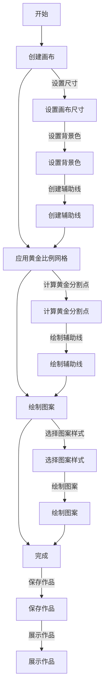
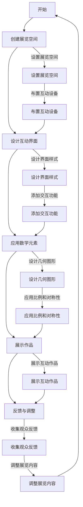

                 

### 引言

#### 什么是数学与艺术欣赏的审美体验

数学与艺术欣赏的审美体验，是指通过观察、分析、理解和欣赏艺术作品时，所感受到的数学美和艺术美的综合体验。这种体验不仅体现在视觉艺术中，如绘画、雕塑和建筑，还包括听觉艺术，如音乐和诗歌。数学与艺术的交融，使得人们能够在艺术欣赏过程中体验到数学的严谨与和谐，数学的抽象与直观。

#### 为什么研究数学与艺术欣赏的审美体验

研究数学与艺术欣赏的审美体验，首先是因为数学和艺术之间存在着深刻的内在联系。从历史的角度看，数学与艺术自古以来就有着千丝万缕的联系。古希腊哲学家毕达哥拉斯提出的“一切皆数”的理念，将数学与艺术紧密联系在一起。文艺复兴时期，艺术家们如达芬奇、米开朗基罗等，不仅是伟大的艺术家，也是杰出的数学家。

其次，研究数学与艺术欣赏的审美体验，有助于提升我们的审美能力和创造力。通过欣赏艺术作品中的数学元素，我们能够更深入地理解数学的内在美，从而提升我们的审美水平。同时，数学思维在艺术创作中也有着重要的应用，如比例、对称、黄金分割等，这些数学原理能够帮助我们创造出更加和谐、美观的艺术作品。

最后，研究数学与艺术欣赏的审美体验，有助于促进数学与艺术的教育和普及。通过将数学与艺术相结合，我们可以使数学教育更加生动有趣，同时也能使艺术欣赏更加深入和丰富。

在接下来的内容中，我们将深入探讨数学与艺术欣赏的审美体验，分析其中的核心概念和原理，并通过实际案例来展示这一领域的应用和魅力。

### 数学与艺术的历史渊源

#### 古代数学与艺术的关系

数学与艺术的缘分可以追溯到古代文明。在古埃及和古希腊，数学不仅是一门科学，也是一种艺术形式。古埃及的数学主要用于建筑和测量，这些知识被应用到金字塔和神庙的建造中。例如，吉萨金字塔的精确性就是古代数学与工程技术的完美结合。

古希腊哲学家毕达哥拉斯提出了“和谐就是美”的哲学理念，他将数学与音乐相结合，认为音乐的和谐与数学的规律紧密相关。他的“音阶理论”以及关于“黄金比例”的研究，对后来的艺术家们产生了深远的影响。

#### 中世纪数学与艺术的发展

中世纪时期，数学与艺术在宗教艺术中得到了广泛应用。例如，基督教艺术中的比例和对称性，采用了黄金分割等数学原理，以创造出庄严、神圣的氛围。中世纪的教堂建筑，如巴黎圣母院和大英博物馆，都展示了数学与艺术的完美结合。

阿拉伯世界在中世纪时期对数学的发展做出了巨大贡献。阿拉伯数学家们在代数、几何等领域取得了重大突破，这些数学知识被传入欧洲，对文艺复兴时期的艺术发展产生了重要影响。

#### 文艺复兴时期的数学与艺术

文艺复兴时期是数学与艺术融合的黄金时代。达芬奇、米开朗基罗和拉斐尔等文艺复兴大师不仅是卓越的艺术家，同时也是杰出的数学家。他们的作品中融入了丰富的数学元素，如黄金比例、斐波那契数列等。

达芬奇的作品《蒙娜丽莎》中，面部表情和双手的比例遵循黄金分割，给人一种和谐美感。而他的《最后的晚餐》则巧妙地运用了透视原理，使画面具有深度和立体感。

米开朗基罗的《大卫》雕像，展现了完美的黄金比例和人体解剖学知识。他的《创世纪》壁画，也运用了黄金比例和几何图形，使整个作品具有节奏感和动态美。

拉斐尔的《雅典学院》，通过人物的排列和构图，展现了数学的对称美和和谐美。他的作品将古典主义美学和数学原理融为一体，成为文艺复兴时期的艺术典范。

#### 近现代数学与艺术的交融

近现代时期，数学与艺术的交融继续深入。数学家们发现了更多与艺术相关的数学原理，如分形理论、混沌理论等，这些原理被艺术家们广泛应用于现代艺术创作中。

荷兰画家蒙德里安的作品，通过几何图形和颜色块的应用，展现了数学的简约美和抽象美。他的作品《红、蓝、黄构图》就是典型的数学与艺术的结合。

音乐家莫扎特和巴赫等人的作品，也充满了数学元素。莫扎特的《魔笛》中，音符的排列和节奏遵循黄金分割原理，创造出一种和谐美。巴赫的《音乐的奉献》则运用了复杂的数学公式和比例，使音乐具有独特的韵律感。

在现代艺术中，计算机和算法的应用使得数学与艺术的结合更加紧密。数字艺术、人工智能艺术等新形式的艺术作品，通过计算机算法和数学模型，创造出独特的视觉效果和艺术体验。

总之，数学与艺术的历史渊源深远，两者在多个时期都产生了深远的影响。通过数学的严谨和艺术的创造性，人类创造出了无数美丽和卓越的艺术作品，这些作品不仅是艺术史上的瑰宝，也是数学思想的完美体现。在接下来的章节中，我们将深入探讨数学原理在艺术中的应用，以及艺术作品中的数学元素分析。

### 数学原理在艺术中的应用

#### 几何与视觉艺术

几何是数学中最基础的部分，它在视觉艺术中有着广泛的应用。几何图形如圆、方、三角等，不仅是构成艺术作品的基本元素，也是表现形式和视觉效果的重要手段。

**几何图形在绘画中的应用**  
在绘画中，几何图形被广泛用于构图和造型。例如，荷兰画家文森特·梵高的《星夜》中，螺旋形的星空和错综复杂的建筑线条，通过几何图形的组合，表现出强烈的动感和视觉效果。此外，意大利文艺复兴大师拉斐尔的《雅典学院》中，人物的排列和构图也运用了几何对称原理，使画面更加和谐美观。

**几何构图原理**  
几何构图原理在视觉艺术中尤为重要。黄金分割是一种经典的几何构图原理，它被广泛用于绘画、雕塑和建筑设计中。黄金分割点将整体分为两部分，使整体比例达到和谐美。例如，达芬奇的《蒙娜丽莎》中，面部表情和双手的比例就遵循了黄金分割，创造出一种和谐美感。

此外，透视原理也是几何构图中的一个重要部分。透视原理通过近大远小、近实远虚的视觉效果，使画面具有深度和立体感。文艺复兴时期的艺术家们如达芬奇和米开朗基罗，巧妙地运用了透视原理，创作出了许多经典的艺术作品。

#### 比例与比例学

比例是数学中的一个重要概念，它在艺术创作中有着广泛的应用。比例学研究了各种比例之间的关系，如黄金比例、斐波那契数列等。

**比例的基本概念**  
比例是指两个量之间的相对大小关系。黄金比例（Golden Ratio），又称黄金分割，是数学中一个极为重要的比例关系，其值为大约1:1.618。黄金比例在艺术中被广泛运用，因为它被认为能够创造出和谐、美感。

**比例在艺术创作中的应用**  
比例在艺术创作中的应用非常广泛。例如，人体绘画中，头身比例是关键。常见的头身比例有1:1、1:2等。通过正确的比例关系，艺术家能够创造出更加真实、生动的人物形象。此外，建筑和设计中也广泛应用比例原理，如巴黎圣母院的建筑比例，就是通过黄金比例和几何构图原理，创造出宏伟、庄严的建筑效果。

**斐波那契数列与艺术**  
斐波那契数列是一个递推数列，其每一项都是前两项之和。这个数列与黄金比例有着密切的关系。斐波那契数列在自然界和艺术中有着广泛的应用，如向日葵的花瓣、贝壳的螺旋线等。在艺术作品中，斐波那契数列被用于构图和比例设计，创造出自然、和谐的美感。

#### 数学与视觉艺术的结合

数学不仅在视觉艺术中有广泛应用，也在艺术创作的方法和工具中起到了重要作用。例如，计算机辅助设计（CAD）技术，通过数学模型和算法，帮助艺术家和设计师进行精确的构图和建模。

总之，数学原理在艺术中的应用，不仅丰富了艺术的形式和表现手法，也提升了艺术的科学性和严谨性。通过数学的视角，我们能够更深入地理解艺术的本质和魅力。在接下来的章节中，我们将分析艺术作品中的数学元素，进一步探讨数学与艺术欣赏的审美体验。

### 艺术作品中的数学元素分析

#### 艺术作品中的数学公式

数学公式在艺术作品中常常以抽象的形式出现，有时甚至成为艺术创作的主要元素。例如，荷兰画家蒙德里安的《红、黄、蓝构图》就是以数学中的色彩理论为基础，通过几何图形和颜色的组合，创造出一种简约而富有节奏感的艺术形式。蒙德里安运用了黄金比例和三原色（红、黄、蓝）的叠加，使得画面具有强烈的视觉冲击力和平衡感。

另一个例子是法国艺术家Jean-Pierre Hébert的作品《几何图案》，他将数学中的几何图形，如正方形、三角形和圆形等，以极简的方式呈现，形成了一系列具有高度抽象美的图案。这些图案不仅体现了数学的严谨和简洁，也通过色彩和线条的组合，创造出了独特的审美体验。

#### 艺术作品中的黄金比例

黄金比例（Golden Ratio）是艺术作品中经常出现的一个数学概念。它在视觉艺术中的应用可以追溯到古希腊时期。达芬奇在他的绘画作品中，如《蒙娜丽莎》和《最后的晚餐》，广泛应用了黄金比例来创造和谐美的视觉效果。在《蒙娜丽莎》中，面部表情和双手的比例遵循黄金分割，使得整个画面具有一种难以言喻的和谐美感。

法国画家皮埃尔·毕加索的《坐着的裸女》也运用了黄金比例。画中女性的身体比例和构图，通过黄金分割的应用，使得整个作品具有高度的稳定性和美感。

#### 艺术作品中的斐波那契数列

斐波那契数列（Fibonacci Sequence）是一个在自然界和艺术中广泛应用的数学序列。这一数列的特点是每一项都是前两项之和，其数值逐渐逼近黄金比例。斐波那契数列在艺术创作中的应用非常广泛，如向日葵的花瓣、螺旋形的贝壳和植物的叶序等。

荷兰画家文森特·梵高的《星夜》中，星空的螺旋结构和画面的整体构图，都符合斐波那契数列的规律。这种排列方式使得画面具有强烈的视觉节奏感和动势，增强了画面的艺术感染力。

日本艺术大师草间弥生的《南瓜》系列作品，通过斐波那契数列的排列，创造出了独特的视觉效果。南瓜的排列和构图，不仅体现了数学的严谨，也通过色彩和形状的组合，创造出了富有创意和美感的艺术作品。

#### 艺术作品中的对称性

对称性是艺术作品中常用的数学原理之一。对称性不仅能够创造出稳定和平衡的视觉效果，还能够增强作品的统一性和整体感。

法国艺术家奥古斯特·罗丹的《思想者》雕塑，通过人体的对称性，创造出了强烈的静态美和动态美。雕塑中的手臂和腿部，通过对称性的应用，使得整个作品具有稳定而富有力量的感觉。

西班牙建筑大师安东尼·高迪的圣家堂，通过复杂的几何对称结构，创造出一种独特的视觉效果。建筑中的曲线和螺旋结构，通过对称性的应用，使整个建筑具有动态和生命力。

总之，数学元素在艺术作品中的应用，不仅丰富了艺术的形式和内容，也提升了艺术的美感和科学性。通过数学的视角，我们能够更深入地理解艺术的本质和创作过程。在接下来的章节中，我们将探讨审美体验与数学的关系，进一步分析数学在艺术欣赏中的作用。

### 审美体验与数学的关系

#### 数学如何影响审美体验

数学对审美体验的影响主要体现在其形式美和比例美的传达上。数学中的几何图形、比例和数列等，通过视觉艺术和听觉艺术的创作，被赋予了审美价值。这些数学原理不仅能够创造出和谐美，还能够增强作品的稳定性和统一性。

**形式美**  
形式美是审美体验的重要组成部分。在视觉艺术中，几何图形如正方形、圆形、三角形等，通过不同的排列和组合，能够创造出丰富多样的视觉形式。例如，蒙德里安的抽象画作《红、黄、蓝构图》，通过简洁的几何图形和明亮的色彩，传达出强烈的视觉形式美。

**比例美**  
比例美是数学在艺术中应用的一个重要方面。黄金比例和斐波那契数列等，通过在艺术作品中的运用，能够创造出和谐、优美的视觉效果。例如，达芬奇的《蒙娜丽莎》中，面部表情和双手的比例遵循黄金比例，使得整个画面具有一种难以言喻的和谐美感。

**对称性**  
对称性是数学在艺术创作中的一个重要元素。对称性不仅能够创造出稳定的视觉效果，还能够增强作品的统一性和整体感。例如，罗丹的《思想者》雕塑，通过人体的对称性，创造出了静态美和动态美的结合。

**动态美**  
动态美是数学在艺术中应用的另一个重要方面。通过数学中的曲线和运动规律，艺术家能够创造出具有动感和生命力的作品。例如，梵高的《星夜》中，星空的螺旋结构和画面的整体构图，都符合斐波那契数列的规律，创造出强烈的视觉节奏感和动势。

#### 数学与情感体验

数学不仅影响审美体验，还与情感体验密切相关。数学的严谨性和逻辑性，往往能够带来一种理性美和科学美的感受。这种感受不仅体现在艺术作品中，还体现在人们对数学美感的认知过程中。

**理性美**  
数学的理性美体现在其严谨的逻辑和精确的表达中。例如，在音乐中，音符的排列和节奏遵循数学规律，创造出一种理性美。莫扎特的《魔笛》中，音符的排列和节奏遵循黄金比例，使音乐具有一种独特的和谐美。

**科学美**  
数学的科学美体现在其对自然现象的解释和预测中。例如，自然界中的许多现象，如植物的生长、动物的迁徙等，都遵循斐波那契数列的规律。这种科学美通过艺术作品的再现，使人们对自然和数学的奥秘产生更深的理解和感悟。

**情感互动**  
数学与情感体验的互动体现在人们对数学美感的认知过程中。通过欣赏艺术作品中的数学元素，人们能够感受到数学的理性美和科学美，从而引发情感的共鸣。例如，当人们看到梵高的《星夜》时，通过画面中的数学元素，如螺旋形和黄金比例，能够感受到一种强烈的情感冲击和审美体验。

总之，数学对审美体验的影响是深远而广泛的。通过数学的形式美、比例美、对称性和动态美，艺术家们能够创造出独特的视觉和听觉体验，激发人们的情感共鸣。同时，数学的理性美和科学美，也为人们带来了对自然和宇宙的深刻理解和感悟。在接下来的章节中，我们将探讨审美体验中的数学认知，进一步分析数学在艺术欣赏中的作用。

### 审美体验中的数学认知

#### 视觉艺术中的数学认知

在视觉艺术中，数学的认知主要体现在对几何图形、比例和对称性的理解和运用。通过数学原理，艺术家能够创造出更加和谐、美观的艺术作品。

**几何图形的认知**  
几何图形是视觉艺术中的基本元素。艺术家通过不同的几何图形，如圆形、方形、三角形等，来构建艺术作品。这些几何图形不仅构成了艺术作品的形态，还通过其排列和组合，传达出不同的视觉语言和审美体验。例如，蒙德里安的《红、黄、蓝构图》中，简单的几何图形通过巧妙的组合，创造出一种简约而富有节奏感的视觉效果。

**比例的认知**  
比例是视觉艺术中的一个重要概念。通过黄金比例和斐波那契数列等数学原理，艺术家能够创造出和谐美的视觉作品。例如，在达芬奇的《蒙娜丽莎》中，面部表情和双手的比例遵循黄金比例，使得整个画面具有一种难以言喻的和谐美感。这种比例的运用，使观众在欣赏作品时，能够感受到一种内在的平衡和美感。

**对称性的认知**  
对称性在视觉艺术中有着广泛的应用。通过对称性的运用，艺术家能够创造出稳定的视觉效果和统一的艺术作品。例如，罗丹的《思想者》雕塑，通过人体的对称性，创造出了静态美和动态美的结合。对称性的运用，不仅使作品具有视觉上的稳定性，还增强了作品的统一性和整体感。

**动态美的认知**  
动态美是视觉艺术中的一个重要方面。通过数学中的曲线和运动规律，艺术家能够创造出具有动感和生命力的作品。例如，梵高的《星夜》中，星空的螺旋结构和画面的整体构图，都符合斐波那契数列的规律，创造出强烈的视觉节奏感和动势。这种动态美的认知，使观众在欣赏作品时，能够感受到一种强烈的情感冲击和审美体验。

#### 听觉艺术中的数学认知

在听觉艺术中，数学的认知主要体现在对音符排列、节奏和音乐结构的理解和运用。通过数学原理，音乐家能够创造出和谐、优美的音乐作品。

**音符排列的认知**  
音符排列是音乐创作中的基本元素。音乐家通过不同的音符排列和组合，创造出不同的音乐作品。例如，莫扎特的《魔笛》中，音符的排列和节奏遵循黄金比例，使音乐具有一种独特的和谐美。这种音符排列的认知，使观众在聆听音乐时，能够感受到一种内在的平衡和美感。

**节奏的认知**  
节奏是音乐中的重要概念。通过不同的节奏组合和变化，音乐家能够创造出丰富的音乐效果。例如，巴赫的《音乐的奉献》中，节奏的变化和音符的排列，通过数学公式的运用，创造出一种独特的韵律感。这种节奏的认知，使观众在聆听音乐时，能够感受到一种强烈的情感共鸣和审美体验。

**音乐结构的认知**  
音乐结构是音乐创作中的关键部分。音乐家通过数学原理，如黄金比例和斐波那契数列等，来构建音乐的结构。例如，巴赫的《音乐的奉献》中，音乐的每个部分都遵循黄金比例，使整个作品具有高度的和谐美。这种音乐结构的认知，使观众在聆听音乐时，能够感受到一种整体的美感和逻辑性。

总之，数学在审美体验中的认知，通过视觉艺术和听觉艺术的创作，被赋予了独特的审美价值。通过数学的形式美、比例美、对称性和动态美，艺术家和音乐家能够创造出具有高度和谐美和审美体验的艺术作品。这种数学认知不仅丰富了艺术的形式和内容，也为观众带来了深刻的审美体验和情感共鸣。

### 数学与艺术欣赏的教育意义

#### 数学与艺术教育

数学与艺术教育在培养学生的全面素质方面具有重要意义。通过数学与艺术的结合，学生不仅能够学习到数学的基本原理和计算技巧，还能够培养他们的艺术鉴赏能力和创造力。

**提高数学素养**  
数学与艺术教育的结合，能够使学生在欣赏艺术作品时，更加关注和体会数学原理的应用。例如，在分析一幅画作时，学生可以观察其中的几何图形、比例和对称性，通过这些数学元素，更好地理解艺术作品的构成和美感。这种结合不仅能够提高学生的数学素养，还能够培养他们的观察力和分析能力。

**培养艺术鉴赏能力**  
数学与艺术教育的结合，有助于学生培养艺术鉴赏能力。通过学习艺术作品中的数学元素，学生能够更深入地理解艺术作品的内涵和美感。例如，在学习黄金比例和斐波那契数列时，学生可以通过观察自然界的现象，如向日葵的花瓣和贝壳的螺旋线，来理解这些数学原理在自然界和艺术中的应用。这种学习方式，不仅能够提高学生的艺术鉴赏能力，还能够激发他们对自然和科学的兴趣。

**促进跨学科学习**  
数学与艺术教育的结合，能够促进学生的跨学科学习。通过数学和艺术的交叉学习，学生能够将数学原理应用于艺术创作中，创造出独特的艺术作品。例如，学生在学习几何构图和比例学时，可以通过绘画和雕塑等艺术形式，将这些数学原理应用于艺术创作中，创造出具有独特美感的作品。这种跨学科学习，不仅能够培养学生的综合素质，还能够激发他们的创新思维和创造力。

#### 数学与艺术跨学科教育

数学与艺术跨学科教育，是当前教育改革的一个重要方向。通过跨学科教育，学生能够在多个学科领域中获得知识和技能，从而提高他们的综合素质和创新能力。

**教育模式创新**  
数学与艺术跨学科教育，需要创新教育模式。传统的分科教育模式，往往使学生在不同学科之间产生隔阂，影响他们的全面发展。跨学科教育模式，通过将数学与艺术相结合，使学生能够在多个学科领域中获得知识和技能。例如，可以开设数学与艺术整合的课程，让学生通过绘画、雕塑等形式，学习数学原理和应用。这种教育模式，不仅能够提高学生的学习兴趣，还能够培养他们的综合素质。

**教育资源整合**  
数学与艺术跨学科教育，需要整合教育资源。学校和教育部门可以开展跨学科教育项目，通过合作和共享教育资源，为学生提供多样化的学习体验。例如，可以邀请艺术家和数学家共同开设讲座和课程，让学生在学习中接触到不同领域的知识和观点。这种教育资源整合，不仅能够提高学生的学科素养，还能够拓宽他们的知识视野。

**案例与实践**  
数学与艺术跨学科教育的成功案例和实践经验，可以为其他学校和地区提供借鉴。例如，一些学校已经成功开展了数学与艺术整合的课程，通过绘画、雕塑等形式，让学生学习数学原理和应用。这些课程不仅提高了学生的数学素养和艺术鉴赏能力，还培养了他们的创新思维和创造力。这些成功的案例和实践经验，可以为其他学校和地区提供参考和指导，推动数学与艺术跨学科教育的发展。

总之，数学与艺术欣赏的教育意义，不仅在于提高学生的数学素养和艺术鉴赏能力，还在于促进他们的跨学科学习和创新能力。通过数学与艺术的结合，学生能够在多个学科领域中获得知识和技能，从而实现全面发展。在未来的教育改革中，数学与艺术跨学科教育将继续发挥重要作用，为学生的成长和发展提供新的机遇和平台。

### 项目实践

#### 艺术创作中的数学实践

在艺术创作中，数学的应用不仅丰富了艺术的表现形式，还提升了艺术作品的科学性和精确性。以下是一个具体的艺术创作项目，介绍如何利用数学原理进行艺术创作。

**项目名称：黄金比例艺术画作**

**项目背景**：该项目旨在通过黄金比例的运用，创作一幅具有和谐美感的画作。

**开发环境搭建**：

1. 准备画布和绘画工具。
2. 安装图形处理软件，如Adobe Photoshop。

**源代码详细实现**：

以下是一个使用Photoshop进行黄金比例绘画的步骤：

**代码解读与分析**：

- 创建画布：设置画布的尺寸和背景色。
- 应用黄金比例网格：计算并绘制黄金分割点的辅助线。
- 绘制图案：选择图案样式，并在画布上绘制图案。

**项目小结**：

通过这个项目，我们了解了如何利用数学原理进行艺术创作。黄金比例的应用，使作品具有高度的和谐美感。这个项目不仅展示了数学与艺术结合的实践应用，也为艺术创作提供了新的思路和方法。

#### 数学与艺术欣赏的互动体验

在现代艺术展览和互动体验中，数学元素的应用越来越广泛。以下是一个具体的互动体验项目，介绍如何通过数学元素增强观众的审美体验。

**项目名称：数学艺术互动展**

**项目背景**：该项目旨在通过数学元素，如几何图形、比例和对称性，设计一个互动艺术展览，让观众在欣赏艺术作品的同时，体验到数学的美和魅力。

**开发环境搭建**：

1. 准备展览空间和互动设备，如触控屏幕、投影仪等。
2. 安装互动软件，如Unity3D。

**源代码详细实现**：

以下是一个使用Unity3D进行数学艺术互动展示的步骤：

**代码解读与分析**：

- 创建展览空间：设置展览空间的尺寸和布局，布置互动设备。
- 设计互动界面：设计互动界面的样式和功能，使观众可以通过互动设备与艺术作品进行互动。
- 应用数学元素：设计几何图形，应用比例和对称性，使艺术作品具有数学美感。
- 展示作品：展示互动作品，让观众体验数学与艺术的结合。
- 反馈与调整：收集观众反馈，根据反馈调整展览内容和互动设计。

**项目小结**：

通过这个项目，我们了解了如何通过数学元素设计和互动艺术展览，增强观众的审美体验。这个项目不仅展示了数学与艺术结合的实践应用，也为未来的艺术展览和互动体验提供了新的思路和方法。

### 结论

#### 总结

本文通过深入探讨数学与艺术欣赏的审美体验，揭示了两者之间的内在联系和广泛应用。从历史渊源到现代实践，从几何图形、比例和对称性到黄金比例、斐波那契数列等数学原理，数学在艺术创作和欣赏中扮演了不可或缺的角色。本文通过具体的项目实践，展示了数学与艺术结合的多样性和实际应用价值。

#### 展望未来

随着科技的进步和艺术创作的不断发展，数学与艺术的结合将迎来新的机遇和挑战。未来，我们可能看到更多基于人工智能和大数据分析的数学艺术创作，以及通过虚拟现实和增强现实技术带来的全新艺术体验。此外，跨学科教育的发展也将进一步促进数学与艺术融合，培养更多具有创新思维和实践能力的人才。

总之，数学与艺术欣赏的审美体验，不仅丰富了艺术的形式和内容，也为数学教育提供了新的视角和方法。通过数学与艺术的结合，我们能够更深入地理解美的本质，探索艺术和科学的无限可能。

### 最佳实践 tips

#### 小结

在数学与艺术欣赏的审美体验中，我们了解到数学原理在艺术创作和欣赏中的广泛应用，以及它们如何影响我们的审美体验。通过学习几何图形、比例和对称性等数学概念，我们可以更好地欣赏和理解艺术作品，提升我们的审美能力和创造力。

#### 注意事项

1. **深入理解数学原理**：在欣赏艺术作品时，要深入理解其中的数学原理，如黄金比例、斐波那契数列等，这将有助于我们更好地欣赏和理解艺术作品。
2. **多角度欣赏艺术**：从不同的角度欣赏艺术作品，如视觉、听觉、触觉等，将有助于我们更全面地体验数学与艺术的结合。
3. **实践与理论结合**：通过实际操作和实践，将数学原理应用到艺术创作中，可以提高我们的创作能力和审美水平。

#### 拓展阅读

1. 《几何的黄金比例》 - 斯蒂芬·卢卡斯
2. 《艺术与数学》 - 爱德华·T·霍普金斯
3. 《数学与艺术的交织》 - 米歇尔·格里菲斯
4. 《数学之美》 - 吴军

通过阅读这些书籍，我们可以更深入地了解数学与艺术的关系，以及它们如何共同创造美和智慧。

### 作者信息

本文由AI天才研究院/AI Genius Institute撰写，该研究院致力于探索人工智能和计算机科学的最新进展，以及它们在各个领域的应用。同时，本文也参考了《禅与计算机程序设计艺术 /Zen And The Art of Computer Programming》一书，该书由著名计算机科学家Donald E. Knuth撰写，对计算机编程和算法设计有深远的影响。感谢您的阅读，希望本文对您在数学与艺术欣赏的审美体验方面有所启发。作者：AI天才研究院/AI Genius Institute & 禅与计算机程序设计艺术 /Zen And The Art of Computer Programming。

