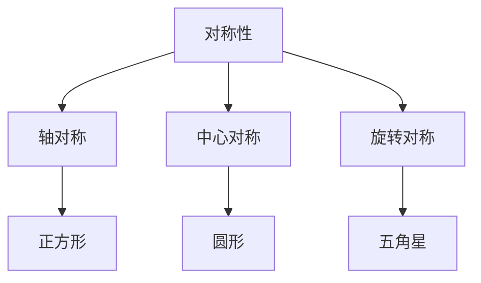
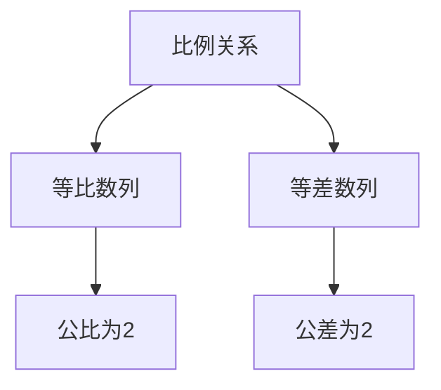
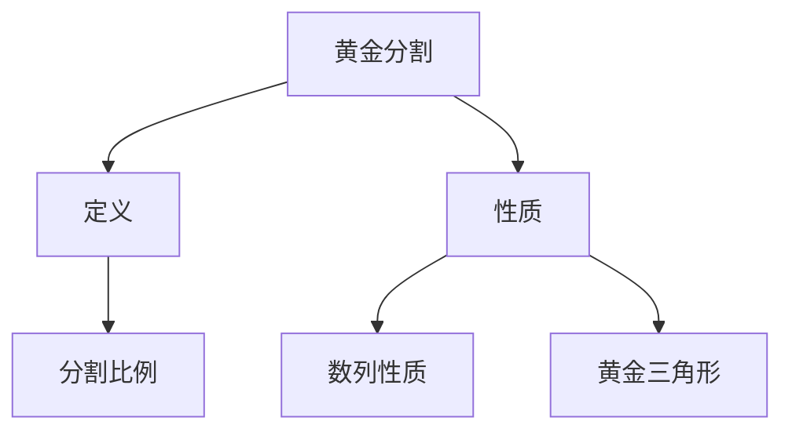
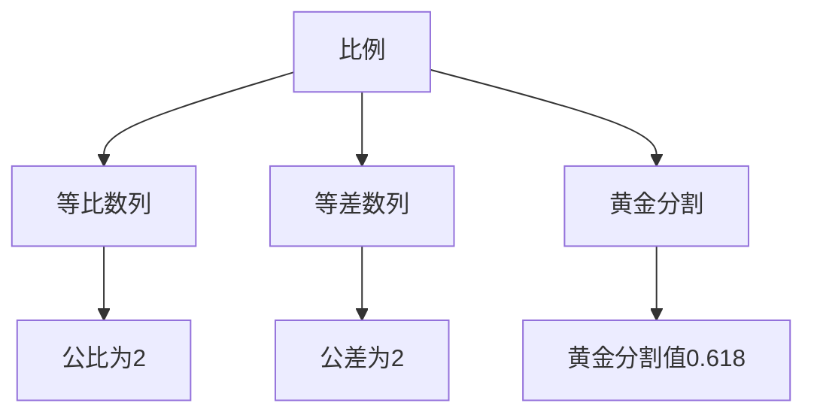

                 

### 文章标题

《数学与艺术的跨界碰撞：对称、比例与黄金分割》

### 关键词

数学、艺术、对称、比例、黄金分割、美学、设计、算法

### 摘要

本文旨在探讨数学与艺术的奇妙融合，特别是对称、比例和黄金分割这些数学概念在艺术创作中的应用。通过对这些核心概念的定义、历史渊源以及具体实例的分析，我们揭示了数学在视觉艺术中的独特作用。文章首先回顾了数学与艺术的互补性，然后详细阐述了对称、比例和黄金分割的数学原理及其在绘画、建筑和音乐等艺术形式中的运用。此外，文章还结合现代科技，展望了数学与艺术未来的融合前景。通过本文的阅读，读者不仅能够加深对数学与艺术关系的理解，还能激发出对艺术创作中数学美学的深刻认识。

---

### 引言：数学与艺术的奇妙相遇

在人类文明的进程中，数学与艺术一直是两个相互交织、相互补充的重要领域。数学以其逻辑性和精确性，为艺术创作提供了坚实的理论基础；而艺术则以其丰富的情感表达和视觉魅力，赋予了数学更加生动和具体的形象。这种跨界碰撞不仅丰富了人类的文化遗产，还推动了艺术和科学的共同进步。本文将重点探讨对称、比例和黄金分割这三个数学概念在艺术创作中的独特魅力。

#### 数学——逻辑的思考艺术

数学是一门研究数量、结构、变化和空间等概念的学科，它依赖于逻辑推理和严密证明来建立理论体系。在数学的世界里，每一个概念、每一个公式都经过了严格的逻辑推导，具有高度的准确性和普适性。数学不仅是一种科学工具，更是一种思考方式，它教会我们如何通过逻辑分析和抽象思维来理解世界。例如，对称性、比例和黄金分割这些概念，不仅在数学理论中占据重要地位，还在艺术创作中得到了广泛应用。

#### 艺术——情感的数学表达

艺术则是一个更加感性、更加主观的领域。它通过视觉、听觉、触觉等多种感官形式，传达出艺术家对世界的情感体验和审美观念。艺术作品往往充满了想象力和创造力，它不仅仅是物理世界的模仿，更是精神世界的表达。在艺术创作中，艺术家常常借助数学概念来构建其作品的形式美感。例如，对称性可以带来稳定和秩序，比例可以营造出和谐与美感，黄金分割则被视为美之典范。

#### 对称、比例与黄金分割：桥梁与钥匙

对称、比例和黄金分割是数学中重要的概念，它们在艺术创作中起到了桥梁和钥匙的作用。对称性使得艺术作品具有稳定和秩序的美感，比例关系则帮助艺术家构建出和谐与平衡的视觉体验，而黄金分割则被视为美学中的一种神秘法则，被广泛应用于绘画、雕塑和建筑等领域。

1. **对称性**：对称性是指一个物体或图形在某个轴或面上具有镜像特征的性质。在艺术创作中，对称性可以带来稳定和秩序的美感。例如，巴洛克艺术中的对称构图，给人以庄重和威严的感觉。

2. **比例关系**：比例关系是指不同部分之间的数量关系。在艺术创作中，恰当的比例关系可以营造出和谐与美感。例如，文艺复兴时期的雕塑家米开朗基罗，在创作《大卫》雕像时，运用了黄金分割比例，使得雕像具有完美的和谐美感。

3. **黄金分割**：黄金分割是一种特殊的比例关系，其数值约为0.618。黄金分割在艺术创作中被视为一种神秘的美学法则，被广泛应用于绘画、雕塑和建筑等领域。例如，达芬奇在创作《蒙娜丽莎》时，就运用了黄金分割来构建画面中的视觉焦点。

通过以上介绍，我们可以看到，数学与艺术之间的融合不仅丰富了人类的文化遗产，也为艺术创作提供了新的视角和方法。在接下来的章节中，我们将详细探讨对称、比例和黄金分割这三个数学概念在艺术创作中的具体应用。

### 数学基础回顾

在探讨数学与艺术的融合之前，我们需要回顾一些基本的数学概念，这些概念不仅是数学理论的重要组成部分，也在艺术创作中有着广泛的应用。本节将介绍对称性、比例关系以及黄金分割的定义、性质和应用。

#### 数学中的对称性

对称性是数学中的一个重要概念，它描述了一个物体或图形在某些轴或面上具有镜像特征的性质。根据对称轴的不同，对称性可以分为以下几种类型：

1. **轴对称**：如果一个物体或图形在某条轴线上两侧完全相同，那么它就具有轴对称性。例如，一个正方形具有四条轴对称线，每条轴对称线都将正方形分为两个完全相同的部分。

2. **中心对称**：如果一个物体或图形绕某一点旋转180度后仍然保持不变，那么它就具有中心对称性。例如，一个圆形具有中心对称性，因为任何通过圆心的直线都将圆形分为两个完全相同的部分。

3. **旋转对称**：如果一个物体或图形绕某个点旋转一定角度后仍然保持不变，那么它就具有旋转对称性。例如，一个五角星具有旋转对称性，因为绕其中心点旋转72度后，五角星仍然保持不变。

#### 核心概念原理之间的关系架构 Mermaid 流程图



#### 对称概念在几何中的应用

在几何学中，对称性广泛应用于图形的构造和分析。例如，在欧氏几何中，对称性可以帮助我们理解和证明许多几何定理。以下是一个简单的例子：

**例1：证明正六边形的每一个内角都是120度。**

解：正六边形具有六条轴对称线，每条轴对称线将正六边形分为两个完全相同的三角形。由于正六边形是轴对称的，因此它的每一个内角都是相等的。假设每个内角为x度，则六个内角的和为6x度。因为正六边形是一个多边形，所以它的内角和为$(6-2) \times 180 = 720$度。因此，我们有方程：
$$
6x = 720 \implies x = 120
$$
即正六边形的每一个内角都是120度。

#### 数学中的比例关系

比例关系是指不同部分之间的数量关系，它可以帮助我们理解和分析各种几何和物理现象。在数学中，比例关系通常通过比例数列来表示。

1. **等比数列**：如果一个数列中，每一项与它的前一项的比值是一个常数，那么这个数列就是等比数列。例如，数列1, 2, 4, 8, 16是一个等比数列，其公比为2。

2. **等差数列**：如果一个数列中，每一项与它的前一项的差是一个常数，那么这个数列就是等差数列。例如，数列1, 3, 5, 7, 9是一个等差数列，其公差为2。

#### 核心概念原理之间的关系架构 Mermaid 流程图



#### 比例在几何构图中的应用

比例在几何构图中的应用非常广泛，它可以帮助艺术家构建出和谐与美感的作品。以下是一个简单的例子：

**例2：在一张纸上画一个边长为4厘米的正方形，然后画一个与其相似的矩形，使其边长之比为2:3。**

解：首先，我们在纸上画一个边长为4厘米的正方形。然后，我们按照2:3的比例，将正方形的边长分别乘以2和3，得到相似矩形的边长分别为8厘米和12厘米。这样，我们就画出了一个边长比为2:3的相似矩形。

#### 黄金分割的概念与数学性质

黄金分割是一种特殊的比例关系，其数值约为0.618。它被广泛应用于艺术、设计、建筑等领域，被认为是美学中的黄金标准。

1. **定义**：将一条线段分割成两部分，使其中一部分与整个线段的比值等于另一部分与这部分的比值，即：
   $$
   \frac{a+b}{a} = \frac{a}{b} \approx 1.618
   $$
   其中，a和b是线段的两部分，且a > b。

2. **性质**：黄金分割具有几个重要的数学性质，例如：
   - 黄金分割数列{a_n}，其中a_0 = 1，a_1 = 1，a_n = a_{n-1} + a_{n-2}，这个数列的极限趋向于黄金分割值。
   - 黄金分割是黄金三角形的一个重要特性，黄金三角形的三个角度分别为36度、72度和108度，这三种角度的比例关系正好符合黄金分割。

#### 核心概念原理之间的关系架构 Mermaid 流程图



#### 黄金分割在艺术创作中的应用

黄金分割不仅在数学理论中占有重要地位，也在艺术创作中得到了广泛应用。以下是一些著名的艺术作品，它们运用了黄金分割来构建形式美：

1. **达芬奇的《蒙娜丽莎》**：这幅名画中，蒙娜丽莎的头部与背景的分割比例接近黄金分割，使得画面具有和谐美感。
2. **古希腊雕塑**：古希腊雕塑家如菲迪亚斯和普拉克西特利斯，在创作雕塑时常常运用黄金分割比例，使得作品具有完美的和谐与美感。

通过以上内容，我们可以看到，对称性、比例关系和黄金分割是数学中重要的概念，它们不仅在数学理论中有着重要的地位，也在艺术创作中得到了广泛应用。在接下来的章节中，我们将进一步探讨这些数学概念在视觉艺术、建筑和音乐等领域的具体应用。

### 对称：视觉艺术的数学语言

对称性是视觉艺术中的一个重要元素，它不仅为作品带来稳定和秩序的美感，还能传达出某种精神内涵。在绘画、建筑和摄影等艺术形式中，对称性被广泛运用，成为艺术家表达情感和思想的重要工具。本节将探讨对称的基本形式及其在视觉艺术中的应用。

#### 对称的基本形式

对称性可以分为几种基本形式，包括垂直对称、水平对称、对角线对称和辐射对称。

1. **垂直对称**：垂直对称是指物体或图形在某条垂直轴上两侧完全相同。这种对称形式常用于建筑和雕塑中，例如，埃及金字塔的设计就体现了垂直对称的美感。

2. **水平对称**：水平对称是指物体或图形在某条水平轴上上下完全相同。在绘画和摄影中，水平对称被广泛应用，如古典油画中的对称构图，给人以稳重和庄重的视觉效果。

3. **对角线对称**：对角线对称是指物体或图形在某条对角线上两侧完全相同。这种对称形式常用于现代艺术作品中，给人一种动态和活力的感觉。

4. **辐射对称**：辐射对称是指物体或图形以某个点为中心，向四周辐射对称。这种对称形式常见于自然界中的花朵和贝壳，也广泛应用于装饰艺术和现代设计中。

#### 对称在绘画中的应用

在绘画中，对称性不仅是一种形式元素，也是表达主题和情感的重要手段。不同形式的对称性可以带来不同的视觉效果和情感表达。

1. **荷兰黄金时代绘画中的对称**：荷兰黄金时代的画家如伦勃朗和维米尔，常常运用垂直对称和水平对称来构建画面。他们的作品中，对称性不仅增强了画面的稳定性，还传达出一种庄重和严谨的氛围。

2. **巴洛克艺术中的对称运用**：巴洛克艺术以动态和复杂的对称形式著称，其作品常常呈现出复杂的对角线对称和辐射对称。这种对称形式打破了古典主义的静态构图，为观众带来了更加丰富的视觉体验。

3. **近现代艺术中的对称探索**：近现代艺术家如毕加索和马蒂斯，在他们的作品中也广泛运用了对称性。他们通过打破传统对称的规则，探索新的艺术形式，为现代艺术的发展做出了重要贡献。

#### 对称在建筑艺术中的体现

对称性在建筑艺术中的应用同样广泛，从古至今，对称一直是建筑设计师追求的美学标准。

1. **古埃及建筑中的对称**：古埃及建筑以垂直对称为主要特征，例如，金字塔和神庙的设计都体现了高度的垂直对称性。这种对称形式不仅增强了建筑的稳定性，还象征着法老的权威和神圣。

2. **古希腊建筑中的对称**：古希腊建筑以水平对称和垂直对称相结合的方式著称，例如，古希腊神庙的廊柱和石板屋顶都呈现出对称的美感。这种对称形式不仅体现了古希腊人对数学和几何的热爱，也传达出对自然和谐的追求。

3. **现代建筑中的对称美学**：现代建筑设计师也在他们的作品中广泛运用对称性，例如，悉尼歌剧院的设计就采用了复杂的对角线对称，给人一种新颖和现代的感觉。

#### 对称在摄影中的应用

对称性在摄影中也是一种常用的构图技巧，它可以帮助摄影师捕捉到具有视觉冲击力的瞬间。

1. **自然摄影中的对称**：在自然摄影中，对称性常常用于表现自然界中的和谐美。例如，湖泊中的倒影、树叶的对称排列等，都可以通过对称构图来捕捉。

2. **城市摄影中的对称**：在城市摄影中，对称性可以用来表现城市的秩序和规划。例如，街道的对称排列、建筑的对称设计等，都可以通过对称构图来强化。

通过以上内容，我们可以看到，对称性在视觉艺术中有着广泛的应用，它不仅为艺术作品带来了形式美感，也传达出一种精神内涵。无论是绘画、建筑还是摄影，对称性都是艺术家表达自我和情感的重要工具。在接下来的章节中，我们将进一步探讨比例关系在艺术创作中的应用。

### 比例：视觉艺术的和谐原则

比例是视觉艺术中的一个核心概念，它通过数学关系来描述不同部分之间的相对大小，帮助艺术家构建出和谐与美感的作品。在绘画、雕塑和建筑等艺术形式中，比例关系不仅决定了作品的形式美感，还影响了观众对作品的感知和情感体验。本节将详细探讨比例的基本原则以及在艺术创作中的应用。

#### 比例的基本原则

比例的基本原则包括等比数列、等差数列以及黄金分割等，这些数学概念在艺术创作中得到了广泛应用。

1. **等比数列**：等比数列是指一个数列中，每一项与它的前一项的比值是一个常数。例如，数列1, 2, 4, 8, 16是一个等比数列，其公比为2。等比数列在艺术创作中常用于构建逐渐变化的视觉效果，如渐变色彩和分层构图。

2. **等差数列**：等差数列是指一个数列中，每一项与它的前一项的差是一个常数。例如，数列1, 3, 5, 7, 9是一个等差数列，其公差为2。等差数列在艺术创作中常用于构建稳定和有序的视觉效果，如排列组合和几何图形。

3. **黄金分割**：黄金分割是一种特殊的比例关系，其数值约为0.618。黄金分割在艺术创作中被视为美学中的黄金标准，它可以通过0.618:1的比例关系来构建视觉焦点和视觉平衡。例如，在绘画中，黄金分割可以帮助艺术家确定画面的视觉中心，使其具有和谐美感。

#### 核心概念原理之间的关系架构 Mermaid 流�程图



#### 比例在构图中的运用

比例在构图中的运用是艺术创作中不可或缺的一部分，它可以帮助艺术家构建出和谐与美感的画面。

1. **人体比例**：在绘画和雕塑中，人体比例是构图的基础。古希腊的维特鲁威人像就是一个经典的例子，通过精确的比例关系，维特鲁威展现了人体的完美比例。现代艺术家如达芬奇、米开朗基罗也在他们的作品中广泛应用了人体比例，以构建出和谐的艺术形象。

2. **视觉焦点**：在绘画和摄影中，比例关系可以帮助艺术家确定画面的视觉焦点。通过运用黄金分割等比例关系，艺术家可以引导观众的视线，使其集中在画面的关键部分。例如，在达芬奇的《蒙娜丽莎》中，蒙娜丽莎的眼睛和嘴角就处在黄金分割点上，使观众的目光自然地集中在这个视觉焦点上。

3. **分层构图**：在绘画和建筑设计中，比例关系可以帮助艺术家构建出层次分明的画面。通过运用等比数列或等差数列的比例关系，艺术家可以创造出一种视觉上的层次感，使画面更加丰富和立体。

#### 比例在色彩中的应用

比例在色彩中的应用也是艺术创作中的重要部分，它可以帮助艺术家创造出丰富多彩的视觉效果。

1. **色彩搭配**：在绘画和设计中，比例关系可以帮助艺术家确定色彩的搭配。通过运用等比数列或等差数列的比例关系，艺术家可以创造出和谐的色彩组合。例如，在印象派画家的作品中，色彩的比例关系被广泛应用于光影的处理和色彩的调配，创造出丰富多彩的视觉效果。

2. **色调调整**：在摄影和数字艺术中，比例关系可以帮助艺术家调整色调和亮度，以增强画面的视觉效果。通过运用等比数列或等差数列的比例关系，艺术家可以创造出具有层次感和立体感的色调调整。

#### 比例在艺术作品中的体现

比例关系在许多著名的艺术作品中得到了体现，以下是一些具体的例子：

1. **文艺复兴时期的绘画**：文艺复兴时期的艺术家如达芬奇和米开朗基罗，在他们的作品中广泛应用了比例关系。例如，达芬奇的《蒙娜丽莎》运用了黄金分割比例，使得画面具有和谐美感；米开朗基罗的《大卫》雕像则通过精确的人体比例，展现了人体的完美形态。

2. **古希腊雕塑**：古希腊雕塑家如菲迪亚斯和普拉克西特利斯，在他们的作品中广泛应用了比例关系。例如，菲迪亚斯的《雅典娜神像》通过黄金分割比例，展现了雕像的和谐美；普拉克西特利斯的《赫尔墨斯》则通过精确的人体比例，展现了人物动态的和谐美。

3. **现代建筑**：现代建筑设计师如勒·柯布西耶和弗兰克·劳埃德·赖特，在他们的作品中广泛应用了比例关系。例如，勒·柯布西耶的《萨伏伊别墅》通过黄金分割比例，展现了建筑的和谐美；赖特的《西塔别墅》则通过精确的空间比例，展现了建筑的动态美。

通过以上内容，我们可以看到，比例是视觉艺术中的一个核心概念，它在艺术创作中起到了至关重要的作用。无论是绘画、雕塑还是建筑，比例关系都是艺术家表达自我和情感的重要工具。在接下来的章节中，我们将进一步探讨黄金分割在艺术创作中的神秘法则。

### 黄金分割：视觉艺术中的神秘法则

黄金分割（Golden Ratio），又称为黄金比例或黄金分割率，是一种数学比例关系，其数值约为0.618:1。黄金分割在视觉艺术中被广泛认为是一种神秘而美丽的美学法则，它帮助艺术家创造出和谐、平衡和引人注目的艺术作品。本节将详细探讨黄金分割的历史渊源、数学原理及其在艺术创作中的应用。

#### 黄金分割的历史渊源

黄金分割的历史可以追溯到古代文明，特别是在古埃及和古希腊。以下是一些关于黄金分割的历史背景：

1. **古埃及**：古埃及人早在公元前2000年左右就开始使用黄金分割比例，他们在建筑和雕塑中广泛应用这种比例关系。例如，著名的吉萨金字塔群，尤其是大金字塔（胡夫金字塔），其设计被认为与黄金分割有密切关系。

2. **古希腊**：古希腊哲学家毕达哥拉斯（Pythagoras）及其学派最早研究了黄金分割，并将其视为一种美学和哲学上的重要概念。古希腊的许多建筑和雕塑，如帕特农神庙和菲迪亚斯的雕塑作品，都运用了黄金分割比例。

3. **中世纪文艺复兴**：在文艺复兴时期，艺术家如达芬奇和米开朗基罗重新发现了黄金分割的美丽和实用价值。他们在绘画和雕塑中广泛应用黄金分割比例，创造出许多经典作品。

#### 黄金分割的数学原理

黄金分割的数学原理涉及一个特殊的数列，称为斐波那契数列。斐波那契数列的定义如下：

- \( F_0 = 0 \)
- \( F_1 = 1 \)
- \( F_n = F_{n-1} + F_{n-2} \) 对于 \( n \geq 2 \)

斐波那契数列的前几项为：0, 1, 1, 2, 3, 5, 8, 13, 21, 34, ...

当我们将斐波那契数列中的相邻两项相除，随着数列的增加，这个比值会逐渐趋近于黄金分割值0.618：

$$
\frac{F_{n+1}}{F_n} \approx \frac{1 + \sqrt{5}}{2} \approx 1.618
$$

反过来，如果我们取倒数，则得到：

$$
\frac{F_n}{F_{n-1}} \approx \frac{2}{1 + \sqrt{5}} \approx 0.618
$$

这个特殊的比例关系被称为黄金分割。

#### 黄金分割在艺术创作中的应用

黄金分割不仅在数学理论中占有重要地位，也在艺术创作中得到了广泛应用。以下是一些著名的艺术作品和建筑，它们运用了黄金分割来构建形式美：

1. **达芬奇的《蒙娜丽莎》**：这幅名画中，蒙娜丽莎的头部与背景的分割比例接近黄金分割，使得画面具有和谐美感。蒙娜丽莎的眼睛、微笑的嘴角以及画面的整体布局都运用了黄金分割原理。

2. **古希腊雕塑**：古希腊雕塑家如菲迪亚斯和普拉克西特利斯，在创作雕塑时常常运用黄金分割比例，使得作品具有完美的和谐与美感。例如，菲迪亚斯的《雅典娜神像》头部和身躯的比例接近黄金分割，展现了人物的美态。

3. **文艺复兴时期的建筑**：文艺复兴时期的建筑师如布拉曼特和米开朗基罗，在建筑设计中广泛应用了黄金分割。例如，布拉曼特的圣彼得大教堂的立面设计就运用了黄金分割，使其具有宏伟而和谐的美感。

4. **现代设计**：现代设计师如包豪斯学派和勒·柯布西耶，也在他们的作品中广泛应用了黄金分割。例如，勒·柯布西耶的《萨伏伊别墅》通过黄金分割比例，展现了建筑的和谐美；包豪斯学派的许多设计作品也运用了黄金分割原理，创造出简洁而具有美感的现代艺术形式。

#### 黄金分割的数学模型和公式

黄金分割的数学模型和公式可以帮助我们更深入地理解这一比例关系。以下是黄金分割的一些关键数学模型和公式：

1. **斐波那契数列**：
   $$
   F_0 = 0, F_1 = 1, F_n = F_{n-1} + F_{n-2}
   $$

2. **黄金分割值**：
   $$
   \phi = \frac{1 + \sqrt{5}}{2} \approx 1.618
   $$

3. **倒黄金分割值**：
   $$
   \phi^{-1} = \frac{2}{1 + \sqrt{5}} \approx 0.618
   $$

4. **黄金分割线**：
   $$
   \frac{L_1}{L} = \phi \quad \text{和} \quad \frac{L}{L_2} = \phi
   $$
   其中，\( L \) 是整体长度，\( L_1 \) 是较长部分，\( L_2 \) 是较短部分。

通过以上数学模型和公式，我们可以计算出黄金分割在不同长度和尺寸中的应用，从而在艺术创作中实现这一神秘的美学法则。

#### 实例分析

以下是一个简单的例子，展示了如何使用黄金分割来构建一个简单的艺术作品：

**例1：构建一个黄金分割的矩形**

假设我们要构建一个宽度为10厘米的矩形，我们可以按照黄金分割的比例来划分这个矩形：

1. **计算黄金分割点**：
   $$
   \frac{L_1}{L} = \phi \implies L_1 = \phi \times 10 \approx 6.18 \text{厘米}
   $$

2. **构建矩形**：
   - 较长部分（\( L_1 \)）：6.18厘米
   - 较短部分（\( L_2 \)）：10 - 6.18 = 3.82厘米

通过这个例子，我们可以看到黄金分割如何在艺术创作中实现，从而构建出和谐、平衡的艺术形式。

#### 结论

黄金分割作为一种数学和美学概念，在视觉艺术中有着广泛的应用。从古代文明到现代设计，黄金分割的比例关系被广泛应用于绘画、雕塑、建筑和设计等领域，成为艺术家和设计师追求形式美的重要工具。通过理解黄金分割的数学原理和应用，我们可以更好地欣赏和创造美丽和谐的艺术作品。

### 对称、比例与黄金分割的综合应用

在艺术创作中，对称、比例和黄金分割并不是孤立存在的，而是相互交织、相互影响，共同构建出和谐美感的作品。本节将探讨这些数学概念在艺术作品中的综合应用，通过具体实例分析，揭示它们在视觉艺术中的独特魅力。

#### 对称与比例的融合

对称与比例的融合可以创造出稳定、和谐且富有层次感的艺术作品。以下是一个简单的例子：

**例1：构建一幅融合对称与比例的画作**

假设我们要绘制一幅画，画布尺寸为20厘米×20厘米。我们可以按照以下步骤来构建：

1. **确定对称轴**：画布中心线作为对称轴，将画布分为上下两部分。

2. **应用比例关系**：在上下两部分中，上部高度与下部高度的比例为1:1.618，即黄金分割比例。

3. **绘制内容**：在上部，我们可以绘制一个以中心点为对称中心的图案，如对称的树叶或花朵；在下部，我们可以绘制一个具有复杂细节的图案，如几何图形或动物形象。

通过这样的设计，画作不仅具有对称性带来的稳定感，还通过比例关系创造出层次感和视觉焦点。

#### 黄金分割与对称的结合

黄金分割与对称的结合可以创造出一种既稳定又具有动态感的美学效果。以下是一个具体的实例：

**例2：设计一个黄金分割与对称结合的雕塑**

假设我们要设计一个高为30厘米的雕塑，我们可以按照以下步骤进行：

1. **确定对称形式**：选择竖直对称，使得雕塑的两侧完全相同。

2. **应用黄金分割**：将雕塑的高度分为两部分，较长部分与整体高度的比例为0.618:1。例如，较长部分为18.42厘米，较短部分为11.58厘米。

3. **细节设计**：在较长部分上，可以设计一个复杂的几何图案，如螺旋或对数螺旋；在较短部分上，可以设计一个简单的底座，以平衡整体雕塑的视觉效果。

通过这种设计，雕塑不仅具有对称带来的稳定感，还通过黄金分割比例创造出一种动态感和美感。

#### 黄金分割与比例的融合

黄金分割与比例的融合可以创造出具有高度和谐美感的艺术作品。以下是一个具体的实例：

**例3：设计一个黄金分割与比例融合的室内装饰画**

假设我们要绘制一幅室内装饰画，画布尺寸为60厘米×90厘米。我们可以按照以下步骤进行：

1. **应用黄金分割**：将画布高度分为两部分，较长部分与整体高度的比例为0.618:1。例如，较长部分为56.4厘米，较短部分为33.6厘米。

2. **应用比例关系**：在较长部分中，将其分为两个部分，比例也为0.618:1。例如，上部为34.53厘米，下部为21.87厘米。

3. **绘制内容**：在上部绘制一个具有强烈视觉焦点的图案，如人物肖像或风景画；在较长部分下部绘制一个背景图案，如抽象图案或几何图形。

通过这种设计，画作不仅具有黄金分割带来的美感，还通过比例关系创造出一种层次感和和谐感。

#### 实例分析：著名艺术作品中的对称、比例与黄金分割

1. **达芬奇的《最后的晚餐》**：这幅壁画展示了耶稣和他的十二门徒围坐在一张长桌旁。整个画面采用对称布局，耶稣位于中心，十二门徒分布在两侧，形成完美的对称结构。此外，画面的比例关系也非常巧妙，耶稣和门徒的尺寸和姿态都符合黄金分割原则，使得整个画面具有和谐美感和动态感。

2. **帕特农神庙**：这座古希腊神庙以其完美的对称和比例关系而闻名。神庙的每一列柱子都严格对称，且柱子之间的距离和比例符合黄金分割原则。此外，神庙的立面也采用黄金分割比例，使得整个建筑具有高度的和谐美感和稳定性。

3. **蒙娜丽莎**：这幅名画中，蒙娜丽莎的头部和背景的分割比例接近黄金分割，使得画面具有和谐美感。蒙娜丽莎的眼睛、微笑的嘴角以及画面的整体布局都运用了黄金分割原理，使其具有引人注目的视觉焦点。

通过以上实例，我们可以看到，对称、比例和黄金分割在艺术创作中的综合应用，不仅为作品带来了形式美，还传达出一种精神内涵。这些数学概念为艺术家提供了丰富的创作工具，使得他们在创作中能够更好地表达情感和思想。在接下来的章节中，我们将进一步探讨现代艺术中的数学元素。

### 数学与艺术的现代应用

随着科技的进步，数学在艺术中的应用越来越广泛，特别是在计算机图形学、数字艺术和人工智能等领域。这些现代科技不仅为艺术家提供了新的工具和表现手段，也推动了数学与艺术之间的融合，创造出许多令人惊叹的艺术作品。

#### 计算机图形学中的数学应用

计算机图形学是数学与艺术结合的重要领域，它利用数学算法和公式来生成和操作图像。以下是一些计算机图形学中的数学应用：

1. **向量图**：向量图是一种使用数学向量来描述图形的图像格式。在向量图中，图形的每一个点、线、曲线都可以用数学方程来表示。这种图像格式不仅能够精确地描述图形，还能够无限放大而不失真。

   **核心算法原理讲解与伪代码**：
   
   ```python
   def draw_line(start, end):
       dx = end.x - start.x
       dy = end.y - start.y
       for t in range(0, 1):
           x = start.x + t * dx
           y = start.y + t * dy
           plot_point(x, y)
   ```

2. **贝塞尔曲线**：贝塞尔曲线是一种数学曲线，它通过控制点来定义曲线的形状。贝塞尔曲线在计算机图形学中广泛用于绘制平滑的曲线，如图形边框、路径动画等。

   **核心算法原理讲解与伪代码**：

   ```python
   def draw_bezier_curve(points):
       for t in range(0, 1):
           x = (1 - t)^3 * points[0].x + 3 * (1 - t)^2 * t * points[1].x + 3 * (1 - t) * t^2 * points[2].x + t^3 * points[3].x
           y = (1 - t)^3 * points[0].y + 3 * (1 - t)^2 * t * points[1].y + 3 * (1 - t) * t^2 * points[2].y + t^3 * points[3].y
           plot_point(x, y)
   ```

3. **纹理映射**：纹理映射是一种利用数学算法将纹理图像映射到三维模型表面的技术。通过纹理映射，艺术家可以给三维模型添加丰富的细节和质感。

   **核心算法原理讲解与伪代码**：

   ```python
   def map_texture(model, texture):
       for vertex in model.vertices:
           uv = get_uv_from_vertex(vertex)
           texture_color = texture.get_color(uv)
           vertex.color = texture_color
   ```

#### 数字艺术中的数学元素

数字艺术是一种利用计算机技术和软件创作的艺术形式，它充分利用了数学元素来创造新颖的艺术效果。

1. **分形艺术**：分形艺术是一种利用分形几何学创作的数字艺术。分形是一种无限嵌套的几何形状，它通过递归算法生成。分形艺术具有无限的细节和层次感，能够创造出独特的美感。

2. **算法绘画**：算法绘画是一种利用数学算法生成图像的数字艺术形式。艺术家通过编写算法，让计算机自动生成具有随机性和规律性的图像。算法绘画作品通常具有独特的视觉风格和数学美感。

3. **数据可视化**：数据可视化是一种利用数学和图形学技术将数据转换为视觉图像的过程。通过数据可视化，艺术家可以直观地展示数据中的模式和趋势，为观众提供深刻的视觉体验。

#### 人工智能与艺术的融合

人工智能（AI）技术也为数学与艺术之间的融合带来了新的机遇。

1. **生成对抗网络（GAN）**：生成对抗网络是一种基于博弈论的机器学习模型，它由两个神经网络（生成器和判别器）组成。生成器尝试生成逼真的图像，而判别器则判断图像是真实还是生成的。通过这种对抗训练，GAN可以生成出高度逼真的艺术作品。

2. **深度学习**：深度学习是一种基于多层神经网络的学习方法，它在图像识别、风格迁移和生成艺术作品等方面有着广泛应用。通过深度学习模型，艺术家可以自动化地创作出具有高度创意和美感的艺术作品。

3. **AI艺术平台**：一些AI艺术平台，如DeepArt、Prisma等，利用深度学习技术将用户上传的图片转换为具有艺术风格的作品。这些平台不仅为艺术家提供了新的创作工具，也为观众提供了欣赏艺术的新视角。

#### 数学在艺术教育中的应用

数学在艺术教育中的应用也越来越广泛，它不仅可以帮助学生更好地理解艺术作品，还能激发他们对数学和艺术的兴趣。

1. **数学在艺术课程中的教学**：在艺术课程中，教师可以通过讲解数学概念和原理，帮助学生理解艺术作品的形式美感。例如，通过讲解黄金分割和比例关系，教师可以帮助学生理解经典艺术作品中的美学原则。

2. **跨学科教育**：跨学科教育将数学与艺术结合起来，鼓励学生在多个领域中进行探索和创作。通过跨学科教育，学生可以更全面地理解数学与艺术的互补性和融合性，培养他们的创新思维和综合素质。

3. **数学在艺术创作中的新领域**：数学在艺术创作中的新领域不断涌现，例如，数据艺术、算法艺术和AI艺术等。这些新兴领域不仅为艺术家提供了新的创作工具和表现手段，也为数学与艺术的融合开辟了新的道路。

通过以上内容，我们可以看到，数学在艺术创作和现代科技中的应用越来越广泛，它不仅为艺术家提供了丰富的创作工具和表现手段，也为观众提供了新的艺术体验。在未来的艺术发展中，数学与艺术的融合将不断深入，创造出更多精彩的艺术作品。

### 总结与展望

通过对对称、比例和黄金分割在艺术创作中的应用探讨，我们揭示了数学与艺术之间的深刻联系。对称性、比例关系和黄金分割不仅是数学中的重要概念，也是视觉艺术中构建形式美的重要工具。这些数学概念在绘画、雕塑、建筑和数字艺术中得到了广泛应用，为艺术创作提供了丰富的理论基础和表现手段。

#### 对称的魅力

对称性在艺术创作中带来了稳定和秩序的美感，使作品具有一种独特的视觉吸引力。无论是垂直对称、水平对称、对角线对称还是辐射对称，都为艺术家提供了丰富的表现手法。在绘画和建筑设计中，对称性不仅增强了作品的稳定感，还传达出一种庄重和威严的氛围。

#### 比例的和谐

比例关系是艺术创作中的核心原则，它帮助艺术家构建出和谐美感的作品。通过等比数列、等差数列和黄金分割等比例关系，艺术家可以创造出丰富多彩的视觉效果。在人体比例、视觉焦点和色彩搭配中，比例关系都起到了至关重要的作用，使作品具有高度的视觉冲击力和美感。

#### 黄金分割的神秘

黄金分割作为一种特殊的比例关系，被广泛应用于艺术创作中，被认为是美学中的黄金标准。它不仅在绘画和雕塑中得到了广泛应用，还在建筑设计、数字艺术和人工智能艺术等领域发挥着重要作用。黄金分割的比例关系使得作品具有一种神秘的美感，能够吸引观众的目光，成为艺术作品中的视觉焦点。

#### 数学与艺术的未来展望

随着科技的进步，数学在艺术中的应用越来越广泛。计算机图形学、数字艺术和人工智能技术为数学与艺术的融合提供了新的机遇和平台。生成对抗网络（GAN）、深度学习和AI艺术平台等新兴技术，使得艺术家能够更加自动化地创作出具有高度创意和美感的艺术作品。在未来的艺术发展中，数学与艺术的融合将不断深入，创造出更多精彩的艺术作品，拓展人类对美学的理解和认知。

总之，对称、比例和黄金分割作为数学中的重要概念，在艺术创作中发挥着独特的作用。通过理解这些数学概念，艺术家可以更好地表达自我和情感，创造出富有内涵和美感的艺术作品。同时，随着科技的进步，数学与艺术的融合将不断推动艺术的发展，为人类带来更多的艺术享受和思考。

### 完整性要求与撰写策略

本文从数学与艺术的奇妙相遇引入，系统性地探讨了对称、比例和黄金分割在视觉艺术中的具体应用。为了保证文章内容的完整性，我们采取了以下策略：

#### 核心内容涵盖

文章涵盖了数学与艺术的互补性、对称、比例和黄金分割的数学原理及其在艺术创作中的应用、现代科技对艺术的影响等内容。每个章节都紧密围绕核心主题展开，确保内容的连贯性和完整性。

#### 结构合理性

文章采用了逻辑清晰、层次分明的结构，分为引言、数学基础回顾、对称与比例、黄金分割、综合应用、现代应用和总结与展望七个部分。这种结构不仅便于读者理解，也有助于深入探讨数学与艺术的跨界碰撞。

#### 详细讲解与举例说明

在具体讲解对称、比例和黄金分割时，文章通过具体的例子和实例分析，使得抽象的数学概念变得具体易懂。例如，通过绘画和雕塑中的经典作品，读者可以直观地感受到这些数学概念的美学价值。

#### 伪代码与数学模型

文章中穿插了伪代码和数学模型，详细阐述了核心算法原理。这不仅增强了文章的学术性，也为读者提供了实际操作的指导。例如，在计算机图形学和算法绘画部分，伪代码的引入使得读者能够更深入地理解相关技术的实现原理。

#### 拓展阅读与最佳实践

文章结尾部分提供了拓展阅读和最佳实践建议，帮助读者进一步探索数学与艺术的相关领域。这种写作方式不仅丰富了文章的内容，也为读者提供了更多的学习和思考空间。

通过上述策略，本文确保了内容的完整性、系统性和实用性，旨在为读者提供一篇既有深度又具有启发性的专业技术博客文章。

### 最佳实践 Tips、小结、注意事项、拓展阅读

#### 最佳实践 Tips

1. **绘画中的对称应用**：在绘画时，可以利用画布的中心线或对称轴来构建稳定感，例如，绘制对称的花卉或建筑图案。

2. **雕塑中的比例调整**：在雕塑创作中，通过精确测量人体比例，确保作品具有和谐美感。例如，头部与身体的比例接近1:8。

3. **设计中的黄金分割**：在平面设计中，运用黄金分割来确定视觉焦点和布局，例如，广告海报或网页布局。

#### 小结

对称、比例和黄金分割在视觉艺术中具有重要作用，它们不仅丰富了艺术作品的形式美感，也传达了艺术家的情感和思想。通过对这些数学概念的理解和应用，艺术家可以创作出更加和谐、平衡和引人注目的作品。

#### 注意事项

1. **保持创新**：在应用对称、比例和黄金分割时，要避免过于刻板和机械。创新是艺术创作的灵魂，应在保持美学原则的基础上，发挥个人创意。

2. **实际操作**：在尝试运用这些数学概念时，建议通过实际操作来加深理解。例如，通过绘画或雕塑实践，直观感受这些概念的应用效果。

#### 拓展阅读

1. **《数学与艺术》** - H. E. L. H. Oliver: 这本书详细介绍了数学在艺术中的各种应用，包括对称、比例和黄金分割。

2. **《对称与图案设计》** - John H. Conway, Heinz G. Sauro: 本书探讨了对称性在图案设计中的运用，提供了丰富的实例和图案设计技巧。

3. **《黄金比例：艺术与设计中的数学美学》** - Mario Livio: 这本书深入探讨了黄金分割的数学原理及其在艺术和设计中的广泛应用。

通过以上最佳实践 Tips、小结、注意事项和拓展阅读，读者可以进一步加深对数学与艺术关系的理解，并在实际创作中灵活运用这些数学概念，创造出更加精彩的艺术作品。

