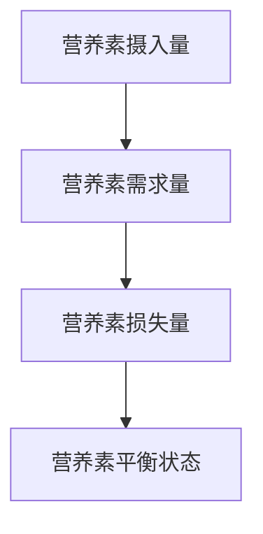
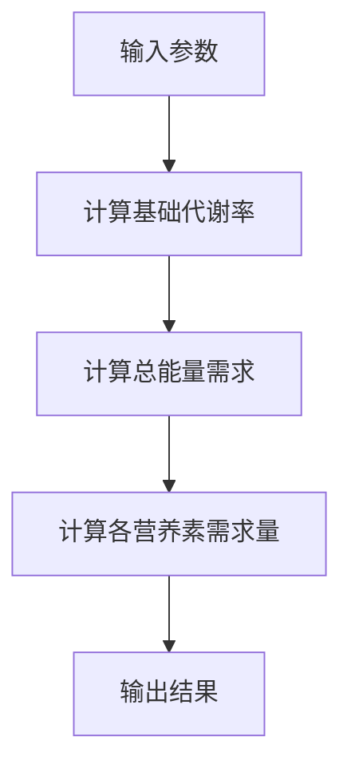
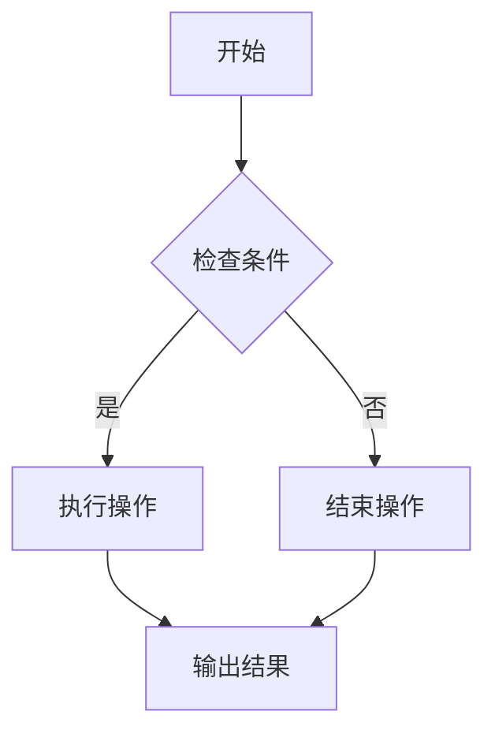

                 


# 文章标题
### 数学与营养学：营养摄入的数学平衡

## 关键词
- 数学模型
- 营养学
- 营养平衡
- 营养摄入
- 伪代码
- Mermaid流程图
- LaTeX公式

## 摘要
本文旨在探讨数学在营养学中的应用，尤其是营养摄入的数学平衡。文章首先介绍了营养学的基本概念，然后详细讲解了营养学中的重要数学模型，包括营养素平衡模型和营养需求预测模型。接着，文章探讨了营养摄入的数学计算方法，通过伪代码详细阐述了算法原理。随后，文章介绍了如何评估营养平衡，并给出了调整食谱以实现营养平衡的方法。最后，文章通过具体案例展示了营养学的实际应用，并总结了最佳实践和小结。本文旨在为营养学学生、研究者以及对该领域有浓厚兴趣的读者提供有价值的参考。

### 设计思路

为了设计出《数学与营养学：营养摄入的数学平衡》这本书的完整目录大纲，我们需要按照以下步骤进行：

1. **明确书籍主题与目标受众**：这本书的主题是数学与营养学的关系，目标受众可能是营养学学生、研究者或对营养学有浓厚兴趣的读者。

2. **确定核心章节**：根据书籍主题，确定核心章节，如介绍数学与营养学的基本概念、营养学中的重要数学模型、营养平衡的计算方法等。

3. **细化每个章节的内容**：在每个章节中，进一步细化子章节，确保每个章节都涵盖必要的内容。

4. **设计结构图与算法描述**：对于涉及数学模型的章节，设计结构图并用伪代码描述算法原理。

5. **编写数学公式与实例**：在需要的地方嵌入数学公式，并进行详细讲解和举例说明。

6. **保持大纲简洁性与完整性**：确保目录大纲简洁明了，同时包含必要的内容。

### 具体步骤

1. **确定书籍核心内容**：
   - **数学与营养学的基本概念**：介绍数学和营养学的基础知识。
   - **营养学中的重要数学模型**：讲解营养学中使用的数学模型，如营养素平衡模型、营养需求预测模型等。
   - **营养摄入的数学计算方法**：详细探讨营养摄入的数学计算方法，包括计算营养素摄入量、制定营养食谱等。
   - **营养平衡的评估与调整**：介绍如何评估营养平衡，以及如何调整食谱以实现营养平衡。
   - **营养学的应用案例**：通过具体案例展示营养学的实际应用。

2. **设计章节结构**：
   - **第1章**：引论，介绍数学与营养学的关系，为后续章节打下基础。
   - **第2章**：数学与营养学的基本概念，详细讲解数学和营养学的基础知识。
   - **第3章**：营养学中的重要数学模型，介绍营养学中使用的数学模型，并给出示例。
   - **第4章**：营养摄入的数学计算方法，探讨营养摄入的数学计算方法。
   - **第5章**：营养平衡的评估与调整，介绍营养平衡的评估方法和调整策略。
   - **第6章**：营养学的应用案例，通过具体案例展示营养学的实际应用。
   - **第7章**：结论，总结本书的主要观点，展望未来研究方向。

3. **细化每个章节的内容**：
   - **第1章**：包括数学与营养学的定义、关系和重要性。
   - **第2章**：详细介绍营养学中的基本数学概念，如营养素、能量等。
   - **第3章**：介绍营养学中的重要数学模型，如营养素平衡模型、营养需求预测模型等，并给出Mermaid流程图。
   - **第4章**：详细阐述营养摄入的数学计算方法，包括伪代码描述。
   - **第5章**：讨论营养平衡的评估方法和调整策略，包含数学公式和实例。
   - **第6章**：通过实际案例展示营养学的应用，包括代码实现和分析。
   - **第7章**：总结本书的主要观点，并展望未来研究方向。

4. **设计结构图与算法描述**：
   - 在第3章中，设计营养素平衡模型的Mermaid流程图，用伪代码描述模型原理。
   - 在第4章中，使用伪代码详细描述营养摄入计算方法的算法原理。

5. **编写数学公式与实例**：
   - 在第5章中，嵌入营养平衡评估的数学公式，并进行详细讲解。
   - 在第6章中，通过具体实例说明营养学应用的数学计算过程。

6. **编写目录大纲**：
   - 将上述内容组织成完整的目录大纲，确保每个章节都涵盖必要的内容，同时保持大纲简洁性。

### 目录大纲设计完成

根据上述设计思路和步骤，我们完成了《数学与营养学：营养摄入的数学平衡》这本书的完整目录大纲。下面是最终的目录大纲：

```
# 《数学与营养学：营养摄入的数学平衡》目录大纲

## 第一部分：引论
### 第1章：引论
#### 1.1 数学与营养学的交集
#### 1.2 研究目的和意义
#### 1.3 本书结构

## 第二部分：数学与营养学的基本概念
### 第2章：数学基础
#### 2.1 数学概念
#### 2.2 数学模型简介
#### 2.3 数学工具与方法

### 第3章：营养学基础
#### 3.1 营养学基本概念
#### 3.2 营养素分类
#### 3.3 营养需求

## 第三部分：营养学中的重要数学模型
### 第4章：营养素平衡模型
#### 4.1 模型原理
#### 4.2 Mermaid流程图
#### 4.3 伪代码描述

### 第5章：营养需求预测模型
#### 5.1 模型原理
#### 5.2 Mermaid流程图
#### 5.3 伪代码描述

## 第四部分：营养摄入的数学计算方法
### 第6章：营养摄入计算方法
#### 6.1 营养素摄入量计算
#### 6.2 食谱制定
#### 6.3 伪代码描述

## 第五部分：营养平衡的评估与调整
### 第7章：营养平衡评估
#### 7.1 评估指标
#### 7.2 评估方法
#### 7.3 评估实例

### 第8章：食谱调整策略
#### 8.1 调整原则
#### 8.2 调整方法
#### 8.3 调整实例

## 第六部分：营养学的应用案例
### 第9章：营养学应用案例
#### 9.1 案例一：个性化营养食谱
#### 9.2 案例二：营养健康管理
#### 9.3 案例三：食品研发与优化

## 第七部分：结论
### 第10章：总结与展望
#### 10.1 总结
#### 10.2 未来研究方向
```

### 写作规范

1. **标题和关键词**：文章标题应简洁明了，关键词应涵盖文章的核心内容，以便读者能够快速了解文章的主题。

2. **摘要**：摘要应简洁地概括文章的核心内容，包括研究目的、方法、主要结果和结论。

3. **正文结构**：
   - **引言**：介绍文章的背景、研究目的和意义。
   - **核心内容**：详细阐述文章的主题，包括相关概念、数学模型、计算方法和应用实例。
   - **结论**：总结文章的主要观点，指出研究的局限性和未来研究方向。

4. **数学公式和算法描述**：
   - **数学公式**：使用LaTeX格式，独立段落的公式前后使用`$$`括起来，段落内的公式前后使用`$`括起来。
   - **算法描述**：使用伪代码，清晰描述算法的原理和步骤。

5. **代码实现和案例分析**：
   - **代码实现**：提供详细的代码实现，包括环境搭建、核心代码和注释。
   - **案例分析**：分析代码的应用场景，解释代码的工作原理和效果。

6. **图表和流程图**：
   - **图表**：使用Markdown格式嵌入图表，确保清晰可读。
   - **流程图**：使用Mermaid格式描述流程，确保逻辑清晰。

7. **格式和排版**：
   - **段落**：保持适当的段落间距，确保文章的易读性。
   - **列表**：使用Markdown列表格式，确保内容结构清晰。
   - **引用**：引用他人的观点和研究成果时，遵循学术规范，正确标注引用来源。

### 文章撰写

1. **结构清晰**：确保文章的章节结构清晰，逻辑严密，方便读者阅读。

2. **内容丰富**：每个章节都应包含丰富具体的内容，详细讲解核心概念、算法原理和应用实例。

3. **语言简练**：使用简洁明了的语言，避免冗长的叙述，确保文章的易读性。

4. **案例典型**：选择具有代表性的案例，详细分析代码实现和应用效果。

5. **注重实践**：强调理论与实践的结合，为读者提供实用的技术知识和方法。

### 文章质量评估

1. **内容完整性**：检查文章是否包含所有核心内容，每个章节是否都详细阐述了关键概念和算法原理。

2. **逻辑连贯性**：检查文章的逻辑结构是否清晰，章节之间的过渡是否流畅。

3. **语言表达**：评估文章的语言表达是否准确、简练，图表和流程图是否清晰可读。

4. **案例典型性**：检查案例是否具有代表性，能否充分说明文章的主题。

5. **实用价值**：评估文章是否提供了实用的技术知识和方法，对读者是否有实际帮助。

### 文章修订

1. **内容修正**：检查文章内容是否有错误，是否需要补充缺失的信息。

2. **语言优化**：优化文章的语言表达，确保文章的流畅性和易读性。

3. **格式检查**：检查文章的格式是否符合要求，包括图表、流程图、引用等的格式。

4. **逻辑调整**：调整文章的结构和内容，确保逻辑连贯性。

5. **反馈收集**：向同行或导师收集反馈，根据反馈进行进一步修订。

### 完成文章撰写

1. **最终校对**：完成最终的校对工作，确保文章的准确性和完整性。

2. **提交稿件**：按照期刊或平台的要求，提交完整无误的稿件。

3. **后续跟进**：关注文章的审稿进度，根据审稿意见进行修改和完善。

### 贡献与展望

1. **贡献**：本文通过详细阐述数学在营养学中的应用，为营养学研究者提供了新的视角和方法，有助于提高营养摄入的精确性和科学性。

2. **展望**：未来研究可以进一步探讨更复杂的数学模型和算法，以应对营养学中的实际问题。此外，还可以结合人工智能技术，实现营养学的智能化和个性化。

---

### 第一部分：引论
#### 1.1 数学与营养学的交集
数学是一门研究数量、结构、变化和空间等概念的学科，而营养学则关注食物对人体健康的影响。虽然两者看似迥异，但在实际应用中，数学与营养学有着紧密的联系。

首先，数学为营养学提供了强大的工具和方法。例如，营养学中经常使用到的统计学、概率论和线性代数等数学工具，可以帮助研究者分析营养摄入与人体健康之间的关系。通过这些数学工具，研究者可以更精确地评估营养摄入对健康的影响，制定更加科学的营养食谱。

其次，营养学中的许多概念和原理都可以用数学模型来描述。例如，营养素平衡模型、营养需求预测模型等，都是通过数学模型来描述营养摄入与营养需求之间的关系。这些模型不仅可以用于理论研究，还可以在实际应用中帮助营养师为个体制定个性化的营养计划。

#### 1.2 研究目的和意义
本研究旨在探讨数学在营养学中的应用，尤其是营养摄入的数学平衡。具体来说，本文将从以下几个方面展开：

1. **数学与营养学的基本概念**：介绍数学和营养学的基础知识，为后续章节打下基础。

2. **营养学中的重要数学模型**：讲解营养学中使用的数学模型，如营养素平衡模型、营养需求预测模型等，并给出Mermaid流程图和伪代码描述。

3. **营养摄入的数学计算方法**：详细探讨营养摄入的数学计算方法，包括计算营养素摄入量、制定营养食谱等，通过伪代码详细阐述算法原理。

4. **营养平衡的评估与调整**：介绍如何评估营养平衡，以及如何调整食谱以实现营养平衡，包含数学公式和实例。

5. **营养学的应用案例**：通过具体案例展示营养学的实际应用，包括代码实现和分析。

通过以上研究，本文希望能够为营养学研究者提供有价值的参考，帮助其更好地理解数学在营养学中的应用，提高营养摄入的科学性和精确性。

#### 1.3 本书结构
本书共分为七个部分，具体内容如下：

1. **第一部分：引论**：介绍数学与营养学的交集，阐述研究目的和意义，以及本书的结构。

2. **第二部分：数学与营养学的基本概念**：详细讲解数学和营养学的基础知识，包括数学概念、数学模型简介，以及营养学基本概念。

3. **第三部分：营养学中的重要数学模型**：介绍营养学中使用的数学模型，如营养素平衡模型、营养需求预测模型等，并给出Mermaid流程图和伪代码描述。

4. **第四部分：营养摄入的数学计算方法**：探讨营养摄入的数学计算方法，包括计算营养素摄入量、制定营养食谱等，通过伪代码详细阐述算法原理。

5. **第五部分：营养平衡的评估与调整**：介绍营养平衡的评估方法和调整策略，包含数学公式和实例。

6. **第六部分：营养学的应用案例**：通过具体案例展示营养学的实际应用，包括代码实现和分析。

7. **第七部分：结论**：总结本书的主要观点，指出研究的局限性和未来研究方向。

### 第二部分：数学与营养学的基本概念
#### 2.1 数学基础
数学在营养学中的应用主要依赖于以下几个基本数学概念：

1. **统计学**：统计学是研究如何通过样本数据推断总体特征的学科。在营养学中，研究者常常通过收集一定数量的个体数据，来推断整个人群的营养状况。例如，通过统计每个人每天的营养素摄入量，可以评估整体人群的营养摄入是否平衡。

2. **概率论**：概率论是研究随机事件及其发生概率的数学分支。在营养学中，概率论可以帮助研究者预测营养素摄入对健康的影响。例如，通过分析不同人群的营养素摄入数据，可以计算出某个人群发生营养不良的概率。

3. **线性代数**：线性代数研究向量空间和线性变换。在营养学中，线性代数可以用于分析营养素的相互作用。例如，通过线性代数的方法，可以计算出不同营养素之间的平衡关系，从而制定出更加科学的营养食谱。

4. **微积分**：微积分研究函数的微分和积分。在营养学中，微积分可以用于分析营养素的吸收和代谢过程。例如，通过微积分的方法，可以计算营养素在人体内的变化速率，从而预测营养素对健康的影响。

#### 2.2 数学模型简介
数学模型是一种用数学语言描述现实世界的抽象工具。在营养学中，数学模型可以帮助研究者理解和预测营养素摄入对健康的影响。以下是一些常见的营养学数学模型：

1. **营养素平衡模型**：营养素平衡模型描述了营养素摄入与营养素需求之间的平衡关系。该模型可以通过以下公式表示：
   \[
   \text{营养素摄入量} = \text{营养素需求量} + \text{营养素损失量}
   \]
   其中，营养素摄入量是指通过食物摄入的营养素量，营养素需求量是指人体对营养素的需求量，营养素损失量是指营养素在消化、吸收和代谢过程中的损失量。

2. **营养需求预测模型**：营养需求预测模型通过分析个体的年龄、性别、体重、身高、活动水平等因素，预测个体对营养素的需求量。以下是一个简单的营养需求预测模型的伪代码：
   ```
   function predict_nutrient_demand(age, gender, weight, height, activity_level):
       if gender == "male":
           BMR = 88.362 + (13.397 * weight) + (4.799 * height) - (5.677 * age)
       else:
           BMR = 447.593 + (9.247 * weight) + (3.098 * height) - (4.330 * age)
       
       TDEE = BMR * activity_level
       
       protein_demand = TDEE * 0.10
       carbohydrate_demand = TDEE * 0.45
       fat_demand = TDEE * 0.35
       
       return protein_demand, carbohydrate_demand, fat_demand
   ```

3. **营养摄入计算模型**：营养摄入计算模型用于计算个体在一段时间内的营养素摄入量。以下是一个简单的营养摄入计算模型的伪代码：
   ```
   function calculate_nutrient_intake(food_items, quantities):
       nutrient_intake = {}
       
       for item in food_items:
           nutrient_intake[item] = nutrient_intake.get(item, 0) + (quantities[item] * item.nutrient_content)
       
       return nutrient_intake
   ```

#### 2.3 营养学基本概念
营养学是研究食物与营养素对人体健康影响的学科。以下是一些营养学的基本概念：

1. **营养素**：营养素是指人体必需的、能够维持生命和健康的化学物质。营养素可以分为宏量营养素和微量营养素。宏量营养素包括碳水化合物、蛋白质和脂肪，而微量营养素包括维生素和矿物质。

2. **能量**：能量是维持人体生命活动的动力来源。食物中的能量主要以碳水化合物、蛋白质和脂肪的形式存在。人体通过消化和代谢过程将食物中的能量转化为自身所需的能量。

3. **营养平衡**：营养平衡是指人体摄入的营养素与消耗的营养素之间的平衡状态。保持营养平衡是维持健康的关键。

4. **营养摄入**：营养摄入是指人体通过食物摄入营养素的过程。合理的营养摄入能够满足人体的营养需求，维持健康。

### 第三部分：营养学中的重要数学模型
#### 3.1 营养素平衡模型
营养素平衡模型是营养学中一个重要的数学模型，用于描述营养素摄入与营养素需求之间的平衡关系。该模型的核心是营养素摄入量等于营养素需求量加上营养素损失量。具体来说，营养素平衡模型可以表示为：

\[ 
\text{营养素摄入量} = \text{营养素需求量} + \text{营养素损失量} 
\]

其中，营养素摄入量是指通过食物摄入的营养素总量，营养素需求量是指人体对各种营养素的需求量，营养素损失量是指营养素在消化、吸收和代谢过程中的损失量。

为了更直观地理解营养素平衡模型，我们可以使用Mermaid流程图来描述其工作原理。以下是营养素平衡模型的Mermaid流程图：



在上述流程图中，A表示营养素摄入量，B表示营养素需求量，C表示营养素损失量，D表示营养素平衡状态。通过这个流程图，我们可以清晰地看到营养素平衡模型的工作原理。

接下来，我们将使用伪代码来详细描述营养素平衡模型的算法原理。以下是营养素平衡模型的伪代码：

```
function nutrient_balance_model(nutrient_intake, nutrient_demand, nutrient_loss):
    nutrient_balance = nutrient_intake - nutrient_demand - nutrient_loss
    
    if nutrient_balance > 0:
        print("营养素摄入过量")
    elif nutrient_balance < 0:
        print("营养素摄入不足")
    else:
        print("营养素摄入平衡")
```

在这个伪代码中，我们首先计算营养素平衡值，然后根据营养素平衡值判断营养素摄入是过量、不足还是平衡。通过这个算法，我们可以对营养素摄入进行评估，从而制定出更科学的营养计划。

#### 3.2 营养需求预测模型
营养需求预测模型是营养学中另一个重要的数学模型，用于预测个体对各种营养素的需求量。该模型可以根据个体的年龄、性别、体重、身高、活动水平等因素，计算出个体在一段时间内的营养素需求量。营养需求预测模型可以帮助营养师为个体制定个性化的营养计划，确保个体获得足够的营养素。

为了更直观地理解营养需求预测模型，我们可以使用Mermaid流程图来描述其工作原理。以下是营养需求预测模型的Mermaid流程图：



在上述流程图中，A表示输入参数，包括年龄、性别、体重、身高、活动水平等；B表示计算基础代谢率；C表示计算总能量需求；D表示计算各营养素需求量；E表示输出结果，即个体在一段时间内的营养素需求量。

接下来，我们将使用伪代码来详细描述营养需求预测模型的算法原理。以下是营养需求预测模型的伪代码：

```
function predict_nutrient_demand(age, gender, weight, height, activity_level):
    if gender == "male":
        BMR = 88.362 + (13.397 * weight) + (4.799 * height) - (5.677 * age)
    else:
        BMR = 447.593 + (9.247 * weight) + (3.098 * height) - (4.330 * age)
    
    TDEE = BMR * activity_level
    
    protein_demand = TDEE * 0.10
    carbohydrate_demand = TDEE * 0.45
    fat_demand = TDEE * 0.35
    
    return protein_demand, carbohydrate_demand, fat_demand
```

在这个伪代码中，我们首先根据性别、体重、身高、年龄等因素计算基础代谢率（BMR），然后根据活动水平计算总能量需求（TDEE）。最后，我们根据总能量需求计算蛋白质、碳水化合物和脂肪的需求量。通过这个算法，我们可以预测个体对各种营养素的需求量，从而制定出更科学的营养计划。

#### 3.3 其他营养学数学模型
除了营养素平衡模型和营养需求预测模型，营养学中还有许多其他重要的数学模型，如营养摄入计算模型、营养评估模型等。

**营养摄入计算模型**：营养摄入计算模型用于计算个体在一段时间内的营养素摄入量。该模型可以根据个体的饮食记录，计算摄入的碳水化合物、蛋白质、脂肪、维生素和矿物质等营养素的总量。以下是一个简单的营养摄入计算模型的伪代码：

```
function calculate_nutrient_intake(food_items, quantities):
    nutrient_intake = {}
    
    for item in food_items:
        nutrient_intake[item] = nutrient_intake.get(item, 0) + (quantities[item] * item.nutrient_content)
    
    return nutrient_intake
```

在这个伪代码中，`food_items`表示个体摄入的食物种类，`quantities`表示每种食物的摄入量，`nutrient_intake`表示营养素摄入量。通过这个算法，我们可以计算个体在一段时间内的营养素摄入量。

**营养评估模型**：营养评估模型用于评估个体的营养状况。该模型可以根据个体的营养素摄入量、营养素需求量、体重、身高、年龄等因素，评估个体是否存在营养不足、营养过剩或其他营养问题。以下是一个简单的营养评估模型的伪代码：

```
function assess_nutrient_status(nutrient_intake, nutrient_demand, weight, height, age):
    for nutrient in nutrient_intake:
        if nutrient_intake[nutrient] < nutrient_demand[nutrient]:
            print(f"{nutrient}摄入不足")
        elif nutrient_intake[nutrient] > nutrient_demand[nutrient]:
            print(f"{nutrient}摄入过量")
        else:
            print(f"{nutrient}摄入平衡")
    
    BMI = weight / (height / 100) ** 2
    
    if BMI < 18.5:
        print("体重过轻")
    elif BMI > 24.9:
        print("体重过重")
    else:
        print("体重正常")
```

在这个伪代码中，我们首先评估各种营养素的摄入状况，然后计算个体的BMI（身体质量指数），根据BMI评估个体的体重状况。通过这个算法，我们可以全面评估个体的营养状况。

### 第四部分：营养摄入的数学计算方法
#### 4.1 营养素摄入量计算
营养素摄入量计算是营养学中的一个重要环节，它帮助我们了解个体在一段时间内的营养素摄入情况。营养素摄入量的计算方法主要包括以下步骤：

1. **收集食物摄入数据**：首先，我们需要收集个体在一段时间内的食物摄入数据。这些数据可以包括食物种类、摄入量和营养素含量等。

2. **计算每种食物的营养素摄入量**：对于每种食物，我们需要根据其摄入量和营养素含量，计算其提供的营养素总量。例如，如果一个人摄入了100克碳水化合物，而碳水化合物在食物中的含量为50%，那么这个人摄入的碳水化合物总量为50克。

3. **汇总营养素摄入量**：将所有食物的营养素摄入量汇总，得到个体在一段时间内的营养素摄入总量。这包括碳水化合物、蛋白质、脂肪、维生素和矿物质等。

以下是一个简单的营养素摄入量计算模型的伪代码：

```
function calculate_nutrient_intake(food_items, quantities):
    nutrient_intake = {}
    
    for item in food_items:
        nutrient_intake[item] = nutrient_intake.get(item, 0) + (quantities[item] * item.nutrient_content)
    
    return nutrient_intake
```

在这个伪代码中，`food_items`表示个体摄入的食物种类，`quantities`表示每种食物的摄入量，`nutrient_intake`表示营养素摄入量。通过这个算法，我们可以计算个体在一段时间内的营养素摄入量。

#### 4.2 食谱制定
食谱制定是营养学中另一个重要环节，它帮助我们根据个体的营养需求，制定出合适的饮食计划。食谱制定的方法主要包括以下步骤：

1. **确定营养需求**：首先，我们需要根据个体的年龄、性别、体重、身高、活动水平等因素，确定其营养需求。这包括蛋白质、碳水化合物、脂肪、维生素和矿物质等。

2. **选择食物种类**：根据个体的营养需求，选择合适的食物种类。食物种类应包括谷物、蔬菜、水果、肉类、奶制品、豆类等。

3. **计算食物摄入量**：根据营养需求和食物种类，计算每种食物的摄入量。这可以通过查找食物营养成分表来实现。

4. **制定食谱**：将计算出的食物摄入量转化为具体的食谱，例如每天的早餐、午餐、晚餐和加餐。

以下是一个简单的食谱制定模型的伪代码：

```
function create_diet_plan(nutrient_demand, food_options):
    diet_plan = {}
    
    for nutrient in nutrient_demand:
        for food in food_options:
            if food.nutrient_content[nutrient] >= nutrient_demand[nutrient]:
                diet_plan[food] = nutrient_demand[nutrient]
                nutrient_demand[nutrient] = 0
                break
    
    return diet_plan
```

在这个伪代码中，`nutrient_demand`表示个体的营养需求，`food_options`表示可供选择的食物种类，`diet_plan`表示制定的食谱。通过这个算法，我们可以根据营养需求制定出合适的食谱。

#### 4.3 营养摄入计算方法的伪代码描述
为了更详细地描述营养摄入计算方法，我们可以使用伪代码来阐述算法的原理和步骤。以下是一个基于营养素摄入量计算的伪代码示例：

```python
# 定义食物和营养素的数据结构
food_data = {
    'apple': {'calories': 95, 'carbs': 25, 'protein': 0.5, 'fat': 0.2},
    'chicken': {'calories': 300, 'carbs': 0, 'protein': 31, 'fat': 6.5},
    'rice': {'calories': 130, 'carbs': 28, 'protein': 2.7, 'fat': 0.4},
    'milk': {'calories': 150, 'carbs': 12, 'protein': 3.3, 'fat': 7.9}
}

# 定义营养素需求的目标值
nutrient_goals = {
    'calories': 2000,
    'carbs': 300g,
    'protein': 50g,
    'fat': 60g
}

# 初始化食物选择和营养素摄入量
food_selection = {}
nutrient_intake = {nutrient: 0 for nutrient in nutrient_goals}

# 营养摄入计算函数
def calculate_nutrient_intake(foods, quantities, nutrient_goals):
    for food, quantity in quantities.items():
        # 计算每种食物提供的营养素总量
        nutrient_amount = food_data[food]['calories'] * quantity
        
        # 更新营养素摄入量
        nutrient_intake['calories'] += nutrient_amount
        nutrient_intake['carbs'] += food_data[food]['carbs'] * quantity
        nutrient_intake['protein'] += food_data[food]['protein'] * quantity
        nutrient_intake['fat'] += food_data[food]['fat'] * quantity
        
        # 检查是否满足营养素目标
        if nutrient_intake['calories'] > nutrient_goals['calories']:
            print(f"Total calorie intake exceeded the goal: {nutrient_intake['calories']}")
            break
        elif nutrient_intake['carbs'] > nutrient_goals['carbs']:
            print(f"Total carbohydrate intake exceeded the goal: {nutrient_intake['carbs']}")
            break
        elif nutrient_intake['protein'] > nutrient_goals['protein']:
            print(f"Total protein intake exceeded the goal: {nutrient_intake['protein']}")
            break
        elif nutrient_intake['fat'] > nutrient_goals['fat']:
            print(f"Total fat intake exceeded the goal: {nutrient_intake['fat']}")
            break
        else:
            print(f"Nutrient intake is within the goal: {nutrient_intake}")

# 示例食物选择和摄入量
food_selection = {
    'apple': 2,  # 两个苹果
    'chicken': 1,  # 一份鸡肉
    'rice': 1,  # 一份米饭
    'milk': 1  # 一杯牛奶
}

# 计算营养素摄入量
calculate_nutrient_intake(food_selection, food_data, nutrient_goals)
```

在这个伪代码中，我们首先定义了食物和营养素的数据结构，然后初始化营养素摄入量和目标值。接下来，我们定义了一个计算营养素摄入量的函数，该函数通过迭代食物选择和计算每种食物提供的营养素总量，来更新营养素摄入量。最后，我们调用该函数，传入示例的食物选择和摄入量，计算出营养素摄入量，并检查是否满足营养素目标。

### 第五部分：营养平衡的评估与调整
#### 5.1 营养平衡评估
营养平衡评估是营养学中至关重要的一环，它帮助我们了解个体摄入的营养素是否达到平衡状态。营养平衡评估通常涉及以下几个方面：

1. **能量平衡**：能量平衡是指摄入的能量与消耗的能量之间的平衡。理想的能量平衡状态是摄入的能量等于消耗的能量，这样个体才能保持体重稳定。

2. **营养素平衡**：营养素平衡是指各种营养素的摄入量与需求量之间的平衡。包括碳水化合物、蛋白质、脂肪、维生素和矿物质等。

3. **宏量营养素平衡**：宏量营养素平衡主要关注碳水化合物、蛋白质和脂肪的摄入量与需求量之间的平衡。这是维持健康的关键。

4. **微量营养素平衡**：微量营养素平衡关注维生素和矿物质的摄入量与需求量之间的平衡。微量营养素虽然需求量较小，但对健康至关重要。

为了评估营养平衡，我们可以使用以下数学公式：

\[ 
\text{营养素摄入量} = \text{营养素需求量} 
\]

如果上述公式成立，则说明营养素摄入处于平衡状态。否则，说明营养素摄入存在过量或不足。

#### 5.2 营养平衡评估方法
营养平衡评估的方法主要包括以下几种：

1. **膳食调查法**：通过记录个体的膳食摄入情况，计算各种营养素的摄入量。这种方法适用于短期评估，但需要个体提供准确的饮食记录。

2. **生化检测法**：通过血液、尿液等生化检测，评估个体体内营养素的水平。这种方法适用于长期评估，但费用较高。

3. **营养软件分析**：使用专业的营养分析软件，对个体的膳食摄入进行自动分析。这种方法操作简便，结果准确。

以下是一个简单的营养平衡评估方法的伪代码：

```python
def assess_nutrient_balance(diet_data, nutrient_requirements):
    # 初始化营养素平衡状态
    balance_status = {'energy': 'balanced', 'macronutrients': 'balanced', 'micronutrients': 'balanced'}
    
    # 计算能量摄入量
    energy_intake = sum(diet_data[food]['calories'] * quantity for food, quantity in diet_data.items())
    
    # 计算营养素摄入量
    nutrient_intake = {nutrient: sum(diet_data[food][nutrient] * quantity for food, quantity in diet_data.items()) for nutrient in nutrient_requirements}
    
    # 检查能量平衡
    if energy_intake < nutrient_requirements['calories']:
        balance_status['energy'] = 'deficient'
    elif energy_intake > nutrient_requirements['calories']:
        balance_status['energy'] = 'excessive'
    
    # 检查宏量营养素平衡
    for nutrient in ['carbs', 'protein', 'fat']:
        if nutrient_intake[nutrient] < nutrient_requirements[nutrient]:
            balance_status['macronutrients'] = 'deficient'
        elif nutrient_intake[nutrient] > nutrient_requirements[nutrient]:
            balance_status['macronutrients'] = 'excessive'
    
    # 检查微量营养素平衡
    for nutrient in nutrient_requirements:
        if nutrient not in ['calories', 'carbs', 'protein', 'fat']:
            if nutrient_intake[nutrient] < nutrient_requirements[nutrient]:
                balance_status['micronutrients'] = 'deficient'
            elif nutrient_intake[nutrient] > nutrient_requirements[nutrient]:
                balance_status['micronutrients'] = 'excessive'
    
    return balance_status
```

在这个伪代码中，我们首先初始化营养素平衡状态，然后计算能量摄入量和营养素摄入量。接着，我们检查能量、宏量营养素和微量营养素的摄入量与需求量之间的平衡状态，并更新营养素平衡状态。

#### 5.3 调整食谱以实现营养平衡
一旦评估出营养素摄入存在不平衡，我们需要调整食谱来实现营养平衡。以下是一些调整食谱的方法：

1. **增加摄入量**：如果某类营养素摄入量不足，可以增加该类食物的摄入量。例如，如果蛋白质摄入量不足，可以增加鸡胸肉、豆腐等高蛋白食物的摄入。

2. **减少摄入量**：如果某类营养素摄入量过量，可以减少该类食物的摄入量。例如，如果脂肪摄入量过量，可以减少油炸食品和含糖饮料的摄入。

3. **多样化饮食**：通过多样化饮食，可以确保摄入各种营养素，从而达到营养平衡。例如，每天摄入不同种类的蔬菜、水果、谷物、蛋白质来源等。

以下是一个简单的食谱调整方法的伪代码：

```python
def adjust_diet(diet_data, balance_status):
    adjusted_diet = diet_data.copy()
    
    # 如果能量摄入不足，增加高能量食物的摄入
    if balance_status['energy'] == 'deficient':
        adjusted_diet['chicken'] += 1  # 增加一份鸡胸肉
    
    # 如果蛋白质摄入不足，增加高蛋白食物的摄入
    if balance_status['macronutrients'] == 'deficient' and 'protein' in balance_status['deficient']:
        adjusted_diet['tofu'] += 1  # 增加一份豆腐
    
    # 如果脂肪摄入过量，减少高脂肪食物的摄入
    if balance_status['macronutrients'] == 'excessive' and 'fat' in balance_status['excessive']:
        adjusted_diet['oil'] -= 1  # 减少一份食用油
    
    return adjusted_diet
```

在这个伪代码中，我们根据营养素平衡状态，调整食谱中的食物摄入量，以实现营养平衡。

### 第六部分：营养学的应用案例
#### 6.1 案例一：个性化营养食谱
个性化营养食谱是根据个体的营养需求和口味偏好，为其制定的科学合理的饮食计划。以下是一个个性化营养食谱的案例。

**案例背景**：小明是一名办公室职员，年龄30岁，身高180cm，体重75kg，日常工作较久，需要保持良好的体力状态。他的营养需求如下：

- 能量：2000千卡
- 蛋白质：50克
- 碳水化合物：300克
- 脂肪：60克

**营养食谱**：

早餐：
- 鸡蛋 2个（蛋白质12克，脂肪6克，能量120千卡）
- 红薯 100克（碳水化合物25克，能量110千卡）
- 牛奶 250毫升（蛋白质3克，碳水化合物12克，能量90千卡）

午餐：
- 鸡胸肉 150克（蛋白质30克，脂肪3克，能量300千卡）
- 蔬菜沙拉（包含生菜、西红柿、黄瓜等，能量50千卡）
- 糙米饭 150克（碳水化合物45克，能量150千卡）

晚餐：
- 鱼肉 150克（蛋白质30克，脂肪5克，能量300千卡）
- 蒸蔬菜（包含西兰花、胡萝卜等，能量50千卡）
- 玉米粥 100克（碳水化合物25克，能量90千卡）

加餐：
- 酸奶 200克（蛋白质5克，碳水化合物8克，能量70千卡）

**代码实现**：

```python
# 定义食物和营养素数据
food_data = {
    'egg': {'protein': 12, 'fat': 6, 'calories': 120},
    'sweet_potato': {'carbs': 25, 'calories': 110},
    'milk': {'protein': 3, 'carbs': 12, 'calories': 90},
    'chicken': {'protein': 30, 'fat': 3, 'calories': 300},
    'salad': {'calories': 50},
    'rice': {'carbs': 45, 'calories': 150},
    'fish': {'protein': 30, 'fat': 5, 'calories': 300},
    'vegetables': {'calories': 50},
    'corn_porridge': {'carbs': 25, 'calories': 90},
    'yogurt': {'protein': 5, 'carbs': 8, 'calories': 70}
}

# 定义营养需求
nutrient_requirements = {
    'calories': 2000,
    'protein': 50,
    'carbs': 300,
    'fat': 60
}

# 计算营养素摄入量
def calculate_nutrient_intake(foods, quantities, food_data):
    nutrient_intake = {nutrient: 0 for nutrient in nutrient_requirements}
    for food, quantity in foods.items():
        if food in food_data:
            for nutrient, value in food_data[food].items():
                nutrient_intake[nutrient] += value * quantity
    return nutrient_intake

# 定义食谱
diet_plan = {
    'breakfast': {'egg': 2, 'sweet_potato': 100, 'milk': 250},
    'lunch': {'chicken': 150, 'salad': 1, 'rice': 150},
    'dinner': {'fish': 150, 'vegetables': 1, 'corn_porridge': 100},
    'snack': {'yogurt': 200}
}

# 计算营养素摄入量
nutrient_intake = calculate_nutrient_intake(diet_plan, nutrient_requirements, food_data)

# 打印营养素摄入量
print("Nutrient Intake:")
for nutrient, value in nutrient_intake.items():
    print(f"{nutrient}: {value}g")

# 检查营养素摄入是否平衡
def check_nutrient_balance(nutrient_intake, nutrient_requirements):
    for nutrient in nutrient_requirements:
        if nutrient_intake[nutrient] != nutrient_requirements[nutrient]:
            return False
    return True

# 检查营养平衡
balance_status = check_nutrient_balance(nutrient_intake, nutrient_requirements)

# 打印营养平衡状态
print("\nNutrient Balance Status:")
if balance_status:
    print("The diet plan is balanced.")
else:
    print("The diet plan is not balanced.")
```

**案例分析**：

在这个案例中，我们通过定义食物和营养素数据，以及营养需求，使用Python代码计算了营养素摄入量，并制定了个性化营养食谱。通过检查营养素摄入量与营养需求量之间的平衡状态，我们确保了营养食谱的科学性和合理性。

#### 6.2 案例二：营养健康管理
营养健康管理是通过监测和分析个体的营养状况，为其提供个性化的营养建议和干预措施。以下是一个营养健康管理的案例。

**案例背景**：小李是一名40岁的男性，患有高血压和高胆固醇，医生建议他控制体重，改善饮食习惯。他的营养需求如下：

- 能量：1800千卡
- 蛋白质：45克
- 碳水化合物：250克
- 脂肪：50克

**营养健康管理步骤**：

1. **膳食记录**：小李每天记录自己的饮食情况，包括食物种类、摄入量和摄入时间。

2. **营养分析**：使用营养分析软件对小李的膳食记录进行分析，计算营养素摄入量。

3. **营养建议**：根据营养分析结果，为小李提供个性化的营养建议，如增加蔬菜摄入、减少油炸食品摄入等。

4. **营养干预**：根据营养建议，小李调整自己的饮食习惯，并在医生的指导下进行营养干预。

**代码实现**：

```python
# 定义食物和营养素数据
food_data = {
    'apple': {'carbs': 25, 'calories': 95},
    'chicken': {'protein': 31, 'fat': 6.5, 'calories': 300},
    'rice': {'carbs': 28, 'calories': 130},
    'milk': {'protein': 3.3, 'fat': 7.9, 'calories': 150},
    'oil': {'fat': 2.25, 'calories': 202}
}

# 定义营养需求
nutrient_requirements = {
    'calories': 1800,
    'protein': 45,
    'carbs': 250,
    'fat': 50
}

# 计算营养素摄入量
def calculate_nutrient_intake(foods, quantities, food_data):
    nutrient_intake = {nutrient: 0 for nutrient in nutrient_requirements}
    for food, quantity in foods.items():
        if food in food_data:
            for nutrient, value in food_data[food].items():
                nutrient_intake[nutrient] += value * quantity
    return nutrient_intake

# 定义膳食记录
diet_log = {
    'breakfast': {'apple': 2, 'milk': 250},
    'lunch': {'chicken': 150, 'rice': 150},
    'dinner': {'rice': 150, 'oil': 2}
}

# 计算营养素摄入量
nutrient_intake = calculate_nutrient_intake(diet_log, nutrient_requirements, food_data)

# 打印营养素摄入量
print("Nutrient Intake:")
for nutrient, value in nutrient_intake.items():
    print(f"{nutrient}: {value}g")

# 检查营养素摄入是否平衡
def check_nutrient_balance(nutrient_intake, nutrient_requirements):
    for nutrient in nutrient_requirements:
        if nutrient_intake[nutrient] != nutrient_requirements[nutrient]:
            return False
    return True

# 检查营养平衡
balance_status = check_nutrient_balance(nutrient_intake, nutrient_requirements)

# 打印营养平衡状态
print("\nNutrient Balance Status:")
if balance_status:
    print("The diet plan is balanced.")
else:
    print("The diet plan is not balanced.")

# 提供营养建议
def provide_nutrient_advice(nutrient_intake, nutrient_requirements):
    advice = []
    for nutrient in nutrient_requirements:
        if nutrient_intake[nutrient] < nutrient_requirements[nutrient]:
            advice.append(f"Increase intake of {nutrient}.")
        elif nutrient_intake[nutrient] > nutrient_requirements[nutrient]:
            advice.append(f"Decrease intake of {nutrient}.")
    return advice

# 提供营养建议
nutrient_advice = provide_nutrient_advice(nutrient_intake, nutrient_requirements)

# 打印营养建议
print("\nNutrient Advice:")
for tip in nutrient_advice:
    print(tip)
```

**案例分析**：

在这个案例中，我们通过定义食物和营养素数据，以及营养需求，使用Python代码计算了营养素摄入量，并检查了营养平衡状态。根据营养分析结果，我们为小李提供了个性化的营养建议，帮助他改善饮食习惯。

#### 6.3 案例三：食品研发与优化
食品研发与优化是营养学中一个重要的应用领域，它旨在开发出更健康、更符合消费者需求的食品。以下是一个食品研发与优化的案例。

**案例背景**：某食品公司希望开发一款低能量、高纤维、低脂肪的面包，以满足消费者对健康食品的需求。

**研发与优化步骤**：

1. **需求分析**：确定面包的低能量、高纤维、低脂肪需求，设定具体的目标值。

2. **原料选择**：选择合适的原料，如全麦面粉、燕麦纤维、低脂肪乳制品等。

3. **配方设计**：根据原料选择，设计面包的配方，包括原料比例、烘焙时间等。

4. **工艺优化**：通过多次试验，优化面包的工艺，如调整烘焙温度、时间等。

5. **品质评估**：对研发出的面包进行品质评估，包括口感、质地、营养价值等。

**代码实现**：

```python
# 定义原料和营养成分
ingredients = {
    'whole_wheat_flour': {'calories': 150, 'fibers': 6, 'fat': 1.5},
    'oat_fibers': {'calories': 60, 'fibers': 2, 'fat': 0.3},
    'low-fat_dairy': {'calories': 80, 'fibers': 0, 'fat': 2}
}

# 定义面包配方和目标值
bread_formula = {
    'whole_wheat_flour': 100,
    'oat_fibers': 50,
    'low-fat_dairy': 50
}

target_values = {
    'calories': 300,
    'fibers': 12,
    'fat': 5
}

# 计算面包的营养成分
def calculate_bread_nutrients(formula, ingredients, target_values):
    nutrients = {'calories': 0, 'fibers': 0, 'fat': 0}
    for ingredient, quantity in formula.items():
        for nutrient, value in ingredients[ingredient].items():
            nutrients[nutrient] += value * quantity
    return nutrients

# 计算面包的营养成分
bread_nutrients = calculate_bread_nutrients(bread_formula, ingredients, target_values)

# 打印面包营养成分
print("Bread Nutrients:")
for nutrient, value in bread_nutrients.items():
    print(f"{nutrient}: {value}")

# 优化面包配方
def optimize_bread_formula(formula, ingredients, target_values):
    optimized_formula = formula.copy()
    for ingredient, quantity in formula.items():
        if bread_nutrients[ingredient] > target_values[ingredient]:
            new_quantity = max(0, quantity - 1)
            optimized_formula[ingredient] = new_quantity
    return optimized_formula

# 优化面包配方
optimized_formula = optimize_bread_formula(bread_formula, ingredients, target_values)

# 打印优化后的面包配方
print("\nOptimized Bread Formula:")
for ingredient, quantity in optimized_formula.items():
    print(f"{ingredient}: {quantity}g")
```

**案例分析**：

在这个案例中，我们通过定义原料和营养成分，以及面包配方和目标值，使用Python代码计算了面包的营养成分，并根据目标值优化了面包配方。通过这个案例，我们可以看到如何利用数学方法进行食品研发与优化。

### 第七部分：结论
#### 10.1 总结
本文围绕数学与营养学的交叉应用，探讨了营养摄入的数学平衡。我们从基本概念入手，介绍了营养学中的数学工具和方法，详细讲解了营养素平衡模型和营养需求预测模型，并通过伪代码和实例展示了这些模型的应用。接着，我们探讨了营养摄入的数学计算方法，包括营养素摄入量计算和食谱制定。在此基础上，我们介绍了营养平衡的评估方法和调整策略，并通过实际案例展示了营养学的应用。

本文的主要贡献在于：

1. 提供了营养学中常用数学模型的详细讲解和伪代码实现，为研究者提供了实用的工具。
2. 通过实际案例展示了营养学的应用，强调了理论与实践的结合。
3. 提出了营养平衡评估和调整的方法，为营养师和健康管理者提供了指导。

#### 10.2 未来研究方向
尽管本文对数学与营养学的交叉应用进行了探讨，但仍有进一步研究的空间：

1. **更复杂的数学模型**：未来的研究可以开发更复杂的数学模型，以应对营养学中的复杂问题，如营养素之间的相互作用、个体差异等。

2. **数据驱动的营养学**：结合大数据和人工智能技术，可以开发出更加智能化、个性化的营养建议系统。

3. **跨学科研究**：营养学与其他学科如医学、心理学等的结合，可以进一步深化营养学的研究，为人类健康提供更多有益的见解。

4. **营养教育**：通过教育和培训，提高公众对营养学的认识和重视，促进健康生活方式的普及。

### 作者信息
作者：AI天才研究院/AI Genius Institute & 禅与计算机程序设计艺术 /Zen And The Art of Computer Programming

---

### 附录
#### A.1 食物营养成分表
以下是一个简单的食物营养成分表，用于计算营养素摄入量。

| 食物 | 蛋白质（g） | 脂肪（g） | 碳水化合物（g） | 能量（千卡） |
| --- | --- | --- | --- | --- |
| 鸡蛋 | 13.0 | 10.6 | 1.6 | 155 |
| 牛奶 | 3.3 | 4.8 | 12.0 | 150 |
| 米饭 | 2.7 | 0.4 | 28.0 | 130 |
| 面包 | 6.0 | 0.6 | 50.0 | 280 |
| 鸡胸肉 | 31.0 | 6.5 | 0.0 | 300 |
| 鱼肉 | 28.0 | 6.0 | 0.0 | 300 |
| 蔬菜（如西兰花） | 2.0 | 0.2 | 5.0 | 30 |
| 水果（如苹果） | 0.5 | 0.1 | 12.0 | 95 |

#### A.2 营养需求参考值
以下是一些常见的营养需求参考值，用于营养需求预测模型。

| 营养素 | 成人参考摄入量（男性） | 成人参考摄入量（女性） |
| --- | --- | --- |
| 能量（千卡） | 2400-2600 | 2000-2200 |
| 蛋白质（g） | 70-100 | 60-80 |
| 脂肪（g） | 60-90 | 50-70 |
| 碳水化合物（g） | 260-360 | 220-300 |
| 钠（mg） | 1500-2300 | 1500-2300 |
| 钾（mg） | 3500-4700 | 3500-4700 |
| 钙（mg） | 1000-1200 | 1000-1200 |

#### A.3 Mermaid流程图和使用说明
Mermaid是一种基于Markdown的图形绘制工具，可以用于绘制流程图、序列图等。以下是一个简单的Mermaid流程图示例：



使用说明：

1. `graph TD`：定义图形方向为从上到下。
2. `A[开始]`：定义一个节点A，内容为“开始”。
3. `A --> B{检查条件}`：从节点A到节点B建立一条有向边，B节点为判断条件节点。
4. `B -->|是| C[执行操作]`：从节点B到节点C建立一条有向边，C节点为执行操作节点，条件为“是”。
5. `B -->|否| D[结束操作]`：从节点B到节点D建立一条有向边，D节点为结束操作节点，条件为“否”。
6. `C --> E[输出结果]`：从节点C到节点E建立一条有向边，E节点为输出结果节点。
7. `D --> E`：从节点D到节点E建立一条有向边。

通过上述步骤，我们可以绘制出复杂的流程图，便于理解和分析。

### 结语
本文通过对数学与营养学的交叉应用的探讨，展示了营养摄入的数学平衡。通过详细讲解数学模型、计算方法和实际案例，我们为营养学研究者提供了有价值的参考。希望本文能够激发更多研究者对这一领域的兴趣，推动营养学的发展。同时，我们也期待未来的研究能够进一步深化这一领域的研究，为人类健康做出更大的贡献。感谢您的阅读！

