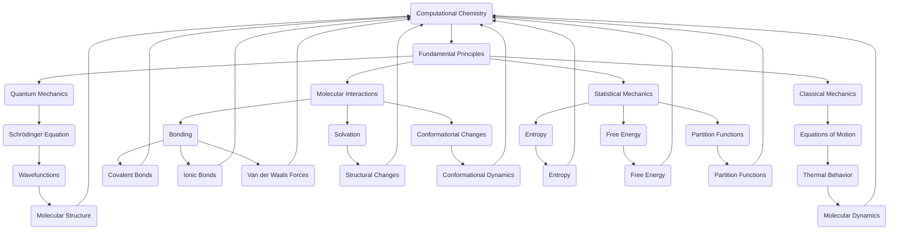
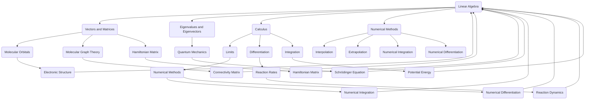

                 

### Mathematics and Computational Chemistry: Mathematical Predictions of Molecular Structures

#### Keywords:
- Computational Chemistry
- Molecular Structure Prediction
- Quantum Mechanics
- Linear Algebra
- Numerical Methods
- Machine Learning

#### Abstract:
This article explores the intersection of mathematics and computational chemistry, focusing on the mathematical principles and algorithms that enable the prediction of molecular structures. By delving into the core concepts of computational chemistry, quantum mechanics, and the mathematical tools used in molecular dynamics simulations, we aim to provide a comprehensive understanding of how mathematical models are applied to predict molecular structures. The article concludes with insights into the current state of research and future directions in this exciting field.

### Introduction

The study of chemical compounds and their properties has a long and rich history, dating back to ancient civilizations that used various mixtures for medicinal and practical purposes. However, the modern understanding of chemistry truly began in the 18th and 19th centuries with the development of atomic theory and molecular concepts. In the late 19th and early 20th centuries, the field of computational chemistry emerged, utilizing mathematical and physical principles to model and predict the behavior of chemical systems.

Computational chemistry involves the use of computers to solve the mathematical equations that describe chemical processes. These equations range from classical molecular dynamics simulations to complex quantum mechanical calculations. The advent of powerful computers in the latter half of the 20th century revolutionized the field, enabling scientists to tackle problems that were previously intractable.

The significance of computational chemistry lies in its ability to provide insights into chemical phenomena that are difficult or impossible to study experimentally. For example, it can predict the structure and properties of molecules that have not yet been synthesized or studied in detail. This has wide-ranging applications in drug discovery, materials science, and environmental chemistry, among others.

Mathematics plays a crucial role in computational chemistry by providing the necessary tools to model and solve the complex equations that describe chemical systems. Key mathematical concepts such as linear algebra, calculus, and numerical methods are indispensable in this field. Furthermore, the development of advanced algorithms and machine learning techniques has further enhanced the predictive power of computational models.

In this article, we will delve into the core concepts and principles of computational chemistry and mathematics, exploring how these tools are used to predict molecular structures. We will begin by discussing the fundamental concepts and relationships in computational chemistry and the role of mathematics within this field. Subsequently, we will delve into quantum mechanics principles and their application in computational chemistry. Finally, we will examine specific mathematical models and algorithms used in molecular structure prediction, providing detailed explanations and examples. Through this journey, we aim to illuminate the intricate interplay between mathematics and computational chemistry, showcasing their combined potential to unlock the mysteries of the molecular world.

### Core Concepts and Relations in Computational Chemistry

#### Computational Chemistry Basics

Computational chemistry is a subfield of chemistry that utilizes computer simulations and algorithms to study the physical properties and behavior of chemical systems. At its core, computational chemistry aims to solve the equations that govern the behavior of atoms and molecules, providing insights that complement or even replace traditional experimental methods.

The foundation of computational chemistry lies in the concept of molecular modeling. Molecular modeling involves creating mathematical models of molecules to predict their properties and interactions. These models can range from simple empirical formulas to complex quantum mechanical calculations. The accuracy and complexity of the models depend on the level of theory used and the computational resources available.

The importance of computational chemistry cannot be overstated. It provides a powerful tool for understanding and predicting the behavior of molecules, which is essential for various fields such as drug discovery, materials science, and environmental chemistry. By enabling scientists to explore chemical systems that are impossible or impractical to study experimentally, computational chemistry has revolutionized the way we approach scientific research and problem-solving.

#### Fundamental Principles

At the heart of computational chemistry are several fundamental principles that guide the development and application of molecular models:

1. **Quantum Mechanics**: Quantum mechanics provides the foundation for understanding the behavior of atoms and molecules at the microscopic level. The Schrödinger equation, which describes the time-evolution of quantum systems, is a cornerstone of computational chemistry. Solutions to the Schrödinger equation yield wavefunctions, which represent the probability distribution of the particles in a molecule.

2. **Classical Mechanics**: While quantum mechanics is essential for describing the behavior of atoms and molecules, classical mechanics is also used in certain scenarios, particularly when dealing with larger systems or when the quantum effects are negligible. Classical molecular dynamics simulations involve integrating the equations of motion for a system of particles to study its dynamics over time.

3. **Molecular Interactions**: The interactions between molecules are crucial for understanding their properties and behavior. These interactions include bonding (covalent, ionic, and van der Waals forces), solvation effects, and conformational changes. Computational models must incorporate these interactions to accurately predict molecular properties.

4. **Statistical Mechanics**: Statistical mechanics provides a framework for understanding the macroscopic properties of a system from the microscopic behavior of its constituents. Concepts such as entropy, free energy, and partition functions are essential for analyzing the thermodynamics of molecular systems.

#### Computational Models in Chemistry

Computational models in chemistry can be broadly classified into several categories based on the level of theory and the complexity of the models:

1. **Molecular Mechanics**: Molecular mechanics is a simplified model that describes the motion of atoms in a molecule using classical mechanics principles. It involves calculating the potential energy of a system based on the positions of the atoms and the bonds between them. Techniques such as the force field method are commonly used in molecular mechanics. This method is relatively computationally efficient and is often used for simulating large systems or studying long-time dynamics.

2. **Molecular Dynamics (MD)**: Molecular dynamics is an extension of molecular mechanics that incorporates the effects of both bond stretching and angle bending. In MD simulations, the equations of motion are integrated over time to study the dynamics of a system. These simulations can provide insights into the thermal behavior, structural changes, and conformational dynamics of molecules.

3. **Quantum Mechanics Calculations**: Quantum mechanics calculations aim to solve the Schrödinger equation for a molecular system. These calculations can range from simple Hartree-Fock theory to more advanced methods such as density functional theory (DFT) and coupled-cluster methods. Quantum mechanical calculations provide highly accurate descriptions of molecular structures and properties, but they are computationally intensive and often require specialized software and hardware.

4. **Molecular Orbital Theory**: Molecular orbital theory is a quantum mechanical approach that describes the electronic structure of molecules. It involves combining atomic orbitals to form molecular orbitals, which are used to calculate the energy levels and molecular properties of a system. Techniques such as the Hückel method and linear combination of atomic orbitals (LCAO) are commonly used in molecular orbital theory.

#### Mermaid Flowchart: Core Concepts and Relations

The following Mermaid flowchart illustrates the core concepts and their relationships in computational chemistry:



In conclusion, the core concepts and relations in computational chemistry encompass a wide range of fundamental principles and models. By understanding these concepts and their interconnections, scientists can develop and apply sophisticated computational methods to study and predict the behavior of chemical systems. In the following sections, we will delve deeper into the mathematical tools used in computational chemistry and explore their applications in molecular structure prediction.

### Mathematics in Computational Chemistry

Mathematics plays a pivotal role in computational chemistry, providing the necessary tools to model and solve the complex equations that describe chemical systems. Key mathematical concepts such as linear algebra, calculus, and numerical methods are indispensable in this field. This section will explore these mathematical tools and their applications in computational chemistry.

#### Linear Algebra

Linear algebra is the foundation of many computational techniques used in chemistry. It deals with vector spaces, linear transformations, and matrices, which are essential for describing the structure and behavior of chemical systems.

1. **Vectors and Matrices**:
   - **Vectors**: In linear algebra, a vector is a mathematical object that represents both magnitude and direction. In the context of computational chemistry, vectors can represent atomic positions, molecular orbitals, or force fields.
   - **Matrices**: A matrix is a rectangular array of numbers used to represent linear transformations or systems of linear equations. In computational chemistry, matrices are used to encode the properties of chemical systems, such as the Hamiltonian matrix in quantum mechanics or the connectivity matrix in molecular graph theory.

2. **Eigenvalues and Eigenvectors**:
   - **Eigenvectors**: Eigenvectors are vectors that remain unchanged in direction when a linear transformation is applied to them. In quantum mechanics, eigenvectors correspond to the molecular orbitals of a molecule, which are crucial for understanding the electronic structure.
   - **Eigenvalues**: Eigenvalues are scalar values associated with eigenvectors, representing the magnitude of the scaling factor applied by a linear transformation. In quantum mechanics, eigenvalues correspond to the energy levels of molecular orbitals.

#### Calculus

Calculus is essential for understanding the behavior of chemical systems over time and space. Key concepts in calculus include limits, differentiation, and integration.

1. **Limits**:
   - Limits provide a way to describe the behavior of a function as its input approaches a specific value. In computational chemistry, limits are used to define the precision of numerical methods and to ensure the accuracy of solutions to differential equations.

2. **Differentiation**:
   - Differentiation is the process of finding the derivative of a function, which represents the rate of change of the function with respect to its input. In computational chemistry, differentiation is used to calculate reaction rates, gradients of potential energy surfaces, and other critical properties.

3. **Integration**:
   - Integration is the process of finding the area under the curve of a function. In computational chemistry, integration is used to calculate the total energy of a system, the potential energy surface, and to solve differential equations describing the dynamics of molecular systems.

#### Numerical Methods

Numerical methods are used to approximate solutions to complex mathematical problems that cannot be solved analytically. In computational chemistry, numerical methods are indispensable for simulating the behavior of chemical systems.

1. **Interpolation and Extrapolation**:
   - **Interpolation**: Interpolation is the process of estimating values between known data points. In computational chemistry, interpolation is used to construct potential energy surfaces and to approximate the behavior of molecular systems over a given range.
   - **Extrapolation**: Extrapolation is the process of estimating values beyond the range of known data points. Extrapolation is used to extend the results of numerical simulations beyond the domain of the data.

2. **Numerical Integration and Differentiation**:
   - **Numerical Integration**: Numerical integration methods are used to approximate the value of a function integrated over a given interval. In computational chemistry, numerical integration is used to calculate the potential energy and other thermodynamic properties of molecular systems.
   - **Numerical Differentiation**: Numerical differentiation methods are used to approximate the derivative of a function at a given point. In computational chemistry, numerical differentiation is used to calculate gradients of potential energy surfaces and to study the dynamics of molecular systems.

#### Mermaid Flowchart: Mathematical Tools in Computational Chemistry

The following Mermaid flowchart illustrates the relationship between key mathematical concepts and their applications in computational chemistry:



In conclusion, mathematics is a crucial tool in computational chemistry, providing the foundational concepts and techniques necessary to model and solve the complex problems encountered in chemical systems. The interplay between linear algebra, calculus, and numerical methods enables scientists to develop and apply sophisticated computational models that unlock the mysteries of the molecular world. In the following sections, we will delve deeper into quantum mechanics principles and their application in computational chemistry.

### Quantum Mechanics Principles

Quantum mechanics is a fundamental theory in physics that provides a description of the physical properties of nature at the scale of atoms and subatomic particles. The principles of quantum mechanics have revolutionized our understanding of chemical systems, enabling the prediction of molecular structures and properties with unprecedented accuracy. In this section, we will delve into the core principles of quantum mechanics and explore their application in computational chemistry.

#### Schrödinger Equation

The Schrödinger equation is a fundamental equation in quantum mechanics that describes the time evolution of quantum systems. There are two main forms of the Schrödinger equation: the time-dependent Schrödinger equation (TDSE) and the time-independent Schrödinger equation (TISE).

1. **Time-Dependent Schrödinger Equation (TDSE)**:
   The TDSE is given by the following equation:
   $$i\hbar \frac{\partial \psi(x,t)}{\partial t} = \hat{H}\psi(x,t)$$
   where \(i\) is the imaginary unit, \(\hbar\) is the reduced Planck constant, \(\psi(x,t)\) is the wavefunction describing the quantum system, and \(\hat{H}\) is the Hamiltonian operator representing the total energy of the system.

   The TDSE provides a solution for the time evolution of a quantum system. By solving the TDSE, we can determine the wavefunction \(\psi(x,t)\) at any given time, which in turn allows us to calculate the probability distribution of the particle's position and momentum.

2. **Time-Independent Schrödinger Equation (TISE)**:
   The TISE is given by the following equation:
   $$\hat{H}\psi(x) = E\psi(x)$$
   where \(E\) is the energy eigenvalue corresponding to the wavefunction \(\psi(x)\).

   The TISE is used to determine the stationary states of a quantum system, i.e., the states that do not change with time. By solving the TISE, we can find the energy eigenvalues and corresponding energy eigenfunctions (also known as molecular orbitals) that describe the electronic structure of a molecule.

#### Wave Functions and Molecular Orbitals

Wave functions are fundamental mathematical objects in quantum mechanics that describe the state of a quantum system. In the context of molecules, wave functions provide information about the probability distribution of electron positions and the energy levels of the electrons.

1. **Wave Functions**:
   The wave function \(\psi(x)\) describes the probability amplitude of finding an electron at a given position \(x\). The square of the wave function, \(|\psi(x)|^2\), gives the probability density of finding the electron at that position.

2. **Molecular Orbitals**:
   Molecular orbitals are the linear combinations of atomic orbitals (LCAO) that form the basis of the electronic structure of a molecule. In the LCAO method, atomic orbitals from different atoms are combined to create molecular orbitals that describe the spatial distribution of the electrons in the molecule.

   - **Bonding Orbitals**: These molecular orbitals have lower energy than the individual atomic orbitals and contribute to the formation of chemical bonds. When two atomic orbitals overlap constructively, they form bonding molecular orbitals.
   - **Antibonding Orbitals**: These molecular orbitals have higher energy than the individual atomic orbitals and can weaken or break chemical bonds. When two atomic orbitals overlap destructively, they form antibonding molecular orbitals.

#### Quantum Algorithms

Quantum algorithms are a class of algorithms that harness the unique properties of quantum systems to solve certain problems more efficiently than classical algorithms. Quantum algorithms have the potential to revolutionize computational chemistry by enabling the simulation of complex molecular systems and the optimization of chemical reactions.

1. **Quantum Circuit Design**:
   Quantum circuits are the analog of classical logic gates in quantum computing. Quantum circuits consist of quantum gates that perform operations on quantum bits (qubits) to manipulate the state of a quantum system.

2. **Quantum Search Algorithms**:
   Quantum search algorithms, such as the Grover's algorithm, can search an unsorted database more efficiently than classical search algorithms. In the context of computational chemistry, quantum search algorithms can be used to find optimal solutions for molecular optimization problems, such as finding the minimum energy configuration of a molecule.

3. **Quantum Simulation of Molecular Systems**:
   Quantum simulation involves mapping a quantum system to a molecular system to study its properties. Quantum simulators can be used to perform high-fidelity simulations of complex molecular systems, providing insights that are otherwise inaccessible using classical methods.

In conclusion, the principles of quantum mechanics, particularly the Schrödinger equation and the concept of molecular orbitals, provide the foundation for understanding and predicting the behavior of chemical systems. The development of quantum algorithms further enhances the capabilities of computational chemistry, enabling the study of complex molecular systems and the optimization of chemical reactions. In the following sections, we will explore specific mathematical models and algorithms used in molecular structure prediction and their applications in computational chemistry.

### Molecular Dynamics and Simulation

Molecular dynamics (MD) simulation is a computational approach that uses classical molecular mechanics to study the behavior of atoms and molecules over time. MD simulations are based on the principles of classical mechanics and are widely used to investigate a variety of properties, including molecular conformational changes, thermodynamics, and kinetic processes. This section will delve into the basic concepts of molecular dynamics, the methods for simulating molecular systems, and the various techniques used in energy minimization.

#### Basic Concepts

The fundamental concept of molecular dynamics is the simulation of the motion of atoms and molecules in a system, taking into account the forces acting between them. These forces can be described using classical potentials, such as the Lennard-Jones potential or the Morse potential, which approximate the interactions between atoms and molecules.

1. **Particle Motion**:
   In a molecular dynamics simulation, the positions and velocities of all particles in the system are updated iteratively using the equations of motion. The equations of motion are derived from Newton's second law of motion:
   $$m\frac{d^2r_i}{dt^2} = -\nabla U(r_i)$$
   where \(m\) is the mass of the particle, \(r_i\) is its position, and \(U(r_i)\) is the potential energy function.

2. **Forces and Interactions**:
   The forces between particles are calculated from the potential energy function. For example, in the Lennard-Jones potential, the force is given by:
   $$F(r) = -\frac{dU(r)}{dr}$$
   Forces are used to update the velocities and positions of particles according to the equations of motion.

3. **Equations of Motion**:
   The equations of motion are typically integrated numerically using techniques such as the Verlet algorithm or the Velocity-Verlet algorithm. These algorithms provide stable and efficient methods for updating the positions and velocities of particles over time.

#### Molecular Dynamics Simulations

Molecular dynamics simulations involve several key steps:

1. **System Setup**:
   The initial configuration of the system is defined, including the positions, velocities, and temperatures of the particles. Boundary conditions are also specified to ensure that particles do not escape the simulation box.

2. **Energy Minimization**:
   Before running the simulation, it is often necessary to minimize the potential energy of the system to remove any initial distortions or energy barriers. Common methods for energy minimization include the steepest descent algorithm and the conjugate gradient method.

3. **Simulation Run**:
   Once the system is energy minimized, the simulation run begins. The positions and velocities of the particles are updated at each time step using the equations of motion. The simulation continues for a specified duration or until a desired equilibrium state is reached.

4. **Analysis and Visualization**:
   After the simulation run, various properties of the system are analyzed, such as the potential energy, temperature, and pressure. Visualization techniques are used to examine the structural and dynamic behavior of the system.

#### Energy Minimization Algorithms

Energy minimization is a crucial step in molecular dynamics simulations, as it helps to remove any initial distortions or energy barriers that could affect the accuracy of the simulation. Several algorithms are used for energy minimization:

1. **Steepest Descent Algorithm**:
   The steepest descent algorithm is a simple gradient-based method that minimizes the potential energy of a system by moving in the direction of the negative gradient of the potential energy function. The algorithm updates the positions of the particles using the following formula:
   $$r_i(t+\Delta t) = r_i(t) - \alpha \nabla U(r_i(t))$$
   where \(\alpha\) is a step size parameter.

2. **Conjugate Gradient Method**:
   The conjugate gradient method is an iterative algorithm that minimizes the potential energy of a system by searching for directions that are mutually conjugate. This method is generally more efficient than the steepest descent algorithm and converges faster to the minimum energy configuration.

3. **L-BFGS Algorithm**:
   The limited-memory Broyden-Fletcher-Goldfarb-Shanno (L-BFGS) algorithm is a quasi-Newton method that approximates the Hessian matrix of the potential energy function using a limited amount of memory. This method is often used for large-scale systems where the Hessian matrix is too large to be stored explicitly.

In conclusion, molecular dynamics simulations are a powerful tool for studying the behavior of atoms and molecules over time. By understanding the basic concepts and techniques used in molecular dynamics, scientists can gain valuable insights into the dynamics and thermodynamics of molecular systems. In the following sections, we will explore the principles of quantum mechanics and their application in computational chemistry, further enhancing our ability to predict and understand the properties of chemical systems.

### Quantum Mechanics and Molecular Orbitals

Quantum mechanics plays a crucial role in understanding the electronic structure of molecules, which in turn governs their chemical properties and reactivity. Molecular orbitals are the foundation of this quantum mechanical description, providing insights into how electrons are distributed within a molecule. This section will delve into the theory of molecular orbitals, the Hückel method, and the concept of linear combination of atomic orbitals (LCAO).

#### Molecular Orbital Theory

Molecular orbital theory is a quantum mechanical approach that describes the behavior of electrons in molecules. The theory is based on the idea that atomic orbitals from different atoms can combine to form new molecular orbitals that describe the electronic structure of the molecule. These molecular orbitals are characterized by their energy levels and spatial distribution.

1. **Linear Combination of Atomic Orbitals (LCAO)**:
   The LCAO method is a common approach used to construct molecular orbitals. In this method, atomic orbitals from individual atoms are combined linearly to form molecular orbitals. The general form of the molecular orbital wavefunction can be written as:
   $$\phi_{\mu}(r_1, r_2, ..., r_n) = \sum_{i=1}^{N} c_{i\mu} \phi_{i}(r_1) \phi_{i}(r_2) ... \phi_{i}(r_n)$$
   where \(\phi_{i}(r)\) represents the atomic orbital, \(c_{i\mu}\) are the coefficients that determine the shape and energy of the molecular orbital, and \(\mu\) denotes the molecular orbital index.

2. **Hückel Method**:
   The Hückel method is a simplified version of molecular orbital theory that is particularly useful for studying organic molecules. It is based on the idea that the energy levels and shapes of molecular orbitals can be approximated by the following equation:
   $$E_{\mu} = \sum_{\alpha} c_{\alpha\mu}^2 \epsilon_{\alpha}$$
   where \(E_{\mu}\) is the energy of the molecular orbital, \(\epsilon_{\alpha}\) is the energy of the atomic orbital, and \(c_{\alpha\mu}\) are the overlap integrals that describe the interaction between atomic orbitals.

The Hückel method is particularly useful for understanding the electronic structure of conjugated systems, such as benzene and other aromatic compounds. By using the Hückel method, it is possible to predict the energy levels and stability of molecular orbitals in these systems.

#### Quantum Chemical Calculations

Quantum chemical calculations are used to determine the energy levels, molecular orbitals, and other properties of molecules. These calculations can range from simple Hartree-Fock (HF) theory to more advanced methods such as density functional theory (DFT) and coupled-cluster methods. The following are some key methods used in quantum chemical calculations:

1. **Hartree-Fock Method**:
   The Hartree-Fock method is a self-consistent field (SCF) method that solves the Hartree-Fock equations to determine the electronic structure of a molecule. The general form of the Hartree-Fock equations is:
   $$\hat{H}\phi_i = \epsilon_i \phi_i$$
   where \(\hat{H}\) is the Hartree-Fock Hamiltonian, \(\epsilon_i\) are the orbital energies, and \(\phi_i\) are the molecular orbitals. The SCF procedure iteratively updates the molecular orbitals and orbital energies until convergence is achieved.

2. **Density Functional Theory (DFT)**:
   Density functional theory is an alternative to the Hartree-Fock method that uses the density of electrons in a system to describe its electronic structure. DFT is based on the Hohenberg-Kohn theorems, which state that the ground-state properties of a system can be expressed in terms of its electron density. DFT calculations involve solving the Kohn-Sham equations, which are similar to the Hartree-Fock equations but with a different Hamiltonian.

3. **Coupled-Cluster Methods**:
   Coupled-cluster methods are among the most accurate methods for calculating the electronic structure of molecules. These methods take into account both the singles and doubles excitations of electrons, providing highly accurate energies and molecular orbitals. The general form of the coupled-cluster equations is:
   $$E = \sum_{i}^{\infty} \sum_{j}^{\infty} T_{ij} C_{ij}$$
   where \(T_{ij}\) are the two-electron integrals and \(C_{ij}\) are the coupled-cluster amplitudes.

#### Mermaid Flowchart: Quantum Chemical Calculations

The following Mermaid flowchart illustrates the key steps in quantum chemical calculations:

```mermaid
graph TD
A(Quantum Chemical Calculations)
A --> B(Hartree-Fock Method)
A --> C(Density Functional Theory)
A --> D(Coupled-Cluster Methods)
B --> E(Self-Consistent Field (SCF) Procedure)
C --> F(Kohn-Sham Equations)
D --> G(Coupled-Cluster Equations)
E --> H(Hartree-Fock Hamiltonian)
E --> I(Orbital Energies)
E --> J(Molecular Orbitals)
F --> K(Electron Density)
F --> L(Kohn-Sham Hamiltonian)
G --> M(Two-Electron Integrals)
G --> N(Coupled-Cluster Amplitudes)
H --> O(Electronic Structure)
I --> O
J --> O
K --> O
L --> O
M --> O
N --> O
O --> P(Predicting Molecular Properties)
```

In conclusion, quantum mechanics and molecular orbital theory provide a powerful framework for understanding and predicting the electronic structure and properties of molecules. By using various quantum chemical calculation methods, scientists can gain valuable insights into the behavior of molecules and design new materials and drugs with desired properties. In the following sections, we will explore specific mathematical models and algorithms used in molecular structure prediction and their applications in computational chemistry.

### Applications of Quantum Mechanics in Molecular Structure Prediction

Quantum mechanics has significantly advanced our ability to predict and understand the structure and properties of molecules. By utilizing the principles of quantum mechanics, computational chemists can model and simulate molecular systems with a high degree of accuracy, enabling the prediction of molecular structures and properties. This section will delve into the applications of quantum mechanics in molecular structure prediction, focusing on quantum mechanical calculations and their role in predicting molecular properties.

#### Quantum Mechanical Calculations

Quantum mechanical calculations are essential for predicting molecular structures and properties. These calculations involve solving the Schrödinger equation or its approximations to obtain the wavefunction of a molecular system. The wavefunction provides information about the spatial distribution of electrons and the energy levels of the electrons within the molecule. There are several key methods used in quantum mechanical calculations:

1. **Hartree-Fock Method**:
   The Hartree-Fock method is a widely used approach for calculating the electronic structure of molecules. It is a self-consistent field (SCF) method that solves the Hartree-Fock equations, which are based on the assumption that the electron density is a product of one-electron wavefunctions (orbitals). The general form of the Hartree-Fock equations is:

   $$\hat{H}\phi_i = \epsilon_i \phi_i$$

   where \(\hat{H}\) is the Hartree-Fock Hamiltonian, \(\epsilon_i\) are the orbital energies, and \(\phi_i\) are the molecular orbitals. The SCF procedure iteratively updates the orbitals and energies until convergence is achieved. The resulting molecular orbitals provide insights into the electronic structure of the molecule and can be used to predict molecular properties such as bond lengths and angles.

2. **Density Functional Theory (DFT)**:
   Density functional theory (DFT) is an alternative to the Hartree-Fock method that uses the electron density to describe the electronic structure of a system. DFT is based on the Hohenberg-Kohn theorems, which state that the ground-state properties of a system can be expressed in terms of its electron density. DFT calculations involve solving the Kohn-Sham equations, which are similar to the Hartree-Fock equations but with a different Hamiltonian. The Kohn-Sham equations are given by:

   $$\hat{H}_{\text{KS}}\phi_i = \epsilon_i \phi_i$$

   where \(\hat{H}_{\text{KS}}\) is the Kohn-Sham Hamiltonian, \(\epsilon_i\) are the orbital energies, and \(\phi_i\) are the molecular orbitals. The electron density is then used to obtain the total energy and other properties of the system.

3. **Molecular Orbital Theory**:
   Molecular orbital theory is another approach used in quantum mechanical calculations. This theory is based on the linear combination of atomic orbitals (LCAO) to form molecular orbitals that describe the spatial distribution of electrons in the molecule. The LCAO method involves constructing molecular orbitals by combining atomic orbitals from different atoms using linear combinations. The resulting molecular orbitals provide insights into the bonding and anti-bonding interactions within the molecule.

#### Predicting Molecular Properties

Quantum mechanical calculations are powerful tools for predicting molecular properties, including bond lengths, angles, and energies. These predictions are based on the obtained molecular orbitals and the associated orbital energies. Here are some examples of how quantum mechanical calculations can be used to predict molecular properties:

1. **Bond Lengths and Angles**:
   Bond lengths and angles can be predicted by analyzing the molecular orbitals. In particular, the overlap of bonding molecular orbitals contributes to the stability of the bond, while the overlap of antibonding orbitals weakens the bond. By examining the energy levels and spatial distribution of molecular orbitals, it is possible to predict the optimal bond lengths and angles for a given molecular system.

2. **Electron Density**:
   The electron density provides valuable information about the spatial distribution of electrons in a molecule. By analyzing the electron density, it is possible to identify regions of high electron density, which are often associated with bonding interactions. This information can be used to predict the structure and reactivity of molecules.

3. **Molecular Energy**:
   The total energy of a molecule can be predicted by summing the contributions from the individual molecular orbitals. The energy levels of the molecular orbitals provide insights into the stability of the molecule and can be used to compare different molecular systems.

#### Example: Predicting the Structure of Ethylene

To illustrate the application of quantum mechanical calculations in predicting molecular properties, let's consider the case of ethylene (C₂H₄). Ethylene is a simple organic molecule that plays a crucial role in polymer chemistry and biological processes. We will use the Hartree-Fock method to predict its molecular structure and properties.

1. **Geometry Optimization**:
   The first step is to optimize the geometry of the ethylene molecule. This is done by solving the Hartree-Fock equations to obtain the molecular orbitals and their energies. The resulting orbitals are used to calculate the electron density, which is then used to determine the optimal geometry. In the optimized structure, the carbon-carbon double bond has a bond length of approximately 1.34 Å and the carbon-hydrogen bond lengths are around 1.09 Å.

2. **Molecular Orbital Analysis**:
   The molecular orbitals of ethylene can be analyzed to understand the bonding and anti-bonding interactions. The highest occupied molecular orbital (HOMO) is a bonding molecular orbital that contributes to the stability of the molecule, while the lowest unoccupied molecular orbital (LUMO) is an anti-bonding orbital that can affect the reactivity of the molecule.

3. **Energy Calculation**:
   The total energy of the optimized ethylene molecule can be calculated using the obtained molecular orbitals. The energy provides insights into the stability of the molecule and can be used to compare it with other molecular systems.

In conclusion, quantum mechanical calculations are essential for predicting the structure and properties of molecules. By solving the Schrödinger equation or its approximations, computational chemists can obtain molecular orbitals and other relevant information that enables the prediction of molecular properties. The example of ethylene illustrates the practical application of these calculations in understanding the molecular structure and properties of simple organic molecules. In the following sections, we will explore the application of machine learning techniques in molecular structure prediction and their role in advancing the field of computational chemistry.

### Applications of Machine Learning in Molecular Structure Prediction

Machine learning (ML) techniques have recently gained significant attention in the field of molecular structure prediction, offering powerful tools for the analysis and prediction of molecular properties. By leveraging large datasets and advanced algorithms, machine learning models can identify complex patterns and relationships that are difficult to uncover using traditional computational methods. This section will explore the applications of machine learning in molecular structure prediction, focusing on data preparation, feature extraction, and the use of ML models for predicting molecular properties.

#### Data Preparation

The first step in applying machine learning to molecular structure prediction is data preparation. This involves gathering a large dataset of molecules with known properties, such as bond lengths, angles, energies, and chemical reactivity. The quality and quantity of the data are crucial for the performance of the ML models. Several techniques can be used to prepare the data for machine learning:

1. **Dataset Collection**:
   Molecules can be collected from various sources, including experimental databases, quantum mechanical calculations, and molecular dynamics simulations. Examples of popular datasets include the QM9 and QM7 datasets, which contain small molecules with a variety of properties.

2. **Data Cleaning**:
   The collected data may contain errors, missing values, or outliers. Data cleaning techniques, such as imputation and outlier detection, can be used to address these issues. Imputation methods, such as mean substitution or k-nearest neighbors, can be used to fill in missing values. Outliers can be detected using statistical methods, such as z-score analysis or the Interquartile Range (IQR) method, and can be removed or corrected.

3. **Data Preprocessing**:
   Preprocessing techniques, such as normalization and scaling, can be used to transform the data into a suitable format for machine learning. Normalization techniques, such as Min-Max scaling or Standardization, ensure that the features have a similar range and variance, which can improve the performance of the ML models.

#### Feature Extraction

Feature extraction is a critical step in the machine learning pipeline, as it transforms the raw molecular data into a set of features that can be used to train the models. Several techniques can be used for feature extraction in molecular structure prediction:

1. **Molecular Descriptors**:
   Molecular descriptors are numerical properties that characterize the molecular structure. Common molecular descriptors include geometric descriptors (e.g., bond lengths, angles, and torsional angles) and topological descriptors (e.g., molecular connectivity indices and graph invariants). These descriptors can be calculated from the molecular graph or the molecular orbitals.

2. **Quantum Mechanical Properties**:
   Quantum mechanical properties, such as electron density, energy levels, and molecular orbitals, can be extracted from quantum mechanical calculations. These properties provide detailed information about the electronic structure of the molecule and can be used as features in machine learning models.

3. **Representation Learning**:
   Representation learning techniques, such as graph convolutional networks (GCNs) and message passing neural networks (MPNNs), can be used to learn hierarchical representations of molecular graphs. These techniques can capture the complex relationships between atoms and bonds in the molecule, providing powerful features for ML models.

#### Machine Learning Models

Several machine learning models have been successfully applied to molecular structure prediction, including support vector machines (SVMs), decision trees, neural networks, and deep learning models. Here are some examples of ML models used in molecular structure prediction:

1. **Support Vector Machines (SVMs)**:
   SVMs are powerful classifiers that can be used to predict molecular properties based on input features. SVMs work by finding the optimal hyperplane that separates the data into different classes. SVMs have been used to predict molecular properties such as bond lengths and angles with good accuracy.

2. **Neural Networks**:
   Neural networks are a class of ML models inspired by the structure and function of the human brain. Neural networks can learn complex relationships between input features and molecular properties by adjusting the weights of the connections between neurons. Neural networks, especially deep neural networks (DNNs), have shown great success in molecular structure prediction tasks, achieving state-of-the-art performance on various benchmarks.

3. **Deep Learning Models**:
   Deep learning models, such as convolutional neural networks (CNNs) and recurrent neural networks (RNNs), have become increasingly popular in molecular structure prediction. CNNs can capture spatial relationships in molecular structures by processing the molecular graph as an input, while RNNs can model temporal dependencies in molecular dynamics simulations. Variants of deep learning models, such as graph convolutional networks (GCNs) and message passing neural networks (MPNNs), have been specifically designed for molecular structure prediction and have achieved remarkable results.

#### Case Study: Predicting Bond Angles with Neural Networks

To illustrate the application of machine learning in molecular structure prediction, we will consider a case study where neural networks are used to predict bond angles in organic molecules. This example will demonstrate the key steps in the machine learning pipeline, including data preparation, feature extraction, model training, and evaluation.

1. **Data Preparation**:
   A dataset of organic molecules with known bond angles is collected. The dataset is preprocessed by calculating molecular descriptors, such as bond lengths, angles, and torsional angles. The data is normalized and split into training, validation, and test sets.

2. **Feature Extraction**:
   Molecular descriptors are used as input features for the neural network. These features are transformed into a suitable format for the neural network, such as one-hot encoding or embeddings.

3. **Model Training**:
   A neural network model, such as a simple feedforward neural network, is trained on the training dataset. The model is trained using backpropagation and gradient descent to minimize the prediction error. The training process involves adjusting the weights of the connections between neurons to improve the model's performance.

4. **Model Evaluation**:
   The trained model is evaluated on the validation and test sets to assess its performance. Metrics such as mean squared error (MSE) and R-squared are used to evaluate the accuracy of the model's predictions. The model is refined based on the evaluation results to improve its performance.

In conclusion, machine learning techniques have revolutionized the field of molecular structure prediction, offering powerful tools for the analysis and prediction of molecular properties. By leveraging large datasets and advanced algorithms, machine learning models can identify complex patterns and relationships in molecular data, enabling accurate predictions of molecular structures and properties. In the following sections, we will explore the future directions and challenges in computational chemistry, highlighting the potential of machine learning in advancing the field.

### Conclusion

In summary, the intersection of mathematics and computational chemistry has profoundly transformed our ability to predict and understand the behavior of molecules. From the fundamental principles of quantum mechanics to advanced algorithms in machine learning, mathematical models have enabled scientists to unravel the complexities of molecular structures and properties. The journey through this article has highlighted the core concepts and techniques that drive the field, including the interplay between linear algebra, calculus, and numerical methods, the principles of quantum mechanics, and the application of machine learning in molecular structure prediction.

As we look to the future, the potential for further advancements in computational chemistry is vast. The integration of quantum mechanics with machine learning holds the promise of revolutionizing the prediction of molecular properties, enabling the design of new materials, drugs, and catalysts with unprecedented efficiency. Additionally, the development of more sophisticated mathematical models and algorithms will continue to push the boundaries of what is possible in this field.

However, challenges remain. The high computational cost of quantum mechanical calculations, the need for large and diverse datasets for machine learning, and the complexity of accurately simulating complex molecular systems pose significant hurdles. Addressing these challenges will require ongoing research and the collaboration of experts from diverse disciplines.

For further exploration, readers are encouraged to delve into the literature on quantum mechanics, molecular dynamics, and machine learning. Key texts include "Quantum Mechanics: The Theoretical Minimum" by David J. Griffiths, "Machine Learning for Molecules" by Henry Rzepa, and "Zen and the Art of Computer Programming" by Donald E. Knuth. These resources offer valuable insights and serve as a foundation for deeper understanding and exploration in the field of computational chemistry.

