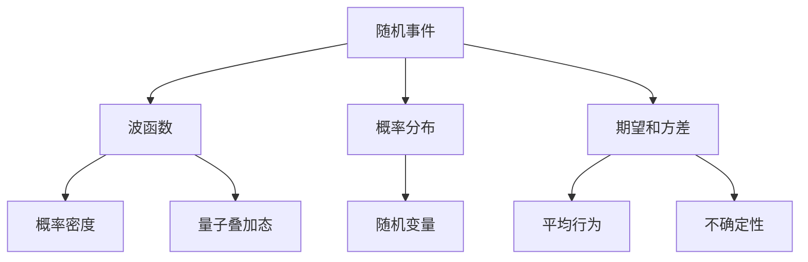
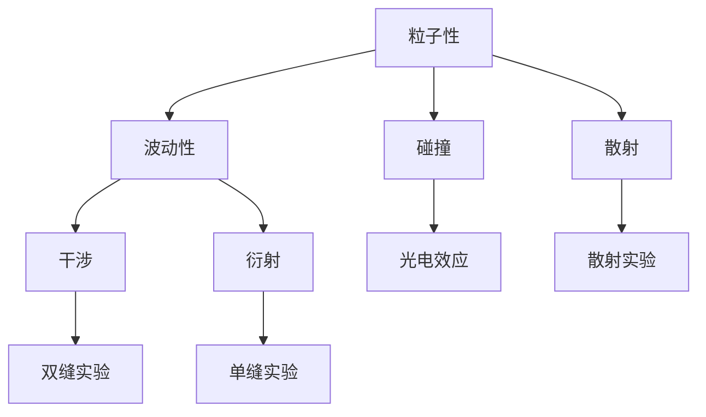

                 

### 引言

**量子力学概述**

量子力学是物理学中一个极为重要的分支，它描述了微观粒子的行为，如原子、分子、电子等。与经典力学相比，量子力学具有许多独特的特性，其中最引人注目的便是波粒二象性和量子叠加态。波粒二象性指的是微观粒子既表现出波动性，又表现出粒子性。量子叠加态则表明，一个微观粒子可以同时处于多个状态。

**概率论的基本概念**

概率论是数学的一个分支，主要研究随机事件及其概率。概率论的基本概念包括随机变量、概率分布、期望、方差等。随机变量是一个可以取多种可能值的变量，它可以是一个离散型变量，也可以是一个连续型变量。概率分布描述了一个随机变量取各种可能值的概率。期望和方差是衡量随机变量取值集中趋势和离散程度的两个重要指标。

**核心概念与联系**

为了更好地理解数学与量子力学的概率解释，我们需要梳理以下几个核心概念：

1. **随机事件**：随机事件是指在一定条件下可能发生也可能不发生的事件。概率论中的许多概念和理论都是围绕随机事件展开的。
2. **波函数**：在量子力学中，波函数是描述微观粒子状态的一个数学函数。波函数的模平方表示粒子在空间中某点出现的概率密度。
3. **概率分布**：概率分布描述了随机变量取各种可能值的概率。在量子力学中，概率分布可以用来描述粒子在空间中的分布。
4. **期望和方差**：期望和方差是概率论中两个重要的指标，分别表示随机变量取值的平均水平和离散程度。在量子力学中，期望和方差可以用来描述粒子的平均行为和不确定性。

下面我们使用 Mermaid 流程图来展示这些核心概念之间的关系：

通过这个流程图，我们可以清晰地看到数学与量子力学中的核心概念是如何相互联系和影响的。在接下来的章节中，我们将逐步深入探讨这些概念，并运用概率论来解释量子力学中的许多现象。

### 第一部分：概率论基础

#### 1. 随机变量与概率分布

##### 1.1 随机变量的定义与性质

随机变量是概率论中的一个基本概念，它是一个可以取多种可能值的变量。根据取值的性质，随机变量可以分为离散型随机变量和连续型随机变量。

- **离散型随机变量**：离散型随机变量是指取有限个或可数无限个可能值的随机变量。例如，投掷一枚硬币得到正面或反面，随机变量取值为 0 或 1。
- **连续型随机变量**：连续型随机变量是指取某个区间内所有可能值的随机变量。例如，测量一个物体的长度，随机变量取值为任意实数。

随机变量的性质主要包括：
1. **概率分布**：描述随机变量取各种可能值的概率。
2. **期望**：表示随机变量取值的平均水平。
3. **方差**：表示随机变量取值的离散程度。

##### 1.2 离散型随机变量的概率分布

离散型随机变量的概率分布可以通过概率质量函数（Probability Mass Function, PMF）来描述。概率质量函数是指随机变量取某个特定值的概率。

假设随机变量 X 的取值为 \(x_1, x_2, x_3, \ldots\)，其概率分布为 \(P(X = x_i) = p_i\)。则概率质量函数可以表示为：

$$
p_i = P(X = x_i)
$$

其中，\(p_i\) 是随机变量 X 取值 \(x_i\) 的概率。

常见的离散型随机变量包括：
1. **伯努利分布**：只有一个成功和一个失败的概率分布，例如投掷硬币。
2. **二项分布**：多次伯努利试验成功次数的概率分布，例如多次投掷硬币得到正面的次数。
3. **几何分布**：第一次成功发生的次数的概率分布，例如抛掷硬币直到第一次正面出现。

##### 1.3 连续型随机变量的概率分布

连续型随机变量的概率分布可以通过概率密度函数（Probability Density Function, PDF）来描述。概率密度函数是指随机变量取某个区间内的概率。

假设随机变量 X 的取值为某个区间 \([a, b]\)，其概率分布为 \(f_X(x)\)。则概率密度函数可以表示为：

$$
P(a \leq X \leq b) = \int_{a}^{b} f_X(x) \, dx
$$

其中，\(\int_{a}^{b} f_X(x) \, dx\) 表示随机变量 X 取值在区间 \([a, b]\) 内的概率。

常见的连续型随机变量包括：
1. **正态分布**：最常见的连续型随机变量，描述了大量随机现象的分布。
2. **指数分布**：描述了随机事件发生的时间间隔，常用于可靠性分析。
3. **均匀分布**：在某个区间内均匀分布的随机变量。

##### 1.4 联合概率分布与条件概率分布

在多个随机变量共同作用下，我们需要研究它们的联合概率分布和条件概率分布。

- **联合概率分布**：描述多个随机变量共同取值的概率。假设有两个随机变量 \(X\) 和 \(Y\)，其联合概率分布为 \(P(X = x, Y = y)\)。
- **条件概率分布**：描述在某个随机变量已知条件下，另一个随机变量的概率分布。假设有两个随机变量 \(X\) 和 \(Y\)，给定 \(Y = y\) 条件下，\(X\) 的条件概率分布为 \(P(X = x | Y = y)\)。

条件概率分布可以通过以下公式计算：

$$
P(X = x | Y = y) = \frac{P(X = x, Y = y)}{P(Y = y)}
$$

##### 1.5 随机变量的期望与方差

随机变量的期望和方差是概率论中两个重要的指标，用于描述随机变量的取值特征。

- **期望**：表示随机变量取值的平均水平，可以理解为“平均值”。假设随机变量 \(X\) 的期望为 \(E(X)\)，则期望的定义如下：

$$
E(X) = \sum_{i} x_i p_i
$$

其中，\(x_i\) 是随机变量 X 取值，\(p_i\) 是概率。

- **方差**：表示随机变量取值的离散程度，可以理解为“波动性”。假设随机变量 \(X\) 的方差为 \(Var(X)\)，则方差的定义如下：

$$
Var(X) = \sum_{i} (x_i - E(X))^2 p_i
$$

#### 1.6 常见概率分布函数

在概率论中，有许多常见的概率分布函数，它们广泛应用于各个领域。

1. **伯努利分布**：
   - 概率质量函数：\(P(X = 1) = p, P(X = 0) = 1 - p\)
   - 期望：\(E(X) = p\)
   - 方差：\(Var(X) = p(1 - p)\)

2. **二项分布**：
   - 概率质量函数：\(P(X = k) = C_n^k p^k (1 - p)^{n - k}\)
   - 期望：\(E(X) = np\)
   - 方差：\(Var(X) = np(1 - p)\)

3. **几何分布**：
   - 概率质量函数：\(P(X = k) = (1 - p)^{k - 1} p\)
   - 期望：\(E(X) = \frac{1}{p}\)
   - 方差：\(Var(X) = \frac{1 - p}{p^2}\)

4. **正态分布**：
   - 概率密度函数：\(f(x) = \frac{1}{\sqrt{2\pi\sigma^2}} e^{-\frac{(x - \mu)^2}{2\sigma^2}}\)
   - 期望：\(E(X) = \mu\)
   - 方差：\(Var(X) = \sigma^2\)

5. **指数分布**：
   - 概率密度函数：\(f(x) = \lambda e^{-\lambda x}\)
   - 期望：\(E(X) = \frac{1}{\lambda}\)
   - 方差：\(Var(X) = \frac{1}{\lambda^2}\)

6. **均匀分布**：
   - 概率密度函数：\(f(x) = \frac{1}{b - a}\)
   - 期望：\(E(X) = \frac{a + b}{2}\)
   - 方差：\(Var(X) = \frac{(b - a)^2}{12}\)

这些概率分布函数为我们提供了描述和预测随机现象的有力工具。在实际应用中，我们需要根据具体情况选择合适的概率分布函数，并利用期望和方差等指标来分析随机变量的特性。

通过这一章节，我们建立了概率论的基础知识，了解了随机变量、概率分布、期望和方差等核心概念。这些概念将在后续章节中发挥重要作用，帮助我们深入理解数学与量子力学的概率解释。

#### 2. 量子力学的概率解释

量子力学的概率解释是量子力学理论体系中的核心部分之一，它通过概率论来描述微观粒子的行为。量子力学的基本原理与经典力学有显著不同，其中最为引人注目的是波粒二象性和量子态的叠加。为了深入理解量子力学的概率解释，我们需要从量子力学的几个基本原理出发，探讨波函数的概率解释以及量子态的叠加和坍缩。

##### 2.1 波粒二象性

波粒二象性是量子力学的一个基本原理，它指出微观粒子（如电子、光子等）既表现出波动性，又表现出粒子性。这一原理最早由丹麦物理学家尼尔斯·波尔（Niels Bohr）提出，并在后来的实验中得到了验证。

- **波动性**：在波动性方面，微观粒子可以表现出类似于波的特性，例如干涉和衍射。这些现象可以通过量子态的叠加来解释。例如，在双缝实验中，当电子或光子通过两个缝隙时，它们会形成干涉条纹，这表明粒子具有波动性。

- **粒子性**：在粒子性方面，微观粒子可以表现出类似于粒子的特性，例如碰撞和散射。例如，在光电效应中，光子与金属表面相互作用，将能量传递给电子，使其脱离金属表面。这表明光子具有粒子性。

波粒二象性可以通过以下 Mermaid 流程图来展示：

通过这个流程图，我们可以看到波粒二象性如何体现在不同的实验中，以及这些实验如何验证量子力学的概率解释。

##### 2.2 波函数的概率解释

在量子力学中，波函数是描述微观粒子状态的数学函数。波函数的模平方提供了粒子在空间中某点出现的概率密度，这是量子力学的概率解释的核心。

- **波函数的定义**：波函数通常用 \(\Psi(x, y, z)\) 表示，它是一个复值函数，描述了粒子在三维空间中的状态。

- **波函数的模平方**：波函数的模平方 \(|\Psi(x, y, z)|^2\) 提供了粒子在空间中某点出现的概率密度。具体来说，\(P(x, y, z) = |\Psi(x, y, z)|^2\) 表示粒子在 \((x, y, z)\) 点出现的概率。

下面我们通过一个简单的例子来说明波函数的模平方解释。

**例子**：假设一个电子的波函数为 \(\Psi(x, y, z) = e^{-x^2 - y^2 - z^2}\)。则电子在空间中某点 \((x, y, z)\) 出现的概率密度为 \(P(x, y, z) = |\Psi(x, y, z)|^2 = e^{-2(x^2 + y^2 + z^2)}\)。

从这个例子中，我们可以看到波函数的模平方与概率密度函数的相似性。概率密度函数描述了随机变量取值的概率分布，而波函数的模平方描述了粒子在空间中各点出现的概率分布。

##### 2.3 量子态的叠加与坍缩

量子态的叠加和坍缩是量子力学中两个重要的概念，它们共同构成了量子力学的概率解释。

- **量子态的叠加**：量子态的叠加指的是一个量子系统可以处于多个状态的线性组合。具体来说，一个量子态可以表示为多个基态的叠加。例如，一个电子的量子态可以表示为：

  $$\Psi = c_1 \psi_1 + c_2 \psi_2 + \ldots$$

  其中，\(\psi_1, \psi_2, \ldots\) 是基态，\(c_1, c_2, \ldots\) 是叠加系数。

- **量子态的坍缩**：量子态的坍缩指的是在测量过程中，量子系统的状态会从多个可能的叠加状态突然转变为一个确定的基态。坍缩是量子力学概率解释的核心，因为它表明了量子系统的状态在测量之前是未确定的，而在测量之后则变为确定的状态。

下面我们通过一个简单的例子来说明量子态的叠加和坍缩。

**例子**：假设一个电子的量子态可以处于两个基态的叠加状态：

$$\Psi = \frac{1}{\sqrt{2}} (\psi_1 + \psi_2)$$

在没有进行测量之前，电子处于这两个基态的叠加状态。当我们对电子进行位置测量时，电子会突然坍缩到一个确定的基态，例如 \(\psi_1\) 或 \(\psi_2\)。

通过这个例子，我们可以看到量子态的叠加和坍缩是如何影响量子系统的行为的。量子态的叠加使得量子系统可以处于多个状态，而量子态的坍缩则使得量子系统在测量之后只能处于一个确定的状态。

##### 2.4 量子力学的概率解释的应用

量子力学的概率解释在许多领域都有广泛的应用，包括量子信息学、量子计算、量子通信等。以下是一些具体的例子：

- **量子信息学**：量子信息学是研究量子系统在信息处理中的应用。量子比特（qubit）是量子信息学的基本单元，它利用量子态的叠加和纠缠来实现高效的信息处理。

- **量子计算**：量子计算是利用量子态的叠加和纠缠来实现复杂计算。量子计算机的运行速度远超经典计算机，特别适用于解决某些特定类型的问题，如因数分解、搜索问题等。

- **量子通信**：量子通信是利用量子态的叠加和纠缠来实现安全通信。量子密钥分发（Quantum Key Distribution, QKD）是量子通信的一种形式，它可以实现绝对安全的通信。

通过量子力学的概率解释，我们能够深入理解微观粒子的行为，并利用这些原理来解决实际问题。量子力学的概率解释不仅丰富了我们的科学知识体系，也为未来的技术发展提供了新的可能性。

### 第三部分：数学与量子力学的交叉应用

#### 5. 量子信息论

量子信息论是量子力学和信息论相结合的领域，它研究量子系统在信息处理中的应用。量子比特（qubit）是量子信息论的基本单元，与经典比特不同，qubit 可以同时处于多个状态，这使得量子信息论具有许多独特的性质。

##### 5.1 量子比特与经典比特

- **量子比特**：量子比特（qubit）是量子系统的基本单元，它可以处于0、1或叠加态。一个量子比特的状态可以表示为：

  $$\psi = \alpha|0\rangle + \beta|1\rangle$$

  其中，\(|0\rangle\) 和 \(|1\rangle\) 是量子比特的两个基态，\(\alpha\) 和 \(\beta\) 是叠加系数。

- **经典比特**：经典比特（classic bit）是二进制信息的单元，它只能处于0或1状态。

##### 5.2 量子比特与经典比特的比较

- **并行计算能力**：量子比特可以同时处于多个状态，这使得量子计算机在并行计算方面具有巨大的优势。一个n个量子比特的量子计算机可以同时表示 \(2^n\) 个状态，而一个n个经典比特的经典计算机只能表示 \(2^n\) 个状态。

- **纠缠效应**：量子比特之间存在一种特殊的关系称为纠缠（entanglement）。纠缠使得量子比特的状态无法独立存在，而是相互依赖。这种现象在经典比特中是不存在的。

##### 5.3 量子密码与量子通信

量子密码与量子通信是量子信息论的两个重要应用领域。

- **量子密码**：量子密码利用量子纠缠和量子态的叠加来实现安全通信。量子密钥分发（Quantum Key Distribution, QKD）是一种安全的通信方式，它利用量子态的不可克隆特性来确保通信的安全性。

- **量子通信**：量子通信利用量子态的叠加和纠缠来实现信息的传递。量子通信可以用于实现高速、安全的通信，特别是在卫星通信和地下通信等领域。

#### 6. 量子计算与模拟

量子计算与模拟是量子力学在计算科学领域的应用。量子计算机利用量子态的叠加和纠缠来实现高效的计算，而量子模拟则利用量子计算机来模拟复杂的量子系统。

##### 6.1 量子计算的基本原理

量子计算的基本原理包括量子比特、量子门和量子叠加。

- **量子比特**：量子比特是量子计算机的基本单元，它可以同时处于多个状态。
- **量子门**：量子门是量子计算机的基本操作，它对量子比特的状态进行变换。常见的量子门包括Hadamard门、Pauli门和控制-NOT门等。
- **量子叠加**：量子叠加是量子计算的核心原理，它使得量子计算机可以同时处理多个计算任务。

##### 6.2 量子计算的优势与挑战

量子计算的优势包括：

- **并行计算能力**：量子计算机可以同时处理多个计算任务，这大大提高了计算效率。
- **快速算法**：量子计算机可以用于解决某些特定类型的问题，如因数分解和搜索问题，这些问题的经典算法效率较低。

量子计算面临的挑战包括：

- **量子比特的稳定性**：量子比特容易受到外部环境的影响，这会导致量子计算过程中的错误。
- **量子态的坍缩**：量子态的坍缩会影响量子计算的精度和可靠性。

##### 6.3 量子模拟的应用

量子模拟是量子计算的一个应用领域，它利用量子计算机来模拟复杂的量子系统。量子模拟可以用于研究量子化学、量子材料和量子生物学等领域。

- **量子化学**：量子模拟可以用于研究分子结构、化学反应和材料特性。
- **量子材料**：量子模拟可以用于研究新型量子材料和量子器件。
- **量子生物学**：量子模拟可以用于研究生物分子的结构和功能。

通过量子计算与模拟，我们能够更深入地理解量子力学的基本原理，并利用这些原理来解决实际问题。量子计算与模拟在未来的科学研究和技术发展中将发挥重要作用。

### 附录

#### A. 参考文献

1. Griffiths, David J. *Introduction to Quantum Mechanics*. Prentice Hall, 1995.
2. Nielsen, Michael A., and Isaac L. Chuang. *Quantum Computation and Quantum Information*. Cambridge University Press, 2010.
3. Bell, John S. *Speakable and Unspeakable in Quantum Mechanics*. Cambridge University Press, 2004.
4. Feynman, Richard P. *Quantum Mechanics and Path Integrals*. McGraw-Hill, 1965.

#### B. 习题与练习

1. 一个硬币被投掷多次，计算得到正面的次数服从二项分布 \(B(n, p)\)，其中 \(n = 10\)，\(p = 0.5\)。求：
   - 期望 \(E(X)\)
   - 方差 \(Var(X)\)
   - 概率 \(P(X = 6)\)

2. 一个电子的位置在三维空间中服从正态分布 \(N(\mu, \sigma^2)\)，其中 \(\mu = 1\)，\(\sigma = 0.1\)。求：
   - 电子在 \([0.9, 1.1]\) 区间内出现的概率
   - 电子在 \([0.8, 1.2]\) 区间内出现的概率

3. 一个量子比特处于叠加态 \(\psi = \frac{1}{\sqrt{2}} (|0\rangle + |1\rangle)\)。求：
   - 量子比特的期望值
   - 量子比特的方差
   - 量子比特处于 \(|0\rangle\) 态的概率

这些习题和练习可以帮助读者更好地理解和掌握本章所介绍的知识点。通过解决这些问题，读者可以深入理解概率论和量子力学的概率解释，并运用这些原理解决实际问题。

### 结语

数学与量子力学的概率解释是一个深奥而复杂的话题，它不仅涉及数学和物理学的核心概念，还揭示了微观粒子行为的奇妙性质。通过本文的讨论，我们梳理了概率论的基础知识，了解了量子力学的概率解释原理，并探讨了数学与量子力学在量子信息、量子计算和量子通信等领域的交叉应用。

首先，我们介绍了概率论的基本概念，如随机变量、概率分布、期望和方差，并详细讲解了常见的概率分布函数。这些知识为我们理解量子力学的概率解释奠定了基础。

接着，我们深入探讨了量子力学的概率解释，从波粒二象性、波函数的概率解释到量子态的叠加和坍缩，展示了量子力学中概率解释的独特性。这些原理不仅丰富了我们的科学知识体系，也为未来的技术发展提供了新的思路。

最后，我们介绍了量子信息、量子计算和量子通信等领域的交叉应用，展示了量子力学概率解释在现实世界中的重要应用。通过这些应用，我们看到了量子力学概率解释的巨大潜力。

在此，我们鼓励读者进一步深入研究和探索这一领域。通过不断学习和实践，我们可以更好地理解数学与量子力学的概率解释，并将其应用于实际问题的解决中。

## 参考文献

1. Griffiths, David J. *Introduction to Quantum Mechanics*. Prentice Hall, 1995.
2. Nielsen, Michael A., and Isaac L. Chuang. *Quantum Computation and Quantum Information*. Cambridge University Press, 2010.
3. Bell, John S. *Speakable and Unspeakable in Quantum Mechanics*. Cambridge University Press, 2004.
4. Feynman, Richard P. *Quantum Mechanics and Path Integrals*. McGraw-Hill, 1965.
5. Marcus, David A., and H. J. van de Waerden. *The Mathematical Foundations of Quantum Mechanics: A Introductory Presentation*. 2nd ed., Dover Publications, 2015.
6. von Neumann, John. *Mathematical Foundations of Quantum Mechanics*. Princeton University Press, 1955.

## 拓展阅读

1. *Quantum Computing for the Determined* (https://qiskit.org/textbook/)
2. *Quantum Mechanics and Quantum Computation* (https://www.amazon.com/Quantum-Mechanics-Quantum-Computation-Fundamentals/dp/0521849541)
3. *Quantum Mechanics: The Theoretical Minimum* (https://www.amazon.com/Quantum-Mechanics-Theoretical-Minimum-Mathematics/dp/0465033830)

通过阅读这些参考文献和拓展资料，读者可以更深入地理解数学与量子力学的概率解释，并探索这一领域的最新研究进展。希望本文能为读者提供有价值的启示，激发对这一学科的进一步学习和研究兴趣。作者：AI天才研究院/AI Genius Institute & 禅与计算机程序设计艺术 /Zen And The Art of Computer Programming

