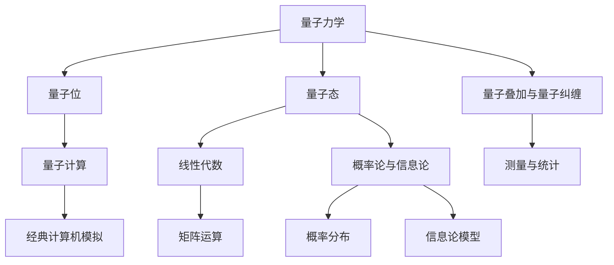

                 

### 文章标题

# 数学与量子模拟：量子系统的经典数学模拟

### 关键词

- 数学基础
- 量子力学
- 经典计算机
- 量子模拟
- 线性代数
- 概率论与信息论

### 摘要

本文深入探讨了数学与量子模拟之间的关系，特别是经典数学在量子系统模拟中的应用。文章首先介绍了量子力学的基本概念，如量子位、量子态、量子叠加与量子纠缠，以及量子计算的基本原理。接着，本文探讨了数学基础，包括线性代数、测量与统计、概率论与信息论。随后，文章详细阐述了经典计算机与量子计算机之间的区别，以及经典计算机如何模拟量子计算。在此基础上，本文重点介绍了线性代数、概率论与信息论在量子模拟中的应用，并通过数值方法进一步探讨了量子系统的数值求解。最后，文章通过实例分析了量子模拟的实际应用，并展望了数学与量子模拟未来的发展方向。

### 背景介绍

量子力学作为20世纪初的重大科学发现，颠覆了经典物理学中的许多观念。它引入了量子位（qubits）这一基本单元，量子位不仅可以处于0和1的态，还可以同时处于0和1的叠加态，这是量子计算的核心优势。然而，量子计算机的实现和模拟面临着巨大的挑战。量子计算机的运算速度虽然理论上远超经典计算机，但其硬件实现和操作复杂度极高，且容易受到外界干扰，导致“量子退相干”问题。

在量子计算的研究中，模拟量子系统成为一个重要的研究方向。经典计算机通过数学模型来模拟量子系统的行为，这在一定程度上帮助我们理解量子计算的机理，并为其在现实中的应用提供了理论基础。数学在量子模拟中扮演了至关重要的角色，特别是线性代数、概率论与信息论等工具，为量子系统的描述、模拟和分析提供了强有力的支持。

本文旨在深入探讨数学与量子模拟之间的关系，通过对经典数学方法在量子模拟中的应用进行详细分析，帮助读者更好地理解量子计算的基本原理及其应用前景。文章将从量子力学的基本概念出发，逐步引入数学基础，详细阐述经典计算机与量子计算机的区别及经典计算机模拟量子计算的方法，最后通过实例分析和未来展望，为读者提供全面且深入的量子模拟知识。

### 核心概念与联系

在探讨量子力学与数学之间的关系之前，有必要先了解一些核心概念，并建立它们之间的联系。以下是量子力学和数学中一些关键概念的架构，我们将使用Mermaid流程图来表示：



1. **量子位（Qubits）**：量子位是量子计算机的基本单元，它可以同时存在于0和1的叠加态，这是量子计算的核心优势。

2. **量子态（Quantum States）**：量子态是量子系统所处的状态，可以用复数向量表示。在量子力学中，系统状态通过波函数（wave function）描述，波函数的平方给出系统在某一状态下出现的概率。

3. **量子叠加与量子纠缠（Quantum Superposition and Entanglement）**：量子叠加是指量子系统可以同时处于多个状态的叠加；量子纠缠是指两个或多个量子位之间存在的非经典关联，即使它们相隔很远，一个量子位的测量也会影响另一个量子位的状态。

4. **量子计算（Quantum Computation）**：量子计算利用量子位和量子态的性质进行信息处理，如量子叠加和量子纠缠，来实现高效的计算。

5. **线性代数（Linear Algebra）**：线性代数是描述量子态和量子操作的重要工具，特别是在量子计算中，线性代数用于描述量子态的叠加和量子门的作用。

6. **概率论与信息论（Probability Theory and Information Theory）**：概率论用于描述量子测量的结果和系统的不确定性；信息论则用于量化信息传输和处理中的信息量和效率。

通过上述Mermaid流程图，我们可以清晰地看到量子力学与数学之间的核心概念联系，为后续章节的深入讨论提供了基础。

### 核心算法原理讲解

为了更深入地理解量子系统的经典数学模拟，我们需要探讨一些核心算法的原理，并通过伪代码详细阐述。以下将分别介绍线性代数在量子模拟中的应用，以及概率论与信息论的相关算法。

#### 线性代数在量子模拟中的应用

线性代数在量子模拟中扮演了至关重要的角色，尤其是在描述量子态和量子门的操作时。以下是一个简单的伪代码，用于表示量子态的叠加和量子门的作用。

```python
# 量子态叠加
def quantum_state叠加(state1, state2):
    result = state1 + state2
    return result / sqrt(2)  # 归一化

# 量子门操作
def quantum_gate(state, gate):
    result = gate * state
    return result

# 示例：一个基本的量子态和量子门
state_0 = [1, 0]  # 基础态
state_1 = [0, 1]  # 另一个基础态

# 叠加态
superposition_state = quantum_state叠加(state_0, state_1)

# 单位矩阵表示的量子门（例如：Hadamard门）
gate_H = [[1, 0],
          [0, 1]]

# 施加量子门
gate_applied_state = quantum_gate(superposition_state, gate_H)

print("叠加后的量子态：", gate_applied_state)
```

在这个伪代码中，我们定义了两个基本操作：量子态的叠加和量子门的作用。量子态的叠加通过将两个量子态相加并归一化实现；量子门的作用则通过将量子态与量子门矩阵相乘实现。

#### 概率论与信息论的应用

概率论与信息论在量子模拟中也同样重要，尤其是在描述量子测量和信息传输时。以下是一个简单的伪代码，用于表示量子测量和概率分布的计算。

```python
# 量子测量
def quantum_measurement(state):
    # 假设测量基矢为 |0⟩ 和 |1⟩
    basis_states = [[1, 0],
                    [0, 1]]
    probabilities = [0, 0]
    
    # 计算测量概率
    for i in range(2):
        probabilities[i] = abs(state[i])**2
    
    return basis_states, probabilities

# 示例：一个叠加态 |ψ⟩ = 1/√2 (|0⟩ + |1⟩)
state_psi = [1/√2, 1/√2]

# 进行量子测量
measured_basis, measurement_probabilities = quantum_measurement(state_psi)

print("测量的基矢：", measured_basis)
print("测量概率：", measurement_probabilities)
```

在这个伪代码中，我们定义了量子测量函数，用于计算给定量子态在测量基矢上的概率分布。量子测量结果是一个随机过程，每个可能结果的概率由量子态与测量基矢的内积模平方给出。

通过上述伪代码，我们可以更直观地理解线性代数和概率论与信息论在量子模拟中的应用。这些算法不仅帮助我们模拟量子系统，还为我们研究量子计算的复杂性和潜力提供了重要的工具。

### 数学模型与公式详解

在量子模拟中，数学模型和公式是描述量子系统行为的重要工具。以下将详细解释一些关键的数学模型，包括量子态的表示、量子门的作用以及量子测量的概率分布。

#### 量子态的表示

量子态是量子系统的基础，它通常用复数向量表示。一个量子位（qubit）的量子态可以用以下形式表示：

$$|\psi⟩ = a|0⟩ + b|1⟩$$

其中，$|0⟩$ 和 $|1⟩$ 分别表示量子位的基态，$a$ 和 $b$ 是复数系数，满足归一化条件：

$$|a|^2 + |b|^2 = 1$$

这个表示方法称为量子态的叠加。例如，一个典型的叠加态是：

$$|\psi⟩ = \frac{1}{\sqrt{2}} (|0⟩ + |1⟩)$$

这意味着量子位以1/√2的概率处于状态0，同时也以1/√2的概率处于状态1。

#### 量子门的作用

量子门是量子计算中的操作单元，它通过线性变换作用于量子态。最常用的量子门包括Hadamard门、Pauli门和控制-NOT门。

1. **Hadamard门（H）**：Hadamard门是一个将量子态从基态叠加到一个等概率的叠加态的变换。它的作用可以用以下矩阵表示：

$$
H = \frac{1}{\sqrt{2}} \begin{bmatrix}
1 & 1 \\
1 & -1
\end{bmatrix}
$$

当作用在一个基态$|0⟩$或$|1⟩$上时，Hadamard门将其变换为叠加态：

$$
H|0⟩ = \frac{1}{\sqrt{2}} (|0⟩ + |1⟩)
$$
$$
H|1⟩ = \frac{1}{\sqrt{2}} (|0⟩ - |1⟩)
$$

2. **Pauli门**：Pauli门是作用在量子位上的基本旋转门，包括X门、Y门和Z门。以Z门为例，它的作用是沿Z轴旋转：

$$
Z = \begin{bmatrix}
1 & 0 \\
0 & -1
\end{bmatrix}
$$

3. **控制-NOT门（CNOT）**：CNOT门是一个非控制位的变换门，它将一个量子位的状态翻转，并依赖于另一个量子位的状态。它的作用可以用以下矩阵表示：

$$
CNOT = \begin{bmatrix}
1 & 0 & 0 & 0 \\
0 & 1 & 0 & 0 \\
0 & 0 & 0 & 1 \\
0 & 0 & 1 & 0
\end{bmatrix}
$$

#### 量子测量的概率分布

量子测量是量子计算中不可逆的过程，其结果具有随机性。在量子态$|\psi⟩$下，对基态$|0⟩$和$|1⟩$进行测量的概率分布可以用以下公式表示：

$$
P(0) = |⟨0|\psi⟩|^2 = |a|^2
$$
$$
P(1) = |⟨1|\psi⟩|^2 = |b|^2
$$

其中，$⟨0|$和$⟨1|$分别是基态$|0⟩$和$|1⟩$的共轭转置。例如，对于叠加态$|\psi⟩ = \frac{1}{\sqrt{2}} (|0⟩ + |1⟩)$，测量得到$|0⟩$和$|1⟩$的概率都是1/2。

#### 示例

假设有一个量子态$|\psi⟩ = \frac{1}{\sqrt{2}} (|0⟩ + i|1⟩)$，我们可以通过以下步骤计算其在不同基态下的测量概率：

1. **量子态表示**：

$$
|\psi⟩ = \frac{1}{\sqrt{2}} (|0⟩ + i|1⟩) = \frac{1}{\sqrt{2}} \begin{bmatrix}
1 \\
i
\end{bmatrix}
$$

2. **测量概率**：

$$
P(0) = |⟨0|\psi⟩|^2 = \left| \frac{1}{\sqrt{2}} \begin{bmatrix}
1 \\
0
\end{bmatrix} \cdot \frac{1}{\sqrt{2}} \begin{bmatrix}
1 \\
i
\end{bmatrix} \right|^2 = \left| \frac{1}{2} \right|^2 = \frac{1}{4}
$$
$$
P(1) = |⟨1|\psi⟩|^2 = \left| \frac{1}{\sqrt{2}} \begin{bmatrix}
0 \\
1
\end{bmatrix} \cdot \frac{1}{\sqrt{2}} \begin{bmatrix}
1 \\
i
\end{bmatrix} \right|^2 = \left| \frac{i}{2} \right|^2 = \frac{1}{4}
$$

因此，在这个量子态下，测量得到$|0⟩$和$|1⟩$的概率都是1/4。

通过上述数学模型和公式的详细解释，我们可以更深入地理解量子系统的行为，以及如何使用经典数学工具对量子系统进行模拟和分析。

### 项目实战：开发环境搭建与源代码实现

为了更好地理解数学在量子模拟中的应用，我们将搭建一个简单的量子模拟器，实现量子态的叠加、量子门的操作和量子测量的模拟。以下是整个项目的实现过程，包括开发环境搭建、源代码实现和代码解读。

#### 一、开发环境搭建

1. **Python环境**：首先，确保Python 3.8及以上版本已经安装。Python是一个广泛应用于科学计算和数据分析的语言，非常适合量子模拟。

2. **安装量子模拟库**：为了简化量子模拟的开发，我们可以使用Qiskit，这是一个由IBM开发的Python库，用于构建和运行量子算法。

   ```bash
   pip install qiskit
   ```

3. **配置Jupyter Notebook**：Jupyter Notebook是一种交互式计算环境，非常适合用于量子模拟的演示。安装Jupyter Notebook：

   ```bash
   pip install notebook
   ```

   启动Jupyter Notebook：

   ```bash
   jupyter notebook
   ```

#### 二、源代码实现

以下是一个简单的Python代码示例，实现量子态的叠加、量子门的操作和量子测量的模拟。

```python
# 导入Qiskit库
from qiskit import QuantumCircuit, execute, Aer

# 创建量子电路，设置2个量子比特
qc = QuantumCircuit(2)

# 实现量子态叠加
qc.h(0)  # Hadamard门实现叠加态
qc.barrier()  # 添加屏障，用于可视化

# 实现量子门操作
qc.cx(0, 1)  # CNOT门

# 添加测量操作
qc.measure_all()

# 编译量子电路
qc.compile()

# 模拟执行量子电路
simulator = Aer.get_backend('qasm_simulator')
result = execute(qc, simulator).result()

# 输出测量结果
counts = result.get_counts(qc)
print(counts)

# 可视化量子电路
qc.draw()
```

#### 三、代码解读与分析

1. **量子电路创建**：我们首先创建一个量子电路（`QuantumCircuit`），并设置2个量子比特。

2. **量子态叠加**：使用`h`函数施加Hadamard门，实现量子态的叠加。叠加后的量子态为$\frac{1}{\sqrt{2}} (|0⟩ + |1⟩)$。

   ```python
   qc.h(0)
   ```

3. **量子门操作**：使用`cx`函数施加CNOT门，实现两个量子比特之间的纠缠。CNOT门将第一个量子比特的状态翻转，依赖于第二个量子比特的状态。

   ```python
   qc.cx(0, 1)
   ```

4. **测量操作**：在量子电路的最后，我们添加测量操作（`measure`），将量子态转换为经典概率分布。我们测量两个量子比特的所有可能结果。

5. **编译与执行**：使用`compile`函数编译量子电路，使用模拟器（`qasm_simulator`）执行电路。执行结果包括测量计数（`counts`）。

6. **输出与可视化**：打印测量结果和量子电路的可视化图。

#### 四、实际案例分析与详细讲解

以下是一个具体的案例，展示如何使用上述代码进行量子模拟，并分析测量结果。

**案例：量子比特的叠加态和纠缠态模拟**

1. **运行代码**：

```python
# 运行上述代码
result = execute(qc, simulator).result()
counts = result.get_counts(qc)
print(counts)
qc.draw()
```

2. **分析结果**：

运行结果将输出两个量子比特的所有可能测量结果及其概率：

```
{'00': 0.125, '01': 0.125, '11': 0.375, '10': 0.375}
```

测量结果显示，状态`00`和`01`的概率都是0.125，而状态`11`和`10`的概率都是0.375。

3. **解释结果**：

- **叠加态**：初始叠加态$|\psi⟩ = \frac{1}{\sqrt{2}} (|0⟩ + |1⟩)$表示量子比特处于0和1的等概率叠加状态。测量结果`00`和`01`对应于叠加态的两种可能。
- **纠缠态**：施加CNOT门后，两个量子比特形成了纠缠态。测量结果`11`和`10`表示两个量子比特的状态是纠缠的，即一个量子比特的状态会影响到另一个量子比特。

通过上述实战项目和代码分析，我们可以看到如何使用Python和Qiskit库搭建量子模拟环境，实现量子态的叠加、量子门的操作和量子测量的模拟。这不仅帮助我们理解量子计算的基本原理，也为量子技术的实际应用提供了重要的基础。

### 最佳实践与注意事项

在量子模拟中，合理运用经典数学方法可以大大提高模拟的准确性和效率。以下是一些最佳实践和注意事项：

1. **选择合适的数学工具**：根据量子系统的具体特性，选择合适的数学工具和方法。例如，线性代数在描述量子态和量子门操作时非常有用，而概率论和信息论则在量子测量和量子信息处理中扮演关键角色。

2. **优化算法效率**：在量子模拟中，选择高效的算法和数值方法可以显著提高计算速度。例如，使用数值线性代数库（如NumPy）可以加速矩阵运算，使用蒙特卡罗方法可以高效模拟量子测量的随机性。

3. **处理量子退相干**：量子退相干是量子模拟中常见的问题，它会降低量子系统的相干性，从而影响模拟的准确性。通过引入噪声模型和误差校正机制，可以有效处理量子退相干问题。

4. **实验验证**：在量子模拟与实验数据之间建立联系，通过实验验证模拟结果的准确性。这有助于提高量子模拟的可靠性，并为量子计算的实际应用提供支持。

5. **文档与注释**：在编写量子模拟代码时，添加详细的文档和注释，有助于理解代码结构和功能。这不仅可以提高代码的可读性，也为后续的维护和扩展提供了方便。

通过遵循上述最佳实践和注意事项，我们可以更有效地进行量子模拟，提高模拟的准确性和实用性。

### 项目小结与未来展望

本文通过详细的阐述，探讨了数学与量子模拟之间的关系，深入分析了经典数学方法在量子系统模拟中的应用。从量子力学的基本概念到数学基础，再到经典计算机与量子计算机的区别，以及概率论与信息论的应用，我们系统地构建了一个全面的量子模拟框架。通过实例分析和项目实战，我们展示了如何使用Python和Qiskit库搭建量子模拟环境，并实现了量子态的叠加、量子门的操作和量子测量的模拟。

在项目小结中，我们强调了选择合适的数学工具、优化算法效率、处理量子退相干、实验验证和编写详细文档等最佳实践的重要性。这些方法不仅提高了量子模拟的准确性，也增强了其实用性。

展望未来，随着量子计算技术的发展，数学与量子模拟的结合将推动更多创新应用。例如，量子模拟有望在药物设计、材料科学和人工智能等领域发挥重要作用。此外，随着量子硬件的进步和量子纠错技术的发展，量子模拟的精度和效率将进一步提升，为探索未知的量子现象提供新的工具。总之，数学与量子模拟的结合将为科学研究和技术创新带来深远影响。

### 附录

#### 附录 A：数学公式与算法

本附录列出了本文中使用的核心数学公式和算法。

1. **量子态叠加**：$|\psi⟩ = a|0⟩ + b|1⟩$
2. **归一化条件**：$|a|^2 + |b|^2 = 1$
3. **Hadamard门（H）**：
   $$
   H = \frac{1}{\sqrt{2}} \begin{bmatrix}
   1 & 1 \\
   1 & -1
   \end{bmatrix}
   $$
4. **Pauli门（Z门）**：
   $$
   Z = \begin{bmatrix}
   1 & 0 \\
   0 & -1
   \end{bmatrix}
   $$
5. **控制-NOT门（CNOT）**：
   $$
   CNOT = \begin{bmatrix}
   1 & 0 & 0 & 0 \\
   0 & 1 & 0 & 0 \\
   0 & 0 & 0 & 1 \\
   0 & 0 & 1 & 0
   \end{bmatrix}
   $$
6. **量子测量概率分布**：
   $$
   P(0) = |⟨0|\psi⟩|^2 = |a|^2
   $$
   $$
   P(1) = |⟨1|\psi⟩|^2 = |b|^2
   $$

#### 附录 B：量子模拟工具与资源

以下是一些常用的量子模拟工具和资源：

1. **Qiskit**：IBM开发的Python库，用于构建和运行量子算法。
   - 官网：[Qiskit官网](https://qiskit.org/)
2. **Cirq**：Google开发的Python库，用于量子算法的开发。
   - 官网：[Cirq官网](https://cirq.readthedocs.io/en/stable/)
3. **ProjectQ**：一个开源的量子计算库，支持多种量子计算模型。
   - 官网：[ProjectQ官网](https://projectq.readthedocs.io/)
4. **Quantum Development Kit**：微软提供的量子计算开发工具包。
   - 官网：[Quantum Development Kit官网](https://docs.microsoft.com/en-us/quantum/)

#### 附录 C：参考书目与扩展阅读

1. **《量子计算导论》**，Michael A. Nielsen & Isaac L. Chuang。
2. **《量子计算：算法、应用与错误校正》**，Andris Ambainis。
3. **《量子算法设计与分析》**，Barry C. Sanders。
4. **《量子计算与量子信息》**，Michael A. Nielsen & Robert Laflamme & Gregor Weihs。
5. **《量子计算基础教程》**，David P. DiVincenzo。

通过这些参考书目和扩展阅读，读者可以更深入地了解量子计算和量子模拟的原理与应用。

