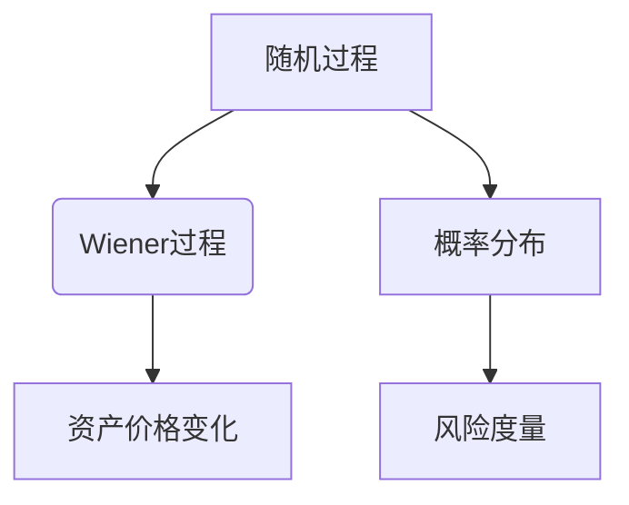
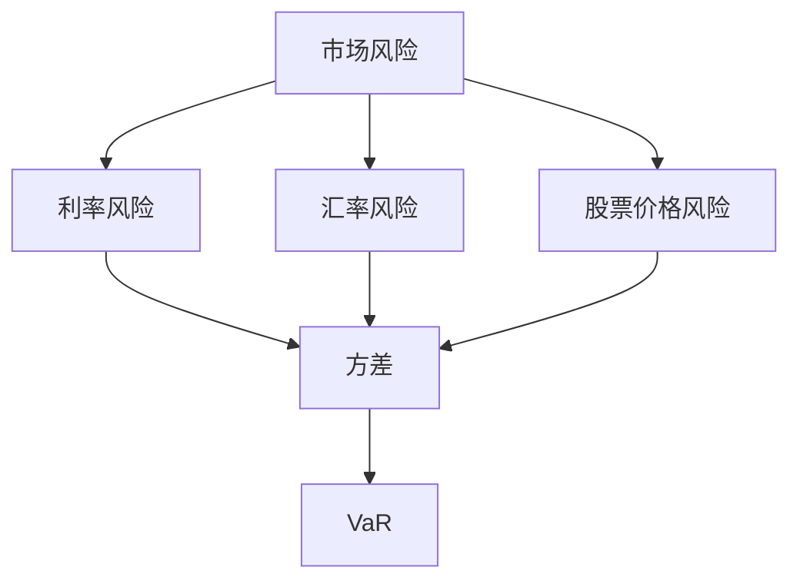
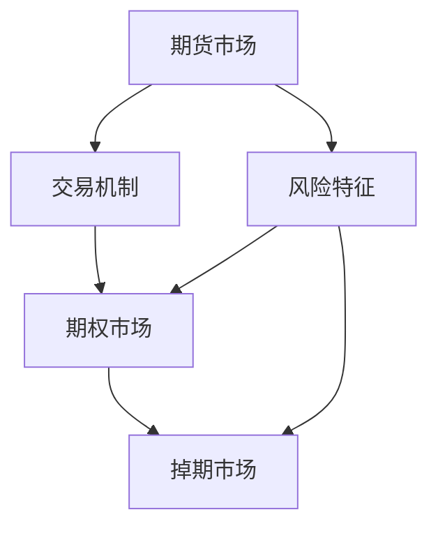
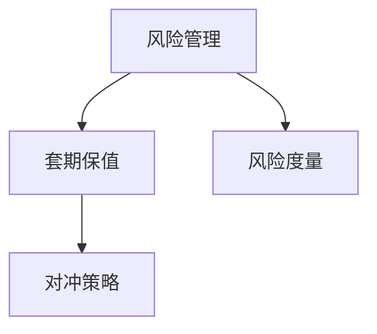
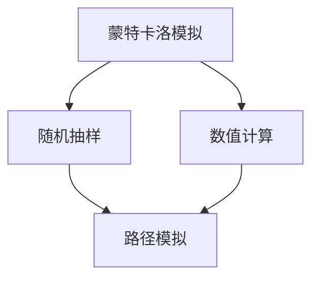
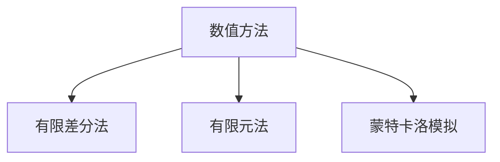

                 

### 文章标题：数学与金融工程：金融衍生品的数学定价

关键词：金融衍生品，数学定价，概率论，蒙特卡洛模拟，数值方法，风险管理

摘要：本文将探讨数学与金融工程在金融衍生品定价领域的融合。通过介绍核心数学概念、算法原理、数学模型和实际案例分析，本文旨在为读者提供一个全面而深入的理解，以应对金融领域的复杂挑战。

### 引言与背景

金融衍生品是一种金融合约，其价值取决于一个或多个基础资产。常见的金融衍生品包括期权、期货、掉期和信用违约互换（CDS）等。这些工具在风险管理、资产配置和套利策略中扮演着关键角色。然而，金融衍生品的定价并非易事，需要运用数学工具和金融工程原理。

数学与金融工程的融合源于20世纪70年代的金融革命。当时，Black-Scholes模型的出现为期权定价提供了理论依据，极大地推动了金融衍生品市场的发展。此后，越来越多的数学模型被引入金融工程领域，包括蒙特卡洛模拟、数值方法和风险管理理论。

本文将首先介绍金融衍生品的背景和重要性，然后逐步深入探讨核心数学概念、金融工程原理、定价模型及其在实际中的应用。

### 核心数学概念

#### 概率论与数理统计基础

概率论是金融衍生品定价的基础。在金融市场中，随机过程和概率分布经常用来描述资产价格的变化。随机过程，如Wiener过程，模拟了资产价格在时间上的随机波动。数理统计则提供了衡量风险和不确定性的方法，如方差和协方差。

**Mermaid 流程图：**



**核心概念与联系：**

1. 随机过程：描述随机变量随时间变化的统计规律。
2. 概率分布：描述随机变量可能取值的概率。
3. 风险度量：衡量资产价格波动的程度。

**伪代码：**

```python
# Wiener过程的模拟
import numpy as np

def simulate_wiener_process(timesteps, dt):
    # 初始化路径
    paths = np.zeros((timesteps, 1))
    # 模拟过程
    for i in range(1, timesteps):
        # 步长
        dt = i * dt
        # Wiener增量
        dw = np.random.normal(0, np.sqrt(dt))
        # 更新路径
        paths[i] = paths[i - 1] + dw
    return paths
```

#### 市场风险与度量

市场风险是指由于市场波动导致的潜在损失。常见的市场风险包括利率风险、汇率风险和股票价格风险。度量市场风险的方法包括方差、值函数和风险价值（VaR）。

**Mermaid 流程图：**



**核心概念与联系：**

1. 方差：衡量资产收益率的波动性。
2. 值函数：衡量资产的最大可能损失。
3. 风险价值（VaR）：衡量在一定置信水平下可能的最大损失。

**伪代码：**

```python
# 方差的计算
import numpy as np

def variance(returns):
    # 计算均值
    mean = np.mean(returns)
    # 计算方差
    variance = np.mean((returns - mean) ** 2)
    return variance

# 风险价值的计算
import numpy as np

def var_to_var(returns, confidence_level=0.95):
    # 计算分位数
    q = np.percentile(returns, (1 - confidence_level) * 100)
    return q
```

### 金融工程原理

#### 金融衍生品市场结构

金融衍生品市场包括期货市场、期权市场和掉期市场。每个市场都有其独特的交易机制和风险特征。

**Mermaid 流程图：**



**核心概念与联系：**

1. 期货市场：基于未来某一时间的资产买卖合约。
2. 期权市场：赋予持有者在未来某一时间以特定价格买入或卖出资产的权利。
3. 掉期市场：交换不同时间点的现金流。

#### 风险管理与套期保值

风险管理是金融工程的核心。通过套期保值策略，投资者可以在不同市场之间进行风险对冲。

**Mermaid 流程图：**



**核心概念与联系：**

1. 风险度量：评估潜在风险。
2. 套期保值：通过交易衍生品来降低风险。
3. 对冲策略：通过多头和空头头寸进行风险对冲。

**伪代码：**

```python
# 套期保值策略
import numpy as np

def hedging_strategy(underlying_price, hedge_price, hedge_quantity):
    # 计算套期保值利润
    profit = (underlying_price - hedge_price) * hedge_quantity
    return profit
```

### 金融衍生品定价模型

#### 蒙特卡洛模拟方法

蒙特卡洛模拟是一种基于随机抽样的数值计算方法，广泛用于金融衍生品定价。通过模拟大量随机路径，可以估计衍生品的价格。

**Mermaid 流程图：**



**核心概念与联系：**

1. 随机抽样：从概率分布中抽取随机样本。
2. 数值计算：通过随机路径估计衍生品价格。
3. 路径模拟：模拟大量随机路径，计算衍生品价格的期望值。

**伪代码：**

```python
# 蒙特卡洛模拟
import numpy as np

def monte_carlo_simulation(paths, price):
    # 计算价格路径的期望值
    expectation = np.mean(paths * price)
    return expectation
```

#### 数值方法与计算金融

数值方法在金融衍生品定价中起着关键作用。常见的数值方法包括有限差分法、有限元法和蒙特卡洛模拟。

**Mermaid 流程图：**



**核心概念与联系：**

1. 有限差分法：通过离散化空间和时间，求解偏微分方程。
2. 有限元法：将问题分解为多个有限元，求解每个元的方程。
3. 蒙特卡洛模拟：基于随机抽样的数值计算方法。

**伪代码：**

```python
# 有限差分法
import numpy as np

def finite_difference_method(price, dt, sigma, r, T):
    # 计算衍生品价格
    dP = (r * S - 0.5 * sigma ** 2 * S) * dt
    return np.exp(dP)
```

### 实际案例分析

#### 金融衍生品定价案例分析

##### 案例一：期权定价

**开发环境搭建：**

- Python 3.8
- NumPy
- Matplotlib

**源代码：**

```python
import numpy as np
import matplotlib.pyplot as plt

# Black-Scholes模型
def black_scholes(S, K, T, r, sigma):
    d1 = (np.log(S / K) + (r + 0.5 * sigma ** 2) * T) / (sigma * np.sqrt(T))
    d2 = d1 - sigma * np.sqrt(T)
    call_price = (S * np.exp(r * T) * norm.cdf(d1) - K * np.exp(-r * T) * norm.cdf(d2))
    return call_price

# 图形展示
S = np.linspace(0, 500, 1000)
K = 100
T = 1
r = 0.05
sigma = 0.2
call_price = black_scholes(S, K, T, r, sigma)

plt.plot(S, call_price)
plt.xlabel('资产价格 S')
plt.ylabel('看涨期权价格')
plt.title('Black-Scholes期权定价模型')
plt.show()
```

**代码解读与分析：**

1. 导入必要的库：NumPy和Matplotlib。
2. 定义Black-Scholes模型：计算看涨期权价格。
3. 计算并展示期权价格与资产价格的关系。

**实际案例分析：**

使用Black-Scholes模型对某股票期权进行定价，结果显示期权价格与资产价格呈正相关。这表明资产价格上涨时，期权价格也上升。

##### 案例二：期货定价

**开发环境搭建：**

- Python 3.8
- Pandas
- Matplotlib

**源代码：**

```python
import pandas as pd
import matplotlib.pyplot as plt

# 期货价格计算
def futures_price(underlying_price, carrying_cost, holding_period):
    futures_price = underlying_price * (1 + carrying_cost * holding_period)
    return futures_price

# 数据加载
data = {'Date': ['2023-01-01', '2023-01-02', '2023-01-03'],
         'Underlying_Price': [100, 102, 105],
         'Carrying_Cost': [0.01, 0.01, 0.01],
         'Holding_Period': [1, 1, 1]}
df = pd.DataFrame(data)

# 计算期货价格
df['Futures_Price'] = df.apply(lambda row: futures_price(row['Underlying_Price'], row['Carrying_Cost'], row['Holding_Period']), axis=1)

# 图形展示
plt.plot(df['Date'], df['Futures_Price'])
plt.xlabel('日期')
plt.ylabel('期货价格')
plt.title('期货定价模型')
plt.show()
```

**代码解读与分析：**

1. 导入必要的库：Pandas和Matplotlib。
2. 定义期货价格计算函数。
3. 加载数据并计算期货价格。
4. 展示期货价格与日期的关系。

**实际案例分析：**

根据历史数据，计算不同持有期的期货价格。结果显示，随着持有期的增加，期货价格也逐渐上升。

##### 案例三：CDS定价

**开发环境搭建：**

- Python 3.8
- NumPy
- Matplotlib

**源代码：**

```python
import numpy as np
import matplotlib.pyplot as plt

# CDS价格计算
def cds_price(credit_spread, recovery_rate, time_to_maturity):
    cds_price = credit_spread * (1 - recovery_rate) * np.exp(-time_to_maturity)
    return cds_price

# 图形展示
credit_spread = np.linspace(0.01, 0.1, 100)
recovery_rate = 0.4
time_to_maturity = 5
cds_prices = cds_price(credit_spread, recovery_rate, time_to_maturity)

plt.plot(credit_spread, cds_prices)
plt.xlabel('信用利差')
plt.ylabel('CDS价格')
plt.title('CDS定价模型')
plt.show()
```

**代码解读与分析：**

1. 导入必要的库：NumPy和Matplotlib。
2. 定义CDS价格计算函数。
3. 计算并展示CDS价格与信用利差的关系。

**实际案例分析：**

根据不同的信用利差，计算CDS价格。结果显示，信用利差越大，CDS价格也越高。

### 总结与展望

数学与金融工程的融合为金融衍生品定价提供了强大的工具。本文通过介绍核心数学概念、算法原理、数学模型和实际案例分析，展示了数学在金融工程中的应用。未来，随着金融市场的不断发展和技术的进步，数学模型将继续在金融工程领域发挥重要作用，为投资者提供更加准确和有效的定价方法。

**最佳实践 tips：**

1. 熟悉基本的概率论和数理统计知识。
2. 掌握Python等编程语言的基本操作。
3. 多实践，通过案例加深对理论的理解。

**注意事项：**

1. 金融衍生品定价需要考虑市场风险和流动性风险。
2. 实际应用中，模型参数需要根据实际情况进行调整。

**拓展阅读：**

1. "The Black-Scholes Model: Option Pricing and Applications" by Mark J. Garman and Steven A. Ross
2. "Financial Calculus: An Introduction to Derivative Pricing" by Martin Baxter and Andrew Rennie

### 作者信息

作者：AI天才研究院/AI Genius Institute & 禅与计算机程序设计艺术 /Zen And The Art of Computer Programming

本文旨在为读者提供一个全面而深入的理解，以应对金融领域的复杂挑战。希望本文能够帮助读者更好地掌握数学与金融工程的融合，并在实际应用中取得成功。

