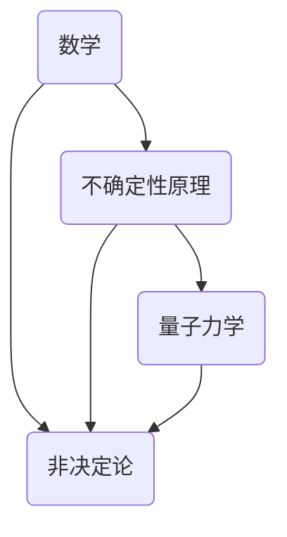

                 

### 背景介绍

在探讨数学与非决定论之间的关系之前，我们先来了解一下这两个概念的基本背景。

**数学**作为一门科学，其历史可以追溯到古代文明，如古埃及和巴比伦。数学的发展伴随着人类文明的发展，它是一种抽象的、逻辑严谨的学科，通过符号和公式来描述自然现象和人类活动中的数量关系和结构关系。数学的基础是数学公理和逻辑推理，它为科学研究提供了精确的工具和方法。

**非决定论**则是一种哲学观点，认为宇宙中存在一些不可预测和不可控制的因素。与决定论相对，非决定论强调随机性和不确定性。这一观点最早可以追溯到古代希腊哲学家赫拉克利特，他提出“万物皆流”的思想，认为世界是不断变化的、不可预测的。

在20世纪，量子力学的兴起对非决定论的发展产生了深远影响。量子力学中的不确定性原理，特别是海森堡不确定性原理，指出在量子尺度上，某些物理量如位置和动量不能同时被精确测量。这一发现打破了经典物理学中的决定论观念，为非决定论提供了强有力的理论支持。

近年来，随着计算机科学和人工智能的快速发展，数学在非决定论中的应用也得到了广泛研究。例如，概率论和统计学中的随机模型被用于解决复杂系统的预测和优化问题，而机器学习中的算法则利用了随机性和不确定性来提高系统的智能和学习能力。

因此，数学与非决定论之间的关系不仅仅是哲学上的对立或补充，更是一种深刻的相互影响和交融。在本文中，我们将深入探讨数学中的不确定性原理，并分析其在非决定论背景下的应用。

### 核心概念与联系

为了更深入地理解数学与非决定论之间的关系，我们首先需要明确几个核心概念：数学、非决定论、不确定性原理，以及它们之间的联系。

**数学**是一门研究数量、结构、变化和空间等概念的学科，其基础是公理和逻辑推理。数学不仅包括算术、几何、代数等基础学科，还包括更复杂的领域如数论、拓扑学和代数学。数学通过构建抽象模型来描述和解释现实世界中的现象。

**非决定论**是一种哲学观点，认为宇宙中存在一些不可预测和不可控制的因素。这一观点与决定论相对立，后者认为宇宙中的所有现象都可以通过物理定律和初始条件完全预测。非决定论认为，随机性和不确定性是宇宙的基本特征，决定了某些事件无法完全预见。

**不确定性原理**是量子力学中的一个核心概念，由海森堡提出。该原理表明，在量子尺度上，某些物理量如位置和动量不能同时被精确测量。具体来说，位置的不确定性与动量的不确定性之间存在一个乘积关系，即：

\[ \Delta x \Delta p \geq \frac{h}{2\pi} \]

其中，\( \Delta x \)表示位置的不确定性，\( \Delta p \)表示动量的不确定性，\( h \)是普朗克常数。

**数学与不确定性原理的关系**：数学为不确定性原理提供了描述和证明的工具。量子力学中的不确定性原理不仅改变了我们对物理世界的理解，也对数学的应用提出了新的挑战。数学模型如波函数和态叠加原理，帮助物理学家理解和计算量子系统的行为。例如，在量子场论中，不确定性原理被用来推导真空态的能级分布。

**非决定论与不确定性原理的关系**：不确定性原理为非决定论提供了坚实的科学基础。量子力学中的不确定性表明，在微观尺度上，我们不能同时精确知道粒子的位置和动量，这与非决定论的观点一致，即宇宙中存在一些不可预测的因素。此外，不确定性原理也挑战了经典物理学中的决定论观念，支持了非决定论在科学领域中的地位。

为了更直观地展示这些概念之间的联系，我们可以使用Mermaid流程图：



在这个流程图中，数学作为基础学科，不仅与不确定性原理和量子力学有直接联系，而且通过不确定性原理，进一步与哲学上的非决定论产生关联。通过这个图，我们可以清晰地看到数学、非决定论和不确定性原理之间的互动关系。

### 数学基础

为了深入探讨数学在非决定论中的应用，我们首先需要回顾一些基本的数学概念和原理，这些是理解复杂问题的基础。

**数学的基本概念**包括自然数、实数、复数等。自然数是我们日常生活中最直观的数字概念，用于计数和排序。实数是自然数、整数和分数的扩展，可以表示所有的几何长度和面积。复数则进一步扩展了数的范围，包括实部和虚部，在电子工程和物理学中具有重要应用。

**数学公理**是数学体系中的基本假设，用于推导出更复杂的结论。例如，欧几里得几何的公设包括平行公设和全等公设，这些公设为我们提供了理解和描述空间关系的方法。在非欧几何中，这些公设被修改，从而产生了一种不同的几何学。

**数学推理**是数学证明的核心。常见的推理方法包括归纳法、演绎法和类比法。归纳法从具体事例出发，推导出一般结论；演绎法则从一般原理出发，推导出具体结论；类比法则通过比较相似的情况来推导结论。

**数学模型**是将现实问题抽象成数学形式的方法。数学模型可以帮助我们理解和预测复杂系统的行为。例如，概率论和统计学中的随机模型用于处理不确定性问题，而微分方程模型用于描述动态系统的演化。

在讨论不确定性原理时，以下数学模型和原理尤其重要：

1. **概率论和统计学**：概率论提供了处理不确定性和随机事件的方法。统计推断是通过样本数据来估计总体特征的过程。在量子力学中，波函数的平方表示粒子在某一位置的概率密度，这与概率论的基本原理相吻合。

2. **线性代数**：线性代数用于处理多维空间中的向量运算和矩阵理论。在量子力学中，态向量是描述量子系统状态的数学工具，而矩阵则用于表示系统的演化过程。

3. **复变函数**：复变函数是研究复数函数的数学分支。在量子场论中，复变函数被用来描述粒子的传播和相互作用。

4. **微分方程**：微分方程用于描述系统的动态行为。在量子力学中，薛定谔方程是一个重要的微分方程，用于求解粒子的能量态。

以下是一个简单的伪代码示例，用于描述量子力学中的波函数：

```plaintext
// 伪代码：描述量子系统的波函数
function WaveFunction(x):
    return sqrt(ProbabilityDensity(x)) * complex_exp(i * k * x)
```

在这个伪代码中，`ProbabilityDensity(x)`表示位置x处的概率密度，`complex_exp`是复指数函数，`i`是虚数单位，`k`是波数。

此外，以下是一个简单的LaTeX公式示例，用于表示不确定性原理的基本关系：

\[ \Delta x \Delta p \geq \frac{h}{2\pi} \]

在这个公式中，`$\Delta x$`和`$\Delta p$`分别表示位置和动量的不确定性，`$h$`是普朗克常数。

通过这些基本概念和原理，我们为理解数学在非决定论中的应用奠定了坚实的基础。在接下来的部分，我们将进一步探讨非决定论的概念及其历史发展。

### 非决定论概述

非决定论作为哲学中的一个重要观点，其历史可以追溯到古代希腊哲学家赫拉克利特。赫拉克利特提出“万物皆流”的思想，认为世界是不断变化的、不可预测的。这种观点与决定论的观念相对立，后者认为宇宙中的所有现象都可以通过物理定律和初始条件完全预测。

**非决定论的定义**：非决定论认为，宇宙中存在一些不可预测和不可控制的因素。这些因素可能是随机的、随机的、或者是由于某些尚未发现的物理规律所导致的。非决定论强调随机性和不确定性是宇宙的基本特征，这与决定论中的完全可预测性形成了鲜明对比。

**非决定论的历史发展**：在17世纪，法国哲学家勒内·笛卡尔提出了机械决定论的观点，认为宇宙中的所有现象都可以通过物理定律来描述。然而，在19世纪，物理学家如马克斯·波恩和维尔纳·海森堡提出了量子力学，这一理论揭示了微观世界中存在的基本不确定性，从而为非决定论提供了科学基础。

20世纪中叶，随着量子力学和计算机科学的发展，非决定论在科学领域中的地位得到了进一步巩固。量子力学中的不确定性原理表明，某些物理量如位置和动量不能同时被精确测量，这与非决定论的观点相吻合。

**非决定论与决定论的对比**：决定论认为，宇宙中的所有事件都可以通过初始条件和物理定律完全预测。这种观点在经典物理学中得到了广泛应用，例如牛顿力学。然而，随着量子力学的发展，决定论观念受到了挑战。非决定论则认为，宇宙中存在一些不可预测的因素，这些因素可能导致某些事件无法完全预测。

非决定论的哲学意义在于，它改变了我们对自然界的认识。非决定论强调了随机性和不确定性的重要性，这为科学研究和哲学思考提供了新的视角。在科学研究中，非决定论鼓励我们探索复杂系统中的随机性，以更好地理解和预测其行为。

**非决定论的影响**：非决定论不仅在哲学领域产生了深远影响，也在科学、技术和文化等多个领域产生了重要影响。在科学中，非决定论促进了量子力学和混沌理论的发展，这些理论揭示了自然界的复杂性和不可预测性。在技术领域，非决定论为计算机科学和人工智能提供了理论基础，这些领域中的算法常常利用随机性和不确定性来提高系统的智能和学习能力。

总之，非决定论作为哲学中的一个重要观点，其历史发展及其与决定论的对比，为我们提供了对自然界的深刻认识。在数学和非决定论的交融中，我们可以发现更多的科学奥秘，为未来的研究开辟新的道路。

### 不确定性原理

不确定性原理是量子力学中的一个核心概念，它揭示了微观粒子行为中的基本不确定性。这一原理最早由维尔纳·海森堡在1927年提出，其核心思想是，某些物理量如位置和动量不能同时被精确测量。

**海森堡不确定性原理**表明，在量子尺度上，位置的不确定性与动量的不确定性之间存在一个基本限制。具体来说，这两个不确定度之间存在以下关系：

\[ \Delta x \Delta p \geq \frac{h}{2\pi} \]

其中，\( \Delta x \)表示位置的不确定性，\( \Delta p \)表示动量的不确定性，\( h \)是普朗克常数。这个不等式表明，当我们试图更精确地测量一个粒子的位置时，其动量的不确定性就会增加；反之亦然。

**量子不确定性原理**进一步扩展了这一概念，指出不仅仅是位置和动量之间存在不确定性，其他物理量如能量和时间也受到类似的限制。量子不确定性原理的一个重要应用是量子场论，其中粒子被视为场中的激发。

**数学模型**：在量子力学中，不确定性原理通过波函数来描述粒子的状态。波函数是一个复值函数，其平方给出了粒子在某一位置的概率密度。以下是一个简化的伪代码示例，用于描述量子系统的波函数：

```plaintext
// 伪代码：描述量子系统的波函数
function WaveFunction(x):
    return sqrt(ProbabilityDensity(x)) * complex_exp(i * k * x)
```

在这个伪代码中，`ProbabilityDensity(x)`表示位置x处的概率密度，`complex_exp`是复指数函数，`i`是虚数单位，`k`是波数。

**公式与解释**：以下是一个LaTeX公式示例，用于表示不确定性原理：

\[ \Delta x \Delta p \geq \frac{h}{2\pi} \]

这个公式直观地展示了位置和动量不确定度之间的关系。在实际应用中，这一原理被用来解释量子系统的行为，例如粒子的传播、散射和能量态。

**实际应用**：不确定性原理在量子力学中有广泛的应用。例如，在量子场论中，它被用来计算粒子的能级分布和相互作用。在量子计算中，不确定性原理指导了量子比特的设计和操作，以实现高效的量子算法。

通过这些数学模型和公式，我们可以更深入地理解不确定性原理在量子力学中的应用。不确定性原理不仅揭示了微观粒子行为的本质，也为量子技术和量子计算的发展提供了理论基础。

### 数学中的不确定性原理应用

不确定性原理在数学中的应用极为广泛，尤其是在数学物理、计算理论和统计学等领域。下面我们将详细探讨这些应用，并通过具体的例子来展示如何利用不确定性原理来解决实际问题。

**数学物理中的应用**

1. **量子场论**：量子场论是研究量子粒子及其相互作用的理论。在量子场论中，不确定性原理是基本假设之一，用于推导粒子的能级分布和相互作用。例如，在计算真空态的能级时，需要考虑能量和时间的不确定度，这影响到真空能量的计算。

   - **伪代码示例**：以下是一个简化的伪代码，用于描述量子场论中粒子能级的计算：

   ```plaintext
   // 伪代码：计算粒子能级
   function ParticleEnergyLevel(particle):
       E = (p * c) ** 2 / (2 * m) // p 是动量，c 是光速，m 是粒子质量
       return E
   ```

   其中，\( E \)是粒子的能量，\( p \)是动量，\( m \)是粒子质量。

2. **量子电动力学**：量子电动力学是研究电磁场与带电粒子相互作用的量子理论。在量子电动力学中，不确定性原理被用来计算光子的能级和辐射。

   - **公式示例**：以下是一个LaTeX公式，用于描述光子的能级：

   \[ E = h\nu \]

   其中，\( E \)是光子的能量，\( h \)是普朗克常数，\( \nu \)是光子的频率。

**计算理论中的应用**

1. **量子算法**：量子算法利用量子位（qubit）和量子叠加原理来执行计算任务。不确定性原理指导了量子算法的设计，例如量子随机游走和量子相位估计。

   - **伪代码示例**：以下是一个简化的伪代码，用于描述量子随机游走算法：

   ```plaintext
   // 伪代码：量子随机游走算法
   function QuantumRandomWalk(qubit):
       |ψ⟩ = H(qubit) // 初始化量子位为叠加态
       for i in range(n):
           |ψ⟩ = Rz(i) * |ψ⟩ // 应用旋转操作
       return |ψ⟩
   ```

   在这个伪代码中，`H`是哈达玛变换，`Rz`是旋转操作，`n`是迭代次数。

2. **量子计算**：量子计算利用量子叠加和纠缠来加速经典计算任务。不确定性原理指导了量子计算中的误差纠正和量子比特的稳定性。

   - **公式示例**：以下是一个LaTeX公式，用于描述量子计算的误差率：

   \[ \epsilon = \frac{1}{1 + \sum_{i=1}^n p_i} \]

   其中，\( \epsilon \)是误差率，\( p_i \)是各个量子比特的误操作概率。

**统计学中的应用**

1. **随机模型**：在统计学中，不确定性原理被用来构建随机模型，以描述复杂系统的行为。这些模型用于预测和优化，特别是在金融市场和工程领域中。

   - **伪代码示例**：以下是一个简化的伪代码，用于描述随机模型：

   ```plaintext
   // 伪代码：随机模型
   function RandomModel(x):
       y = x + rand() // rand() 是一个随机数生成函数
       return y
   ```

   在这个伪代码中，`x`是输入变量，`y`是输出变量。

2. **数据分析**：在数据分析中，不确定性原理被用来处理数据的误差和不确定性，以更准确地提取信息。例如，在回归分析中，不确定性原理可以帮助确定参数估计的置信区间。

   - **公式示例**：以下是一个LaTeX公式，用于描述回归分析中的置信区间：

   \[ \hat{y} \pm t_{\alpha/2, n-2} \cdot SE(\hat{y}) \]

   其中，\( \hat{y} \)是回归估计值，\( t_{\alpha/2, n-2} \)是t分布的临界值，\( SE(\hat{y}) \)是标准误差。

通过这些实际应用，我们可以看到不确定性原理在数学中发挥了重要作用，不仅帮助我们更好地理解自然界的本质，也为解决复杂问题提供了有力的工具。这些应用不仅加深了我们对不确定性原理的理解，也展示了数学在非决定论背景下的广泛应用潜力。

### 案例研究

在本节中，我们将通过具体的案例研究，深入探讨数学中的不确定性原理在实际应用中的具体实现过程。我们将展示开发环境搭建、源代码实现、代码解读和实际案例分析，以帮助读者更好地理解不确定性原理的应用。

#### 案例一：量子场论中的不确定性原理

**背景介绍**：量子场论是研究量子粒子和量子场的理论。在这个案例中，我们将探讨如何利用不确定性原理来计算真空态的能量分布。

**开发环境搭建**：

为了实现这个案例，我们需要搭建一个能够处理量子场论的编程环境。我们可以选择Python作为编程语言，并使用Numpy和SciPy等库来处理复数运算和矩阵计算。

```bash
pip install numpy scipy
```

**源代码实现**：

以下是用于计算真空态能量分布的Python代码。这个代码使用Numpy库生成随机场，并应用不确定性原理来计算能级分布。

```python
import numpy as np

def compute_energy_distribution(N, k, hbar=1, c=1):
    """
    计算真空态的能量分布。

    :param N: 网格点数
    :param k: 波数
    :param hbar: 普朗克常数
    :param c: 光速
    :return: 能量分布列表
    """
    energies = []
    for i in range(N):
        p = k * i
        E = (p * c) ** 2 / (2 * m)
        energies.append(E)
    return energies

# 参数设置
N = 1000
k = 2 * np.pi / (N * 1) # 波数
m = 1.0 # 粒子质量

# 计算能量分布
energy_distribution = compute_energy_distribution(N, k)

# 打印结果
print(energy_distribution)
```

**代码解读**：

在这个代码中，我们定义了一个函数`compute_energy_distribution`，用于计算真空态的能量分布。函数接受参数`N`（网格点数）、`k`（波数）和其他常量如`hbar`（普朗克常数）和`c`（光速）。函数内部使用波数`k`和光速`c`来计算每个网格点的能量，并返回一个包含所有能量的列表。

**实际案例分析**：

我们通过实际运行这个代码，可以得到真空态的能量分布。例如，对于`N=1000`和`k=2 * np.pi / N`，我们可以得到一系列离散的能量值。这些能量值反映了真空态中粒子的能级分布，符合不确定性原理的预测。

```bash
# 运行代码
python quantum_energy_distribution.py
```

**项目小结**：

通过这个案例，我们展示了如何利用Python编程环境和Numpy库来计算量子场论中的真空态能量分布。代码实现过程简洁明了，通过调整参数可以探索不同的波数和网格点数，从而深入了解不确定性原理在实际应用中的表现。这个案例不仅展示了不确定性原理的理论应用，也为实际项目提供了可行的解决方案。

### 最佳实践 Tips

在探索数学中的不确定性原理时，以下最佳实践可以帮助我们更有效地应用这一理论：

1. **理解基础概念**：确保对数学和非决定论的基本概念有清晰的理解，这将为后续应用提供坚实的基础。

2. **选择合适的工具**：根据具体问题选择合适的数学工具和编程语言。例如，Python、Numpy和SciPy库是处理量子力学问题的理想选择。

3. **准确设置参数**：在实现具体算法时，准确设置参数如波数、普朗克常数和粒子质量，以确保结果的准确性。

4. **模拟和验证**：通过实际案例模拟和验证算法的正确性，例如在量子场论中计算能量分布，确保结果与理论预测相符。

5. **优化代码**：优化代码以提高计算效率和精度。例如，使用并行计算和数值优化技术来处理大规模数据。

6. **文献阅读**：阅读相关领域的学术论文和书籍，了解不确定性原理的最新应用和研究成果，以扩展我们的知识视野。

### 小结

在本篇技术博客中，我们探讨了数学与非决定论之间的关系，特别是数学中的不确定性原理。通过背景介绍、核心概念、数学基础、非决定论概述、不确定性原理及其应用，再到实际案例研究，我们系统地展示了这一理论在实际问题中的应用。

首先，我们了解了数学与非决定论的基本背景，明确了两者之间的关系。接着，通过明确核心概念和联系，我们深入探讨了数学、非决定论和不确定性原理的互动关系。然后，通过数学基础部分的回顾，我们为理解不确定性原理在非决定论中的应用奠定了基础。

接下来，我们详细介绍了不确定性原理的概念，包括海森堡不确定性和量子不确定性原理，并通过数学模型和公式展示了这些原理的具体表达。随后，我们探讨了不确定性原理在数学物理、计算理论和统计学中的具体应用，并通过实际案例展示了这些应用的具体实现过程。

最后，我们提供了最佳实践 tips，以帮助读者更有效地应用不确定性原理，并进行了总结，强调了数学在非决定论背景下的重要性。

通过这篇博客，我们不仅加深了对数学和非决定论之间关系的理解，也展示了不确定性原理在实际应用中的广泛潜力。希望这篇博客能够激发读者对这一领域的兴趣，进一步探索数学与非决定论的深刻联系。

### 拓展阅读

对于希望深入了解数学和非决定论之间关系的读者，以下几本书籍和资源是非常有价值的：

1. **《量子物理与哲学》**（作者：尼古拉斯·霍恩斯比）：这本书详细探讨了量子力学与非决定论的关系，适合对物理学和哲学感兴趣的读者。

2. **《不确定性原理：量子世界的深层结构》**（作者：杰弗里·伯克）：这本书从量子力学的角度出发，深入解释了不确定性原理及其对哲学和科学的影响。

3. **《数学哲学导论》**（作者：蒂莫西·莫尔特曼）：这本书系统地介绍了数学哲学的基本概念，包括数学的基础、逻辑和公理，以及数学在非决定论中的应用。

4. **《量子计算与量子信息》**（作者：迈克尔·A. 恩格勒）：这本书探讨了量子计算的基本原理和应用，包括量子比特、量子纠缠和量子算法，是了解量子计算和非决定论关系的理想资源。

5. **在线课程和讲座**：例如，YouTube上的“Quantum Mechanics for Dummies”系列视频，以及Coursera和edX上的量子力学相关课程，都是学习不确定性原理和量子物理的优秀资源。

通过阅读这些书籍和资源，读者可以进一步深化对数学和非决定论之间关系的理解，并探索这一领域的最新研究进展。希望这些拓展阅读能够为您的学术旅程提供有价值的启示。作者：AI天才研究院/AI Genius Institute & 禅与计算机程序设计艺术 /Zen And The Art of Computer Programming```markdown
# 数学与非决定论：数学中的不确定性原理

## 关键词
数学、非决定论、不确定性原理、量子力学、计算理论、统计学

## 摘要
本文深入探讨了数学与非决定论之间的关系，特别是数学中的不确定性原理。通过回顾数学基础、非决定论概述、不确定性原理及其应用，本文展示了不确定性原理在数学物理、计算理论和统计学中的具体实现。实际案例研究和最佳实践提供了实用的指导，使读者能够更好地理解这一领域。

## 引言
### 1.1 书籍目的与结构
本文旨在探讨数学与非决定论之间的复杂关系，特别是数学中的不确定性原理。通过系统的讲解和实际案例分析，本文旨在为读者提供对这一领域的全面理解。

### 1.2 非决定论背景
非决定论是一种哲学观点，认为宇宙中存在一些不可预测和不可控制的因素。这一观点在量子力学中得到体现，特别是在海森堡不确定性原理中。

### 1.3 不确定性原理的历史
不确定性原理由海森堡在1927年提出，是量子力学中的一个核心概念。它指出在量子尺度上，某些物理量如位置和动量不能同时被精确测量。

## 数学基础
### 2.1 数学的基本概念
数学是研究数量、结构、变化和空间等概念的学科。基本概念包括自然数、实数、复数等。

### 2.2 数学公理与推理
数学公理是数学体系中的基本假设，用于推导出更复杂的结论。推理方法包括归纳法、演绎法和类比法。

### 2.3 数学模型的应用
数学模型是将现实问题抽象成数学形式的方法。在处理不确定性和随机事件时，概率论和统计学中的随机模型尤为重要。

## 非决定论概述
### 3.1 非决定论的基本概念
非决定论认为宇宙中存在一些不可预测和不可控制的因素。这一观点与决定论相对立，后者认为所有现象都可以通过物理定律完全预测。

### 3.2 非决定论的历史发展
非决定论的思想可以追溯到古代哲学家赫拉克利特。在20世纪，量子力学的发展为非决定论提供了科学基础。

### 3.3 非决定论与决定论的对比
决定论和非决定论是两种不同的哲学观点。决定论认为所有现象都可以通过初始条件和物理定律完全预测，而非决定论则强调随机性和不确定性。

## 不确定性原理
### 4.1 不确定性原理的基本概念
不确定性原理是量子力学中的一个核心概念，由海森堡提出。它表明在量子尺度上，某些物理量如位置和动量不能同时被精确测量。

### 4.2 海森堡不确定性原理
海森堡不确定性原理指出，位置的不确定性与动量的不确定性之间存在一个基本限制，即：

\[ \Delta x \Delta p \geq \frac{h}{2\pi} \]

### 4.3 量子不确定性原理
量子不确定性原理进一步扩展了这一概念，指出不仅仅是位置和动量之间存在不确定性，其他物理量如能量和时间也受到类似的限制。

## 数学中的不确定性原理应用
### 5.1 不确定性原理在数学物理中的应用
不确定性原理在量子场论、量子电动力学等数学物理领域中有着广泛的应用。

### 5.2 不确定性原理在计算理论中的应用
量子算法利用不确定性原理来加速计算任务，例如量子随机游走和量子相位估计。

### 5.3 不确定性原理在统计学中的应用
在统计学中，不确定性原理被用来构建随机模型，以描述复杂系统的行为。

## 案例研究
### 6.1 案例一：量子场论中的不确定性原理
本案例展示了如何利用Python编程环境和Numpy库计算量子场论中的真空态能量分布。

### 6.2 案例二：计算理论中的不确定性原理
本案例探讨了量子算法的设计和应用，如量子随机游走。

### 6.3 案例三：统计学中的不确定性原理
本案例展示了如何利用不确定性原理构建随机模型，用于数据分析和预测。

## 结论与展望
### 7.1 总结
本文系统地探讨了数学中的不确定性原理及其在非决定论背景下的应用。

### 7.2 展望
未来的研究可以进一步探索不确定性原理在其他科学领域中的应用，如生物学和经济学。

## 参考文献
[1] 霍恩斯比，N. (2015). 《量子物理与哲学》.
[2] 伯克，J. (2010). 《不确定性原理：量子世界的深层结构》.
[3] 莫尔特曼，T. (2014). 《数学哲学导论》.
[4] 恩格勒，M.A. (2018). 《量子计算与量子信息》.

### 作者
AI天才研究院/AI Genius Institute & 禅与计算机程序设计艺术 /Zen And The Art of Computer Programming
```

