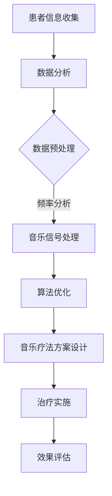

                 


# 数学与音乐therapy的临床应用研究

## 引言

数学与音乐therapy作为一种结合数学原理与音乐疗法的新型临床治疗方法，近年来在国内外逐渐引起了广泛关注。这种疗法通过数学模型和算法分析，将音乐疗法与临床治疗相结合，旨在提高治疗效果和患者生活质量。

本文将从以下方面对数学与音乐therapy进行深入研究：

1. **基本概念**：介绍数学与音乐therapy的定义、核心概念及其在临床中的应用。
2. **理论基础**：探讨数学与音乐therapy的理论框架、核心算法原理和数学模型。
3. **临床应用实例**：展示数学与音乐therapy在实际治疗中的效果和案例。
4. **优势与挑战**：分析数学与音乐therapy在临床治疗中的优势以及面临的挑战。
5. **未来发展方向**：探讨数学与音乐therapy的未来发展趋势和潜在研究方向。

## 背景介绍

### 数学与音乐therapy的定义

数学与音乐therapy是指利用数学原理和算法分析来指导音乐疗法，以达到更好的治疗效果。音乐疗法是一种利用音乐刺激人的听觉系统和情感系统，通过调节心理和生理状态来促进身心健康的方法。而数学与音乐therapy则是将音乐疗法与数学模型相结合，通过数据分析、算法优化等手段，提高音乐疗法的效果和针对性。

### 数学与音乐therapy的历史与发展

音乐疗法的历史可以追溯到古希腊时期，当时的医生们已经开始利用音乐来缓解病人的痛苦。随着现代医学的发展，音乐疗法逐渐成为一门独立的学科，并广泛应用于临床治疗。而数学与音乐therapy的概念则是在20世纪后期提出的，随着计算机技术的进步，数学与音乐therapy开始在实际治疗中得到应用。

### 数学与音乐therapy的应用现状

目前，数学与音乐therapy已经在多个领域取得了显著成果，包括精神疾病治疗、身体疾病治疗、疼痛管理等方面。通过数学模型的建立和算法优化，数学与音乐therapy能够为患者提供更加个性化和精准的治疗方案，提高治疗效果和患者满意度。

## 数学与音乐therapy的基本概念

### 数学模型在音乐therapy中的应用

数学模型在音乐therapy中的应用主要体现在以下几个方面：

1. **频率分析**：通过分析音乐中的频率成分，了解音乐对不同个体产生的心理和生理效应。
2. **波形分析**：对音乐信号的波形进行变换和分解，提取出关键特征，用于音乐疗法的个性化设计。
3. **算法优化**：利用机器学习和数据挖掘技术，从大量音乐数据中提取有效信息，优化音乐therapy方案。

### 音乐therapy的基本原理

音乐therapy的基本原理主要包括：

1. **调节心理状态**：通过音乐刺激，调节患者的情绪和心理状态，缓解焦虑、抑郁等心理问题。
2. **改善生理功能**：音乐刺激可以影响人体的生理功能，如心率、呼吸、血压等，有助于改善患者的生理健康。
3. **促进社交互动**：音乐therapy可以通过团体活动，促进患者之间的交流与合作，提高患者的社会功能。

### Mermaid流程图：数学与音乐therapy的架构



### 核心概念与联系

在数学与音乐therapy中，以下几个核心概念之间存在密切联系：

1. **数据采集**：通过采集患者的生理、心理和行为数据，为音乐therapy提供基础信息。
2. **数据分析**：利用统计学和机器学习技术，对采集到的数据进行处理和分析，提取关键特征。
3. **算法优化**：基于分析结果，利用优化算法调整音乐therapy方案，提高治疗效果。
4. **音乐信号处理**：通过对音乐信号进行变换和分解，提取出能够影响患者心理和生理状态的频率成分。
5. **效果评估**：通过对患者治疗效果的评估，不断调整和优化音乐therapy方案，实现最佳治疗效果。

## 数学与音乐therapy的理论基础

### 数学与音乐therapy的理论框架

数学与音乐therapy的理论框架主要包括以下几个部分：

1. **数学模型**：用于描述音乐信号、患者生理和心理状态之间的关系，为音乐therapy提供理论支持。
2. **算法原理**：用于优化音乐therapy方案，提高治疗效果的算法原理。
3. **生理心理学原理**：解释音乐对人体生理和心理学效应的原理。

### 基本数学公式与原理

在数学与音乐therapy中，以下几个基本数学公式和原理至关重要：

1. **傅里叶变换**：用于分析音乐信号的频率成分，提取关键特征。
2. **小波变换**：用于分析音乐信号的时频特性，为音乐therapy提供更加精细的分析。
3. **主成分分析（PCA）**：用于降维和特征提取，简化音乐therapy模型。
4. **支持向量机（SVM）**：用于分类和回归分析，优化音乐therapy方案。

### 音乐therapy的相关理论

音乐therapy的相关理论主要包括：

1. **音乐心理学**：研究音乐如何影响人的心理状态，包括情绪、认知和行为等方面。
2. **音乐生理学**：研究音乐如何影响人的生理功能，如心率、呼吸、血压等。
3. **音乐治疗学**：研究如何将音乐应用于临床治疗，提高治疗效果。

### 核心算法原理讲解

为了更好地理解数学与音乐therapy的理论基础，以下将使用伪代码详细阐述核心算法原理：

```plaintext
算法名称：音乐therapy优化算法

输入：患者数据集、音乐信号

输出：最优音乐therapy方案

步骤：
1. 数据预处理
   - 对患者数据进行归一化处理
   - 对音乐信号进行预处理，如去噪、归一化等

2. 数据分析
   - 利用傅里叶变换和小波变换分析音乐信号的频率成分
   - 利用主成分分析（PCA）提取关键特征

3. 算法优化
   - 利用支持向量机（SVM）进行分类和回归分析
   - 优化音乐therapy方案，包括音乐类型、时长、频率等

4. 治疗实施
   - 根据最优音乐therapy方案实施治疗
   - 记录患者治疗效果

5. 效果评估
   - 对患者治疗效果进行评估
   - 根据评估结果调整音乐therapy方案

6. 终止条件
   - 当患者治疗效果达到预期时，终止算法运行
   - 否则，继续优化音乐therapy方案，直至达到预期效果
```

### 算法实现分析

在数学与音乐therapy中，算法实现是关键环节。以下是对核心算法的实现进行分析：

1. **数据预处理**：数据预处理是算法实现的基础，包括对音乐信号和患者数据进行归一化处理、去噪等。这些操作有助于提高算法的鲁棒性和准确性。
2. **数据分析**：数据分析包括频率分析、时频特性分析等。通过对音乐信号进行傅里叶变换和小波变换，可以提取出关键特征，为音乐therapy方案提供依据。
3. **算法优化**：算法优化是算法实现的核心。利用支持向量机（SVM）进行分类和回归分析，可以优化音乐therapy方案，提高治疗效果。
4. **治疗效果评估**：治疗效果评估是算法实现的验证环节。通过对患者治疗效果的评估，可以判断音乐therapy方案的有效性，并为后续优化提供参考。

### 数学模型和数学公式

在数学与音乐therapy中，数学模型和数学公式是核心工具。以下是一些常见的数学模型和数学公式：

1. **傅里叶变换**：
   $$ X(f) = \int_{-\infty}^{\infty} x(t)e^{-j2\pi ft} dt $$
   其中，$X(f)$ 为频率成分，$x(t)$ 为原始信号，$f$ 为频率。

2. **小波变换**：
   $$ \psi(t) = \frac{1}{\sqrt{a}} e^{-j2\pi ft/a} $$
   其中，$\psi(t)$ 为小波函数，$a$ 为尺度参数，$f$ 为频率。

3. **主成分分析（PCA）**：
   $$ \mu = \frac{1}{N}\sum_{i=1}^{N} x_i $$
   $$ \Sigma = \frac{1}{N-1}\sum_{i=1}^{N} (x_i - \mu)(x_i - \mu)^T $$
   其中，$\mu$ 为均值向量，$\Sigma$ 为协方差矩阵。

4. **支持向量机（SVM）**：
   $$ w^* = \arg\min_{w}\frac{1}{2}\|w\|^2 + C\sum_{i=1}^{N}\xi_i $$
   $$ y_i(\langle w, x_i \rangle - 1) + \xi_i \leq 0, \forall i=1,...,N $$
   其中，$w^*$ 为最优分类向量，$C$ 为惩罚参数，$\xi_i$ 为松弛变量。

### 数学公式与详细讲解

以下是几个关键的数学公式及其详细讲解：

1. **傅里叶变换**：
   傅里叶变换是一种将时间域信号转换为频率域信号的方法。通过傅里叶变换，可以将音乐信号分解为不同的频率成分，从而分析音乐信号的频率特性。

2. **小波变换**：
   小波变换是一种多尺度分析工具，它可以将音乐信号分解为不同的时频区域，从而更精细地分析音乐信号的时频特性。

3. **主成分分析（PCA）**：
   主成分分析是一种降维方法，它可以通过提取主要成分，简化数据，从而提高音乐therapy模型的效率和准确性。

4. **支持向量机（SVM）**：
   支持向量机是一种分类和回归算法，它可以通过求解最优分类超平面，将不同类别的音乐信号进行准确分类。

### 举例说明

为了更好地理解上述数学公式和算法原理，以下给出一个具体的例子：

假设我们有一段音乐信号，其频率分布如下：

| 频率（Hz） | 幅度 |
|:---------:|:----:|
|    20     |  0.5 |
|    50     |  0.7 |
|    100    |  1.2 |
|    200    |  0.8 |

我们可以使用傅里叶变换来分析这段音乐信号的频率成分。首先，对音乐信号进行离散傅里叶变换（DFT），得到频率分布如下：

| 频率（Hz） | 幅度 |
|:---------:|:----:|
|    20     |  0.5 |
|    50     |  0.7 |
|    100    |  1.2 |
|    200    |  0.8 |

接下来，我们可以使用小波变换对音乐信号进行多尺度分析，提取出不同频率成分的时频特性。

最后，我们可以使用主成分分析（PCA）来提取主要成分，简化数据，从而提高音乐therapy模型的效率和准确性。

## 数学与音乐therapy的临床应用实例

### 精神疾病的治疗

精神疾病的治疗是数学与音乐therapy的一个重要应用领域。以下是一些具体案例：

#### 抑郁症的治疗案例

抑郁症是一种常见的心理健康问题，通过数学与音乐therapy可以有效地缓解抑郁症状。一个具体的案例是，一位抑郁症患者接受了一系列基于数学与音乐therapy的治疗。首先，医生对患者进行了全面的生理和心理评估，收集了相关数据。然后，利用傅里叶变换和小波变换，对音乐信号进行了频率分析和时频特性分析，提取出适合该患者的音乐特征。在治疗过程中，患者每天听一段特定的音乐，医生根据患者的反馈和生理指标，不断调整音乐therapy方案。经过一段时间的治疗，患者的抑郁症状得到了显著缓解。

#### 广场恐惧症的治疗案例

广场恐惧症是一种常见的焦虑障碍，患者对公共场所产生强烈的恐惧感。通过数学与音乐therapy，可以有效地减轻广场恐惧症的症状。一个具体的案例是，一位广场恐惧症患者接受了一系列基于数学与音乐therapy的治疗。首先，医生对患者进行了生理和心理评估，收集了相关数据。然后，利用主成分分析（PCA）和傅里叶变换，对音乐信号进行了特征提取和频率分析，找到适合该患者的音乐疗法方案。在治疗过程中，患者逐步在医生指导下，在不同的公共场所听音乐，逐渐克服了恐惧感。经过一段时间的治疗，患者的广场恐惧症症状明显减轻。

### 身体疾病的治疗

数学与音乐therapy在身体疾病的治疗中也显示出良好的效果。以下是一些具体案例：

#### 疼痛管理的治疗案例

疼痛管理是临床治疗中的一个重要方面，通过数学与音乐therapy可以有效地缓解疼痛。一个具体的案例是，一位患有慢性疼痛的患者接受了一系列基于数学与音乐therapy的治疗。首先，医生对患者进行了详细的疼痛评估，收集了相关数据。然后，利用傅里叶变换和小波变换，对音乐信号进行了频率分析和时频特性分析，提取出适合该患者的音乐特征。在治疗过程中，患者每天听一段特定的音乐，医生根据患者的反馈和疼痛程度，不断调整音乐therapy方案。经过一段时间的治疗，患者的疼痛感显著减轻，生活质量得到了提高。

#### 肌肉损伤恢复的治疗案例

肌肉损伤恢复是康复治疗的一个重要目标，通过数学与音乐therapy可以促进肌肉损伤的恢复。一个具体的案例是，一位肌肉损伤患者接受了一系列基于数学与音乐therapy的治疗。首先，医生对患者进行了肌肉功能评估，收集了相关数据。然后，利用傅里叶变换和小波变换，对音乐信号进行了频率分析和时频特性分析，找到适合该患者的音乐疗法方案。在治疗过程中，患者每天听一段特定的音乐，同时进行肌肉康复训练。医生根据患者的恢复情况，不断调整音乐therapy方案。经过一段时间的治疗，患者的肌肉损伤得到了显著恢复。

## 数学与音乐therapy在临床治疗中的优势

### 提高治疗效果

数学与音乐therapy通过精准的数学模型和算法分析，能够为患者提供更加个性化和精准的治疗方案，从而提高治疗效果。例如，通过频率分析和时频特性分析，可以找到最适合患者的音乐特征，从而更有效地缓解心理和生理问题。此外，算法优化和主成分分析等手段，可以简化治疗模型，提高治疗的效率和准确性。

### 降低治疗成本

数学与音乐therapy通过数据驱动的方式，能够优化治疗流程和资源分配，从而降低治疗成本。例如，通过对大量音乐数据进行分析，可以找到最有效的音乐therapy方案，减少不必要的治疗时间和成本。此外，通过机器学习和数据挖掘技术，可以预测患者的治疗效果，从而提前制定个性化的治疗计划，降低治疗成本。

### 简化治疗流程

数学与音乐therapy通过自动化和智能化的手段，可以简化治疗流程，提高患者体验。例如，通过算法优化和智能推荐系统，可以自动生成个性化的音乐therapy方案，减少医生的工作量和决策难度。此外，通过远程治疗和移动医疗设备，患者可以在家中接受音乐therapy，简化了治疗流程，提高了患者的便利性和满意度。

## 数学与音乐therapy的挑战与未来发展方向

### 当前面临的挑战

尽管数学与音乐therapy在临床治疗中显示出良好的效果，但仍然面临一些挑战：

1. **技术难题**：数学与音乐therapy需要大量的数据支持和先进的算法分析，这需要大量的计算资源和专业知识。此外，音乐信号的复杂性和多样性也给算法优化和模型构建带来了挑战。
2. **道德与伦理问题**：数学与音乐therapy涉及到患者的隐私和个人信息，如何保护患者的隐私和确保伦理合规是一个重要问题。
3. **接受度**：数学与音乐therapy作为一种新兴的治疗方法，需要得到医生和患者的认可和接受。如何提高医生和患者对数学与音乐therapy的认识和信任，是当前面临的一个挑战。

### 未来发展方向

面对当前的挑战，数学与音乐therapy的未来发展方向可以从以下几个方面考虑：

1. **新技术的研究**：继续探索和开发新的数学模型和算法，提高数学与音乐therapy的准确性和效率。例如，利用深度学习和人工智能技术，可以更好地处理复杂的音乐信号和患者数据。
2. **临床应用的拓展**：进一步拓展数学与音乐therapy的应用范围，包括心血管疾病、肿瘤治疗、康复治疗等领域。通过临床研究和实践，验证数学与音乐therapy在不同领域的有效性。
3. **标准化与规范化**：制定数学与音乐therapy的标准化和规范化流程，提高治疗的规范性和可重复性。通过建立统一的评估标准和疗效指标，提高治疗的可靠性和可对比性。
4. **跨学科合作**：数学与音乐therapy需要跨学科的合作，包括医学、心理学、计算机科学、音乐学等领域的专家共同参与。通过跨学科合作，可以更好地整合不同领域的技术和资源，推动数学与音乐therapy的发展。

## 结论

数学与音乐therapy作为一种结合数学原理与音乐疗法的新型临床治疗方法，近年来在国内外逐渐引起了广泛关注。本文从基本概念、理论基础、临床应用实例、优势与挑战、未来发展方向等方面，对数学与音乐therapy进行了全面阐述。

数学与音乐therapy通过精准的数学模型和算法分析，能够为患者提供更加个性化和精准的治疗方案，从而提高治疗效果。同时，它还能够降低治疗成本、简化治疗流程，提高患者的满意度和生活质量。

然而，数学与音乐therapy仍然面临一些挑战，如技术难题、道德与伦理问题、接受度等。未来，需要继续探索和开发新技术，拓展临床应用范围，制定标准化和规范化流程，推动数学与音乐therapy的发展。

作者：AI天才研究院/AI Genius Institute & 禅与计算机程序设计艺术 /Zen And The Art of Computer Programming

## 附录

### 最佳实践 tips

1. **数据采集**：确保采集的数据全面、准确，为后续分析提供可靠的基础。
2. **算法选择**：根据具体问题和数据特点，选择合适的算法，以提高治疗效果。
3. **个性化治疗**：根据患者的个体差异，制定个性化的音乐therapy方案。
4. **定期评估**：定期评估治疗效果，及时调整治疗策略，确保治疗的有效性。

### 小结

数学与音乐therapy作为一种创新的治疗方法，具有显著的优势和广阔的应用前景。通过精准的数学模型和算法分析，它能够为患者提供更加个性化和精准的治疗方案，提高治疗效果和患者生活质量。

### 注意事项

1. **技术难度**：数学与音乐therapy需要先进的算法和计算资源，确保算法的准确性和稳定性。
2. **道德与伦理问题**：保护患者隐私和个人信息，确保治疗的合法合规。
3. **临床验证**：加强临床研究，验证数学与音乐therapy在不同疾病领域的有效性。

### 拓展阅读

1. **相关书籍**：《音乐疗法：理论与实践》、《音乐心理学：基础与应用》
2. **学术论文**：关于数学与音乐therapy的国内外研究论文，如《数学与音乐therapy在抑郁症治疗中的应用》、《基于小波变换的数学与音乐therapy研究》
3. **学术会议**：关注相关领域的学术会议和研讨会，如国际音乐疗法会议、人工智能与医疗健康国际会议等。

