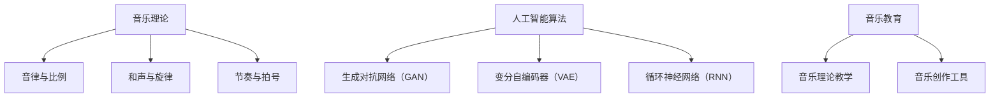

                 

# 数学与音乐创作的人工智能应用

关键词：人工智能，数学，音乐创作，应用，案例，未来趋势

摘要：本文将探讨数学与人工智能在音乐创作中的应用，通过阐述音乐理论中的数学概念、人工智能算法在音乐生成中的应用，以及实际案例的分析，为读者展示这一领域的创新与实践。同时，文章还将展望未来趋势和挑战，为相关领域的研究者和开发者提供有益的参考。

## 引言

音乐与数学自古以来就有着不解之缘。从古典音乐中的和声结构到现代电子音乐的节奏设计，数学无处不在。近年来，随着人工智能（AI）技术的发展，数学在音乐创作中的应用得到了进一步的拓展。AI算法能够模拟和生成音乐，使得音乐创作变得更加多样化和个性化。本文旨在探讨数学与人工智能在音乐创作中的应用，分析其中的核心概念和算法原理，并通过实际案例展示这一领域的创新与实践。

## 数学在音乐理论中的应用

### 1.1 音律与比例

音乐的基础是音律，而音律本质上是一种数学比例。在十二平均律中，每个半音之间的频率比例为2的1/12次方，这种比例关系使得音乐具有稳定性和和谐性。

### 1.2 和声与旋律

和声是由多个音同时演奏形成的，每个音在和声中的作用和位置都可以用数学来描述。例如，三和弦中的根音、三度音和五度音之间的数学关系是1:3:5。

旋律则是音乐的主线，它通过音的高低变化来表现音乐的动态和情感。旋律的起伏和变化同样可以用数学中的序列和组合来描述。

### 1.3 节奏与拍号

节奏是音乐的时间感，通过拍号可以准确地描述。例如，4/4拍号表示每个小节有四个四分音符。

## 人工智能算法在音乐生成中的应用

### 2.1 生成对抗网络（GAN）

生成对抗网络（GAN）是一种由两个神经网络（生成器G和判别器D）组成的模型。生成器G试图生成与真实音乐数据相似的样本，而判别器D则尝试区分真实音乐和生成音乐。通过这样的对抗过程，生成器可以逐渐提高其生成质量。

### 2.2 变分自编码器（VAE）

变分自编码器（VAE）是一种概率生成模型，它通过编码器和解码器的协同工作来生成新的数据。在音乐生成中，编码器学习音乐数据的潜在分布，解码器则根据潜在分布生成新的音乐。

### 2.3 循环神经网络（RNN）

循环神经网络（RNN）适用于处理序列数据，如音乐旋律。RNN能够记住之前的输入，并将其用于生成后续的输出。这种特性使得RNN在音乐生成中具有优势。

## 案例分析

### 3.1 Jukedeck

Jukedeck是一个使用AI生成音乐的平台。它利用深度学习和机器学习算法分析大量音乐数据，然后根据用户提供的参数生成新的音乐。Jukedeck的成功案例展示了AI在音乐创作中的应用潜力。

### 3.2 Google's Magenta

Google的Magenta项目旨在探索机器学习在音乐和艺术创作中的应用。Magenta使用了一系列深度学习模型，如VAE和RNN，来生成新的音乐和艺术作品。Magenta的研究成果为AI在音乐创作中的进一步应用提供了理论和实践基础。

## 数学与人工智能在音乐教育中的应用

### 4.1 音乐理论教学

AI和数学可以用于音乐理论的教学。例如，通过生成对抗网络（GAN）生成大量的音乐实例，学生可以直观地理解音乐理论的概念。此外，数学模型可以用于分析和解释复杂的音乐结构。

### 4.2 音乐创作工具

AI和数学可以开发出更智能的音乐创作工具。例如，通过变分自编码器（VAE）生成新的音乐旋律，用户可以根据自己的需求进行修改和创作。

## 未来趋势与挑战

### 5.1 个性化音乐创作

随着AI技术的发展，个性化音乐创作将成为可能。用户可以根据自己的喜好和风格，利用AI生成独特的音乐作品。

### 5.2 伦理和版权问题

AI在音乐创作中的应用也带来了伦理和版权问题。如何确保AI生成的音乐不侵犯版权，以及如何界定AI创作的作品的版权归属，是未来需要解决的问题。

## 结论

数学与人工智能在音乐创作中的应用正在不断拓展和深化。通过AI算法，我们可以生成更加丰富和个性化的音乐。同时，数学在音乐理论中的基础性作用也为音乐创作提供了有力的支持。未来的研究将继续探索这一领域，为音乐创作带来更多的创新和可能性。

## 参考文献

- ...（此处列出参考文献）

### 附录：Mermaid 流程图

### 作者信息

作者：AI天才研究院/AI Genius Institute & 禅与计算机程序设计艺术 /Zen And The Art of Computer Programming

