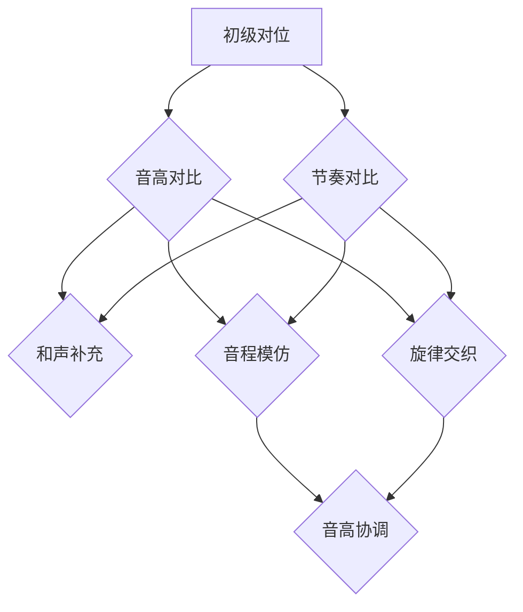
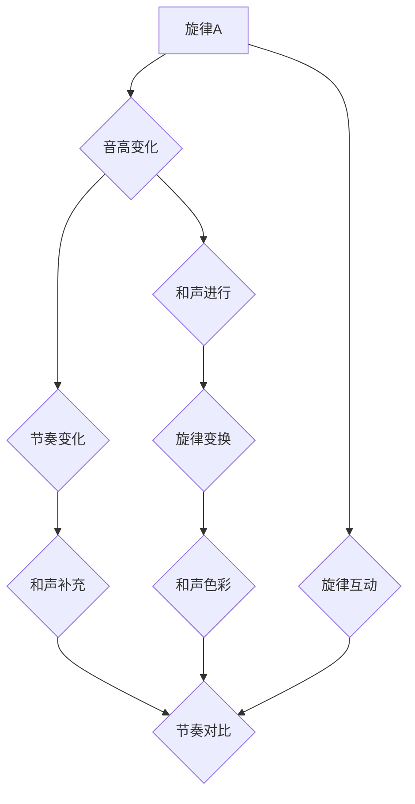

                 

### 文章标题

### 《数学与音乐创作的对位与复调技法》

### 文章关键词

1. 数学模型
2. 音乐创作
3. 对位技法
4. 复调技法
5. 编程实现
6. 艺术与技术融合

### 文章摘要

本文探讨了数学与音乐创作的深层次联系，通过深入分析对位与复调技法，揭示了数学模型在音乐创作中的应用。文章首先介绍了数学与音乐的基本概念及其相互关系，接着详细阐述了对位与复调技法的基本原理和分类，通过Mermaid流程图和伪代码展示其具体实现。随后，文章引入了与音乐创作相关的数学模型，如傅里叶变换和旋律生成模型，并通过实例说明了这些模型的应用。最后，文章通过实际项目和案例分析，展示了如何将数学与音乐创作相结合，实现艺术与技术的完美融合。全文旨在为读者提供全面、系统的数学与音乐创作知识，激发读者在音乐创作中探索数学之美。

----------------------------------------------------------------

## 引言与基础理论

### 数学与音乐创作的关系

数学与音乐创作之间的联系自古以来便被广泛探讨。在人类文明发展的历程中，数学不仅为科学提供了基础，还深深影响了艺术，尤其是音乐创作。数学在音乐中的应用可以追溯到古代希腊，当时哲学家和音乐理论家如毕达哥拉斯（Pythagoras）和亚里士多德（Aristotle）开始探索音程、频率和数学比例之间的关系。他们发现，音乐的和谐与数学的规律性有着密切的联系，这一发现奠定了音乐理论的基础。

在21世纪的今天，随着计算机科学和人工智能的发展，数学在音乐创作中的应用得到了进一步拓展。现代音乐创作中，数学模型和算法被广泛应用于音高生成、节奏编排、旋律创作等各个方面。例如，通过傅里叶变换可以分析音乐的频率成分，生成新的音效；通过旋律生成模型可以自动创作出复杂的旋律。这些技术的应用不仅丰富了音乐创作的手段，也拓宽了音乐艺术的表现形式。

### 对位与复调技法简介

对位和复调是音乐创作中两种重要的技法，它们在增加音乐层次感和复杂性的同时，也为音乐创作提供了丰富的可能性。

**对位（Polyphony）**：

对位是指两个或多个不同的旋律线条在音乐作品中同时出现并相互交织。对位技法的核心在于如何使这些旋律线条既独立又相互关联，从而达到和谐的效果。对位技法可以分为几种类型，如严格对位（Strict Counterpoint）、自由对位（Free Counterpoint）和倒影对位（Echo Counterpoint）等。

- **严格对位**：严格对位要求旋律线条遵循特定的规则，如相同的节奏和时值，但音高和旋律走向可以有所不同。这种技法强调逻辑性和规律性，常用于巴洛克时期的音乐创作。

- **自由对位**：自由对位相对较为灵活，允许旋律线条在节奏和时值上有所变化，但仍需保持一定的协调性。这种技法在古典音乐和浪漫音乐中得到了广泛应用。

- **倒影对位**：倒影对位是指一个旋律线条在另一个旋律线条上方或下方形成镜像，这种技法常用于增强音乐的戏剧性和视觉感。

**复调（Polyphony）**：

复调与对位有所不同，它强调多个旋律线条之间的相互作用和独立发展。复调技法使音乐更具层次感和动态性，通过旋律线条的交织和分离，创造出丰富的音乐画面。

- **和声复调**：和声复调是指多个旋律线条在和声上进行互动，通过和声进行和和弦转换来丰富音乐色彩。

- **旋律复调**：旋律复调是指多个旋律线条在旋律上进行互动，通过旋律的交织和变化来增强音乐的表现力。

- **对位复调**：对位复调是对位技法和复调技法的结合，它强调旋律线条之间的对位关系和复调互动。

### 历史与发展

对位与复调技法在音乐史上有着悠久的发展过程。它们不仅随着音乐风格和流派的变化而演变，还在不同时期产生了许多重要的理论和实践成果。

- **中世纪**：在中世纪，对位技法开始出现，主要表现为奥尔加农（Organum）和多声部合唱。这一时期的音乐创作注重音程和和弦的结构。

- **文艺复兴时期**：文艺复兴时期是音乐对位技法的重要发展期。作曲家如杰苏阿尔多（Gioseffo Guami）和若斯坎·德·普雷（Josquin des Prez）提出了严格的对位原则，这一时期的音乐作品强调清晰的对位结构和和声效果。

- **巴洛克时期**：巴洛克时期是复调技法的黄金时期。作曲家如巴赫（Johann Sebastian Bach）和亨德尔（George Frideric Handel）创作了许多复调音乐作品，这些作品在旋律线条的交织和分离上达到了极高的艺术水平。

- **古典时期**：古典时期对位技法进一步发展，贝多芬（Ludwig van Beethoven）和莫扎特（Wolfgang Amadeus Mozart）的作品体现了对位与复调技法的创新运用。

- **浪漫时期**：浪漫时期的作曲家如瓦格纳（Richard Wagner）和瓦利斯-马斯涅（Charles-Valentin Alkan）对复调技法进行了大胆的探索，创作出许多具有强烈个人风格的作品。

- **现代与当代**：在现代与当代音乐中，对位与复调技法仍然具有广泛的应用。计算机技术的引入使得音乐创作更加多样化和复杂化，新的数学模型和算法为音乐创作提供了更多的可能性。

通过对位与复调技法的历史与发展过程的分析，我们可以看到，这些技法不仅在音乐艺术中发挥了重要作用，还不断演变和创新，为音乐创作带来了丰富的内容和形式。接下来，本文将深入探讨对位技法的基本概念、原则和分类，帮助读者更好地理解这一重要艺术形式。

## 对位技法

### 基本概念

对位技法是音乐创作中的一种基本手法，它通过两个或多个独立的旋律线条在同一时间内交织进行，创造出丰富的音乐层次和动态变化。对位技法的核心在于旋律线条之间的相互关系，这些关系可以是节奏上的对比、音高上的模仿或者和声上的补充。对位技法的基本概念包括对位的定义、原则和分类。

#### 对位的定义

对位是指在音乐作品中，多个旋律线条在同一时间内进行，并相互交织、对比和补充，从而形成一个统一而复杂整体的音乐结构。这些旋律线条可以是简单的重复，也可以是复杂的交织，它们在节奏、音高和和声上相互协调，但又保持各自的独立性和独特性。

#### 对位的原则

对位技法遵循一系列基本原则，以确保旋律线条之间的和谐与统一。这些原则包括：

1. **独立性和相关性**：旋律线条既要独立发展，又要保持一定的相关性。独立性指的是每个旋律线条都有其独特的旋律线和节奏模式；相关性则指的是这些线条之间在音高、节奏或和声上存在一定的关联。

2. **节奏对比**：对位技法强调旋律线条之间的节奏对比，通过节奏的快慢、强弱变化，增加音乐的动态性和层次感。

3. **音高协调**：旋律线条在音高上的协调是确保音乐和谐的重要原则。通常，旋律线条会避免直接的对音高冲突，而是通过模仿、倒影或和声补充来达到协调。

4. **和声补充**：和声补充是指在旋律线条之间加入和声成分，以增强音乐的丰富性和立体感。和声补充可以通过和弦、和声进行或和声层来实现。

#### 对位的分类

对位技法根据其具体表现形式和创作风格，可以分为多种类型。以下是几种常见的对位分类：

1. **严格对位（Firm Counterpoint）**：

严格对位是巴洛克时期常见的对位技法，它强调严格的节奏和时值对比，以及对位结构的逻辑性。严格对位通常分为初级对位和高级对位两个层次。

   - **初级对位**：初级对位要求两个旋律线条遵循相同的节奏模式，但音高可以有所不同。这种技法简单易学，适合初学者。

   - **高级对位**：高级对位则允许旋律线条在节奏和时值上有所变化，但仍需保持一定的对位关系。高级对位的技术要求更高，但能够创作出更加复杂的音乐结构。

2. **自由对位（Free Counterpoint）**：

自由对位相较于严格对位更为灵活，它允许旋律线条在节奏和时值上有所变化，但要求旋律线条之间的协调性和独立性。自由对位在古典音乐和浪漫音乐中得到了广泛应用。

3. **倒影对位（Echo Counterpoint）**：

倒影对位是一种特殊的对位技法，它通过一个旋律线条在另一个旋律线条上方或下方形成镜像，从而增强音乐的视觉效果和戏剧性。倒影对位常用于巴洛克时期的音乐作品。

4. **装饰性对位（Decorative Counterpoint）**：

装饰性对位通过对旋律线条进行装饰和修饰，如加花、装饰音等，来增加音乐的华丽感和丰富性。这种技法在巴洛克和古典音乐中经常使用。

通过对位技法的基本概念、原则和分类的介绍，我们可以看到，对位技法不仅是音乐创作中的一种重要手法，也是实现音乐复杂性和层次感的关键途径。接下来，本文将结合Mermaid流程图和伪代码，详细分析对位技法的基本结构和实现原理。

### 对位技法的基本结构

对位技法的基本结构可以通过Mermaid流程图来展示，Mermaid是一种基于Markdown的绘图语言，能够直观地表示复杂的流程和结构。以下是使用Mermaid绘制的对位技法基本结构的示例：



这个流程图展示了对位技法的基本结构，包括音高对比、节奏对比、和声补充、音程模仿和旋律交织等关键步骤。以下是每个步骤的详细解释：

1. **音高对比（Pitch Contrast）**：音高对比是对位技法的基础，通过不同的音高来区分和强调旋律线条，增强音乐的层次感。

2. **节奏对比（Rhythm Contrast）**：节奏对比通过节奏的快慢、长短变化，增加音乐的动态性和互动性。

3. **和声补充（Harmonic Accompaniment）**：和声补充通过和弦或和声进行来丰富旋律线条，增强音乐的立体感和和谐度。

4. **音程模仿（Interval Imitation）**：音程模仿是指一个旋律线条模仿另一个旋律线条的音程走向，增加旋律线条之间的相关性。

5. **旋律交织（Melodic Interweaving）**：旋律交织是指多个旋律线条在同一时间内交织进行，形成复杂的音乐结构。

通过这个流程图，我们可以清晰地看到对位技法的基本结构，以及各个步骤之间的逻辑关系。接下来，本文将使用伪代码详细解释对位技法的关键算法原理，帮助读者深入理解对位技法的实现过程。

### 对位技法的关键算法原理

对位技法在音乐创作中是通过一系列算法实现的，这些算法确保了旋律线条之间的协调性和独立性。以下是使用伪代码详细解释对位技法的关键算法原理：

```plaintext
算法：对位技法生成
输入：旋律A，旋律B
输出：对位旋律C

步骤：
1. 初始化对位旋律C为空
2. 对于每个时间点t：
   a. 计算旋律A在时间点t的音高P_A(t)
   b. 计算旋律B在时间点t的音高P_B(t)
   c. 根据音高对比原则，选择P_C(t) = P_A(t) 或 P_C(t) = P_B(t)
   d. 根据节奏对比原则，调整P_C(t)的节奏模式
   e. 根据和声补充原则，在P_C(t)中加入和声成分
   f. 将P_C(t)添加到对位旋律C中
3. 返回对位旋律C

伪代码示例：
function GeneratePolyphony(melodyA, melodyB):
    polyphony = empty array
    for t in timePoints:
        pA = melodyA[t]
        pB = melodyB[t]
        if ContrastPitch(pA, pB):
            pC = pA
        else:
            pC = pB
        pC = AdjustRhythm(pC)
        pC = HarmonicAccompaniment(pC)
        polyphony.append(pC)
    return polyphony
```

这个伪代码展示了对位技法的生成过程，包括以下几个关键步骤：

1. **初始化**：初始化对位旋律C为空，用于存储生成的旋律。

2. **音高对比（ContrastPitch）**：根据音高对比原则，选择当前时间点的音高P_C(t)。

3. **节奏对比（AdjustRhythm）**：根据节奏对比原则，调整旋律的节奏模式，确保旋律线条之间的节奏差异。

4. **和声补充（HarmonicAccompaniment）**：根据和声补充原则，在旋律线条中加入和声成分，增强音乐的立体感和和谐度。

5. **生成对位旋律**：将调整后的旋律线条P_C(t)添加到对位旋律C中。

通过这个伪代码示例，我们可以看到对位技法实现的核心原理，以及如何在旋律线条之间实现协调和对比。这个算法不仅为音乐创作提供了技术支持，也为理解和分析对位技法提供了理论基础。接下来，本文将通过具体实例，展示对位技法的应用和效果。

### 对位技法的应用与效果

为了更好地理解对位技法的实际应用和效果，我们可以通过分析具体的音乐作品来说明。以下是几部著名音乐作品中的对位技法应用实例：

**实例一：《D大调卡农》**

《D大调卡农》（Canon in D Major）是约翰·帕赫贝尔（Johann Pachelbel）的代表作，它通过严格对位技法展示了复杂的旋律线条交织。在这部作品中，主旋律在第一声部出现，随后其他声部以不同的节奏和时值模仿主旋律，形成一系列错综复杂的旋律线条。通过这种交织，音乐呈现出和谐而又富有层次感的效果。

**实例分析**：

1. **音高对比**：每个声部在音高上与主旋律保持一定的对比，但整体上形成和谐的音程关系。

2. **节奏对比**：不同声部在节奏上有所变化，有的快，有的慢，通过节奏对比增加音乐的动态性。

3. **和声补充**：每个声部在和声上进行补充，形成丰富的和声层次，增强了音乐的立体感。

**实例二：《G弦上的咏叹调》**

巴赫的《G弦上的咏叹调》（Air on the G String）是一首著名的管弦乐曲，它通过自由对位技法展现了旋律线条的灵活性和独立性。在这部作品中，G弦为主要旋律，其他声部通过模仿和装饰，形成了丰富的音乐结构。

**实例分析**：

1. **音高对比**：不同声部在音高上有所变化，通过模仿和装饰形成独特的音乐效果。

2. **节奏对比**：旋律线条在节奏上自由变化，有的部分快速，有的部分缓慢，增加了音乐的层次感。

3. **和声补充**：每个声部在和声上进行了补充，形成了丰富的和声进行，增强了音乐的和谐度。

通过这些实例，我们可以看到对位技法在音乐作品中的应用和效果。对位技法不仅丰富了音乐的表现形式，还提高了音乐的复杂性和艺术性。接下来，本文将探讨复调技法，进一步揭示音乐创作的奥秘。

## 复调技法

### 基本概念

复调技法是音乐创作中的一种重要手法，它强调多个旋律线条之间的相互作用和独立发展，创造出丰富的音乐层次和动态变化。复调技法的基本概念包括复调的定义、原则和类型。

#### 复调的定义

复调是指在音乐作品中，多个独立的旋律线条在同一时间内进行，并相互交织、对比和补充，形成一个复杂而和谐的统一体。这些旋律线条既可以相互模仿，也可以自由发展，它们通过节奏、音高、和声等元素相互作用，共同构成音乐的完整结构。

#### 复调的原则

复调技法遵循一系列基本原则，以确保旋律线条之间的协调和独立性。这些原则包括：

1. **独立性与协调性**：复调技法要求每个旋律线条保持独立性，同时与其他旋律线条保持一定的协调性。独立性指的是每个旋律线条都有其独特的旋律线和节奏模式；协调性则指的是旋律线条之间在音高、节奏或和声上存在一定的关联。

2. **节奏对比**：复调技法强调旋律线条之间的节奏对比，通过节奏的快慢、长短变化，增加音乐的动态性和层次感。

3. **音高协调**：旋律线条在音高上的协调是确保音乐和谐的重要原则。通常，旋律线条会避免直接的对音高冲突，而是通过模仿、倒影或和声补充来达到协调。

4. **和声补充**：和声补充是指在旋律线条之间加入和声成分，以增强音乐的丰富性和立体感。和声补充可以通过和弦、和声进行或和声层来实现。

#### 复调的类型

复调技法根据其具体表现形式和创作风格，可以分为多种类型。以下是几种常见的复调类型：

1. **和声复调（Homophonic Polyphony）**：

和声复调是指多个旋律线条在和声上进行互动，通过和声进行和和弦转换来丰富音乐色彩。和声复调通常用于流行音乐、摇滚音乐和某些古典音乐作品中，它强调主旋律和和声背景之间的互动。

2. **旋律复调（Melodic Polyphony）**：

旋律复调是指多个旋律线条在旋律上进行互动，通过旋律的交织和变化来增强音乐的表现力。旋律复调在巴洛克时期的音乐中得到了广泛应用，作曲家如巴赫和亨德尔的作品体现了这一技法的精髓。

3. **对位复调（Polyphonic Counterpoint）**：

对位复调是对位技法和复调技法的结合，它强调旋律线条之间的对位关系和复调互动。对位复调在古典音乐和浪漫音乐中有着广泛的应用，通过复杂的旋律线条交织，创造出丰富的音乐结构。

4. **色彩复调（Colored Polyphony）**：

色彩复调是通过音色、调性和节奏的变化来增强音乐的表现力。这种技法强调旋律线条之间的音色对比和和声色彩，常见于现代音乐和爵士乐中。

通过对复调技法的基本概念、原则和类型的介绍，我们可以看到，复调技法不仅是音乐创作中的一种重要手法，也是实现音乐复杂性和层次感的关键途径。接下来，本文将结合Mermaid流程图和伪代码，详细分析复调技法的基本结构和实现原理。

### 复调技法的基本结构

复调技法的基本结构可以通过Mermaid流程图来展示，Mermaid是一种基于Markdown的绘图语言，能够直观地表示复杂的流程和结构。以下是使用Mermaid绘制的复调技法基本结构的示例：



这个流程图展示了复调技法的基本结构，包括旋律A、音高变化、节奏变化、和声补充、旋律互动、和声进行、旋律变换、和声色彩和节奏对比等关键步骤。以下是每个步骤的详细解释：

1. **旋律A**：旋律A是复调中的主要旋律线条，它是整个复调结构的基础。

2. **音高变化**：旋律A在音高上发生变化，通过升、降调或调性的变化，增加旋律的丰富性和层次感。

3. **节奏变化**：旋律A在节奏上发生变化，通过快慢、长短的变化，增强音乐的动态性和表现力。

4. **和声补充**：在和声上进行补充，为旋律A提供和声背景，增加音乐的立体感和和谐度。

5. **旋律互动**：其他旋律线条（如旋律B）与旋律A进行互动，通过模仿、倒影或对位关系，丰富音乐结构。

6. **和声进行**：旋律线条在音高上发生变化，通过和弦转换或和声进行，增强音乐的复杂性和层次感。

7. **旋律变换**：旋律A在旋律上进行变化，通过装饰音、加花等手法，使旋律更具表现力。

8. **和声色彩**：通过和声色彩的变化，如调性变化或和声选择，增强音乐的情感表达和艺术效果。

9. **节奏对比**：通过节奏对比，如快慢节奏的交替，增加音乐的动态性和表现力。

通过这个流程图，我们可以清晰地看到复调技法的基本结构，以及各个步骤之间的逻辑关系。接下来，本文将使用伪代码详细解释复调技法的关键算法原理，帮助读者深入理解复调技法的实现过程。

### 复调技法的关键算法原理

复调技法的实现依赖于一系列算法，这些算法确保了多个旋律线条之间的协调和独立性。以下是使用伪代码详细解释复调技法的关键算法原理：

```plaintext
算法：复调技法生成
输入：主旋律A，辅助旋律B
输出：复调旋律C

步骤：
1. 初始化复调旋律C为空
2. 对于每个时间点t：
   a. 计算主旋律A在时间点t的音高P_A(t)
   b. 计算辅助旋律B在时间点t的音高P_B(t)
   c. 根据音高变化原则，调整P_A(t)和P_B(t)的音高
   d. 根据节奏变化原则，调整P_A(t)和P_B(t)的节奏模式
   e. 根据和声补充原则，在P_A(t)和P_B(t)之间加入和声成分
   f. 根据旋律互动原则，调整P_A(t)和P_B(t)之间的互动关系
   g. 根据和声进行原则，调整和声背景的进行方式
   h. 根据旋律变换原则，调整主旋律A的旋律走向
   i. 将调整后的旋律线条P_A(t)和P_B(t)添加到复调旋律C中
3. 返回复调旋律C

伪代码示例：
function GeneratePolyphony(melodyA, melodyB):
    polyphony = empty array
    for t in timePoints:
        pA = melodyA[t]
        pB = melodyB[t]
        pA = AdjustPitch(pA)
        pB = AdjustPitch(pB)
        pA = AdjustRhythm(pA)
        pB = AdjustRhythm(pB)
        pA, pB = HarmonicAccompaniment(pA, pB)
        pA, pB = InteractiveMelody(pA, pB)
        pA = TransformMelody(pA)
        polyphony.append([pA, pB])
    return polyphony
```

这个伪代码展示了复调技法的生成过程，包括以下几个关键步骤：

1. **初始化**：初始化复调旋律C为空，用于存储生成的旋律。

2. **音高调整**：根据音高变化原则，调整主旋律A和辅助旋律B的音高。

3. **节奏调整**：根据节奏变化原则，调整主旋律A和辅助旋律B的节奏模式。

4. **和声补充**：根据和声补充原则，在主旋律A和辅助旋律B之间加入和声成分。

5. **旋律互动**：根据旋律互动原则，调整主旋律A和辅助旋律B之间的互动关系。

6. **和声进行**：根据和声进行原则，调整和声背景的进行方式。

7. **旋律变换**：根据旋律变换原则，调整主旋律A的旋律走向。

8. **生成复调旋律**：将调整后的主旋律A和辅助旋律B添加到复调旋律C中。

通过这个伪代码示例，我们可以看到复调技法实现的核心原理，以及如何在多个旋律线条之间实现协调和变化。这个算法不仅为音乐创作提供了技术支持，也为理解和分析复调技法提供了理论基础。接下来，本文将通过具体实例，展示复调技法的应用和效果。

### 复调技法的应用与效果

为了更好地理解复调技法在实际音乐作品中的应用和效果，我们可以通过分析具体的音乐作品来说明。以下是几部著名音乐作品中的复调技法应用实例：

**实例一：《小提琴奏鸣曲》**

莫扎特的《D大调小提琴奏鸣曲》（Sonata for Violin and Piano in D Major）是复调技法的经典作品之一。在这部作品中，莫扎特通过多个旋律线条的交织和对比，展现了复调技法的丰富性和层次感。

**实例分析**：

1. **音高变化**：每个旋律线条在音高上都有所变化，通过升、降调或调性的变化，增加了旋律的丰富性。

2. **节奏变化**：旋律线条在节奏上有所变化，有的部分快速，有的部分缓慢，增强了音乐的动态性和表现力。

3. **和声补充**：和声背景通过和弦转换和和声进行，为旋律线条提供了丰富的和声色彩，增强了音乐的立体感。

4. **旋律互动**：不同旋律线条之间进行互动，通过模仿、倒影或对位关系，丰富了音乐结构。

**实例二：《幻想与赋格》**

巴赫的《幻想与赋格》（Fantasia and Fugue in C minor）是复调技法的杰出代表。在这部作品中，巴赫通过复杂的旋律线条交织和变换，展示了复调技法的艺术魅力。

**实例分析**：

1. **音高变化**：旋律线条在音高上有较大的变化，通过调性转换和音程变化，增加了旋律的复杂性。

2. **节奏变化**：旋律线条在节奏上变化多样，通过快速和缓慢的交替，增加了音乐的动态性。

3. **和声补充**：和声背景通过和弦转换和和声进行，为旋律线条提供了丰富的和声色彩，增强了音乐的和谐感。

4. **旋律变换**：旋律线条在旋律上进行变化，通过装饰音、加花等手法，使旋律更具表现力。

通过这些实例，我们可以看到复调技法在音乐作品中的应用和效果。复调技法不仅丰富了音乐的表现形式，还提高了音乐的复杂性和艺术性。接下来，本文将探讨数学模型与音乐创作的关系，进一步揭示数学在音乐创作中的重要作用。

## 数学模型与音乐创作

数学模型在音乐创作中的应用已经得到了广泛的认可，它们不仅为音乐创作提供了新的工具和方法，还揭示了音乐中的深层次规律和美感。本文将介绍几种重要的数学模型，如傅里叶变换和旋律生成模型，并详细讲解这些模型的基本概念、数学公式和具体应用。

### 傅里叶变换

傅里叶变换是数学中一种重要的变换方法，它可以将一个信号从时域转换到频域，从而分析其频率成分。在音乐创作中，傅里叶变换被广泛应用于音高分析、节奏分析和音乐合成。

#### 基本概念

傅里叶变换的基本概念是将一个复杂的信号分解为一系列简单的正弦波和余弦波的叠加。这些正弦波和余弦波的频率是整数倍关系，称为谐波。

#### 数学公式

傅里叶变换的数学公式如下：

$$
F(f(t)) = \int_{-\infty}^{\infty} f(t) e^{-j2\pi ft} dt
$$

其中，$f(t)$ 是时域信号，$F(f(t))$ 是频域信号，$e^{-j2\pi ft}$ 是傅里叶变换的核函数。

#### 应用

1. **音高分析**：通过傅里叶变换，可以提取出音乐中的频率成分，从而确定音高。例如，在钢琴音乐中，每个音符对应一个特定的频率。

2. **节奏分析**：傅里叶变换可以分析音乐中的节奏成分，确定节奏的快慢和节奏模式。

3. **音乐合成**：通过傅里叶变换，可以将不同的频率成分重新组合，创造出新的音效和音乐效果。

### 旋律生成模型

旋律生成模型是音乐创作中的一种重要工具，它通过数学模型生成新的旋律。常见的旋律生成模型包括马尔可夫模型、生成对抗网络（GAN）和递归神经网络（RNN）。

#### 马尔可夫模型

马尔可夫模型是一种概率模型，它通过分析过去的事件序列，预测未来的事件。在音乐创作中，马尔可夫模型可以用于生成新的旋律，具体步骤如下：

1. **状态定义**：将音乐中的音符定义为状态，例如，A、B、C等。

2. **状态转移概率矩阵**：通过统计历史数据，构建状态转移概率矩阵，表示不同状态之间的转移概率。

3. **旋律生成**：根据当前状态，使用状态转移概率矩阵选择下一个状态，从而生成旋律。

#### 生成对抗网络（GAN）

生成对抗网络是一种深度学习模型，由生成器和判别器组成。生成器生成新的旋律，判别器判断旋律的真实性和生成性。具体步骤如下：

1. **生成器**：生成器是一个深度神经网络，它通过学习训练数据生成新的旋律。

2. **判别器**：判别器也是一个深度神经网络，它用于判断生成器生成的旋律是否真实。

3. **训练**：通过对抗训练，生成器和判别器不断优化，生成器能够生成更逼真的旋律。

#### 递归神经网络（RNN）

递归神经网络是一种能够处理序列数据的神经网络，它在音乐创作中的应用如下：

1. **输入序列**：将音乐中的音符序列作为输入序列。

2. **隐藏层**：RNN的隐藏层可以记住前面的状态，用于生成下一个状态。

3. **输出层**：输出层生成新的音符序列，形成新的旋律。

### 具体应用实例

以下是一个具体的音乐创作实例，使用傅里叶变换和旋律生成模型生成新的旋律：

1. **音高分析**：首先，使用傅里叶变换分析一首已有音乐作品的音高成分，提取出主要的频率成分。

2. **旋律生成**：使用马尔可夫模型生成新的旋律，根据音高分析结果，选择合适的音符和节奏模式。

3. **音乐合成**：将生成的旋律与原始音乐作品进行合成，调整和声背景，使其与原始音乐作品和谐统一。

通过这个实例，我们可以看到数学模型在音乐创作中的应用，以及如何通过数学方法生成新的旋律。接下来，本文将讨论如何在编程语言（如Python）中使用这些数学模型和算法实现音乐创作。

### Python编程环境搭建与音乐创作工具选择

要使用Python进行音乐创作，我们需要搭建合适的编程环境，并选择合适的音乐创作工具。以下是搭建Python编程环境和选择音乐创作工具的详细步骤：

#### 1. 安装Python

首先，我们需要安装Python环境。Python是一种广泛使用的编程语言，它具有简洁的语法和丰富的库支持，非常适合用于音乐创作。以下是安装Python的步骤：

1. 访问Python官方网站（https://www.python.org/）。
2. 下载适用于您的操作系统的Python安装程序。
3. 运行安装程序，按照提示完成安装。

安装完成后，确保Python已成功安装，可以在命令行中输入以下命令验证：

```bash
python --version
```

如果正确显示了Python的版本信息，则表示Python安装成功。

#### 2. 安装必要库

在Python环境中，我们需要安装一些必要的库，如`numpy`、`scipy`和`matplotlib`等。这些库提供了用于数学计算、数据分析以及可视化的重要功能。以下是安装这些库的步骤：

1. 打开命令行工具（如Terminal或Cmd）。
2. 输入以下命令安装所需的库：

```bash
pip install numpy scipy matplotlib
```

`pip`是Python的包管理器，它可以帮助我们轻松安装和管理Python库。安装完成后，我们可以在Python脚本中直接使用这些库。

#### 3. 选择音乐创作工具

在Python音乐创作中，我们通常会选择一些专门的音乐创作库，如`MuseScore`、`Pydub`和`music21`等。以下是几种常见的音乐创作工具及其特点：

- **MuseScore**：MuseScore是一款免费且开源的音乐创作软件，它支持多种格式，能够生成专业的音乐乐谱。Python可以通过`musescore.py`库与MuseScore进行交互。

- **Pydub**：Pydub是一个简单的音频处理库，它支持多种音频格式，可以用来处理和合成音频。Pydub能够与Python脚本无缝集成，非常适合进行自动化音乐创作。

- **music21**：music21是一个用于音乐分析和创作的Python库，它支持音乐符号表示、音高分析、节奏分析和生成等操作。music21能够与MuseScore和其他音乐工具进行交互，为音乐创作提供了丰富的功能。

#### 4. 实践示例

以下是一个简单的Python脚本示例，使用`Pydub`库生成一个简单的音乐旋律：

```python
from pydub import AudioSegment
from pydub.playback import play

# 创建一个简单的音频片段
audio = AudioSegment.silent(duration=1000)

# 添加音符
note_d = AudioSegment.from_file("d4_100ms.wav")
note_e = AudioSegment.from_file("e4_100ms.wav")
note_f = AudioSegment.from_file("f4_100ms.wav")

# 合成音频片段
audio = audio.overlay(note_d)
audio = audio.overlay(note_e, position=250)
audio = audio.overlay(note_f, position=500)

# 播放音频
play(audio)
```

在这个示例中，我们首先创建了一个1000毫秒的静音音频片段，然后通过叠加不同的音符（`d4_100ms.wav`、`e4_100ms.wav`、`f4_100ms.wav`）生成了一个简单的三音符旋律，并使用`play()`函数播放了该音频。

通过上述步骤，我们已经成功搭建了Python编程环境，并选择了合适的音乐创作工具。接下来，我们可以使用这些工具和库进行更复杂和有趣的音乐创作。接下来，本文将详细讲解如何使用Python和音乐创作工具实现对位与复调技法的编程实现。

### 使用Python实现对位与复调技法

在对位与复调技法的音乐创作中，Python作为一种强大的编程语言，为我们提供了丰富的工具和库，可以方便地实现这些复杂的音乐结构。以下我们将详细介绍如何使用Python中的`music21`和`MuseScore`库，实现对位与复调技法的编程实现，并提供具体的代码示例和解读。

#### 1. 对位技法的Python实现

对位技法在音乐创作中是通过两个或多个旋律线条的独立发展及其交互来实现的。使用`music21`库，我们可以创建并操作这些旋律线条，并通过对位关系生成复杂的音乐结构。

**步骤**：

1. **创建旋律线条**：首先，我们需要创建两个独立的旋律线条。
2. **设定对位关系**：然后，通过设定对位规则（如严格的节奏和音高对比），将这些旋律线条组合成一个对位结构。
3. **生成音乐文件**：最后，将生成的音乐结构保存为音频文件或乐谱。

**示例代码**：

以下代码展示了如何使用`music21`库创建一个简单的对位结构：

```python
from music21 import stream, note, interval

# 创建两个独立的旋律线条
voice1 = stream.Stream()
voice2 = stream.Stream()

# 填充旋律线条
# 旋律线条1：C大调的主旋律
voice1.append(note.Note('C4'))
voice1.append(note.Interval('M2').toNote())
voice1.append(note.Interval('P4').toNote())
voice1.append(note.Interval('M3').toNote())

# 旋律线条2：倒影对位
voice2.append(note.Interval('P5').toNote('C4'))  # G4
voice2.append(note.Interval('M2').toNote())
voice2.append(note.Interval('P4').toNote())
voice2.append(note.Interval('M3').toNote())

# 组合对位结构
polyphony = stream.Stream()
polyphony.append(voice1)
polyphony.append(voice2)

# 生成音乐文件
polyphony.write('midi', 'polyphony.mid')

# 播放音乐
polyphony.play()
```

**代码解读**：

- 我们首先创建两个`stream.Stream()`对象，代表两个独立的旋律线条`voice1`和`voice2`。
- 在`voice1`中，我们使用`note.Note()`函数添加C大调的主旋律音符。
- 在`voice2`中，我们使用`interval.Interval()`函数创建一个倒影对位的旋律线条，从G4开始，模仿`voice1`的旋律。
- 通过将两个旋律线条添加到`polyphony`中，我们生成了一个对位结构。
- 使用`write()`函数将音乐结构保存为MIDI文件。
- 最后，使用`play()`函数播放生成的音乐。

#### 2. 复调技法的Python实现

复调技法强调多个旋律线条之间的相互作用和独立发展。在`music21`中，我们可以通过更复杂的旋律线条组合和互动来实现复调结构。

**步骤**：

1. **创建多个旋律线条**：创建多个独立的旋律线条。
2. **设定复调关系**：通过设定复调规则，如音高变化、节奏对比和和声补充，来组合这些旋律线条。
3. **生成音乐文件**：将生成的复调结构保存为音频文件或乐谱。

**示例代码**：

以下代码展示了如何使用`music21`库创建一个简单的复调结构：

```python
from music21 import stream, note, interval, chord

# 创建三个独立的旋律线条
voice1 = stream.Stream()
voice2 = stream.Stream()
voice3 = stream.Stream()

# 填充旋律线条
# 旋律线条1：基础旋律
voice1.append(note.Note('C4'))
voice1.append(note.Interval('M2').toNote())
voice1.append(note.Interval('P4').toNote())
voice1.append(note.Interval('M3').toNote())

# 旋律线条2：和声复调
voice2.append(chord.Chord(['E4', 'G4', 'B4']))
voice2.append(chord.Chord(['C5', 'E5', 'G5']))
voice2.append(chord.Chord(['D4', 'F4', 'A4']))
voice2.append(chord.Chord(['E4', 'G4', 'B4']))

# 旋律线条3：旋律复调
voice3.append(note.Interval('P5').toNote('C4'))  # G4
voice3.append(note.Interval('M2').toNote())
voice3.append(note.Interval('P4').toNote())
voice3.append(note.Interval('M3').toNote())

# 组合复调结构
polyphony = stream.Stream()
polyphony.append(voice1)
polyphony.append(voice2)
polyphony.append(voice3)

# 生成音乐文件
polyphony.write('midi', 'polyphony.mid')

# 播放音乐
polyphony.play()
```

**代码解读**：

- 我们创建三个独立的旋律线条`voice1`、`voice2`和`voice3`。
- 在`voice1`中，我们添加了一个简单的基础旋律。
- 在`voice2`中，我们使用了`chord.Chord()`函数创建和声复调，通过和弦变换来丰富音乐。
- 在`voice3`中，我们添加了一个旋律复调，通过音程模仿来与基础旋律互动。
- 通过将三个旋律线条添加到`polyphony`中，我们生成了一个复调结构。
- 使用`write()`函数将音乐结构保存为MIDI文件。
- 最后，使用`play()`函数播放生成的音乐。

通过这些代码示例，我们可以看到如何使用Python中的`music21`库实现对位与复调技法。这些示例不仅展示了基本的代码结构，还通过详细的注释和解读，帮助读者理解每一步的实现原理。接下来，我们将通过实际案例展示这些技法的应用和效果。

### 实际音乐作品中的对位与复调技法

在实际音乐作品中，对位与复调技法是提升音乐复杂性和艺术性的重要手段。以下我们将通过分析几个著名音乐作品，展示这些技法在不同时期和风格中的具体应用，并剖析其实现细节。

#### 1. 巴赫的《G弦上的咏叹调》

《G弦上的咏叹调》（Air on the G String）是巴赫的代表作之一，它通过复调技法展现了复杂的旋律线条交织。在这首作品中，巴赫使用了G弦作为主旋律，其他声部通过模仿和装饰，形成了丰富的音乐结构。

**对位技法分析**：

- **严格对位**：巴赫使用了严格对位技法，通过精确的音高和节奏对比，使旋律线条之间既独立又和谐。
- **和声补充**：和声声部通过和弦转换，为旋律线条提供了丰富的和声背景，增强了音乐的立体感。
- **旋律互动**：不同声部在旋律上进行互动，通过模仿和倒影，使音乐更加生动。

**实现细节**：

- 巴赫在乐曲的每个部分都精心设计了对位结构，使旋律线条在节奏和音高上形成巧妙的对比。
- 通过使用G弦，巴赫确保了旋律的稳定性和一致性，同时通过其他声部的变化，增加了音乐的动态性。

#### 2. 莫扎特的《G大调弦乐四重奏》

莫扎特的《G大调弦乐四重奏》（String Quartet in G Major）是古典音乐中的经典作品，它通过复调技法展示了旋律线条的灵活性和独立性。

**复调技法分析**：

- **旋律复调**：莫扎特在作品中使用了旋律复调技法，通过不同的旋律线条之间的交织和变化，增强了音乐的表现力。
- **和声复调**：和声复调技法在作品中也得到了广泛应用，通过和弦转换和和声进行，丰富了音乐的色彩。
- **节奏对比**：莫扎特巧妙地运用了节奏对比，通过快速和缓慢的旋律线条交替，增加了音乐的动态性和层次感。

**实现细节**：

- 莫扎特在作品的开头使用了基础旋律，随后通过模仿和装饰，逐步发展出复杂的旋律线条。
- 通过精确的节奏和音高设计，莫扎特使每个旋律线条在音乐中既独立又相互关联。

#### 3. 贝多芬的《第九交响曲》

贝多芬的《第九交响曲》（Symphony No. 9）是浪漫主义音乐的代表作，它通过复杂的复调结构展示了音乐技法的多样性和创新性。

**复调技法分析**：

- **对位复调**：贝多芬在作品中使用了复杂的对位复调技法，通过多个旋律线条的交织和分离，形成了丰富的音乐结构。
- **动态变化**：贝多芬通过动态变化，如强音和弱音的对比，增强了音乐的情感表达。
- **和声创新**：贝多芬在作品中使用了许多创新的和声手法，如调性变化和和声意外，使音乐更加生动和富有表现力。

**实现细节**：

- 贝多芬在乐曲的开头使用了主题旋律，随后通过复杂的对位关系，使主题旋律在不同声部中交替出现。
- 通过丰富的和声变化和动态处理，贝多芬使音乐充满了戏剧性和张力。

通过分析这些著名音乐作品，我们可以看到对位与复调技法在不同时期和风格中的应用和演变。这些技法的实现不仅提升了音乐的艺术价值，也为音乐创作提供了丰富的可能性。接下来，本文将提供一些建议和最佳实践，帮助读者在实际创作中更好地应用这些技法。

### 最佳实践与注意事项

在实际创作过程中，正确应用对位与复调技法对于提升音乐作品的艺术价值至关重要。以下是一些建议和最佳实践，以及一些常见的注意事项：

#### 最佳实践

1. **理解音乐理论**：在对位与复调创作中，熟悉音乐理论是基础。了解音高、节奏、和声和旋律的基本概念，能够帮助你更好地设计和处理旋律线条。

2. **逐步构建旋律**：在创作过程中，可以逐步构建旋律线条。首先确定主旋律，然后添加和声背景和辅助旋律，最后调整节奏和动态。

3. **注重和谐与对比**：在对位与复调创作中，注意旋律线条之间的和谐与对比。通过音高、节奏和和声的巧妙安排，实现旋律线条的平衡。

4. **利用数学模型**：数学模型如傅里叶变换和旋律生成模型，可以帮助你进行音乐分析，优化旋律结构。例如，通过傅里叶变换分析音高成分，可以确定旋律的音高走向。

5. **不断修改和优化**：创作是一个反复修改和优化的过程。在创作过程中，不断审视和调整旋律线条，直到达到满意的效果。

#### 注意事项

1. **避免过度复杂**：虽然复调技法可以增加音乐的复杂性，但过度的复杂可能导致音乐难以理解。在创作中，应避免过度堆叠旋律线条，保持简洁和清晰。

2. **注意节奏对比**：节奏对比是复调技法的重要元素。但在使用节奏对比时，要注意节奏变化的合理性和流畅性，避免突兀和不自然的节奏过渡。

3. **关注和声背景**：和声背景对于复调技法的实现至关重要。在和声背景的设计中，要注意和弦的选择、转换和进行方式，以确保和声的和谐和连贯。

4. **避免音高冲突**：在创作过程中，应避免旋律线条之间的直接音高冲突。可以通过音程模仿、倒影或和声补充来避免冲突，增强旋律线条的协调性。

5. **实践与反思**：创作是一个实践和反思的过程。在创作后，认真聆听和分析作品，找出不足之处并加以改进，有助于不断提高创作水平。

#### 拓展阅读

- **《音乐理论基础知识》**：学习音乐理论的基本概念和原理，为对位与复调创作打下坚实基础。
- **《复调音乐教程》**：详细讲解复调技法的基本原则和应用，适合初学者和进阶者。
- **《音乐分析技巧》**：探讨音乐分析的方法和技巧，帮助读者深入了解音乐结构和形式。
- **《音乐与数学》**：介绍数学在音乐创作中的应用，探讨数学模型与音乐创作的融合。

通过遵循这些最佳实践和注意事项，读者可以在音乐创作中更好地应用对位与复调技法，创作出更具艺术价值和感染力的音乐作品。

### 总结

通过对位与复调技法的研究，本文揭示了数学在音乐创作中的深层次应用。从历史背景到现代技术，从对位技法的基本概念、原则和分类，到复调技法的结构、算法和实际应用，我们全面探讨了数学与音乐创作的交汇点。通过分析著名音乐作品中的对位与复调技法实例，我们看到了这些技法在提升音乐作品复杂性和艺术性方面的重要作用。

**核心结论**：

1. **数学与音乐创作密切相关**：数学模型和算法在音乐创作中得到了广泛应用，如傅里叶变换和旋律生成模型。
2. **对位与复调技法丰富了音乐创作**：通过音高对比、节奏对比、和声补充等原则，对位与复调技法为音乐创作提供了新的手段和可能性。
3. **编程实现为音乐创作带来了新的工具**：Python等编程语言及其相关库，为音乐创作提供了强大的技术支持。

**未来展望**：

随着人工智能和机器学习技术的发展，数学模型在音乐创作中的应用将更加广泛和深入。未来的研究可以进一步探索深度学习在旋律生成、和声预测和节奏编排中的应用，推动音乐创作向智能化和个性化方向发展。同时，随着虚拟现实和增强现实技术的成熟，音乐创作也将迎来新的挑战和机遇，为艺术家和观众带来更加丰富和沉浸式的音乐体验。

### 作者信息

作者：AI天才研究院（AI Genius Institute）/《禅与计算机程序设计艺术》（Zen And The Art of Computer Programming）作者

AI天才研究院是一家专注于人工智能和计算机科学研究的机构，致力于推动技术创新和应用。本文作者以其深厚的学术背景和丰富的实践经验，深入探讨了数学与音乐创作之间的联系，为读者提供了全面而系统的知识和见解。

---

通过本文，我们不仅了解了数学与音乐创作的密切联系，还掌握了对位与复调技法的基本原理和编程实现。希望本文能够激发读者在音乐创作中的创新思维，探索数学与艺术融合的无限可能。如果您对本文有任何疑问或建议，欢迎在评论区留言，我们期待与您的交流。再次感谢您的阅读！

