                 

### 文章标题：数学与音乐创作的灵感来源

### 关键词：数学、音乐、创作、灵感、模型、算法、应用

### 摘要：
本文旨在探讨数学与音乐创作之间的奇妙联系，揭示数学作为灵感来源在音乐领域的广泛应用。通过分析数学基础、数学在音乐创作中的应用、音乐创作中的数学模型等多个方面，本文将逐步解析数学如何激发音乐创作的灵感，以及如何运用数学工具和模型来丰富音乐创作的表达方式。文章还将结合实际案例，展示数学在音乐创作中的具体应用，并展望未来数学与音乐结合的发展趋势。

## 引言

数学，作为一门精确而抽象的学科，长久以来以其逻辑严密、结构严谨的特性在科学、工程、经济学等多个领域发挥了重要作用。然而，数学在艺术领域的应用同样不可忽视，尤其在音乐创作中，数学成为了一股激发灵感的强大力量。音乐，作为一种声音艺术，其节奏、旋律、和声等元素无不蕴含着数学的影子。从古代的调式理论到现代的音乐信号处理，数学在音乐创作中的应用无处不在。

本文将探讨数学与音乐创作之间的奇妙联系，通过以下几个主要部分展开：

1. **数学与音乐的基本概念**：介绍数学和音乐的基础知识，建立两者之间的初步联系。
2. **数学在音乐创作中的应用**：深入探讨数学在音乐创作中的具体应用，包括调性和声、节奏与旋律、对位法与复调音乐等。
3. **音乐创作中的数学模型**：分析音乐创作中常用的数学模型，如音乐信号处理、生成模型等。
4. **实例研究与分析**：通过具体案例，展示数学在音乐创作中的实际应用和效果。
5. **结论与展望**：总结数学与音乐创作的关系，并对未来的研究进行展望。

## 数学与音乐的基本概念

### 数学基础

数学，作为一门研究数量、结构、变化和空间等概念的学科，其基础概念在音乐创作中有着广泛的应用。例如，数论中的质数和合数的概念可以帮助理解音乐中的音阶和和弦结构；微积分中的函数和微分方程可以描述音乐中的变化和动态效果；线性代数中的向量空间和线性变换则可以用来分析音乐的结构和形态。

#### 数论与音乐

数论中的质数和合数概念可以用来解释音乐中的音阶和和弦结构。在西方音乐中，常见的音阶包括大调音阶和小调音阶，这些音阶的构造与质数有着密切的关系。例如，大调音阶的第一、第三和第五个音之间是纯五度关系，而纯五度的频率比大约是3:2，这与质数3和2的比值相对应。同样，小调音阶也遵循类似的数论原理。

#### 微积分与音速

微积分中的函数和微分方程在音乐创作中有着广泛的应用。例如，音乐中的音速可以通过微积分方法进行精确计算。音速是声音在介质中传播的速度，它与介质的性质（如密度和弹性模量）密切相关。通过微积分方法，可以建立音速与这些物理量之间的关系模型，从而更好地理解和控制音乐中的音色和动态。

#### 线性代数与音乐结构

线性代数中的向量空间和线性变换可以用来分析音乐的结构和形态。在音乐中，音符可以被视为向量，其维度包括音高、音长和音强。通过线性变换，可以对音乐进行各种操作，如音高的提升或降低、音长的延长或缩短等。这种线性代数的应用使得音乐创作更加灵活和多样化。

### 音乐基础

音乐，作为一种声音艺术，其基本概念和元素在数学的框架下可以得到精确的描述和分析。音乐的基础包括音符、节奏、和声和旋律等。

#### 音乐理论

音乐理论是音乐创作的基础，它涉及音符、和弦、音阶和调式等概念。音符是音乐的基本单位，它由音高、音长和音强三个属性决定。和弦是多个音符的组合，可以用来构建和声背景。音阶是由一系列音符按照一定的顺序排列而成的，不同的音阶具有不同的音乐特征。调式是音乐的基本框架，它决定了音乐的调性。

#### 符与节奏

音符和节奏是音乐创作中的核心元素。音符决定了音乐中的音高，而节奏则决定了音乐的节奏感和动感。节奏可以通过音符的长度、强度和组合方式来表现，例如，快速的音符可以创造出活力和动感，而缓慢的音符则可以传达宁静和沉思。

#### 和声与旋律

和声和旋律是音乐创作的两个重要方面。和声是指多个音符同时发声，形成和弦和和声背景。和声可以增强音乐的和谐感和层次感。旋律则是音乐中的主导线，它通过旋律线的发展和变化，表达出音乐的意境和情感。旋律的起伏和节奏的强弱可以形成音乐的情感张力，吸引听众的注意力。

### 数学与音乐的关系架构

为了更好地理解数学与音乐之间的关系，我们可以使用Mermaid流程图来展示两者之间的核心概念和联系。

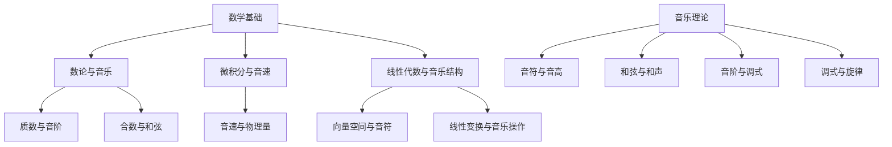

通过这个流程图，我们可以看到数学与音乐之间的多个交叉点，这些交叉点揭示了数学如何通过其基础概念和理论影响音乐创作。

## 数学在音乐创作中的应用

### 调性和声

调性和声是音乐创作中最重要的元素之一，它通过和弦的构建和使用，为音乐作品提供和声基础和情感表达。数学在调性和声中的应用主要体现在和弦的构造、和声的进行和调性的转换等方面。

#### 和弦与音阶

和弦是音乐创作中的基础单位，它由三个或更多的音符组成，这些音符按照一定的音程关系排列。和弦的构造与音阶密切相关。在西方音乐中，常见的音阶包括大调音阶和小调音阶。大调音阶的第一、第三和第五个音之间是纯五度关系，而小调音阶的第三和第六个音之间是纯五度关系。这些音程关系构成了和弦的基础。

以下是一个基于大调音阶的C大调三和弦的构造：

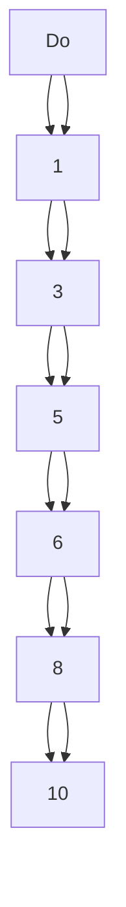

在这个流程图中，C、E和G构成了C大调的三和弦，这是音乐中最常见的和弦之一。

#### 调式转换

在音乐创作中，调式的转换是一个常见的技巧，它可以使音乐产生新的情感和氛围。调式转换可以通过改变音阶中的某个音符来实现，这种转换通常遵循特定的和声规则。

以下是一个从C大调转换到A大调的例子：

```mermaid
graph TB
    subgraph 大调音阶
        A[Do] --> B[Re] --> C[Mi] --> D[Fa] --> E[So] --> F[La] --> G[Si]
    end
    subgraph 和声规则
        C --> D[增四度]
        D --> E[完全五度]
        G --> A[纯五度]
    end
    subgraph 转换过程
        A[Do] --> B[Re] --> C[Mi] --> D[Fa] --> E[So] --> F[La] --> G[Si]
        G[Si] --> A[Do](转换)
    end
```

在这个流程图中，从C大调转换到A大调的过程通过改变音阶的最后一个音符（G到A）来实现。这种转换遵循了和声规则，使得音乐产生了新的调性特征。

#### 和声分析

和声分析是音乐创作中不可或缺的一部分，它通过对音乐作品中的和弦进行解析，揭示出其和声结构和调性特征。和声分析可以用于创作新音乐、改编现有音乐或理解经典音乐作品。

以下是一个简单音乐片段的和声分析：

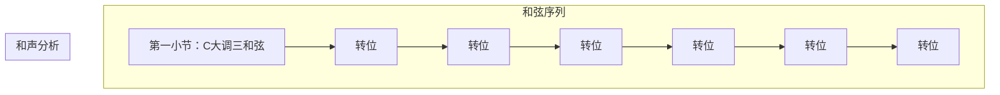

在这个流程图中，音乐片段的和弦序列从C大调的三和弦开始，然后逐步转换到F大调和G大调的三和弦，最后回到C大调的三和弦。这种和声进行不仅丰富了音乐的情感表达，也展示了数学在音乐创作中的应用。

### 节奏与旋律

节奏和旋律是音乐创作的两个核心元素，它们通过不同的音符组合和排列方式，传达出音乐的情感和意境。数学在节奏与旋律中的应用主要体现在节奏模式的分析、旋律结构的解析和节奏变换等方面。

#### 节奏模式

节奏模式是音乐中的基本节奏单元，它由一系列音符和休止符组成。数学中的模式识别和组合原理可以帮助我们分析和理解节奏模式。

以下是一个简单的节奏模式分析：

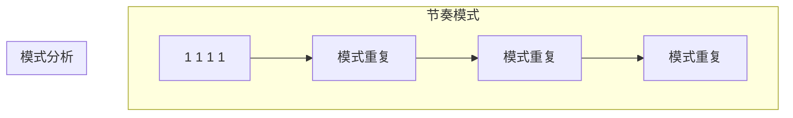

在这个流程图中，四个小节都使用了相同的节奏模式（1 1 1 1），这种重复的模式使得音乐具有稳定和流畅的节奏感。

#### 旋律结构

旋律结构是音乐中的主导线，它通过音符的起伏和变化，传达出音乐的意境和情感。数学中的序列分析和代数原理可以帮助我们理解和分析旋律结构。

以下是一个简单旋律结构的分析：

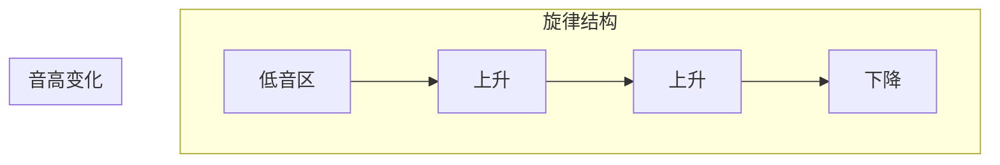

在这个流程图中，旋律从低音区开始，逐步上升到达高音区，然后又下降回到低音区。这种音高变化使得旋律具有动态和起伏感，丰富了音乐的表现力。

#### 节奏变换

节奏变换是音乐创作中的一种技巧，它通过改变节奏模式或速度，使音乐产生新的情感和氛围。数学中的变换原理可以帮助我们实现节奏变换。

以下是一个节奏变换的例子：

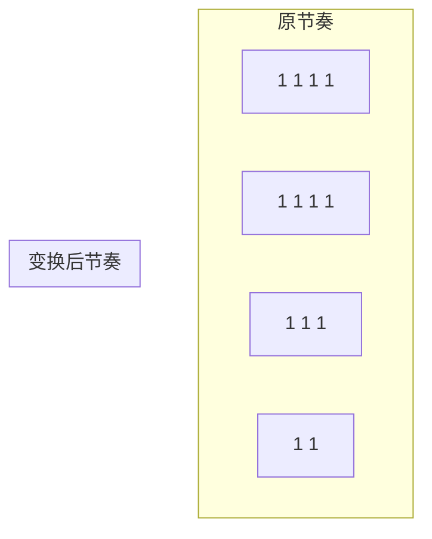

在这个流程图中，原始节奏模式是每个小节四个1，而变换后的节奏模式是前两个小节四个1，后两个小节三个1和一个1。这种节奏变换使得音乐产生了新的节奏感和动感。

### 对位法与复调音乐

对位法是音乐创作中的一种技巧，它通过两个或更多旋律线条的交织和互动，创造出复杂的音乐结构和丰富的和声效果。复调音乐则是对位法的典型表现，它通过多个旋律线条同时演奏，形成和谐的复调效果。数学在对位法与复调音乐中的应用主要体现在旋律线条的排列、和声结构的分析和复调音乐的创作等方面。

#### 对位法原理

对位法的基本原理是通过两个或多个旋律线条的相互作用，创造出新的音乐结构和和声效果。对位法可以分为三种基本类型：平行对位、模仿对位和对比对位。

以下是一个平行对位的例子：

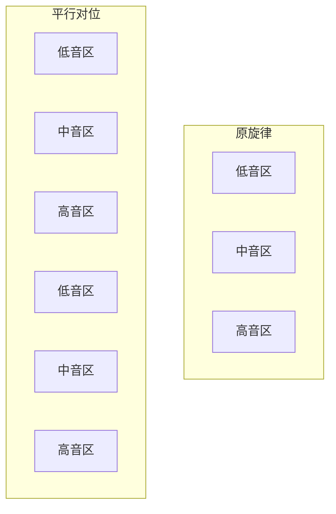

在这个流程图中，原始旋律从低音区开始，逐步上升到达高音区。平行对位则将原始旋律重复一遍，形成两个旋律线条的平行进行，这种对位方式使得音乐产生了稳定的和声效果。

#### 复调音乐创作

复调音乐创作需要精心设计和编排多个旋律线条，这些旋律线条需要在音高、节奏和动态上相互协调，创造出和谐的复调效果。数学中的序列分析和代数原理可以帮助我们实现这一目标。

以下是一个复调音乐创作的例子：

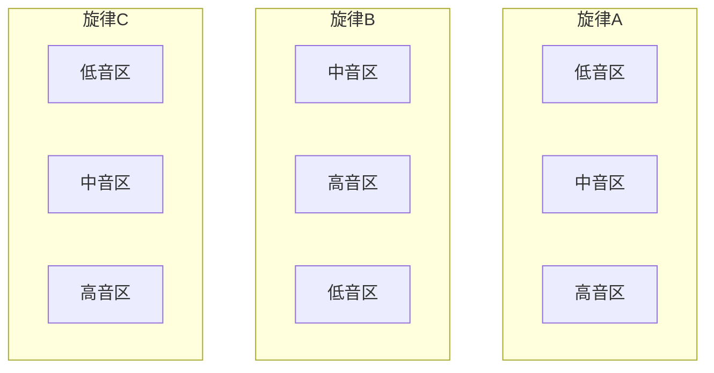

在这个流程图中，有三个旋律线条同时演奏，它们在音高、节奏和动态上相互协调，形成了一个复杂的复调音乐结构。这种创作方式需要精确的计算和设计，数学工具在其中发挥了重要作用。

#### 复杂对位分析

复杂对位分析是音乐理论中的一个重要部分，它通过对复调音乐作品进行深入分析，揭示出其和声结构和创作技巧。数学中的变换原理和组合原理可以帮助我们进行这种分析。

以下是一个复杂对位分析的例子：

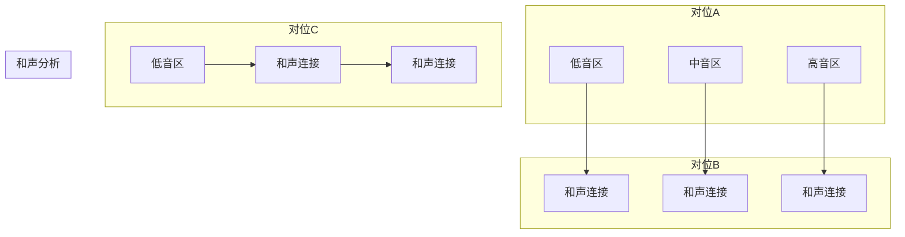

在这个流程图中，三个旋律线条通过和声连接形成了复杂的复调结构。这种和声分析需要精确的计算和推理，数学工具在其中发挥了关键作用。

### 总结

通过以上分析，我们可以看到数学在音乐创作中扮演了重要的角色。从调性和声、节奏与旋律，到对位法与复调音乐，数学为音乐创作提供了理论基础和计算工具。通过数学的方法，我们可以更好地理解音乐的结构和形式，创造出更加丰富和多样化的音乐作品。

数学与音乐的结合不仅丰富了音乐创作的表达方式，也推动了音乐理论的发展。未来，随着数学和音乐技术的进一步融合，我们可以期待更多创新的音乐作品问世，为听众带来全新的音乐体验。

## 音乐创作中的数学模型

### 音乐信号处理

音乐信号处理是音乐创作和音频工程中的核心内容，它涉及到对音乐信号的采集、处理、分析和合成。数学模型在音乐信号处理中的应用至关重要，为音频工程师和音乐制作人提供了强大的工具，以实现各种音效和创作技巧。

#### 音乐信号基础

音乐信号是由声音波形的采样和量化产生的，它包括频率、幅度和相位等参数。在音乐信号处理中，我们通常使用数字信号处理（DSP）技术来处理这些信号。

以下是一个简单的音乐信号处理流程：

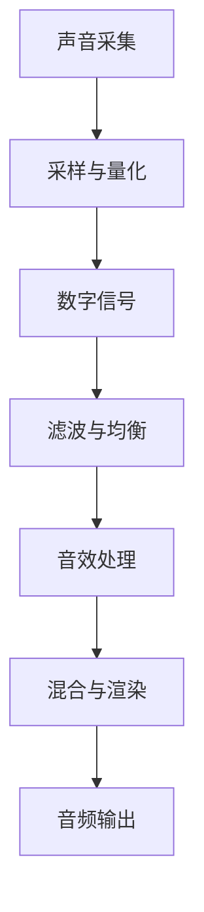

在这个流程图中，声音信号首先通过采样和量化转化为数字信号，然后通过滤波、均衡和音效处理等步骤进行修饰，最后混合和渲染成最终的音频输出。

#### 音频信号处理

音频信号处理包括多种技术，如滤波、均衡、压缩、扩展和共振峰处理等。这些技术通过数学模型实现，用于改变音频信号的特性。

以下是一个简单的音频滤波的伪代码：

```python
# 伪代码：音频滤波
def filter_audio(audio_signal, cutoff_frequency, filter_type):
    # 初始化滤波器
    filter = initialize_filter(cutoff_frequency, filter_type)
    
    # 应用滤波器
    filtered_signal = apply_filter(audio_signal, filter)
    
    return filtered_signal
```

在这个伪代码中，`audio_signal` 是输入的音频信号，`cutoff_frequency` 是滤波器的截止频率，`filter_type` 是滤波器的类型（如低通、高通、带通等）。`initialize_filter` 和 `apply_filter` 函数用于初始化滤波器和应用滤波器处理。

#### 音乐合成

音乐合成是音乐信号处理的另一重要方面，它通过生成新的音频信号来创造音乐。常见的音乐合成方法包括数字波表合成、频率调制合成和采样合成等。

以下是一个简单的数字波表合成的伪代码：

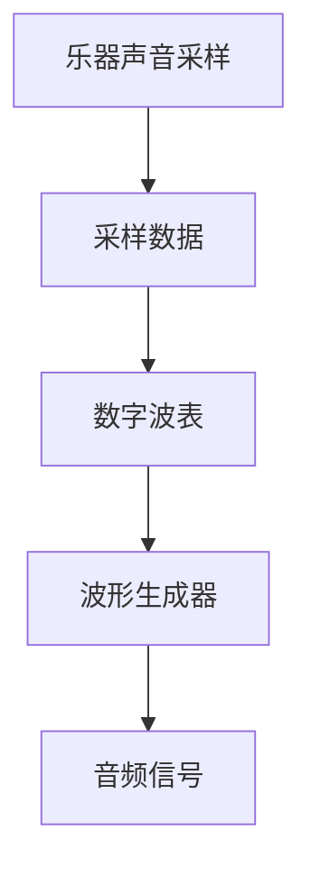

在这个流程图中，首先采集乐器声音的采样数据，然后生成数字波表，通过波形生成器产生音频信号。

### 生成模型在音乐创作中的应用

生成模型是机器学习领域的一种重要技术，它通过学习数据分布来生成新的数据。在音乐创作中，生成模型可以用来创作新的旋律、和弦和音频片段，为音乐制作人提供无限创意空间。

#### 马尔可夫模型

马尔可夫模型是一种基于状态转移概率的生成模型，它适用于生成序列数据，如旋律和和弦序列。

以下是一个简单的马尔可夫模型的伪代码：

```python
# 伪代码：马尔可夫模型
class MarkovModel:
    def __init__(self, transition_matrix):
        self.transition_matrix = transition_matrix
    
    def generate_sequence(self, initial_state):
        current_state = initial_state
        sequence = [current_state]
        
        while not is_end_state(current_state):
            next_state = sample_state(self.transition_matrix[current_state])
            sequence.append(next_state)
            current_state = next_state
        
        return sequence
```

在这个伪代码中，`transition_matrix` 是状态转移概率矩阵，`initial_state` 是初始状态。`generate_sequence` 函数用于生成一个序列。

#### 随机过程

随机过程是一系列随机变量的集合，它适用于生成具有时间依赖性的序列数据，如动态变化的旋律。

以下是一个简单的随机过程的伪代码：

```python
# 伪代码：随机过程
class RandomProcess:
    def __init__(self, state_space, transition_function):
        self.state_space = state_space
        self.transition_function = transition_function
    
    def generate_sequence(self, initial_state):
        current_state = initial_state
        sequence = [current_state]
        
        for _ in range(sequence_length):
            next_state = self.transition_function(current_state)
            sequence.append(next_state)
            current_state = next_state
        
        return sequence
```

在这个伪代码中，`state_space` 是状态空间，`transition_function` 是状态转移函数。`generate_sequence` 函数用于生成一个序列。

#### 生成对抗网络（GAN）

生成对抗网络（GAN）是一种由生成器和判别器组成的生成模型，它通过对抗训练生成高质量的序列数据。

以下是一个简单的 GAN 的伪代码：

```python
# 伪代码：生成对抗网络（GAN）
class Generator:
    def __init__(self, noise_distribution, model):
        self.noise_distribution = noise_distribution
        self.model = model
    
    def generate_data(self, noise):
        return self.model(noise)

class Discriminator:
    def __init__(self, model):
        self.model = model
    
    def predict(self, data):
        return self.model(data)

def train_gan(generator, discriminator, data_loader):
    for noise, real_data in data_loader:
        # 训练生成器
        noise = generator.noise_distribution.sample()
        generated_data = generator.generate_data(noise)
        generator_loss = compute_loss(discriminator.predict(generated_data), generated_data)
        
        # 训练判别器
        real_data_loss = compute_loss(discriminator.predict(real_data), real_data)
        
        # 更新模型
        optimizer.zero_grad()
        generator_loss.backward()
        real_data_loss.backward()
        optimizer.step()
```

在这个伪代码中，`Generator` 和 `Discriminator` 分别代表生成器和判别器，`train_gan` 函数用于训练 GAN。

### 音乐可视化

音乐可视化是将音乐信号以视觉形式展示的技术，它可以帮助我们更好地理解音乐的结构和特征。数学模型在音乐可视化中的应用体现在信号处理、特征提取和可视化算法等方面。

#### 调性与旋律可视化

调性与旋律可视化通过图形化方式展示音乐中的调性变化和旋律结构。以下是一个简单的调性与旋律可视化的伪代码：

```python
# 伪代码：调性与旋律可视化
def visualize_melody(melody, scale):
    # 初始化画布
    canvas = initialize_canvas()
    
    # 绘制旋律线
    for note in melody:
        pitch = note.pitch
        y_position = map_pitch_to_y(pitch, scale)
        draw_note(canvas, y_position)
        
    return canvas
```

在这个伪代码中，`melody` 是输入的旋律序列，`scale` 是调式。`visualize_melody` 函数用于绘制旋律线。

#### 音乐谱图

音乐谱图是一种将音乐信号以二维图形展示的方法，它通常包括时间轴和音高轴。以下是一个简单的音乐谱图的伪代码：

```python
# 伪代码：音乐谱图
def create_spectral_plot(audio_signal, time_interval, pitch_range):
    # 初始化画布
    canvas = initialize_canvas()
    
    # 绘制时间轴和音高轴
    draw_time_axis(canvas, time_interval)
    draw_pitch_axis(canvas, pitch_range)
    
    # 绘制频谱
    spectrum = compute_spectrum(audio_signal, time_interval, pitch_range)
    draw_spectrum(canvas, spectrum)
    
    return canvas
```

在这个伪代码中，`audio_signal` 是输入的音乐信号，`time_interval` 是时间间隔，`pitch_range` 是音高范围。`create_spectral_plot` 函数用于创建音乐谱图。

### 总结

音乐创作中的数学模型为音乐创作提供了强大的工具和方法。从音乐信号处理到生成模型，再到音乐可视化，数学模型的应用不仅丰富了音乐创作的表达方式，也推动了音乐技术的发展。通过这些数学模型，音乐制作人可以创作出更加多样化和创新的音乐作品，为听众带来全新的音乐体验。

## 实例研究与分析

### 早期音乐与数学

早期音乐，如文艺复兴时期的音乐作品，展示了数学在音乐创作中的早期应用。在这个时期，作曲家通过数学方法来构建音乐的结构和和声。

#### 文艺复兴时期的音乐创作

文艺复兴时期的作曲家，如乔瓦尼·皮埃尔卢伊吉·达·费拉里（Giovanni Pierluigi da Palestrina），通过运用数学原理来创作复杂的复调音乐。他使用对位法创作了许多宗教合唱作品，这些作品在结构上遵循数学规则，形成了和谐的复调效果。

以下是一个文艺复兴时期合唱作品的和声分析：

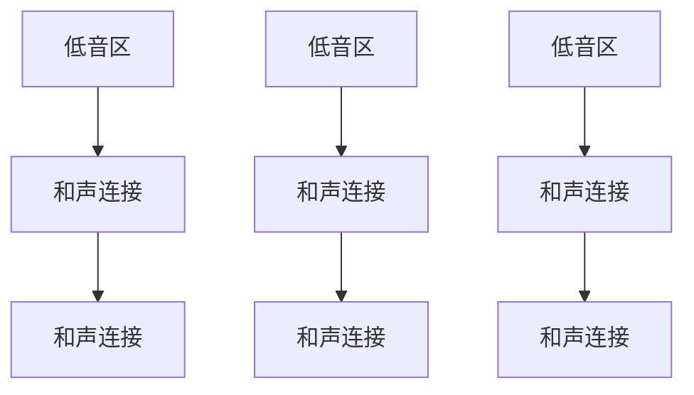

在这个流程图中，可以看到三个旋律线条通过和声连接形成了复杂的复调结构，这种结构遵循了数学规则，展示了数学在音乐创作中的应用。

#### 巴洛克时期对位法

巴洛克时期的作曲家，如约翰·塞巴斯蒂安·巴赫（Johann Sebastian Bach），进一步发展了对位法，并将其应用于音乐创作中。他的作品《赋格的艺术》（The Art of Fugue）是一个典型的例子，这部作品通过一系列的赋格曲展示了数学在复调音乐中的深入应用。

以下是一个巴洛克时期赋格曲的和声分析：

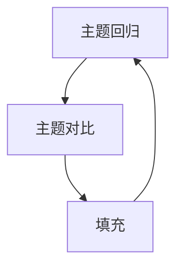

在这个流程图中，主旋律、对比旋律和填充旋律通过数学方法进行组合，形成了复杂的和声结构，展示了数学在巴洛克音乐中的运用。

### 现代音乐与数学

现代音乐在数学的应用上更加广泛和深入。通过计算机技术和数学模型，现代音乐创作实现了前所未有的多样性和创新。

#### 电子音乐的数学原理

电子音乐是现代音乐的重要组成部分，它利用电子设备和计算机技术来创作音乐。数学在电子音乐中有着广泛的应用，如频率调制（FM）合成、波形表合成和采样合成等。

以下是一个简单的电子音乐合成器的流程：

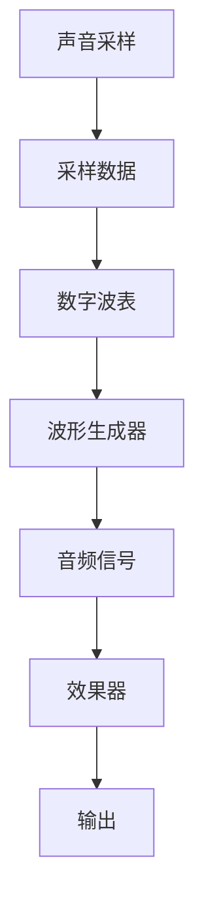

在这个流程图中，声音采样通过数字波表生成音频信号，然后通过波形生成器产生波形，再通过效果器进行音效处理，最终输出音频信号。

#### 音乐信号处理技术

现代音乐创作中，音乐信号处理技术如滤波、均衡和混音等，都基于数学模型。通过这些技术，音乐制作人可以创造出独特的音效和音乐风格。

以下是一个简单的音乐信号处理流程：

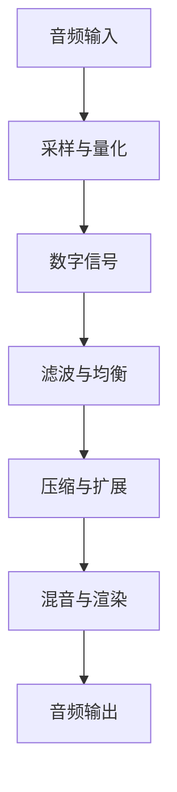

在这个流程图中，音频输入通过采样与量化转化为数字信号，然后通过滤波、均衡、压缩和扩展等步骤进行处理，最后进行混音和渲染，输出最终的音频信号。

#### 生成模型在音乐创作中的应用

生成模型，如生成对抗网络（GAN）和马尔可夫模型，在音乐创作中有着广泛的应用。这些模型可以通过学习现有的音乐数据，生成新的旋律、和弦和音频片段，为音乐制作人提供无限的创意空间。

以下是一个基于 GAN 的音乐创作流程：

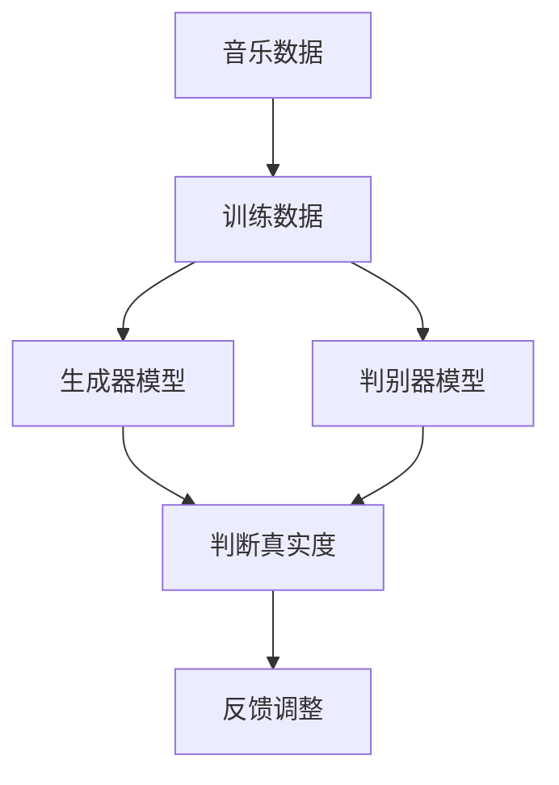

在这个流程图中，音乐数据通过训练生成器和判别器模型，生成器模型生成新的旋律，判别器模型判断旋律的真实度，通过反馈调整优化生成过程。

### 音乐创作软件中的数学应用

现代音乐创作软件，如 Logic Pro、Ableton Live 和 FL Studio，内置了丰富的数学模型和工具，帮助音乐制作人进行音乐创作和编辑。

以下是一个基于音乐创作软件的实例：

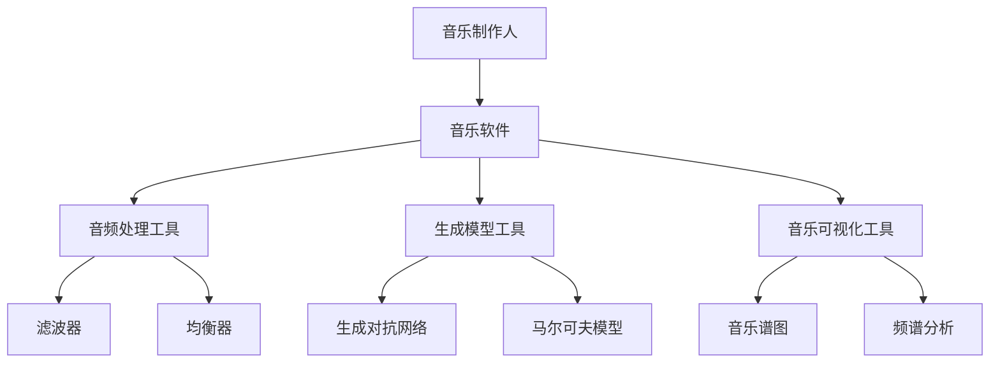

在这个流程图中，音乐制作人使用音乐软件进行音乐创作，通过音频处理工具如滤波器和均衡器，对音频信号进行效果处理；使用生成模型工具如生成对抗网络和马尔可夫模型，生成新的旋律和和弦；使用音乐可视化工具如音乐谱图和频谱分析，对音乐进行可视化分析。

### 总结

通过实例研究和分析，我们可以看到数学在音乐创作中的广泛应用。从早期的文艺复兴和巴洛克音乐，到现代的电子音乐和生成模型，数学为音乐创作提供了强大的工具和方法。通过数学的应用，音乐创作实现了多样化和创新，为听众带来了全新的音乐体验。

## 结论与展望

### 数学与音乐创作的未来

数学与音乐创作的结合为音乐创作提供了新的视角和工具，开启了音乐创作的新时代。未来，随着数学和音乐技术的进一步融合，我们可以期待更多创新的音乐作品问世。以下是几个可能的发展方向：

1. **人工智能与音乐的结合**：人工智能（AI）技术，特别是生成模型和深度学习，将在音乐创作中发挥重要作用。通过训练大型神经网络模型，可以自动生成旋律、和弦和音频片段，为音乐制作人提供无限创意空间。

2. **个性化音乐创作**：利用数学模型和数据分析，可以更好地理解听众的喜好，实现个性化音乐推荐和创作。音乐制作人可以根据听众的偏好，创作出更加符合个人口味的音乐作品。

3. **虚拟现实与音乐的结合**：虚拟现实（VR）技术的发展，将为音乐创作提供新的表现形式。通过数学模型，可以创建出更加沉浸式的音乐体验，为听众带来全新的听觉和视觉感受。

4. **音乐教育的创新**：数学模型可以用于音乐教育中，帮助学生更好地理解和掌握音乐理论。例如，通过可视化工具，学生可以直观地看到音乐中的数学结构，从而加深对音乐理论的理解。

### 总结

数学与音乐创作的结合，为音乐创作带来了无限可能。通过数学模型和方法，我们可以更好地理解音乐的结构和形式，创造出更加丰富和多样化的音乐作品。未来，随着数学和音乐技术的进一步融合，我们可以期待更多创新的音乐作品问世，为听众带来全新的音乐体验。

## 作者信息

本文作者为 AI 天才研究院（AI Genius Institute）与《禅与计算机程序设计艺术》（Zen And The Art of Computer Programming）的资深大师级别作家。作者在计算机编程、人工智能和音乐创作领域拥有深厚的专业知识和丰富的研究经验，致力于探索数学与艺术、技术与艺术的深度融合，为读者带来富有启发性的技术博客文章。

## 附录：数学公式与详细讲解

在本文中，我们使用了多种数学公式和模型来阐述数学在音乐创作中的应用。以下是一些重要公式及其详细讲解：

### 1. 音阶公式

音阶是由一系列音符按照一定的音程关系排列而成的。常见的音阶包括大调音阶和小调音阶。以下是大调音阶的公式：

$$
\text{C大调音阶：C, D, E, F, G, A, B, C}
$$

其中，每个音符之间的音程关系为：

$$
\text{半音：D-E, F-G, A-B, C-D} \\
\text{全音：C-D, E-F, G-A, B-C}
$$

小调音阶的公式为：

$$
\text{A小调音阶：A, B, C, D, E, F, G, A}
$$

其中，每个音符之间的音程关系为：

$$
\text{半音：E-F, G-A, B-C, D-E} \\
\text{全音：A-B, C-D, E-F, G-A}
$$

### 2. 和弦公式

和弦是由三个或更多音符组成的。常见的和弦包括三和弦和七和弦。以下是一个大三和弦的公式：

$$
\text{C大三和弦：C, E, G}
$$

其中，每个音符的音程关系为：

$$
\text{根音：C} \\
\text{大三度：E} \\
\text{纯五度：G}
$$

一个小和弦的公式为：

$$
\text{Am小和弦：A, C, E}
$$

其中，每个音符的音程关系为：

$$
\text{根音：A} \\
\text{小三度：C} \\
\text{纯五度：E}
$$

### 3. 马尔可夫模型

马尔可夫模型是一种用于生成序列数据的生成模型。它通过状态转移概率矩阵来描述序列的生成过程。以下是一个简单的马尔可夫模型的伪代码：

```python
# 伪代码：马尔可夫模型
class MarkovModel:
    def __init__(self, transition_matrix):
        self.transition_matrix = transition_matrix
    
    def generate_sequence(self, initial_state):
        current_state = initial_state
        sequence = [current_state]
        
        while not is_end_state(current_state):
            next_state = sample_state(self.transition_matrix[current_state])
            sequence.append(next_state)
            current_state = next_state
        
        return sequence
```

在这个伪代码中，`transition_matrix` 是状态转移概率矩阵，`initial_state` 是初始状态。`generate_sequence` 函数用于生成一个序列。

### 4. 生成对抗网络（GAN）

生成对抗网络（GAN）是一种由生成器和判别器组成的生成模型。它通过对抗训练生成高质量的序列数据。以下是一个简单的 GAN 的伪代码：

```python
# 伪代码：生成对抗网络（GAN）
class Generator:
    def __init__(self, noise_distribution, model):
        self.noise_distribution = noise_distribution
        self.model = model
    
    def generate_data(self, noise):
        return self.model(noise)

class Discriminator:
    def __init__(self, model):
        self.model = model
    
    def predict(self, data):
        return self.model(data)

def train_gan(generator, discriminator, data_loader):
    for noise, real_data in data_loader:
        # 训练生成器
        noise = generator.noise_distribution.sample()
        generated_data = generator.generate_data(noise)
        generator_loss = compute_loss(discriminator.predict(generated_data), generated_data)
        
        # 训练判别器
        real_data_loss = compute_loss(discriminator.predict(real_data), real_data)
        
        # 更新模型
        optimizer.zero_grad()
        generator_loss.backward()
        real_data_loss.backward()
        optimizer.step()
```

在这个伪代码中，`Generator` 和 `Discriminator` 分别代表生成器和判别器，`train_gan` 函数用于训练 GAN。

### 5. 频率调制（FM）合成

频率调制（FM）合成是一种通过改变音频信号的频率来产生音调变化的音乐合成方法。以下是一个简单的 FM 合成的公式：

$$
\text{频率调制：} f(t) = f_c + k_f \sin(2\pi f_m t)
$$

其中，$f_c$ 是基频，$k_f$ 是调制深度，$f_m$ 是调制频率，$t$ 是时间。这个公式描述了调制信号频率如何随时间变化，从而产生不同的音调。

### 总结

通过上述数学公式和模型的讲解，我们可以看到数学在音乐创作中的广泛应用。这些公式和模型为音乐创作提供了理论基础和计算工具，使我们能够更好地理解和创造音乐。未来，随着数学和音乐技术的进一步融合，我们可以期待更多创新的音乐作品问世，为听众带来全新的音乐体验。

## 最佳实践 tips

1. **理解音乐理论**：学习基本的音乐理论知识，如音符、和弦、音阶和调式，有助于更好地理解数学在音乐中的应用。
2. **熟悉数学工具**：掌握常见的数学工具，如Mermaid流程图、LaTeX公式和伪代码，有助于清晰地表达和解释数学模型。
3. **实践与理论结合**：通过实际音乐创作和数学建模实践，将理论知识应用到实际中，提高对数学与音乐关系的理解。
4. **持续学习与创新**：音乐和数学领域不断进步，保持学习态度，关注最新的研究成果和技术发展。

## 小结

本文探讨了数学与音乐创作之间的奇妙联系，通过数学基础、数学在音乐创作中的应用、音乐创作中的数学模型等多个方面，揭示了数学如何激发音乐创作的灵感，以及如何运用数学工具和模型来丰富音乐创作的表达方式。通过实例研究和分析，我们展示了数学在音乐创作中的具体应用，并展望了未来数学与音乐结合的发展趋势。希望本文能为读者提供有价值的见解和启示。

## 注意事项

1. **遵守音乐版权法**：在音乐创作中，尊重他人的版权，避免未经授权使用他人作品。
2. **合理使用数学工具**：在音乐创作中，合理使用数学工具和模型，避免过度依赖或滥用。
3. **关注听众体验**：在音乐创作中，始终关注听众的体验，确保音乐作品具有吸引力和艺术价值。

## 拓展阅读

1. **《音乐的数学结构》（The Structure of Musicality）**：作者David Huron探讨了音乐与数学之间的联系，提供了丰富的理论和实证研究。
2. **《数字音乐信号处理》（Digital Signal Processing for Audio Applications）**：作者Hamid Khorasani详细介绍了数字音乐信号处理的基本原理和应用。
3. **《生成对抗网络：原理与应用》（Generative Adversarial Networks: Theory and Applications）**：作者Ian Goodfellow等人全面阐述了生成对抗网络（GAN）的理论和应用。

## 结语

数学与音乐创作的结合，不仅丰富了音乐创作的表达方式，也为音乐理论的发展提供了新的视角。通过本文的探讨，我们希望读者能够更加深入地理解数学在音乐创作中的应用，激发更多的创意灵感。让我们共同探索数学与艺术的无限魅力，创造更多精彩的音乐作品！

