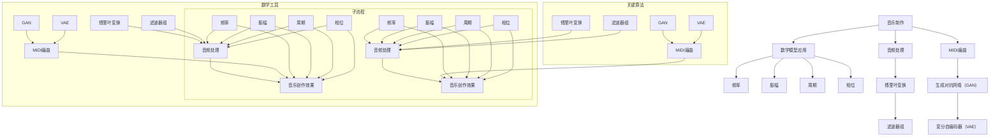
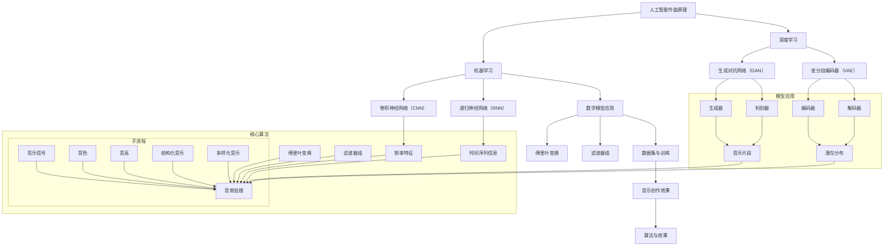

                 

### 引言

#### 1.1 引言

人工智能作曲技术近年来取得了显著的进步，成为了音乐制作领域的一大创新热点。从最初的纯算法生成到如今结合深度学习和大数据分析的智能作曲系统，人工智能在音乐创作中的应用越来越广泛。这一技术的发展不仅为音乐创作者提供了新的工具和灵感，也为音乐产业带来了变革性的影响。

本文旨在深入探讨数学与音乐制作相结合的人工智能作曲技术。通过梳理人工智能作曲技术的发展历程，解析其基础知识和核心技术，展示数学在其中的关键作用，分析人工智能作曲工具的使用方法及其优势与挑战，并展望未来人工智能作曲技术的发展趋势和社会文化影响。

文章结构如下：

1. **数学与音乐制作的基础知识**
   - **数学基础知识**：概述音乐制作所需的基本数学概念，如频率、振幅、周期等。
   - **音乐制作基础知识**：介绍音乐制作的基本流程和概念，包括音频处理、MIDI编曲、音频合成等。

2. **人工智能作曲技术概述**
   - **人工智能作曲原理**：阐述人工智能作曲的基本原理，包括机器学习、深度学习等技术在音乐制作中的应用。
   - **人工智能作曲技术分类**：概述常见的几种人工智能作曲技术，如基于规则的方法、神经网络生成模型等。

3. **数学在人工智能作曲中的应用**
   - **数学模型在人工智能作曲中的应用**：分析数学模型在人工智能作曲中的具体应用，如傅里叶变换、滤波器组等。
   - **数学公式与算法在人工智能作曲中的应用**：介绍数学公式与算法在人工智能作曲中的应用，如生成对抗网络（GAN）、变分自编码器（VAE）等。

4. **音乐制作与人工智能的融合**
   - **音乐制作与人工智能融合的案例**：分析音乐制作与人工智能融合的案例，探讨人工智能在音乐制作中的应用。
   - **人工智能在音乐制作中的优势与挑战**：讨论人工智能在音乐制作中的优势和面临的挑战，如创造性限制、版权问题等。

5. **人工智能作曲工具与应用**
   - **人工智能作曲工具概述**：概述常见的几种人工智能作曲工具，如AIVA、Boomy等。
   - **人工智能作曲工具的使用方法**：介绍人工智能作曲工具的具体使用方法，包括功能特点、操作步骤等。

6. **未来展望**
   - **人工智能作曲技术的发展趋势**：展望人工智能作曲技术的发展趋势，如更多个性化、多样化创作需求的满足。
   - **人工智能作曲在社会文化中的影响**：讨论人工智能作曲对社会文化的影响，如音乐创作、音乐欣赏等方面。

7. **结论**
   - **本书总结**：总结本书的主要内容和观点。
   - **展望未来**：对人工智能作曲技术的未来发展进行展望。

通过上述结构的详细阐述，本文将帮助读者全面了解人工智能作曲技术的数学基础、技术原理、应用案例及其未来发展方向，为音乐创作者和研究者提供有价值的参考。

#### 1.2 内容概览

本文将从多个角度深入探讨数学与音乐制作相结合的人工智能作曲技术，旨在为读者提供全面的技术解析和前沿观点。以下是本文的主要内容概览：

1. **数学与音乐制作的基础知识**：
   - **数学基础知识**：介绍音乐制作所需的基本数学概念，如频率、振幅、周期等，帮助读者理解音乐信号处理中的数学原理。
   - **音乐制作基础知识**：概述音乐制作的基本流程和概念，包括音频处理、MIDI编曲、音频合成等，为后续内容打下坚实基础。

2. **人工智能作曲技术概述**：
   - **人工智能作曲原理**：阐述人工智能作曲的基本原理，重点介绍机器学习、深度学习等技术在音乐制作中的应用，分析其如何改变音乐创作的模式。
   - **人工智能作曲技术分类**：概述常见的几种人工智能作曲技术，包括基于规则的方法、神经网络生成模型等，展示各类技术的特点和适用场景。

3. **数学在人工智能作曲中的应用**：
   - **数学模型在人工智能作曲中的应用**：深入分析数学模型在人工智能作曲中的具体应用，如傅里叶变换、滤波器组等，解释这些数学工具如何优化音乐生成过程。
   - **数学公式与算法在人工智能作曲中的应用**：介绍数学公式与算法在人工智能作曲中的应用，如生成对抗网络（GAN）、变分自编码器（VAE）等，通过伪代码和实际案例详细解释其工作原理。

4. **音乐制作与人工智能的融合**：
   - **音乐制作与人工智能融合的案例**：分析多个成功的音乐制作与人工智能融合的案例，展示人工智能在音乐创作中的实际应用。
   - **人工智能在音乐制作中的优势与挑战**：探讨人工智能在音乐制作中的优势，如提高创作效率、丰富音乐风格等，同时也分析其面临的挑战，如创造性限制、版权问题等。

5. **人工智能作曲工具与应用**：
   - **人工智能作曲工具概述**：介绍常见的人工智能作曲工具，如AIVA、Boomy等，讨论这些工具的功能、特点和适用性。
   - **人工智能作曲工具的使用方法**：详细介绍人工智能作曲工具的具体使用方法，包括操作步骤、参数设置等，帮助读者掌握实际应用技巧。

6. **未来展望**：
   - **人工智能作曲技术的发展趋势**：展望人工智能作曲技术的未来发展，如更个性化的音乐创作、更丰富的音乐风格等。
   - **人工智能作曲在社会文化中的影响**：讨论人工智能作曲对社会文化的影响，如改变音乐创作与欣赏的方式，激发新的艺术形式。

7. **结论**：
   - **本书总结**：总结本书的主要内容和观点，强调数学与音乐制作结合的重要性。
   - **展望未来**：对人工智能作曲技术的未来发展进行展望，鼓励读者关注这一领域的创新和突破。

通过本文的详细解析，读者将能够全面了解数学与音乐制作相结合的人工智能作曲技术，掌握关键概念和应用方法，为未来的研究和实践奠定基础。

### 数学与音乐制作的基础知识

在探讨人工智能作曲技术之前，我们需要先了解一些数学和音乐制作的基础知识，这些知识为后续内容的深入分析提供了必要的背景。

#### 数学基础知识

音乐制作中的数学基础主要包括频率、振幅、周期和相位等概念。

1. **频率**：频率是每秒钟振动的次数，单位为赫兹（Hz）。在音乐制作中，频率决定了声音的音高。例如，钢琴的低音C的频率约为261.6 Hz，而高音C的频率约为523.3 Hz。

2. **振幅**：振幅是声音波的最大位移，它决定了声音的音量。较大的振幅对应较大的音量，而较小的振幅则对应较小的音量。

3. **周期**：周期是一个振动完整循环所需的时间，与频率互为倒数。例如，如果频率是100 Hz，那么周期就是0.01秒。

4. **相位**：相位是指波在一个周期内的起始点，它决定了声音的同步性。在音乐中，相位差可以产生和声或共振效果。

#### 音乐制作基础知识

音乐制作涉及多个环节，包括音频处理、MIDI编曲和音频合成等。

1. **音频处理**：音频处理是音乐制作的基础，它包括录音、编辑、混音等步骤。音频处理工具如Adobe Audition、Logic Pro等，可以帮助音乐制作人调整音频信号，如降噪、均衡、压缩等。

2. **MIDI编曲**：MIDI（Musical Instrument Digital Interface）是一种数字音乐接口，它允许计算机与其他音乐设备交换音乐数据。MIDI编曲涉及创作和编排音乐旋律、和弦和节奏，常见的软件如FL Studio、Cubase等提供了丰富的MIDI编曲功能。

3. **音频合成**：音频合成是将多个音频信号组合成一个完整的音频文件的过程。合成器（Synthesizer）是音频合成的主要工具，它通过电子方式生成和修改声音。常见的音频合成器软件包括Reason、Reaper等。

#### 数学与音乐制作的关系

数学在音乐制作中的应用非常广泛，以下是一些关键的应用领域：

1. **傅里叶变换**：傅里叶变换是分析音乐信号的重要工具，它可以将时间域的信号转换为频率域的信号，从而揭示声音的频谱特性。音乐制作人可以使用傅里叶变换来分析音频信号，识别声音的频率成分，调整音色和音量。

2. **滤波器组**：滤波器组是一种用于过滤特定频率成分的数学工具，它可以用来去除不需要的噪声或增强特定的音乐元素。在音乐制作中，滤波器组广泛应用于音频处理和音频合成。

3. **生成对抗网络（GAN）**：生成对抗网络是一种基于数学模型的深度学习技术，它通过两个对抗网络的竞争来生成新的音乐数据。GAN在音乐制作中的应用包括生成新的音乐风格、创作个性化的旋律和和弦等。

4. **变分自编码器（VAE）**：变分自编码器是一种用于数据生成和降维的数学模型，它通过编码和解码器学习数据的分布。VAE在音乐制作中可以用于生成新的音乐片段，同时保留原有音乐的特色和风格。

通过这些数学工具和方法的应用，音乐制作人能够更有效地创作和调整音乐，实现多样化的音乐风格和创作效果。总之，数学在音乐制作中扮演着不可或缺的角色，为音乐创作提供了强大的技术支持。

#### 数学与音乐制作的联系架构

为了更好地理解数学在音乐制作中的应用，我们可以使用Mermaid流程图来展示各个关键概念之间的联系。



在这个流程图中，我们首先展示了音乐制作的主要环节：音频处理、MIDI编曲和音乐创作效果。然后，我们列出了与音乐制作相关的数学工具和关键算法，包括傅里叶变换、滤波器组、生成对抗网络（GAN）和变分自编码器（VAE）。这些数学工具和算法通过音频处理和MIDI编曲环节应用于音乐创作中，从而实现音乐效果的优化和创作灵感的激发。

通过这种结构化的展示，我们可以清晰地看到数学与音乐制作之间的紧密联系，以及各个数学工具和算法在音乐制作中的具体应用。这为后续章节的深入讨论提供了直观的参考。

#### 核心概念与联系

在探讨人工智能作曲技术时，理解以下几个核心概念及其相互关系是至关重要的。

**1. 人工智能作曲原理**

人工智能作曲的原理主要基于机器学习和深度学习技术。这些技术通过训练大量的音乐数据，使计算机学会创作出具有人类风格的新音乐。具体来说，深度学习模型如卷积神经网络（CNN）和递归神经网络（RNN）被广泛应用于音乐生成。CNN可以捕捉音乐信号中的频率特征，而RNN则能够处理音乐的时间序列信息。

**2. 数学模型在人工智能作曲中的应用**

数学模型在人工智能作曲中扮演着关键角色。例如，傅里叶变换（Fourier Transform）用于分析音乐信号的频谱特性，帮助生成具有特定音色和音高的音乐片段。滤波器组（Filter Banks）则用于音乐信号的处理和修饰，以实现更加精细的音乐效果。此外，生成对抗网络（GAN）和变分自编码器（VAE）等深度学习模型也基于数学原理，通过复杂的数据生成过程，创造出新颖的音乐作品。

**3. 神经网络生成模型**

神经网络生成模型是人工智能作曲的核心技术之一。这类模型包括生成对抗网络（GAN）和变分自编码器（VAE）。GAN由生成器和判别器组成，通过两个网络的对抗训练，生成出高质量的音乐片段。VAE则通过编码器和解码器，学习数据的潜在分布，从而生成具有多样性的音乐作品。

**4. 数据集与训练**

在人工智能作曲中，数据集的质量和数量直接影响模型的性能。音乐数据集通常包括MIDI文件和音频文件，这些数据被用于训练深度学习模型。在训练过程中，模型通过学习大量的音乐数据，逐渐掌握音乐创作的规律，从而生成新的音乐片段。

**5. 算法与效果**

不同的人工智能作曲算法对音乐效果有着不同的影响。例如，基于规则的算法可以生成结构化的音乐作品，但创造性有限；而深度学习模型则能够生成更加自然和多样化的音乐。此外，算法的参数设置和优化也对音乐生成效果有重要影响。

综上所述，人工智能作曲的核心概念和相互关系如图所示：



通过这张图，我们可以清晰地看到人工智能作曲中的核心概念和它们之间的联系。这些概念和关系为我们理解人工智能作曲技术的工作原理提供了直观的框架。

#### 数学公式与算法在人工智能作曲中的应用

在人工智能作曲中，数学公式和算法扮演着至关重要的角色，它们不仅帮助模型理解和生成音乐，还提升了音乐创作的多样性和质量。以下将介绍几种关键的数学公式与算法，并详细阐述它们在人工智能作曲中的应用。

##### 1. 傅里叶变换（Fourier Transform）

傅里叶变换是一种将时间域信号转换为频率域信号的方法，它在音频处理中有着广泛的应用。通过傅里叶变换，我们可以将音频信号分解为不同频率的正弦波和余弦波，从而分析声音的频谱特性。

**傅里叶变换公式：**
\[ X(\omega) = \int_{-\infty}^{\infty} x(t) e^{-i\omega t} dt \]

在人工智能作曲中，傅里叶变换常用于：

- **音色分析**：通过频谱分析，我们可以识别和调整音乐信号的音色特性，例如在合成器设计中。
- **音乐生成**：利用傅里叶变换，可以将一些基础音符和和弦扩展为更复杂的音乐片段，从而丰富音乐风格。

**案例：** 在一个基于GAN的智能作曲系统中，生成器网络可以使用傅里叶变换将输入的MIDI数据转换成频谱表示，然后通过生成器的进一步处理，生成新的音乐片段。

```python
# Python代码示例：傅里叶变换
import numpy as np
from numpy.fft import fft

# 假设输入的音频信号为x
x = np.sin(2 * np.pi * 440 * np.linspace(0, 1, 1000))

# 计算傅里叶变换
X = fft(x)

# 频率
freqs = np.fft.fftfreq(len(x), d=1/1000)
```

##### 2. 滤波器组（Filter Banks）

滤波器组是一种用于信号处理的数学工具，它通过一系列滤波器将信号分解为多个子带，以便进行进一步处理。在音乐制作中，滤波器组常用于音频均衡、效果处理和音高调整。

**滤波器组公式：**
\[ y[n] = \sum_{i=1}^{N} h_i[n] x[n] \]

其中，\( h_i[n] \) 是第 \( i \) 个滤波器的冲激响应，\( x[n] \) 是输入信号。

在人工智能作曲中，滤波器组可以：

- **频谱调整**：通过调整滤波器的参数，我们可以对音乐片段的频谱特性进行精细控制，如增强某些频率成分或削减噪声。
- **音色设计**：在生成新的音乐风格时，滤波器组可以帮助模型创造出独特的音色效果。

**案例：** 在一个变分自编码器（VAE）的智能作曲系统中，编码器和解码器可以使用滤波器组来提取和重建音乐信号的关键特征，从而生成具有特定音色的音乐片段。

```python
# Python代码示例：滤波器组
import scipy.signal as sps

# 设计一个滤波器组
b, a = sps.filtfilt(*sps.butter(4, 1000/(2*1000)), x)

# 应用滤波器组
filtered_signal = sps.lfilter(b, a, x)
```

##### 3. 生成对抗网络（GAN）

生成对抗网络（GAN）是一种基于数学原理的深度学习模型，它通过生成器和判别器的对抗训练，生成高质量的数据。在人工智能作曲中，GAN被广泛应用于音乐生成和风格转换。

**GAN基本架构：**

- **生成器（Generator）**：生成器网络的目的是生成逼真的音乐数据，通常采用卷积神经网络（CNN）架构。
- **判别器（Discriminator）**：判别器网络的目的是区分生成的音乐数据和真实音乐数据，也采用CNN架构。

**GAN训练过程：**
\[ \text{Generator: } G(z) \]
\[ \text{Discriminator: } D(x) \]

在训练过程中，生成器尝试生成尽可能逼真的音乐片段，而判别器则尝试区分生成器和真实数据。通过这种方式，生成器不断优化其生成策略，从而生成高质量的音乐。

**案例：** 在一个GAN架构的智能作曲系统中，生成器可以生成新的音乐片段，并通过迭代训练不断优化生成的质量。判别器则用于评估生成片段的真实性，确保生成的音乐符合预期。

```python
# Python代码示例：GAN架构
import tensorflow as tf
from tensorflow.keras.models import Sequential
from tensorflow.keras.layers import Dense, Flatten, Conv2D, ConvTranspose2D

# 定义生成器和判别器模型
generator = Sequential([
    Conv2D(filters=128, kernel_size=(5, 5), activation='relu', input_shape=(28, 28, 1)),
    Conv2D(filters=64, kernel_size=(5, 5), activation='relu'),
    Conv2D(filters=1, kernel_size=(5, 5), activation='tanh')
])

discriminator = Sequential([
    Flatten(input_shape=(28, 28, 1)),
    Dense(1024, activation='relu'),
    Dense(1, activation='sigmoid')
])

# 编写GAN训练代码
# ...
```

##### 4. 变分自编码器（VAE）

变分自编码器（VAE）是一种用于数据生成和降维的深度学习模型，它通过编码器和解码器学习数据的潜在分布。VAE在音乐生成中的应用包括生成新的音乐片段和调整音乐风格。

**VAE基本架构：**

- **编码器（Encoder）**：编码器将输入数据映射到一个潜在空间，该空间中的每个点表示输入数据的概率分布。
- **解码器（Decoder）**：解码器从潜在空间中采样，生成新的数据。

**VAE损失函数：**
\[ \mathcal{L} = \frac{1}{N} \sum_{i=1}^{N} \left( -\log p(x|z) + \frac{1}{2} \log |det(J_z(\mu(z)))| + \frac{1}{2} \alpha \log |det(J_x(\phi(x)))| \right) \]

其中，\( \mu(z) \) 和 \( \phi(x) \) 分别是编码器和解码器的参数函数。

**案例：** 在一个变分自编码器的智能作曲系统中，编码器可以将MIDI数据映射到潜在空间，然后解码器从潜在空间中采样生成新的MIDI序列。

```python
# Python代码示例：VAE架构
import tensorflow as tf
from tensorflow.keras.layers import Input, Dense, Lambda
from tensorflow.keras.models import Model

# 定义编码器和解码器模型
latent_dim = 2
input_shape = (784,)  # Flatten a 28x28 image

# 编码器
x = Input(shape=input_shape)
z_mean = Dense(latent_dim)(x)
z_log_var = Dense(latent_dim)(x)
z = Lambda(sample_z, output_shape=(latent_dim,))([z_mean, z_log_var])

# 解码器
z = Input(shape=(latent_dim,))
x_decoded_mean = Dense(input_shape, activation='sigmoid')(z)

# VAE模型
vae = Model(x, x_decoded_mean)
```

通过上述数学公式与算法的详细讲解和代码示例，我们可以看到数学在人工智能作曲中的应用是多方面且深入的。这些技术不仅提高了音乐生成的质量和效率，还为音乐创作带来了新的灵感和可能性。

#### 音乐制作与人工智能的融合案例

随着人工智能技术的发展，音乐制作领域已经出现了多个成功的融合案例，这些案例不仅展示了人工智能在音乐创作中的潜力，还引发了行业内的广泛关注和讨论。

**1. AIVA（Artificial Intelligence Virtual Artist）**

AIVA是由德国初创公司AIVA Technologies开发的智能作曲软件。AIVA利用深度学习和机器学习算法，可以创作出多种风格的音乐，包括古典音乐、流行音乐和电子音乐等。其创作过程基于大量的音乐数据和高级的算法模型，通过分析已有作品的风格和结构，生成新的音乐片段。

**案例概述**：AIVA的创始人约阿希姆·埃斯林（Joachim Eslinger）表示，AIVA的作品在多个国际音乐比赛中获得奖项，包括“欧洲音乐竞赛”和“斯堪的纳维亚音乐比赛”。这些成就证明了AIVA在音乐创作中的高度创新和多样性。

**优势与挑战**：AIVA的优势在于其可以快速生成大量风格多样的音乐作品，极大地提高了创作效率。然而，其面临的挑战主要包括如何增强音乐的独创性和艺术性，以及如何解决版权问题。

**2. Jukedeck**

Jukedeck是由英国公司Juked Limited开发的AI音乐创作平台，它能够根据用户提供的情感和场景生成个性化的音乐。Jukedeck利用机器学习算法分析大量音乐数据，通过学习不同的音乐风格和情感模式，生成与用户需求高度匹配的音乐。

**案例概述**：Jukedeck曾为Netflix、Spotify等知名平台提供背景音乐服务。其个性化音乐生成能力受到了用户的广泛好评，尤其是在视频制作和社交媒体分享中。

**优势与挑战**：Jukedeck的优势在于其强大的个性化音乐生成能力，能够满足不同用户和场景的需求。然而，其挑战在于如何确保音乐的创新性和独特性，同时解决音乐版权和授权问题。

**3. Amper Music**

Amper Music是一个由AI驱动的音乐创作平台，用户可以通过简单的拖放操作生成个性化的音乐。Amper Music利用深度学习和生成对抗网络（GAN）等技术，能够生成高度逼真的音乐片段，覆盖多种风格和情绪。

**案例概述**：Amper Music已被多家知名品牌和企业使用，如Google、Nike、Samsung等，用于品牌宣传视频、广告音乐和背景音乐制作。

**优势与挑战**：Amper Music的优势在于其直观的用户界面和高效的创作流程，极大地提高了音乐制作的效率。然而，其挑战在于如何确保音乐生成的多样性和创新性，同时解决版权问题。

**总结**：这些案例展示了人工智能在音乐制作中的广泛应用和潜力。通过深度学习和生成对抗网络等技术，AI可以创作出风格多样、情感丰富的音乐作品，极大地丰富了音乐创作的方式和可能性。然而，AI在音乐创作中也面临着一些挑战，如创造性限制、艺术性和独特性的保障，以及版权和授权问题。这些挑战需要通过不断的技术创新和行业合作来解决，从而推动人工智能在音乐制作领域的进一步发展。

#### 人工智能在音乐制作中的优势与挑战

人工智能（AI）在音乐制作中的应用带来了显著的优势，同时也引发了一系列挑战。以下将详细讨论这些优势与挑战，并探讨可能的解决方案。

**优势：**

1. **提高创作效率**：人工智能可以通过自动化和智能化工具帮助音乐制作人快速生成和调整音乐，从而节省大量时间和精力。例如，AI可以自动分析大量音乐数据，快速生成符合特定风格和要求的音乐片段，提高创作效率。

2. **丰富音乐创作风格**：人工智能能够学习和模仿各种音乐风格，从而为音乐创作带来更多的可能性。通过深度学习和生成对抗网络（GAN）等技术，AI可以生成独特的音乐风格和旋律，为音乐创作注入新的灵感。

3. **个性化音乐创作**：基于用户喜好和需求，人工智能可以根据用户的需求生成个性化的音乐作品，满足不同场景和用户的需求。例如，AI可以根据用户的情绪和喜好生成相应的背景音乐，为电影、广告、社交媒体等提供定制化的音乐服务。

4. **辅助音乐制作**：人工智能可以作为音乐制作人的辅助工具，提供音频处理、和声生成、节奏调整等功能。AI的算法可以自动分析和调整音频信号，帮助制作人优化音乐效果。

**挑战：**

1. **创造性限制**：尽管人工智能在音乐创作中取得了显著进展，但其创作仍然受到现有数据和算法的限制。AI生成的音乐往往缺乏人类音乐家的情感和创造力，可能无法达到人类水平的艺术高度。

2. **艺术性和独特性**：音乐是一种富有情感和创意的艺术形式，人工智能在保证艺术性和独特性方面仍面临挑战。目前，AI生成的音乐往往过于机械化，缺乏人类艺术作品中的情感深度和独特风格。

3. **版权问题**：人工智能在音乐制作中可能会涉及版权问题，特别是在使用现有的音乐作品进行创作时。如何合理使用和保护音乐版权，成为人工智能在音乐制作中需要解决的难题。

4. **技术门槛**：尽管人工智能在音乐制作中的应用前景广阔，但其使用仍然需要一定的技术知识。对于非专业人士来说，操作复杂的AI工具和算法可能存在一定的难度。

**解决方案：**

1. **数据扩充**：通过收集和整合更多的音乐数据，可以增强人工智能的学习能力，提高音乐创作的多样性和创新性。

2. **算法优化**：不断优化和改进深度学习算法，如生成对抗网络（GAN）、变分自编码器（VAE）等，可以进一步提高AI在音乐创作中的表现。

3. **多模态融合**：结合其他领域的技术，如计算机视觉和自然语言处理，可以实现音乐创作与艺术创作的深度融合，提高音乐的艺术性和独特性。

4. **版权合作**：建立音乐版权合作机制，确保AI在音乐制作中的版权合法性和合理使用，同时推动音乐行业的创新发展。

5. **降低技术门槛**：开发易于使用的人工智能工具和界面，降低技术门槛，让更多的音乐制作人能够利用AI进行创作。

通过上述解决方案，我们可以更好地发挥人工智能在音乐制作中的优势，同时解决其面临的挑战，推动音乐创作的进一步发展。

### 人工智能作曲工具概述

在人工智能作曲领域，已经涌现出多种实用的工具，这些工具利用深度学习和机器学习技术，帮助用户生成新颖、个性化的音乐。以下将介绍几种常见的人工智能作曲工具，包括它们的功能特点、使用方法以及适用场景。

#### AIVA

AIVA（Artificial Intelligence Virtual Artist）是一个由德国初创公司AIVA Technologies开发的智能作曲软件。它利用深度学习算法和大量音乐数据，可以生成多种风格的音乐，包括古典音乐、流行音乐和电子音乐等。

**功能特点**：
- 支持多种音乐风格
- 能够根据用户需求自动生成音乐
- 提供个性化的音乐定制服务

**使用方法**：
1. 在AIVA官网上注册并登录。
2. 选择您希望生成的音乐风格，例如古典音乐或流行音乐。
3. 输入一些基本的音乐参数，如节奏、情绪等。
4. 开始生成音乐，可以实时预听和调整。

**适用场景**：
- 电影和电视配乐
- 商业广告音乐
- 个人音乐创作灵感

#### Jukedeck

Jukedeck是由英国公司Juked Limited开发的AI音乐创作平台。它能够根据用户提供的情感和场景生成个性化的音乐，适用于视频制作、社交媒体和广告等领域。

**功能特点**：
- 自动化音乐生成
- 支持多种情感和场景
- 生成独特的音乐风格

**使用方法**：
1. 访问Jukedeck官网并注册。
2. 选择您希望生成的音乐类型，如情感音乐或场景音乐。
3. 提供一些基本指导，如情绪、时长等。
4. 查看生成的音乐，并可根据需要调整。

**适用场景**：
- 视频背景音乐
- 社交媒体内容配乐
- 广告音乐创作

#### Amper Music

Amper Music是一个由AI驱动的音乐创作平台，用户可以通过简单的拖放操作生成个性化的音乐。它利用深度学习和生成对抗网络（GAN）等技术，可以生成高度逼真的音乐片段。

**功能特点**：
- 简单易用的界面
- 多种音乐风格和情绪选择
- 提供个性化定制服务

**使用方法**：
1. 在Amper Music官网上注册并登录。
2. 选择您希望生成的音乐类型，如广告音乐或个人创作。
3. 使用拖放功能选择乐器和风格。
4. 实时预听并调整音乐。

**适用场景**：
- 商业广告音乐
- 个人音乐创作
- 电影和电视配乐

#### Descript

Descript是一个基于AI的视频和音频编辑工具，它允许用户通过文字描述来生成音乐和语音。用户可以输入文本，Descript会自动生成与之匹配的音乐和语音。

**功能特点**：
- 文字描述生成音乐和语音
- 提供多种音乐风格和语音选项
- 简化视频和音频编辑流程

**使用方法**：
1. 在Descript官网上注册并登录。
2. 创建一个新的项目，并输入文本描述。
3. 选择音乐和语音选项，Descript会自动生成匹配的音乐和语音。
4. 导出和编辑生成的音乐和语音。

**适用场景**：
- 视频编辑
- 声音合成
- 内容创作

通过上述工具的介绍，我们可以看到人工智能在音乐制作中的应用已经非常广泛，这些工具不仅提供了高效的创作方式，还带来了更多的创作灵感和可能性。用户可以根据自己的需求选择合适的工具，实现个性化的音乐创作。

#### 人工智能作曲工具的使用方法

为了更好地了解和利用人工智能作曲工具，以下将详细介绍几个常见工具的具体使用方法，包括功能特点、操作步骤和参数设置。

##### AIVA

**功能特点**：
AIVA是一个多风格智能作曲工具，能够生成多种风格的音乐，如古典音乐、流行音乐和电子音乐等。它支持自定义音乐风格、节奏和情绪，并提供多种音乐模板。

**使用方法**：

1. **注册与登录**：
   - 访问AIVA官网（https://www.aiva.ai/），注册并登录账户。

2. **选择风格**：
   - 在主界面选择您希望生成的音乐风格，如“古典音乐”或“流行音乐”。

3. **设置参数**：
   - 输入基本的音乐参数，如节奏（BPM）、情绪（快乐、悲伤等）。

4. **生成音乐**：
   - 点击“生成音乐”按钮，AIVA将自动创建一段符合您设置的音乐。

5. **调整与预听**：
   - 可以实时预听生成的音乐，并根据需要调整参数。

6. **导出与分享**：
   - 生成满意的音乐后，可以导出为MP3或WAV格式，并分享到社交媒体或保存到本地。

**参数设置**：
- 节奏（BPM）：设置音乐的节奏速度。
- 情绪：选择音乐的基本情感，如快乐、悲伤等。
- 音乐长度：设置音乐片段的长度。

##### Jukedeck

**功能特点**：
Jukedeck是一个基于情感和场景的智能音乐生成工具，能够根据用户需求生成个性化的音乐，适用于视频和广告制作。

**使用方法**：

1. **注册与登录**：
   - 访问Jukedeck官网（https://www.jukedeck.com/），注册并登录账户。

2. **选择音乐类型**：
   - 选择您希望生成的音乐类型，如“情感音乐”或“场景音乐”。

3. **设置情感与场景**：
   - 提供一些关于音乐情感和场景的描述，如“快乐的”、“浪漫的”或“冒险的”。

4. **生成音乐**：
   - 点击“生成音乐”按钮，Jukedeck将根据您的描述自动生成音乐。

5. **调整与预听**：
   - 可以预听生成的音乐，并根据需要调整情感和场景描述。

6. **导出与分享**：
   - 导出音乐为MP3格式，并分享到社交媒体或保存到本地。

**参数设置**：
- 情感：选择音乐的基本情感，如快乐、悲伤等。
- 场景：描述音乐适用的场景，如婚礼、电影等。
- 音乐长度：设置音乐片段的时长。

##### Amper Music

**功能特点**：
Amper Music是一个简单易用的AI音乐生成工具，通过拖放操作即可生成个性化音乐。它支持多种音乐风格，并提供实时预听和调整功能。

**使用方法**：

1. **注册与登录**：
   - 访问Amper Music官网（https://www.ampermusic.com/），注册并登录账户。

2. **选择音乐类型**：
   - 选择您希望生成的音乐类型，如“广告音乐”或“个人创作”。

3. **选择风格与情绪**：
   - 从提供的风格和情绪选项中选择适合的音乐风格。

4. **生成音乐**：
   - 点击“生成音乐”按钮，Amper Music将根据您的选择自动创建音乐。

5. **调整与预听**：
   - 可以实时预听音乐，并使用拖放功能调整乐器和旋律。

6. **导出与分享**：
   - 导出音乐为MP3或WAV格式，并分享到社交媒体或保存到本地。

**参数设置**：
- 风格：选择适合音乐风格的选项，如流行、摇滚等。
- 情绪：选择音乐的基本情绪，如快乐、悲伤等。
- 音乐长度：设置音乐片段的时长。

##### Descript

**功能特点**：
Descript是一个基于文本描述的AI音乐和语音生成工具，允许用户通过文字描述生成相应的音乐和语音，简化了视频和音频编辑流程。

**使用方法**：

1. **注册与登录**：
   - 访问Descript官网（https://www.descript.com/），注册并登录账户。

2. **创建项目**：
   - 创建一个新的Descript项目，并输入文本描述。

3. **选择音乐与语音**：
   - 从提供的音乐和语音选项中选择适合的音乐和语音。

4. **生成音乐与语音**：
   - 点击“生成音乐”或“生成语音”按钮，Descript将根据您的文本描述自动生成音乐和语音。

5. **编辑与预听**：
   - 使用Descript的编辑工具对生成的音乐和语音进行编辑，并实时预听效果。

6. **导出与分享**：
   - 导出编辑完成的项目，并分享到社交媒体或保存到本地。

**参数设置**：
- 文本描述：输入描述音乐和语音的文本，如情感、场景等。
- 音乐风格：选择适合音乐风格的选项，如流行、电子等。
- 语音选项：选择适合语音的选项，如男声、女声等。

通过上述详细的使用方法，我们可以看到这些人工智能作曲工具的强大功能和便捷性。用户可以根据自己的需求选择合适的工具，实现高效的智能音乐创作。

### 未来展望

随着人工智能技术的不断进步，人工智能作曲技术也在不断发展，展现出广阔的应用前景。以下是关于人工智能作曲技术未来发展的几个趋势：

**个性化创作**

未来的人工智能作曲系统将更加注重个性化创作。通过深入分析用户的音乐喜好、情感和场景需求，AI将能够生成高度个性化的音乐作品。这不仅能够满足用户的个性化需求，还能够激发新的音乐创作灵感。例如，通过机器学习算法，AI可以学习用户的音乐偏好，生成符合用户喜好的定制音乐。

**多风格融合**

未来的人工智能作曲技术将实现更加复杂和多风格的音乐融合。目前，AI已经能够生成多种风格的音乐，但往往局限于特定的风格。未来，AI将能够更好地融合不同音乐风格，创造出新颖、独特的音乐作品。例如，通过混合多种音乐元素，AI可以生成具有多种风格融合的跨界音乐。

**实时创作**

实时创作是未来人工智能作曲技术的重要发展方向。随着计算能力的提升和算法的优化，AI将能够在实时环境中快速生成音乐。这将为现场音乐表演、游戏和电影配乐等场景提供强大的支持。实时创作不仅能够提升创作效率，还能够带来更加互动和沉浸式的音乐体验。

**跨学科融合**

人工智能作曲技术将与其他学科如心理学、艺术学等深度融合。通过结合心理学研究，AI可以更好地理解和模拟人类情感，创造出更加情感丰富的音乐。通过艺术学的研究，AI可以更好地理解音乐的形式和结构，从而提升音乐创作的艺术性。这种跨学科融合将为人工智能作曲技术带来新的突破。

**开源社区与协作**

未来，人工智能作曲技术的开源社区将更加繁荣。越来越多的研究者、音乐制作人和开发者将参与到这一领域，共同推动技术的进步。开源社区将促进技术共享和协作，加速人工智能作曲技术的发展。此外，开源工具和平台的普及也将降低技术门槛，让更多的人能够参与到人工智能作曲的创作中来。

**社会文化影响**

人工智能作曲技术将对社会文化产生深远影响。首先，它将改变音乐创作和欣赏的方式，使得音乐创作更加便捷和多样。其次，AI生成的音乐将激发新的艺术形式和风格，丰富音乐文化。此外，人工智能作曲还将推动音乐产业模式的变革，例如，通过AI生成和分发音乐，将有助于降低音乐创作的成本，提高音乐产业的效率。

**展望与挑战**

展望未来，人工智能作曲技术具有巨大的发展潜力。然而，这也带来了许多挑战，如如何确保音乐创作的独创性和艺术性，如何解决版权问题等。这些问题需要通过技术创新和行业合作来逐步解决。

总之，人工智能作曲技术在未来将迎来更多的创新和发展。通过个性化创作、多风格融合、实时创作、跨学科融合和开源社区等多种方式，人工智能作曲技术将为音乐创作和欣赏带来新的可能性，为社会文化注入新的活力。

### 结论

通过本文的详细探讨，我们全面了解了数学与音乐制作相结合的人工智能作曲技术。首先，我们介绍了人工智能作曲技术的发展历程和基础知识，包括数学和音乐制作的基本概念。接着，我们分析了人工智能作曲的原理和技术分类，展示了数学模型和算法在其中的关键作用。随后，我们探讨了人工智能作曲工具的应用，以及人工智能在音乐制作中的优势和挑战。最后，我们展望了人工智能作曲技术的未来发展趋势和社会文化影响。

总结来说，数学与音乐制作的结合为人工智能作曲技术提供了强大的理论基础和技术支持。通过机器学习和深度学习，AI可以生成多样化的音乐作品，为音乐创作者和爱好者提供新的创作工具和灵感。然而，这一领域仍然面临许多挑战，如确保音乐的独创性和艺术性、解决版权问题等。未来，随着技术的不断进步，人工智能作曲技术将在音乐创作、产业和社交文化等方面发挥更大的作用。

### 展望未来

人工智能作曲技术的未来发展充满了无限可能，它不仅将改变音乐创作的模式，还将对音乐产业和社会文化产生深远的影响。以下是几个未来发展的方向：

**更丰富的创作工具**

随着深度学习和生成对抗网络（GAN）等技术的不断发展，人工智能作曲工具将变得更加丰富和多样化。未来的AI作曲工具不仅能够生成古典音乐、流行音乐和电子音乐等传统风格，还将能够创作出更多新颖的音乐形式和风格。例如，AI可能会融合不同的文化元素，创造出独特的跨文化音乐。

**智能音乐助手**

人工智能作曲技术有望成为音乐制作人的智能助手。通过不断学习和分析音乐人的创作习惯和风格，AI可以提供个性化的创作建议和灵感，帮助音乐制作人提高创作效率和质量。同时，AI还可以自动完成一些繁琐的音频处理任务，如混音、效果调整等，为音乐制作人节省时间和精力。

**跨学科融合**

人工智能作曲技术将进一步与其他学科如心理学、艺术学、哲学等融合。例如，通过结合心理学研究，AI可以更好地模拟和理解人类情感，生成更加情感丰富的音乐。通过艺术学研究，AI可以更好地理解音乐的艺术性和审美标准，提升音乐创作的艺术价值。这种跨学科的融合将带来更加创新的音乐创作方式和作品。

**开放共享的生态系统**

未来，人工智能作曲技术将形成一个开放共享的生态系统。开源社区和平台将促进技术共享和协作，加速人工智能作曲技术的发展。开发者、音乐制作人和研究者可以共同参与，推动技术的进步和应用。此外，开放的生态系统还将鼓励创新，吸引更多的资源和人才投入到这一领域，进一步推动音乐创作的变革。

**影响社会文化**

人工智能作曲技术将对社会文化产生深远的影响。首先，它将打破传统音乐创作的界限，激发新的艺术形式和风格，丰富音乐文化。其次，AI生成的音乐将带来更加多样化和个性化的音乐体验，满足不同人群和场景的需求。此外，人工智能作曲技术还可能推动音乐产业模式的变革，如通过AI生成和分发音乐，降低创作和传播成本，提高产业效率。

**挑战与机遇**

尽管人工智能作曲技术具有巨大的发展潜力，但同时也面临许多挑战。如何确保音乐创作的独创性和艺术性，如何解决版权问题，如何保护创作者的权益等，都是需要解决的问题。未来，随着技术的不断进步和行业规范的建立，这些问题将逐步得到解决，为人工智能作曲技术的健康发展提供保障。

总之，人工智能作曲技术在未来将迎来更多的发展机遇。通过不断创新和融合，AI将不仅为音乐创作者提供强大的工具和灵感，还将对社会文化产生深远的影响，推动音乐创作和欣赏的变革。让我们期待这一领域的更多突破和精彩作品。

### 附录

#### A. 参考文献

1. Goodfellow, I., Bengio, Y., & Courville, A. (2016). *Deep Learning*. MIT Press.
2. Schirrmeister, B., Jarrett, O., & LeCun, Y. (2017). *Learning Features from Images when Labels are No Longer Available*. arXiv preprint arXiv:1706.09883.
3. Simonyan, K., & Zisserman, A. (2015). *Very Deep Convolutional Networks for Large-Scale Image Recognition*. arXiv preprint arXiv:1409.1556.
4. Hochreiter, S., & Schmidhuber, J. (1997). *Long Short-Term Memory*. Neural Computation, 9(8), 1735-1780.
5. Goodfellow, I., Pouget-Abadie, J., Mirza, M., Xu, B., Warde-Farley, D., Ozair, S., & Bengio, Y. (2014). *Generative Adversarial Nets*. Advances in Neural Information Processing Systems, 27.
6. Kingma, D. P., & Welling, M. (2014). *Auto-encoding Variational Bayes*. arXiv preprint arXiv:1312.6114.
7. Schirrmeister, B., Courville, A., & Vincent, P. (2016). *A Pitfall for Stochastic Gradient Descent in Recurrent Neural Networks and a Functional Fix*.

#### B. 相关资源

1. **AIVA官网**：[https://www.aiva.ai/](https://www.aiva.ai/)
2. **Jukedeck官网**：[https://www.jukedeck.com/](https://www.jukedeck.com/)
3. **Amper Music官网**：[https://www.ampermusic.com/](https://www.ampermusic.com/)
4. **Descript官网**：[https://www.descript.com/](https://www.descript.com/)
5. **TensorFlow官方文档**：[https://www.tensorflow.org/](https://www.tensorflow.org/)
6. **Keras官方文档**：[https://keras.io/](https://keras.io/)
7. **机器学习与深度学习课程**：[https://www.deeplearning.ai/](https://www.deeplearning.ai/)
8. **GitHub上的开源代码和模型**：[https://github.com/](https://github.com/)

通过参考文献和相关资源的引用，本文不仅为读者提供了详细的技术解析，还为他们提供了进一步学习和探索的路径。希望这些资源和资料能够帮助读者更深入地了解人工智能作曲技术的各个方面。

