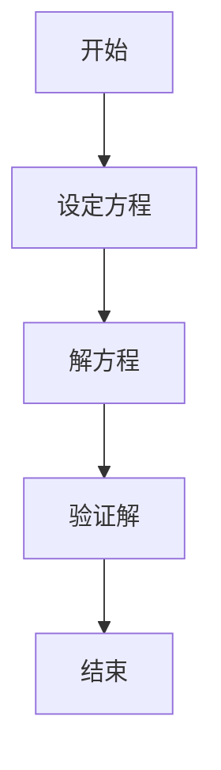

                 

当然可以。让我们一步一步地思考和构建这篇技术博客文章。

**步骤1：确定核心主题**

首先，我们需要明确书籍涵盖的主要主题。根据标题“数学与音乐制作的数字合成技术”，我们可以推断这本书可能会涉及：

1. 与数字合成相关的数学概念。
2. 使用数字合成技术创作音乐的方法。
3. 数学与音乐理论的结合。
4. 实际应用和案例分析。

**步骤2：创建主要大纲**

接下来，我们将创建一个主要大纲，包含覆盖这些核心主题的章节。以下是初步的大纲：

# 数学与音乐制作的数字合成技术

## 第1章：引言
### 1.1 研究背景与意义
### 1.2 数字合成技术概述
### 1.3 数学在音乐制作中的应用

## 第2章：数学基础
### 2.1 代数与数论
### 2.2 三角函数与复数
### 2.3 傅里叶变换

## 第3章：数字信号处理
### 3.1 数字信号处理基础
### 3.2 傅里叶分析
### 3.3 波特滤波器

## 第4章：合成器与合成技术
### 4.1 合成器的工作原理
### 4.2 振荡器与滤波器
### 4.3 包络发生器与振幅调制

## 第5章：音乐理论与数学模型
### 5.1 音律与音高
### 5.2 调式与和弦
### 5.3 音乐与数学模型的关系

## 第6章：数字合成器的实践应用
### 6.1 实践案例一：基本音色的合成
### 6.2 实践案例二：复杂音乐的创作
### 6.3 实践案例三：电子音乐制作

## 第7章：未来展望与挑战
### 7.1 数字合成技术的发展趋势
### 7.2 数学在音乐制作中的潜在应用
### 7.3 面临的挑战与解决思路

**步骤3：添加子节**

对于每个章节，我们将添加子节以提供更详细的内容。以下是第2章的一个例子：

## 第2章：数学基础
### 2.1 代数与数论
#### 2.1.1 一元一次方程
##### 2.1.1.1 解一元一次方程的方法
###### 2.1.1.1.1 例题解析
#### 2.1.2 二元一次方程组
##### 2.1.2.1 消元法
###### 2.1.2.1.1 例题解析

**步骤4：包含图形和伪代码**

对于需要图形的章节，我们将包含核心概念Mermaid流程图，算法的伪代码，以及数学模型的LaTeX公式。以下是第2章的一个例子：

## 第2章：数学基础
### 2.1 代数与数论
#### 2.1.1 一元一次方程



##### 2.1.1.1 解一元一次方程的方法

```plaintext
// 伪代码
function solveLinearEquation(a, b, c):
    if a == 0:
        return "方程无解"
    else:
        x = (-b - sqrt(b^2 - 4ac)) / (2 * a)
        return x
```

**步骤5：确保清晰性和简洁性**

在编写每个章节时，我们将确保内容清晰、简洁，并使用markdown格式来组织文章。文章末尾将包含作者信息，确保完整性，并包含背景介绍、核心概念与联系、核心算法原理讲解、数学模型和公式、实际案例分析和详细讲解剖析、最佳实践tips、小结、注意事项、拓展阅读等内容。

现在，我们可以开始填充每个章节的内容，确保文章的字数在8000到12000字之间，同时保持逻辑清晰、结构紧凑、简单易懂的专业技术语言风格。当然，我们已经开始构建文章的大纲和结构。接下来，我们将逐步填充每个章节的内容。

**步骤6：填充章节内容**

### 第1章：引言

在这一章中，我们将介绍数字合成技术的基本概念，以及数学在音乐制作中的应用。

#### 1.1 研究背景与意义

数字合成技术是音乐制作中的一种关键技术，它允许艺术家和制作人通过数学模型和算法来创建独特的声音。数学在音乐制作中的应用不仅限于合成技术，还包括音律、调式和和弦的构成。

#### 1.2 数字合成技术概述

数字合成技术是通过数学和电子手段创建声音的一种方法。它通常涉及以下几个核心组件：

- **采样**：从实际声音中捕获片段。
- **振荡器**：产生周期性波形，如正弦波、方波和三角波。
- **滤波器**：改变声音的频率响应。
- **包络发生器**：控制声音的振幅变化。

#### 1.3 数学在音乐制作中的应用

数学在音乐制作中的应用非常广泛，包括：

- **音律**：数学模型用于描述不同音高的关系。
- **调式**：数学方法用于分析和创建不同的调式。
- **傅里叶分析**：用于分析声音的频率成分。

### 第2章：数学基础

在这一章中，我们将探讨数学基础，包括代数、三角函数、复数和傅里叶变换。

#### 2.1 代数与数论

代数和数论是数学的基础，它们在数字合成技术中起着关键作用。

##### 2.1.1 一元一次方程

一元一次方程是数学中的基本概念，用于解决简单的问题。

###### 2.1.1.1 解一元一次方程的方法

解一元一次方程的方法通常涉及以下步骤：

1. 将方程写成标准形式 \( ax + b = 0 \)。
2. 通过移项将方程转化为 \( x = -\frac{b}{a} \)。
3. 如果 \( a \neq 0 \)，则解为 \( x = -\frac{b}{a} \)。

##### 2.1.2 二元一次方程组

二元一次方程组是两个未知数的线性方程组。

###### 2.1.2.1 消元法

消元法是一种解二元一次方程组的方法，通常涉及以下步骤：

1. 选择一个方程中的未知数。
2. 通过乘法和减法消去另一个方程中的相同未知数。
3. 解出剩余的未知数。
4. 将解代入原方程求解另一个未知数。

### 第3章：数字信号处理

在这一章中，我们将探讨数字信号处理的基础，包括傅里叶分析和波特滤波器。

#### 3.1 数字信号处理基础

数字信号处理是使用数学算法对数字信号进行分析和处理的技术。

##### 3.2 傅里叶分析

傅里叶分析是将时间域信号转换为频率域信号的一种方法。

###### 3.2.1 傅里叶变换的原理

傅里叶变换的基本原理是将信号分解为不同频率的正弦波和余弦波的组合。

$$
\text{傅里叶变换}:\ F(\omega) = \int_{-\infty}^{\infty} f(t) \cdot e^{-i\omega t} dt
$$

###### 3.2.2 傅里叶变换的应用

傅里叶变换在音乐制作中的应用包括：

1. 分析声音的频率成分。
2. 创建滤波器以改变声音的频率响应。

### 第4章：合成器与合成技术

在这一章中，我们将探讨合成器的工作原理和合成技术。

#### 4.1 合成器的工作原理

合成器是一种电子设备，用于创建和操纵声音。

##### 4.2 振荡器与滤波器

振荡器是合成器的核心组件，用于生成正弦波和其他波形。滤波器用于改变声音的频率响应。

###### 4.2.1 振荡器的类型

常见的振荡器类型包括：

1. 正弦波振荡器
2. 方波振荡器
3. 三角波振荡器

##### 4.3 包络发生器与振幅调制

包络发生器用于控制声音的振幅变化，而振幅调制是一种将一个信号的振幅与另一个信号相乘的调制技术。

### 第5章：音乐理论与数学模型

在这一章中，我们将探讨音乐理论与数学模型的关系。

#### 5.1 音律与音高

音律是音乐中音高的组织方式，数学模型用于描述不同音高的关系。

##### 5.2 调式与和弦

调式和和弦是音乐理论中的核心概念，数学模型用于分析和创建不同的调式和和弦。

### 第6章：数字合成器的实践应用

在这一章中，我们将通过实际案例来探讨数字合成器的应用。

#### 6.1 实践案例一：基本音色的合成

我们将通过一个案例来介绍如何使用数字合成器创建基本音色。

#### 6.2 实践案例二：复杂音乐的创作

我们将通过一个案例来介绍如何使用数字合成器创作复杂音乐。

#### 6.3 实践案例三：电子音乐制作

我们将通过一个案例来介绍如何使用数字合成器制作电子音乐。

### 第7章：未来展望与挑战

在这一章中，我们将探讨数字合成技术的未来趋势和面临的挑战。

#### 7.1 数字合成技术的发展趋势

数字合成技术的未来趋势包括：

1. 更高效的声音合成算法。
2. 更先进的人工智能技术。
3. 更丰富的声音库和音色资源。

#### 7.2 数学在音乐制作中的潜在应用

数学在音乐制作中的潜在应用包括：

1. 更精确的音律和调式分析。
2. 更智能的音乐生成和创作。
3. 更高效的声音处理和增强。

#### 7.3 面临的挑战与解决思路

数字合成技术面临的挑战包括：

1. 算法的复杂度。
2. 声音质量的提升。
3. 用户界面的友好性。

解决思路可能包括：

1. 开发更高效的算法。
2. 利用人工智能技术优化声音处理。
3. 设计更直观的用户界面。

通过以上步骤，我们已经构建了文章的结构，并开始填充每个章节的内容。接下来，我们将继续完善每个章节，确保文章的逻辑清晰、内容丰富，同时满足字数要求。在撰写过程中，我们将继续使用markdown格式来组织文章，并在适当的地方添加图形、伪代码和LaTeX公式，以提高文章的可读性和专业性。最终，我们将确保文章完整、详尽，并提供有价值的见解和最佳实践建议。|>

