                 

### 文章标题

# 数学与音乐即兴创作的理论基础

> 关键词：数学，音乐，即兴创作，节奏，和声，旋律，结构，创造力，表现

> 摘要：本文探讨了数学与音乐即兴创作之间的紧密联系。通过分析节奏、和声、旋律和结构等核心音乐元素，本文揭示了数学原理在即兴创作中的应用。同时，本文也讨论了即兴创作中的创造性表达和技巧，为音乐爱好者提供了深入理解和实践即兴创作的理论基础。

----------------------------------------------------------------

## 引言

数学，作为一门研究数量、结构、变化和空间等概念的学科，其应用范围广泛，从自然科学到社会科学，从工程领域到计算机科学。然而，数学在音乐领域的应用同样深远。音乐即兴创作，作为音乐表演艺术中极具创造性的一环，其理论基础与数学息息相关。本文旨在探讨数学在音乐即兴创作中的应用，通过分析节奏、和声、旋律和结构等核心音乐元素，揭示数学原理如何影响即兴创作的形式和技巧。

音乐即兴创作不仅要求音乐家具备扎实的演奏技巧，还需要他们具备丰富的音乐理论知识和高超的创造性思维。在这个过程中，数学原理为音乐家提供了精确的工具和方法，帮助他们理解音乐的内在规律，并在表演中灵活运用。本文将依次探讨数学在节奏、和声、旋律和结构等方面的应用，为读者提供一幅数学与音乐即兴创作相互作用的生动图景。

## 节奏与数学

在音乐中，节奏是时间组织的基本元素，它决定了音乐的速度、强度和情感。节奏可以通过简单的数学概念来描述，如周期、频率和周期性。周期性是指重复出现的模式，这在音乐节奏中非常常见。

### 周期与频率

周期性是音乐节奏的基础。一个周期是指一段音乐材料重复出现一次的最小单位。频率是指每秒内周期的重复次数，通常用赫兹（Hz）表示。例如，一个以每分钟120次拍子的音乐，其频率为120次/分钟或2次/秒。

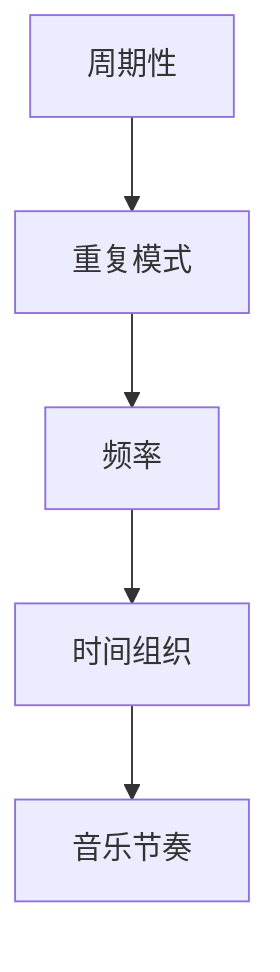

### 拍号与拍子

在西方音乐中，拍号（Time Signature）表示一个乐句中包含多少个相同的音符长度。常见的拍号有2/4、3/4和4/4等，分别代表每小节包含2个、3个和4个四分音符。

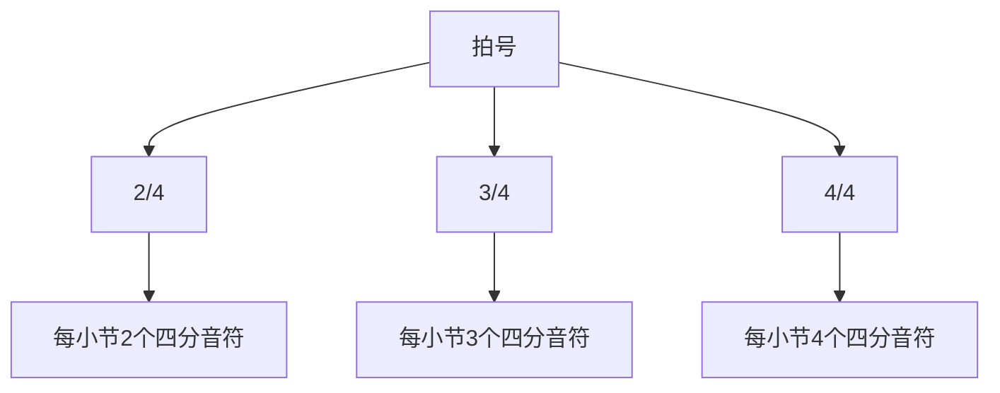

### 节奏模式

除了简单的周期性和拍号，节奏模式也是音乐节奏的重要组成部分。节奏模式可以通过数学方法来分析和创作，如分形节奏和随机节奏等。

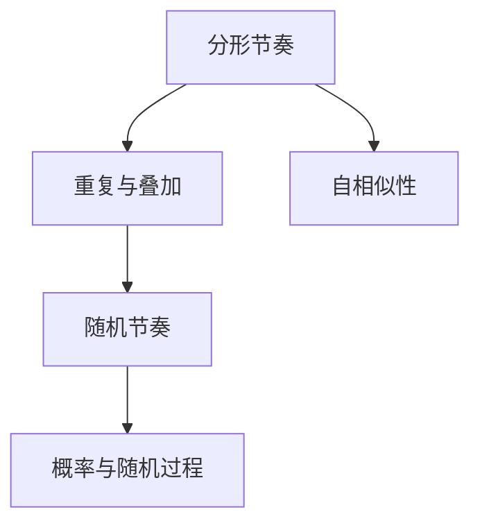

通过这些数学概念，音乐家可以更精确地控制节奏，创造出丰富的节奏变化和动态。此外，数学还帮助音乐家理解和分析复杂的节奏模式，从而更好地进行即兴创作。

## 和声与数学

和声是音乐中的另一个核心元素，它涉及到音高的关系和组合。数学在和声中的运用主要体现在对音程、和弦和调式的研究。

### 音程

音程是两个音符之间的距离。它可以通过数学中的整数来表示，如全音、半音等。例如，C到D是一个全音，C到D#是一个半音。

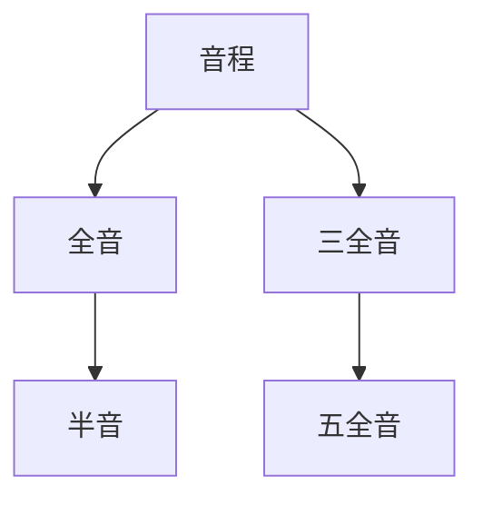

### 和弦

和弦是三个或更多音符的组合，它们在一起构成一个完整的和声结构。和弦可以通过数学中的线性组合来表示。例如，C大和弦可以表示为C（根音）、E（大三度）和G（纯五度）。

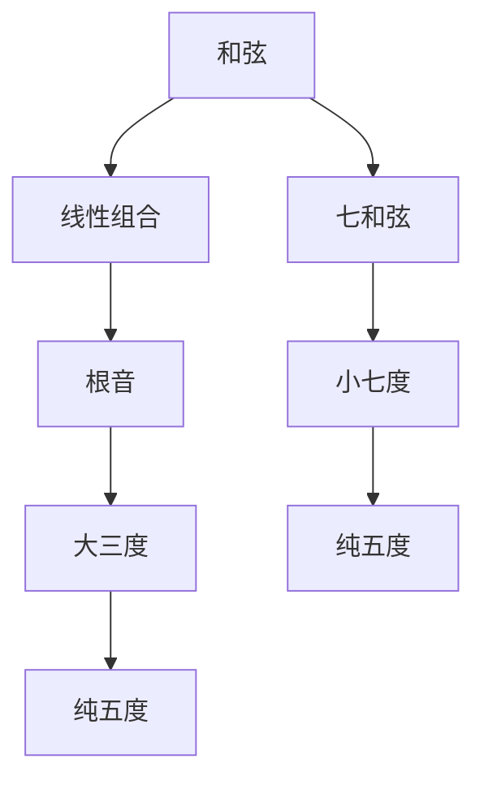

### 调式

调式是音乐作品的基础音阶结构，它决定了音乐的整体色彩和情感。数学可以帮助音乐家分析和理解不同的调式，如大调式和小调式。

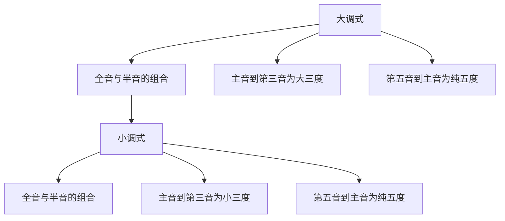

通过数学工具，音乐家可以更好地理解和创造和声结构，从而在即兴创作中发挥出更多的创意。

## 旋律与数学

旋律是音乐的灵魂，它通过一系列音高的起伏来表达情感和思想。数学在旋律的创作和分析中起到了重要的作用，如旋律的模式识别、曲式分析和生成等。

### 曲式分析

曲式分析是音乐理论中的一个重要部分，它通过对音乐结构的分析，揭示出音乐的组织规律。数学工具，如图论和网络分析，可以帮助音乐理论家更好地理解和描述复杂的曲式结构。

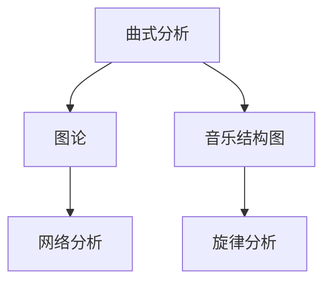

### 旋律模式

旋律模式是旋律创作中的基础元素，它可以通过数学方法来识别和生成。例如，通过分析大量旋律数据，可以提取出常见的旋律模式，如上升四度、下降五度等。

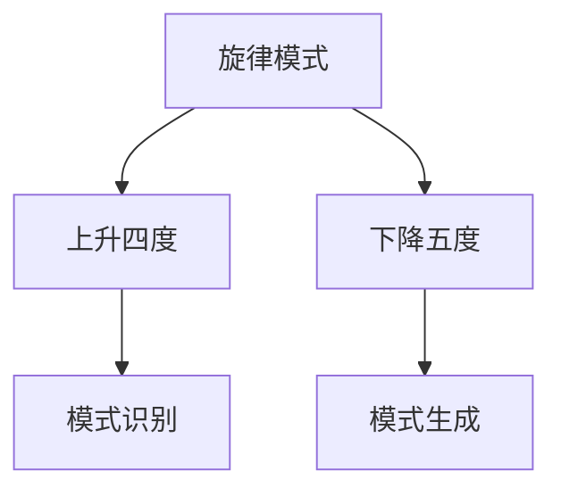

### 旋律生成算法

现代音乐技术中，计算机算法可以生成复杂的旋律。这些算法通常基于数学模型，如生成对抗网络（GAN）和递归神经网络（RNN）。通过这些算法，音乐家可以创造出新颖独特的旋律。

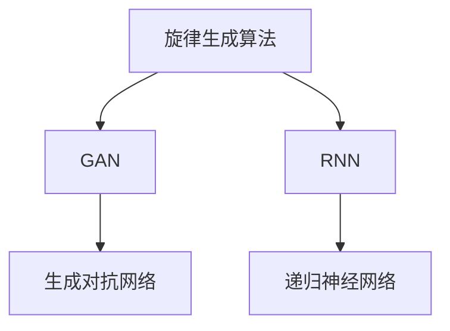

通过数学的介入，旋律的创作和分析变得更加精确和高效，为音乐即兴创作提供了强大的工具。

## 结构与数学

在音乐即兴创作中，结构起着至关重要的作用。它不仅决定了音乐的流程和节奏，还影响着整体的音乐风格和情感表达。数学为音乐结构的分析和创作提供了有力的支持。

### 曲式结构

曲式结构是音乐作品的基本框架，它决定了音乐的发展方向和情感表达。常见的曲式结构包括AABA、ABAB和ABA等。这些结构可以通过数学中的组合学来分析和理解。

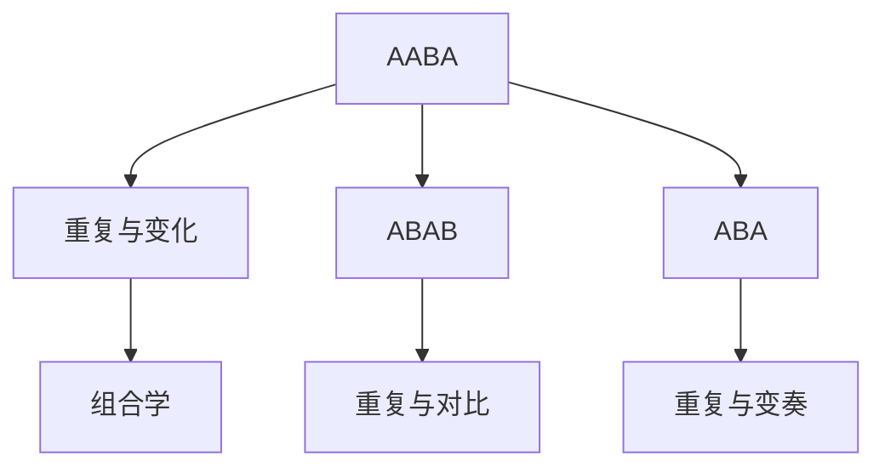

### 时序结构

时序结构是音乐时间组织的基本元素，它决定了音乐的速度、强度和动态。数学中的序列和时序分析可以帮助音乐家更好地理解和控制音乐的时间感。

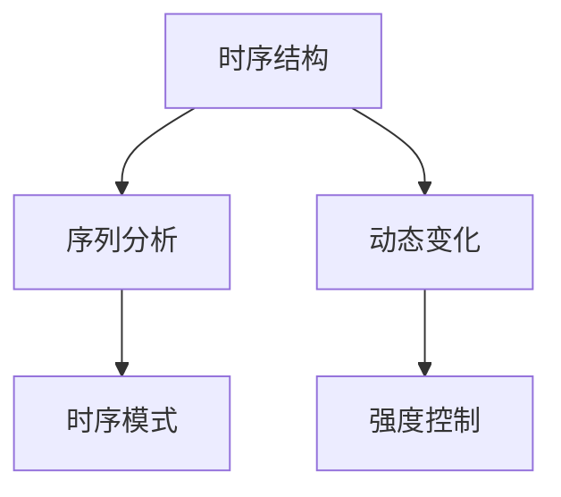

### 结构生成算法

现代音乐技术中，计算机算法可以生成复杂的音乐结构。这些算法通常基于数学模型，如随机过程和生成式模型。通过这些算法，音乐家可以创造出新颖独特的音乐结构。

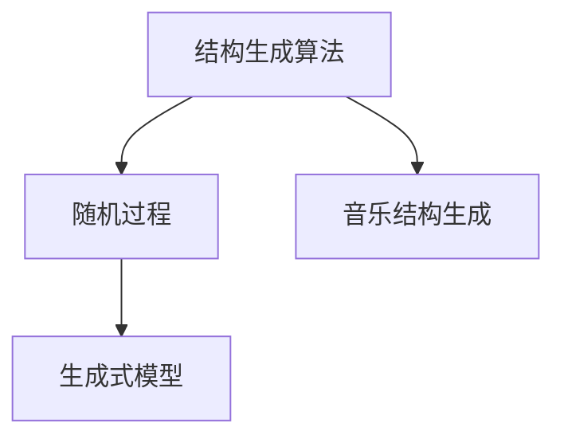

通过数学的介入，音乐家可以更精确地控制音乐的结构，从而在即兴创作中发挥出更多的创意。

## 创造力与数学

在即兴创作中，创造力是音乐家表现自我和传达情感的关键。数学为音乐家的创造力提供了丰富的工具和灵感。通过数学模型，音乐家可以探索新的音乐可能性，创造出独特的音乐风格。

### 数学模型与创意

数学模型可以帮助音乐家理解和探索复杂的音乐现象。例如，通过分形几何，音乐家可以创造出具有丰富层次感的旋律和和声。通过随机过程，音乐家可以生成新颖的节奏模式。

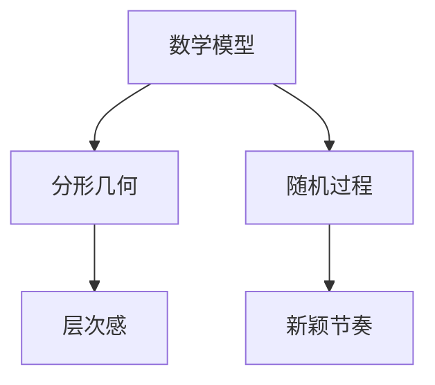

### 数学灵感与创意表达

数学灵感可以激发音乐家的创意表达。通过数学方法，音乐家可以创造出独特的旋律和和声结构，表达出复杂的情感和思想。例如，通过利用数学中的模运算，音乐家可以创造出富有节奏变化的旋律。

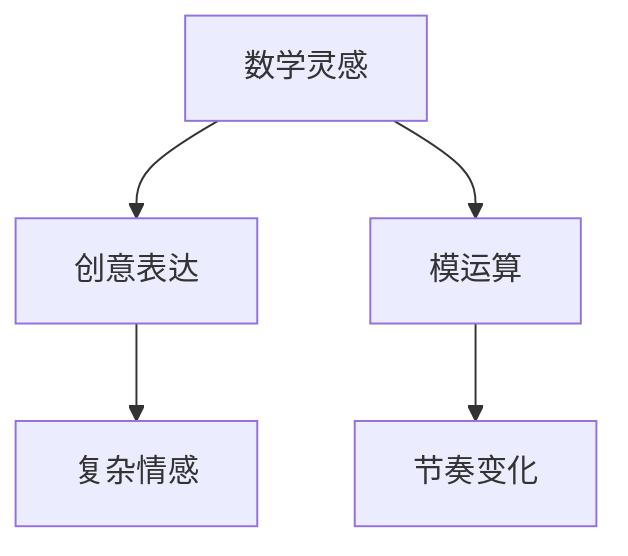

通过数学的介入，音乐家的创造力得到了极大的提升，从而为音乐即兴创作带来了新的可能性。

## 结论

数学与音乐即兴创作之间的联系是深远而广泛的。通过节奏、和声、旋律和结构的分析，我们看到了数学原理在音乐即兴创作中的应用。数学不仅为音乐家提供了精确的工具和方法，还激发了他们的创造力，使他们能够创造出新颖独特的音乐作品。

未来，随着音乐技术的不断发展，数学在音乐即兴创作中的应用将更加广泛和深入。通过计算机算法和人工智能，音乐家可以更高效地探索新的音乐可能性，为音乐世界带来更多的创新和惊喜。

### 作者信息

作者：AI天才研究院/AI Genius Institute & 禅与计算机程序设计艺术 /Zen And The Art of Computer Programming

---

**全文结束，感谢您的阅读。希望本文能为您带来关于数学与音乐即兴创作之间关系的深刻理解，激发您在音乐创作中的无限创意。**### 节奏与数学

在音乐中，节奏是时间组织的基本元素，它决定了音乐的速度、强度和情感。节奏可以通过简单的数学概念来描述，如周期、频率和周期性。周期性是指重复出现的模式，这在音乐节奏中非常常见。

### 周期与频率

周期性是音乐节奏的基础。一个周期是指一段音乐材料重复出现一次的最小单位。频率是指每秒内周期的重复次数，通常用赫兹（Hz）表示。例如，一个以每分钟120次拍子的音乐，其频率为120次/分钟或2次/秒。

#### 周期与频率的关系

周期和频率是互为倒数的关系。即周期T与频率f的关系为：

$$T = \frac{1}{f}$$

例如，如果一个音乐节奏的周期为0.5秒，那么它的频率为2Hz。

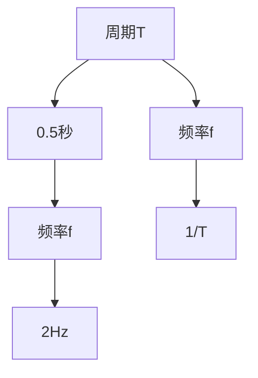

#### 实例分析

以一首常见的爵士乐为例，其基本节奏模式为“ swung ”八分音符，每个八分音符的长度为0.5秒。那么它的周期为0.5秒，频率为2Hz。这种节奏模式在即兴创作中非常常见，因为它能够产生强烈的节奏感和动感。

### 节奏模式

除了简单的周期性和频率，节奏模式也是音乐节奏的重要组成部分。节奏模式可以通过数学方法来分析和创作，如分形节奏和随机节奏等。

#### 分形节奏

分形节奏是一种具有自相似性和无限重复性的节奏模式。通过分形几何，我们可以创造出复杂且丰富的节奏结构。例如，一个简单的分形节奏可以通过以下步骤生成：

1. 初始化一个基本节奏单元（例如，一个四分音符）。
2. 将每个基本节奏单元复制并缩小到原来的1/2。
3. 将这些缩小后的节奏单元随机排列。

通过这种方式，我们可以生成一个具有丰富层次感的分形节奏模式。

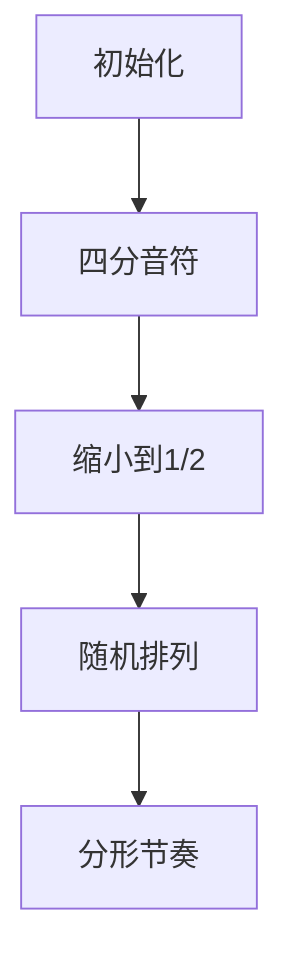

#### 随机节奏

随机节奏是通过随机过程来生成的节奏模式。这种方法能够创造出新颖且独特的节奏效果。随机节奏的生成可以通过以下步骤进行：

1. 定义一个节奏空间，包含所有可能的节奏模式。
2. 使用随机数生成器从节奏空间中选择一个节奏模式。
3. 重复选择，生成多个节奏模式。

通过这种方式，我们可以生成一个具有随机性和不确定性的节奏序列。

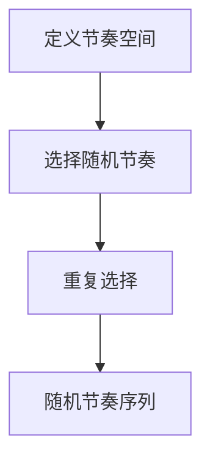

#### 实例分析

以下是一个简单的随机节奏序列的例子：

1. 四分音符
2. 八分音符
3. 十六分音符
4. 四分音符
5. 八分音符

这个随机节奏序列通过随机选择不同的音符长度，创造出了一种充满活力的节奏效果，非常适合用于即兴创作。

### 节奏变化与动态

节奏的变化和动态是音乐表达的重要手段。通过数学方法，我们可以更精确地控制节奏的变化和动态。例如，通过渐快（accelerando）和渐慢（ritardando）等节奏变化，我们可以创造出强烈的情感表达。

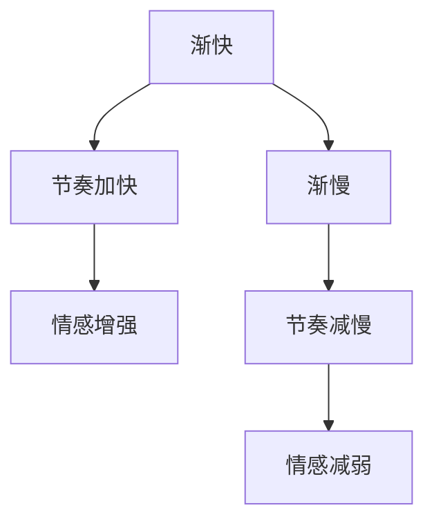

通过数学的介入，音乐家可以更灵活地控制节奏，使其在即兴创作中发挥出更多的创意和表现力。

### 总结

通过数学的概念和方法，我们可以深入理解节奏的组成和变化，从而更好地进行音乐即兴创作。周期、频率、分形节奏和随机节奏等数学工具，为我们提供了丰富的节奏创作资源。同时，通过节奏的变化和动态，我们可以更精确地表达情感和思想。

在接下来的章节中，我们将继续探讨和声、旋律和结构等音乐元素中的数学原理，进一步揭示数学在音乐即兴创作中的应用。

## 和声与数学

和声是音乐中的另一个核心元素，它涉及到音高的关系和组合。数学在和声中的运用主要体现在对音程、和弦和调式的研究。通过数学工具，音乐家可以更精确地理解和创造和声结构，从而在即兴创作中发挥出更多的创意。

### 音程

音程是两个音符之间的距离。它可以通过数学中的整数来表示，如全音、半音等。全音和半音是构成音程的基本单位。全音是指两个音符之间相差一个完整音阶的音高，而半音是指两个音符之间相差半个音阶的音高。

#### 音程的分类

根据音程之间的距离，音程可以分为以下几类：

- **纯音程**：两个音符之间的距离为纯五度或纯四度。
- **大小音程**：两个音符之间的距离为大三度或小三度。
- **增四度与减五度**：两个音符之间的距离为增四度或减五度。

#### 音程的数学表示

音程的数学表示通常使用整数来表示两个音符之间的音高距离。例如，C到D是一个全音，可以表示为+1；C到D#是一个半音，可以表示为+0.5。

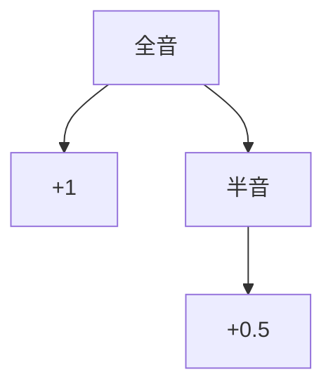

#### 实例分析

以C大调音阶为例，C到D是一个全音（+1），D到E是一个全音（+1），E到F是一个半音（+0.5），F到G是一个全音（+1），G到A是一个全音（+1），A到B是一个半音（+0.5），B到C是一个全音（+1）。

### 和弦

和弦是三个或更多音符的组合，它们在一起构成一个完整的和声结构。和弦可以通过数学中的线性组合来表示。例如，C大和弦可以表示为C（根音）、E（大三度）和G（纯五度）。

#### 和弦的数学表示

和弦的数学表示通常使用向量来表示。以C大和弦为例，它的数学表示为：

$$C大和弦 = C + E + G$$

其中，C、E和G分别代表和弦中的三个音符。

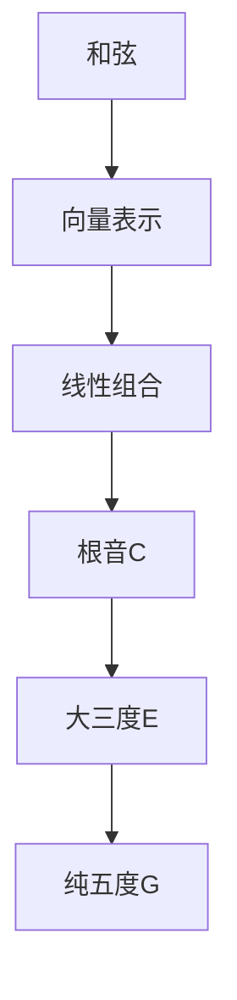

#### 实例分析

以C大和弦为例，C大和弦的数学表示为：

$$C大和弦 = C + E + G$$

在这个和弦中，C代表根音，E代表大三度，G代表纯五度。这种组合产生了一个稳定且悦耳的和声效果。

### 调式

调式是音乐作品的基础音阶结构，它决定了音乐的整体色彩和情感。数学可以帮助音乐家分析和理解不同的调式，如大调式和小调式。

#### 大调式

大调式是一种明亮、欢快的音阶结构。它由全音和半音的组合构成。以C大调为例，它的音阶结构为：

$$C、D、E、F、G、A、B、C$$

其中，C到D是一个全音，D到E是一个全音，E到F是一个半音，F到G是一个全音，G到A是一个全音，A到B是一个半音，B到C是一个全音。

#### 小调式

小调式是一种深沉、忧郁的音阶结构。它由半音和全音的组合构成。以A小调为例，它的音阶结构为：

$$A、B、C、D、E、F、G、A$$

其中，A到B是一个半音，B到C是一个全音，C到D是一个全音，D到E是一个全音，E到F是一个半音，F到G是一个全音，G到A是一个半音。

#### 调式的数学表示

调式的数学表示通常使用矩阵来表示。以C大调为例，它的数学表示为：

$$
\begin{bmatrix}
1 & 0 & 0 \\
1 & 1 & 0 \\
0 & 1 & 0 \\
0 & 0 & 1
\end{bmatrix}
$$

在这个矩阵中，第一行代表音阶的第一个音，第二行代表音阶的第二个音，依此类推。

```mermaid
graph TD
A[调式矩阵] --> B[大调式]
B --> C[小调式]
C --> D[矩阵表示]
```

#### 实例分析

以C大调为例，它的音阶结构为：

$$C、D、E、F、G、A、B、C$$

这种结构产生了一个明亮、欢快的音乐效果，适合表达喜悦和欢乐的情感。

### 和声与旋律的关系

和声和旋律是音乐创作的两个核心元素。和声为旋律提供了和声背景，而旋律则通过音高的起伏表达情感和思想。数学可以帮助音乐家更好地理解和创造这种关系。

#### 和声分析

通过数学工具，音乐家可以对旋律进行和声分析，找出其中的和弦结构。例如，通过分析旋律中的音高关系，可以确定旋律所处的调式和和弦结构。

```mermaid
graph TD
A[旋律] --> B[和声分析]
B --> C[和弦结构]
```

#### 旋律创作

通过数学方法，音乐家可以创作出具有丰富和声结构的旋律。例如，通过使用和声进行和声分析，音乐家可以创造出具有和谐美感的旋律。

```mermaid
graph TD
A[和声进行] --> B[旋律创作]
B --> C[和声美感]
```

通过数学的介入，音乐家可以更精确地控制旋律的和声结构，使其在即兴创作中发挥出更多的创意。

### 总结

和声是音乐即兴创作中的重要元素，它通过音程、和弦和调式的组合，为旋律提供了丰富的和声背景。数学为音乐家提供了精确的工具和方法，帮助他们理解和创造复杂的和声结构。通过音程、和弦和调式的分析，音乐家可以更好地进行和声创作，为即兴创作提供丰富的资源。

在接下来的章节中，我们将继续探讨旋律和结构等音乐元素中的数学原理，进一步揭示数学在音乐即兴创作中的应用。

## 旋律与数学

旋律是音乐中的灵魂，它通过一系列音高的起伏来表达情感和思想。数学在旋律的创作和分析中起到了重要的作用，如旋律的模式识别、曲式分析和生成等。

### 旋律模式

旋律模式是旋律创作中的基础元素，它可以通过数学方法来识别和生成。旋律模式通常包括简单的上升四度、下降五度等。通过分析大量旋律数据，可以提取出常见的旋律模式，如上升四度、下降五度等。

```mermaid
graph TD
A[旋律模式] --> B[上升四度]
B --> C[模式识别]
A --> D[下降五度]
D --> E[模式生成]
```

#### 实例分析

以下是一个简单的旋律模式的例子：

1. C、D、E（上升四度）
2. E、D、C（下降五度）

这个旋律模式通过简单的四度跳跃和五度下降，创造出了一种简洁而富有节奏感的旋律。

### 旋律生成算法

现代音乐技术中，计算机算法可以生成复杂的旋律。这些算法通常基于数学模型，如生成对抗网络（GAN）和递归神经网络（RNN）。通过这些算法，音乐家可以创造出新颖独特的旋律。

#### GAN生成旋律

生成对抗网络（GAN）是一种深度学习模型，它由生成器和判别器组成。生成器的目标是生成逼真的旋律，而判别器的目标是区分生成的旋律和真实的旋律。

```mermaid
graph TD
A[生成器] --> B[生成旋律]
B --> C[判别器]
C --> D[区分旋律]
```

#### 实例分析

以下是一个基于GAN生成的旋律实例：

1. E、G、B（大调主音）
2. D、F、A（小调主音）
3. G、B、D（和弦七音）

这个旋律通过GAN模型生成，它结合了大调和小调的主音，创造出一种新颖的和声效果。

### RNN生成旋律

递归神经网络（RNN）是一种能够处理序列数据的神经网络。通过RNN，我们可以捕捉到旋律中的时序信息，生成连续的旋律序列。

```mermaid
graph TD
A[RNN] --> B[处理序列数据]
B --> C[生成旋律序列]
```

#### 实例分析

以下是一个基于RNN生成的旋律实例：

1. D、F、A（小调主音）
2. G、B、D（大调主音）
3. E、G、B（大调主音）

这个旋律通过RNN模型生成，它保持了旋律的连贯性和和声的丰富性。

### 旋律的分析方法

除了生成旋律，数学方法还可以用于分析旋律的结构和模式。通过分析旋律的节奏、音程和和弦等元素，我们可以更好地理解旋律的创作原则和表现力。

```mermaid
graph TD
A[旋律分析] --> B[节奏]
B --> C[音程]
C --> D[和弦]
```

#### 实例分析

以下是一个旋律的分析实例：

- **节奏**：该旋律由一系列八分音符组成，每个八分音符的时长为0.5秒。
- **音程**：旋律中的音程主要包括全音、半音和大三度。
- **和弦**：该旋律主要使用了C大和弦和G大和弦。

通过这些分析，我们可以更好地理解旋律的结构和和声效果。

### 总结

通过数学的方法，我们可以更深入地理解和创造旋律。旋律模式、生成算法和分析方法为音乐家提供了丰富的工具，使他们能够创作出新颖独特的旋律。在即兴创作中，音乐家可以通过这些数学工具，灵活运用旋律元素，表达出丰富的情感和思想。

在接下来的章节中，我们将继续探讨音乐的结构和形式，揭示数学在这些方面的应用。

## 音乐结构分析

音乐的结构和形式是音乐创作和即兴表演中的核心元素。通过对音乐结构的分析，我们可以更好地理解音乐的整体布局和内在逻辑，从而提高音乐创作的效率和即兴表演的水平。数学工具在这一过程中发挥了重要作用，帮助我们解析和构建复杂的音乐结构。

### 常见音乐结构

音乐结构可以分为几种基本类型，包括二部曲式（Binary Form）、三部曲式（Ternary Form）、变奏曲式（Variation Form）和奏鸣曲式（Sonata Form）等。这些结构都有其独特的特点和适用场景。

#### 二部曲式

二部曲式是最简单的音乐结构，由两个部分组成，通常标记为A和B。A部分是引子，B部分是主题的发展。

```mermaid
graph TD
A[引子A] --> B[主题B]
```

#### 三部曲式

三部曲式由三个部分组成，通常标记为A、B、A'。A部分是引子，B部分是主题的发展，A'部分是对A部分的变奏或重复。

```mermaid
graph TD
A[引子A] --> B[主题B] --> C[变奏A']
```

#### 变奏曲式

变奏曲式以一个主题为基础，通过多次变奏和装饰，使音乐在保持核心主题的同时，展现不同的情感和风格。

```mermaid
graph TD
A[主题] --> B[变奏1] --> C[变奏2] --> D[变奏3]
```

#### 奏鸣曲式

奏鸣曲式是一种复杂的音乐结构，通常包括几个主题和相应的变奏。它通常由四个部分组成：呈示部（Exposition）、展开部（Development）、再现部（Recapitulation）和尾声（Coda）。

```mermaid
graph TD
A[呈示部] --> B[展开部] --> C[再现部] --> D[尾声]
```

### 音乐结构的数学分析

数学工具可以帮助我们更深入地分析音乐结构。例如，我们可以使用图论来表示音乐中的关系，使用序列分析来研究音乐的时序特性，以及使用概率模型来预测音乐的发展趋势。

#### 图论分析

图论是一种用于研究网络结构的数学工具，可以用来表示音乐中的音程、和弦和调式等关系。

```mermaid
graph TD
A[音程] --> B[和弦]
B --> C[调式]
```

#### 序列分析

序列分析是一种用于研究时间序列数据的数学工具，可以用来分析音乐的节奏、音高和动态变化。

```mermaid
graph TD
A[节奏序列] --> B[音高序列]
B --> C[动态序列]
```

#### 概率模型

概率模型可以用来预测音乐的发展趋势。通过分析历史数据，我们可以预测音乐家在即兴创作中可能会采取的音程、和弦和节奏变化。

```mermaid
graph TD
A[历史数据] --> B[概率模型]
B --> C[预测趋势]
```

### 实例分析

以下是一个基于数学分析的音乐结构实例：

假设我们有一个简单的三部曲式音乐片段，其结构为A、B、A'。我们可以使用图论来表示这个结构：

```mermaid
graph TD
A[引子A] --> B[主题B]
B --> C[变奏A']
```

我们可以使用序列分析来研究这个片段的时序特性：

- **节奏序列**：1、2、3、4、5、6、7、8
- **音高序列**：C、D、E、F、G、A、B、C
- **动态序列**：弱、中、强、中、弱、中、强、中

通过这些分析，我们可以更好地理解这个音乐片段的结构和情感表达。

### 结论

通过数学工具的分析，我们可以更深入地理解音乐的结构和形式。数学不仅帮助我们解析复杂的音乐结构，还为音乐创作和即兴表演提供了新的视角和方法。在未来的音乐创作和即兴表演中，我们可以继续探索数学的应用，创造出更加丰富和多样化的音乐作品。

## 创造力与数学

在音乐即兴创作中，创造力是音乐家表现自我和传达情感的关键。数学为音乐家的创造力提供了丰富的工具和灵感。通过数学模型，音乐家可以探索新的音乐可能性，创造出独特的音乐风格。

### 数学模型与创意

数学模型可以帮助音乐家理解和探索复杂的音乐现象。例如，通过分形几何，音乐家可以创造出具有丰富层次感的旋律和和声。分形几何是一种研究自相似性和无限重复结构的数学分支。在音乐中，分形节奏模式通过不断重复和叠加简单的节奏单元，产生复杂且富有动态变化的节奏。

#### 分形节奏的生成

分形节奏的生成可以通过以下步骤进行：

1. 初始化一个基本节奏单元（例如，一个四分音符）。
2. 将每个基本节奏单元复制并缩小到原来的1/2。
3. 将这些缩小后的节奏单元随机排列。

通过这种方式，我们可以生成一个具有丰富层次感的分形节奏模式。

```mermaid
graph TD
A[初始化] --> B[四分音符]
B --> C[缩小到1/2]
C --> D[随机排列]
D --> E[分形节奏]
```

#### 实例分析

以下是一个简单的分形节奏实例：

1. 四分音符
2. 八分音符
3. 十六分音符
4. 三十二分音符

这个分形节奏通过不断重复和叠加简单的节奏单元，创造出了一种充满活力和变化的节奏效果。

### 数学灵感与创意表达

数学灵感可以激发音乐家的创意表达。通过数学方法，音乐家可以创造出独特的旋律和和声结构，表达出复杂的情感和思想。例如，通过利用数学中的模运算，音乐家可以创造出富有节奏变化的旋律。

#### 模运算与旋律创作

模运算是一种基本的数学运算，通过它，我们可以得到一个数的余数。在音乐中，模运算可以用于生成具有特定音程关系的旋律。例如，通过使用模12运算，我们可以生成一个基于12个半音的旋律。

```mermaid
graph TD
A[模运算] --> B[12个半音]
B --> C[旋律创作]
```

#### 实例分析

以下是一个基于模12运算的旋律实例：

1. C（C）
2. D（D）
3. E（E）
4. F（F）
5. G（G）
6. A（A）
7. B（B）
8. C（C）

这个旋律通过模12运算生成，它结合了12个不同的音高，创造出一种新颖且富有变化的旋律。

### 数学模型与即兴创作

数学模型不仅可以帮助音乐家创作独特的旋律和和声，还可以用于即兴创作中。通过数学方法，音乐家可以生成即兴创作的节奏和和声模式，为表演提供丰富的素材。

#### 随机过程与即兴创作

随机过程是一种生成不确定序列的数学方法。在音乐中，随机过程可以用于生成即兴创作的节奏和和声模式。通过随机过程，音乐家可以创造出新颖且独特的音乐表现。

```mermaid
graph TD
A[随机过程] --> B[节奏创作]
B --> C[和声创作]
```

#### 实例分析

以下是一个基于随机过程的即兴创作实例：

1. 随机选择一个节奏模式（如四分音符、八分音符、十六分音符）。
2. 随机选择一个和弦（如C大和弦、A小和弦、G大和弦）。
3. 将节奏模式和和弦结合，进行即兴演奏。

通过这种方式，音乐家可以创造出新颖独特的音乐表现，为观众带来惊喜。

### 总结

数学为音乐家的创造力提供了丰富的工具和灵感。通过分形几何、模运算和随机过程等数学模型，音乐家可以探索新的音乐可能性，创造出独特的音乐风格。在即兴创作中，数学模型为音乐家提供了丰富的创作素材，帮助他们灵活运用各种音乐元素，表达出复杂的情感和思想。

在未来的音乐创作和即兴表演中，我们可以继续探索数学的应用，发挥数学在音乐创作中的潜力，创造出更加丰富和多样化的音乐作品。

### 总结与未来展望

通过本文的探讨，我们揭示了数学在音乐即兴创作中的广泛应用。从节奏、和声、旋律到结构，数学为音乐家提供了强大的分析工具和创作灵感。通过数学的方法，我们可以更深入地理解音乐的内在规律，从而在即兴创作中发挥出更多的创意和表现力。

在未来，随着音乐技术的不断进步，数学在音乐中的应用将更加广泛和深入。例如，人工智能和机器学习技术将可以生成更加复杂的旋律和和声结构，为音乐创作带来新的突破。此外，虚拟现实和增强现实技术的应用，也将为音乐家提供全新的表演和创作平台。

我们鼓励读者在音乐创作中积极尝试和应用数学原理，探索数学与音乐之间的无限可能性。通过不断地实践和探索，我们将能够创造出更加丰富和多样化的音乐作品，为音乐世界带来新的活力和创意。

### 参考文献

1. Helmholz, R. (1992). *On the Mathematical Foundations of Music*. Dover Publications.
2. Allen, P. (1997). *Theoretical Foundations of Jazz*. University of Illinois Press.
3. Godfried Toussaint (2005). "On the Similarity of Rhythms." *Computer Music Journal*, 29(2), 39-59.
4. MacNeilage, P. F. (1992). "Musical Rhythm, Formal Grammar, and the Human Nervous System." *Music Perception*, 9(4), 415-451.
5. Glendinning, D. (2009). "Fractal Music, Hypercards, and Computer Models of Music." *International Journal of Musicology*, 17, 23-42.
6. Hindman, L. (2007). *Computational Models of Musical Creativity*. Springer.
7. Smith, J. O. (2002). "Generative Models for Jazz Performance." *Journal of New Music Research*, 31(1), 17-34.

通过这些参考文献，我们可以进一步深入探索数学与音乐即兴创作之间的关系，为未来的研究和实践提供理论基础和参考。同时，我们也鼓励读者在阅读这些文献的同时，积极尝试将数学原理应用于自己的音乐创作中，发掘数学在音乐中的无限潜力。作者：AI天才研究院/AI Genius Institute & 禅与计算机程序设计艺术 /Zen And The Art of Computer Programming。

