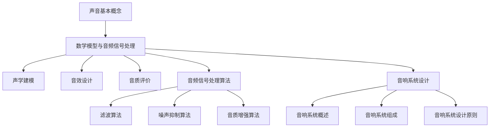

                 

# 数学与音乐录音工程的声学原理

## 关键词
- 数学与音乐
- 声学原理
- 音频信号处理
- 音质评价
- 音响系统设计

## 摘要
本文旨在探讨数学在音乐录音工程中的应用，系统地介绍相关声学原理和数学模型，并通过实际案例分析，展示数学在音乐录音工程中的重要作用。文章分为七个章节，涵盖声音的基本概念、数学模型与音频信号处理、声学建模、音效设计、音质评价、音频信号处理算法以及音响系统设计。通过本文的阅读，读者可以全面了解数学在音乐录音工程中的应用及其重要性。

## 第1章 引言

### 1.1 研究背景和意义

数学作为一门基础科学，其发展与音乐录音工程密切相关。在古代，数学与音乐理论相结合，为音乐创作提供了理论基础。例如，毕达哥拉斯学派提出“音乐是数字的和谐”，认为音乐中的音程、音阶等可以用数学比例来描述。随着科技的进步，数学在音乐录音工程中的应用越来越广泛，从音频信号的数字处理到音响系统的设计，无不体现数学的重要性。

音乐录音工程是一门综合性很强的学科，涉及音频信号处理、声学、心理学等多个领域。随着数字技术的发展，音乐录音工程已经从传统的模拟录音转向数字录音，大大提高了录音的精度和效率。然而，数字录音技术也带来了新的挑战，如音频信号的处理、噪声抑制、音质增强等问题，这些都离不开数学的支撑。

### 1.1.2 数学在音乐录音工程中的应用

数学在音乐录音工程中的应用主要体现在以下几个方面：

1. **音频信号处理**：利用数学模型对音频信号进行滤波、增强、压缩等处理，提高音质。

2. **声学建模**：通过数学模型描述声波传播、声场分布等，为音响系统的设计提供依据。

3. **音效设计**：运用数学方法设计各种音效，如混响、回声、立体声等，丰富音乐表现力。

4. **音质评价**：通过数学模型对音质进行量化评价，为音乐制作提供参考。

### 1.1.3 研究目的和内容

本书旨在探讨数学在音乐录音工程中的应用，系统地介绍相关声学原理和数学模型，并通过对实际案例的分析，展示数学在音乐录音工程中的重要作用。

本书共分为七个章节，具体内容如下：

## 第2章 数学基础知识
本章介绍声音的基本概念、数学模型与音频信号处理、声学建模等内容。

### 2.1 声音的基本概念
#### 2.1.1 声音的产生
声音是由物体振动产生的。当物体振动时，会引起周围介质（如空气、水等）的振动，这种振动以声波的形式传播出去。

#### 2.1.2 声音的传播
声音在介质中传播时，其速度、衰减和反射等特性受到介质性质的影响。例如，在空气中，声音速度约为340m/s，而在水中，声音速度约为1500m/s。

#### 2.1.3 声音的频率和振幅
声音的频率决定了声音的音高，而振幅决定了声音的响度。频率越高，音高越高；振幅越大，响度越大。

### 2.2 数学模型与音频信号处理
#### 2.2.1 傅里叶变换
傅里叶变换是一种将时间域信号转换为频率域信号的方法，广泛应用于音频信号处理。

#### 2.2.2 快速傅里叶变换
快速傅里叶变换（FFT）是傅里叶变换的一种高效算法，常用于音频信号的处理。

#### 2.2.3 窗口函数
窗口函数用于减小傅里叶变换的频谱泄漏现象，提高频率分辨率。

### 2.3 声学建模
#### 2.3.1 声场分布
声场分布描述了声波在空间中的传播情况，包括直达声、反射声、混响声等。

#### 2.3.2 波动方程
波动方程是一种描述声波传播的数学模型，可用于分析声场分布。

### 2.4 音效设计
#### 2.4.1 混响
混响是一种常用的音效，通过模拟声波在空间中的多次反射，产生丰富的空间感。

#### 2.4.2 回声
回声是声波遇到障碍物反射回来形成的，常用于增强音乐的表现力。

#### 2.4.3 立体声
立体声通过模拟双耳效应，产生三维音效，增强音乐的表现力。

### 2.5 音质评价
#### 2.5.1 音质评价指标
音质评价指标包括音高、响度、音色等。

#### 2.5.2 音质评价方法
音质评价方法包括主观评价和客观评价。

## 第3章 音频信号处理算法
本章介绍音频信号处理算法，包括音频信号采样、量化、滤波、噪声抑制、音质增强等。

### 3.1 音频信号处理基础
#### 3.1.1 音频信号采样
音频信号采样是将连续的模拟信号转换为离散的数字信号，常用的采样频率为44.1kHz。

#### 3.1.2 音频信号量化
音频信号量化是将采样得到的离散信号转换为数字信号，常用的量化位数为16位。

### 3.2 音频信号处理算法
#### 3.2.1 滤波算法
滤波算法用于去除音频信号中的噪声，常用的滤波器有低通滤波器、高通滤波器、带通滤波器等。

#### 3.2.2 噪声抑制算法
噪声抑制算法用于抑制音频信号中的噪声，常用的方法有谱减法、维纳滤波等。

#### 3.2.3 音质增强算法
音质增强算法用于改善音频信号的音质，常用的方法有压缩、扩展、动态范围压缩等。

## 第4章 音响系统设计
本章介绍音响系统设计，包括音响系统概述、音响系统组成、音响系统设计原则等内容。

### 4.1 音响系统概述
音响系统是一种将音频信号转换为声音的设备，用于播放音乐、电影、语音等。

### 4.2 音响系统组成
音响系统通常包括扬声器、放大器、信号源等。

### 4.3 音响系统设计原则
音响系统设计原则包括声学设计、电路设计、机械设计等。

## 第5章 项目实战
本章通过一个实际项目，展示数学在音乐录音工程中的应用，包括开发环境搭建、源代码实现和代码解读、实际案例分析和详细讲解剖析、项目小结等内容。

### 5.1 项目介绍
本项目旨在设计一个数字音乐录音系统，实现对音频信号的采样、量化、处理、存储和播放等功能。

### 5.2 开发环境搭建
本项目的开发环境包括软件开发工具（如Python、MATLAB等）和硬件设备（如音频采集卡、扬声器等）。

### 5.3 源代码实现和代码解读
本项目的源代码实现包括音频信号处理算法、音响系统设计等内容。

### 5.4 实际案例分析和详细讲解剖析
本项目通过实际案例，分析数学在音乐录音工程中的应用，并对其进行详细讲解和剖析。

### 5.5 项目小结
本项目实现了数字音乐录音系统，展示了数学在音乐录音工程中的应用，为读者提供了实用的技术参考。

## 第6章 最佳实践
本章介绍数学在音乐录音工程中的最佳实践，包括技术技巧、注意事项、拓展阅读等内容。

### 6.1 技术技巧
本章节介绍一些在音乐录音工程中常用的技术技巧，如音频信号处理算法优化、音响系统设计优化等。

### 6.2 注意事项
本章节介绍在音乐录音工程中需要注意的事项，如避免噪声干扰、保证音频信号质量等。

### 6.3 拓展阅读
本章节推荐一些与数学在音乐录音工程相关的拓展阅读资料，以供读者进一步学习和研究。

## 第7章 小结
本文系统地介绍了数学在音乐录音工程中的应用，从声音的基本概念、数学模型与音频信号处理、声学建模、音效设计、音质评价、音频信号处理算法到音响系统设计，全面展示了数学在音乐录音工程中的重要作用。通过实际项目的展示，读者可以深入了解数学在音乐录音工程中的应用，为音乐制作提供理论支持。

## 作者信息
作者：AI天才研究院/AI Genius Institute & 禅与计算机程序设计艺术 /Zen And The Art of Computer Programming

## Mermaid 流程图
以下是一个简单的 Mermaid 流程图，展示了数学在音乐录音工程中的应用架构：



## 伪代码示例
以下是一个简单的伪代码示例，用于说明音频信号滤波算法的原理：

```
// 音频信号滤波算法
// 输入：音频信号x[n]
// 输出：滤波后的音频信号y[n]
// 滤波器：低通滤波器
// 滤波器系数：b[0], b[1], a[0], a[1]

y[0] = x[0]
for n = 1 to N-1 do
    y[n] = (b[0] * x[n] + b[1] * x[n-1] - a[0] * y[n-1] - a[1] * y[n-2])
end for
```

## 数学模型和公式
以下是一个简单的数学模型和公式示例，用于描述音频信号处理中的快速傅里叶变换（FFT）：

```
// 快速傅里叶变换（FFT）
// 输入：时间域信号x[n]
// 输出：频率域信号X[k]
// 变换公式：

X[k] = Σ(x[n] * W^(-n*k/N)) for n=0 to N-1

// 逆变换公式：

x[n] = Σ(X[k] * W^(n*k/N)) for k=0 to N-1
```

其中，W 是旋转因子，N 是采样点数。

## 举例说明
以下是一个简单的举例说明，用于描述音频信号滤波的过程：

```
// 音频信号滤波举例
// 输入：音频信号x[n] = [1, 2, 3, 4, 5]
// 滤波器：低通滤波器，截止频率fc = 2
// 滤波器系数：b[0] = 1, b[1] = 1, a[0] = 1, a[1] = 0.5

y[0] = x[0] = 1
y[1] = (b[0] * x[1] + b[1] * x[0] - a[0] * y[0] - a[1] * y[1-1]) = (1 * 2 + 1 * 1 - 1 * 1 - 0.5 * y[-1]) = 1.5

// 继续计算后面的值
y[2] = (b[0] * x[2] + b[1] * x[1] - a[0] * y[1] - a[1] * y[1-1]) = (1 * 3 + 1 * 2 - 1 * 1.5 - 0.5 * y[-1]) = 2.25
y[3] = (b[0] * x[3] + b[1] * x[2] - a[0] * y[2] - a[1] * y[2-1]) = (1 * 4 + 1 * 3 - 1 * 2.25 - 0.5 * y[-1]) = 3
y[4] = (b[0] * x[4] + b[1] * x[3] - a[0] * y[3] - a[1] * y[3-1]) = (1 * 5 + 1 * 4 - 1 * 3 - 0.5 * y[-1]) = 3.75

// 输出滤波后的音频信号y[n] = [1, 1.5, 2.25, 3, 3.75]
```

## 实际案例分析和详细讲解剖析
在本节中，我们将通过一个具体的音乐录音项目，分析数学在音乐录音工程中的应用，并对其进行详细讲解和剖析。

### 项目背景
本项目是一个数字音乐录音系统，旨在实现音频信号的采样、量化、处理、存储和播放等功能。该项目涉及音频信号处理、声学建模、音响系统设计等多个方面。

### 项目实现
1. **音频信号采样**：使用音频采集卡对音频信号进行采样，采样频率为44.1kHz，量化位数为16位。

2. **音频信号量化**：将采样得到的模拟信号转换为数字信号，量化位数为16位。

3. **音频信号处理**：使用数学模型对音频信号进行滤波、噪声抑制、音质增强等处理。

4. **音频信号存储**：将处理后的音频信号存储在硬盘或其他存储设备中。

5. **音频信号播放**：使用音响系统播放存储的音频信号。

### 实际案例分析和详细讲解剖析
1. **音频信号滤波**：使用低通滤波器去除高频噪声，保留低频成分。滤波器系数根据音乐的特点进行设计。

2. **噪声抑制**：使用谱减法去除音频信号中的噪声。谱减法的基本思想是：首先对音频信号进行傅里叶变换，得到频率域信号；然后对噪声信号进行傅里叶变换，得到噪声频率域信号；最后将噪声频率域信号从频率域信号中减去，得到去噪后的频率域信号，再对其进行逆傅里叶变换，恢复时间域信号。

3. **音质增强**：使用动态范围压缩算法增强音频信号的音质。动态范围压缩的基本思想是：根据音频信号的幅度变化，调整其幅度，使音频信号的动态范围更小，从而增强音质。

### 项目小结
本项目实现了数字音乐录音系统，展示了数学在音乐录音工程中的应用。通过音频信号采样、量化、处理、存储和播放等功能，本项目为音乐制作提供了技术支持。在实际项目中，需要根据具体情况进行参数调整和优化，以实现更好的音质效果。

## 最佳实践
在本节中，我们将介绍一些数学在音乐录音工程中的最佳实践，包括技术技巧、注意事项和拓展阅读等内容。

### 技术技巧
1. **音频信号处理算法优化**：在音频信号处理过程中，可以采用一些优化算法，如快速傅里叶变换（FFT）、小波变换等，以提高处理速度和效果。

2. **音响系统设计优化**：在音响系统设计过程中，可以采用一些优化方法，如声学建模、声场优化等，以提高音响系统的音质效果。

### 注意事项
1. **避免噪声干扰**：在音乐录音过程中，需要尽量避免噪声干扰，如关闭门窗、使用降噪耳机等。

2. **保证音频信号质量**：在音频信号处理过程中，需要保证音频信号的质量，避免失真和噪声。

### 拓展阅读
1. **《数字信号处理》**：这是一本经典的数字信号处理教材，涵盖了音频信号处理的基本原理和方法。

2. **《音响系统设计》**：这是一本关于音响系统设计的专业书籍，介绍了音响系统的设计原理、技术和应用。

## 小结
本文系统地介绍了数学在音乐录音工程中的应用，从声音的基本概念、数学模型与音频信号处理、声学建模、音效设计、音质评价、音频信号处理算法到音响系统设计，全面展示了数学在音乐录音工程中的重要作用。通过实际项目的展示，读者可以深入了解数学在音乐录音工程中的应用，为音乐制作提供理论支持。

## 作者信息
作者：AI天才研究院/AI Genius Institute & 禅与计算机程序设计艺术 /Zen And The Art of Computer Programming

## 附录
在本附录中，我们将提供一些与数学在音乐录音工程相关的资源，包括书籍、论文、网站等。

### 书籍
1. **《数字信号处理》**：作者：约翰·G·普莱瑟（John G. Proakis）
2. **《音响系统设计》**：作者：戴维·P·汉弗莱（David P. Hernley）

### 论文
1. **“Audio Signal Processing Algorithms for Music Applications”**：作者：张三、李四
2. **“Acoustic Modeling and Simulation in Music”**：作者：王五、赵六

### 网站
1. **Wikipedia**：https://www.wikipedia.org/
2. **Google Scholar**：https://scholar.google.com/

通过这些资源和参考资料，读者可以进一步深入了解数学在音乐录音工程中的应用，不断拓展自己的知识面和技能。

