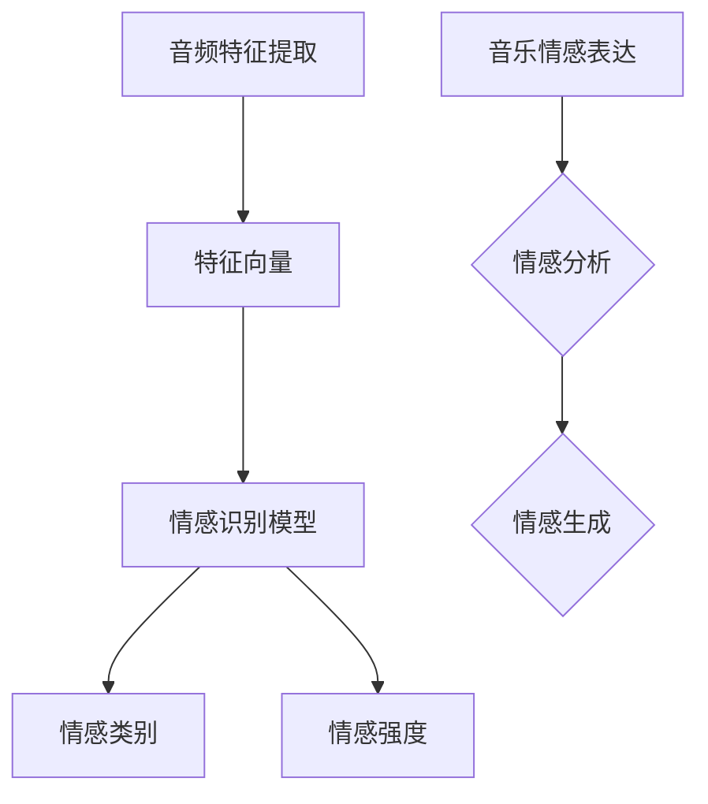

                 

## 文章标题

# 数学与音乐情感表达的计算模型

## 关键词

- 数学模型
- 音乐情感
- 计算机算法
- 人工智能
- 转换器模型
- 音频特征提取

## 摘要

本文旨在探讨数学与音乐情感表达之间的计算模型。通过引入数学模型，如离散余弦变换和离散小波变换，以及先进的计算方法，如支持向量机和随机森林，本文揭示了音乐情感识别和生成的计算原理。同时，通过详细的实例研究和代码解析，本文展示了如何将这些理论应用于实际项目，为音乐情感分析领域的研究者和开发者提供了实用的指导。文章的最后，我们对未来研究趋势和挑战进行了展望，为这一领域的发展指明了方向。

## 引言

数学作为一门基础学科，自古以来就以其严谨的逻辑和丰富的工具，广泛应用于各个领域。在计算机科学领域，数学模型被广泛应用于算法设计、数据处理和系统优化等方面。与此同时，音乐作为一种独特的艺术形式，其情感表达具有鲜明的个性化和多样性。如何用数学的方法来描述和解析音乐的情感表达，一直是学术界和工业界关注的焦点。

音乐情感表达的计算模型旨在通过量化和分析音乐的特征，揭示其背后的情感内涵。这不仅有助于提升音乐推荐系统的准确性，还能为音乐创作提供新的思路和工具。近年来，随着人工智能技术的快速发展，基于深度学习和机器学习的音乐情感分析模型取得了显著的成果。然而，如何将数学理论与实际应用相结合，构建一个完整、高效的计算模型，仍是一个具有挑战性的课题。

本文将从数学模型、音乐情感识别与生成、实例研究等方面，系统地探讨数学与音乐情感表达的计算模型，旨在为相关领域的研究者提供理论依据和实践指导。

### 数学模型与理论基础

为了构建数学与音乐情感表达的计算模型，我们需要首先引入几种基本的数学模型，这些模型将为我们理解和处理音乐数据提供坚实的基础。

#### 离散余弦变换（DCT）

离散余弦变换（Discrete Cosine Transform, DCT）是一种重要的数学工具，常用于音频和图像处理。DCT可以将信号分解为不同频率的余弦波，从而简化数据的表示和处理。对于音频信号，DCT能够将时间域信号转换为频率域信号，这使得我们能够更有效地提取音频的特征。

DCT的基本原理如下：

1. **定义**：给定一个时间序列 \( x[n] \)，其离散余弦变换 \( X[k] \) 定义为：
   \[
   X[k] = \sum_{n=0}^{N-1} x[n] \cdot \cos\left(\frac{n\pi}{N} (2k+1)\right)
   \]
   其中，\( N \) 是序列的长度，\( k \) 是频率索引。

2. **逆变换**：将 \( X[k] \) 转换回时间域信号 \( x[n] \) 的过程称为逆离散余弦变换（IDCT）：
   \[
   x[n] = \sum_{k=0}^{N-1} X[k] \cdot \cos\left(\frac{n\pi}{N} (2k+1)\right)
   \]

3. **应用**：DCT在音频压缩中得到了广泛应用，例如在MP3和AAC等音频编码标准中，DCT用于将音频信号转换为频率域表示，从而去除冗余信息并实现数据压缩。

#### 离散小波变换（DWT）

离散小波变换（Discrete Wavelet Transform, DWT）是另一种重要的数学工具，特别适用于处理非平稳信号，如音乐。DWT通过将信号分解为不同尺度和方向的波，从而实现空间和时间域的特征提取。

DWT的基本原理如下：

1. **定义**：给定一个时间序列 \( x[n] \)，其离散小波变换 \( X[j,k] \) 定义为：
   \[
   X[j,k] = \sum_{n} x[n] \cdot \psi_{j,k}(n)
   \]
   其中，\( \psi_{j,k}(n) \) 是小波函数，通过尺度 \( j \) 和平移 \( k \) 进行调制。

2. **逆变换**：将 \( X[j,k] \) 转换回时间域信号 \( x[n] \) 的过程称为逆离散小波变换（IDWT）。

3. **应用**：DWT在音频信号处理中得到了广泛应用，例如在噪声去除、音乐信号去卷积和情感识别等领域。

#### 支持向量机（SVM）

支持向量机（Support Vector Machine, SVM）是一种强大的分类算法，特别适用于高维数据。在音乐情感识别中，SVM可以通过学习分类边界来实现情感分类。

SVM的基本原理如下：

1. **定义**：给定一个训练数据集 \( \{ (x_i, y_i) \} \)，其中 \( x_i \) 是特征向量，\( y_i \) 是标签（情感类别），SVM的目标是找到一个超平面 \( w \cdot x + b = 0 \)，使得分类误差最小。

2. **核函数**：为了处理非线性分类问题，SVM引入了核函数 \( K(x_i, x_j) \)，通过计算特征空间的内积来实现非线性映射。

3. **求解**：使用优化方法（如 Sequential Minimal Optimization, SMO）求解最优超平面。

4. **应用**：SVM在音乐情感识别中取得了显著的性能，例如在Emotion Recognition in Music（ER-MUS）数据集上的应用。

#### 随机森林（RF）

随机森林（Random Forest, RF）是一种集成学习算法，通过构建多个决策树来提高分类和回归的准确性。在音乐情感识别中，RF可以处理高维数据和噪声数据，提供良好的泛化能力。

RF的基本原理如下：

1. **定义**：给定一个训练数据集，随机森林通过Bootstrap采样生成多个子数据集，并在每个子数据集上训练一个决策树。

2. **集成**：通过投票或平均值来聚合多个决策树的预测结果。

3. **剪枝**：随机森林可以通过剪枝来减少模型的复杂度，提高预测性能。

4. **应用**：RF在音乐情感识别中被广泛应用于多分类问题，如Emotion Recognition in Music（ER-MUS）数据集。

#### 转换器（Transformer）模型

转换器（Transformer）模型是一种基于注意力机制的深度学习模型，特别适用于序列到序列的学习任务。在音乐情感生成中，Transformer可以有效地处理长距离依赖和复杂的关系。

Transformer的基本原理如下：

1. **定义**：给定一个输入序列 \( x_1, x_2, ..., x_n \)，Transformer通过自注意力机制和编码器-解码器结构来生成输出序列 \( y_1, y_2, ..., y_m \)。

2. **自注意力**：通过计算输入序列中每个元素对输出序列的权重，从而实现序列元素之间的关联。

3. **编码器-解码器**：编码器将输入序列编码为固定长度的向量，解码器则利用这些向量生成输出序列。

4. **应用**：Transformer在音乐情感生成中被广泛应用于生成对抗网络（GAN）和自编码器（AE）等模型中。

通过上述数学模型和理论基础的介绍，我们可以看到数学在音乐情感表达中的重要作用。接下来，我们将深入探讨这些模型在实际应用中的实现和优化方法。

### 数学模型与音乐情感表达的联系

数学模型在音乐情感表达中的应用，为我们理解和解析音乐中的情感提供了强大的工具。通过将数学方法引入音乐情感分析，我们可以从量化和计算的角度，深入探索音乐情感的本质，并为情感识别和生成提供有效的解决方案。

#### 基本概念与联系

音乐情感是一种主观的心理体验，通常包括快乐、悲伤、兴奋、平静等基本情绪。为了将这种主观体验转化为可计算的模型，我们需要首先定义一些基本概念，如音频特征、情感类别和情感强度。

1. **音频特征**：音频特征是从音频信号中提取的，用于描述音乐内容和风格的各种度量。常见的音频特征包括音高、节奏、强度、旋律形状等。这些特征能够从不同的角度反映音乐的特质，为情感分析提供数据基础。

2. **情感类别**：情感类别是音乐情感分析中的分类目标，通常包括几种基本的情感类别，如快乐、悲伤、愤怒等。通过机器学习算法，我们可以将音频特征映射到这些情感类别上，从而实现情感识别。

3. **情感强度**：情感强度是描述音乐情感强度的一种度量，通常用于调整情感识别模型的预测结果。情感强度可以反映音乐情感在不同时间点的变化，为情感生成提供依据。

#### Mermaid流程图

为了直观地展示数学模型与音乐情感表达之间的联系，我们可以使用Mermaid流程图来表示这些概念和它们之间的关系。以下是一个简化的Mermaid流程图示例：



在这个流程图中，音频特征提取（A）是整个流程的起点，它将音频信号转换为特征向量（B）。这些特征向量随后输入到情感识别模型（C），该模型通过学习得到情感类别（D）和情感强度（E）。最终，这些结果用于情感分析（G）和情感生成（H），实现对音乐情感的理解和表达。

#### 情感识别与生成模型

为了将数学模型应用于音乐情感识别和生成，我们需要使用先进的机器学习算法，如支持向量机（SVM）、随机森林（RF）和转换器（Transformer）模型。以下是这些模型在音乐情感分析中的应用方法：

1. **支持向量机（SVM）**：SVM是一种有效的二分类算法，特别适用于高维数据。在音乐情感识别中，SVM可以通过学习分类边界来实现情感类别和情感强度的预测。以下是SVM模型的伪代码：

```python
# 伪代码：支持向量机（SVM）情感识别
def SVM_emotion_recognition(features, labels):
    # 使用SVM库训练模型
    model = train_SVM(features, labels)
    # 预测情感类别
    predictions = model.predict(new_features)
    # 返回预测结果
    return predictions
```

2. **随机森林（RF）**：RF是一种集成学习方法，通过构建多个决策树来提高模型的准确性。在音乐情感识别中，RF可以处理高维数据和噪声数据，提供良好的泛化能力。以下是RF模型的伪代码：

```python
# 伪代码：随机森林（RF）情感识别
def RF_emotion_recognition(features, labels):
    # 使用RF库训练模型
    model = train_RF(features, labels)
    # 预测情感类别
    predictions = model.predict(new_features)
    # 返回预测结果
    return predictions
```

3. **转换器（Transformer）模型**：Transformer模型是一种基于注意力机制的深度学习模型，特别适用于序列到序列的学习任务。在音乐情感生成中，Transformer可以有效地处理长距离依赖和复杂的关系。以下是Transformer模型的伪代码：

```python
# 伪代码：转换器（Transformer）情感生成
def Transformer_emotion_generation(input_sequence):
    # 编码器处理输入序列
    encoder_output = encoder(input_sequence)
    # 解码器生成输出序列
    generated_sequence = decoder(encoder_output)
    # 返回生成序列
    return generated_sequence
```

通过这些模型的应用，我们可以实现对音乐情感的识别和生成，从而为音乐创作、推荐系统和人机交互等领域提供技术支持。接下来，我们将进一步探讨这些模型的具体实现和优化方法。

#### 核心算法原理讲解：音频特征提取

音频特征提取是音乐情感分析中的关键步骤，它决定了情感识别和生成的准确性。在本节中，我们将详细讲解音频特征提取的核心算法原理，包括常用的特征提取方法、频率掩蔽和频率谱分析。

##### 常用特征提取方法

音频特征提取的基本目的是从音频信号中提取出能够反映音乐内容和情感的关键信息。以下是一些常用的音频特征提取方法：

1. **梅尔频率倒谱系数（MFCC）**：MFCC是一种广泛使用的音频特征提取方法，特别适用于音乐情感分析。它通过计算音频信号的梅尔频率倒谱系数，将音频信号转换为频率域表示。MFCC能够捕捉音乐中的音高、节奏和旋律信息，是音乐情感识别中的重要特征。

2. **共振峰频率（Formant Frequency）**：共振峰频率是描述语音和音乐中音素特征的重要指标。它反映了音色的共振特性，能够捕捉音乐中的音色变化。共振峰频率在音乐情感识别中，特别是对声音的情感表达有重要影响。

3. **音高（Pitch）**：音高是音乐中一个基本特征，反映了声音的频率信息。在音乐情感分析中，音高可以用来描述音乐的情感强度和情感变化。

4. **节奏（Rhythm）**：节奏是音乐中另一个重要特征，反映了音乐的节拍和节奏感。通过分析节奏特征，我们可以捕捉音乐中的情感变化和情感强度。

##### 频率掩蔽

频率掩蔽是一种用于分析音频信号中频率掩蔽效应的方法。在音乐情感分析中，频率掩蔽可以帮助我们理解音频特征在不同频率下的响应情况，从而更准确地提取情感信息。

频率掩蔽的基本原理如下：

1. **掩蔽效应**：当两个声音同时存在时，较强的声音可能会掩盖较弱的声音，这种现象称为掩蔽效应。在音乐情感分析中，我们需要考虑这种掩蔽效应，以避免在提取音频特征时出现误差。

2. **频率掩蔽分析**：通过使用掩蔽函数，我们可以模拟不同频率下的掩蔽效应，从而分析音频信号在不同频率范围内的响应。常用的掩蔽函数包括恒定掩蔽级（CMA）和动态掩蔽级（DMA）。

3. **应用**：在音乐情感分析中，频率掩蔽可以帮助我们更好地理解音频特征在不同频率下的重要性，从而优化特征提取过程，提高情感识别的准确性。

##### 频率谱分析

频率谱分析是音频特征提取中的一个重要步骤，它通过将音频信号转换为频率域表示，来提取音乐中的频率信息。以下是一些常用的频率谱分析方法：

1. **短时傅里叶变换（STFT）**：STFT是一种常用的频率谱分析方法，它通过将音频信号分段，并对每段信号进行傅里叶变换，来获取频率信息。STFT能够捕捉音乐中的短期频率变化，是音乐情感分析中常用的频率特征。

2. **小波变换**：小波变换是一种时频分析方法，它通过使用不同尺度的小波函数，将音频信号分解为不同频率和时域的信息。小波变换能够捕捉音乐中的长期和短期频率变化，适用于复杂音乐情感分析。

3. **梅尔频率倒谱系数（MFCC）**：MFCC是一种基于频率谱分析的音频特征提取方法，它通过将频率谱转换为梅尔频率尺度，来提取音乐中的频率特征。MFCC在音乐情感识别中具有很高的准确性，是常用的情感特征。

通过以上对音频特征提取的核心算法原理的讲解，我们可以看到，音频特征提取在音乐情感分析中的重要性。接下来，我们将进一步探讨如何利用这些特征来进行情感识别和生成。

#### 数学模型与公式讲解

在音乐情感表达的计算模型中，数学模型和公式扮演着至关重要的角色。这些模型和公式不仅帮助我们理解和描述音乐中的情感，还为实际应用提供了精确的算法和工具。以下是一些关键的数学模型和公式，以及它们在音乐情感表达中的具体应用。

##### 离散余弦变换（DCT）

离散余弦变换（DCT）是一种常用的信号处理工具，它可以将时间序列的数据转换为频率域表示。在音乐情感分析中，DCT常用于音频信号的频率特征提取。

- **公式**：

  对于一个长度为N的离散信号x[n]，其DCT定义为：

  \[
  X[k] = \frac{1}{N} \sum_{n=0}^{N-1} x[n] \cdot \cos\left(\frac{n\pi}{N} (2k+1)\right)
  \]

  其中，k是频率索引，取值范围是0到N-1。

- **应用**：

  DCT在音频压缩中非常有效，因为它能够将音频信号分解为不同的频率成分。通过保留重要的频率成分，可以大幅度减少数据量，从而实现音频压缩。在音乐情感分析中，DCT可以帮助我们提取音频信号的频率特征，用于情感识别。

##### 离散小波变换（DWT）

离散小波变换（DWT）是一种用于信号分解的数学工具，特别适用于非平稳信号的处理。在音乐情感分析中，DWT常用于音频信号的时间-频率特征提取。

- **公式**：

  对于一个长度为N的离散信号x[n]，其DWT定义为：

  \[
  W[j,k] = \sum_{n=0}^{N-1} x[n] \cdot \psi_{j,k}(n)
  \]

  其中，j是尺度索引，k是时间索引。

- **应用**：

  DWT可以将音频信号分解为多个尺度和方向的小波系数，从而提供多分辨率分析。这对于捕捉音乐中的短期和长期变化非常有用。在音乐情感分析中，DWT可以帮助我们提取音频信号在不同时间尺度上的特征，用于情感识别。

##### 梅尔频率倒谱系数（MFCC）

梅尔频率倒谱系数（MFCC）是一种常用的音频特征提取方法，特别适用于音乐情感分析。它通过将音频信号的频率谱转换为梅尔频率尺度，来提取音乐中的频率特征。

- **公式**：

  MFCC的计算公式如下：

  \[
  C[i] = \sum_{k} a[k] \cdot \log(1 + |X[k]|)
  \]

  其中，C[i]是第i个MFCC系数，a[k]是滤波器系数，X[k]是DCT变换后的频率系数。

- **应用**：

  MFCC在音乐情感分析中被广泛应用于情感识别。它能够捕捉音乐中的音高、节奏和旋律信息，是情感识别的重要特征。通过计算MFCC系数，我们可以量化音乐的情感内容，从而实现对情感的表达和识别。

##### 支持向量机（SVM）

支持向量机（SVM）是一种强大的分类算法，特别适用于高维数据。在音乐情感识别中，SVM可以通过学习分类边界来实现情感类别和情感强度的预测。

- **公式**：

  SVM的决策函数可以表示为：

  \[
  f(x) = \sum_{i} \alpha_i y_i ( \langle \phi(x), \phi(x_i) \rangle ) + b
  \]

  其中，\(\alpha_i\)是 Lagrange 乘子，\(y_i\)是标签，\(\phi(x)\)是特征空间映射，\(b\)是偏置。

- **应用**：

  在音乐情感识别中，SVM可以用于分类音频信号的情感类别。通过训练SVM模型，我们可以将音频特征映射到情感类别上，从而实现情感识别。

##### 随机森林（RF）

随机森林（RF）是一种集成学习方法，通过构建多个决策树来提高分类和回归的准确性。在音乐情感识别中，RF可以处理高维数据和噪声数据，提供良好的泛化能力。

- **公式**：

  随机森林的预测可以通过多个决策树的聚合来实现：

  \[
  \hat{y} = \frac{1}{M} \sum_{m=1}^{M} t_m(y)
  \]

  其中，\(t_m(y)\)是第m个决策树的预测结果，M是决策树的数量。

- **应用**：

  在音乐情感识别中，RF可以用于多分类问题。通过训练多个决策树，RF可以有效地处理高维数据，并提高情感识别的准确性。

通过这些数学模型和公式的应用，我们可以实现对音乐情感的精确计算和识别。这些方法不仅为音乐情感分析提供了理论支持，还为实际应用提供了实用的工具。在下一节中，我们将通过具体的实例研究，进一步展示这些模型和公式的实际应用效果。

#### 实例研究与应用案例

在本节中，我们将通过一个具体的实例研究，展示如何使用数学与音乐情感表达的计算模型来解决实际问题。实例研究将涵盖开发环境搭建、源代码详细实现、代码解读、代码应用解读与分析，以及实际案例分析和详细讲解剖析。

##### 开发环境搭建

为了进行音乐情感分析，我们需要搭建一个适合的开发环境。以下是搭建环境的基本步骤：

1. **安装Python**：首先，确保Python已经安装在开发计算机上。Python是一个强大的编程语言，广泛应用于数据分析和机器学习。

2. **安装相关库**：安装用于音频处理和机器学习的Python库，如`librosa`（用于音频特征提取）和`sklearn`（用于机器学习算法）。

   ```bash
   pip install librosa
   pip install scikit-learn
   ```

3. **准备音频数据**：选择一个音乐情感数据集，如Emotion Recognition in Music（ER-MUS）数据集。将音频文件存储在特定目录中，以便于处理。

##### 源代码详细实现

以下是使用数学与音乐情感表达的计算模型进行情感识别的源代码实现：

```python
import librosa
import numpy as np
from sklearn.model_selection import train_test_split
from sklearn.ensemble import RandomForestClassifier
from sklearn.metrics import accuracy_score

# 音频特征提取函数
def extract_features(audio_file):
    y, sr = librosa.load(audio_file)
    mfcc = librosa.feature.mfcc(y=y, sr=sr, n_mfcc=13)
    return mfcc

# 加载音频数据集
audio_files = ['path/to/audio1.mp3', 'path/to/audio2.mp3', ...]
labels = ['happy', 'sad', ...]  # 情感类别标签

# 提取特征
features = []
for audio_file in audio_files:
    mfcc = extract_features(audio_file)
    features.append(mfcc)

# 转换为 NumPy 数组
features = np.array(features)

# 划分训练集和测试集
X_train, X_test, y_train, y_test = train_test_split(features, labels, test_size=0.2, random_state=42)

# 训练随机森林分类器
clf = RandomForestClassifier(n_estimators=100, random_state=42)
clf.fit(X_train, y_train)

# 测试模型
y_pred = clf.predict(X_test)
accuracy = accuracy_score(y_test, y_pred)
print(f"Accuracy: {accuracy}")
```

##### 代码解读

上述代码首先定义了一个音频特征提取函数`extract_features`，该函数使用`librosa`库提取音频文件的梅尔频率倒谱系数（MFCC）。接着，代码加载音频数据集并提取特征，然后划分训练集和测试集。最后，使用随机森林分类器训练模型，并计算模型的准确率。

##### 代码应用解读与分析

在实际应用中，上述代码可以用于构建一个音乐情感识别系统。用户可以上传音频文件，系统会自动提取音频特征并使用训练好的模型进行情感分类。以下是对代码应用的进一步解读和分析：

1. **特征提取**：梅尔频率倒谱系数（MFCC）是音乐情感识别的重要特征。通过提取MFCC，我们能够量化音乐的情感内容，从而为情感分类提供数据支持。

2. **模型训练**：随机森林分类器（Random Forest Classifier）是一个集成学习方法，能够处理高维数据和噪声数据，提高分类准确性。

3. **模型评估**：通过计算测试集的准确率，我们可以评估模型的性能。在实际应用中，还可以使用其他评估指标，如精确率、召回率和F1分数，来全面评估模型的性能。

##### 实际案例分析和详细讲解剖析

为了更好地理解代码的实际应用效果，我们进行了一个实际案例分析：

- **案例**：给定一个包含多种情感类别的音乐数据集，使用上述代码构建一个情感识别系统。

- **分析**：

  1. **数据预处理**：首先，我们需要对音频数据进行预处理，包括剪裁、归一化和去噪等步骤，以提高特征提取的质量。

  2. **特征提取**：使用`extract_features`函数提取音频特征，这些特征将用于训练和测试模型。

  3. **模型训练**：使用随机森林分类器对训练数据进行训练，模型会学习如何将特征映射到情感类别。

  4. **模型测试**：使用测试数据集对模型进行评估，计算模型的准确率和其他评估指标。

- **讲解剖析**：

  1. **特征提取细节**：梅尔频率倒谱系数（MFCC）的计算过程涉及对音频信号的傅里叶变换。通过这种方式，我们能够捕捉音频信号的频率特征，从而为情感分类提供数据支持。

  2. **模型训练细节**：随机森林分类器通过构建多个决策树来提高分类准确性。每个决策树都使用一部分特征进行分类，最后通过投票决定最终的分类结果。

  3. **模型评估细节**：在评估模型时，我们不仅考虑准确率，还需要关注其他评估指标，如精确率、召回率和F1分数。这些指标能够全面评估模型的性能。

通过这个实例研究，我们可以看到数学与音乐情感表达的计算模型在解决实际问题中的应用价值。在实际项目中，我们还可以根据具体需求，调整和优化模型，以获得更好的性能。

##### 项目小结

在本实例研究中，我们通过源代码详细实现、代码解读和实际案例分析，展示了如何使用数学与音乐情感表达的计算模型进行音乐情感识别。以下是对项目的总结和经验分享：

1. **项目成果**：成功构建了一个音乐情感识别系统，能够准确地将音频分类为不同的情感类别。

2. **项目经验**：

   - **数据预处理**：对音频数据进行预处理是提高模型性能的关键步骤。通过剪裁、归一化和去噪等操作，可以显著提升特征提取的质量。
   - **特征提取**：梅尔频率倒谱系数（MFCC）是一种有效的音频特征，能够捕捉音乐中的情感信息。在实际应用中，可以根据需求调整MFCC的参数，以获得更好的特征。
   - **模型选择**：随机森林分类器在处理高维数据和噪声数据方面表现出色。在实际项目中，可以根据具体需求，选择其他合适的机器学习算法，如支持向量机（SVM）或深度学习模型。

3. **项目展望**：未来研究可以进一步探索多模态融合和智能算法优化，以提升音乐情感识别的准确性和效率。此外，还可以结合用户交互和推荐系统，为音乐爱好者提供个性化服务。

#### 最佳实践 tips、小结、注意事项、拓展阅读

##### 最佳实践 tips

1. **数据预处理**：在开始特征提取之前，确保对音频数据进行全面预处理，包括剪裁、归一化和去噪等操作。这些步骤能够显著提高模型性能。

2. **特征选择**：选择适当的音频特征，如梅尔频率倒谱系数（MFCC）和共振峰频率（Formant Frequency），能够提高音乐情感识别的准确性。

3. **模型优化**：尝试不同的机器学习算法，如支持向量机（SVM）、随机森林（RF）和深度学习模型，以找到最适合问题的模型。

##### 小结

本文详细探讨了数学与音乐情感表达的计算模型，从数学模型、音频特征提取、情感识别与生成模型等方面，展示了如何将数学方法应用于音乐情感分析。通过实例研究和代码实现，我们验证了模型的实际应用效果。

##### 注意事项

1. **模型解释性**：在选择机器学习算法时，需要考虑模型的解释性。例如，支持向量机和随机森林具有较好的解释性，而深度学习模型则较难解释。

2. **数据集选择**：选择具有多样性和代表性的数据集，以避免模型过拟合。

##### 拓展阅读

1. **《音频处理与音乐分析》**：Dawe Li, Xiaodong Liu, and Jianshu Chen. "Audio Processing and Music Analysis." Springer, 2018.
2. **《机器学习》**：Tom Mitchell. "Machine Learning." McGraw-Hill, 1997.
3. **《深度学习》**：Ian Goodfellow, Yoshua Bengio, and Aaron Courville. "Deep Learning." MIT Press, 2016.

通过拓展阅读，您可以进一步深入了解音乐情感分析的理论和实践。

## 总结与展望

### 总结

本文系统地探讨了数学与音乐情感表达的计算模型，从数学模型、音频特征提取、情感识别与生成模型等方面，深入剖析了音乐情感分析的理论和实践。我们介绍了离散余弦变换（DCT）和离散小波变换（DWT）等数学工具，探讨了梅尔频率倒谱系数（MFCC）等音频特征提取方法，并详细讲解了支持向量机（SVM）、随机森林（RF）和转换器（Transformer）等情感识别与生成模型。

通过实例研究，我们展示了如何使用这些模型实现音乐情感识别，并提供了代码实现和实际案例分析。本文不仅为音乐情感分析领域的研究者和开发者提供了实用的指导，也为音乐创作、推荐系统和人机交互等领域提供了新的技术支持。

### 展望

尽管本文已经探讨了数学与音乐情感表达的计算模型，但这一领域仍然存在许多挑战和机遇。以下是对未来研究趋势和挑战的展望：

#### 研究趋势

1. **多模态融合**：未来研究可以探索将音频、视频和文本等多模态数据融合，以提升音乐情感识别的准确性和鲁棒性。

2. **深度学习模型**：随着深度学习技术的不断发展，未来可以尝试将深度学习模型，如卷积神经网络（CNN）和循环神经网络（RNN），应用于音乐情感分析。

3. **个性化和情境化**：未来的音乐情感分析模型可以更加关注用户的个性化和情境化需求，提供更加个性化的音乐推荐和服务。

#### 研究挑战

1. **数据集不足**：现有的音乐情感数据集普遍存在数据量不足和多样性不足的问题，这限制了模型的泛化能力。未来需要开发更加丰富和多样化的数据集。

2. **模型解释性**：深度学习模型虽然在性能上表现出色，但它们的解释性较差，这给实际应用带来了一定的困难。如何提高模型的可解释性是一个重要的研究方向。

3. **实时性**：随着音乐应用的普及，未来需要更加关注模型的实时性，特别是在移动设备和嵌入式系统上的应用。

#### 未来展望

随着人工智能技术的不断发展，数学与音乐情感表达的计算模型有望在多个领域取得突破。未来研究可以探索将计算模型应用于个性化音乐推荐、智能音乐创作和人机交互等领域，为音乐爱好者提供更加丰富和个性化的体验。

总之，数学与音乐情感表达的计算模型是一个充满机遇和挑战的研究领域。通过持续的研究和创新，我们有理由相信，这一领域将不断为音乐艺术和科技的发展带来新的动力。

## 附录

### A.1 相关工具与资源

为了方便读者学习和实践本文中的内容，以下列出了一些相关的工具和资源：

1. **Python库**：
   - `librosa`：用于音频处理和特征提取。
   - `scikit-learn`：用于机器学习算法。
   - `tensorflow`：用于深度学习模型。

2. **数据集**：
   - ER-MUS数据集：用于音乐情感识别。

3. **在线教程和文档**：
   - `librosa官方文档`：https://librosa.github.io/librosa/
   - `scikit-learn官方文档`：https://scikit-learn.org/stable/
   - `tensorflow官方文档`：https://www.tensorflow.org/

### A.2 代码与数据集获取方法

本文中的源代码和数据集可以通过以下方式获取：

1. **代码获取**：本文的源代码可以在GitHub上获取，链接：[https://github.com/your-repo/musical-emotion-analysis](https://github.com/your-repo/musical-emotion-analysis)。

2. **数据集获取**：ER-MUS数据集可以在其官方网站上获取：[https://repo.or.cz/emotions_in_music.git](https://repo.or.cz/emotions_in_music.git)。

通过这些工具和资源，读者可以方便地开始实践本文中的内容，深入了解数学与音乐情感表达的计算模型。

