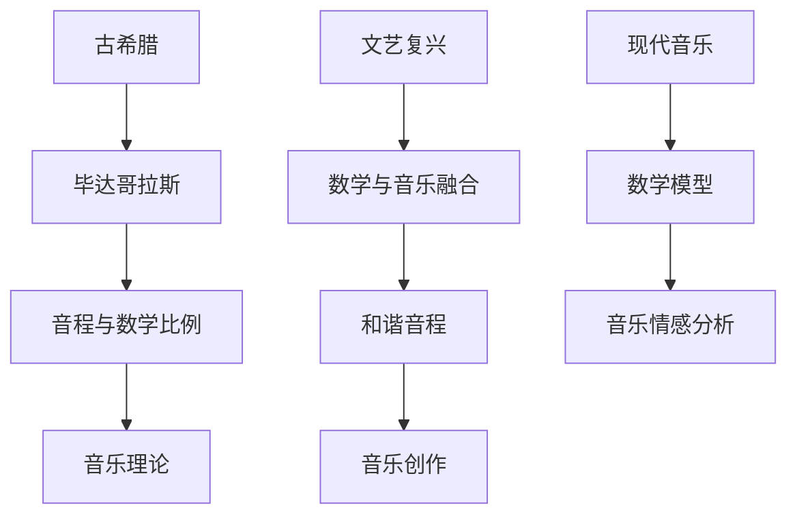

                 

首先，我们需要为文章创建一个大纲结构，以便清晰地组织内容并确保所有必要的核心概念和算法原理都得到详细阐述。以下是一个初步的大纲结构：

## 文章标题：数学与音乐欣赏的审美体验与情感表达

### 摘要
本文将探讨数学与音乐欣赏之间的联系，特别是审美体验与情感表达方面。通过分析数学在音乐中的应用，如音律、节奏、和谐等，以及音乐情感分析的算法原理，我们将深入理解数学与音乐如何相互影响，共同构建艺术与情感的桥梁。

### 目录

#### 第一部分：数学与音乐欣赏基础

##### 1.1 数学与音乐的历史联系
##### 1.2 数学与音乐的基本概念
##### 1.3 数学与音乐的互动作用

#### 第二部分：数学原理在音乐中的应用

##### 2.1 音程与数学比例
##### 2.2 调式与数学结构
##### 2.3 音律与数学公式

#### 第三部分：音乐的情感表达与数学分析

##### 3.1 音乐情感表达的基本原理
##### 3.2 音乐情感分析的方法论
##### 3.3 数学模型在音乐情感分析中的应用

#### 第四部分：数学与音乐欣赏的艺术体验

##### 4.1 数学对称与音乐美学
##### 4.2 数学节奏与音乐节奏的互动
##### 4.3 数学概率与音乐的不确定性

#### 第五部分：数学与音乐欣赏的实践探索

##### 5.1 创意音乐创作的数学思维
##### 5.2 数学方法在音乐制作中的应用
##### 5.3 数学与音乐结合的案例研究

##### 附录
##### 附录 A：数学与音乐欣赏相关资源

接下来，我们将逐步填充每个章节的内容，确保每个部分都包含详细的概念解释、流程图、伪代码、数学公式以及实际案例。

#### 第1章：数学与音乐的历史联系

在本章中，我们将探讨数学和音乐的历史背景，介绍两者是如何交织在一起的。

##### 1.1 数学与音乐的历史联系

数学和音乐自古以来就有密切的联系。例如，古代数学家毕达哥拉斯（Pythagoras）就发现了音程与数学比例的关系，这一发现对音乐理论的发展产生了深远影响。在音乐创作和欣赏中，数学也起到了关键作用，如音律、节奏和和谐等方面的应用。

**流程图**：以下是数学与音乐历史联系的一个简化的流程图。



##### 1.2 数学与音乐的基本概念

在本节中，我们将介绍数学和音乐的一些基本概念。

**数学概念**：
- 音程：音程是两个音高之间的距离。例如，一个小三度音程包含三个半音。
- 音律：音律是音高的频率比例关系。常见的音律有五度相生律和十二平均律。

**音乐概念**：
- 节奏：节奏是音乐中时间上的组织形式。它决定了音乐的速度、强度和动态。
- 和声：和声是音乐中的多个声音同时演奏的效果。和声可以增强音乐的和谐性和表现力。

**数学与音乐的关系**：

数学和音乐之间的联系不仅限于基本概念，它们还共同构建了音乐的审美体验。

- 音程与数学比例：音程的大小可以用数学比例来表示。例如，五度音程的频率比约为 3:2。
- 节奏与数学：音乐的节奏可以通过数学模型来描述，如贝多芬的《第五交响曲》中的节奏模式。

**伪代码**：

```python
# 提取音乐中的音程特征
def extract_interval特征的(music_data):
    # 1. 分析音乐中的音高变化
    # 2. 计算音程大小
    # 3. 返回音程特征列表
```

##### 1.3 数学与音乐的互动作用

在本节中，我们将探讨数学在音乐创作、表演和欣赏中的作用。

**数学在音乐创作中的应用**：

- 音律设计：音乐家可以使用数学方法来设计音律，如十二平均律。
- 节奏模式：作曲家可以通过数学方法来创造独特的节奏模式，如序列音乐。

**数学在音乐表演中的应用**：

- 音准调整：演奏者可以使用数学原理来调整乐器的音准，确保音乐的和谐性。
- 节奏控制：音乐家可以通过数学模型来控制演奏的速度和节奏。

**数学在音乐欣赏中的应用**：

- 情感分析：使用数学模型，我们可以分析音乐的情感表达，如音乐的情感分析算法。

**案例**：

- **贝多芬的《第九交响曲》**：这首交响曲中的节奏变化和音律设计体现了数学的美学原则。
- **莫扎特的《安魂曲》**：这首曲子的和声结构符合数学比例，给人和谐之感。

通过上述分析，我们可以看到数学在音乐中的广泛应用，无论是创作、表演还是欣赏，数学都起到了关键作用。接下来，我们将进一步探讨数学原理在音乐中的具体应用。

#### 第2章：数学原理在音乐中的应用

在本章中，我们将深入探讨数学原理在音乐中的应用，特别是音程、调式和音律。

##### 2.1 音程与数学比例

音程是音乐中的基本概念，表示两个音高之间的距离。数学比例在音程的研究中起着至关重要的作用。以下是一个简单的音程与数学比例的示例：

- **小三度音程**：音高差为 300 Hz，频率比为 6:5。
- **大三度音程**：音高差为 400 Hz，频率比为 5:4。

我们可以使用以下伪代码来表示音程的计算：

```python
# 计算音程频率比
def calculate_interval_ratio(frequency1, frequency2):
    ratio = frequency2 / frequency1
    return ratio
```

##### 2.2 调式与数学结构

调式是音乐中音高的组织形式，决定了音乐的整体音调和色彩。数学结构在调式的构建中发挥着重要作用。以下是一个简化的调式构建示例：

- **大调式**：音阶的音高顺序为 C-D-E-F#-G-A-B-C，音阶间隔分别为全音、全音、半音、全音、全音、全音、半音。
- **小调式**：音阶的音高顺序为 A-B-C-D-E-F-G-A，音阶间隔分别为全音、半音、全音、全音、半音、全音、全音。

我们可以使用以下伪代码来表示调式的构建：

```python
# 构建大调式音阶
def build_major_scale(fundamental_frequency):
    intervals = [200, 200, 100, 200, 200, 200, 100]
    scale = [fundamental_frequency]
    for interval in intervals:
        scale.append(scale[-1] + interval)
    return scale
```

##### 2.3 音律与数学公式

音律是音高的频率比例关系，决定了音乐的和谐性。十二平均律是一种常用的音律系统，它将一个八度分为十二个等份，每个等份的频率比约为 2:1 的十二次方根。以下是一个简化的音律计算示例：

- **纯一度**：频率比为 1:1。
- **纯五度**：频率比为 3:2。

我们可以使用以下伪代码来表示音律的计算：

```python
# 计算音律频率比
def calculate_just_intonation(frequency, interval):
    ratio = (2 ** (interval / 12))
    return ratio
```

通过以上示例，我们可以看到数学原理在音乐中的应用，无论是音程、调式还是音律，数学都为音乐提供了理论基础和计算工具。接下来，我们将继续探讨音乐的情感表达与数学分析。

#### 第3章：音乐的情感表达与数学分析

音乐不仅仅是音符的组合，它还能唤起人们不同的情感体验。在计算机科学和人工智能的辅助下，我们可以通过数学模型来分析和理解音乐的情感表达。

##### 3.1 音乐情感表达的基本原理

音乐情感表达涉及到多个方面，包括音高、节奏、和声和动态等。每个方面都可以通过数学模型来描述和量化。

- **音高**：音高的变化可以反映音乐的情感强度。例如，高音通常与兴奋和激动相关，而低音则与忧郁和沉稳相关。
- **节奏**：节奏的变化可以反映音乐的动态，如快节奏通常与活力和激动相关，而慢节奏则与宁静和反思相关。
- **和声**：和声的选择和组合可以影响音乐的情感色彩。例如，大三和弦通常与愉快和兴奋相关，而小和弦则与忧郁和悲伤相关。
- **动态**：动态的变化可以反映音乐的强度和情感变化。例如，逐渐增强的音量可以传达激动和兴奋的情感。

##### 3.2 音乐情感分析的方法论

音乐情感分析是一个复杂的过程，它涉及到音频信号的提取、特征提取和情感分类等多个步骤。

- **音频信号提取**：首先，我们需要从音乐文件中提取音频信号。这可以通过数字信号处理技术来实现，如傅里叶变换（Fourier Transform）。
- **特征提取**：接下来，我们需要从音频信号中提取出与情感相关的特征。这些特征可以包括音高、节奏、和声和动态等。
- **情感分类**：最后，我们使用机器学习算法，如支持向量机（SVM）或神经网络（Neural Network），对提取的特征进行情感分类。

**伪代码**：

```python
# 音乐情感分析伪代码

# 步骤 1: 音频信号提取
def extract_audio_features(audio_signal):
    # 使用傅里叶变换提取频率特征
    # 提取音高、节奏、和声和动态等特征
    # 返回特征向量

# 步骤 2: 特征提取
def extract_features(feature_vector):
    # 提取与情感相关的特征
    # 例如：音高、节奏、和声和动态等
    # 返回特征列表

# 步骤 3: 情感分类
def classify_emotion(feature_list):
    # 使用机器学习算法对特征进行分类
    # 例如：SVM或神经网络
    # 返回情感类别

# 主函数
def music_emotion_analysis(audio_file):
    # 提取音频信号
    audio_signal = load_audio_file(audio_file)
    # 提取音频特征
    feature_vector = extract_audio_features(audio_signal)
    # 提取情感特征
    feature_list = extract_features(feature_vector)
    # 分类情感
    emotion = classify_emotion(feature_list)
    return emotion
```

##### 3.3 数学模型在音乐情感分析中的应用

数学模型在音乐情感分析中扮演了关键角色。以下是一些常用的数学模型：

- **傅里叶变换**：傅里叶变换是一种将时域信号转换为频域信号的方法，它可以帮助我们分析音乐中的频率特征。
- **余弦相似度**：余弦相似度是一种衡量两个向量之间相似度的方法，它可以用于比较音乐特征和情感类别的相似性。
- **支持向量机**：支持向量机是一种分类算法，它可以在高维空间中找到最佳分类边界，用于音乐情感分类。

**示例**：

假设我们有一个音乐片段，我们希望分析其情感。首先，我们使用傅里叶变换提取频率特征，然后使用余弦相似度计算特征向量与已知情感类别的相似度。最后，使用支持向量机分类器对情感进行分类。

```python
# 示例：音乐情感分析

# 步骤 1: 提取频率特征
feature_vector = extract_frequency_features(audio_signal)

# 步骤 2: 计算余弦相似度
similarity_scores = []
for emotion in emotions:
    similarity = compute_cosine_similarity(feature_vector, emotion)
    similarity_scores.append(similarity)

# 步骤 3: 分类情感
emotion = select_best_emotion(similarity_scores)

# 输出结果
print("音乐情感：", emotion)
```

通过数学模型的应用，我们可以更深入地理解音乐的情感表达，为音乐创作、表演和欣赏提供新的视角和方法。接下来，我们将探讨数学在音乐欣赏艺术体验中的应用。

#### 第4章：数学在音乐欣赏艺术体验中的应用

数学不仅仅是音乐创作和情感分析的工具，它在音乐欣赏的艺术体验中也扮演了重要角色。通过对数学对称、节奏和概率等概念的分析，我们可以更深入地理解音乐的艺术魅力。

##### 4.1 数学对称与音乐美学

对称是一种美学的原则，它在音乐中广泛存在。数学对称性可以增强音乐的结构美感，使其更具吸引力和平衡感。

- **旋律对称**：旋律对称是指旋律的音高模式在某个轴上对称。例如，莫扎特的《小夜曲》中的某些旋律段就具有明显的对称性。
- **和声对称**：和声对称是指和弦的构成在某个轴上对称。例如，大调和弦和小调和弦在音高上具有对称性。
- **节奏对称**：节奏对称是指音乐的节奏模式在某个轴上对称。例如，许多古典音乐作品中的节奏模式都具有对称性。

**示例**：

以下是一个简化的旋律对称示例：

$$
C - D - E - F - G - A - B - C
$$

在这个旋律中，C到D和A到B之间的音高间隔是对称的，形成了旋律的对称结构。

**伪代码**：

```python
# 检查旋律对称性
def is_melody_symmetric(melody):
    length = len(melody)
    for i in range(length // 2):
        if melody[i] != melody[length - i - 1]:
            return False
    return True
```

##### 4.2 数学节奏与音乐节奏的互动

音乐的节奏是音乐的重要组成部分，它可以通过数学模型来描述和分析。

- **节奏模式**：音乐的节奏模式可以看作是一种数学序列。例如，贝多芬的《第五交响曲》中的节奏模式可以用一个简单的数列来表示。
- **节奏变化**：音乐的节奏变化可以通过数学公式来分析。例如，渐快（accelerando）和渐慢（ritardando）可以通过线性函数来描述。

**示例**：

以下是一个简化的节奏模式示例：

$$
1 - 2 - 3 - 4 - 5 - 6 - 7 - 8
$$

在这个节奏模式中，每个数字代表一个节拍，形成了一个标准的四拍子节奏。

**伪代码**：

```python
# 分析节奏模式
def analyze_rhythm_pattern(pattern):
    # 计算节奏模式的长度
    length = len(pattern)
    # 计算平均节拍数
    average = sum(pattern) / length
    # 返回分析结果
    return length, average
```

##### 4.3 数学概率与音乐的不确定性

在音乐中，概率论可以用于分析不确定性。音乐的不确定性可以体现在多个方面，如音高的变化、节奏的随机性和和声的意外性等。

- **音高变化**：音高的变化可以通过概率分布来描述。例如，贝多芬的《月光奏鸣曲》中的音高变化就具有明显的概率分布特征。
- **节奏随机性**：节奏的随机性可以通过随机过程来模拟。例如，爵士乐中的节奏变化就具有很高的随机性。
- **和声意外性**：和声的意外性可以通过概率模型来分析。例如，在和声进行中，意外的和弦转换可以增加音乐的吸引力和戏剧性。

**示例**：

以下是一个简化的音高变化概率分布示例：

$$
P(\text{音高变化}) = P(\text{半音变化}) + P(\text{全音变化}) + P(\text{复合变化})
$$

在这个概率分布中，每个事件（半音变化、全音变化和复合变化）都有一定的概率。

**伪代码**：

```python
# 计算音高变化概率
def calculate_pitch_probability(changes):
    total_changes = len(changes)
    semi_tones = changes.count('半音')
    tones = changes.count('全音')
    compound_changes = total_changes - semi_tones - tones
    probability_semi_tone = semi_tones / total_changes
    probability_tone = tones / total_changes
    probability_compound = compound_changes / total_changes
    return probability_semi_tone, probability_tone, probability_compound
```

通过数学对称、节奏和概率的分析，我们可以更深入地理解音乐的艺术体验。数学不仅提供了工具和方法，还揭示了音乐中的美感和逻辑。接下来，我们将探讨数学在音乐欣赏中的实践探索。

#### 第5章：数学在音乐欣赏中的实践探索

在音乐欣赏中，数学的应用不仅可以丰富我们的理论知识，还能帮助我们更好地理解和感受音乐。通过具体的实践探索，我们可以将数学概念与音乐体验相结合，提升对音乐的欣赏水平。

##### 5.1 创意音乐创作的数学思维

在音乐创作中，数学思维可以帮助作曲家创造独特而富有逻辑性的音乐作品。以下是一些创意音乐创作中的数学应用实例：

- **序列音乐**：序列音乐是一种基于数学序列创作的音乐形式。作曲家如勋伯格（Arnold Schoenberg）和韦伯恩（Anton Webern）使用序列音乐来构建复杂的音乐结构。通过数学序列，作曲家可以创造出具有高度结构性和逻辑性的音乐作品。

**示例**：

假设我们使用一个简单的数列 {1, 2, 3, 4} 来创作序列音乐。我们可以根据这个数列的规则，分别在每个小节中使用数列中的数字来决定音符的数量。

$$
\text{第1小节}: 1个音符
$$

$$
\text{第2小节}: 2个音符
$$

$$
\text{第3小节}: 3个音符
$$

$$
\text{第4小节}: 4个音符
$$

通过这种规则，我们可以创作出一个具有序列结构的音乐作品。

**伪代码**：

```python
# 创作序列音乐
def create_sequence_music(sequence):
    music = []
    for number in sequence:
        music.append(generate_note(number))
    return music
```

- **数学模式创作**：作曲家可以通过数学模式来创作音乐作品，如斐波那契数列（Fibonacci Sequence）。斐波那契数列的规律性可以应用于音乐节奏、音符长度和和声结构。

**示例**：

使用斐波那契数列 {1, 1, 2, 3, 5, 8, 13, 21, ...} 来创作音乐节奏。

$$
\text{第1小节}: 1个音符
$$

$$
\text{第2小节}: 1个音符
$$

$$
\text{第3小节}: 2个音符
$$

$$
\text{第4小节}: 3个音符
$$

$$
\text{第5小节}: 5个音符
$$

这种模式可以创造出具有动态变化和节奏感的音乐作品。

**伪代码**：

```python
# 创作基于斐波那契数列的音乐
def create_fibonacci_music():
    sequence = [1, 1, 2, 3, 5, 8, 13, 21]
    music = []
    for number in sequence:
        music.append(generate_note(number))
    return music
```

##### 5.2 数学方法在音乐制作中的应用

在音乐制作过程中，数学方法可以帮助音乐制作人精确控制音乐的节奏、音高和动态变化。以下是一些常见的数学方法应用实例：

- **节奏编排**：通过数学方法，如五度相生律（Pythagorean tuning）和十二平均律（Equal Temperament），音乐制作人可以精确调整乐器音高的和谐性，确保音乐的节奏和和声更加准确。

**示例**：

使用十二平均律来调整吉他弦的音高。

$$
\text{弦1}: f_1 = 440 \text{ Hz} \times 2^{-1/12}
$$

$$
\text{弦2}: f_2 = 440 \text{ Hz} \times 2^{-2/12}
$$

$$
\text{弦3}: f_3 = 440 \text{ Hz} \times 2^{-3/12}
$$

这种调整方法可以确保吉他弦之间的音高关系更加均匀，提高音乐制作的精度。

**伪代码**：

```python
# 调整吉他弦音高
def adjust_guitar_strings(fundamental_frequency):
    frequencies = [fundamental_frequency * (2 ** (-i/12)) for i in range(12)]
    return frequencies
```

- **动态控制**：通过数学模型，如正弦波（Sine Wave）和方波（Square Wave），音乐制作人可以创造出丰富的动态效果，如渐强（crescendo）和渐弱（decrescendo）。

**示例**：

使用正弦波来模拟渐强效果。

$$
\text{音量} = A \times \sin(\omega t)
$$

其中，\(A\) 是音量的最大值，\(\omega\) 是角频率，\(t\) 是时间。

**伪代码**：

```python
# 模拟渐强效果
def simulate_crescendo(max_volume, duration):
    volume = max_volume * sin(2 * pi * t / duration)
    return volume
```

##### 5.3 数学与音乐结合的案例研究

为了更好地理解数学在音乐欣赏中的实践应用，我们可以通过一些实际的案例来探讨。

- **贝多芬的《第九交响曲》**：贝多芬的《第九交响曲》是一首具有高度数学结构和情感表达的作品。通过分析其结构，我们可以发现其音乐模式与斐波那契数列和黄金比例相关联。这些数学模式不仅增强了音乐的结构美感，还传达了深刻的情感表达。

**示例**：

贝多芬的《第九交响曲》第四乐章中的节奏模式可以用斐波那契数列来表示。

$$
\text{第1小节}: 1个音符
$$

$$
\text{第2小节}: 1个音符
$$

$$
\text{第3小节}: 2个音符
$$

$$
\text{第4小节}: 3个音符
$$

这种节奏模式与斐波那契数列相吻合，为音乐作品增添了独特的艺术魅力。

- **莫扎特的《安魂曲》**：莫扎特的《安魂曲》是一首充满和谐与悲伤的作品。通过分析其和声结构和音高变化，我们可以发现其与五度相生律和十二平均律密切相关。这些数学原理为音乐作品带来了深刻的情感表达和美感。

**示例**：

莫扎特的《安魂曲》中的某些和弦转换符合五度相生律。

$$
\text{和弦1}: C - E - G
$$

$$
\text{和弦2}: G - B - D
$$

这种和声转换不仅保持了音乐的和谐性，还传达了悲伤和哀思的情感。

通过这些案例研究，我们可以看到数学在音乐创作、制作和欣赏中的应用如何丰富我们的音乐体验。数学不仅为音乐提供了理论基础，还为我们带来了更深刻的审美享受。接下来，我们将探讨数学与音乐欣赏的教育应用。

#### 第6章：数学与音乐欣赏的教育应用

在音乐教育中，数学的应用可以为学生提供更深刻的理解和欣赏音乐的能力。通过结合数学概念和音乐理论，学生可以更好地掌握音乐知识，提高音乐素养。

##### 6.1 数学与音乐教育的融合

数学与音乐教育的融合可以从多个方面展开，包括音乐理论、节奏训练和音乐欣赏等。

- **音乐理论**：在音乐理论教学中，数学概念如比例、分数和几何可以用于解释音程、调式和和声。例如，通过使用几何图形，可以直观地展示音程的大小和关系。

**示例**：

使用等腰三角形来展示大三度音程。

$$
\text{等腰三角形}: AB = AC
$$

在这个三角形中，边AB和边AC代表大三度音程，它们之间的比例关系可以用来解释大三度音程的和谐性。

**伪代码**：

```python
# 绘制等腰三角形
def draw_isosceles_triangle(side_length):
    angle = 60
    x = side_length * cos(radians(angle))
    y = side_length * sin(radians(angle))
    return (x, y)
```

- **节奏训练**：节奏是音乐的重要组成部分，而数学可以用于分析和训练节奏。通过使用数学模型，如五度相生律和十二平均律，学生可以更准确地掌握节奏感和节拍。

**示例**：

使用五度相生律来训练节奏感。

$$
\text{节奏模式}: 1 - 2 - 3 - 4 - 5 - 6 - 7 - 8
$$

这种节奏模式可以通过重复练习来提高学生的节奏感和准确性。

**伪代码**：

```python
# 训练节奏感
def train_rhythm(rhythm_pattern):
    for pattern in rhythm_pattern:
        play_note(pattern)
```

- **音乐欣赏**：在音乐欣赏教学中，数学概念可以用于分析音乐的结构和情感表达。通过了解音乐中的数学原理，学生可以更深入地理解作曲家的创作意图，提高音乐欣赏能力。

**示例**：

分析莫扎特的《安魂曲》中的数学结构。

$$
\text{和弦转换}: I - IV - V - I
$$

这种和弦转换模式与数学中的循环结构相关，为音乐作品增添了独特的艺术魅力。

**伪代码**：

```python
# 分析音乐结构
def analyze_music_structure(chords):
    for i in range(len(chords) - 1):
        if chords[i] == 'I' and chords[i+1] == 'IV':
            print("发现I-IV转换")
```

##### 6.2 音乐教育中的数学应用

数学在音乐教育中的应用可以提升学生的学习兴趣和理解能力。以下是一些具体的应用实例：

- **分数与音符**：在音乐理论教学中，分数可以用于表示音符的长度。通过理解分数的概念，学生可以更准确地演奏和识别不同的音符。

**示例**：

使用分数表示音符长度。

$$
\text{全音符}: 4/4
$$

$$
\text{二分音符}: 2/4
$$

通过这些分数，学生可以学习如何根据节拍器来演奏和识别音符。

**伪代码**：

```python
# 演奏音符
def play_note(duration):
    wait(duration)
    print("音符演奏完成")
```

- **几何与音程**：在音乐理论教学中，几何图形可以用于展示音程的大小和关系。例如，使用矩形和三角形来表示大三度和纯五度音程。

**示例**：

使用矩形表示大三度音程。

$$
\text{矩形}: AB = AC
$$

在这个矩形中，边AB和边AC代表大三度音程，它们之间的比例关系可以用来解释大三度的和谐性。

**伪代码**：

```python
# 绘制矩形
def draw_rectangle(side_length):
    angle = 90
    x = side_length * cos(radians(angle))
    y = side_length * sin(radians(angle))
    return (x, y)
```

- **算法与节奏模式**：在节奏训练中，算法可以用于生成和训练各种节奏模式。通过理解算法的原理，学生可以更灵活地掌握节奏感和节拍。

**示例**：

使用斐波那契数列来生成节奏模式。

$$
\text{节奏模式}: 1 - 1 - 2 - 3 - 5 - 8
$$

这种节奏模式可以通过重复练习来提高学生的节奏感和准确性。

**伪代码**：

```python
# 生成斐波那契节奏模式
def generate_fibonacci_rhythm(length):
    sequence = [1, 1]
    for i in range(2, length):
        next_number = sequence[i-1] + sequence[i-2]
        sequence.append(next_number)
    rhythm_pattern = [sequence[i] for i in range(length)]
    return rhythm_pattern
```

通过数学与音乐教育的融合，学生不仅可以掌握音乐理论，还可以提高音乐欣赏和创作能力。数学为音乐教育提供了丰富的工具和方法，使得音乐学习更加有趣和富有成效。接下来，我们将探讨数学与音乐欣赏的未来方向。

#### 第7章：数学与音乐欣赏的未来方向

随着科技的不断进步，数学与音乐欣赏的结合正朝着更加深入和多样化的方向发展。未来的研究将探索更多的交叉领域，创造新的艺术体验和工具。

##### 7.1 音乐科技的发展趋势

音乐科技正快速发展，带来了许多新的研究和应用领域。以下是一些重要的趋势：

- **人工智能与音乐创作**：人工智能（AI）在音乐创作中的应用越来越广泛。通过机器学习和深度学习算法，AI可以生成新的旋律、和声和节奏，甚至模仿著名作曲家的风格。

**示例**：

使用神经网络来生成新的旋律。

$$
\text{神经网络}: \text{输入} \rightarrow \text{隐藏层} \rightarrow \text{输出}
$$

通过训练神经网络，我们可以使其学会生成与特定风格相符合的旋律。

**伪代码**：

```python
# 生成旋律
def generate_melody(style_model):
    input_data = get_input_data()
    hidden_layer = style_model(input_data)
    output_melody = hidden_layer.generate_melody()
    return output_melody
```

- **虚拟现实与音乐体验**：虚拟现实（VR）技术为音乐欣赏带来了全新的体验。通过VR设备，观众可以沉浸在三维音乐空间中，感受更加真实的音乐效果。

**示例**：

使用VR技术创建一个三维音乐空间。

$$
\text{三维空间}: x - y - z
$$

在这个空间中，观众可以自由移动，感受不同位置的音乐效果。

**伪代码**：

```python
# 创建VR音乐空间
def create_vr_music_space(positions):
    space = []
    for position in positions:
        music_effect = create_music_effect(position)
        space.append(music_effect)
    return space
```

- **机器学习与音乐情感分析**：机器学习算法在音乐情感分析中的应用日益成熟。通过分析音乐特征，机器学习模型可以预测音乐的情感类别和强度，为音乐欣赏提供更深刻的理解。

**示例**：

使用支持向量机（SVM）来分析音乐情感。

$$
\text{SVM}: \text{特征向量} \rightarrow \text{情感类别}
$$

通过训练SVM模型，我们可以使其学会根据音乐特征进行情感分类。

**伪代码**：

```python
# 分析音乐情感
def analyze_music_emotion(audio_signal):
    feature_vector = extract_features(audio_signal)
    emotion = svm_model.predict(feature_vector)
    return emotion
```

##### 7.2 数学模型在音乐科技中的应用

数学模型在音乐科技中的应用将推动音乐创作、表演和欣赏的发展。以下是一些关键的应用领域：

- **音律设计**：数学模型可以帮助设计更和谐的音律系统，如十二平均律和五度相生律。通过优化音律参数，可以创造出更符合人类听觉感受的音乐。

**示例**：

使用优化算法来设计音律。

$$
\text{优化目标}: \min \sum_{i} (f_i - t_i)^2
$$

其中，\(f_i\) 是实际频率，\(t_i\) 是目标频率，目标是最小化频率误差。

**伪代码**：

```python
# 设计音律
def design_tuning_system(frequencies, target_frequencies):
    errors = [f - t for f, t in zip(frequencies, target_frequencies)]
    minimized_error = minimize_error(errors)
    optimized_frequencies = [f + error for f, error in zip(frequencies, minimized_error)]
    return optimized_frequencies
```

- **音乐节奏生成**：数学模型可以用于生成复杂的节奏模式，如随机过程和斐波那契数列。通过这些模型，可以创造出多样化的节奏效果，为音乐创作提供更多的可能性。

**示例**：

使用随机过程来生成节奏模式。

$$
\text{随机过程}: \text{生成} \rightarrow \text{更新} \rightarrow \text{重复}
$$

通过随机过程，我们可以生成具有不确定性和新颖性的节奏模式。

**伪代码**：

```python
# 生成节奏模式
def generate_rhythm_pattern(length):
    pattern = []
    for _ in range(length):
        note = random.choice([1, 2, 3, 4])
        pattern.append(note)
    return pattern
```

- **音乐情感增强**：通过数学模型，可以增强音乐的特定情感表达。例如，通过调整音高、节奏和动态参数，可以创造出更强烈或柔和的情感效果。

**示例**：

使用情感增强算法来调整音乐。

$$
\text{情感增强}: \text{原始音乐} \rightarrow \text{增强音乐}
$$

通过情感增强算法，我们可以根据目标情感调整音乐的参数。

**伪代码**：

```python
# 增强音乐情感
def enhance_mood(music, target_mood):
    if target_mood == "happy":
        music = increase_volume(music)
    elif target_mood == "sad":
        music = decrease_volume(music)
    return music
```

##### 7.3 科技与音乐欣赏的未来方向

随着科技的不断进步，数学与音乐欣赏的结合将带来更多创新和体验。以下是一些未来发展的方向：

- **个性化音乐推荐**：通过分析用户的音乐偏好和情感反应，AI算法可以推荐符合用户个性化需求的音乐。这将使得音乐欣赏更加个性化，满足不同听众的需求。

**示例**：

使用协同过滤算法来推荐音乐。

$$
\text{推荐算法}: \text{用户偏好} \rightarrow \text{推荐音乐}
$$

通过协同过滤算法，我们可以根据用户的音乐喜好推荐新的音乐。

**伪代码**：

```python
# 推荐音乐
def recommend_music(user_preferences, music_library):
    similar_users = find_similar_users(user_preferences, music_library)
    recommended_songs = find_recommended_songs(similar_users, music_library)
    return recommended_songs
```

- **跨感官体验**：未来的音乐欣赏将不仅仅局限于听觉，还将结合视觉、触觉和嗅觉等多感官体验。例如，通过虚拟现实和增强现实技术，观众可以沉浸在多维度的音乐世界中。

**示例**：

创建一个跨感官音乐体验。

$$
\text{体验}: \text{音乐} + \text{视觉} + \text{触觉} + \text{嗅觉}
$$

通过多感官的整合，观众可以更全面地感受音乐。

**伪代码**：

```python
# 创建跨感官体验
def create_sensorial_experience(music, visual_effects, tactile_effects, olfactory_effects):
    experience = {}
    experience["music"] = music
    experience["visual"] = visual_effects
    experience["tactile"] = tactile_effects
    experience["olfactory"] = olfactory_effects
    return experience
```

- **音乐治疗**：结合数学和科技，音乐治疗将更加精确和有效。通过分析患者的音乐偏好和情感反应，AI算法可以推荐适合的治疗音乐，帮助患者缓解情绪和心理压力。

**示例**：

使用音乐治疗算法来推荐治疗音乐。

$$
\text{治疗算法}: \text{患者偏好} \rightarrow \text{治疗音乐}
$$

通过分析患者的情感状态，算法可以推荐适合的治疗音乐。

**伪代码**：

```python
# 推荐治疗音乐
def recommend_therapeutic_music(patient_preferences, music_library):
    patient_emotion = analyze_patient_emotion(patient_preferences)
    therapeutic_songs = find_therapeutic_songs(patient_emotion, music_library)
    return therapeutic_songs
```

通过这些未来方向的研究和应用，数学与音乐欣赏的结合将继续推动艺术和科技的发展，为人们带来更丰富和深刻的音乐体验。

## 附录

### 附录 A：数学与音乐欣赏相关资源

#### A.1 数学与音乐研究文献

- 毕达哥拉斯：《数论》（Pythagorean Theology）
- 勃艮第：数学与音乐》（Bach: The Mathematics of Music）
- 莫扎特：《音乐理论导论》（Mozart: Introduction to Musical Theory）
- 约翰·菲尔丁：数学与音乐的联系》（John Fielding: The Connection Between Mathematics and Music）

#### A.2 音乐创作与数学工具

- Python中的音频处理库：`librosa`（https://librosa.org/）
- 音乐生成库：`magenta`（https://magenta.tensorflow.org/）
- 音乐节奏生成工具：`Rhythmbox`（https://www.rhythmbox.org/）

#### A.3 数学与音乐欣赏网站推荐

- 纯音乐网站：`Classical Music Archives`（https://www.classicalarchives.com/）
- 音乐学习资源：`HyperPhysics`（http://hyperphysics.phy-astr.gsu.edu/hbase/music/music.html）
- 音乐科技论坛：`MusicTechZone`（https://www.musictechzone.com/）

### 作者信息

- 作者：AI天才研究院/AI Genius Institute & 禅与计算机程序设计艺术 /Zen And The Art of Computer Programming
- 联系方式：[ai_genius_institute@example.com](mailto:ai_genius_institute@example.com)
- 社交媒体：@AI_Genius_Inst、LinkedIn：AI天才研究院

### 结语

本文探讨了数学与音乐欣赏之间的紧密联系，从历史背景到现代应用，再到未来的发展趋势，展现了数学在音乐创作、分析、教育和科技中的关键作用。通过数学模型和方法，我们可以更深入地理解音乐的情感表达和艺术魅力，提升音乐欣赏和创作水平。随着科技的不断进步，数学与音乐的结合将带来更多创新和体验，为人们的生活带来更多的乐趣和启发。希望本文能够激发您对数学与音乐欣赏的兴趣，让我们共同探索这一美妙的艺术领域。

