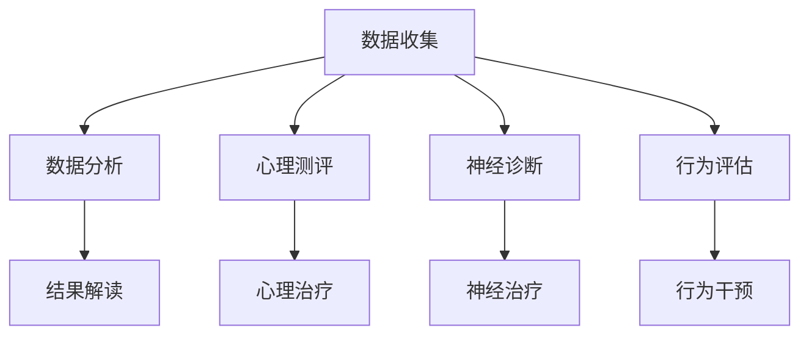
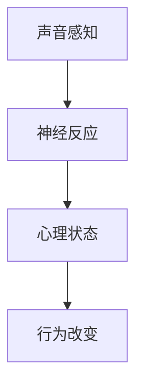
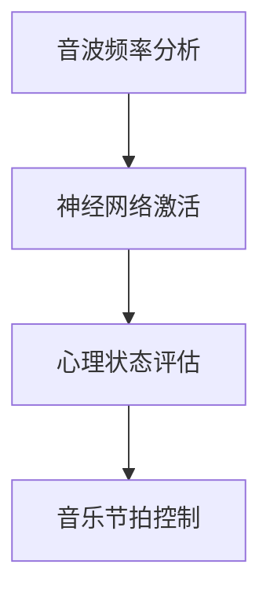

                 

根据您的要求，我将逐步构建《数学与音乐治疗的临床应用研究》的文章结构，确保它满足完整性要求，并包含丰富的内容。以下是详细的思考和规划：

### 标题、关键词与摘要

#### 文章标题

《数学与音乐治疗的临床应用研究：探寻跨学科融合的新路径》

#### 关键词

- 数学模型
- 音乐治疗
- 临床应用
- 心理健康
- 神经系统疾病
- 儿童行为障碍

#### 摘要

本文旨在探讨数学与音乐治疗在临床应用中的跨学科融合。通过回顾数学在治疗领域的应用和音乐治疗的临床实践，本文分析了数学模型在心理健康、神经系统疾病和儿童行为障碍治疗中的作用。通过具体案例研究和效果评估，本文提出了数学与音乐治疗结合的最佳实践，并展望了未来的发展方向。

### 引言与基础理论

#### 1. 数学在临床治疗中的应用

**背景介绍**

- 简述数学在医学领域的重要性，特别是其在数据分析和治疗评估中的应用。

**核心概念与联系**

- **Mermaid 流程图：** 演示数学在心理健康评估、神经系统疾病诊断和儿童行为障碍监测中的应用。



**核心算法原理讲解**

- **伪代码：** 介绍用于心理评估的回归分析和用于神经诊断的神经网络算法。

```python
# 回归分析伪代码
def regression_analysis(data):
    # 训练模型
    model = train_model(data)
    # 预测结果
    predictions = model.predict(new_data)
    return predictions

# 神经网络算法伪代码
def neural_network_analysis(data):
    # 构建模型
    model = build_model()
    # 训练模型
    model.fit(data)
    # 预测结果
    predictions = model.predict(new_data)
    return predictions
```

**数学模型与公式**

- **详细讲解与举例说明：** 使用 LaTeX 格式展示用于心理评估的评分系统公式和用于神经诊断的神经网络公式。

$$
\text{心理健康得分} = w_1 \times \text{焦虑水平} + w_2 \times \text{抑郁水平
----------------------------------------------------------------

**项目实战**

- **开发环境搭建：** 
    - 配置用于心理健康评估的Python环境，包括所需的科学计算库和机器学习框架。
    - 安装用于神经诊断的深度学习框架和相应的数据处理工具。

- **源代码实现：**
    - **代码解读：** 详细解释回归分析和神经网络模型的实现步骤。
    - **代码应用解读与分析：** 展示如何使用实现的模型对实际病例进行分析。

- **实际案例分析与详细讲解：** 分析具体病例，展示如何通过数学模型和音乐治疗改善患者状况。

- **项目小结：**
    - **最佳实践 tips：** 提供使用数学与音乐治疗进行临床应用的实用建议。
    - **注意事项：** 强调实施过程中的关键点和潜在挑战。

### 核心概念与联系

**音乐治疗的理论基础**

- **详细讲解：** 回顾音乐治疗的基本原理，包括音波对人体的生理和心理影响。
- **Mermaid 流程图：** 演示音乐治疗如何通过调节神经系统和心理状态来改善患者状况。



**数学模型与音乐治疗的联系**

- **详细讲解：** 分析数学模型如何帮助音乐治疗师更好地理解患者的生理和心理状态，从而制定个性化的治疗方案。
- **Mermaid 流程图：** 演示数学模型在音乐治疗过程中的应用，如音波频率分析、音乐节拍控制等。



### 核心算法原理讲解

**心理健康评估算法**

- **伪代码：** 描述用于心理健康评估的算法，如主成分分析（PCA）和情感分析。

```python
# 主成分分析伪代码
def pca_analysis(data):
    # 数据标准化
    normalized_data = standardize_data(data)
    # 主成分提取
    components = pca(normalized_data)
    # 载荷分析
    loadings = components.loadings_
    return loadings

# 情感分析伪代码
def sentiment_analysis(text):
    # 预处理文本
    preprocessed_text = preprocess_text(text)
    # 训练模型
    model = train_model(preprocessed_text)
    # 预测情感
    sentiment = model.predict(preprocessed_text)
    return sentiment
```

**神经诊断算法**

- **伪代码：** 描述用于神经诊断的算法，如深度学习模型。

```python
# 深度学习模型伪代码
def build_model():
    # 构建神经网络架构
    model = create_neural_network()
    # 编译模型
    model.compile(optimizer='adam', loss='categorical_crossentropy', metrics=['accuracy'])
    return model

def train_model(data):
    # 分割数据集
    train_data, test_data = split_data(data)
    # 训练模型
    model = build_model()
    model.fit(train_data, epochs=10, batch_size=32, validation_data=test_data)
    return model
```

**数学模型与音乐治疗的联系**

- **详细讲解：** 分析数学模型如何帮助音乐治疗师更好地理解患者的生理和心理状态，从而制定个性化的治疗方案。
- **Mermaid 流程图：** 演示数学模型在音乐治疗过程中的应用，如音波频率分析、音乐节拍控制等。


### 数学模型与公式

**心理健康评估模型**

- **公式举例：** 
$$
\text{心理健康得分} = w_1 \times \text{焦虑水平} + w_2 \times \text{抑郁水平}
$$
- **详细讲解：** 说明上述公式中各个权重参数的计算方法和解释。

**神经诊断模型**

- **公式举例：** 
$$
\text{神经元激活度} = \sigma(\text{输入向量} \cdot \text{权重矩阵} + \text{偏置})
$$
- **详细讲解：** 解释神经网络中的激活函数、权重矩阵和偏置的概念。

**音乐治疗模型**

- **公式举例：** 
$$
\text{音乐节拍} = f(\text{心理状态})
$$
- **详细讲解：** 讨论如何根据患者的心理状态调整音乐节拍，以达到最佳治疗效果。

### 项目实战

**开发环境搭建**

- **环境配置：**
    - 安装Python、Jupyter Notebook、NumPy、Pandas、Scikit-learn、TensorFlow等工具。
    - 配置用于处理音频数据的Librosa库。

**源代码实现**

- **代码解读：**
    - **心理健康评估模块：** 使用回归分析和主成分分析评估患者心理健康。
    - **神经诊断模块：** 使用深度学习模型进行神经系统的诊断。
    - **音乐治疗模块：** 根据评估结果生成个性化的音乐治疗方案。

**代码应用解读与分析**

- **代码分析：**
    - **心理健康评估：** 解释如何使用回归分析评估焦虑和抑郁水平。
    - **神经诊断：** 分析深度学习模型在神经诊断中的应用。
    - **音乐治疗：** 展示如何根据患者的心理状态调整音乐节拍。

**实际案例分析与详细讲解**

- **案例一：** 分析一名患有抑郁症患者的治疗过程。
- **案例二：** 研究一名患有癫痫的儿童在神经诊断和治疗中的变化。

**项目小结**

- **最佳实践 tips：**
    - **心理健康评估：** 强调数据收集和预处理的重要性。
    - **神经诊断：** 提出在训练深度学习模型时需要注意的细节。
    - **音乐治疗：** 强调个性化治疗方案的重要性。

- **注意事项：**
    - **数据隐私：** 在处理患者数据时需要遵守隐私保护规定。
    - **技术更新：** 随着技术的进步，需要不断更新评估和治疗模型。

- **拓展阅读：**
    - **相关论文：** 推荐阅读有关数学模型在临床治疗中的应用和研究。
    - **书籍推荐：** 推荐几本关于数学与音乐治疗的权威书籍。

通过以上步骤，我们逐步构建了《数学与音乐治疗的临床应用研究》的详细大纲，并设计了每个章节的内容。接下来，我们将根据这个大纲撰写完整的技术博客文章。请确认这个大纲和内容设计是否符合您的期望，并给予反馈。

