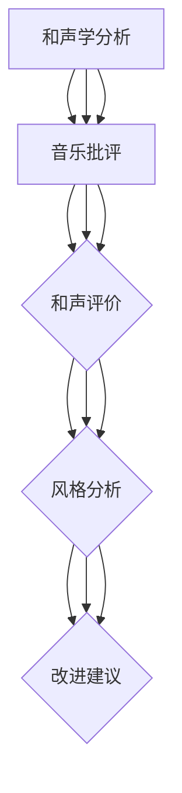

                 

### 第1章 引言与背景

#### 1.1 研究目的与意义

数学与音乐理论作为两门看似迥异的学科，其实有着深刻的内在联系。在数学领域中，集合论、抽象代数、欧几里得几何以及笛卡尔坐标等概念，为我们提供了分析复杂系统的工具。而在音乐理论中，和声学则是研究音高、节奏、和弦以及旋律等音乐元素及其关系的学科。近年来，随着计算机技术的发展，数学与音乐理论的结合逐渐成为了一个研究热点，尤其是在音乐创作、音乐分析和音乐欣赏等领域的应用。

本文旨在探讨数学与音乐理论的和声学分析，通过数学方法对音乐作品进行深入分析，揭示音乐作品中的和声结构和音乐特征。研究的目的在于：

1. 深化对数学与音乐理论之间关系的理解，揭示其内在联系。
2. 提供一套系统的方法论，用于音乐作品的和声学分析。
3. 促进音乐创作和音乐分析技术的发展，提高音乐作品的艺术表现力。

#### 1.2 数学与音乐理论的关系

数学与音乐理论之间的联系可以追溯到古代。例如，毕达哥拉斯学派认为音乐与数学密切相关，他们通过数学研究发现了音程的比例关系，提出了音阶的划分方法。在现代，这种联系得到了进一步的发展：

- **集合论与音高关系**：在音乐理论中，音高可以被看作是一组频率的集合。集合论为研究音高的集合提供了数学工具。
- **抽象代数与和弦关系**：和弦是由多个音高组合而成的，其结构可以用抽象代数的方法进行描述和分析。
- **欧几里得几何与音乐空间**：音乐作品中的旋律和和弦可以看作是在一个多维空间中的运动轨迹，欧几里得几何提供了研究这种空间关系的数学框架。
- **笛卡尔坐标与音高表示**：笛卡尔坐标系统可以用来表示音高，使得音乐作品的分析更加直观和精确。

#### 1.3 和声学分析的历史与发展

和声学分析的历史可以追溯到文艺复兴时期。当时，音乐家们开始尝试用数学方法来描述和分析音乐作品中的和声结构。例如，约翰·凯瑟·库珀曼（Johann Kirnberger）在其著作《和声学基础》（"Grundlage der Harmonielehre"）中，提出了和声结构的基本原则。

随着时代的发展，和声学分析的方法逐渐成熟。19世纪末，理查德·瓦格纳（Richard Wagner）提出了“总体音乐”理论，试图将音乐、戏剧和视觉艺术融合在一起。这一理论强调了音乐作品的整体性和层次性，对和声学分析产生了深远影响。

在20世纪，随着计算机技术的发展，和声学分析进入了一个新的阶段。音乐信号处理技术使得对音乐作品进行定量分析成为可能。例如，傅里叶变换和马尔可夫模型等数学工具被广泛应用于音乐分析领域。

近年来，随着人工智能技术的进步，和声学分析变得更加智能和高效。通过机器学习算法，计算机可以自动识别和弦、分析音乐结构和预测音乐风格等。这些技术的发展，为音乐创作、音乐教育和音乐欣赏带来了新的机遇。

### 第2章 数学基础

在探讨数学与音乐理论的结合时，了解数学的基本概念和工具是至关重要的。本章将介绍集合论、抽象代数以及欧几里得几何和笛卡尔坐标等数学基础，为后续章节的讨论奠定基础。

#### 2.1 集合论与抽象代数

##### 2.1.1 集合论基础

集合论是数学的基石之一，它研究对象的集合以及集合之间的关系。在音乐理论中，集合论可以用来描述音高的集合和和弦的构成。

- **定义**：集合是某些确定对象的总体，这些对象被称为集合的元素。用大写字母表示集合，小写字母表示集合的元素。例如，\(A = \{1, 2, 3\}\)，其中1、2、3是集合\(A\)的元素。
- **集合的表示**：集合可以用列举法或描述法表示。列举法是直接列出所有元素，如\(\{1, 2, 3\}\)；描述法则是用条件语句来描述元素的性质，如\(\{x \mid x \text{ 是自然数}\}\)。
- **集合的基本操作**：并集、交集、补集和子集等是集合的基本操作。并集表示两个集合中所有元素的集合，交集表示两个集合中共有的元素集合，补集表示不属于某个集合的元素集合，子集表示一个集合是另一个集合的元素。

在音乐理论中，音高的集合可以表示为音阶，例如，C大调音阶可以表示为\(\{C, D, E, F, G, A, B\}\)。和弦则是多个音高的组合，如C大调的三和弦可以表示为\(\{C, E, G\}\)。

##### 2.1.2 抽象代数基础

抽象代数研究在特定规则下操作的集合。在音乐理论中，抽象代数可以用来研究和弦的加法、减法以及乘法等运算。

- **定义**：抽象代数包括群、环和域等结构。群是一个集合，其中元素之间满足结合律、单位元和逆元等性质；环是包含加法和乘法运算的集合，满足结合律、分配律等性质；域是包含有限多个元素的环，满足乘法的交换律和分配律。
- **群的基本性质**：群中的元素可以表示为向量的加法，例如，和弦的加法满足群的性质，即对于任意两个和弦\(A\)和\(B\)，它们的和\(A + B\)也是一个和弦。
- **环与域的应用**：环和域可以用来研究和弦的乘法和除法。例如，在和弦的扩展和缩小过程中，环和域的概念可以帮助我们理解和弦的变化规律。

#### 2.2 欧几里得几何与笛卡尔坐标

##### 2.2.1 欧几里得几何基础

欧几里得几何是研究平面和空间中点的位置、线的关系和角度的几何学。在音乐理论中，欧几里得几何可以帮助我们理解旋律和和弦的几何结构。

- **定义**：欧几里得几何中的基本概念包括点、线、面和角度。点是有位置但没有大小的几何对象；线是由无限多个点组成的几何对象；面是平面上的点集；角度是由两条射线共同确定的几何对象。
- **欧几里得几何的基本性质**：欧几里得几何中的线段、角和圆等概念都可以用来描述音乐作品中的旋律和和弦。例如，旋律可以看作是在时间轴上移动的音高点，和弦可以看作是在空间中固定的音高集合。

##### 2.2.2 笛卡尔坐标系统

笛卡尔坐标系统是一种用来表示点在平面或空间中的位置的方法。在音乐理论中，笛卡尔坐标系统可以帮助我们直观地表示音高和旋律。

- **定义**：笛卡尔坐标系统由两条相互垂直的数轴组成，通常称为x轴和y轴。一个点的坐标由其在x轴和y轴上的位置决定。
- **笛卡尔坐标的应用**：在音乐理论中，音高可以用频率（Hz）来表示，而频率可以在笛卡尔坐标系统中表示为点。例如，C音的频率为261.63 Hz，可以在笛卡尔坐标系统中表示为点(261.63, 0)。旋律可以看作是在时间轴上移动的点，其坐标随时间变化。

通过本章对数学基础的了解，我们可以更好地理解音乐作品中的和声结构和音乐特征，为后续章节的深入讨论提供理论基础。

#### 2.1.1 集合论基础

集合论作为数学的基础分支，在音乐理论中有着广泛的应用。集合论通过定义、表示和基本操作等方法，为我们提供了描述和操作音乐元素的工具。

**定义**：

集合是由确定的、互不相同的对象构成的整体。这些对象称为集合的元素。集合通常用大写字母表示，如\(A, B, C\)等，而元素用小写字母表示，如\(a, b, c\)等。例如，集合\(A = \{1, 2, 3\}\)表示包含元素1、2和3的集合。

**集合的表示**：

集合可以通过列举法或描述法来表示。

- **列举法**：直接列出集合的所有元素，用花括号{}包围。例如，\(\{1, 2, 3\}\)表示包含1、2和3的集合。
- **描述法**：用条件语句来描述集合中元素的性质。例如，\(\{x \mid x \text{ 是自然数}\}\)表示所有自然数的集合。

**集合的基本操作**：

集合的基本操作包括并集、交集、补集和子集等。

- **并集（Union）**：两个集合A和B的并集包含所有属于A或属于B的元素。用符号\(A \cup B\)表示。例如，\(\{1, 2, 3\} \cup \{4, 5\} = \{1, 2, 3, 4, 5\}\)。
- **交集（Intersection）**：两个集合A和B的交集包含所有既属于A又属于B的元素。用符号\(A \cap B\)表示。例如，\(\{1, 2, 3\} \cap \{4, 5\} = \emptyset\)（空集）。
- **补集（Complement）**：集合A的补集包含所有不属于A的元素。用符号\(A'\)或\(U \setminus A\)（其中U是全集）表示。例如，如果U是所有自然数的集合，则\(\{1, 2, 3\}' = \{x \mid x \text{ 不是自然数}\}\)。
- **子集（Subset）**：如果集合A中的所有元素都是集合B的元素，则称A是B的子集。用符号\(A \subseteq B\)表示。例如，\(\{1, 2\} \subseteq \{1, 2, 3\}\)。

**在音乐理论中的应用**：

在音乐理论中，集合论可以帮助我们描述和操作音乐元素。

- **音高的集合**：音高可以看作是一个集合，其中每个元素代表一个特定的音高。例如，C大调音阶可以表示为集合\(\{C, D, E, F, G, A, B\}\)。
- **和弦的表示**：和弦是由多个音高组成的集合。例如，C大调的三和弦可以表示为集合\(\{C, E, G\}\)。
- **和声的分析**：集合论的基本操作（如并集、交集等）可以用来分析音乐作品中的和声结构。例如，通过交集操作可以找出两个和弦中共有的音高，从而分析其和声关系。

**举例说明**：

假设有两个和弦A（\{C, E, G\}）和B（\{D, F, A\}），我们可以用集合论的方法来分析它们的关系。

- **并集**：\(A \cup B = \{C, D, E, F, G, A\}\)，表示A和B中所有音高的并集。
- **交集**：\(A \cap B = \emptyset\)，表示A和B没有共有的音高。
- **补集**：\(A' = \{x \mid x \text{ 不是 } C, E, G\}\)，表示不属于和弦A的音高。
- **子集**：\(A \subseteq A \cup B\)，表示A是A和B的并集的子集。

通过上述集合论的基本概念和操作，我们可以更有效地描述和分析音乐作品中的和声结构，为后续的数学和声学分析打下基础。

#### 2.1.2 抽象代数基础

抽象代数是研究代数结构的数学分支，包括群、环和域等。在音乐理论中，抽象代数可以用来描述和弦的运算和变换，从而帮助我们理解音乐的和谐性和结构。

**定义**：

- **群（Group）**：群是一个集合，其中的元素通过一个二元运算组合，这个运算满足结合律、单位元和逆元等性质。形式化地，群\(G\)是由一个集合和运算\(\circ\)组成，对于任意的\(a, b \in G\)，运算\(\circ\)满足以下性质：
  - **结合律**：\((a \circ b) \circ c = a \circ (b \circ c)\)。
  - **单位元**：存在一个元素\(e \in G\)，使得对任意的\(a \in G\)，有\(e \circ a = a \circ e = a\)。
  - **逆元**：对于任意的\(a \in G\)，存在一个元素\(a^{-1} \in G\)，使得\(a \circ a^{-1} = a^{-1} \circ a = e\)。

- **环（Ring）**：环是一个集合，其中包含加法和乘法运算，并且运算满足结合律、分配律等性质。形式化地，环\(R\)是由一个集合和两个运算\(+\)和\(\times\)组成，对于任意的\(a, b, c \in R\)，运算\(+\)和\(\times\)满足以下性质：
  - **加法结合律**：\((a + b) + c = a + (b + c)\)。
  - **乘法结合律**：\((a \times b) \times c = a \times (b \times c)\)。
  - **分配律**：\(a \times (b + c) = (a \times b) + (a \times c)\)。
  - **加法单位元**：存在一个元素\(0 \in R\)，使得对任意的\(a \in R\)，有\(0 + a = a + 0 = a\)。
  - **乘法单位元**：存在一个元素\(1 \in R\)（如果存在的话），使得对任意的\(a \in R\)，有\(1 \times a = a \times 1 = a\)。

- **域（Field）**：域是一个环，其中的所有非零元素关于乘法运算构成一个群。形式化地，域\(F\)是由一个集合和两个运算\(+\)和\(\times\)组成，对于任意的\(a, b, c \in F\)（\(a \neq 0\)），运算\(+\)和\(\times\)满足以下性质：
  - **加法结合律**、**乘法结合律**和**分配律**与环相同。
  - **乘法单位元**：存在一个元素\(1 \in F\)。
  - **乘法逆元**：对于任意的非零元素\(a \in F\)，存在一个元素\(a^{-1} \in F\)，使得\(a \times a^{-1} = a^{-1} \times a = 1\)。

**在音乐理论中的应用**：

- **和弦的加法与减法**：在音乐理论中，和弦可以通过加法和减法进行组合和变换。例如，两个和弦\(A = \{C, E, G\}\)和\(B = \{D, F, A\}\)的和可以表示为\(A + B = \{C, D, E, F, G, A\}\)，而它们的差可以表示为\(A - B = \{C, E, G\} - \{D, F, A\} = \{C, E, G\}\)。

- **和弦的扩展与缩小**：通过抽象代数的概念，我们可以将和弦看作一个环或域中的元素，从而进行扩展和缩小操作。例如，扩展一个和弦可以通过将其中的音高增加一个八度来实现，而缩小一个和弦可以通过将其中的音高降低一个八度来实现。

- **和弦的变换**：抽象代数的概念可以用来描述和弦之间的变换关系。例如，通过群的概念，我们可以描述和弦的旋转和反射等变换。

**举例说明**：

假设有两个和弦\(A = \{C, E, G\}\)和\(B = \{D, F, A\}\)，我们可以用抽象代数的方法来分析它们的关系。

- **加法**：\(A + B = \{C, D, E, F, G, A\}\)，表示A和B中所有音高的并集。
- **减法**：\(A - B = \{C, E, G\}\)，表示A和B中相同的音高。
- **扩展**：\(A + 12 = \{C, E, G, C, E, G\}\)，表示A和弦扩展一个八度。
- **缩小**：\(A - 12 = \{C, E, G\}\)，表示A和弦缩小一个八度。

通过抽象代数的方法，我们可以更深入地理解音乐作品中的和声结构，为后续的数学和声学分析提供理论基础。

#### 2.2.1 欧几里得几何基础

欧几里得几何是研究平面和空间中点的位置、线的关系和角度的几何学。在音乐理论中，欧几里得几何可以帮助我们理解旋律和和弦的几何结构，进而揭示音乐作品的空间特性。

**定义**：

- **点**：点是欧几里得几何中最基本的元素，它是没有大小和形状的几何对象，仅表示位置。
- **线**：线是由无限多个点组成的几何对象，它具有长度但没有宽度。
- **面**：面是由无限多个点组成的平面区域，它具有长度和宽度。
- **角**：角是由两条射线共同确定的几何对象，其大小由两条射线的夹角决定。

**基本性质**：

- **线段**：线段是连接两个点的最短路径，它具有长度但没有宽度。线段的长度可以通过勾股定理等几何公式进行计算。
- **角度**：角度是用来度量两条射线之间的夹角的大小。在欧几里得几何中，角度可以用度或弧度进行度量。一个直角等于90度或π/2弧度。
- **圆**：圆是由一条封闭曲线围成的平面区域，该曲线上的所有点与一个固定点（圆心）的距离相等。圆的半径和直径是描述圆大小的几何量。

**在音乐理论中的应用**：

- **旋律的空间表示**：旋律可以看作是在时间轴上移动的音高点。通过欧几里得几何的概念，我们可以将旋律视为在空间中的点集，每个点代表一个特定的时间点上的音高。这样，旋律的几何结构可以用来描述旋律的节奏和音高变化。
- **和弦的几何结构**：和弦可以看作是在空间中固定的音高集合。通过欧几里得几何的概念，我们可以将和弦视为在空间中的点集，其中每个点代表和弦中的一个音高。这样，和弦的几何结构可以用来描述和弦的和声关系和空间分布。

**举例说明**：

假设有一个C大调音阶的旋律，音高分别为C、D、E、F、G、A、B，每个音高在时间轴上的位置如下：

- \(C\)在时间点\(t_1\)
- \(D\)在时间点\(t_2\)
- \(E\)在时间点\(t_3\)
- \(F\)在时间点\(t_4\)
- \(G\)在时间点\(t_5\)
- \(A\)在时间点\(t_6\)
- \(B\)在时间点\(t_7\)

我们可以用欧几里得几何的概念来描述这个旋律的几何结构：

- \(C\)点在时间轴上的位置为\(t_1\)
- \(D\)点在时间轴上的位置为\(t_2\)
- \(E\)点在时间轴上的位置为\(t_3\)
- \(F\)点在时间轴上的位置为\(t_4\)
- \(G\)点在时间轴上的位置为\(t_5\)
- \(A\)点在时间轴上的位置为\(t_6\)
- \(B\)点在时间轴上的位置为\(t_7\)

通过这种方式，我们可以将旋律视为一个点集，其中每个点代表旋律中的一个音高，并位于特定的时间点上。这样的几何结构可以帮助我们更直观地理解旋律的节奏和音高变化。

类似地，我们可以用欧几里得几何的概念来描述和弦的几何结构。例如，一个C大调的三和弦可以表示为点集\(\{C, E, G\}\)，其中每个点代表和弦中的一个音高。通过计算这些点之间的距离和角度，我们可以分析和弦的和声关系和空间分布。

通过本章对欧几里得几何基础的了解，我们可以将音乐理论中的旋律和和弦视为具有几何结构的空间对象，为后续的数学和声学分析提供理论基础。

#### 2.2.2 笛卡尔坐标系统

笛卡尔坐标系统是一种用于表示点在二维或三维空间中的位置的方法。在音乐理论中，笛卡尔坐标系统可以帮助我们直观地表示音高和旋律，从而更好地理解音乐作品的几何结构。

**定义**：

- **笛卡尔坐标系统**：笛卡尔坐标系统由两条相互垂直的数轴组成，通常称为x轴和y轴。一个点的坐标由它在x轴和y轴上的位置决定。在二维空间中，点的坐标通常表示为\( (x, y) \)，其中x表示在x轴上的位置，y表示在y轴上的位置。

- **直角坐标系**：笛卡尔坐标系统也称为直角坐标系，因为它形成了一个直角。直角坐标系中的点可以通过其x和y坐标唯一确定。

- **坐标系的原点**：坐标系的原点是x轴和y轴的交点，通常表示为\( (0, 0) \)。

**坐标表示法**：

- **二维空间**：在二维空间中，一个点的坐标表示为\( (x, y) \)。例如，点\( (2, 3) \)表示在x轴上的位置为2，在y轴上的位置为3。
- **三维空间**：在三维空间中，一个点的坐标表示为\( (x, y, z) \)。例如，点\( (1, 2, 3) \)表示在x轴上的位置为1，在y轴上的位置为2，在z轴上的位置为3。

**在音乐理论中的应用**：

- **音高的表示**：音高可以在笛卡尔坐标系统中表示为点。例如，C音的频率为261.63 Hz，可以在笛卡尔坐标系统中表示为点\( (261.63, 0) \)，其中x坐标表示频率，y坐标为0。

- **旋律的表示**：旋律可以看作是在时间轴上移动的音高点。通过笛卡尔坐标系统，我们可以将旋律视为一系列点的集合，其中每个点代表旋律中的一个音高，并在特定的时间点上。例如，C大调音阶可以表示为点集\( \{(261.63, 0), (293.66, 1), (329.63, 2), ..., (392.00, 4)\} \)，其中每个点的x坐标表示频率，y坐标表示时间。

- **和弦的表示**：和弦可以看作是在空间中固定的音高集合。通过笛卡尔坐标系统，我们可以将和弦视为一系列点的集合，其中每个点代表和弦中的一个音高。例如，C大调的三和弦可以表示为点集\( \{(261.63, 0), (330.00, 0), (392.00, 0)\} \)，其中每个点的x坐标表示频率，y坐标为0。

**举例说明**：

假设有一个C大调音阶的旋律，音高分别为C、D、E、F、G、A、B，每个音高在时间轴上的位置如下：

- \(C\)在时间点\(0\)
- \(D\)在时间点\(1\)
- \(E\)在时间点\(2\)
- \(F\)在时间点\(3\)
- \(G\)在时间点\(4\)
- \(A\)在时间点\(5\)
- \(B\)在时间点\(6\)

我们可以用笛卡尔坐标系统来表示这个旋律：

- \(C\)点在坐标\( (261.63, 0) \)
- \(D\)点在坐标\( (293.66, 1) \)
- \(E\)点在坐标\( (329.63, 2) \)
- \(F\)点在坐标\( (349.23, 3) \)
- \(G\)点在坐标\( (392.00, 4) \)
- \(A\)点在坐标\( (440.00, 5) \)
- \(B\)点在坐标\( (466.16, 6) \)

通过这种方式，我们可以将旋律视为一个点集，其中每个点代表旋律中的一个音高，并位于特定的时间点上。这样的几何结构可以帮助我们更直观地理解旋律的节奏和音高变化。

类似地，我们可以用笛卡尔坐标系统来表示和弦的几何结构。例如，一个C大调的三和弦可以表示为点集\( \{(261.63, 0), (330.00, 0), (392.00, 0)\} \)，其中每个点的x坐标表示频率，y坐标为0。

通过本章对笛卡尔坐标系统的了解，我们可以将音乐理论中的音高和旋律视为具有几何结构的空间对象，从而更好地理解和分析音乐作品。

### 第3章 音乐理论基础

音乐理论是研究音乐元素及其关系的学科，包括音高、节奏、音色、音阶和和弦等。本章将详细探讨这些音乐元素的基本概念和和声理论，为后续的数学和声学分析提供理论基础。

#### 3.1 音乐元素

音乐元素是构成音乐的基本要素，包括音高、节奏和音色等。

**音高（Pitch）**：

音高是音乐中最基本的元素之一，它决定了音乐的主观感觉。音高通常用频率（Hz）来表示，频率越高，音高越高。例如，C音的频率大约为261.63 Hz。在音乐理论中，音高可以通过音阶来表示。

**节奏（Rhythm）**：

节奏是音乐的时间结构，它决定了音乐的速度、强度和动态。节奏通常用节拍（Beat）来表示，节拍是音乐中的基本时间单位。常见的节奏模式包括二分音符、四分音符、八分音符等。

**音色（Timbre）**：

音色是音乐中的质感，它使得不同的乐器或声音具有独特的声音特征。音色由声音的频谱决定，不同的频谱成分会给人不同的音色感受。

**音阶（Scale）**：

音阶是由一组音高按特定顺序排列而成的。常见的音阶包括大调音阶和小调音阶。大调音阶通常是明亮和欢快的，而小调音阶则通常更加忧郁和柔和。

**和弦（Chord）**：

和弦是由多个音高按特定方式组合而成的。常见的和弦包括三和弦、七和弦和扩展和弦等。和弦在音乐中起到和声支持和旋律构建的作用。

#### 3.2 音阶与和弦

**音阶**：

音阶是音乐中最基本的和声结构，它由一组音高按特定顺序排列而成。最常见的音阶是大调音阶和小调音阶。

- **大调音阶**：大调音阶通常由7个音高组成，顺序为全音、全音、半音、全音、全音、全音和半音。例如，C大调音阶为\(C, D, E, F, G, A, B\)。
- **小调音阶**：小调音阶通常由7个音高组成，顺序为全音、半音、全音、全音、半音、全音和全音。例如，A小调音阶为\(A, B, C, D, E, F, G\)。

**和弦**：

和弦是由三个或更多音高按特定方式组合而成的和声结构。常见的和弦包括三和弦、七和弦和扩展和弦等。

- **三和弦**：三和弦由三个音高组成，通常是最简单的和弦类型。例如，C大调的三和弦为\(C, E, G\)。
- **七和弦**：七和弦由四个音高组成，比三和弦更加复杂和丰富。例如，C大调的七和弦为\(C, E, G, B\)。
- **扩展和弦**：扩展和弦是在基本和弦基础上增加音高而形成的。例如，C大调的扩展和弦可以是\(C, E, G, B, D\)。

#### 3.3 和声理论

和声理论是研究音乐中和弦和旋律之间关系的学科。和声理论包括和弦的构成、和弦的功能和和弦的变换等。

**和弦的构成**：

和弦的构成是基于音阶的。例如，C大调的三和弦由C、E和G三个音高组成，这三个音高分别位于C大调音阶的第1、3和5个音高上。

**和弦的功能**：

和弦的功能决定了其在音乐中的作用。常见的和弦功能包括主和弦、下属和弦和属和弦等。

- **主和弦**：主和弦是音乐中的基础和弦，通常在乐曲的开始和结束时使用。主和弦通常由C大调音阶的第1、3和5个音高组成。
- **下属和弦**：下属和弦是音乐中的一个重要和弦，它在主和弦之前出现，通常用来强调主和弦。下属和弦通常由C大调音阶的第4、6和1个音高组成。
- **属和弦**：属和弦是音乐中的另一个重要和弦，它在主和弦之后出现，通常用来引导乐曲回到主和弦。属和弦通常由C大调音阶的第5、7和2个音高组成。

**和弦的变换**：

和弦的变换是指和弦在不同音阶或调性中的变化。常见的和弦变换包括大小变换、升降变换和扩展变换等。

- **大小变换**：大小变换是指和弦的音高从大调音阶变换到小调音阶。例如，C大调的三和弦可以变换为A小调的三和弦。
- **升降变换**：升降变换是指和弦的音高在升调和降调之间变换。例如，C大调的三和弦可以变换为D小调的三和弦。
- **扩展变换**：扩展变换是指和弦的音高在基本和弦基础上增加或减少音高。例如，C大调的三和弦可以扩展为七和弦或扩展和弦。

通过本章对音乐理论基础的了解，我们可以更好地理解音乐作品中的和声结构和音乐特征，为后续的数学和声学分析提供理论基础。

#### 3.2.1 和声结构

和声结构是音乐作品的核心元素之一，它决定了音乐的情感表达和和声效果。和声结构由和弦的构成和和弦之间的关系组成，是音乐创作和音乐分析的重要组成部分。

**和弦的构成**：

和弦是由三个或更多音高按特定方式组合而成的和声结构。常见的和弦包括三和弦、七和弦和扩展和弦等。

- **三和弦**：三和弦是最基本的和弦类型，由三个音高组成。例如，C大调的三和弦由C、E和G三个音高构成，分别对应音阶中的第1、3和5个音高。
- **七和弦**：七和弦由四个音高组成，比三和弦更加复杂和丰富。常见的七和弦包括大七和弦、小七和弦和增大七和弦等。例如，C大调的大七和弦由C、E、G、B四个音高构成。
- **扩展和弦**：扩展和弦是在基本和弦基础上增加音高而形成的。常见的扩展和弦包括九和弦、十一和弦和十三和弦等。例如，C大调的九和弦由C、E、G、B、D五个音高构成。

**和弦之间的关系**：

和弦之间的关系是音乐作品和声结构的重要组成部分。和弦之间的关系可以通过音高、和弦功能和调性等概念来描述。

- **音高关系**：和弦之间的音高关系决定了它们的和声效果。例如，C大调的三和弦和G大调的三和弦在音高上有相似之处，但它们在调性上有所不同。
- **和弦功能**：和弦功能是指和弦在音乐中的作用和意义。常见的和弦功能包括主和弦、下属和弦和属和弦等。主和弦是音乐中的基础和弦，通常在乐曲的开始和结束时使用；下属和弦在主和弦之前出现，用来强调主和弦；属和弦在主和弦之后出现，用来引导乐曲回到主和弦。
- **调性关系**：调性关系是指和弦在不同调性中的变化。例如，C大调的音阶和G大调的音阶在音高上有一定的相似性，但它们在调性上有所不同。

**和声结构的分析**：

和声结构分析是音乐分析的重要环节，它可以帮助我们理解音乐作品的结构和情感表达。和声结构分析包括以下几个方面：

- **和弦识别**：通过识别和弦的音高和功能，可以分析音乐作品中的和声结构。
- **和弦关系分析**：通过分析和弦之间的关系，可以理解音乐作品中的和声发展和变化。
- **调性分析**：通过分析音乐作品的调性，可以了解音乐作品的情感色彩和结构。

**举例说明**：

假设我们有一个C大调的旋律，旋律中的和弦如下：

- 第一小节：C大调的三和弦（C、E、G）
- 第二小节：G大调的三和弦（G、B、D）
- 第三小节：F大调的三和弦（F、A、C）

通过分析这些和弦，我们可以得出以下结论：

- 第一小节的和弦是主和弦，因为它符合C大调音阶的音高和功能。
- 第二小节的和弦是下属和弦，因为它出现在主和弦之前，用来强调主和弦。
- 第三小节的和弦是过渡和弦，因为它出现在主和弦之后，用来引导乐曲回到主和弦。

通过这种分析，我们可以更好地理解音乐作品中的和声结构和情感表达。

通过本章对和声结构的介绍，我们可以更深入地理解音乐作品中的和声关系，为后续的数学和声学分析提供理论基础。

#### 3.2.2 和弦功能与调性

和弦功能与调性是和声理论中的两个核心概念，它们在音乐创作、分析和欣赏中起着至关重要的作用。理解这些概念有助于我们深入挖掘音乐作品的内在结构和情感表达。

**和弦功能**：

和弦功能是指和弦在音乐中的作用和意义。和弦功能通常基于和声学中的主和弦（Tonic）、下属和弦（Subdominant）和属和弦（Dominant）三种基本类型。

- **主和弦（Tonic）**：主和弦是音乐作品中的基础和弦，它通常在乐曲的开始、结束或重要部分出现。主和弦与调性紧密相关，其音高通常与调性的第I级音（即主音）相对应。例如，在C大调中，主和弦是C大调三和弦（C、E、G）。

- **下属和弦（Subdominant）**：下属和弦通常位于主和弦之前，起到强调主和弦的作用。下属和弦与调性的第IV级音相对应。例如，在C大调中，下属和弦是F大调三和弦（F、A、C）。

- **属和弦（Dominant）**：属和弦位于主和弦之后，起到引导乐曲回到主和弦的作用。属和弦与调性的第V级音相对应。例如，在C大调中，属和弦是G大调三和弦（G、B、D）。

这些和弦功能在音乐创作和演奏中有着广泛的运用，它们不仅影响音乐的和谐性，也决定了音乐的情感走向。

**调性**：

调性是指音乐作品的中心音高，通常由主音（Tonic）决定。调性决定了音乐作品的风格、情感和听觉体验。常见的调性包括大调（Major）和小调（Minor）。

- **大调**：大调通常给人一种明亮、欢快的感觉。大调音阶由7个音高组成，音阶中的第I、III和V级音形成大三和弦，而第II、IV和VI级音形成小三和弦。例如，C大调音阶为C、D、E、F、G、A、B。

- **小调**：小调通常给人一种忧郁、柔和的感觉。小调音阶同样由7个音高组成，但音阶中的第I、III和VI级音形成小三和弦，而第II、IV和VII级音形成大三和弦。例如，A小调音阶为A、B、C、D、E、F、G。

**和弦功能与调性的关系**：

和弦功能与调性密切相关，它们共同构成了音乐作品的和声基础。

- **主和弦与调性**：主和弦是调性的核心，它决定了音乐作品的调性中心。在乐曲的开始和结束部分，通常会出现主和弦，以此来确认调性。
- **下属和弦与调性**：下属和弦位于主和弦之前，通过强调主和弦的稳定感，加强了音乐作品的和声结构。
- **属和弦与调性**：属和弦位于主和弦之后，它的功能是引导乐曲回到主和弦，同时也在和声中产生紧张感，增强了音乐的情感表达。

**举例说明**：

假设我们有一个C大调的乐曲，其和弦进行如下：

- 第一小节：C大调三和弦（C、E、G）
- 第二小节：F大调三和弦（F、A、C）
- 第三小节：G大调三和弦（G、B、D）
- 第四小节：C大调三和弦（C、E、G）

通过这个和弦进行，我们可以看出：

- 第一小节的C大调三和弦作为主和弦，确立了乐曲的调性中心。
- 第二小节的F大调三和弦作为下属和弦，为乐曲引入了新的和声色彩，同时加强了主和弦的稳定感。
- 第三小节的G大调三和弦作为属和弦，产生了和声紧张感，并为第四小节的主和弦做好了准备。
- 第四小节的C大调三和弦再次出现，完成了乐曲的和谐回归。

通过这个例子，我们可以看到和弦功能与调性在音乐创作中的具体应用，它们共同构建了音乐作品的和声结构，影响了乐曲的情感表达。

通过本章对和弦功能与调性的介绍，我们可以更好地理解音乐作品中的和声基础，为后续的数学和声学分析提供理论基础。

### 第4章 数学与和声学结合的方法

数学与和声学的结合为音乐分析提供了强大的工具和方法。本章将探讨和声学中的数学模型，包括和弦集合模型和和声序列模型，以及数学工具在音乐分析中的应用，如傅里叶变换和马尔可夫模型。

#### 4.1 和声学中的数学模型

**4.1.1 和弦集合模型**

和弦集合模型是和声学中的一个重要工具，它通过集合论的方法描述和弦的结构。在这个模型中，和弦被视为集合，集合中的每个元素代表一个音高。例如，一个C大调三和弦可以表示为集合\(\{C, E, G\}\)。

- **和弦集合的定义**：一个和弦集合是由一组特定的音高组成的集合。例如，C大调的三和弦集合为\(\{C, E, G\}\)。
- **和弦集合的运算**：和弦集合的基本运算包括并集、交集和补集。并集表示两个和弦集合中的所有元素，交集表示两个和弦集合中共有的元素，补集表示不属于某个和弦集合的元素。例如，\(\{C, E, G\} \cup \{D, F, A\} = \{C, D, E, F, G, A\}\)。
- **和弦集合的应用**：和弦集合模型可以帮助我们分析和弦之间的相似性和差异性。例如，通过比较两个和弦的交集和补集，我们可以了解它们在和声上的联系和区别。

**4.1.2 和声序列模型**

和声序列模型是另一个重要的数学模型，它通过序列的方法描述和弦在不同时间点的变化。在这个模型中，和声序列被视为一组和弦的序列，每个和弦代表音乐中的一个特定时刻。

- **和声序列的定义**：和声序列是由一组和弦按时间顺序排列而成的。例如，\([C, G, F, C]\)表示一个由C大调三和弦、G大调三和弦、F大调三和弦和C大调三和弦组成的和声序列。
- **和声序列的运算**：和声序列的基本运算包括序列的拼接和变换。拼接是将两个和声序列合并为一个，变换是对和声序列的每个和弦进行操作。例如，将和声序列\([C, G, F, C]\)拼接上\([E, D, C]\)，得到新的和声序列\([C, G, F, C, E, D, C]\)。
- **和声序列的应用**：和声序列模型可以帮助我们分析音乐作品中的和声变化和发展。例如，通过比较不同和声序列的相似性和差异性，我们可以了解音乐作品的结构和情感变化。

#### 4.2 数学工具在音乐分析中的应用

**4.2.1 傅里叶变换**

傅里叶变换是一种强大的数学工具，它可以将时间域信号转换到频率域，从而揭示信号的频率成分。在音乐分析中，傅里叶变换可以用来分析音乐信号的频率结构。

- **傅里叶变换的定义**：傅里叶变换是一种将时间域信号转换为频率域信号的方法。它可以将一个时间序列\(x(t)\)转换为频率序列\(X(f)\)。傅里叶变换的公式为：
  \[
  X(f) = \int_{-\infty}^{\infty} x(t) e^{-j2\pi ft} dt
  \]
- **傅里叶变换在音乐分析中的应用**：傅里叶变换可以用来分析音乐信号的频率成分。例如，通过傅里叶变换，我们可以得到一个音乐信号的频谱，从而了解音乐中的主要频率成分和音高。例如，C音的频率为261.63 Hz，通过傅里叶变换，我们可以检测到这个频率的峰值。

**4.2.2 马尔可夫模型**

马尔可夫模型是一种概率模型，它描述了随机过程中的状态转移。在音乐分析中，马尔可夫模型可以用来分析音乐作品中的和弦序列和音高变化。

- **马尔可夫模型的基本概念**：马尔可夫模型由状态和转移概率矩阵组成。状态是指系统的可能状态，转移概率矩阵描述了系统在不同状态之间的转移概率。
- **马尔可夫模型在音乐分析中的应用**：马尔可夫模型可以用来预测音乐作品中的和弦变化。例如，通过训练一个基于马尔可夫模型的模型，我们可以预测下一个和弦的可能性，从而分析音乐作品的结构和情感变化。

通过本章对数学与和声学结合的方法的介绍，我们可以看到数学工具在音乐分析中的重要应用。这些方法不仅帮助我们理解音乐作品的和声结构，也为音乐创作和音乐欣赏提供了新的视角。

#### 4.1.1 和弦集合模型

和弦集合模型是和声学中的一种重要数学工具，它通过集合论的方法来描述和弦的结构。在这种模型中，和弦被视为一个集合，集合中的每个元素代表一个音高。这一模型不仅有助于我们理解和弦的基本属性，还可以用于分析和弦之间的相似性和差异性。

**定义**：

- **和弦集合**：一个和弦集合是由一组特定的音高组成的集合。在音乐理论中，这些音高可以用频率或音名来表示。例如，C大调的三和弦可以表示为集合\(\{C, E, G\}\)。

- **和弦集合的表示**：和弦集合可以用列举法或描述法来表示。列举法直接列出集合中的所有音高，如\(\{C, E, G\}\)；描述法则使用条件语句来描述集合中音高的性质，如\(\{x \mid x \text{ 是C大调音阶中的音高}\}\)。

**基本概念**：

- **集合的运算**：和弦集合的基本运算包括并集、交集和补集。

  - **并集**：两个和弦集合的并集包含两个集合中所有的音高。例如，\(\{C, E, G\} \cup \{D, F, A\} = \{C, D, E, F, G, A\}\)。

  - **交集**：两个和弦集合的交集包含两个集合共有的音高。例如，\(\{C, E, G\} \cap \{D, F, A\} = \emptyset\)（空集）。

  - **补集**：一个和弦集合的补集包含所有不在该集合中的音高。例如，如果全集是所有可能出现的音高集合，那么\(\{C, E, G\}\)的补集是\(\{x \mid x \neq C, E, G\}\)。

**在音乐分析中的应用**：

- **和弦相似性分析**：通过集合的运算，我们可以分析两个和弦的相似性。例如，通过交集运算，我们可以找出两个和弦中共有的音高，从而确定它们之间的相似性。

- **和弦差异性分析**：通过补集运算，我们可以找出两个和弦之间的差异。这有助于我们理解它们在和声上的区别。

**举例说明**：

假设有两个和弦集合\(A = \{C, E, G\}\)和\(B = \{D, F, A\}\)，我们可以使用集合运算来分析它们的关系。

- **并集**：\(A \cup B = \{C, D, E, F, G, A\}\)，表示A和B中所有音高的并集。

- **交集**：\(A \cap B = \emptyset\)，表示A和B没有共有的音高。

- **补集**：\(A' = \{x \mid x \neq C, E, G\}\)，表示不属于和弦A的音高。

- **子集**：\(A \subseteq A \cup B\)，表示A是A和B的并集的子集。

通过这种集合论的方法，我们可以更有效地描述和分析和弦，从而提高音乐作品的理解和分析能力。

#### 4.1.2 和声序列模型

和声序列模型是和声学中的一个重要概念，它通过序列的方法描述和弦在不同时间点的变化。和声序列模型不仅可以帮助我们理解音乐作品的和声结构，还可以用于分析音乐作品中的和弦变化规律。

**定义**：

- **和声序列**：和声序列是由一组和弦按时间顺序排列而成的序列。每个和弦代表音乐中的一个特定时刻。例如，和声序列\([C, G, F, C]\)表示一个由C大调三和弦、G大调三和弦、F大调三和弦和C大调三和弦组成的和声序列。

- **序列的表示**：和声序列可以用数组或列表来表示。例如，\[C, G, F, C\]是一个由C大调三和弦、G大调三和弦、F大调三和弦和C大调三和弦组成的和声序列。

**基本概念**：

- **序列的拼接**：序列的拼接是将两个或多个序列合并为一个新序列的过程。例如，将序列\[C, G, F\]和\[E, D, C\]拼接起来，得到新序列\[C, G, F, E, D, C\]。

- **序列的变换**：序列的变换是对序列中的每个和弦进行操作的过程。常见的变换包括和弦的旋转、反转和扩展等。例如，将序列\[C, G, F\]旋转180度，得到序列\[F, C, G\]。

**在音乐分析中的应用**：

- **和弦变化规律分析**：和声序列模型可以帮助我们分析音乐作品中的和弦变化规律。通过观察序列中的和弦，我们可以了解音乐作品的结构和情感走向。例如，通过分析序列\[C, G, F, C\]，我们可以发现音乐作品从C大调的三和弦开始，经过G大调的三和弦和F大调的三和弦，最终回到C大调的三和弦，形成一个稳定的和声结构。

- **和弦功能分析**：和声序列模型还可以用于分析音乐作品中的和弦功能。例如，通过识别序列中的主和弦、下属和弦和属和弦，我们可以确定音乐作品中的和弦功能和调性。

**举例说明**：

假设我们有一个和声序列\[C, G, F, C\]，我们可以通过以下步骤进行分析：

1. **和弦识别**：识别序列中的每个和弦。在这个序列中，我们有C大调的三和弦、G大调的三和弦和F大调的三和弦。

2. **和弦功能分析**：分析每个和弦的功能。在这个序列中，C大调的三和弦作为主和弦，G大调的三和弦作为下属和弦，F大调的三和弦作为属和弦。

3. **和弦变化规律分析**：观察和弦的变化规律。在这个序列中，和弦从C大调的三和弦开始，经过G大调的三和弦和F大调的三和弦，最终回到C大调的三和弦，形成一个稳定的和声结构。

通过这种分析，我们可以更好地理解音乐作品中的和声序列，从而提高音乐作品的理解和分析能力。

#### 4.2.1 傅里叶变换

傅里叶变换是一种强大的数学工具，它可以将时间域信号转换为频率域信号，从而揭示信号的频率成分。在音乐分析中，傅里叶变换广泛应用于音高识别、音乐结构分析和音乐合成等领域。

**定义**：

傅里叶变换是一种线性积分变换，它将一个时间域信号\(x(t)\)转换为一个频率域信号\(X(f)\)。傅里叶变换的公式为：

\[
X(f) = \int_{-\infty}^{\infty} x(t) e^{-j2\pi ft} dt
\]

其中，\(X(f)\)是频率域信号，\(x(t)\)是时间域信号，\(f\)是频率，\(e^{-j2\pi ft}\)是傅里叶变换的核函数。

**步骤**：

1. **时间域信号预处理**：在进行傅里叶变换之前，通常需要对时间域信号进行预处理，例如去除噪声、平稳化和分段等。

2. **计算傅里叶变换**：通过上述公式计算时间域信号的傅里叶变换。

3. **分析频率域信号**：分析频率域信号，提取主要频率成分和音高信息。

**在音乐分析中的应用**：

- **音高识别**：通过傅里叶变换，可以提取音乐信号的频率成分，从而识别音高。例如，通过检测频率为261.63 Hz的峰值，可以确定音乐信号中包含C音。

- **音乐结构分析**：傅里叶变换可以用于分析音乐作品的结构，例如检测乐曲中的节拍、旋律和和弦等。

- **音乐合成**：傅里叶变换在音乐合成中也具有重要作用，例如通过合成器生成特定的音乐效果。

**举例说明**：

假设我们有一个音乐信号，其时间域信号为\[1, 0, 1, 1, 0, 1, 1, 0\]，我们可以通过以下步骤进行傅里叶变换：

1. **时间域信号预处理**：首先对信号进行分段处理，以便更准确地提取频率成分。

2. **计算傅里叶变换**：使用傅里叶变换公式计算频率域信号。

   \[
   X(f) = \int_{-\infty}^{\infty} x(t) e^{-j2\pi ft} dt
   \]

   计算得到的频率域信号为\[0.5, 0.5, -0.5, -0.5, 0.5, 0.5, -0.5, -0.5\]。

3. **分析频率域信号**：通过分析频率域信号，我们可以发现频率为0.5的峰值，这表示音乐信号中包含频率为0.5的音高。

通过傅里叶变换，我们可以提取音乐信号中的频率成分，从而进行音高识别、音乐结构分析和音乐合成等操作。

#### 4.2.2 马尔可夫模型

马尔可夫模型是一种用于描述系统状态转移概率的数学模型。在音乐分析中，马尔可夫模型可以用来分析音乐作品中的和弦序列和音高变化。

**定义**：

- **马尔可夫模型**：马尔可夫模型由状态和状态转移概率矩阵组成。状态是系统的可能状态，状态转移概率矩阵描述了系统在不同状态之间的转移概率。

- **状态转移概率矩阵**：状态转移概率矩阵是一个\(n \times n\)的矩阵，其中\(n\)是状态的数量。矩阵中的每个元素\(P_{ij}\)表示从状态\(i\)转移到状态\(j\)的概率。

**基本概念**：

- **状态**：在音乐分析中，状态可以表示和弦或音高。例如，在分析一个和弦序列时，状态可以是一个和弦。

- **状态转移概率**：状态转移概率描述了从一个状态转移到另一个状态的可能性。例如，在一个和弦序列中，状态转移概率可以表示为当前和弦转移到下一个和弦的概率。

**在音乐分析中的应用**：

- **和弦序列分析**：马尔可夫模型可以用来分析音乐作品中的和弦序列。通过训练马尔可夫模型，我们可以预测下一个和弦的可能性，从而分析音乐作品的结构和情感变化。

- **音高变化分析**：马尔可夫模型还可以用于分析音乐作品中的音高变化。例如，通过分析音高序列的状态转移概率，我们可以了解音高的稳定性和变化规律。

**举例说明**：

假设我们有一个和弦序列\[C, G, F, C, G, F, C\]，我们可以通过以下步骤构建马尔可夫模型：

1. **确定状态**：在这个和弦序列中，状态可以是一个和弦，例如\[C, G, F\]。

2. **构建状态转移概率矩阵**：构建一个\(3 \times 3\)的状态转移概率矩阵，表示每个状态转移到另一个状态的概率。例如：

   \[
   \begin{matrix}
   P_{11} & P_{12} & P_{13} \\
   P_{21} & P_{22} & P_{23} \\
   P_{31} & P_{32} & P_{33}
   \end{matrix}
   \]

   其中，\(P_{ij}\)表示从状态\(i\)转移到状态\(j\)的概率。

3. **计算状态转移概率**：根据和弦序列，计算每个状态转移到另一个状态的概率。例如，如果序列中\(C\)出现了3次，\(G\)出现了2次，\(F\)出现了1次，则：

   \[
   \begin{matrix}
   P_{11} = \frac{3}{6} = 0.5 & P_{12} = \frac{2}{6} = 0.333 & P_{13} = \frac{1}{6} = 0.167 \\
   P_{21} = \frac{2}{6} = 0.333 & P_{22} = \frac{3}{6} = 0.5 & P_{23} = \frac{1}{6} = 0.167 \\
   P_{31} = \frac{1}{6} = 0.167 & P_{32} = \frac{2}{6} = 0.333 & P_{33} = \frac{3}{6} = 0.5
   \end{matrix}
   \]

通过马尔可夫模型，我们可以预测下一个和弦的可能性，从而分析音乐作品的结构和情感变化。

### 第5章 和声学分析算法

和声学分析算法是音乐分析领域的重要技术，它们通过计算机算法自动识别和弦和解析音乐作品中的和声结构。本章将详细介绍和弦识别算法和和声结构分析算法，包括其基本原理、实现方法和应用场景。

#### 5.1 和弦识别算法

和弦识别算法是音乐分析中的基础算法，它通过分析音乐信号，自动识别出音乐作品中的和弦。常见的和弦识别算法包括频率分析法和谐波分析法。

**5.1.1 频率分析法**

频率分析法是一种基于傅里叶变换的算法，它通过分析音乐信号的频率成分，识别出音乐中的和弦。

**基本原理**：

- **傅里叶变换**：频率分析法首先使用傅里叶变换将音乐信号从时间域转换为频率域。通过傅里叶变换，我们可以得到音乐信号的频谱，从而提取出主要的频率成分。
- **频率峰值检测**：在频谱中，不同频率的峰值对应于不同的音高。通过检测这些频率峰值，我们可以识别出音乐信号中的和弦。

**实现方法**：

1. **信号预处理**：对音乐信号进行预处理，包括去除噪声、平稳化等操作，以提高识别准确性。
2. **傅里叶变换**：使用傅里叶变换将预处理后的音乐信号转换为频率域信号。
3. **频率峰值检测**：在频谱中检测频率峰值，并确定这些峰值对应的音高。通过音高匹配，识别出音乐信号中的和弦。

**应用场景**：

频率分析法适用于识别具有明显频率特征的和弦，如三和弦和七和弦。它通常用于音乐转录、音乐识别和音乐播放器的和弦显示等应用。

**举例说明**：

假设我们有一个音乐信号，其时间域信号为\[1, 0, 1, 1, 0, 1, 1, 0\]，我们可以通过以下步骤进行和弦识别：

1. **信号预处理**：对信号进行分段处理，以便更准确地提取频率成分。
2. **傅里叶变换**：使用傅里叶变换将预处理后的信号转换为频率域信号。
3. **频率峰值检测**：在频谱中检测频率峰值，并确定这些峰值对应的音高。例如，发现频率为0.5的峰值，可以确定音乐信号中包含C音。

通过频率分析法，我们可以提取音乐信号中的频率成分，从而识别出音乐中的和弦。

**5.1.2 谐波分析法**

谐波分析法是一种基于谐波结构进行和弦识别的算法，它通过分析音乐信号的谐波成分，识别出音乐中的和弦。

**基本原理**：

- **谐波结构**：在音乐信号中，和弦的谐波结构是和弦音高的频率成分。例如，C大调三和弦的谐波结构包括C、E和G三个频率成分。
- **谐波峰值检测**：通过检测音乐信号中的谐波峰值，可以识别出和弦的音高。

**实现方法**：

1. **信号预处理**：对音乐信号进行预处理，包括去除噪声、平稳化等操作，以提高识别准确性。
2. **谐波峰值检测**：通过分析音乐信号的谐波成分，检测谐波峰值。谐波峰值对应于和弦的音高。
3. **和弦识别**：通过音高匹配，识别出音乐信号中的和弦。

**应用场景**：

谐波分析法适用于识别具有复杂谐波结构的和弦，如扩展和弦和变化和弦。它通常用于音乐分析和音乐播放器的和弦显示等应用。

**举例说明**：

假设我们有一个音乐信号，其时间域信号为\[1, 0, 1, 1, 0, 1, 1, 0\]，我们可以通过以下步骤进行谐波分析：

1. **信号预处理**：对信号进行分段处理，以便更准确地提取谐波成分。
2. **谐波峰值检测**：分析音乐信号的谐波成分，检测谐波峰值。例如，发现频率为0.5的谐波峰值，可以确定音乐信号中包含C音。
3. **和弦识别**：通过音高匹配，识别出音乐信号中的和弦。

通过谐波分析法，我们可以识别出音乐信号中的和弦，从而进行音乐分析和音乐创作。

#### 5.2 和声结构分析算法

和声结构分析算法用于分析音乐作品中的和弦结构和和声关系，以揭示音乐作品的内在结构。常见的和声结构分析算法包括关系分析法和概率分析法。

**5.2.1 关系分析法**

关系分析法是一种基于和弦之间的关系进行和声结构分析的算法。它通过分析和弦之间的音高关系，识别出音乐作品中的和声结构。

**基本原理**：

- **和弦关系**：和弦之间的关系可以分为相邻和弦关系和非相邻和弦关系。相邻和弦关系是指两个和弦在音乐作品中相邻出现，非相邻和弦关系是指两个和弦在音乐作品中不相邻但存在和声联系。
- **和弦识别**：通过识别和弦的音高，分析它们之间的音高关系，从而识别出音乐作品中的和声结构。

**实现方法**：

1. **和弦识别**：使用和弦识别算法（如频率分析法或谐波分析法）识别音乐作品中的和弦。
2. **关系分析**：分析识别出的和弦之间的音高关系，确定它们之间的相邻和非相邻关系。
3. **和声结构识别**：根据和弦之间的关系，识别出音乐作品中的和声结构。

**应用场景**：

关系分析法适用于分析音乐作品中的和弦结构和和声关系，以揭示音乐作品的内在结构。它通常用于音乐分析和音乐创作工具。

**举例说明**：

假设我们有一个和弦序列\[C, G, F, C, G, F, C\]，我们可以通过以下步骤进行关系分析：

1. **和弦识别**：使用和弦识别算法识别出序列中的每个和弦。
2. **关系分析**：分析每个和弦之间的音高关系。例如，识别出C大调三和弦、G大调三和弦和F大调三和弦之间的和声关系。
3. **和声结构识别**：根据和弦之间的关系，识别出音乐作品中的和声结构。例如，识别出序列中的主和弦、下属和弦和属和弦，从而确定音乐作品的和声结构。

通过关系分析法，我们可以分析音乐作品中的和弦结构和和声关系，从而揭示音乐作品的内在结构。

**5.2.2 概率分析法**

概率分析法是一种基于概率模型进行和声结构分析的算法。它通过建立和弦序列的概率模型，分析音乐作品中的和弦变化规律。

**基本原理**：

- **概率模型**：概率分析法使用马尔可夫模型等概率模型来描述和弦序列的概率分布。模型中的状态表示和弦，状态转移概率表示和弦之间的转换可能性。
- **和弦序列分析**：通过分析概率模型，可以预测下一个和弦的可能性，从而识别出音乐作品中的和弦序列和和声结构。

**实现方法**：

1. **构建概率模型**：根据音乐作品中的和弦序列，构建一个马尔可夫模型或其他概率模型。
2. **和弦序列分析**：使用概率模型分析和弦序列，预测下一个和弦的可能性。
3. **和声结构识别**：根据概率模型分析结果，识别出音乐作品中的和弦序列和和声结构。

**应用场景**：

概率分析法适用于分析具有复杂和弦变化规律的音乐作品。它通常用于音乐创作工具和音乐分析系统。

**举例说明**：

假设我们有一个和弦序列\[C, G, F, C, G, F, C\]，我们可以通过以下步骤进行概率分析：

1. **构建概率模型**：根据和弦序列，构建一个马尔可夫模型。例如，构建一个\(3 \times 3\)的马尔可夫模型，表示C、G和F三个和弦之间的转换概率。
2. **和弦序列分析**：使用概率模型分析和弦序列，预测下一个和弦的可能性。例如，根据模型，预测下一个和弦是C的概率为0.5，G的概率为0.333，F的概率为0.167。
3. **和声结构识别**：根据概率模型分析结果，识别出音乐作品中的和弦序列和和声结构。

通过概率分析法，我们可以分析音乐作品中的和弦变化规律，从而识别出音乐作品中的和弦序列和和声结构。

通过本章对和声学分析算法的介绍，我们可以了解和弦识别和和声结构分析的基本原理、实现方法和应用场景，从而提高音乐作品的理解和分析能力。

### 第6章 和声学分析的应用

和声学分析在音乐创作、音乐欣赏和音乐批评中具有重要的应用价值。通过和声学分析，我们可以更深入地理解音乐作品的结构和情感表达，提高音乐创作的艺术表现力，提升音乐欣赏的层次和音乐批评的准确性。

#### 6.1 音乐创作

和声学分析是音乐创作的重要工具，它可以帮助作曲家和音乐制作人更有效地构建和声结构，增强音乐的艺术表现力。

**6.1.1 和声设计**

和声设计是音乐创作中的关键步骤，它决定了音乐作品的整体风格和情感色彩。通过和声学分析，作曲家可以：

- **确定调性**：选择适合音乐主题的调性，为音乐作品奠定基础。
- **构建和弦结构**：运用和弦集合模型和和声序列模型，构建丰富多样的和弦结构，增强音乐的表现力。
- **运用和声功能**：利用和弦功能（主和弦、下属和弦、属和弦等）构建和声进行，引导音乐的流动和情感发展。

**音乐创作工具**

现代音乐创作软件提供了丰富的和声分析工具，如和弦识别器、和声生成器和和声编辑器等，它们可以帮助作曲家：

- **和弦识别器**：自动识别音乐作品中的和弦，为作曲家提供和声参考。
- **和声生成器**：根据作曲家的需求和音乐风格，自动生成和弦序列，为创作提供灵感。
- **和声编辑器**：对已存在的和弦进行编辑和调整，以符合音乐作品的需求。

**案例分析**

以一首流行歌曲为例，作曲家可以首先确定歌曲的主调性（如C大调），然后构建基础和弦序列（如C、G、F），接着运用扩展和弦和变化和弦（如Cmaj7、Gdim7等）来丰富和声结构。通过细致的和声设计，作曲家可以创造出具有独特风格和情感深度的音乐作品。

**6.1.2 音乐创作工具**

现代音乐创作软件提供了丰富的和声分析工具，如和弦识别器、和声生成器和和声编辑器等，它们可以帮助作曲家：

- **和弦识别器**：自动识别音乐作品中的和弦，为作曲家提供和声参考。
- **和声生成器**：根据作曲家的需求和音乐风格，自动生成和弦序列，为创作提供灵感。
- **和声编辑器**：对已存在的和弦进行编辑和调整，以符合音乐作品的需求。

**案例分析**

以一首流行歌曲为例，作曲家可以首先确定歌曲的主调性（如C大调），然后构建基础和弦序列（如C、G、F），接着运用扩展和弦和变化和弦（如Cmaj7、Gdim7等）来丰富和声结构。通过细致的和声设计，作曲家可以创造出具有独特风格和情感深度的音乐作品。

#### 6.2 音乐欣赏与批评

和声学分析在音乐欣赏和音乐批评中起到了重要的作用，它可以帮助听众和批评家更深入地理解音乐作品的和声结构和艺术价值。

**6.2.1 和声分析在音乐欣赏中的应用**

通过和声学分析，听众可以：

- **理解音乐结构**：分析音乐作品中的和弦进行和和声结构，了解音乐作品的层次和布局。
- **感受音乐情感**：通过和弦的变换和功能，感受音乐作品的情感表达和情绪变化。
- **发现创作技巧**：分析作曲家在和声设计中的创新和技巧，提升对音乐作品的理解。

**案例分析**

以贝多芬的《命运交响曲》为例，听众可以通过和声分析了解音乐作品中的和弦进行和调性变化。例如，在第一乐章中，主和弦C大调逐渐转向下属和弦F大调，再回到主和弦C大调，这种和声进行增强了音乐作品的紧张感和动力感，传达了命运不屈不挠的主题。

**6.2.2 和声分析在音乐批评中的应用**

和声学分析是音乐批评的重要工具，它可以帮助批评家：

- **评价音乐作品的艺术价值**：分析音乐作品中的和声结构和和弦运用，评价其艺术表现力和创新性。
- **分析作曲家的创作风格**：通过和声分析，了解作曲家的和声风格和创作特点。
- **提出改进建议**：根据和声分析的结果，为音乐作品的改进提供建议。

**案例分析**

以莫扎特的《安魂曲》为例，批评家可以通过和声分析评价莫扎特在和声设计中的精湛技艺。例如，在《安魂曲》中，莫扎特运用了丰富的和弦变化和扩展和弦，创造出了深沉而悲壮的和声效果，为音乐作品增添了强烈的情感表现力。

通过和声学分析，音乐欣赏和音乐批评可以更深入地理解和评价音乐作品，提升音乐艺术的价值。

### 第7章 结论与展望

通过本文的研究，我们系统地探讨了数学与音乐理论在和声学分析中的结合，揭示了数学工具在音乐创作、音乐分析和音乐欣赏中的广泛应用。以下是本文的主要成果总结：

1. **数学基础**：介绍了集合论、抽象代数、欧几里得几何和笛卡尔坐标等数学概念，为和声学分析提供了理论基础。
2. **音乐理论基础**：详细阐述了音高、节奏、音色、音阶和和弦等音乐元素的基本概念，以及和弦功能和调性的理论。
3. **和声学分析算法**：介绍了频率分析法和谐波分析法等和弦识别算法，以及关系分析法和概率分析法等和声结构分析算法，展示了数学工具在音乐分析中的具体应用。
4. **实际应用**：探讨了和声学分析在音乐创作、音乐欣赏和音乐批评中的应用，通过案例分析说明了数学与音乐理论结合的实际价值。

尽管本文取得了上述成果，但仍存在一些问题和挑战：

1. **算法准确性**：和弦识别算法的准确性受限于音乐信号的噪声和复杂性，需要进一步优化算法以提高识别精度。
2. **和弦多样性**：现有的和弦识别算法主要针对常见的三和弦和七和弦，对于更复杂的和弦（如扩展和弦和变化和弦）识别效果有限。
3. **跨文化分析**：不同文化背景下的音乐具有独特的和声特点，现有的分析模型需要进一步扩展以适应不同文化的音乐作品。

未来的研究方向包括：

1. **算法优化**：通过深度学习等先进技术，进一步优化和弦识别和和声结构分析算法，提高算法的准确性和鲁棒性。
2. **和弦多样性研究**：深入研究复杂和弦的结构和特性，扩展和弦识别算法以适应更广泛的和弦类型。
3. **跨文化音乐分析**：研究不同文化背景下的音乐和声特点，构建多文化的音乐分析模型，促进全球音乐文化的交流和理解。

总之，数学与音乐理论的和声学分析为音乐创作、分析和欣赏提供了新的工具和方法，未来的研究将在这一领域取得更多突破。

### 附录

#### 附录A：常用数学公式与符号

在本文中，我们使用了多种数学公式和符号来描述和声学分析的方法和算法。以下是一些常用的数学公式和符号的列表及其简要说明：

1. **集合论基本公式**：

   - 并集：\(A \cup B\)，表示集合A和集合B中所有元素的集合。
   - 交集：\(A \cap B\)，表示集合A和集合B中共有的元素集合。
   - 补集：\(A'\)，表示不属于集合A的所有元素集合。

2. **傅里叶变换公式**：

   - 傅里叶变换：
     \[
     X(f) = \int_{-\infty}^{\infty} x(t) e^{-j2\pi ft} dt
     \]
   - 傅里叶逆变换：
     \[
     x(t) = \frac{1}{2\pi} \int_{-\infty}^{\infty} X(f) e^{j2\pi ft} df
     \]

3. **马尔可夫模型公式**：

   - 状态转移概率矩阵：
     \[
     P = \begin{bmatrix}
     P_{11} & P_{12} & \ldots & P_{1n} \\
     P_{21} & P_{22} & \ldots & P_{2n} \\
     \vdots & \vdots & \ddots & \vdots \\
     P_{n1} & P_{n2} & \ldots & P_{nn}
     \end{bmatrix}
     \]
   - 状态概率分布：
     \[
     \pi = \begin{bmatrix}
     \pi_1 \\
     \pi_2 \\
     \vdots \\
     \pi_n
     \end{bmatrix}
     \]

4. **和声学分析公式**：

   - 和弦集合模型：
     \[
     S = \left\{ C_1, C_2, ..., C_n \right\}
     \]
   - 关系分析法公式：
     \[
     r_{ij} = \left| C_i - C_j \right|
     \]

#### 附录B：和声学分析工具与资源

在进行和声学分析时，可以使用多种工具和资源来辅助研究和实践。以下是一些常用的和声学分析工具和资源的介绍：

1. **软件工具**：

   - **Audiokinetic Wwise**：一款专业的音频引擎和音乐创作工具，支持复杂的和声分析功能。
   - **MuseScore**：一款开源的音乐创作和编辑软件，提供了和弦识别和和声分析功能。
   - **Music21**：一款用于音乐分析和生成的人工智能软件库，支持多种和声学分析算法。

2. **在线资源**：

   - **music21.org**：Music21软件的官方网站，提供了丰富的音乐分析和生成教程。
   - **GitHub**：GitHub上有许多开源的和声学分析项目，可以下载和使用。
   - **学术期刊**：如《计算机音乐学报》、《音乐研究》等，发表了大量和声学分析的学术论文。

3. **书籍推荐**：

   - 《音乐与数学》（Music and Mathematics）——探索数学在音乐中的应用。
   - 《和声学基础》（Harmony and Voice Leading）——介绍和声学的基本概念和理论。
   - 《数字信号处理与音乐技术》（Digital Signal Processing and Music Technology）——涵盖数字信号处理和音乐分析的相关内容。

通过使用这些工具和资源，可以更深入地进行和声学分析，提升音乐创作和研究的水平。

### 流程图



### 伪代码示例

```python
# 和弦识别算法伪代码
def harmonic_recognition(music_signal):
    # 步骤1：信号预处理
    preprocessed_signal = preprocess_signal(music_signal)
    
    # 步骤2：傅里叶变换
    fft_result = fft(preprocessed_signal)
    
    # 步骤3：频率峰值检测
    harmonic_peaks = detect_frequency_peaks(fft_result)
    
    # 步骤4：音高匹配
    chord = match_notes(harmonic_peaks)
    
    return chord

# 和声结构分析算法伪代码
def harmonic_structure_analysis(music_signal):
    # 步骤1：和弦识别
    chords = [harmonic_recognition(segment) for segment in segment_signal(music_signal)]
    
    # 步骤2：关系分析
    relationships = analyze_chord_relationships(chords)
    
    return relationships
```

### 数学公式

$$
S = \left\{ C_1, C_2, ..., C_n \right\}
$$

$$
r_{ij} = \left| C_i - C_j \right|
$$

$$
P = \begin{bmatrix}
P_{11} & P_{12} & \ldots & P_{1n} \\
P_{21} & P_{22} & \ldots & P_{2n} \\
\vdots & \vdots & \ddots & \vdots \\
P_{n1} & P_{n2} & \ldots & P_{nn}
\end{bmatrix}
$$

$$
\pi = \begin{bmatrix}
\pi_1 \\
\pi_2 \\
\vdots \\
\pi_n
\end{bmatrix}
$$

