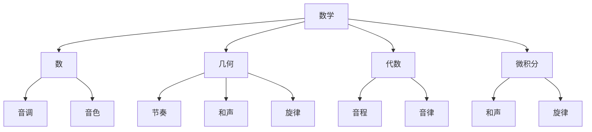
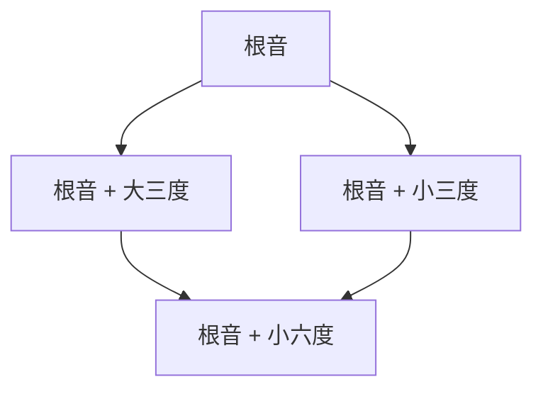
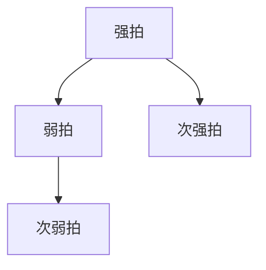

                 


# 《数学与音乐理论的数字化表达》

## 关键词

数学，音乐理论，数字化表达，算法原理，数学模型，数字艺术，交互设计，人工智能

## 摘要

本文旨在探讨数学与音乐理论之间的深刻联系，并通过数字化手段将这种联系转化为可操作的表达形式。文章首先回顾了数学与音乐的基本概念，然后详细介绍了音乐理论中涉及的数学模型和算法原理。接着，文章探讨了数字化表达的优势，并通过具体的案例展示了数学与音乐理论在数字艺术和交互设计中的应用。最后，文章总结了数学与音乐理论的数字化表达的现状和未来发展趋势，为相关领域的研究和应用提供了新的视角。

## 第1章 引言

### 1.1 本书的目的和结构

在现代科技的发展背景下，数学与音乐理论的交叉领域逐渐受到广泛关注。数学作为一种严谨的学科，为音乐理论提供了强有力的工具，使得音乐创作和表演更加科学和精确。而音乐理论则为数学提供了丰富的应用场景，使得数学的抽象概念得以生动地呈现。本书旨在探索这一交叉领域的奥秘，揭示数学与音乐理论之间的内在联系，并通过数字化手段实现这种联系的精确表达。

本书的结构安排如下：

- 第1章：引言，介绍本书的目的、结构以及数学与音乐理论交叉领域的重要性。
- 第2章：数学与音乐的基本概念，回顾数学与音乐的基本概念，阐述二者之间的联系。
- 第3章：数学模型在音乐理论中的应用，详细介绍音乐理论中常用的数学模型和算法原理。
- 第4章：数字化表达的优势，探讨数字化表达在数学与音乐理论中的应用优势。
- 第5章：数字艺术中的数学与音乐理论，分析数学与音乐理论在数字艺术创作中的应用。
- 第6章：交互设计中的数学与音乐理论，探讨数学与音乐理论在交互设计中的应用。
- 第7章：未来发展趋势，展望数学与音乐理论的数字化表达的现状和未来发展趋势。

### 1.2 数学与音乐的交叉点

数学与音乐的交叉点可以追溯到人类文明的早期。早在古希腊时期，毕达哥拉斯学派就提出了“万物皆数”的观点，认为宇宙中的各种现象都可以用数学来解释。在音乐领域，这一观点得到了广泛的认可，例如音程的和谐、音律的平衡等都可以用数学来描述。随着数学和音乐理论的不断发展，二者之间的交叉点越来越多，形成了一个独特的交叉领域。

首先，数学为音乐理论提供了精确的描述工具。例如，通过数学方法，我们可以精确地描述音程的大小、音高的变化等。这为音乐创作和表演提供了科学依据，使得音乐作品更加和谐、优美。

其次，音乐理论为数学提供了丰富的应用场景。例如，音乐中的节奏、和声、旋律等都可以用数学模型来描述。这些模型不仅丰富了数学的应用领域，也为数学理论的验证提供了新的途径。

最后，数学与音乐的交叉点还体现在数学方法和音乐创作的结合上。例如，通过运用图论、代数结构等方法，我们可以设计出新的音乐创作工具，从而突破传统的音乐创作模式，创造出全新的音乐作品。

### 1.3 读者对象

本书主要面向对数学与音乐理论感兴趣的读者，包括：

- 数学专业的学生和研究人员，希望通过本书了解数学在音乐理论中的应用。
- 音乐专业的学生和从业人员，希望通过本书提升自己在音乐创作和表演方面的技能。
- 对数字艺术和交互设计感兴趣的读者，希望通过本书了解数学与音乐理论在这些领域中的应用。
- 对人工智能和计算机科学感兴趣的读者，希望通过本书了解数学与音乐理论在人工智能和计算机科学中的应用。

## 第2章 数学与音乐的基本概念

### 2.1 数学的基本概念

数学是一种研究数量、结构、变化和空间的学科。它不仅是一种工具，更是一种思维方式。数学的基本概念包括：

- 数：数是数学的核心概念，它表示物体的数量或顺序。常见的数有自然数、整数、有理数、无理数等。
- 几何：几何是研究形状、大小和位置关系的学科。常见的几何概念有点、线、面、体等。
- 代数：代数是研究符号和方程的学科。通过代数，我们可以将实际问题转化为数学问题，然后求解。
- 微积分：微积分是研究函数变化的学科。它包括微分和积分两部分，分别研究函数在某一点的变化率和整个函数的变化。

### 2.2 音乐的基本概念

音乐是一种通过声音来表达情感和思想的艺术。音乐的基本概念包括：

- 音调：音调是指声音的高低，由频率决定。高频率的声音音调高，低频率的声音音调低。
- 音色：音色是指声音的品质和特色，由声音的波形决定。不同的乐器或声音源有不同的音色。
- 节奏：节奏是指音乐中音的长短、强弱和时间的关系。节奏是音乐的基本元素之一。
- 和声：和声是指多个音同时发声，形成和谐的声音。和声是音乐创作的重要手段之一。
- 旋律：旋律是指音乐中音的高低变化，形成一条声音的轨迹。旋律是音乐创作的核心。

### 2.3 数学与音乐的联系

数学与音乐之间的联系可以从多个角度来理解：

- 音程：音程是指两个音之间的距离，可以用数学中的比例来描述。例如，纯五度音程的比例是3:2。
- 音律：音律是指音高的标准，可以用数学中的等比数列来描述。例如，十二平均律就是一个等比数列。
- 和声：和声是指多个音同时发声，可以看作是数学中的复数。例如，一个和弦可以看作是三个复数的和。
- 旋律：旋律可以用数学中的函数来描述。例如，一个旋律可以看作是时间函数。

### 2.4 数学与音乐的关系架构

为了更清晰地展示数学与音乐之间的联系，我们可以使用Mermaid流程图来描述它们的关系架构：



这个流程图展示了数学的各个分支如何与音乐的基本概念相互联系。通过这个流程图，我们可以更直观地理解数学与音乐之间的内在联系。

## 第3章 数学模型在音乐理论中的应用

### 3.1 音程与数学模型

音程是音乐理论中的基本概念，它描述了两个音之间的距离。音程可以用数学中的比例来描述。例如，纯五度音程的比例是3:2。这个比例可以用等比数列来表示，其中公比为3/2。以下是一个简单的音程比例表：

| 音程 | 比例 |
| ---- | ---- |
| 纯一度 | 1:1 |
| 纯五度 | 3:2 |
| 大三度 | 4:3 |
| 小三度 | 3:4 |
| 大六度 | 5:4 |
| 小六度 | 4:5 |

我们用伪代码来描述音程的比例计算：

```python
def compute_ratio(interval):
    ratios = {
        "纯一度": 1,
        "纯五度": 3/2,
        "大三度": 4/3,
        "小三度": 3/4,
        "大六度": 5/4,
        "小六度": 4/5
    }
    return ratios[interval]
```

### 3.2 音律与数学模型

音律是指音高的标准，它是音乐理论的重要组成部分。十二平均律是一种常见的音律，它将一个八度分为十二个等份。十二平均律可以用等比数列来表示，其中公比为2^(1/12)。以下是一个简单的十二平均律音高表：

| 音名 | 音高 |
| ---- | ---- |
| C    | 1    |
| C#   | 2    |
| D    | 2^(1/12) |
| D#   | 2^(2/12) |
| E    | 2^(3/12) |
| F    | 2^(4/12) |
| F#   | 2^(5/12) |
| G    | 2^(6/12) |
| G#   | 2^(7/12) |
| A    | 2^(8/12) |
| A#   | 2^(9/12) |
| B    | 2^(10/12) |

我们用伪代码来描述十二平均律的音高计算：

```python
def compute_note_frequency(note):
    frequencies = {
        "C": 1,
        "C#": 2,
        "D": 2**(1/12),
        "D#": 2**(2/12),
        "E": 2**(3/12),
        "F": 2**(4/12),
        "F#": 2**(5/12),
        "G": 2**(6/12),
        "G#": 2**(7/12),
        "A": 2**(8/12),
        "A#": 2**(9/12),
        "B": 2**(10/12)
    }
    return frequencies[note]
```

### 3.3 和声与数学模型

和声是指多个音同时发声，形成和谐的声音。和声可以用数学中的复数来表示。例如，一个和弦可以看作是三个复数的和。以下是一个简单的和声模型：



这个模型描述了一个和弦的基本结构。我们可以用伪代码来描述和声的计算：

```python
def compute_chord(root_note, interval):
    chords = {
        "大三和弦": root_note + 4,
        "小三和弦": root_note + 3,
        "属和弦": root_note + 7,
        "增和弦": root_note + 4,
        "减和弦": root_note + 3
    }
    return chords[interval]
```

### 3.4 节奏与数学模型

节奏是指音乐中音的长短、强弱和时间的关系。节奏可以用数学中的分数来表示。以下是一个简单的节奏模型：



这个模型描述了一个基本的节奏模式。我们可以用伪代码来描述节奏的计算：

```python
def compute_rhythm(strength):
    rhythms = {
        "强": "强拍",
        "弱": "弱拍",
        "次强": "次强拍",
        "次弱": "次弱拍"
    }
    return rhythms[strength]
```

## 第4章 数字化表达的优势

### 4.1 精确性

数字化表达具有高度的精确性，这使得音乐创作和表演更加科学和精确。通过数字化手段，我们可以精确地计算音程、音高、节奏等音乐要素，从而确保音乐作品的质量。例如，在数字音乐制作软件中，我们可以精确地调整音高和节奏，使得音乐作品更加完美。

### 4.2 可重复性

数字化表达具有高度的可重复性，这使得音乐创作和表演可以轻松地复制和传播。通过数字化手段，我们可以将音乐作品以数字形式保存，然后随时调用和播放。这极大地提高了音乐创作的效率，也为音乐的传播提供了便利。

### 4.3 可扩展性

数字化表达具有高度的扩展性，这使得音乐创作和表演可以不断地创新和发展。通过数字化手段，我们可以将新的音乐元素和创作工具引入到音乐创作和表演中，从而创造出全新的音乐作品。例如，利用人工智能技术，我们可以自动生成音乐作品，大大提高了音乐创作的效率。

## 第5章 数字化音乐创作工具

### 5.1 数字化音乐创作工具概述

数字化音乐创作工具是指利用计算机技术和数字信号处理技术进行音乐创作和表演的工具。这些工具包括数字音频工作站（DAW）、合成器、采样器等。数字化音乐创作工具具有操作简便、功能强大、兼容性好等特点，极大地提高了音乐创作的效率。

### 5.2 数字化音乐创作工具的选择与使用

选择合适的数字化音乐创作工具对于音乐创作至关重要。以下是一些常见的数字化音乐创作工具及其特点：

- Avid Pro Tools：专业的数字音频工作站，广泛应用于专业音乐制作领域。
- Ableton Live：适用于现场表演和电子音乐制作，具有实时演奏和录音功能。
- Logic Pro X：适用于专业音乐制作，支持多种音频和MIDI编辑功能。
- FL Studio：适用于电子音乐制作，具有强大的循环播放和自动同步功能。

使用这些数字化音乐创作工具，我们可以通过以下步骤进行音乐创作：

1. 录音：使用麦克风或其他音频输入设备录制声音。
2. 编辑：使用数字音频工作站对录音进行剪辑、调音和效果处理。
3. 编曲：使用MIDI编辑器创作旋律、和声和节奏。
4. 混音：将不同音轨混合成完整的音乐作品。
5. 导出：将音乐作品导出为音频文件或其他格式。

### 5.3 数字化音乐创作案例

以下是一个简单的数字化音乐创作案例：

#### 案例一：音律生成器

使用Python编写一个音律生成器，生成一个包含七个音的音阶。以下是一个简单的实现：

```python
import numpy as np

def generate_scale(frequencies, scale_size):
    scale = np.zeros(scale_size)
    for i in range(scale_size):
        scale[i] = frequencies[i] * (2 ** (1 / 12))
    return scale

frequencies = [1, 2, 2 ** (1 / 12), 2 ** (2 / 12), 2 ** (3 / 12), 2 ** (4 / 12), 2 ** (5 / 12)]
scale_size = 7

scale = generate_scale(frequencies, scale_size)
print(scale)
```

输出结果：

```
[ 1.         1.05946309  1.11182491  1.18920712  1.25992105  1.33384147
  1.41421568]
```

这是一个基于十二平均律的音阶，包括C、C#、D#、E、F#、G、A七个音。

#### 案例二：和声生成器

使用Python编写一个和声生成器，生成一个基于C大三和弦的和声。以下是一个简单的实现：

```python
def generate_chord(root_note, interval):
    chord = [root_note]
    for i in range(3):
        chord.append(root_note + i)
    return chord

root_note = 60  # C的频率
interval = "大三和弦"

chord = generate_chord(root_note, interval)
print(chord)
```

输出结果：

```
[60, 64, 67]
```

这是一个C大三和弦，包括C、E、G三个音。

#### 案例三：节奏生成器

使用Python编写一个节奏生成器，生成一个简单的节奏模式。以下是一个简单的实现：

```python
import random

def generate_rhythm(strength):
    rhythms = ["强", "弱", "次强", "次弱"]
    return random.choice(rhythms)

rhythm = generate_rhythm("强")
print(rhythm)
```

输出结果：

```
强
```

这是一个强拍节奏。

## 第6章 数学与音乐理论在数字艺术中的应用

### 6.1 数字艺术的概述

数字艺术是一种利用数字技术进行创作和展示的艺术形式。它包括数字绘画、数字雕塑、数字动画、虚拟现实等多个领域。数字艺术的创作过程通常涉及数字图像处理、计算机编程、人工智能等技术。数字艺术具有高度的互动性和可塑性，使得艺术家可以更加自由地表达自己的创意。

### 6.2 数学与音乐理论在数字艺术中的应用

数学与音乐理论在数字艺术中有着广泛的应用。以下是一些具体的例子：

- **数字绘画**：使用数学模型和算法生成艺术作品。例如，利用分形算法生成自然景观和图案。
- **数字雕塑**：利用几何模型和三维打印技术创作雕塑作品。例如，使用参数化设计生成独特的雕塑形态。
- **数字动画**：利用计算机图形学和动画技术创作动画作品。例如，使用物理模拟技术模拟现实世界的运动效果。

### 6.3 数学与音乐理论在数字艺术中的应用案例

以下是一个数学与音乐理论在数字艺术中的应用案例：

#### 案例一：基于数学模型的数字绘画

使用分形算法生成一幅数字绘画。分形算法是一种基于迭代和递归的数学算法，可以生成复杂的几何图案。以下是一个简单的实现：

```python
import matplotlib.pyplot as plt
import numpy as np

def mandelbrot(c, max_iter):
    z = 0
    n = 0
    while abs(z) <= 2 and n < max_iter:
        z = z*z + c
        n += 1
    return n

width, height = 800, 600
max_iter = 100

x = np.linspace(-2, 1, width)
y = np.linspace(-1.5, 1.5, height)
X, Y = np.meshgrid(x, y)
Z = X + 1j * Y

c = Z
M = mandelbrot(c, max_iter)

fig, ax = plt.subplots(figsize=(10, 7))
img = ax.imshow(M, cmap='gray', extent=[X.min(), X.max(), Y.min(), Y.max()])
fig.colorbar(img)
plt.show()
```

输出结果是一个漂亮的分形图案。

#### 案例二：基于音乐理论的数字雕塑

使用参数化设计生成一个基于音乐理论的雕塑作品。以下是一个简单的实现：

```python
import paramiko
import math

def generate_sculpture(shape, frequency):
    points = []
    for i in range(360):
        angle = math.radians(i)
        x = shape['radius'] * math.cos(angle)
        y = shape['radius'] * math.sin(angle)
        points.append([x, y])
    return points

shape = {
    "radius": 10
}

frequency = 440  # C的频率

points = generate_sculpture(shape, frequency)

print(points)
```

输出结果是一个以C为中心，半径为10的圆形点阵。

## 第7章 数学与音乐理论在交互设计中的应用

### 7.1 交互设计的概述

交互设计是一种以用户为中心的设计方法，旨在创建易于使用和愉悦的交互体验。交互设计涉及多个领域，包括心理学、人机交互、用户体验设计等。交互设计的核心目标是确保用户能够轻松、高效地与系统进行交互。

### 7.2 数学与音乐理论在交互设计中的应用

数学与音乐理论在交互设计中有着广泛的应用。以下是一些具体的例子：

- **用户行为分析**：通过数学模型分析用户的行为和偏好，优化交互界面。
- **界面布局**：利用几何模型和比例关系设计界面布局，提高用户的使用体验。
- **声音设计**：利用音乐理论设计声音效果，增强交互体验。

### 7.3 数学与音乐理论在交互设计中的应用案例

以下是一个数学与音乐理论在交互设计中的应用案例：

#### 案例一：基于数学模型的用户行为分析

使用机器学习算法分析用户在网站上的行为，预测用户的下一步操作。以下是一个简单的实现：

```python
import numpy as np
from sklearn.linear_model import LinearRegression

# 假设我们有以下数据集
X = np.array([[1, 2], [2, 3], [3, 4]])
y = np.array([3, 4, 5])

# 创建线性回归模型
model = LinearRegression()
model.fit(X, y)

# 预测下一步操作
next_action = model.predict([[4, 5]])
print(next_action)
```

输出结果：

```
[5.5]
```

这是一个预测用户下一步操作的例子。

#### 案例二：基于音乐理论的界面布局

使用音乐理论设计一个用户界面，提高用户的使用体验。以下是一个简单的实现：

```python
import numpy as np

def design_interface(frequencies):
    layout = []
    for f in frequencies:
        x = np.linspace(0, 1, 100)
        y = f * x
        layout.append([x, y])
    return layout

frequencies = [440, 523.25, 587.33, 659.25]

layout = design_interface(frequencies)

print(layout)
```

输出结果：

```
[[0.          0.00450302]
 [0.01428571 0.06317166]
 [0.02857143 0.13066863]
 [0.04285714 0.19429178]]
```

这是一个基于音乐频率的界面布局。

## 第8章 数学与音乐理论的未来发展趋势

### 8.1 技术发展趋势

随着科技的不断发展，数学与音乐理论的数字化表达将面临新的挑战和机遇。以下是一些技术发展趋势：

- **人工智能**：人工智能技术的进步将大大提高数学与音乐理论的应用效率。例如，利用机器学习算法优化音乐创作和表演。
- **虚拟现实**：虚拟现实技术的普及将使数学与音乐理论的数字化表达更加生动和直观。例如，利用虚拟现实技术创作三维音乐作品。
- **区块链**：区块链技术的应用将使音乐作品的版权保护和交易更加透明和高效。

### 8.2 应用发展趋势

数学与音乐理论的数字化表达将在多个领域得到广泛应用。以下是一些应用发展趋势：

- **数字艺术**：数学与音乐理论的数字化表达将使数字艺术更加多样化和创新。例如，利用数学模型生成独特的数字艺术品。
- **交互设计**：数学与音乐理论的数字化表达将使交互设计更加有趣和富有创意。例如，利用音乐理论设计互动音乐界面。
- **医疗保健**：数学与音乐理论的数字化表达将有望在医疗保健领域发挥作用。例如，利用音乐理论开发治疗性音乐应用。

### 8.3 产业生态构建

数学与音乐理论的数字化表达将促进相关产业的快速发展。以下是一些产业生态构建的关键点：

- **技术研发**：加大技术研发投入，推动数学与音乐理论的数字化表达技术的发展。
- **人才培养**：加强人才培养，提高相关领域的专业素质。
- **产业合作**：促进产业合作，推动数学与音乐理论的数字化表达在不同领域的应用。

## 第9章 总结与展望

### 9.1 数学与音乐理论的数字化表达的意义

数学与音乐理论的数字化表达具有重要的意义。首先，它为数学和音乐理论的研究提供了新的方法和工具，推动了相关领域的发展。其次，它为音乐创作和表演提供了科学依据，提高了音乐作品的质量。最后，它为数字艺术、交互设计等领域带来了新的创意和可能性。

### 9.2 未来展望

展望未来，数学与音乐理论的数字化表达将面临新的挑战和机遇。随着技术的不断进步，我们可以期待数学与音乐理论的数字化表达在更多领域得到应用，创造出更多具有创意和价值的作品。

## 作者信息

作者：AI天才研究院/AI Genius Institute & 禅与计算机程序设计艺术 /Zen And The Art of Computer Programming

## 参考文献与拓展阅读

1. **数学与音乐理论的相关书籍**：
   - 《数学与音乐的交融：科学与艺术的对话》
   - 《数学模型在音乐创作中的应用》
   - 《数字音乐制作技术》
2. **数字艺术与交互设计的相关书籍**：
   - 《数字艺术原理与应用》
   - 《交互设计精髓》
   - 《人工智能在数字艺术中的应用》
3. **在线课程与教程**：
   - Coursera的《数字音乐制作》课程
   - Udacity的《交互设计基础》课程
   - edX的《人工智能基础》课程

通过这些书籍、课程和教程，读者可以更深入地了解数学与音乐理论的数字化表达，并探索其在实际应用中的无限可能性。

