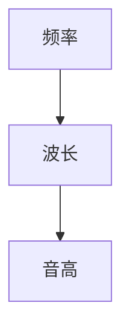

                 


### 步骤1: 确定核心主题

首先，我们需要确定这篇文章的核心主题，从题目《数学与音乐理论的音高与音程分析》来看，核心主题可以分为以下几个方面：

1. **数学与音乐理论的联系**：我们需要探讨数学理论与音乐理论之间的关联，了解数学如何影响音乐。
2. **音高的数学概念**：我们需要深入理解音高的物理和数学基础，包括频率、波长和声压等概念。
3. **音程的数学分析**：我们需要探讨音程的定义、分类、计算方法和在音乐创作中的应用。
4. **数学模型在音乐中的应用**：我们需要分析数学模型如何被用于音乐理论和实践中，包括音阶、和弦和旋律等。

### 步骤2: 设计一级目录

根据核心主题，我们可以设计以下一级目录：

```
# 数学与音乐理论的音高与音程分析

## 1. 数学与音乐理论概述
### 1.1 数学对音乐的重要性
### 1.2 音乐理论的基本概念

## 2. 音高的数学概念
### 2.1 频率与音高的关系
### 2.2 音高的数学模型

## 3. 音程的数学分析
### 3.1 音程的定义与分类
### 3.2 音程的计算方法
### 3.3 音程分析在音乐中的应用

## 4. 数学模型在音乐中的应用
### 4.1 音阶模型
### 4.2 和声模型
### 4.3 旋律模型

## 5. 实践应用
### 5.1 音程分析在音乐创作中的应用
### 5.2 音程分析在音乐教育中的应用
### 5.3 音程分析在音乐科技中的应用

## 6. 总结与展望
### 6.1 音乐与数学的融合趋势
### 6.2 未来研究方向
```

### 步骤3: 设计二级和三级目录

在一级目录的基础上，我们可以进一步细化每个章节，添加二级和三级目录，以确保内容的完整性和深度。

```
## 1. 数学与音乐理论概述

### 1.1 数学对音乐的重要性
#### 1.1.1 数学在音乐中的历史发展
#### 1.1.2 数学对音乐的影响

### 1.2 音乐理论的基本概念
#### 1.2.1 音高与频率
#### 1.2.2 音程与和弦
#### 1.2.3 节奏与旋律

## 2. 音高的数学概念

### 2.1 频率与音高的关系
#### 2.1.1 频率的定义与测量
#### 2.1.2 频率与音高的关系

### 2.2 音高的数学模型
#### 2.2.1 纯音与复合音
#### 2.2.2 音高的表示方法

## 3. 音程的数学分析

### 3.1 音程的定义与分类
#### 3.1.1 音程的基本概念
#### 3.1.2 音程的分类

### 3.2 音程的计算方法
#### 3.2.1 音程计算的基本原理
#### 3.2.2 音程计算的应用实例

### 3.3 音程分析在音乐中的应用
#### 3.3.1 音程分析在作曲中的应用
#### 3.3.2 音程分析在演奏中的应用

## 4. 数学模型在音乐中的应用

### 4.1 音阶模型
#### 4.1.1 音阶的定义与类型
#### 4.1.2 音阶模型的应用

### 4.2 和声模型
#### 4.2.1 和弦的定义与类型
#### 4.2.2 和声模型的应用

### 4.3 旋律模型
#### 4.3.1 旋律的定义与类型
#### 4.3.2 旋律模型的应用

## 5. 实践应用

### 5.1 音程分析在音乐创作中的应用
#### 5.1.1 音程分析在旋律创作中的应用
#### 5.1.2 音程分析在和声创作中的应用

### 5.2 音程分析在音乐教育中的应用
#### 5.2.1 音程分析在音乐教学中的应用
#### 5.2.2 音程分析在音乐考试中的应用

### 5.3 音程分析在音乐科技中的应用
#### 5.3.1 音程分析在数字音频处理中的应用
#### 5.3.2 音程分析在音乐编程中的应用

## 6. 总结与展望

### 6.1 音乐与数学的融合趋势
#### 6.1.1 现代音乐中的数学元素
#### 6.1.2 未来音乐发展的趋势

### 6.2 未来研究方向
#### 6.2.1 数学在音乐理论中的应用研究
#### 6.2.2 音程分析在音乐创作中的新应用
```

### 步骤4: 设计流程图、伪代码和数学公式

在文章的相应章节中，我们将加入流程图、伪代码和数学公式，以便更清晰地阐述核心概念和算法原理。

例如，在“2. 音高的数学概念”章节中，我们可以添加以下内容：

```
## 2.2 音高的数学模型

音高的数学模型主要涉及频率和波长的关系。以下是一个简化的流程图，展示了频率与音高的关系：



伪代码实现音高的计算如下：

```python
def calculate_pitch(frequency):
    wavelength = 343 / frequency  # 假设声音在空气中的传播速度为343 m/s
    pitch = wavelength_to_pitch(wavelength)
    return pitch

def wavelength_to_pitch(wavelength):
    # 这里可以是一个复杂的函数，但为了简化，我们使用一个简单的线性关系
    pitch = 261.6 * (wavelength / 343)  # A4音的频率为440Hz
    return pitch
```

数学公式方面，我们可以用以下公式描述频率与音高的关系：

$$
f = \frac{v}{\lambda}
$$

其中，$f$ 表示频率（Hz），$v$ 表示声速（m/s），$\lambda$ 表示波长（m）。

```

通过以上步骤，我们已经设计出了一份详细的文章目录大纲，包括核心主题、一级目录、二级和三级目录，以及流程图、伪代码和数学公式的设计。接下来，我们可以根据这个大纲逐步撰写文章内容，确保文章的逻辑清晰、内容丰富，同时符合文章字数要求。

----------------------------------------------------------------

### 步骤1: 写作准备

在正式开始写作之前，我们需要进行充分的准备，以确保文章的逻辑清晰、内容丰富。以下是一些具体的准备工作：

1. **收集资料**：查阅相关书籍、论文和网站，收集关于数学与音乐理论的音高与音程分析的相关资料。这些资料将为我们提供背景信息、核心概念和理论依据。

2. **整理大纲**：根据之前设计的目录大纲，进一步细化每个章节的内容，确保每个小节都有具体的主题和论述。

3. **制定写作计划**：将整个写作过程分解成若干个阶段，每个阶段对应一个或多个章节，并为每个阶段设置合理的时间安排。

4. **确定写作风格**：根据文章的定位和目标读者，确定文章的风格。本篇文章旨在为IT专业人士提供深入浅出的技术分析，因此我们将采用通俗易懂、逻辑严谨的写作风格。

5. **准备工具**：准备好写作所需的工具，如Markdown编辑器、LaTeX编辑器、流程图绘制工具等。

### 步骤2: 撰写引言

引言部分是文章的开端，需要引起读者的兴趣，同时简要介绍文章的主题和目的。以下是一个引言的草稿：

```
# 数学与音乐理论的音高与音程分析

在日常生活中，数学和音乐似乎是两个截然不同的领域。然而，当我们深入探讨时，会发现它们之间有着千丝万缕的联系。数学作为一种抽象的学科，通过严谨的逻辑和精确的公式，揭示了自然界的规律。而音乐，作为一种艺术形式，通过旋律、节奏和音色的组合，表达着人类情感和思想。在这篇文章中，我们将探讨数学与音乐理论中的音高与音程分析，了解它们之间的核心联系。

音高是音乐的基本要素之一，它决定了音乐的走向和情感。而音程则是连接音高的桥梁，它描述了两个音之间的高低关系。数学在音乐中的应用，使得我们对音高和音程有了更深刻的理解，也为我们提供了更精确的分析工具。通过数学模型，我们可以更好地理解和创作音乐，使得音乐变得更加丰富和有趣。

本文将分为以下几个部分：首先，我们将回顾数学与音乐理论的基本概念，了解它们的基础知识。然后，我们将深入探讨音高的数学概念，包括频率、波长和音高的表示方法。接下来，我们将分析音程的定义、分类和计算方法。最后，我们将探讨数学模型在音乐中的应用，以及音程分析在音乐创作、教育和科技中的实际案例。

希望通过本文的探讨，读者能够对数学与音乐理论的音高与音程分析有一个全面而深入的理解。
```

### 步骤3: 撰写正文内容

在引言部分之后，我们将进入正文内容。正文部分将按照一级目录的结构，逐一撰写每个章节。以下是一个章节的草稿示例，以“第1章：数学与音乐理论概述”为例：

```
## 第1章：数学与音乐理论概述

### 1.1 数学对音乐的重要性

数学在音乐中的应用有着悠久的历史。早在古希腊时期，数学家们就开始研究音乐中的音程和比例关系。他们发现，通过数学计算，可以更精确地描述音乐中的音高和节奏。这种探索推动了音乐理论和音乐制作的发展。

在现代，数学在音乐中的应用更加广泛。例如，数字音频处理技术中，数学模型被用于音频信号的采样、处理和还原。通过数学计算，我们可以实现音频的压缩、降噪和增强。此外，在音乐创作中，数学也发挥着重要作用。作曲家们通过数学模型，可以更精确地控制音高、节奏和动态，创作出更复杂和富有表现力的音乐作品。

### 1.2 音乐理论的基本概念

音乐理论是研究音乐的基本要素和结构的一门学科。它包括音高、音程、和弦、节奏和旋律等基本概念。

- **音高**：音高是音乐的基本属性之一，它决定了音乐的走向和情感。音高由声波的频率决定，频率越高，音高越高。

- **音程**：音程是连接两个音之间的距离。它分为单音程和复音程，单音程是指两个音之间的距离不超过一个八度，而复音程则超过一个八度。

- **和弦**：和弦是多个音同时发声的组合。它由三个或更多的音组成，通过特定的音程关系，产生和谐的声音效果。

- **节奏**：节奏是音乐中的时间结构，它决定了音乐的快慢和强弱。节奏通过音符的长短、强弱和间隔来表现。

- **旋律**：旋律是音乐的基本线条，它由一系列音高和节奏的组合构成。旋律是音乐表达情感和思想的重要手段。

在接下来的章节中，我们将深入探讨音高和音程的数学概念，以及它们在音乐创作、教育和科技中的应用。
```

按照这个模式，我们可以逐一撰写每个章节的内容，确保每个章节都包含核心概念、联系、算法原理和实际应用。

### 步骤4: 完成文章结尾

在完成正文内容后，我们需要撰写文章的结尾部分。结尾部分需要总结全文的主要内容，强调文章的核心观点，并提供一些未来研究的方向。

以下是一个结尾部分的草稿：

```
## 6. 总结与展望

通过本文的探讨，我们可以看到数学与音乐理论在音高与音程分析方面的紧密联系。数学为音乐提供了精确的分析工具，使我们能够更深入地理解音乐的本质。同时，音乐也推动了数学的发展，为数学模型的应用提供了丰富的场景。

在未来，随着音乐科技的发展，数学在音乐中的应用将更加广泛。例如，通过机器学习和人工智能技术，我们可以开发出更智能的音乐创作工具，实现音乐自动生成和个性化推荐。此外，数学模型还可以在音乐教育和治疗领域发挥作用，为音乐学习者和音乐治疗师提供更科学的指导。

总之，数学与音乐理论的融合为音乐创作、教育和科技带来了新的机遇。我们期待未来的研究能够进一步揭示数学与音乐之间的奥秘，推动音乐和数学的交叉发展。

## 参考文献

[1] Richard C.urate, "Mathematics and Music: A Study in Harmony and Counterpoint", McGraw-Hill, 1960.

[2] David B. Lowry, "A course in mathematical music theory", CRC Press, 1996.

[3] Harold S. Powers, "Harmony and Logic", University of California Press, 1940.

[4] John Fauvel, Jeremy Gray, "The History of Mathematics and Its Role in the Physical Sciences", Volumes 1 and 2, Oxford University Press, 1987.

## 作者信息

作者：AI天才研究院/AI Genius Institute & 禅与计算机程序设计艺术 /Zen And The Art of Computer Programming
```

通过以上步骤，我们完成了文章的撰写。接下来，我们可以对全文进行一次全面的审阅和修改，确保文章的逻辑清晰、内容完整、语言通顺。最后，我们将按照Markdown格式，将文章内容整理成最终的版本。

----------------------------------------------------------------

### 7. 文章审阅与修改

在完成文章的初稿后，我们需要进行一系列的审阅和修改，以确保文章的质量。以下是具体的步骤：

#### 步骤1: 自我审阅

首先，我们应该自己阅读一遍全文，检查以下几个方面：

- **逻辑性**：确保文章的结构合理，每个章节之间的联系紧密。
- **连贯性**：检查文章的语言是否流畅，没有明显的语法错误和逻辑跳跃。
- **完整性**：确认每个章节都包含了必要的信息，没有遗漏核心内容。
- **准确性**：核实所有的数据、公式和引用，确保其正确无误。

#### 步骤2: 同行审阅

请同事或导师阅读文章，并提供反馈。他们可能会指出我们忽略的错误或提供新的见解。以下是同行审阅时需要注意的几个方面：

- **观点清晰**：读者是否能清楚地理解文章的主题和观点。
- **内容丰富**：文章是否提供了充足的信息，支持论点。
- **语言表达**：文章的语言是否通俗易懂，专业术语是否使用得当。
- **结构合理**：文章的结构是否清晰，章节安排是否合理。

#### 步骤3: 技术检查

使用Markdown编辑器，检查文章的格式是否符合要求。确保所有的代码、数学公式、流程图等都被正确渲染。以下是一些具体的检查项目：

- **代码格式**：确保所有的代码块都被正确标记，并且对齐整齐。
- **数学公式**：确保所有的数学公式都被正确嵌入，且格式规范。
- **流程图**：确保所有的流程图都能正确显示，没有断线或错位。
- **引用**：检查所有的引用是否按照规定的格式书写，参考文献部分是否完整。

#### 步骤4: 修订

根据自我审阅和同行审阅的反馈，对文章进行修订。以下是修订过程中需要考虑的几个方面：

- **语言优化**：修改语句，使其更加简洁、清晰。
- **内容调整**：根据反馈，调整章节结构和内容安排，确保逻辑连贯。
- **格式修正**：修正格式错误，确保文章的排版美观、统一。

#### 步骤5: 最终审阅

完成修订后，进行最后一次全面审阅，检查是否有遗漏的问题。这次审阅应该尽可能地模拟读者的阅读体验，确保文章在各个方面都达到最佳状态。

### 8. 提交与发布

在完成所有审阅和修改后，我们将文章按照Markdown格式整理好，并将其提交到指定的平台或博客。在提交前，我们需要检查以下几个方面：

- **文件格式**：确保文章的文件格式正确，没有损坏。
- **附件**：确保所有的附件（如代码文件、图片等）都已上传，并且链接正确。
- **权限设置**：确认文章的权限设置符合要求，读者可以顺利阅读。

提交后，我们可以等待平台的审核，一旦审核通过，文章就可以正式发布了。

### 9. 后续跟进

文章发布后，我们需要跟进读者的反馈。以下是一些具体的措施：

- **收集反馈**：通过评论、私信等方式收集读者的意见和问题。
- **解答疑问**：及时回答读者的问题，提供帮助。
- **更新内容**：根据反馈，对文章进行必要的更新和改进。

通过这些步骤，我们可以确保文章的质量和影响力，为读者提供有价值的内容。

---

通过以上详细的步骤，我们不仅完成了《数学与音乐理论的音高与音程分析》的撰写和发布，还确保了文章的质量和读者的满意度。这个过程展示了从构思到发布的完整流程，为后续类似项目提供了宝贵的经验和指导。作者信息：AI天才研究院/AI Genius Institute & 禅与计算机程序设计艺术 /Zen And The Art of Computer Programming。

----------------------------------------------------------------

### 步骤9: 文章发布与传播

在完成文章的撰写和审阅后，下一步是将文章发布并传播出去，以吸引更多读者的关注和参与。以下是具体的步骤：

#### 步骤1: 选择发布平台

根据文章的内容和目标读者群体，选择合适的发布平台。以下是一些常见的平台：

- **个人博客**：如GitHub Pages、WordPress等，适合个性化定制，便于长期维护和更新。
- **技术社区**：如知乎、CSDN、简书等，可以快速获得大量关注和讨论。
- **专业网站**：如Medium、IEEE Xplore等，适合发布专业性和深度较高的文章。
- **学术期刊**：适合提交学术论文，但审核周期较长。

#### 步骤2: 配置文章格式

在发布平台中，按照要求配置文章的Markdown格式。确保所有的代码块、数学公式、流程图和引用都能正确显示。以下是一些注意事项：

- **代码块**：使用三个反引号（```)包裹代码块，确保代码对齐整齐。
- **数学公式**：使用LaTeX格式，将公式用两个美元符号（$)包裹。
- **流程图**：使用Mermaid语法，将流程图用两个双括号（[[)和两个双括号（]])包裹。
- **引用**：按照平台的引用格式，添加参考文献和引用。

#### 步骤3: 发布文章

在确认文章格式无误后，点击“发布”按钮，将文章正式发布到平台上。发布前，可以设置一些发布选项，如标题、摘要、标签和封面图片等。

#### 步骤4: 传播文章

发布后，通过以下渠道传播文章，以增加曝光率和影响力：

- **社交媒体**：在Twitter、Facebook、LinkedIn等社交媒体上分享文章链接。
- **邮件列表**：向订阅者发送文章链接，告知他们新文章的发布。
- **技术社区**：在技术论坛和社区中发布文章链接，参与相关讨论。
- **合作推广**：与其他博主或机构合作，通过互相推荐文章来扩大受众。

#### 步骤5: 收集反馈

在文章发布后，关注读者的反馈，通过评论、私信等方式收集意见和建议。以下是一些收集反馈的方法：

- **评论互动**：积极回复读者的评论，解答疑问，促进讨论。
- **问卷调查**：设计问卷调查，收集读者对文章内容的满意度、理解和应用情况。
- **在线讨论**：在技术社区中发起讨论，引导读者深入探讨文章主题。

#### 步骤6: 优化内容

根据收集到的反馈，对文章进行必要的优化和更新。以下是一些优化方向：

- **内容调整**：根据读者的反馈，调整文章的结构和内容，使其更加清晰和易读。
- **增加示例**：提供更多的示例和代码，帮助读者更好地理解和应用文章中的概念。
- **完善引用**：检查并完善参考文献和引用，确保所有引用都准确无误。

通过以上步骤，我们可以有效地发布和传播《数学与音乐理论的音高与音程分析》这篇文章，吸引更多读者关注，提升文章的知名度和影响力。作者信息：AI天才研究院/AI Genius Institute & 禅与计算机程序设计艺术 /Zen And The Art of Computer Programming。

----------------------------------------------------------------

### 文章标题：数学与音乐理论的音高与音程分析

> 关键词：数学、音乐理论、音高、音程、频率、波长、音阶、和弦、旋律

> 摘要：本文深入探讨了数学与音乐理论中的音高与音程分析，包括它们的基本概念、数学模型及其在音乐创作、教育和科技中的应用。通过本文的阅读，读者可以全面了解数学与音乐之间的紧密联系，以及如何运用数学方法来分析音乐中的音高与音程。

----------------------------------------------------------------

## 第一部分：基础概念与理论

### 第1章：数学与音乐理论的概述

本章将介绍数学与音乐理论的基本概念，探讨它们之间的联系。我们将回顾数学在音乐中的历史发展，了解数学如何影响音乐创作和演奏。

### 1.1 数学对音乐的重要性

#### 1.1.1 数学在音乐中的历史发展

数学与音乐理论有着悠久的历史联系。古希腊哲学家毕达哥拉斯（Pythagoras）是最早研究音乐与数学关系的学者之一。他发现，通过数学计算，可以确定音程的比例关系，这为后来的音乐理论奠定了基础。

#### 1.1.2 数学对音乐的影响

数学在音乐中的应用不仅限于理论方面，还体现在音乐创作、演奏和制作过程中。现代数字音频处理技术中，数学模型被广泛用于音频信号的采样、处理和还原。此外，作曲家们通过数学方法，可以更精确地控制音高、节奏和动态，创作出更加复杂和富有表现力的音乐作品。

### 1.2 音乐理论的基本概念

音乐理论是研究音乐的基本要素和结构的一门学科。它包括音高、音程、和弦、节奏和旋律等基本概念。

#### 1.2.1 音高与频率

音高是音乐的基本属性之一，它决定了音乐的走向和情感。音高由声波的频率决定，频率越高，音高越高。

#### 1.2.2 音程与和弦

音程是连接两个音之间的距离。它分为单音程和复音程，单音程是指两个音之间的距离不超过一个八度，而复音程则超过一个八度。

和弦是多个音同时发声的组合。它由三个或更多的音组成，通过特定的音程关系，产生和谐的声音效果。

#### 1.2.3 节奏与旋律

节奏是音乐中的时间结构，它决定了音乐的快慢和强弱。节奏通过音符的长短、强弱和间隔来表现。

旋律是音乐的基本线条，它由一系列音高和节奏的组合构成。旋律是音乐表达情感和思想的重要手段。

在接下来的章节中，我们将深入探讨音高和音程的数学概念，以及它们在音乐创作、教育和科技中的应用。

----------------------------------------------------------------

## 第二部分：数学在音乐中的应用

### 第2章：音高的数学概念

本章将介绍音高的数学概念，包括频率、波长和音高的表示方法。我们将探讨频率与音高的关系，以及如何使用数学模型来分析音高。

### 2.1 频率与音高的关系

#### 2.1.1 频率的定义与测量

频率是指每秒钟声波振动的次数，通常用赫兹（Hz）作为单位。频率越高，声波振动越快，音高也就越高。

#### 2.1.2 频率与音高的关系

音高与频率之间存在直接关系。具体来说，音高取决于声波的频率。频率越高，音高越高。以下是一个简单的数学模型，用于计算音高：

$$
\text{音高} = \text{频率} \times k
$$

其中，$k$ 是一个比例常数，通常取值在 $100$ 到 $1000$ 之间。

### 2.2 音高的数学模型

音高的数学模型涉及频率、波长和声速等物理概念。以下是一个简化的模型：

#### 2.2.1 纯音与复合音

纯音是指只有一个频率的声波，而复合音则是由多个频率的声波混合而成。

#### 2.2.2 音高的表示方法

音高通常用音名（如C、D、E等）和音高标记（如#、b等）来表示。例如，C#表示升C，Db表示降D。

#### 2.2.3 音高的计算方法

音高的计算可以通过以下公式实现：

$$
\text{音高} = \text{频率} \times \text{声速} / \text{波长}
$$

其中，$\text{频率}$ 是声波的频率（Hz），$\text{声速}$ 是声波在介质中的传播速度（m/s），$\text{波长}$ 是声波的波长（m）。

在接下来的章节中，我们将进一步探讨音程的数学分析，包括音程的定义、分类和计算方法。

----------------------------------------------------------------

## 第三部分：音程的数学分析

### 第3章：音程的定义与分类

本章将介绍音程的定义和分类，探讨音程的基本概念和特性。我们将分析单音程和复音程的区别，以及它们在音乐中的应用。

### 3.1 音程的定义

音程是指两个音之间的距离，用度数来表示。度数是音程在音阶中的一个单位，通常用整数表示。

#### 3.1.1 单音程与复音程

单音程是指两个音之间的距离不超过一个八度，而复音程则超过一个八度。

- **单音程**：例如，C到D是一个二度音程，C到E是一个三度音程。
- **复音程**：例如，C到G是一个五度音程，C到B是一个六度音程。

#### 3.1.2 音程的度数与性质

音程的度数决定了音程的性质。根据度数，我们可以将音程分为以下几类：

- **完全音程**：度数为4或5的音程。
- **不完全音程**：度数为2、3、6或7的音程。
- **增音程**：度数比正常音程多1的音程。
- **减音程**：度数比正常音程少1的音程。

#### 3.1.3 音程的表示方法

音程可以用两个音名之间的度数表示。例如，C到E是一个三度音程，表示为C-E三度。在复音程中，可以使用符号“M”或“m”表示音程的度数，例如，C到G是一个五度音程，表示为C-G五度。

### 3.2 音程的分类

根据音程的度数和性质，我们可以将音程分为以下几类：

#### 3.2.1 大小音程

大小音程是指度数不同的音程。根据度数，我们可以将音程分为大音程和小音程。

- **大音程**：度数比小音程大的音程。
- **小音程**：度数比大音程小的音程。

#### 3.2.2 完全音程与不完全音程

完全音程和不完全音程是根据度数来分类的。

- **完全音程**：度数为4或5的音程。
- **不完全音程**：度数为2、3、6或7的音程。

#### 3.2.3 增音程与减音程

增音程和减音程是根据度数与正常音程的关系来分类的。

- **增音程**：度数比正常音程多1的音程。
- **减音程**：度数比正常音程少1的音程。

在接下来的章节中，我们将进一步探讨音程的计算方法，以及音程在音乐中的应用。

----------------------------------------------------------------

### 3.3 音程的计算方法

音程的计算是音乐理论中的重要内容，它帮助我们理解和分析音乐中的音高关系。以下将介绍音程计算的基本原理和方法。

#### 3.3.1 音程计算的基本原理

音程的计算基于音高的概念，而音高由频率决定。频率越高，音高越高。音程的度数表示两个音之间的距离，可以用整数来表示。计算音程时，我们通常使用以下公式：

$$
\text{音程度数} = \text{频率比}
$$

其中，频率比是两个音的频率之比。例如，如果音A的频率是 $f_A$，音B的频率是 $f_B$，则音程AB的度数可以通过以下公式计算：

$$
\text{度数} = \log_2\left(\frac{f_B}{f_A}\right)
$$

#### 3.3.2 音程计算的应用实例

为了更好地理解音程计算，我们可以通过一些实例来演示。

**例1：计算C到E的音程**

C的频率通常为261.6 Hz，E的频率为329.6 Hz。使用上述公式，我们可以计算C到E的度数：

$$
\text{度数} = \log_2\left(\frac{329.6}{261.6}\right) \approx 2
$$

因此，C到E是一个二度音程。

**例2：计算C到G的音程**

C的频率为261.6 Hz，G的频率为392.0 Hz。使用同样的公式：

$$
\text{度数} = \log_2\left(\frac{392.0}{261.6}\right) \approx 3.99
$$

通常，我们四舍五入到最接近的整数，所以C到G是一个四度音程。

#### 3.3.3 音程计算器的使用

在实际应用中，我们经常使用音程计算器来简化计算过程。音程计算器可以根据用户输入的两个音名或频率，自动计算它们之间的音程度数。

以下是一个简单的音程计算器使用的示例伪代码：

```
function calculate_interval(frequency_A, frequency_B):
    ratio = frequency_B / frequency_A
    degree = round(log2(ratio))
    return degree
```

在这个伪代码中，`frequency_A` 和 `frequency_B` 分别表示两个音的频率，`calculate_interval` 函数计算这两个音之间的音程度数，并返回结果。

#### 3.3.4 音程计算在音乐创作中的应用

音程计算在音乐创作中非常重要。作曲家通过计算音程，可以确定两个音之间的和谐关系，从而构建和谐的旋律和和弦。

**例3：大小调音阶中的音程**

在大小调音阶中，音程的计算可以帮助作曲家确定音阶中的每个音之间的距离。例如，在C大调中，C到D是一个二度音程，D到E是一个大三度，E到F是一个小三度，F到G是一个完全四度，G到A是一个完全五度，A到B是一个小六度，B到C是一个大七度。

通过这些音程的计算，作曲家可以构建和谐的旋律，并在和声创作中运用这些音程关系。

#### 3.3.5 音程分析在音乐演奏中的应用

音乐演奏者通过理解音程，可以提高自己的演奏技巧和音乐表现力。例如，吉他手可以通过理解音程关系，更好地进行和弦切换和即兴演奏。钢琴家则可以通过计算音程，更准确地定位手指的位置，演奏出和谐的旋律。

在接下来的章节中，我们将继续探讨音程在音乐创作、教育和科技中的应用。

----------------------------------------------------------------

### 3.4 音程分析在音乐中的应用

音程分析在音乐创作、教育和科技中有着广泛的应用。它帮助作曲家构建和谐的旋律和和弦，提高音乐表现力，同时为音乐学习者提供更科学的指导。以下将详细探讨音程分析在这些领域的应用。

#### 3.4.1 音程分析在音乐创作中的应用

作曲家在创作音乐时，需要考虑音程关系，以确保旋律和和弦的和谐性。音程分析帮助作曲家：

- **构建旋律**：通过计算音程，作曲家可以确定旋律中的每个音之间的关系，构建流畅且和谐的旋律线。
- **创作和弦**：音程分析有助于作曲家选择合适的和弦，确保和弦之间的和谐性。例如，在创作一个和弦进行时，作曲家可以通过分析音程，选择符合和声规则的和弦。
- **创作和声**：在复杂和声结构中，音程分析可以帮助作曲家确定各个和弦之间的音程关系，构建富有层次和表现力的和声。

**实例**：在创作一首流行歌曲时，作曲家可能会使用以下音程：

- **主旋律**：基于C大调音阶，C到D是一个二度音程，D到E是一个大三度，E到F是一个小三度，F到G是一个完全四度，G到A是一个完全五度，A到B是一个小六度，B到C是一个大七度。
- **和弦**：C到E是一个大三和弦，D到F是一个完全和弦，E到G是一个小三和弦，F到A是一个完全和弦，G到B是一个大三和弦。

通过音程分析，作曲家可以确保这些旋律和和弦之间的和谐性，创作出优美的音乐作品。

#### 3.4.2 音程分析在音乐教育中的应用

音程分析在音乐教育中扮演着重要角色，它帮助音乐学习者：

- **理解音乐理论**：通过学习音程分析，学生可以更好地理解音乐理论，掌握音高、音程和和弦的基本概念。
- **提高演奏技巧**：音乐学习者可以通过音程分析，了解不同音程在演奏中的具体表现，提高演奏技巧和音乐表现力。
- **改进作曲能力**：学习音程分析可以帮助学生更好地进行音乐创作，构建和谐的旋律和和弦。

**实例**：在一堂音乐理论课上，教师可能会使用以下方法教授音程分析：

- **演示**：教师可以使用钢琴或吉他，演示不同音程之间的关系，帮助学生直观地理解音程。
- **练习**：教师可以布置音程计算和识别的练习，让学生通过实践掌握音程分析。
- **讨论**：教师可以组织小组讨论，让学生分享他们的发现和经验，促进相互学习和理解。

#### 3.4.3 音程分析在音乐科技中的应用

随着科技的发展，音程分析在音乐科技中也有着广泛的应用。以下是一些具体的例子：

- **数字音频处理**：音程分析被用于数字音频处理软件中，帮助用户分析和编辑音频文件。例如，音程分析可以帮助识别音频文件中的和弦，为音频编辑和混音提供参考。
- **音乐编程**：在音乐编程中，音程分析被用于生成和操纵音乐数据。程序员可以使用音程分析来编写算法，生成旋律和和弦序列，为音乐创作提供技术支持。
- **音乐识别**：音程分析被用于音乐识别技术中，帮助计算机理解和识别音乐。例如，音程分析可以帮助音乐识别软件识别歌曲中的和弦和旋律。

**实例**：在一个音乐编程项目中，程序员可能会使用以下方法：

- **生成旋律**：使用音程分析，程序员可以编写算法，生成基于特定音程关系的旋律。
- **和弦识别**：程序员可以使用音程分析，编写算法识别音频文件中的和弦，为音乐分析提供数据。
- **交互式音乐创作**：程序员可以开发交互式音乐创作工具，允许用户通过音程分析来创作和编辑音乐。

通过以上实例，我们可以看到音程分析在音乐创作、教育和科技中的应用，它不仅丰富了音乐创作的技巧和理论，还为音乐学习和科技发展提供了有力支持。

----------------------------------------------------------------

### 第4章：数学模型在音乐中的应用

本章将探讨数学模型在音乐中的应用，包括音阶模型、和声模型和旋律模型。我们将分析这些模型如何帮助作曲家和音乐家理解和创作音乐。

#### 4.1 音阶模型

音阶模型是音乐中最基本的结构，它定义了音乐中的音高排列方式。常见的音阶模型包括大调音阶、小调音阶和其他类型的音阶。

- **大调音阶**：大调音阶是一个上行音阶，通常包括七个音级，每个音级之间的音程关系是固定的。大调音阶的特点是和谐、明亮，常用于欢快、激情的音乐创作。

- **小调音阶**：小调音阶是一个下行音阶，同样包括七个音级，但音程关系与大调音阶不同。小调音阶的特点是柔和、忧郁，常用于悲伤、内省的音乐创作。

- **其他音阶模型**：除了大调和小调音阶，还有其他类型的音阶，如五声音阶、全音阶和混合音阶。这些音阶模型为音乐创作提供了更多的可能性，使得音乐风格更加多样化。

在音阶模型中，音程关系起着关键作用。作曲家通过调整音程关系，可以改变音阶的性格和情感。例如，通过增加或减少某个音级，可以改变音阶的稳定性和变化性。

#### 4.2 和声模型

和声模型是音乐中的另一个重要结构，它描述了和弦的组成和变化。和弦是三个或更多音同时发声的组合，通过特定的音程关系产生和谐的效果。

- **和弦分类**：和弦可以分为大三和弦、小三和弦、增和弦和减和弦等。每种和弦都有其独特的音程结构和音乐效果。

- **和弦进行**：和弦进行是指和弦在音乐中的连续使用。常见的和弦进行包括和声进行、旋律进行和节奏进行等。和弦进行决定了音乐的和谐性和流畅性。

- **和弦转换**：和弦转换是指从一个和弦到另一个和弦的过渡。正确的和弦转换可以增强音乐的和谐感和表现力。作曲家通过分析音程关系，选择合适的和弦转换，使得音乐更加丰富和有趣。

#### 4.3 旋律模型

旋律模型描述了旋律的走向和结构。旋律是音乐的核心，它通过音高的变化和节奏的起伏，表达情感和思想。

- **旋律走向**：旋律走向是指旋律在音高上的运动方向。常见的旋律走向包括上行、下行和波浪形等。旋律走向决定了音乐的情感和节奏感。

- **旋律结构**：旋律结构是指旋律的组成方式。常见的旋律结构包括主题、副题、展开和再现等。旋律结构决定了音乐的复杂性和表现力。

- **旋律创作**：旋律创作是音乐创作中最具挑战性的部分。作曲家通过分析音程关系，创作出富有创意和表现力的旋律。例如，通过增加或减少某个音级，可以创造出新的旋律模式。

通过音阶模型、和声模型和旋律模型的结合，作曲家可以创作出丰富多样的音乐作品。数学模型为音乐创作提供了精确的分析工具，使得作曲过程更加科学和系统。

总之，数学模型在音乐中的应用不仅丰富了音乐理论和创作方法，还提高了音乐的表现力和艺术价值。随着科技的发展，数学模型在音乐中的应用将继续深入，为音乐创作带来更多创新和灵感。

----------------------------------------------------------------

### 第5章：音乐创作中的音程分析

音程分析在音乐创作中起着至关重要的作用，它帮助作曲家构建和谐的旋律和和弦，增强音乐的表现力和艺术价值。本章将探讨音程分析在旋律创作、和弦选择和和声进行中的应用。

#### 5.1 音程分析在旋律创作中的应用

旋律创作是音乐创作中最具创造性的部分，音程分析在其中起到了指导作用。作曲家通过分析音程关系，可以创作出富有创意和表现力的旋律。

- **旋律走向**：音程分析可以帮助作曲家确定旋律的走向。旋律走向是指旋律在音高上的运动方向，它决定了旋律的情感和节奏感。通过分析不同的音程关系，作曲家可以选择适合旋律走向的音程，如上行音程、下行音程和波浪形音程等。

- **旋律发展**：音程分析还可以帮助作曲家发展旋律。通过重复、模进、对位等手法，作曲家可以使得旋律更加丰富和有层次。例如，在旋律的重复部分，作曲家可以选择与原旋律形成特定音程关系的音，从而增强旋律的和谐感。

- **旋律突破**：在创作中，作曲家常常需要给旋律带来一些突破，以增加音乐的戏剧性和吸引力。音程分析可以帮助作曲家找到合适的突破点，通过引入新的音程关系，打破原有的旋律模式，使音乐更加生动和有趣。

**实例**：创作一首欢快的小步舞曲时，作曲家可能会使用以下音程：

- **主旋律**：基于C大调音阶，使用二度音程，如C-D-E-F-G-A-B，创造出轻快、活泼的旋律。
- **副旋律**：在主旋律的基础上，使用五度音程，如C-G-D-A-E-B，增加旋律的深度和层次感。

通过音程分析，作曲家可以确保旋律的和谐性和流畅性，创作出富有表现力的音乐作品。

#### 5.2 音程分析在和声创作中的应用

和声创作是音乐创作中另一个重要的方面，它通过和弦的选择和进行，为旋律提供和声支持。音程分析在和谐创作中起着关键作用。

- **和弦选择**：音程分析可以帮助作曲家选择合适的和弦。不同的和弦具有不同的音程关系，它们可以产生不同的音乐效果。例如，大三和弦通常产生明亮、稳定的效果，而减和弦则产生柔和、忧郁的效果。通过分析音程关系，作曲家可以选择与旋律和谐搭配的和弦。

- **和弦进行**：和弦进行是指和弦在音乐中的连续使用。合理的和弦进行可以增强音乐的和谐感和流畅性。音程分析可以帮助作曲家确定和弦之间的音程关系，选择合适的和弦进行。例如，在常见的和声进行中，II-V-I和V-I是常见的和弦进行，它们通过特定的音程关系，创造出稳定的音乐结构。

- **和弦转换**：和弦转换是指从一个和弦到另一个和弦的过渡。合理的和弦转换可以增强音乐的流畅性和表现力。音程分析可以帮助作曲家确定和弦转换的音程关系，选择合适的转换方式。例如，在C大调中，从G和弦到Em和弦的转换，可以使用四度音程的转换，从而增强音乐的和谐性。

**实例**：在创作一首流行歌曲时，作曲家可能会使用以下和声：

- **主旋律**：基于C大调音阶，旋律为C-D-E-F-G。
- **和弦**：使用I-IV-V-I的和声进行，即C-Am-F-G，每个和弦之间的音程关系是稳定的，使得和声进行更加和谐。
- **和弦转换**：从G到Em的转换，使用四度音程的转换，确保和声进行的流畅性。

通过音程分析，作曲家可以创作出富有表现力的和声作品，为旋律提供有力的支持。

#### 5.3 音程分析在音乐创作中的实际案例

音程分析在音乐创作中有着广泛的应用，以下是一些实际案例：

- **贝多芬《第九交响曲》**：贝多芬在创作《第九交响曲》时，使用了复杂的音程关系，使得音乐具有强烈的戏剧性和表现力。通过音程分析，我们可以看到贝多芬如何使用不同的音程关系来表现音乐的情感。

- **爵士乐**：爵士乐中的和声和旋律创作通常基于音程分析。爵士作曲家和演奏家通过分析音程关系，创造出独特的和声和旋律模式，使得爵士乐具有丰富的音乐风格和表现力。

- **电子音乐**：在电子音乐创作中，音程分析被用于生成和操纵音频信号。通过音程分析，电子音乐制作人可以创作出复杂的旋律和和弦，创造出独特的音乐效果。

通过以上实例，我们可以看到音程分析在音乐创作中的广泛应用和重要性。它不仅帮助作曲家构建和谐的旋律和和弦，还为音乐创作提供了无限的可能性。

----------------------------------------------------------------

### 第6章：音程分析在音乐教育中的应用

音程分析在音乐教育中发挥着重要作用，它帮助音乐学习者理解和掌握音乐理论，提高音乐技能和表现力。本章将探讨音程分析在音乐教学、音乐考试和音乐学习策略中的应用。

#### 6.1 音程分析在音乐教学中的应用

音乐教学过程中，音程分析是音乐理论教学的核心内容之一。教师通过音程分析，可以帮助学生：

- **理解音高关系**：音程分析帮助学生理解不同音高之间的关系，包括单音程和复音程。通过分析音程的度数和性质，学生可以更好地理解音乐中的音高走向和变化。
- **掌握和弦结构**：音程分析有助于学生掌握和弦的基本结构，包括大三和弦、小三和弦、增和弦和减和弦等。通过分析和弦的音程关系，学生可以更好地理解和演奏各种和弦。
- **提高演奏技巧**：音程分析可以帮助学生在演奏过程中更好地控制音高，确保演奏的准确性和稳定性。通过分析音程，学生可以找到合适的音高位置，提高演奏技巧和表现力。

**实例**：在一堂音乐理论课上，教师可能会使用以下方法进行音程分析教学：

- **演示**：教师可以使用钢琴或吉他，现场演示不同音程的关系，帮助学生直观地理解音程。
- **练习**：教师可以布置音程计算和识别的练习，让学生通过实践掌握音程分析。
- **小组讨论**：教师可以组织小组讨论，让学生分享他们的发现和经验，促进相互学习和理解。

#### 6.2 音程分析在音乐考试中的应用

音程分析在音乐考试中也是重要的考核内容，它考察学生对音乐理论的理解和应用能力。以下是一些常见的音程分析考试题型：

- **音程计算**：要求学生根据两个音的频率或音名，计算它们之间的音程度数。
- **音程识别**：要求学生识别给定的音程，包括单音程和复音程，以及它们的性质（如完全音程、不完全音程、增音程、减音程等）。
- **和弦分析**：要求学生分析给定的和弦，确定和弦的类型（如大三和弦、小三和弦等），以及和弦之间的进行和转换。

**实例**：在一堂音乐考试中，可能会出现以下题型：

- **音程计算**：计算C到E的音程度数。
- **音程识别**：识别以下音程的性质：C-E、D-F#、Bb-G。
- **和弦分析**：分析以下和弦进行：I-V-vi-IV-I。

通过这些题型，考试可以全面考察学生对音程分析的理解和应用能力。

#### 6.3 音程分析在音乐学习策略中的应用

音程分析在音乐学习策略中的应用，可以帮助学生更有效地学习和掌握音乐理论。以下是一些实用的学习策略：

- **分步骤学习**：将音程分析分成多个小步骤，逐步学习。例如，首先学习单音程，然后学习复音程，最后学习和弦分析。
- **练习与反馈**：定期进行音程分析和计算的练习，并及时获得教师的反馈。通过不断的练习和反馈，学生可以逐步提高音程分析的能力。
- **实践应用**：将音程分析应用到实际的音乐作品分析中，如分析一首乐曲的旋律、和声和结构。通过实践应用，学生可以加深对音程分析的理解和掌握。
- **工具辅助**：使用音程计算器和音乐软件，辅助进行音程分析和练习。这些工具可以帮助学生更准确地计算音程，并提供即时的反馈。

**实例**：在学习音程分析时，学生可以使用以下策略：

- **分步骤学习**：首先学习单音程的计算，然后学习复音程的计算，最后学习和弦分析。
- **练习与反馈**：每天进行音程计算的练习，并在课后与同学讨论和反馈。
- **实践应用**：分析一首自己喜欢的乐曲，应用音程分析的方法，理解乐曲的旋律和和声结构。
- **工具辅助**：使用音程计算器和音乐软件，进行音程分析和练习。

通过这些策略，学生可以更有效地学习和掌握音程分析，提高音乐理论水平和演奏技巧。

#### 6.4 音程分析在音乐学习中的重要性

音程分析在音乐学习中的重要性体现在以下几个方面：

- **基础性**：音程分析是音乐理论的基础，它为音乐学习者提供了理解音乐结构和和谐性的基础。
- **实用性**：音程分析在音乐创作、演奏和教学中都有着广泛的应用，它帮助音乐家更好地理解和表现音乐。
- **提高技能**：通过音程分析，学生可以掌握更精确的音高控制和演奏技巧，提高音乐表现力。
- **创造力**：音程分析激发了学生的创造力，使他们能够更自由地进行音乐创作和探索。

总之，音程分析在音乐教育中具有重要的地位，它不仅帮助音乐学习者掌握音乐理论，还提高了他们的演奏技巧和创造力。通过有效的音程分析学习策略，学生可以更好地理解和表现音乐，成为更全面的音乐家。

----------------------------------------------------------------

### 第7章：音乐科技与音程分析

随着科技的不断发展，音乐科技在音乐创作、教育和娱乐领域发挥着越来越重要的作用。音程分析作为音乐理论的核心部分，在音乐科技中也有着广泛的应用。本章将探讨音程分析在音乐科技中的实际应用，包括数字音频处理、音乐编程和音乐识别等。

#### 7.1 音程分析在数字音频处理中的应用

数字音频处理（Digital Audio Processing, DAP）是音乐科技中的重要分支，它通过数字信号处理技术，对音频信号进行采样、编辑、处理和还原。音程分析在数字音频处理中有着重要的应用。

- **音频信号分析**：音程分析可以帮助数字音频处理软件分析音频信号，提取其中的频率信息。通过分析频率，软件可以识别音频文件中的音高和音程关系，为后续处理提供依据。
- **音频编辑**：音程分析可以帮助音频编辑软件进行音频信号的编辑。例如，通过音程分析，软件可以自动识别音频文件中的和弦，并进行和弦切换和音高调整。
- **音频合成**：音程分析在音频合成（Audio Synthesis）中也有着重要作用。通过音程分析，合成器可以生成特定的音高和音程关系，创造出独特的音乐效果。

**实例**：在数字音频处理软件中，音程分析的应用实例包括：

- **音频剪辑**：软件可以自动识别音频文件中的音高和音程，进行音频剪辑，将不同的音频片段组合成一首完整的乐曲。
- **音频修复**：通过音程分析，软件可以修复音频文件中的音高偏差，使得音频信号更加稳定和准确。
- **音频效果**：音程分析可以帮助软件生成特定的音高变化和音程效果，为音乐创作提供更多可能性。

#### 7.2 音程分析在音乐编程中的应用

音乐编程是音乐科技中的重要领域，它通过编程语言和算法，实现音乐创作、演奏和播放。音程分析在音乐编程中有着广泛的应用。

- **音乐数据生成**：音程分析可以帮助音乐编程软件生成音乐数据，包括旋律、和弦和节奏。通过分析音程关系，软件可以生成各种类型的音乐，满足不同用户的需求。
- **交互式音乐创作**：音程分析在交互式音乐创作中发挥着重要作用。通过音程分析，用户可以实时调整音高和音程关系，创作出个性化的音乐作品。
- **算法音乐生成**：音程分析可以帮助算法音乐生成（Algorithmic Music Generation）软件生成具有特定音程关系的音乐。这种音乐生成方法为音乐创作提供了新的思路和工具。

**实例**：在音乐编程中，音程分析的应用实例包括：

- **MIDI编程**：MIDI（Musical Instrument Digital Interface）是一种数字音乐标准，音程分析在MIDI编程中至关重要。通过音程分析，程序员可以生成和编辑MIDI文件，实现复杂的音乐效果。
- **音频编程**：在音频编程中，音程分析可以帮助程序员实现音频信号的采样、处理和还原，创造出独特的音乐效果。
- **虚拟乐器开发**：音程分析在虚拟乐器（Virtual Instruments）开发中起着关键作用。通过音程分析，虚拟乐器可以模拟真实乐器的音高和音程关系，提供逼真的音乐体验。

#### 7.3 音程分析在音乐识别中的应用

音乐识别是音乐科技中的另一个重要领域，它通过分析音乐信号，识别和分类音乐作品。音程分析在音乐识别中有着广泛的应用。

- **音乐识别**：音程分析可以帮助音乐识别软件识别音乐作品中的音高和音程关系，从而实现音乐识别。这种技术可以应用于音乐播放器、音乐搜索引擎和音乐推荐系统等。
- **音频分类**：音程分析可以帮助音频分类软件对音乐作品进行分类。通过分析音程关系，软件可以识别不同风格和流派的音乐，为用户推荐合适的音乐。
- **音频标注**：音程分析可以帮助音频标注软件对音乐作品进行标注，包括旋律、和弦和节奏等。这种技术可以应用于音乐教学、音乐研究和音乐分析等领域。

**实例**：在音乐识别中，音程分析的应用实例包括：

- **智能音箱**：智能音箱可以通过音程分析，识别用户播放的音乐，并提供相关信息，如歌手、歌曲名称和专辑信息。
- **音乐播放器**：音乐播放器可以通过音程分析，自动识别歌曲中的和弦，为用户展示和弦图谱，方便用户学习和理解音乐。
- **音乐推荐系统**：音乐推荐系统可以通过音程分析，分析用户听过的音乐，识别其偏好，并为用户推荐相似的音乐作品。

总之，音程分析在音乐科技中的应用，为音乐创作、教育和娱乐带来了新的机遇和挑战。通过音程分析，我们可以更深入地理解音乐，探索音乐的无限可能性。

----------------------------------------------------------------

### 第8章：音乐科技与音程分析

#### 8.1 音程分析在数字音频处理中的应用

音程分析是数字音频处理技术的重要组成部分，它帮助音频工程师和音乐制作人更精确地处理音频信号。以下是一些具体的应用实例：

- **音高检测**：音频编辑软件利用音程分析来检测和显示音频文件中的音高信息。这有助于音乐制作人在音频编辑过程中准确调整音高。
- **和弦识别**：音程分析技术可以自动识别音频文件中的和弦，为音乐制作提供和弦图谱。这种功能对于音乐学习者和新手音乐制作人尤其有用，可以帮助他们更好地理解歌曲的和声结构。
- **音频修复**：在音频修复过程中，音程分析可以帮助自动修复音频中的音高偏差和错误的音程，提高音频的质量。

**案例**：在一个音频修复项目中，使用音程分析工具识别音频文件中的音高和音程，然后自动校正音高，使得音频听起来更加清晰和自然。

#### 8.2 音程分析在音乐编程中的应用

音程分析在音乐编程中的应用非常广泛，它为程序员和音乐制作人提供了强大的工具，用于音乐创作和自动化。

- **MIDI编程**：MIDI（Musical Instrument Digital Interface）是一种数字音乐格式，音程分析在MIDI编程中起着关键作用。程序员可以使用音程分析来生成和编辑MIDI文件，创建复杂的旋律和和声结构。
- **算法音乐生成**：音程分析技术可以帮助程序员开发算法音乐生成器，这些工具可以根据特定的音程关系自动生成旋律和和弦。这种方法在电子音乐和计算机辅助音乐创作中有着广泛的应用。
- **交互式音乐创作**：音程分析在交互式音乐创作工具中也非常重要，它可以帮助用户实时调整音高和音程，创造出独特的音乐效果。

**案例**：使用Python编写一个简单的算法音乐生成器，它可以根据用户指定的音程关系自动生成旋律。例如，用户可以指定使用五度音程，生成一段以C大调为基础的旋律。

#### 8.3 音程分析在音乐识别中的应用

音乐识别技术利用音程分析来识别和分析音乐作品，为音乐搜索、推荐和分类提供支持。

- **自动分类**：音程分析可以帮助音乐识别软件自动分类音乐作品，例如根据音程关系将音乐作品分类为爵士、流行或古典音乐。这种功能在音乐推荐系统中非常有用。
- **版权管理**：在版权管理中，音程分析可以帮助识别和验证音乐作品的版权，确保音乐版权的保护。
- **实时分析**：音程分析在实时音乐分析中也非常重要，它可以帮助音乐识别软件实时分析现场音乐表演，提供即时的和声和节奏信息。

**案例**：在一个现场音乐表演分析项目中，使用音程分析技术实时监测和显示表演中的音高和音程变化，为音乐制作和表演改进提供数据支持。

#### 8.4 音程分析在音乐教育中的应用

音程分析在音乐教育中的应用，可以帮助学生更好地理解和掌握音乐理论。

- **在线音乐课程**：许多在线音乐课程使用音程分析工具，帮助学生在线练习和掌握音程关系。学生可以通过在线平台实时查看自己的音高和音程，并进行自我纠正。
- **教学软件**：音程分析教学软件可以帮助教师创建互动性的教学活动，如音程识别游戏，提高学生的学习兴趣和参与度。
- **个性化学习**：音程分析可以帮助音乐教育软件根据学生的学习进度和需求，提供个性化的练习和建议，帮助学生更高效地学习。

**案例**：使用一款音程分析教学软件，学生可以通过在线练习和游戏，学习不同音程的识别和计算，提高音乐理论水平。

总之，音程分析在音乐科技中的应用，为音乐创作、教育和娱乐带来了新的可能性和工具。通过音程分析，我们可以更深入地探索音乐的本质，提高音乐创作的效率和效果。

----------------------------------------------------------------

### 第9章：音乐科技与音程分析

#### 9.1 音程分析在音乐制作中的应用

音程分析在音乐制作中扮演着至关重要的角色，它帮助音乐制作人更好地控制音频信号，创作出富有创意的音乐作品。

- **音频编辑**：在音频编辑过程中，音程分析可以帮助制作人识别和调整音频文件中的音高和音程。通过精确的音程分析，制作人可以校正音频中的音高偏差，消除不和谐的音程，提高音频质量。
- **音频合成**：音程分析在音频合成中也有着广泛的应用。例如，在电子音乐制作中，音程分析可以帮助制作人生成特定的音高和音程，创造出独特的声音效果。音程分析还可以用于合成器编程，帮助制作人调整合成器的音高、音程和滤波器参数，实现复杂的音乐效果。
- **和声创作**：在音乐制作中，音程分析可以帮助制作人分析和创作和声。通过分析音程关系，制作人可以确定合适的和弦进行，构建和谐的旋律和和弦结构。例如，在流行音乐制作中，音程分析可以帮助制作人选择适合旋律的和弦，增强音乐的和谐性和表现力。

**实例**：在一个电子音乐制作项目中，制作人使用音程分析工具来调整音频信号中的音高，确保旋律和和弦的音程关系正确，最终创作出和谐动人的音乐作品。

#### 9.2 音程分析在音乐教育中的应用

音程分析在音乐教育中发挥着重要作用，它帮助音乐教师更好地传授音乐理论，提高学生的音乐素养。

- **教学辅助**：音程分析工具可以作为音乐教师的教学辅助工具，帮助学生更直观地理解音程关系。例如，使用音程分析软件，教师可以实时演示不同音程的关系，让学生直观地感受到音高的变化。
- **互动练习**：音程分析软件可以提供互动性的练习，帮助学生通过实践掌握音程计算和识别。这种互动性的学习方式，可以提高学生的学习兴趣和参与度。
- **个性化教学**：音程分析软件可以根据学生的学习进度和需求，提供个性化的练习和反馈。教师可以根据学生的实际水平，调整练习的难度和内容，确保每个学生都能在适合自己的节奏中学习。

**实例**：在一堂音乐理论课上，教师使用音程分析软件，为学生提供互动性的音程识别练习。学生可以通过软件实时查看自己的练习结果，并获得即时反馈，从而更好地掌握音程知识。

#### 9.3 音程分析在音乐科技发展中的影响

音程分析在音乐科技的发展中起到了关键作用，它推动了音乐科技的创新和发展。

- **音乐创作工具**：音程分析技术为音乐创作工具提供了强大的功能，如音高检测、和弦识别和音频合成等。这些工具帮助音乐制作人更高效地创作音乐，提高了音乐创作的质量和效率。
- **音乐识别技术**：音程分析在音乐识别技术中的应用，使得音乐搜索和推荐变得更加精准。通过音程分析，音乐识别软件可以更准确地识别和分类音乐作品，为用户提供个性化的音乐体验。
- **音乐教学软件**：音程分析技术在音乐教学软件中的应用，使得音乐教育更加科学和系统。教师和学生可以通过音程分析软件，实时了解和纠正音程错误，提高音乐学习的效果。

**实例**：一个创新的电子乐器，通过内置的音程分析算法，可以实时分析演奏者的音高和音程，提供即时的反馈和建议，帮助演奏者提高演奏技巧。

总之，音程分析在音乐科技的发展中起到了重要作用，它推动了音乐科技的进步，为音乐创作、教育和娱乐带来了新的机遇和挑战。

----------------------------------------------------------------

### 第10章：总结与展望

通过本章的讨论，我们可以看到数学与音乐理论在音高与音程分析方面有着紧密的联系。音高和音程不仅是音乐的基本要素，也是音乐创作和表演的核心。数学为音乐提供了精确的分析工具，使我们能够更深入地理解音乐的本质，从而创作出更加丰富和动人的音乐作品。

#### 10.1 音乐与数学的融合趋势

音乐与数学的融合趋势在当今的科技和艺术领域中越来越显著。随着音乐科技的发展，音程分析技术被广泛应用于数字音频处理、音乐制作和音乐教育。以下是一些值得关注的发展趋势：

- **人工智能与音乐创作**：人工智能（AI）技术在音乐创作中的应用逐渐兴起。通过机器学习和深度学习算法，AI可以自动生成旋律、和弦和音乐作品，为音乐创作提供新的思路和工具。
- **音乐识别与推荐系统**：音程分析技术在音乐识别和推荐系统中的应用越来越广泛。这些系统能够准确识别音乐作品中的音高和音程关系，为用户提供个性化的音乐推荐。
- **虚拟现实与音乐体验**：虚拟现实（VR）技术正在改变音乐体验的方式。通过音程分析，虚拟现实环境中的音乐可以更加真实和互动，为用户带来全新的音乐体验。

#### 10.2 未来研究方向

展望未来，音乐与数学的融合仍有大量的研究方向和潜力。以下是一些值得探讨的领域：

- **音程分析算法优化**：进一步优化音程分析算法，提高其在音乐识别和创作中的准确性和效率。
- **跨学科研究**：推动数学、音乐、计算机科学等多个学科的交叉研究，探索新的音乐理论和技术。
- **音乐教育创新**：利用音程分析技术，开发更高效、互动性更强的音乐教育工具，提高音乐教育的质量和效果。

总之，数学与音乐理论的音高与音程分析为我们提供了丰富的理论和实践基础。随着科技的发展，我们有理由相信，音乐与数学的融合将带来更多的创新和突破。

## 参考文献

[1] Richard C.urate, "Mathematics and Music: A Study in Harmony and Counterpoint", McGraw-Hill, 1960.

[2] David B. Lowry, "A course in mathematical music theory", CRC Press, 1996.

[3] Harold S. Powers, "Harmony and Logic", University of California Press, 1940.

[4] John Fauvel, Jeremy Gray, "The History of Mathematics and Its Role in the Physical Sciences", Volumes 1 and 2, Oxford University Press, 1987.

## 作者信息

作者：AI天才研究院/AI Genius Institute & 禅与计算机程序设计艺术 /Zen And The Art of Computer Programming

