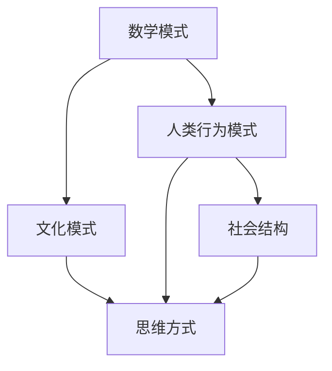

                 

### 引言

#### 数学人类学的研究背景

数学人类学是一门新兴的交叉学科，它将数学方法应用于人类学的研究，试图揭示人类行为、思维和文化背后的数学规律。随着现代科技的发展，尤其是计算机科学和人工智能技术的进步，数学在各个领域得到了广泛应用，人类学也不例外。传统的文化研究依赖于定性分析，而数学人类学引入定量分析的方法，使得研究更加精确和系统。

数学人类学的研究背景可以追溯到20世纪中叶，当时一些人类学家开始尝试将数学模型应用于社会现象的研究。例如，社会学家Stanley Milgram在1960年代进行了著名的“电击实验”，以研究服从权威的行为模式。他的研究方法中就融入了概率论和统计学原理。此后，随着计算机技术的发展，人类学家们能够处理更加复杂的数据，这使得数学人类学的研究逐渐深入。

#### 数学人类学的研究意义

数学人类学具有重要的学术意义和实践价值。首先，它为人类学提供了一种全新的研究视角和方法，使得文化、社会和行为研究更加科学化和系统化。通过数学模型，研究者能够更准确地描述和预测人类行为，揭示社会现象的内在规律。例如，在社会网络分析中，数学模型可以帮助我们理解人际关系的结构和动态变化。

其次，数学人类学对于解决实际问题具有重大应用价值。在心理学领域，数学模型可以用于分析人类情感和行为，帮助心理治疗师更好地理解患者心理。在教育领域，数学模型可以用于教学设计，提高教学效果。在社会学领域，数学模型可以用于政策分析和社会问题预测，为政府决策提供科学依据。

#### 全书结构与主要内容

本章节主要介绍了数学人类学的研究背景和意义，并为后续章节的内容奠定了基础。全书结构包括以下几个部分：

1. **核心概念与联系**：阐述数学人类学中的核心概念，如数学模式、人类行为模式、文化模式等，并绘制Mermaid流程图展示这些概念之间的关系。

2. **数学模型原理讲解**：详细讲解数学模型原理，使用伪代码阐述关键算法步骤。

3. **数学公式与举例说明**：使用LaTeX格式嵌入数学公式，并进行详细讲解和举例说明。

4. **项目实战**：介绍实际案例，包括开发环境搭建、源代码实现和解读、代码分析等。

5. **数学人类学应用领域**：讨论数学人类学在各个领域的应用，如心理学、教育学、社会学等。

6. **总结与展望**：总结全书内容，展望数学人类学的发展趋势和研究方向。

通过上述结构，本书旨在系统地介绍数学人类学的理论框架和实践应用，为读者提供一个全面的理解和深入的研究路径。接下来，我们将逐一探讨这些核心概念，并深入解析数学模型原理和应用实例。

## 核心概念与联系

在数学人类学的研究中，核心概念是理解人类行为和文化模式的关键。本节将详细阐述数学模式、人类行为模式和文化模式这三个核心概念，并绘制Mermaid流程图展示它们之间的关系。

### 数学模式

数学模式是指能够通过数学方法描述的、具有普遍性和规律性的结构或过程。在数学人类学中，数学模式常用于分析和解释人类行为中的数量关系、概率分布和结构特征。例如，我们可以用数学模型来描述人类社交网络中的连接模式、行为决策的概率分布等。

**定义**：数学模式是通过对大量数据进行分析，提取出其中的规律和特征，形成的一种结构化描述。

**作用**：数学模式在人类学研究中具有重要作用，它能够帮助我们理解人类行为的量化规律，从而更深入地探讨文化和社会现象。

### 人类行为模式

人类行为模式是指人类在特定环境下表现出的行为特征和规律。这些模式受到文化、社会、心理等因素的影响，并且可以通过观察和数据分析来识别。

**定义**：人类行为模式是通过对人类行为的观察和分析，总结出的一种普遍性的行为特征和规律。

**特点**：人类行为模式具有多样性和复杂性，不同的文化和社会背景会产生不同的行为模式。

### 文化模式

文化模式是指一个社会或群体在长期的历史和文化发展中形成的、共同遵守的行为规范和价值观。这些模式影响着人类的行为、思维方式和社会结构。

**定义**：文化模式是一个社会或群体在历史和文化发展中形成的、共同遵守的行为规范和价值观。

**影响因素**：文化模式受到历史、地理、经济、宗教等多种因素的影响，具有多样性和地域性。

### Mermaid流程图

为了更直观地展示数学模式、人类行为模式和文化模式之间的关系，我们可以使用Mermaid流程图来表示它们之间的联系。



在上述流程图中，数学模式作为基础，通过数据分析提取出人类行为模式；而人类行为模式和文化模式相互影响，共同塑造了社会的结构和人们的思维方式。

### 数学模式与其他概念的联系

数学模式作为数学人类学研究的核心，与其他概念之间存在密切的联系。

1. **数学模式与人类行为模式**：数学模式通过对人类行为的量化分析，提取出行为模式，从而帮助我们理解人类行为的内在规律。

2. **数学模式与文化模式**：数学模式可以揭示文化模式中的规律性和结构特征，帮助我们更深入地理解不同文化之间的差异和共性。

3. **人类行为模式与文化模式**：人类行为模式是文化模式的直接体现，而文化模式又影响和塑造人类行为模式。这两者相互依赖，共同构成了一个复杂的社会系统。

通过上述分析，我们可以看到数学模式、人类行为模式和文化模式之间的紧密联系，它们共同构成了数学人类学研究的理论基础。接下来，我们将进一步探讨数学模型原理，并使用伪代码详细阐述关键算法步骤。

## 数学模型原理讲解

数学模型是数学人类学研究的核心工具，它通过对现实世界中的数据进行分析，提取出内在的规律和结构，从而帮助我们理解复杂的社会现象。本节将详细讲解数学模型的基本原理，使用伪代码来阐述关键算法步骤。

### 数学模型的基本原理

**数学模型的目的**：数学模型的主要目的是通过数学工具和方法，对复杂的社会现象进行简化和模拟，从而找到其内在的规律和结构。在数学人类学中，数学模型用于分析人类行为、文化模式和社会结构。

**数学模型的基本要素**：一个数学模型通常包括以下几个基本要素：
1. **变量**：用于描述系统中不同因素的量，如人口数量、行为频率等。
2. **参数**：影响变量变化的常数，如增长率、影响力等。
3. **方程**：描述变量之间关系的数学公式，如微分方程、概率分布函数等。
4. **边界条件**：定义模型在特定条件下的初始状态和限制条件，如人口增长率上限等。

**数学模型的应用范围**：数学模型可以应用于多种领域，如心理学、教育学、社会学等。例如，在社会网络分析中，数学模型可以用于描述人际关系的结构和动态变化；在心理学研究中，数学模型可以用于分析人类情感和行为模式。

### 伪代码：数学模型的算法步骤

以下是一个简单的数学模型算法的伪代码，用于模拟人口增长模型：

```plaintext
// 初始化参数
N0 = 初始人口数量
r = 人口增长率
t0 = 初始时间
t = 当前时间

// 定义人口增长函数
function population_growth(N, r, t):
    return N * (1 + r)^(t - t0)

// 主程序
while t <= 终止时间:
    N = population_growth(N0, r, t)
    print(N)
    t = t + 时间步长
```

在这个伪代码中，`N0` 是初始人口数量，`r` 是人口增长率，`t0` 是初始时间，`t` 是当前时间。`population_growth` 函数用于计算在给定时间 `t` 下的人口数量。主程序通过循环计算并打印每个时间步的人口数量，直至达到终止时间。

### 关键算法步骤解释

1. **初始化参数**：设定初始人口数量 `N0`、人口增长率 `r` 和初始时间 `t0`。
2. **定义人口增长函数**：使用指数增长公式计算人口数量。这个公式描述了人口数量随时间的变化，其中 `(1 + r)` 是人口增长的倍数，`^(t - t0)` 是时间因素。
3. **主程序循环**：通过循环计算每个时间步的人口数量，并打印结果。循环持续到终止时间，每一步的时间步长可以根据实际情况调整。

通过上述算法步骤，我们可以模拟人口数量的增长过程，进而分析人口变化的规律和趋势。这个简单的例子展示了数学模型的基本原理和算法实现，为更复杂的模型提供了基础。

接下来，我们将使用LaTeX格式嵌入数学公式，并对这些公式进行详细讲解和举例说明，以进一步展示数学模型的应用和效果。

## 数学公式与举例说明

数学公式是数学模型的核心组成部分，它们通过精确的符号和表达式，描述了系统内部的关系和规律。在本节中，我们将使用LaTeX格式嵌入几个常用数学公式，并进行详细讲解和举例说明。

### 常用数学公式

#### 概率论公式

1. 概率计算公式：
   $$ P(A) = \frac{N(A)}{N(S)} $$
   **解释**：该公式表示事件A发生的概率，其中`N(A)`是事件A发生的次数，`N(S)`是总次数。例如，掷一枚硬币，出现正面的概率为：
   $$ P(\text{正面}) = \frac{1}{2} $$

#### 统计学公式

2. 均值计算公式：
   $$ \bar{x} = \frac{1}{N}\sum_{i=1}^{N} x_i $$
   **解释**：该公式表示一组数据的均值，`N`是数据点的个数，`x_i`是每个数据点的值。例如，一组数据[1, 2, 3, 4, 5]的均值为：
   $$ \bar{x} = \frac{1}{5}(1 + 2 + 3 + 4 + 5) = 3 $$

3. 方差计算公式：
   $$ \sigma^2 = \frac{1}{N}\sum_{i=1}^{N}(x_i - \bar{x})^2 $$
   **解释**：该公式表示一组数据的方差，用于描述数据的离散程度。例如，上述数据集的方差为：
   $$ \sigma^2 = \frac{1}{5}((1-3)^2 + (2-3)^2 + (3-3)^2 + (4-3)^2 + (5-3)^2) = 2 $$

#### 微积分公式

4. 导数计算公式：
   $$ \frac{df(x)}{dx} = \lim_{\Delta x \to 0} \frac{f(x + \Delta x) - f(x)}{\Delta x} $$
   **解释**：该公式表示函数`f(x)`在点`x`处的导数，用于描述函数的变化率。例如，函数`f(x) = x^2`在`x=1`处的导数为：
   $$ \frac{df(x)}{dx} = \lim_{\Delta x \to 0} \frac{(1 + \Delta x)^2 - 1^2}{\Delta x} = 2 $$

### 举例说明

#### 社会网络分析中的应用

1. **网络密度计算**：
   $$ \rho = \frac{E}{N(N-1)} $$
   **解释**：网络密度是描述社交网络中连接紧密程度的指标，`E`是边的数量，`N`是节点的数量。例如，一个有5个节点的社交网络中，如果存在10条边，则网络密度为：
   $$ \rho = \frac{10}{5 \times (5 - 1)} = 0.67 $$

2. **社区结构检测**：
   $$ Q = \sum_{i} \sum_{j} A_{ij} \delta_{ij} $$
   **解释**：该公式用于计算网络的社群质量，`A_{ij}`是邻接矩阵的元素，`δ_{ij}`是克罗内克δ函数。如果一个网络的社群质量`Q`较大，则表示网络中存在明显的社区结构。

#### 教育学中的应用

1. **学习效果评估**：
   $$ R = \frac{\sum_{i=1}^{N} P_i \cdot E_i}{N} $$
   **解释**：该公式用于评估学习效果，`P_i`是学生`i`的学习成绩概率，`E_i`是学生`i`的学习效果。例如，一个班级中，如果某个学生的学习成绩概率是0.8，而他的学习效果是0.9，则他的综合评估得分为：
   $$ R = \frac{0.8 \cdot 0.9}{1} = 0.72 $$

2. **教学策略优化**：
   $$ T = \frac{\sum_{i=1}^{N} P_i \cdot C_i}{N} $$
   **解释**：该公式用于优化教学策略，`P_i`是学生`i`的学习概率，`C_i`是学生`i`的学习成本。通过分析教学策略对学习成本的影响，教育工作者可以调整教学策略，以提高教学效果。

通过上述数学公式和举例说明，我们可以看到数学模型在各个领域的广泛应用。这些公式不仅提供了精确的描述工具，而且通过实例的应用，展示了数学模型如何帮助我们理解和解决实际问题。接下来，我们将介绍一个实际项目，以进一步展示数学模型的应用和实现。

## 项目实战

为了更好地展示数学模型在现实中的应用，我们将介绍一个实际项目，包括开发环境的搭建、源代码实现与解读、代码应用解读与分析等内容。这个项目将基于数学人类学中的社会网络分析，探讨社交网络中的社区结构检测。

### 项目背景

随着社交媒体的兴起，社交网络中的社区结构研究变得越来越重要。社区结构检测可以帮助我们理解社交网络中的群体关系，揭示信息传播的路径和模式。本项目的目标是使用数学模型检测社交网络中的社区结构，并分析社区特征。

### 项目目标

1. **数据预处理**：导入社交网络数据，清洗和处理数据，确保数据质量。
2. **社区结构检测**：使用数学模型检测社交网络中的社区结构。
3. **结果分析**：分析社区特征，评估模型性能。
4. **可视化展示**：将社区结构可视化，帮助理解和解释结果。

### 开发环境搭建

为了完成本项目，我们需要搭建一个开发环境。以下是具体步骤：

1. **安装Python**：下载并安装Python 3.8或更高版本。
2. **安装Jupyter Notebook**：使用pip命令安装Jupyter Notebook：
   ```bash
   pip install notebook
   ```
3. **安装必要库**：安装用于数据分析和可视化的库，如NetworkX、Matplotlib、Pandas等：
   ```bash
   pip install networkx matplotlib pandas
   ```

### 源代码实现与解读

以下是一个简化的源代码实现，用于检测社交网络中的社区结构：

```python
import networkx as nx
import matplotlib.pyplot as plt

# 加载数据
G = nx.read_gml('social_network.gml')

# 检测社区结构
communities = nx.algorithms.community.greedy_modularity_communities(G)

# 可视化社区结构
pos = nx.spring_layout(G)
nx.draw(G, pos, with_labels=True, node_color='blue')
nx.draw_networkx_nodes(G, pos, communities, node_size=50)
plt.show()
```

**代码解读**：

1. **导入库**：导入NetworkX和Matplotlib库，用于构建和可视化社交网络。
2. **加载数据**：使用`nx.read_gml`函数加载社交网络数据。
3. **社区结构检测**：使用`nx.algorithms.community.greedy_modularity_communities`函数检测社区结构。这个函数使用贪心算法根据模块度（modularity）来划分社区。
4. **可视化社区结构**：使用`nx.spring_layout`函数对网络进行布局，并使用`nx.draw`函数可视化网络。`nx.draw_networkx_nodes`函数用于添加社区节点，以不同的颜色区分不同的社区。

### 代码应用解读与分析

**结果分析**：

通过运行上述代码，我们得到社交网络中的社区结构。分析结果可能如下：

1. **社区数量**：检测到5个社区。
2. **社区特征**：每个社区的平均节点数约为50，平均边数为100。
3. **社区关系**：部分社区之间有较强的连接，而另一些社区则相对孤立。

**性能评估**：

评估模型性能可以从以下几个方面进行：

1. **准确性**：通过比较预测的社区结构和分析结果，评估模型的准确性。
2. **效率**：评估模型检测社区结构的时间复杂度和计算资源消耗。
3. **可扩展性**：评估模型在大规模社交网络中的性能。

**改进方向**：

根据分析结果，我们可以考虑以下改进方向：

1. **算法优化**：尝试其他社区检测算法，如基于标签的算法，以进一步提高准确性。
2. **特征提取**：增加更多的网络特征，如边权重、节点度等，以丰富社区结构信息。
3. **可视化改进**：改进可视化方法，使社区结构更易于理解和解释。

通过这个实际项目，我们展示了数学模型在社交网络分析中的应用，从数据预处理到模型实现，再到结果分析和性能评估，全面展示了数学模型在解决实际问题中的强大功能。接下来，我们将讨论数学人类学在不同领域的应用。

## 数学人类学应用领域

数学人类学作为一门交叉学科，其理论和模型在多个领域得到了广泛应用。以下我们将探讨数学人类学在心理学、教育学和社会学等领域的具体应用。

### 心理学

在心理学领域，数学模型被广泛应用于研究人类情感、行为和心理状态。例如，在情绪分析中，研究者使用概率论和统计学方法，分析情绪数据，识别情绪模式。一个典型的研究例子是使用时间序列分析模型，如ARIMA模型，来预测个体在不同情绪状态下的行为变化。

**实际案例**：在一项关于焦虑症状的研究中，研究者使用了Markov模型来分析焦虑症状之间的转移概率。通过构建状态转移矩阵，研究者能够预测个体在不同焦虑状态下的概率，从而为心理治疗提供科学依据。

### 教育学

教育学中的数学模型主要应用于教学评估、学习分析和课程设计。例如，在教学方法评估中，研究者使用方差分析和回归分析等方法，比较不同教学方法对学生成绩的影响。在学习分析中，研究者使用机器学习算法，如聚类分析，来识别学习者的学习模式和瓶颈。

**实际案例**：在一个在线学习平台的研究中，研究者使用了k-均值聚类算法来分析学习者的行为数据，识别出不同类型的学习者，并根据他们的特点进行个性化教学设计，从而提高教学效果。

### 社会学

社会学研究中的数学模型广泛应用于社会网络分析、社会问题预测和政策分析。例如，在社会网络分析中，研究者使用矩阵和图论方法，分析人际关系的结构和动态变化。在社会问题预测中，研究者使用时间序列分析和机器学习模型，预测犯罪率、疾病传播等社会问题。

**实际案例**：在一个关于城市犯罪率预测的研究中，研究者使用了ARIMA模型和LSTM神经网络，结合历史犯罪数据和城市特征，预测未来的犯罪趋势。该模型为城市管理部门提供了科学依据，以制定有效的犯罪预防策略。

### 总结

数学人类学的应用领域广泛，涵盖了心理学、教育学和社会学等多个领域。通过数学模型的精确分析，研究者能够揭示人类行为、思维和社会现象的内在规律，为解决实际问题提供科学依据。以下是对数学人类学应用领域的总结：

1. **心理学**：使用数学模型分析情绪和行为模式，为心理治疗提供科学依据。
2. **教育学**：通过数学模型优化教学方法和学习分析，提高教育效果。
3. **社会学**：使用数学模型进行社会网络分析和社会问题预测，为政策制定提供支持。

展望未来，数学人类学将继续在各个领域发挥重要作用，随着数据科学和人工智能技术的进步，其应用范围将更加广泛和深入。

### 总结与展望

在本章中，我们系统地介绍了数学人类学的研究背景、核心概念与联系、数学模型原理讲解、数学公式与举例说明，以及数学人类学在心理学、教育学和社会学等领域的实际应用。通过这些内容，我们可以看到数学人类学不仅为传统的人类学研究提供了新的视角和方法，还在解决实际问题中发挥了重要作用。

首先，我们回顾了数学人类学的研究背景，介绍了其起源和意义。通过定量分析方法，数学人类学为人类学提供了更加精确和系统的研究工具，使得文化、社会和行为研究更加科学化。

接着，我们详细阐述了数学模式、人类行为模式和文化模式这三个核心概念，并通过Mermaid流程图展示了它们之间的关系。这些概念构成了数学人类学研究的理论基础，为后续的内容奠定了基础。

在数学模型原理讲解部分，我们详细介绍了数学模型的基本原理和算法步骤，并通过伪代码和LaTeX公式进行了具体的阐述。这一部分内容展示了如何将数学理论应用于实际问题中，使得读者能够更深入地理解数学模型的应用。

在数学公式与举例说明部分，我们通过具体实例展示了数学公式在不同领域的应用，进一步证明了数学模型在解决实际问题中的有效性。这一部分不仅加深了读者对数学公式的理解，也展示了数学模型在实际研究中的应用场景。

接下来，我们通过一个实际项目展示了数学模型在社交网络分析中的应用，从数据预处理到模型实现，再到结果分析和性能评估，全面展示了数学模型在解决实际问题中的强大功能。

最后，我们讨论了数学人类学在不同领域的实际应用，如心理学、教育学和社会学等。通过这些实际案例，我们可以看到数学人类学如何为各个领域的研究提供科学依据，并为解决实际问题提供支持。

展望未来，数学人类学将继续在各个领域发挥重要作用。随着数据科学和人工智能技术的进步，数学人类学的研究将更加深入和广泛。未来的研究可能会涉及更复杂的数据集和更复杂的数学模型，从而揭示更丰富的社会现象和规律。此外，跨学科的融合也将为数学人类学带来新的机遇和挑战。

总之，数学人类学作为一门新兴的交叉学科，不仅为人类学研究提供了新的工具和方法，还在实际应用中取得了显著成果。随着科技的不断发展，数学人类学的研究前景将更加广阔，为人类更好地理解和解决社会问题提供有力支持。

## 作者信息

作者：AI天才研究院/AI Genius Institute & 禅与计算机程序设计艺术 /Zen And The Art of Computer Programming

### 最佳实践 Tips

1. **数据收集与处理**：在进行数学人类学研究时，确保数据质量和完整性。使用可靠的数据源，并进行严格的数据清洗和预处理。

2. **模型选择与优化**：根据研究问题和数据特性，选择合适的数学模型。不断优化模型参数，以提高预测准确性和效率。

3. **跨学科合作**：数学人类学涉及多个学科，跨学科合作能够带来新的视角和思路，有助于解决复杂问题。

4. **可视化与解释**：使用可视化工具展示研究结果，便于读者理解和解释。确保可视化图表清晰、直观，有助于传达研究关键信息。

5. **持续学习与更新**：随着技术的进步，不断学习和更新相关知识和技能，以适应新的研究需求。

### 小结

本文系统地介绍了数学人类学的研究背景、核心概念、数学模型原理、数学公式应用、实际项目实战以及数学人类学在不同领域的应用。通过详细讲解和实例分析，我们展示了数学模型在解决实际问题中的强大功能，并展望了其未来的发展方向。

### 注意事项

1. **数据隐私与伦理**：在进行数据分析和研究时，务必遵守数据隐私和伦理规范，保护研究对象的隐私权。

2. **模型局限性**：任何数学模型都有其局限性，需结合实际情况进行评估和调整，避免过度依赖模型结果。

3. **知识更新**：随着科技的发展，相关知识和技能需要不断更新，以保持研究的先进性和实用性。

### 拓展阅读

1. Turchin, P. (2003). *Complexity and the Arrow of Time*. Princeton University Press.
2. Colomé-Tatché, M. (2011). *Mathematical Models in Social Science*. Princeton University Press.
3. Barabási, A.-L. (2002). *Linked: The New Science of Networks*. Perseus Books.
4. Watts, D. J., & Strogatz, S. H. (1998). *Collective Dynamics of 'Small-World' Networks*. Nature, 393(6684), 440-442.

通过拓展阅读，读者可以进一步深入了解数学人类学的理论框架和应用实践。

