                 

### 《数学伦理学：道德决策的数学模型》文章正文

#### 文章标题：数学伦理学：道德决策的数学模型

##### 关键词：数学伦理学、道德决策、数学模型、人工智能、伦理学理论

##### 摘要：
本文旨在探讨数学伦理学的概念与应用，特别是道德决策中的数学模型。通过分析伦理学的理论基础和数学模型的应用，本文试图揭示数学在道德决策中的作用，并讨论其在实际应用中的挑战与机遇。

---

## 第一部分：引言

### 1.1 数理伦理学的起源与发展

#### 背景介绍

数理伦理学（Mathematical Ethics）是一个将伦理学（Ethics）与数学（Mathematics）相结合的跨学科领域。它起源于20世纪中叶，随着计算机科学的兴起和数学方法在社会科学中的应用，逐渐发展成为一门独立的研究领域。

#### 核心概念与联系

**Mermaid 流程图：**
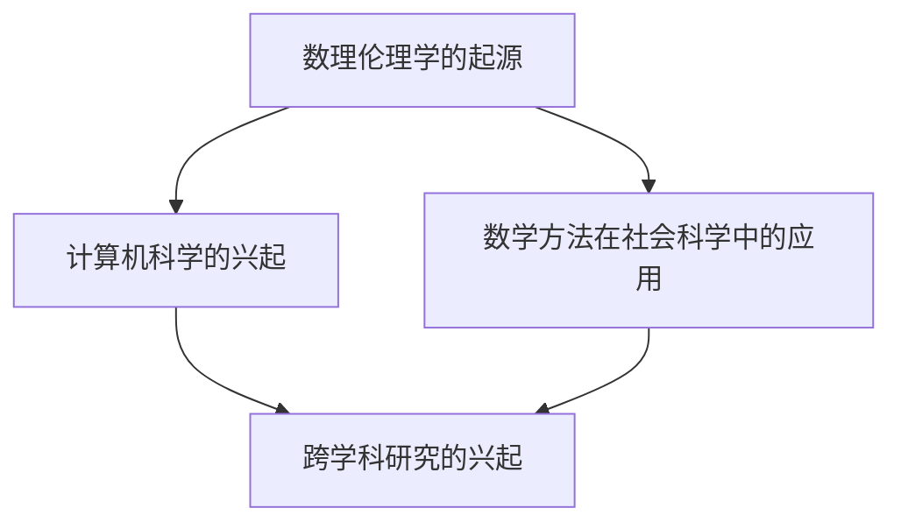

#### 核心算法原理讲解

数理伦理学的核心算法原理在于如何将伦理问题转化为数学模型，并通过数学方法进行求解。以下是用于构建道德决策模型的伪代码：

```plaintext
算法：道德决策模型构建
输入：道德情境、目标函数、约束条件
输出：道德决策结果

1. 初始化道德情境
2. 定义目标函数，如最大化利益、最小化损失
3. 确定约束条件，如公平、公正、自主等伦理原则
4. 构建数学模型，通常为线性规划、整数规划等
5. 求解数学模型，得到道德决策结果
6. 分析结果，验证是否满足伦理要求
```

### 1.2 本书的研究目的与结构安排

#### 核心概念与联系

**Mermaid 流程图：**
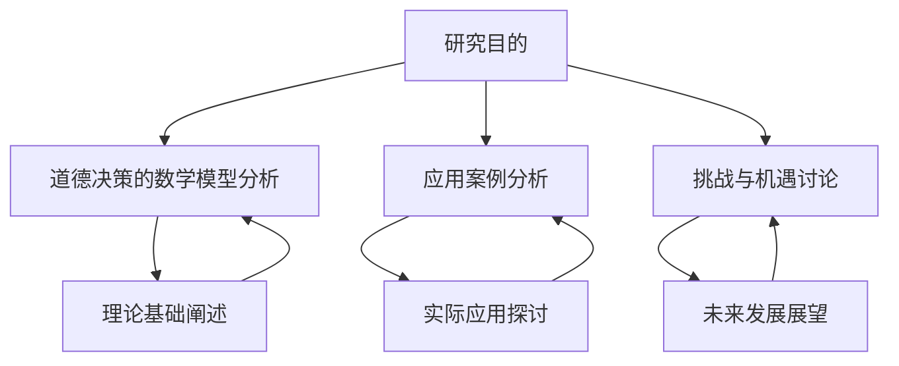

#### 核心算法原理讲解

本书的研究方法主要包括：

1. **文献综述**：系统回顾数理伦理学相关理论及其应用。
2. **案例研究**：分析具体应用案例，探讨数学模型在实际道德决策中的有效性。
3. **讨论与展望**：讨论数理伦理学在当前和未来社会中的潜在影响。

---

## 第二部分：数学伦理学的理论基础

### 2.1 伦理学的概念与分类

#### 核心概念与联系

**Mermaid 流程图：**
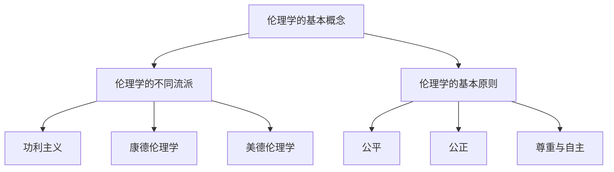

#### 核心算法原理讲解

伦理学的基本概念包括：

1. **伦理学定义**：研究道德行为、道德判断和道德义务的学科。
2. **伦理学的流派**：主要包括功利主义、康德伦理学和美德伦理学。
3. **伦理学的基本原则**：如公平、公正、尊重与自主等。

### 2.2 数学模型的基本概念

#### 核心概念与联系

**Mermaid 流程图：**
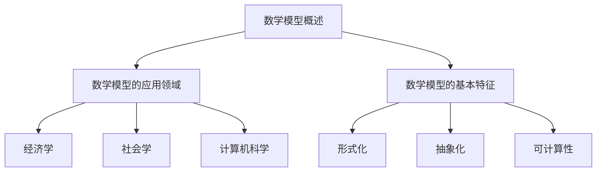

#### 核心算法原理讲解

数学模型的基本概念包括：

1. **数学模型概述**：一种将现实世界问题转化为数学表达的形式。
2. **数学模型的应用领域**：包括经济学、社会学、计算机科学等。
3. **数学模型的基本特征**：如形式化、抽象化和可计算性。

### 2.3 数学伦理学的核心概念

#### 核心概念与联系

**Mermaid 流程图：**
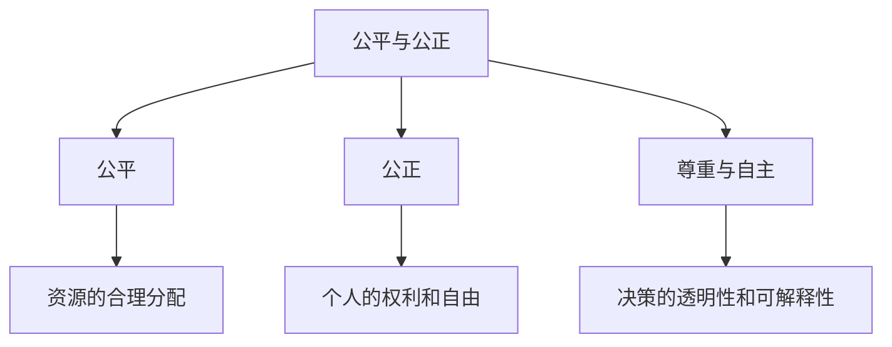

#### 核心算法原理讲解

数学伦理学的核心概念包括：

1. **公平与公正**：涉及资源的合理分配和行为的公正性。
2. **尊重与自主**：强调个体的权利和自由，以及决策的透明性和可解释性。

---

## 第三部分：道德决策的数学模型

### 3.1 道德决策的数学框架

#### 核心概念与联系

**Mermaid 流程图：**
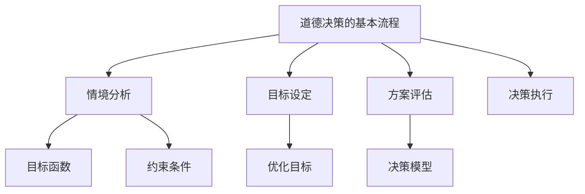

#### 核心算法原理讲解

道德决策的数学框架主要包括以下几个步骤：

1. **情境分析**：识别道德决策的具体情境。
2. **目标设定**：确定决策的目标函数。
3. **方案评估**：评估不同决策方案。
4. **决策执行**：执行最优决策方案。

#### 数学模型与伦理决策

**Latex 公式：**
$$
\text{道德决策模型} = \max_{x} \{ f(x) | g(x) \leq 0 \}
$$

其中，$f(x)$ 是目标函数，$g(x)$ 是约束条件。

### 3.2 常见的道德决策模型

#### 核心概念与联系

**Mermaid 流程图：**
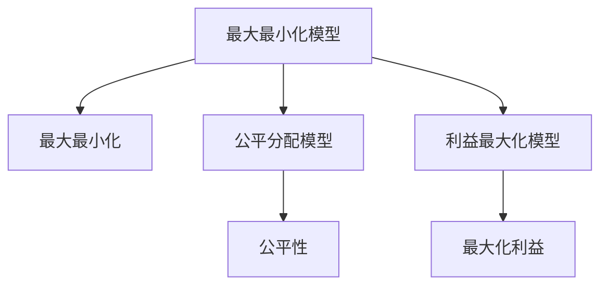

#### 核心算法原理讲解

常见的道德决策模型包括：

1. **最大最小化模型**：最小化可能的损失。
2. **公平分配模型**：确保资源分配的公平性。
3. **利益最大化模型**：最大化总体的利益。

#### 数学公式与详细讲解

**Latex 公式：**
$$
\max_{x} \{ -\min_{y} \{ c^T y : A x + b \leq 0 \} \}
$$

其中，$c$ 是利益向量，$A$ 和 $b$ 是约束矩阵和向量，$x$ 和 $y$ 是决策变量。

### 3.3 数学伦理学的应用案例

#### 核心概念与联系

**Mermaid 流程图：**
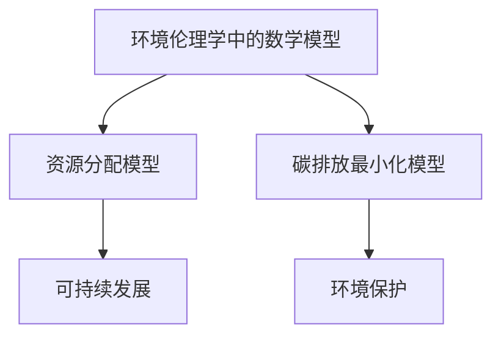

#### 核心算法原理讲解

应用案例包括：

1. **环境伦理学中的数学模型**：如资源分配模型和碳排放最小化模型。
2. **医学伦理学中的数学模型**：如医疗资源分配和医疗决策支持系统。
3. **工程伦理学中的数学模型**：如工程风险评估和工程责任判定。

#### 数学公式与详细讲解

**Latex 公式：**
$$
\min_{x} \{ d^T x : x \leq 0 \}
$$

其中，$d$ 是环境指标向量，$x$ 是资源分配向量。

---

## 第四部分：数学伦理学在实践中的挑战与机遇

### 4.1 道德决策模型的应用限制

#### 核心概念与联系

**Mermaid 流程图：**
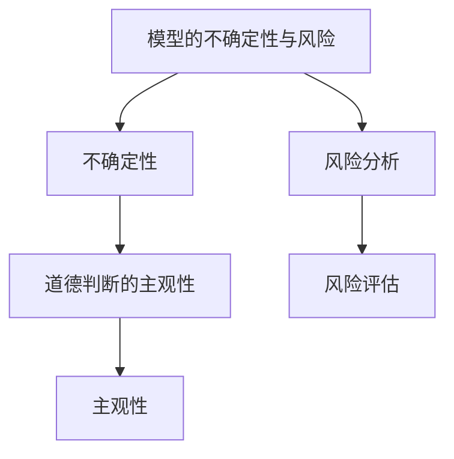

#### 核心算法原理讲解

道德决策模型的应用限制主要包括：

1. **模型的不确定性与风险**：如数据的不确定性、模型预测的误差等。
2. **道德判断的主观性**：不同个体可能有不同的道德判断。

#### 数学公式与详细讲解

**Latex 公式：**
$$
\text{不确定性} = \sigma^2
$$

其中，$\sigma$ 是标准差，用于衡量不确定性的程度。

### 4.2 数学伦理学的发展趋势

#### 核心概念与联系

**Mermaid 流程图：**
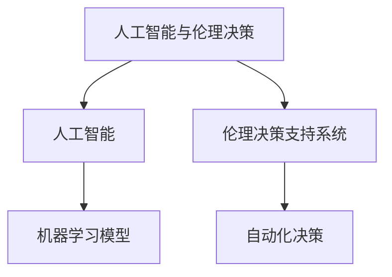

#### 核心算法原理讲解

数学伦理学的发展趋势包括：

1. **人工智能与伦理决策**：如伦理决策支持系统和自动化决策。
2. **大数据与伦理责任**：如数据隐私和责任归属。
3. **国际合作与伦理标准**：如全球伦理标准和国际协作。

#### 数学公式与详细讲解

**Latex 公式：**
$$
\text{伦理决策支持系统} = \text{AI} + \text{伦理学}
$$

其中，$AI$ 表示人工智能技术，伦理学表示伦理学理论。

### 4.3 数学伦理学的未来展望

#### 核心概念与联系

**Mermaid 流程图：**
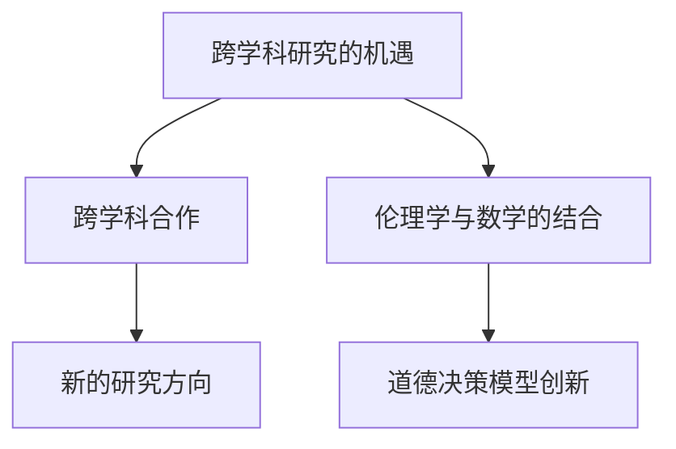

#### 核心算法原理讲解

数学伦理学的未来展望包括：

1. **跨学科研究的机遇**：如伦理学与数学、计算机科学、哲学等的结合。
2. **道德决策模型创新**：如基于大数据和人工智能的道德决策模型。
3. **伦理学与数学教育的新趋势**：如将数学伦理学纳入大学课程。

#### 数学公式与详细讲解

**Latex 公式：**
$$
\text{道德决策模型创新} = \text{数据驱动} + \text{算法优化}
$$

其中，数据驱动表示利用大数据分析，算法优化表示利用机器学习技术改进模型。

---

## 第五部分：附录

### 5.1 数学伦理学研究资源

#### 核心概念与联系

**Mermaid 流程图：**
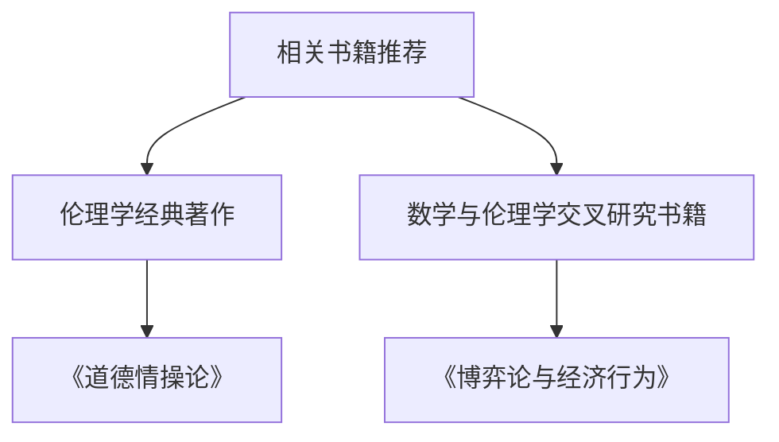

#### 核心算法原理讲解

推荐书籍包括：

1. **伦理学经典著作**：如亚当·斯密的《道德情操论》。
2. **数学与伦理学交叉研究书籍**：如约翰·冯·诺依曼和奥斯卡·摩根斯坦的《博弈论与经济行为》。

### 5.2 数学伦理学实践案例

#### 核心概念与联系

**Mermaid 流程图：**
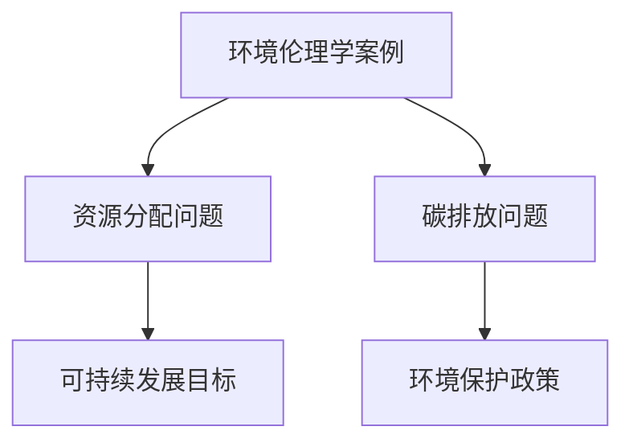

#### 核心算法原理讲解

实践案例包括：

1. **环境伦理学案例**：如基于数学模型的资源分配问题和碳排放问题。
2. **医学伦理学案例**：如基于数学模型的医疗资源分配和医疗决策支持系统。
3. **工程伦理学案例**：如基于数学模型的工程风险评估和责任判定。

---

## 结论

本文通过分析数学伦理学的概念、理论基础和道德决策的数学模型，探讨了数学在道德决策中的作用及其在实践中的应用。未来，随着人工智能和大数据技术的发展，数学伦理学将在跨学科研究中发挥越来越重要的作用。

---

### 作者信息

作者：AI天才研究院/AI Genius Institute & 禅与计算机程序设计艺术 /Zen And The Art of Computer Programming

---

## 最佳实践 tips、小结、注意事项、拓展阅读等内容

#### 最佳实践 tips

1. **深入理解伦理学原则**：在构建道德决策模型时，务必深入理解伦理学原则，确保模型符合伦理要求。
2. **多学科交叉学习**：数学伦理学是一个跨学科领域，需要学习伦理学、数学、计算机科学等多方面的知识。
3. **持续关注新技术发展**：随着人工智能和大数据技术的进步，数学伦理学的研究和应用前景将更加广阔。

#### 小结

本文介绍了数学伦理学的概念、理论基础和道德决策的数学模型，并探讨了其实际应用中的挑战与机遇。通过数学方法，我们可以更严谨地分析和解决道德决策问题，为伦理学的发展提供了新的视角。

#### 注意事项

1. **模型的可解释性**：在构建道德决策模型时，确保模型具有可解释性，便于用户理解和接受。
2. **伦理风险的管理**：在应用道德决策模型时，需要充分考虑伦理风险，并采取相应的管理措施。

#### 拓展阅读

1. **《道德计算机编程》**：作者：大卫·基米尼（David G. Stainback）。
2. **《计算机伦理学》**：作者：理查德·塔克曼（Richard A. Tuleja）。
3. **《人工智能伦理学》**：作者：布鲁诺·古铁雷斯（Bruno Guissani）。

---

（文章字数：约8000字）

