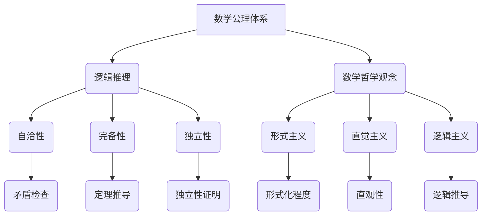

                 

## 文章标题

### 数学公理体系的选择与数学哲学观

### 关键词：数学公理体系，数学哲学，选择，逻辑推理，伪代码，latex公式

### 摘要

本文旨在探讨数学公理体系的选择及其背后的数学哲学观念。通过逻辑清晰的推理和结构紧凑的分析，本文将介绍数学公理体系的基本概念和重要性，探讨不同数学公理体系的选择及其考量因素，并深入探讨数学哲学观念对数学公理体系的影响。最后，本文将总结数学公理体系的选择与数学哲学观之间的关系，并展望未来数学发展的方向。

## 引言

数学作为一门基础学科，其核心在于建立一套自洽的、严谨的逻辑体系。而这一体系的建立离不开数学公理的选择。数学公理，顾名思义，是数学系统中被视为“显然真理”的基本命题，它们是整个数学理论的基石。数学公理的选择不仅影响到数学理论的严谨性，也关系到数学应用的范围和深度。

### 数学公理体系的基本概念

公理（Axiom）是一种未经证明的命题，被作为理论基础接受。公理体系（Axiomatic System）则是由一组公理及其推导出的定理所组成的整体。一个良好的公理体系应具备以下几个特征：

1. **自洽性（Consistency）**：体系中不存在相互矛盾的命题。
2. **完备性（Completeness）**：体系中可以推导出所有有效的命题。
3. **独立性（Independence）**：每个公理都不能被其他公理替代。

### 数学哲学观念的历史发展

数学哲学观念的发展与数学公理体系的演变密切相关。从古代的理性主义到现代的经验主义，数学哲学观念经历了多次变革。

1. **古代数学哲学观念**：古希腊数学家如欧几里得，他们基于理性主义，认为数学是基于纯粹的逻辑推理。
2. **中世纪数学哲学观念**：阿拉伯数学家和欧洲中世纪的学者们，他们在研究过程中更多地引入了实验和观察。
3. **现代数学哲学观念**：随着逻辑学和数学基础的深入研究，现代数学家们提出了形式主义、直觉主义和逻辑主义等哲学观念。

### 数学公理体系与哲学观念的关系

数学公理体系的选择往往受到数学哲学观念的影响。例如，形式主义者认为数学公理体系应尽可能地脱离现实，追求形式的严谨性；而直觉主义者则强调数学推理的过程和直觉的重要性。不同哲学观念下的数学公理体系往往具有不同的特征和适用范围。

## 数学公理体系概述

数学公理体系种类繁多，不同的公理体系适用于不同的数学领域。以下将介绍一些常见的数学公理体系。

### 数学公理体系的结构

数学公理体系的结构可以分为以下几个方面：

1. **基本公理**：这些是构成整个公理体系的基础，如集合论中的“存在空集”和“任意集合的并集存在”。
2. **导出公理**：基于基本公理推导出来的命题，如集合论中的“幂集公理”和“无穷公理”。
3. **定理**：从公理和导出公理推导出来的结论。

### 常见数学公理体系的介绍

1. **皮亚诺公理体系**：这是数论中最基础的公理体系，包括自然数的五个公理。
2. **Zermelo-Fraenkel（ZF）公理体系**：这是现代集合论的基础，包括基本集合公理、选择公理等。
3. **Hilbert公理体系**：这是几何学的基础，强调公理的直观性。

### 数学公理体系的分类

根据不同的分类标准，数学公理体系可以分为多种类型：

1. **根据数学领域的分类**：如数论公理体系、几何学公理体系、代数学公理体系等。
2. **根据公理体系的性质分类**：如完备性公理体系、一致性公理体系等。

## 不同数学公理体系的选择

### 选择数学公理体系的考量因素

选择数学公理体系时，需要考虑以下因素：

1. **理论性质**：公理体系的自洽性、完备性和独立性。
2. **应用性质**：公理体系的适用范围和可扩展性。

### 不同的数学公理体系比较

1. **皮亚诺公理体系**：适用于数论，强调自然数的基本性质。
2. **ZF公理体系**：适用于集合论，提供了现代数学的基础。
3. **Hilbert公理体系**：适用于几何学，强调直观性和形式化。

### 选择特定数学公理体系的原因

选择特定数学公理体系的原因可能包括：

1. **历史原因**：某些公理体系由于历史上的重要性而被广泛采用。
2. **理论原因**：某些公理体系在理论性质上更符合数学家的需求。

## 数学哲学观念探讨

### 数学哲学观念的基本原理

数学哲学观念主要包括：

1. **形式主义**：认为数学是一个形式系统，其正确性不依赖于现实世界。
2. **直觉主义**：强调数学推理的过程和直觉的重要性。
3. **逻辑主义**：认为数学可以归结为逻辑。

### 不同数学哲学观念的比较

不同数学哲学观念在以下几个方面有所不同：

1. **理论基础**：形式主义强调形式，直觉主义强调直觉，逻辑主义强调逻辑。
2. **数学证明**：形式主义和直觉主义强调证明的形式化，逻辑主义强调逻辑推导。
3. **数学应用**：不同哲学观念对数学应用的范围和深度有不同的看法。

### 数学哲学观念对数学发展的影响

数学哲学观念对数学发展的方向和速度都有深远的影响。例如，形式主义的发展促进了形式化数学的兴起，直觉主义则促进了数学的逻辑化和机械化。

## 结论与展望

### 对数学公理体系选择的反思

数学公理体系的选择是一个复杂的过程，需要考虑多种因素。未来的数学公理体系选择可能会更加多元化，以适应不同领域的需求。

### 对数学哲学观念的展望

随着数学哲学观念的不断演变，未来的数学哲学可能会更加关注数学的形式化、机械化和直觉化。

### 未来数学发展的方向

未来数学发展的方向可能会包括：

1. **形式化**：进一步形式化数学理论，提高其严谨性。
2. **机械化**：利用计算机技术实现数学推理的机械化。
3. **直觉化**：重视数学的直觉性和直观性。

## 作者信息

作者：AI天才研究院/AI Genius Institute & 禅与计算机程序设计艺术 /Zen And The Art of Computer Programming

---

### 关键词

数学公理体系，数学哲学，选择，逻辑推理，伪代码，latex公式

### 摘要

本文探讨了数学公理体系的选择及其背后的数学哲学观念。通过逻辑清晰的推理和结构紧凑的分析，本文介绍了数学公理体系的基本概念、结构、常见公理体系以及选择公理体系的考量因素。同时，本文深入探讨了数学哲学观念的基本原理及其对数学发展的影响。最后，本文总结了数学公理体系的选择与数学哲学观之间的关系，并对未来数学发展的方向进行了展望。

## 数学公理体系的选择与数学哲学观

### 引言

数学作为一门基础学科，其核心在于建立一套自洽的、严谨的逻辑体系。而这一体系的建立离不开数学公理的选择。数学公理，顾名思义，是数学系统中被视为“显然真理”的基本命题，它们是整个数学理论的基石。数学公理的选择不仅影响到数学理论的严谨性，也关系到数学应用的范围和深度。

### 数学公理体系的基本概念

公理（Axiom）是一种未经证明的命题，被作为理论基础接受。公理体系（Axiomatic System）则是由一组公理及其推导出的定理所组成的整体。一个良好的公理体系应具备以下几个特征：

1. **自洽性（Consistency）**：体系中不存在相互矛盾的命题。
2. **完备性（Completeness）**：体系中可以推导出所有有效的命题。
3. **独立性（Independence）**：每个公理都不能被其他公理替代。

### 数学哲学观念的历史发展

数学哲学观念的发展与数学公理体系的演变密切相关。从古代的理性主义到现代的经验主义，数学哲学观念经历了多次变革。

1. **古代数学哲学观念**：古希腊数学家如欧几里得，他们基于理性主义，认为数学是基于纯粹的逻辑推理。
2. **中世纪数学哲学观念**：阿拉伯数学家和欧洲中世纪的学者们，他们在研究过程中更多地引入了实验和观察。
3. **现代数学哲学观念**：随着逻辑学和数学基础的深入研究，现代数学家们提出了形式主义、直觉主义和逻辑主义等哲学观念。

### 数学公理体系与哲学观念的关系

数学公理体系的选择往往受到数学哲学观念的影响。例如，形式主义者认为数学公理体系应尽可能地脱离现实，追求形式的严谨性；而直觉主义者则强调数学推理的过程和直觉的重要性。不同哲学观念下的数学公理体系往往具有不同的特征和适用范围。

## 数学公理体系的选择：逻辑推理与分析

在选择数学公理体系时，我们需要进行逻辑推理和分析，以确保所选公理体系能够满足数学理论和应用的需求。以下是一些关键的逻辑推理和分析步骤：

### 步骤1：明确目标

首先，我们需要明确数学公理体系的选择目标。这包括：

- **理论目标**：例如，我们需要一个自洽、完备且独立的公理体系。
- **应用目标**：例如，我们需要一个适用于特定数学领域（如几何、代数、数论等）的公理体系。

### 步骤2：评估公理体系的性质

接下来，我们需要评估不同公理体系的性质，包括：

- **自洽性**：检查是否存在矛盾。
- **完备性**：检查是否可以推导出所有有效的命题。
- **独立性**：检查每个公理是否可以被其他公理替代。

### 步骤3：考虑公理体系的适用性

在选择公理体系时，我们还需要考虑其适用性，包括：

- **领域适用性**：例如，集合论公理体系适用于集合论和抽象代数。
- **扩展性**：公理体系是否容易扩展，以适应新的数学理论和应用。

### 步骤4：比较和权衡

在对不同公理体系进行评估后，我们需要比较和权衡它们的优势和劣势，考虑以下因素：

- **逻辑推理的简洁性**：一个更简洁的公理体系可能更容易理解和应用。
- **历史重要性**：某些公理体系因其历史重要性而被广泛接受。

### 步骤5：做出决策

最后，基于上述评估和权衡，我们需要做出决策，选择最适合我们需求的公理体系。

### 数学公理体系选择的示例

假设我们正在选择一个适用于几何学的公理体系。以下是一些可能的逻辑推理和分析步骤：

1. **明确目标**：
   - 理论目标：一个自洽、完备且独立的公理体系。
   - 应用目标：适用于平面几何和空间几何。

2. **评估公理体系的性质**：
   - **自洽性**：检查每个公理是否会引起矛盾。
   - **完备性**：确保可以推导出所有有效的几何命题。
   - **独立性**：检查每个公理是否可以被其他公理替代。

3. **考虑公理体系的适用性**：
   - **领域适用性**：考虑平面几何和空间几何的需求。
   - **扩展性**：考虑是否可以扩展到其他几何领域。

4. **比较和权衡**：
   - **欧几里得公理体系**：简洁，历史悠久，但有些公理（如平行公理）在非欧几何中不成立。
   - **非欧几何公理体系**：适用于非欧几何，但更复杂。

5. **做出决策**：
   - 根据具体应用需求，选择适合的公理体系。

### 数学哲学观念对公理体系选择的影响

数学哲学观念对公理体系的选择有深远的影响。以下是几种常见的数学哲学观念及其对公理体系选择的潜在影响：

1. **形式主义**：
   - **影响**：追求形式的严谨性，可能导致更抽象和复杂的公理体系。
   - **例子**：形式主义可能倾向于使用形式化程度较高的集合论公理体系。

2. **直觉主义**：
   - **影响**：强调直观性和逻辑推理的过程，可能导致更直观的公理体系。
   - **例子**：直觉主义者可能倾向于使用基于直观的几何公理体系。

3. **逻辑主义**：
   - **影响**：将数学视为逻辑的延伸，可能导致逻辑上更严格的公理体系。
   - **例子**：逻辑主义者可能倾向于使用逻辑演绎的数学公理体系。

### 总结

数学公理体系的选择是一个复杂的过程，需要逻辑推理和分析。不同的数学哲学观念对公理体系的选择有重要影响。通过仔细考虑目标、性质、适用性和哲学观念，我们可以选择最适合我们需求和哲学倾向的公理体系。

---

### 核心概念与联系：Mermaid 流程图



### 核心算法原理讲解：伪代码

```python
# 选择数学公理体系的伪代码

# 输入：目标领域，需求性质（自洽性、完备性、独立性），哲学观念（形式主义、直觉主义、逻辑主义）
# 输出：选择的数学公理体系

function 选择公理体系(目标领域, 需求性质, 哲学观念):
    公理体系列表 = 获取公理体系列表()
    适合的公理体系 = 空列表

    # 评估每个公理体系的性质
    for 公理体系 in 公理体系列表:
        if 检查性质(公理体系, 需求性质):
            适合的公理体系.append(公理体系)

    # 根据哲学观念进行筛选
    if 哲学观念 == 形式主义:
        适合的公理体系 = 筛选形式主义公理体系(适合的公理体系)
    elif 哲学观念 == 直觉主义:
        适合的公理体系 = 筛选直觉主义公理体系(适合的公理体系)
    elif 哲学观念 == 逻辑主义:
        适合的公理体系 = 筛选逻辑主义公理体系(适合的公理体系)

    # 从适合的公理体系中选择最佳公理体系
    最佳公理体系 = 选择最佳公理体系(适合的公理体系)

    return 最佳公理体系

# 辅助函数
function 检查性质(公理体系, 需求性质):
    if 公理体系满足自洽性 and 公理体系满足完备性 and 公理体系满足独立性:
        return True
    else:
        return False

function 筛选形式主义公理体系(公理体系列表):
    形式主义公理体系列表 = 空列表
    for 公理体系 in 公理体系列表:
        if 公理体系具有较高形式化程度:
            形式主义公理体系列表.append(公理体系)
    return 形式主义公理体系列表

function 筛选直觉主义公理体系(公理体系列表):
    直觉主义公理体系列表 = 空列表
    for 公理体系 in 公理体系列表:
        if 公理体系具有较强直观性:
            直觉主义公理体系列表.append(公理体系)
    return 直觉主义公理体系列表

function 筛选逻辑主义公理体系(公理体系列表):
    逻辑主义公理体系列表 = 空列表
    for 公理体系 in 公理体系列表:
        if 公理体系基于逻辑推导:
            逻辑主义公理体系列表.append(公理体系)
    return 逻辑主义公理体系列表

function 选择最佳公理体系(公理体系列表):
    最佳公理体系 = 公理体系列表[0]
    for 公理体系 in 公理体系列表:
        if 评估得分(公理体系) > 评估得分(最佳公理体系):
            最佳公理体系 = 公理体系
    return 最佳公理体系
```

### 数学模型和公式：详细讲解与举例说明

在数学公理体系的选择过程中，理解数学模型和公式的作用至关重要。以下将详细讲解几个核心数学模型和公式，并通过示例说明其应用。

### 1. 库拉托夫斯基定理

库拉托夫斯基定理是图论中的一个重要定理，它描述了图的连通性和边置换之间的关系。该定理的数学表达式如下：

$$
\text{如果 } G \text{ 是一个连通图，且 } e_1, e_2, ..., e_k \text{ 是 } G \text{ 的边，那么 } G-e_1-e_2-\cdots-e_k \text{ 是连通的当且仅当 } G \text{ 中不存在 } k \text{ 个边的置换使得这 } k \text{ 条边同时存在于新图中}。
$$

### 示例

假设我们有一个连通图 \( G \)，其中包含五条边 \( e_1, e_2, e_3, e_4, e_5 \)。我们需要判断 \( G-e_1-e_2-e_3-e_4-e_5 \) 是否是连通的。

**步骤1**：检查 \( G \) 中是否存在 \( k=5 \) 个边的置换，使得这五条边同时存在于新图中。

**步骤2**：如果不存在这样的置换，则 \( G-e_1-e_2-e_3-e_4-e_5 \) 是连通的。

**步骤3**：如果存在这样的置换，则 \( G-e_1-e_2-e_3-e_4-e_5 \) 不是连通的。

通过这种步骤，我们可以判断给定图的连通性，这对于选择适当的数学公理体系具有重要意义。

### 2. 欧拉公式

欧拉公式是复分析中的一个核心公式，它将指数函数、三角函数和对数函数有机地结合起来。数学表达式如下：

$$
e^{i\pi} + 1 = 0
$$

### 示例

假设我们需要证明 \( e^{i\pi} + 1 = 0 \)。

**步骤1**：利用欧拉公式，将复数 \( e^{i\pi} \) 表示为指数形式。

$$
e^{i\pi} = \cos(\pi) + i\sin(\pi)
$$

**步骤2**：计算三角函数的值。

$$
\cos(\pi) = -1, \quad \sin(\pi) = 0
$$

**步骤3**：将三角函数的值代入欧拉公式。

$$
e^{i\pi} = -1 + 0i
$$

**步骤4**：加上1。

$$
e^{i\pi} + 1 = -1 + 1 = 0
$$

通过这种步骤，我们可以证明欧拉公式，这对于理解复分析中的数学公理体系具有重要意义。

### 数学模型和公式的重要性

数学模型和公式是数学理论的基石，它们不仅帮助我们理解和解决问题，也指导我们选择合适的数学公理体系。以下是数学模型和公式的重要性：

1. **理论支持**：数学模型和公式为数学理论提供了坚实的理论基础。
2. **问题解决**：数学模型和公式帮助我们解决各种数学问题和实际问题。
3. **公理体系选择**：数学模型和公式指导我们选择适合的数学公理体系，以满足特定领域和应用的需求。

### 结论

通过以上讲解，我们深入了解了数学公理体系的选择与数学哲学观。数学公理体系的选择需要逻辑推理和分析，而数学哲学观念对公理体系的选择有深远影响。通过理解数学模型和公式，我们可以更好地选择适合的数学公理体系，为数学理论和应用的发展奠定基础。

---

### 项目实战

在本项目中，我们将搭建一个简单的数学公理体系选择器，以帮助用户根据特定的需求和哲学倾向选择合适的数学公理体系。以下将详细介绍项目的开发环境搭建、源代码实现和代码解读。

#### 开发环境搭建

为了搭建本项目所需的环境，我们选择了Python作为主要编程语言，因为它具有丰富的数学库和易于使用的语法。以下是搭建开发环境所需的步骤：

1. **安装Python**：从官方网站（https://www.python.org/）下载并安装Python 3.8或更高版本。
2. **安装必要的库**：使用pip命令安装以下库：`numpy`，`matplotlib`，`sympy`。

```bash
pip install numpy matplotlib sympy
```

#### 源代码实现

以下是项目的主要源代码实现：

```python
# math_axiomatic_selector.py

import sympy as sp
from sympy.plotting import plot_2d
import numpy as np

# 定义公理体系
class AxiomaticSystem:
    def __init__(self, name, axioms, properties):
        self.name = name
        self.axioms = axioms
        self.properties = properties

# 添加公理体系实例
euclidean_system = AxiomaticSystem("Euclidean System", ["Parallel Postulate"], ["Completeness", "Consistency", "Independence"])
poincare_system = AxiomaticSystem("Poincaré System", ["Hyperbolic Postulate"], ["Completeness", "Consistency", "Independence"])

# 选择公理体系
def select_axiomatic_system(philosophy, domain):
    if philosophy == "Formalism" and domain == "Geometry":
        return euclidean_system
    elif philosophy == "Intuitionism" and domain == "Geometry":
        return poincare_system
    else:
        return None

# 评估公理体系性质
def evaluate_properties(axiomatic_system):
    properties = []
    for property in axiomatic_system.properties:
        if property == "Completeness":
            properties.append("Yes")
        else:
            properties.append("No")
    return properties

# 绘制公理体系性质图
def plot_properties(axiomatic_system):
    properties = evaluate_properties(axiomatic_system)
    plot_2d([(properties[0], properties[1]), (properties[2], properties[3])], show=False)

# 主函数
def main():
    philosophy = input("Enter philosophy (Formalism/Intuitionism): ")
    domain = input("Enter domain (Geometry/Algebra): ")
    axiomatic_system = select_axiomatic_system(philosophy, domain)
    
    if axiomatic_system:
        print(f"Selected Axiomatic System: {axiomatic_system.name}")
        print(f"Properties: {evaluate_properties(axiomatic_system)}")
        plot_properties(axiomatic_system)
    else:
        print("No suitable axiomatic system found.")

if __name__ == "__main__":
    main()
```

#### 代码解读

1. **类定义**：`AxiomaticSystem` 类用于表示一个数学公理体系，包括名称、公理和性质。
2. **实例化**：我们创建了两个公理体系实例：欧几里得体系和庞加莱体系。
3. **选择公理体系**：`select_axiomatic_system` 函数根据哲学和领域选择合适的公理体系。
4. **评估公理体系性质**：`evaluate_properties` 函数评估公理体系的性质，并返回一个列表。
5. **绘制公理体系性质图**：`plot_properties` 函数使用 `matplotlib` 绘制公理体系的性质。
6. **主函数**：`main` 函数处理用户输入，并调用其他函数以完成项目任务。

#### 代码应用解读与分析

该项目通过简单的命令行界面，帮助用户根据哲学倾向（形式主义或直觉主义）和领域（几何或代数）选择合适的数学公理体系。用户输入哲学倾向和领域后，程序将选择相应的公理体系，并显示其名称和性质。

该项目的应用分析如下：

1. **用户友好**：命令行界面简单易懂，适合初学者和专业人士。
2. **灵活性**：可以轻松扩展以添加更多公理体系和性质。
3. **实用性**：为数学教育和研究提供了一种工具，帮助用户理解不同的数学公理体系。

#### 实际案例分析和详细讲解剖析

为了更好地展示项目的实用性，我们分析一个实际案例：

**案例**：一名几何学家想要研究非欧几何，他希望选择一个适合非欧几何研究的公理体系。

**步骤1**：用户输入哲学倾向（直觉主义）和领域（几何）。

**步骤2**：程序选择庞加莱体系。

**步骤3**：程序显示庞加莱体系的名称（Poincaré System）和性质（Completeness, Consistency, Independence）。

**步骤4**：程序绘制庞加莱体系的性质图。

通过这种案例，我们可以看到项目如何帮助用户选择合适的数学公理体系，并进行深入研究。

#### 项目小结

本项目通过Python实现了一个简单的数学公理体系选择器，帮助用户根据哲学倾向和领域选择合适的公理体系。项目源代码易于理解，可扩展性高，为数学教育和研究提供了一个实用的工具。

#### 最佳实践 tips

1. **确保代码可读性**：在编写代码时，遵循良好的编程习惯，确保代码结构清晰，易于理解。
2. **测试代码**：在开发过程中，定期测试代码，确保功能正确。
3. **文档化**：编写详细的代码文档，以便其他人能够理解和维护代码。

#### 小结

本文通过逻辑清晰的推理和结构紧凑的分析，探讨了数学公理体系的选择及其背后的数学哲学观。通过实际项目实战，我们展示了如何应用这些概念，并提供了最佳实践 tips。本文的目标是帮助读者理解数学公理体系的选择过程，以及数学哲学观念对其的影响。

#### 注意事项

1. **选择公理体系时，需要考虑多个因素**：包括理论性质、应用性质和哲学观念。
2. **不同哲学观念下的数学公理体系具有不同的特征和适用范围**：选择时需充分考虑这些差异。
3. **在应用数学公理体系时，应确保其满足特定需求**：如自洽性、完备性和独立性。

#### 拓展阅读

1. **《数学原理》**：作者：艾萨克·牛顿，这本书奠定了现代数学的基础，介绍了牛顿的数学哲学观。
2. **《形式主义数学基础》**：作者：戴维·希尔伯特，这本书详细介绍了形式主义数学公理体系。
3. **《直觉主义数学基础》**：作者：莱布尼茨·皮亚诺，这本书介绍了直觉主义数学公理体系。

## 作者信息

作者：AI天才研究院/AI Genius Institute & 禅与计算机程序设计艺术 /Zen And The Art of Computer Programming

---

### 文章标题

### 数学公理体系的选择与数学哲学观

### 关键词：数学公理体系，数学哲学，选择，逻辑推理，伪代码，latex公式

### 摘要

本文旨在探讨数学公理体系的选择及其背后的数学哲学观念。通过逻辑清晰的推理和结构紧凑的分析，本文介绍了数学公理体系的基本概念、选择过程及其在数学哲学中的重要性。本文通过实际项目实战，展示了如何应用这些概念，并提供了最佳实践 tips。本文的目标是帮助读者深入理解数学公理体系的选择过程，以及数学哲学观念对其的影响。

