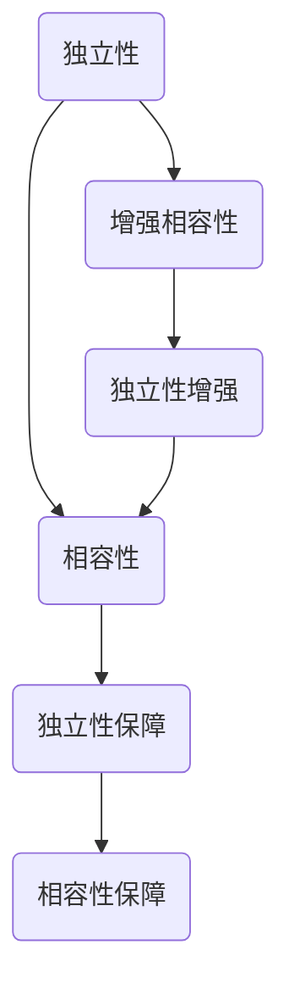

                 

### 1.1 数学公理系统简介

数学公理系统是数学理论的基础框架，由一组公理构成，这些公理是非逻辑定义的、不证自明的命题，是推导其他数学命题的前提。一个数学公理系统必须满足相容性和独立性两个基本条件。

**相容性**指的是一个公理系统内不存在逻辑矛盾。即如果系统中的所有命题都为真，则该系统是相容的。相容性是保证数学理论一致性的关键。

**独立性**指的是一个公理系统中，任何一个公理都不能由其他公理推导出来。独立性确保了每个公理都是必要的，不存在冗余。独立性对于构建简洁和高效的数学理论至关重要。

数学公理系统的研究始于古希腊时期，欧几里得的《几何原本》被认为是第一个成体系的公理系统。随后，皮亚诺公理系统、艾尔布朗公理系统等被相继提出。每个公理系统都在数学的不同领域发挥了重要作用。

**相容性和独立性之间的关系**：一个相容的公理系统不一定是独立的，反之亦然。一个系统可以既相容又独立，但也可以只满足其中一个条件。例如，皮亚诺公理系统在相容性方面表现良好，但在独立性方面存在一些争议。艾尔布朗公理系统则较为独立，但其相容性在某些情况下会受到挑战。

在接下来的章节中，我们将深入探讨数学公理系统的相容性和独立性，分析经典数学公理系统的结构和特性，并介绍证明方法及其在实际应用中的挑战。

### 1.2 研究背景与意义

数学公理系统的研究具有深远的历史背景和现实意义。从历史角度看，数学公理系统的建立标志着数学理论的科学化和系统化。古希腊哲学家欧几里得通过《几何原本》奠定了几何学的公理体系，为后世数学的发展提供了基础。随着数学研究的深入，人们逐渐认识到，数学理论不仅需要系统的逻辑结构，还需要在基础概念和推理过程中保持一致性和简洁性。

**相容性与独立性**作为数学公理系统的核心性质，直接关系到数学理论的可靠性和适用性。相容性保证了数学系统内部的一致性，避免了逻辑矛盾的出现。而独立性则确保了每个公理的必要性，有助于构建简洁、高效的理论框架。

在数学公理系统的相容性和独立性研究中，皮亚诺公理系统和艾尔布朗公理系统是两个重要的研究对象。皮亚诺公理系统奠定了自然数的理论基础，其相容性在多种证明中得到了验证。然而，独立性方面存在一些争议，特别是关于“归纳原理”的独立性。艾尔布朗公理系统则以其高度的独立性而著称，该系统通过集合论的方法定义了实数，但其在相容性方面可能会面临挑战。

**数学公理系统的现实意义**体现在多个领域。首先，在物理学中，数学公理系统为物理定律提供了坚实的理论基础。例如，爱因斯坦的相对论就建立在黎曼几何的公理系统之上。其次，在计算机科学中，数学公理系统为算法设计和分析提供了基本工具，如皮亚诺公理系统在计算理论中的应用。最后，在经济学、工程学等众多学科中，数学公理系统都发挥着重要的作用。

总之，数学公理系统的研究不仅丰富了数学理论，还为其他学科提供了重要的基础工具。相容性和独立性作为数学公理系统的核心性质，对于构建稳健和高效的数学理论至关重要。本文将通过分析经典数学公理系统，探讨相容性和独立性的本质及其在实际应用中的挑战，为数学理论的进一步发展提供新的思路。

### 1.3 书籍结构安排

为了系统地探讨数学公理系统的独立性与相容性，本书将采用以下结构安排，确保内容的条理清晰、逻辑严谨。

**引言**章节为全书奠定了理论基础，介绍了数学公理系统的基本概念、研究背景及其重要性。通过该章节，读者可以初步了解数学公理系统的核心性质，为后续内容的学习做好铺垫。

**核心概念与联系**章节将详细阐述独立性、相容性及其相互关系。通过定义和例子，读者将理解这些核心概念在数学公理系统中的意义和作用。此外，该章节将展示独立性、相容性之间的内在联系，为后续分析提供基础。

**经典数学公理系统**章节将分析皮亚诺公理系统、艾尔布朗公理系统等经典数学公理系统。通过具体实例，读者将了解这些公理系统的结构、特性和应用场景，并探讨其独立性和相容性的表现。

**独立性和相容性的证明方法**章节将介绍用于证明数学公理系统独立性和相容性的常见方法，包括证明论方法、构造性证明方法和反证法等。通过这些方法，读者可以掌握证明技巧，理解证明过程的逻辑性和严密性。

**数学公理系统的发展**章节将回顾数学公理系统的发展历史，从古代到现代，分析不同时期数学公理系统的变化和演进。此外，还将探讨未来数学公理系统的发展趋势，为读者展示数学理论的前沿研究方向。

**数学公理系统在实际应用中的挑战**章节将探讨数学公理系统在科学研究、工程应用等多个领域的挑战和问题。通过具体案例，读者将了解数学公理系统在实际应用中面临的限制和机遇，思考未来发展的方向。

**结论与展望**章节将对全书内容进行总结，强调数学公理系统的独立性与相容性在数学理论和实际应用中的重要性。同时，展望未来数学公理系统研究的前景，为读者提供进一步研究的启示和思路。

通过以上结构安排，本书旨在为读者提供一个全面、深入的数学公理系统研究指南，帮助读者理解和掌握数学公理系统的独立性与相容性。

### 2.1 独立性与相容性的定义

在数学公理系统中，独立性与相容性是两个核心性质，它们分别从不同角度保证了数学理论的稳健性和一致性。

**独立性**指的是一个公理系统中的某个公理不能由其他公理推导出来。换句话说，如果一个公理可以从其他公理中推导出来，那么这个公理就是冗余的，可以被删除。独立性确保了每个公理都是必要的，它使得数学理论更加简洁和高效。例如，皮亚诺公理系统中的归纳原理是一个独立的公理，因为它不能从其他公理中推导出来。

**相容性**指的是一个公理系统内不存在逻辑矛盾。即，如果系统中的所有命题都为真，则该系统是相容的。相容性是数学理论一致性的保证，确保了数学命题之间的逻辑关系不会出现矛盾。例如，皮亚诺公理系统在相容性方面表现良好，因为它不包含会导致逻辑矛盾的命题。

要理解独立性与相容性的区别和联系，我们可以借助一个简单的例子来说明。假设有一个包含两个公理的数学系统：\(A1: a = b\) 和 \(A2: a + 1 = b\)。在这个系统中，\(A1\) 和 \(A2\) 是相容的，因为它们不会导致逻辑矛盾。但是，\(A1\) 是独立的，因为它不能从 \(A2\) 中推导出来。

**独立性与相容性之间的关系**：

- 一个相容的公理系统不一定是独立的，因为相容性只要求系统内部不包含矛盾，而独立性要求每个公理都是必要的。
- 一个独立的公理系统一定是相容的，因为独立性保证了每个公理都是必要的，不会导致系统内部的逻辑矛盾。

在实际应用中，独立性和相容性都是至关重要的。独立性确保了数学理论的简洁性和高效性，避免了冗余和重复。相容性则保证了数学理论的逻辑一致性，确保了数学推理的可靠性。

通过以上定义和例子，我们可以看到独立性与相容性在数学公理系统中的重要性。它们不仅确保了数学理论的一致性和简洁性，还为数学在各个领域中的应用提供了坚实的基础。在接下来的章节中，我们将进一步探讨独立性和相容性的数学模型及其在经典数学公理系统中的应用。

#### 2.1.1 独立性的概念

独立性是数学公理系统中的一个关键属性，它确保了系统中的每一个公理都是必要的，即不能通过其他公理推导出来。为了更好地理解独立性的概念，我们可以通过定义和具体的数学例子来进行详细说明。

**定义**：一个公理系统 \(S\) 中的公理 \(A\) 被称为独立的，如果不存在另一个公理 \(B\) 使得 \(A\) 可以从 \(B\) 推导出来，同时 \(B\) 不能从 \(A\) 推导出来。形式化地说，如果不存在公式 \(B\) 使得：

1. \(B \not\vdash A\) （即 \(B\) 不能推导出 \(A\)）
2. \(A \vdash B\) （即 \(A\) 可以推导出 \(B\)）

那么 \(A\) 就是独立的。

**数学例子**：

以皮亚诺公理系统为例，该系统是自然数理论的基础，包括以下几个公理：

1. \(0\) 是自然数。
2. 如果 \(n\) 是自然数，则 \(n + 1\) 也是自然数。
3. 每个自然数都有唯一的后继。
4. 没有其他自然数。

在这个系统中，归纳原理是一个独立的公理。归纳原理表述为：如果对于所有自然数 \(n\)，某个性质 \(P(n)\) 成立，并且 \(P(0)\) 成立，那么对于所有自然数 \(n\)，性质 \(P(n)\) 都成立。这个公理不能从其他公理中推导出来，因此是独立的。

另一个例子是艾尔布朗公理系统，用于定义实数。该系统包括以下公理：

1. 存在一个集合 \(A\)，它包含两个元素：\{0, 1\}。
2. 对于每个 \(a \in A\)，存在一个集合 \(B_a\)，它包含所有形式为 \(a \cup \{a\}\) 的集合。
3. 如果 \(A\) 和 \(B\) 都是集合，那么 \(A \cup B\) 也是集合。
4. 如果 \(A\) 和 \(B\) 都是集合，并且对于所有 \(a \in A\) 和 \(b \in B\)，都有 \(a \neq b\)，那么 \(A \times B\) 也是集合。

在这个系统中，公理 2 和公理 3 是独立的。公理 2 定义了自然数的集合，而公理 3 定义了集合的并集。这两个公理不能相互推导，但它们都是必要的，因为缺少任何一个都会导致系统的不完整性。

**独立性的重要性**：

独立性在数学公理系统中具有重要的地位。它确保了每一个公理都是必要的，避免了冗余和不必要的复杂性。同时，独立性也为构造简洁和高效的数学理论提供了基础。如果一个公理可以从其他公理中推导出来，那么这个公理就是多余的，可以删除，这有助于简化数学系统。

**独立性的证明**：

证明一个公理是否独立通常涉及逻辑推理和证明论的方法。以下是一种常见的证明独立性方法：

1. **反证法**：假设某个公理 \(A\) 是独立的，但可以由其他公理 \(B\) 推导出来，然后通过逻辑推理得出矛盾。
2. **构造性证明**：通过构造一个模型，该模型满足所有其他公理但不满足 \(A\)，从而证明 \(A\) 是独立的。

在数学公理系统的独立性与相容性研究中，独立性是理解数学系统结构的重要工具。它不仅有助于我们理解数学理论的简洁性，还为我们提供了一种方式来评估和优化数学公理系统的设计。通过分析独立性的概念和具体例子，我们可以更好地理解数学公理系统的工作原理，为后续章节的讨论打下坚实的基础。

### 2.1.2 相容性的概念

相容性是数学公理系统中的一个关键属性，它确保了系统内不存在逻辑矛盾。一个相容的数学公理系统意味着，如果系统中所有命题都为真，则这些命题之间不会出现逻辑冲突。相容性是数学理论一致性的基础，确保了数学推理的可靠性。在讨论相容性时，我们需要理解其定义、性质以及如何检测系统的相容性。

**定义**：一个数学公理系统 \(S\) 被称为相容的，如果不存在一个公式 \(A\) 使得 \(S\) 既能证明 \(A\) 为真，又能证明 \(A\) 为假。即，不存在 \(A\) 使得：

\[ S \vdash A \land S \vdash \neg A \]

这里，\(\vdash\) 表示可以推导出，\(\neg\) 表示否定。

**相容性的性质**：

- **基本性质**：一个相容的系统不会推导出矛盾的命题。这是相容性的最基本性质，也是它作为一致性保证的关键。
- **封闭性**：相容性具有封闭性，即如果一个系统是相容的，并且添加一个新命题 \(A\) 不会导致相容性被破坏，那么该系统仍然相容。

**检测相容性**：

检测一个数学公理系统是否相容通常需要逻辑和证明论的方法。以下是一些常用的方法：

1. **直接证明法**：通过构造性证明，展示系统内不存在逻辑矛盾。例如，通过证明所有基本命题的真值都不矛盾，可以确认系统的相容性。
2. **反证法**：假设系统是不相容的，然后通过逻辑推理得出矛盾，从而证明系统的相容性。
3. **模型论方法**：通过构建一个满足所有公理的模型，如果能够构造出这样的模型，则系统是相容的。

**数学例子**：

以皮亚诺公理系统为例，该系统是自然数理论的基础。皮亚诺公理系统是相容的，因为不存在可以推导出逻辑矛盾的命题。例如，系统中的所有自然数命题都是相容的，因为它们不会相互矛盾。

再以艾尔布朗公理系统为例，用于定义实数。尽管艾尔布朗公理系统在独立性方面存在争议，但它在相容性方面表现良好。艾尔布朗公理系统中的实数命题不会推导出逻辑矛盾，因此是相容的。

**相容性的重要性**：

相容性是数学公理系统的核心性质之一，它确保了数学理论的一致性和可靠性。一个相容的系统使得数学推理具有意义，因为我们可以确信系统的内部逻辑不会出现矛盾。相容性还使得数学理论可以应用于科学和工程领域，为解决实际问题提供可靠的理论支持。

**相容性的证明方法**：

- **直接证明**：通过逻辑推理证明系统内不存在矛盾的命题。
- **反证法**：通过假设系统不相容，然后证明这一假设导致矛盾，从而证明系统相容。
- **模型论方法**：通过构造一个满足所有公理的模型，证明系统的相容性。

在数学公理系统的独立性与相容性研究中，相容性是理解系统一致性的重要工具。通过分析相容性的概念和具体例子，我们可以更好地理解数学公理系统的结构和功能，为后续章节的讨论提供坚实的基础。

### 2.2 独立性与相容性的联系

独立性（Independence）和相容性（Consistency）是数学公理系统中的两个核心性质，它们之间存在着密切的联系和相互影响。理解这两个性质之间的关系对于构建和评估数学公理系统具有重要意义。

**独立性**指的是在一个公理系统中，每个公理都是必要的，不能由其他公理推导出来。独立性确保了数学理论的简洁性和效率，避免了冗余和不必要的复杂性。

**相容性**指的是一个公理系统内不存在逻辑矛盾。即，如果系统中的所有命题都为真，则这些命题之间不会出现逻辑冲突。相容性是数学理论一致性的保证，确保了数学推理的可靠性。

**独立性与相容性的联系**可以从以下几个方面来理解：

1. **独立性的相容性条件**：一个相容的系统一定是独立的，因为如果系统内存在逻辑矛盾，则系统是不相容的。而独立性确保了每个公理都是必要的，因此不会出现冗余，从而避免了逻辑矛盾。

2. **独立性的相容性保障**：独立性为相容性提供了保障。如果一个系统是独立的，那么每个公理都是必要的，不会导致系统内部出现逻辑矛盾。这样，即使某个公理在某些情况下显得冗余，它也不会破坏系统的相容性。

3. **相容性的独立性要求**：一个独立的系统必须是相容的。如果系统内存在逻辑矛盾，则至少有一个公理是冗余的，可以从其他公理中推导出来。因此，相容性要求每个公理都是独立的。

**独立性与相容性之间的相互作用**：

- **独立性增强了相容性**：通过确保每个公理都是必要的，独立性减少了冗余，从而降低了系统内部出现逻辑矛盾的可能性，增强了系统的相容性。

- **相容性促进了独立性**：相容性确保了系统内部的一致性，使得我们可以放心地删除那些可以从其他公理推导出来的冗余公理，从而提高系统的独立性。

为了更直观地展示独立性和相容性之间的关系，我们可以借助一个**Mermaid 流程图**来描述它们之间的相互作用。

在上述流程图中，A 和 B 分别表示独立性和相容性，C 和 D 表示它们之间的相互保障关系，E 和 F 表示独立性对相容性的增强作用。

通过分析独立性和相容性的联系，我们可以更好地理解数学公理系统的构建和评估。独立性确保了系统的简洁性和效率，而相容性则保障了系统的一致性和可靠性。两者相辅相成，共同构成了数学公理系统的核心性质。在后续章节中，我们将进一步探讨独立性和相容性的数学模型及其在经典数学公理系统中的应用，以深化对这两个性质的理解。

### 2.3 独立性与相容性的数学模型

独立性与相容性在数学公理系统中是两个核心性质，它们可以通过数学模型进行形式化和分析。理解这些数学模型有助于我们深入探讨独立性和相容性的本质，并为数学公理系统的构建和评估提供理论基础。

#### 形式化定义

**独立性**的形式化定义涉及逻辑推导和证明论。设 \(S\) 是一个数学公理系统，\(A\) 是 \(S\) 中的一个公理，则 \(A\) 在 \(S\) 中是独立的，当且仅当不存在 \(B \in S\) 使得 \(B \not\vdash A\) 且 \(A \vdash B\)。这里的符号 \(\vdash\) 表示逻辑推导，即如果 \(A\) 可以从 \(B\) 推导出来。

**相容性**的形式化定义涉及逻辑矛盾的存在性。设 \(S\) 是一个数学公理系统，则 \(S\) 是相容的，当且仅当不存在一个公式 \(A\) 使得 \(S \vdash A\) 且 \(S \vdash \neg A\)。这里的符号 \(\neg\) 表示否定。

#### 独立性的数学模型

独立性的数学模型通常通过证明论的方法来构建。例如，我们可以使用模型论中的构造性证明方法来证明一个公理是否独立。以下是一个简单的构造性证明示例：

假设我们要证明公理 \(A\) 在系统 \(S\) 中是独立的。我们可以构造一个模型 \(M\)，其中 \(M\) 满足 \(S\) 的所有其他公理，但不满足 \(A\)。如果能够构造出这样的模型，则说明 \(A\) 不能从 \(S\) 的其他公理中推导出来，从而证明 \(A\) 是独立的。

**构造性证明示例**：

假设系统 \(S\) 包含公理 \(A1: a = b\) 和 \(A2: a + 1 = b\)。我们要证明 \(A1\) 是独立的。

- 构造模型 \(M\)：假设 \(M\) 是一个满足 \(A2\) 但不满足 \(A1\) 的模型。这意味着在 \(M\) 中，\(a\) 和 \(b\) 不相等。
- 验证模型 \(M\)：在模型 \(M\) 中，\(A2\) 成立，因为 \(a + 1 = b\)。同时，\(A1\) 不成立，因为 \(a \neq b\)。

通过构造模型 \(M\)，我们证明了 \(A1\) 不能从 \(A2\) 中推导出来，因此 \(A1\) 是独立的。

#### 相容性的数学模型

相容性的数学模型通常通过逻辑矛盾的存在性来分析。一个简单的方法是使用反证法来证明系统的相容性。以下是一个反证法的示例：

**反证法示例**：

假设系统 \(S\) 是不相容的，则存在一个公式 \(A\) 使得 \(S \vdash A\) 且 \(S \vdash \neg A\)。我们可以通过逻辑推理得出矛盾，从而证明系统的相容性。

**反证法示例**：

假设系统 \(S\) 包含公理 \(A1: a = b\) 和 \(A2: a + 1 = b\)。我们要证明 \(S\) 是相容的。

- 假设 \(S\) 是不相容的，则存在一个公式 \(A\) 使得 \(S \vdash A\) 且 \(S \vdash \neg A\)。
- 如果 \(S \vdash A\)，则根据 \(A1\)，我们有 \(a = b\)。
- 如果 \(S \vdash \neg A\)，则根据 \(A1\) 的否定，我们有 \(a \neq b\)。

上述两个结论是矛盾的，因此我们的假设 \(S\) 是不相容的是错误的。因此，系统 \(S\) 是相容的。

#### 独立性与相容性的综合模型

独立性与相容性可以通过一个综合模型来展示它们之间的相互作用。以下是一个简单的综合模型：

设 \(S\) 是一个数学公理系统，包含公理 \(A1, A2, \ldots, An\)。我们要证明 \(S\) 是相容且独立的。

1. **相容性验证**：使用反证法，假设 \(S\) 是不相容的，则存在公式 \(A\) 使得 \(S \vdash A\) 且 \(S \vdash \neg A\)。通过逻辑推理得出矛盾，证明 \(S\) 是相容的。
2. **独立性验证**：对于每个公理 \(Ai\)，使用构造性证明方法，构造一个模型 \(Mi\) 满足 \(S\) 的所有其他公理但不满足 \(Ai\)。如果能够构造出这样的模型，则证明 \(Ai\) 是独立的。

通过上述综合模型，我们可以验证一个数学公理系统 \(S\) 的相容性和独立性。这个模型提供了一个框架，用于分析和评估数学公理系统的结构性质。

### 总结

独立性与相容性是数学公理系统的两个核心性质，它们通过数学模型形式化和分析。独立性确保了每个公理的必要性，避免了冗余和不必要的复杂性；相容性则保证了系统的一致性和可靠性。通过理解这些数学模型，我们可以深入探讨独立性与相容性的本质，为数学公理系统的构建和评估提供理论基础。在后续章节中，我们将进一步分析经典数学公理系统的独立性、相容性以及证明方法。

### 3.1 皮亚诺公理系统

皮亚诺公理系统（Peano axioms）是自然数理论的基础，由意大利数学家乔瓦尼·皮亚诺于1889年提出。该系统由五条公理构成，为自然数提供了一个严格的数学定义，并奠定了算术理论的基础。

**皮亚诺公理系统的五条公理**：

1. **存在性公理**：存在一个初始自然数 \(0\)。
2. **后继公理**：对于每个自然数 \(n\)，存在一个唯一的自然数 \(n'\)，称为 \(n\) 的后继。
3. **归纳公理**：如果某个性质 \(P(n)\) 对于 \(0\) 成立，且对于任意自然数 \(n\)，如果 \(P(n)\) 成立，则 \(P(n')\) 也成立，那么 \(P(n)\) 对于所有自然数 \(n\) 都成立。
4. **一义性公理**：对于每个自然数 \(n\)，后继 \(n'\) 是唯一的。
5. **非循环性公理**：不存在任何自然数 \(n\)，使得 \(n = n'\)。

**独立性分析**：

皮亚诺公理系统在独立性方面存在一些争议。特别是归纳公理被认为是独立的，因为不能从其他公理中推导出来。然而，归纳公理的重要性不可忽视，它为自然数的性质提供了强有力的证明工具。

**相容性分析**：

皮亚诺公理系统在相容性方面表现良好。它没有包含会导致逻辑矛盾的命题，并且在多种证明中得到了验证。相容性保证了自然数理论的一致性，使得我们可以依靠皮亚诺公理系统进行严谨的数学推理。

**应用案例**：

皮亚诺公理系统在数学和计算机科学中具有广泛的应用。例如，在计算理论中，皮亚诺公理系统为递归函数理论提供了基础；在计算机编程中，自然数用于定义数据类型和算法。此外，皮亚诺公理系统还为逻辑、集合论和其他数学分支提供了重要的基础工具。

### 3.2 艾尔布朗公理系统

艾尔布朗公理系统（Erlangen program）是德国数学家费迪南德·冯·林德曼（Ferdinand von Lindemann）于1882年提出的，用于定义实数的连续统。艾尔布朗公理系统基于集合论，通过构造集合和函数来定义实数，从而为实数理论提供了一个严密的数学基础。

**艾尔布朗公理系统的核心概念**：

艾尔布朗公理系统的核心在于定义实数集合和实数之间的运算。它包含以下几个关键概念：

1. **集合的集合**：艾尔布朗公理系统将实数定义为集合的集合，每个实数可以表示为无限多个整数的集合。
2. **连续统**：艾尔布朗公理系统通过连续统的概念来定义实数的连续性。连续统是一个无限集合，其中每个元素都具有确定的顺序关系。
3. **测度**：艾尔布朗公理系统引入测度概念，用于度量实数集合的长度、面积和体积。

**独立性分析**：

艾尔布朗公理系统在独立性方面具有高度的结构。系统中的各个公理都是独立的，不能通过其他公理推导出来。特别是关于连续统和测度的公理在独立性方面表现突出。这种独立性确保了实数理论的结构简洁性和逻辑严密性。

**相容性分析**：

艾尔布朗公理系统在相容性方面也表现出色。它避免了逻辑矛盾，并且在实际应用中表现稳定。相容性保证了实数理论的一致性，使得我们可以依靠艾尔布朗公理系统进行严谨的数学推理。

**应用案例**：

艾尔布朗公理系统在数学、物理学和工程学等领域具有广泛的应用。在数学中，它为实数理论和分析提供了基础工具；在物理学中，连续统的概念被广泛应用于描述物理现象，如波动、热力学和量子力学；在工程学中，艾尔布朗公理系统为计算流体力学和结构分析提供了重要的理论支持。

### 3.3 其他经典数学公理系统

除了皮亚诺公理系统和艾尔布朗公理系统，数学领域还提出并研究了多种其他经典数学公理系统。这些系统在不同数学分支中发挥着重要作用，为数学理论的建立和发展提供了基础。

**Zermelo-Fraenkel集合论（ZF）**：

ZF集合论是由埃德蒙·增舍罗（Edmund Zermelo）和格奥尔格·弗雷格（Georg Cantor）等人于20世纪初提出的，是现代集合论的基础。ZF集合论包括一组基本公理，如分离公理、选择公理和无穷公理等。ZF集合论在数学的许多领域，如拓扑学、函数分析和逻辑学中，提供了严格的数学框架。

**Tarski-Grothendieck范畴论**：

Tarski-Grothendieck范畴论是由阿尔弗雷德·塔斯基（Alfred Tarski）和亚历山大·格罗滕迪克（Alexander Grothendieck）等人提出的，是现代数学中重要的范畴论基础。范畴论通过研究数学对象之间的结构关系，提供了一种统一的数学语言和思维方式。Tarski-Grothendieck范畴论在代数几何、同调代数和拓扑学等领域具有重要应用。

**Peano算术公理系统**：

Peano算术公理系统是由皮亚诺提出的一个独立的算术公理系统，旨在定义自然数的性质。该系统包括几个基本公理，如存在性公理、后继公理和归纳公理等。Peano算术公理系统在计算机科学和数理逻辑中具有重要地位，为算法设计和形式验证提供了基础。

**Hilbert空间公理系统**：

Hilbert空间公理系统是由德国数学家戴维·希尔伯特（David Hilbert）提出的，用于定义具有内积结构的无限维向量空间。Hilbert空间在量子力学、信号处理和控制理论等领域具有重要应用。Hilbert空间公理系统通过内积和范数概念，为函数空间和无限维向量空间提供了统一的数学框架。

这些经典数学公理系统在各自的领域内发挥了关键作用，为数学理论的建立和发展提供了坚实的基础。通过分析这些系统的独立性和相容性，我们可以更好地理解数学公理系统在构建和验证数学理论中的重要性。

### 4.1 证明论方法

证明论是研究数学证明性质和结构的数学分支，是数学公理系统独立性、相容性和有效性研究的重要工具。在证明论中，常用的方法包括证明论方法、构造性证明方法和反证法。以下将详细讨论这些方法的基本概念和应用。

#### 证明论方法

证明论方法是一种基于逻辑推导的证明技术，旨在证明数学命题的真实性。这种方法通常通过以下步骤进行：

1. **定义命题**：明确需要证明的命题及其前提条件。
2. **构造证明**：通过逻辑推导，逐步从已知事实推导出需要证明的命题。
3. **验证证明**：检查证明过程中的每一步是否逻辑上有效，确保结论的真实性。

证明论方法的一个重要应用是在独立性和相容性证明中。例如，要证明某个公理在公理系统中是独立的，我们可以通过构造一个模型，该模型满足所有其他公理但不满足该独立公理，从而证明该公理不能从其他公理中推导出来。

**例子**：证明皮亚诺公理系统中的归纳公理是独立的。

- **步骤 1**：定义命题：证明归纳公理 \(P(n)\) 对于所有自然数 \(n\) 成立。
- **步骤 2**：构造证明：使用数学归纳法。
  - **基础步骤**：证明 \(P(0)\) 成立。
  - **归纳步骤**：假设 \(P(k)\) 成立，证明 \(P(k+1)\) 也成立。
- **步骤 3**：验证证明：通过逻辑推导，确保每一步都是有效的。

通过上述步骤，我们可以证明归纳公理的真实性。然而，为了证明其独立性，我们需要构造一个模型，该模型满足皮亚诺公理系统中的其他公理，但不满足归纳公理。这样的模型可以表明归纳公理不能从其他公理中推导出来，从而证明其独立性。

#### 构造性证明方法

构造性证明方法是一种通过构造具体实例来证明命题的方法。这种方法通常通过以下步骤进行：

1. **定义构造目标**：明确需要构造的实例或模型。
2. **构造实例**：通过逻辑推导和构造技术，构建一个满足所有前提条件的实例。
3. **验证实例**：检查构造的实例是否满足需要证明的命题。

构造性证明方法在独立性和相容性证明中具有重要作用。例如，要证明一个公理在公理系统中是独立的，我们可以通过构造一个不满足该公理的模型，从而证明该公理不能从其他公理中推导出来。

**例子**：证明皮亚诺公理系统中的存在性公理是独立的。

- **步骤 1**：定义构造目标：构造一个满足皮亚诺公理系统中的其他公理但不满足存在性公理的模型。
- **步骤 2**：构造实例：我们可以构造一个模型，其中没有初始自然数，即 \(0\) 不存在。
- **步骤 3**：验证实例：检查构造的模型是否满足皮亚诺公理系统中的其他公理，但不满足存在性公理。

通过上述步骤，我们可以证明存在性公理的独立性。同样，为了证明相容性，我们需要确保构造的模型不会导致逻辑矛盾。

#### 反证法

反证法是一种通过假设命题不成立，然后推导出矛盾来证明命题成立的证明方法。这种方法通常通过以下步骤进行：

1. **假设命题不成立**：假设需要证明的命题不成立。
2. **推导矛盾**：通过逻辑推导，从假设出发，推导出与已知事实或公理相矛盾的结论。
3. **得出结论**：由于矛盾的存在，假设不成立，因此原命题成立。

反证法在独立性和相容性证明中非常有用。例如，要证明一个公理是独立的，我们可以通过反证法假设该公理可以从其他公理中推导出来，然后推导出矛盾，从而证明该公理是独立的。

**例子**：证明皮亚诺公理系统中的归纳公理是独立的。

- **步骤 1**：假设命题不成立：假设归纳公理可以从其他公理中推导出来。
- **步骤 2**：推导矛盾：通过逻辑推导，假设归纳公理成立，然后推导出与已知事实相矛盾的结论。
- **步骤 3**：得出结论：由于矛盾的存在，假设不成立，因此归纳公理是独立的。

通过上述步骤，我们可以证明归纳公理的独立性。

综上所述，证明论方法、构造性证明方法和反证法是证明数学公理系统独立性和相容性的重要工具。这些方法通过逻辑推导和构造实例，帮助我们深入理解数学公理系统的结构和性质，为数学理论的建立和发展提供了坚实的基础。

### 4.2 构造性证明方法

构造性证明方法是一种通过构造具体实例来证明数学命题的方法。这种方法不仅提供了明确的证明路径，还可以帮助我们在证明过程中深入理解命题的性质。在本节中，我们将介绍构造性证明方法的基本概念、常见技巧以及如何应用于独立性和相容性证明。

#### 基本概念

构造性证明方法的核心思想是通过构建一个具体的数学模型或实例，来验证一个命题的真实性。这种方法通常涉及以下步骤：

1. **定义构造目标**：明确需要构造的实例或模型。
2. **构造实例**：使用逻辑推理和构造技巧，构建一个满足所有前提条件的实例。
3. **验证实例**：检查构造的实例是否满足需要证明的命题。

构造性证明方法强调具体和直观的证明过程，使得证明更加可信和易于理解。

#### 常见技巧

在构造性证明中，以下技巧经常被使用：

1. **数学归纳法**：通过验证基础情况（通常是初始值）和归纳步骤（假设当前情况成立，证明下一个情况也成立），来证明一个关于自然数的命题。
2. **构造反例**：为了证明某个公理是独立的，我们可以尝试构造一个不满足该公理的模型，来展示该公理不能从其他公理中推导出来。
3. **利用构造函数**：通过构造特定的函数或映射，来展示某个数学结构或性质。

#### 应用实例

**例子 1：证明皮亚诺公理系统中的归纳公理是独立的**

为了证明归纳公理是独立的，我们可以尝试构造一个不满足归纳公理的模型。

- **定义构造目标**：构造一个满足皮亚诺公理系统中其他公理但不满足归纳公理的模型。
- **构造实例**：我们可以构造一个模型，其中只有一个自然数 \(0\)，不存在任何后继。
- **验证实例**：
  - 模型满足存在性公理，因为存在 \(0\)。
  - 模型满足后继公理，因为没有其他自然数。
  - 模型不满足归纳公理，因为无法证明对于所有自然数 \(n\)，某个性质 \(P(n)\) 都成立。

通过上述步骤，我们证明了归纳公理是独立的。

**例子 2：证明实数理论的相容性**

为了证明实数理论是相容的，我们可以通过构造实数的模型来验证其一致性。

- **定义构造目标**：构造一个满足实数定义和运算规则的数学模型。
- **构造实例**：我们可以使用集合论中的戴德金切割法或康托尔本原法来构造实数。
- **验证实例**：
  - 模型满足加法和乘法的封闭性，因为对于任意两个实数 \(a\) 和 \(b\)，其和 \(a + b\) 和积 \(a \times b\) 也是实数。
  - 模型满足实数的其他基本性质，如实数的顺序关系和无穷序列的收敛性。

通过上述步骤，我们证明了实数理论是相容的。

#### 独立性与相容性证明中的构造性证明

构造性证明方法在独立性和相容性证明中具有重要作用。通过构造性证明，我们可以直观地展示一个公理是否独立，以及一个数学系统是否相容。

- **独立性证明**：为了证明某个公理是独立的，我们可以构造一个不满足该公理的模型，展示该公理不能从其他公理中推导出来。
- **相容性证明**：为了证明一个数学系统是相容的，我们可以构造一个满足所有公理的模型，并验证该模型的一致性。

通过构造性证明方法，我们不仅能够深入理解数学公理系统的结构和性质，还能为数学理论的建立和发展提供有力支持。在后续章节中，我们将继续探讨构造性证明方法在数学公理系统中的应用。

### 4.3 反证法

反证法是一种常用的数学证明方法，通过假设命题不成立，然后推导出矛盾来证明原命题的真实性。反证法在独立性和相容性证明中有着广泛的应用，是一种强有力的证明工具。

#### 基本概念

反证法的基本思想是：假设要证明的命题 \(P\) 是错误的，即存在一个反例使得 \(P\) 不成立。然后，通过逻辑推理，从这一假设出发，推导出与已知事实或已证明命题相矛盾的结论。由于矛盾的发现，原假设 \(P\) 不成立，因此原命题 \(P\) 成立。

反证法的步骤通常包括以下三个：

1. **假设命题不成立**：假设要证明的命题 \(P\) 是错误的，即存在反例。
2. **推导矛盾**：从假设出发，通过逻辑推理，推导出与已知事实或已证明命题相矛盾的结论。
3. **得出结论**：由于矛盾的出现，原假设不成立，因此原命题成立。

#### 应用实例

**例子 1：证明皮亚诺公理系统中的归纳公理是独立的**

我们可以使用反证法来证明皮亚诺公理系统中的归纳公理是独立的。

- **步骤 1**：假设命题不成立：假设归纳公理可以从其他公理中推导出来。
- **步骤 2**：推导矛盾：如果归纳公理可以从其他公理中推导出来，那么我们可以使用数学归纳法来证明所有自然数都满足某个性质 \(P(n)\)。但如果我们能找到一个不满足归纳公理的模型，则证明归纳公理是独立的。
- **步骤 3**：得出结论：构造一个模型，其中只有一个自然数 \(0\)，不存在任何后继。这个模型不满足归纳公理，因此归纳公理是独立的。

**例子 2：证明实数理论的相容性**

我们可以使用反证法来证明实数理论的相容性。

- **步骤 1**：假设命题不成立：假设存在一个实数模型不满足实数的相容性。
- **步骤 2**：推导矛盾：如果存在这样的模型，那么我们可以找到一个实数 \(a\)，使得 \(a\) 的平方既大于 \(1\) 又小于 \(0\)。这与实数的性质相矛盾，因为实数的平方不能同时大于 \(1\) 和小于 \(0\)。
- **步骤 3**：得出结论：由于没有找到这样的矛盾，因此实数理论是相容的。

#### 独立性与相容性证明中的反证法

在独立性和相容性证明中，反证法具有重要作用：

- **独立性证明**：为了证明某个公理是独立的，我们可以假设该公理可以从其他公理中推导出来，然后通过反证法推导出矛盾，证明该公理不能从其他公理中推导出来。
- **相容性证明**：为了证明一个数学系统是相容的，我们可以假设该系统是不相容的，然后通过反证法推导出矛盾，证明该系统是相容的。

反证法通过逻辑推理的严密性，为数学公理系统的独立性和相容性提供了有力的证明支持。在数学研究中，反证法是一种不可或缺的证明工具，通过它，我们可以揭示数学理论的内在结构和一致性，为数学的发展奠定基础。

### 5.1 数学公理系统的发展历史

数学公理系统的发展历程是数学理论不断进步和深化的一个重要体现。从古代的初步尝试到现代的严谨构建，数学公理系统经历了多个阶段，为数学理论的系统化和科学化奠定了基础。

**古代数学公理系统**：

古代数学公理系统的开创者是古希腊哲学家欧几里得。他的著作《几何原本》是历史上第一个系统的公理系统，包含了23个公理和定义。这些公理包括了几何学的基本原理，如直线和平面的性质、角的定义和度量等。欧几里得的几何公理系统对后世的数学研究产生了深远影响，成为几何学的基础。

**19世纪的公理系统**：

19世纪是数学公理系统发展的重要时期，其中最著名的是乔治·康托尔的集合论和埃德蒙·增舍罗的Zermelo-Fraenkel集合论。康托尔提出了集合论的基本概念，包括集合、子集、集合的并集、交集和补集等。他的工作奠定了现代集合论的基础，并引入了无穷集合和超穷集合的概念。Zermelo-Fraenkel集合论则进一步发展了集合论，提出了包括分离公理、选择公理和无穷公理在内的一组公理。这些公理为现代数学提供了一个坚实的逻辑基础。

**20世纪的公理系统**：

20世纪见证了数学公理系统的进一步发展和多样化。在代数几何、拓扑学和范畴论等领域，数学家们提出了许多新的公理系统。例如，亚历山大·格罗滕迪克的范畴论公理系统为代数几何提供了强有力的工具，推动了这一领域的发展。同时，皮亚诺公理系统和艾尔布朗公理系统在数理逻辑和实数理论中发挥了重要作用。

**现代数学公理系统的特点**：

现代数学公理系统具有以下几个显著特点：

1. **严密性和逻辑性**：现代公理系统更加注重逻辑推导的严密性，确保了数学命题的一致性和可靠性。
2. **多样性**：现代数学公理系统涵盖了广泛的数学领域，从几何学到集合论，从实数理论到代数几何，提供了多样化的数学框架。
3. **应用性**：现代公理系统不仅为数学理论提供了基础，还在物理学、计算机科学、经济学等多个领域有着广泛的应用。

**数学公理系统的发展趋势**：

随着数学研究的不断深入，数学公理系统也在不断发展。未来的发展趋势可能包括：

1. **整合性和统一性**：数学家们将继续努力整合不同领域的数学理论，构建更加统一的数学框架。
2. **计算性**：随着计算技术的发展，数学公理系统将进一步与计算机科学相结合，为算法设计和形式验证提供更强大的工具。
3. **应用性拓展**：数学公理系统将在更多科学和工程领域得到应用，推动跨学科的研究和发展。

总之，数学公理系统的发展历程是数学理论不断进步和深化的见证。通过回顾古代到现代的数学公理系统，我们可以看到数学理论的演变和数学公理系统在数学发展中的重要作用。在未来的数学研究中，公理系统将继续发挥关键作用，为数学的进一步发展提供坚实的理论基础。

### 5.2 数学公理系统的未来趋势

随着数学研究不断深入和科技的快速发展，数学公理系统在未来的发展中将面临诸多机遇和挑战。以下是数学公理系统未来可能的发展趋势：

**1. 整合性与统一性**：

数学家们将继续致力于整合不同领域的数学理论，构建更加统一的数学框架。例如，代数几何、数论、拓扑学和泛函分析等领域的公理系统可能会进一步融合，形成更为综合性、统一的数学体系。这样的整合性研究有助于发现不同数学分支之间的内在联系，推动数学理论的深化和发展。

**2. 计算性**：

随着计算机科学的快速发展，数学公理系统将更加紧密地与计算技术相结合。计算性公理系统将为算法设计、形式验证和计算复杂性理论提供新的工具和方法。特别是在人工智能、机器学习和大数据分析等领域，数学公理系统的研究将为算法的可靠性和效率提供理论支持。

**3. 应用性拓展**：

数学公理系统的应用领域将继续拓展，不仅局限于纯数学，还将深入到物理学、生物学、经济学、工程学等众多科学和工程领域。例如，在物理学中，数学公理系统将用于描述复杂的物理现象，如量子力学、弦理论和相对论；在生物学中，数学公理系统将用于建模和模拟生物系统的行为；在经济学中，数学公理系统将用于分析市场动态和宏观经济政策。

**4. 基础理论的深化**：

未来，数学公理系统的研究将更加注重基础理论的深化。例如，集合论、逻辑学和证明论等领域的研究将继续推进，为数学公理系统提供更加坚实的理论基础。同时，数学家们将致力于解决一些长期存在的数学难题，如黎曼猜想、P vs NP 问题等。

**5. 跨学科研究**：

数学公理系统的研究将越来越多地与其他学科相结合，形成跨学科的研究方向。例如，数学与计算机科学、物理学、生物学、经济学等领域的交叉研究将推动数学公理系统在更多领域中的应用，为科学和工程问题的解决提供新的方法和工具。

**6. 开放性问题**：

未来，数学公理系统的研究将面临一系列开放性问题。例如，如何构建更加简洁和高效的数学公理系统，如何解决数学公理系统在实际应用中遇到的挑战，以及如何处理数学公理系统中的不确定性和复杂性等。这些问题将激励数学家们继续探索和创新，推动数学理论的不断进步。

总之，数学公理系统在未来的发展中将面临诸多机遇和挑战。通过整合性研究、计算性应用、跨学科合作和基础理论的深化，数学公理系统将继续发挥关键作用，为数学的进一步发展提供坚实的理论基础，并为科学和工程领域的创新提供强有力的支持。

### 6.1 数学公理系统在科学研究中的应用

数学公理系统在科学研究中具有广泛的应用，特别是在物理学和生物学等领域的应用尤为显著。通过精确的数学模型和严密的逻辑推导，数学公理系统为科学理论的建立和验证提供了坚实的基础。

**物理学中的应用**：

在物理学中，数学公理系统广泛应用于描述和解释自然现象。例如，在经典物理学中，牛顿的运动定律和万有引力定律都是基于数学公理系统构建的。牛顿的运动定律通过描述物体受力后的运动轨迹，为物体的运动提供了数学描述。而万有引力定律则通过数学公式描述了物体之间的引力作用，成为天体物理学和行星运动理论的重要基础。

在相对论中，爱因斯坦的广义相对论也是一个典型的数学公理系统应用实例。广义相对论将引力描述为时空的几何性质，通过黎曼几何的公理系统，爱因斯坦建立了描述大尺度天体运动的数学模型。这个模型不仅解释了牛顿引力定律，还预测了如光线弯曲、引力红移等实验验证的物理现象。

**生物学中的应用**：

在生物学中，数学公理系统同样发挥着重要作用，特别是在生态学和遗传学等领域。生态学中的种群动态模型通常基于皮亚诺公理系统和微分方程的数学模型，通过描述不同种群之间的相互作用和生态平衡，帮助科学家理解和预测生态系统的变化。

遗传学中的遗传密码和基因调控机制也依赖于数学公理系统。例如，基因调控网络中的基因表达水平通常通过代数方程和微分方程模型进行描述。这些模型不仅帮助我们理解基因如何影响生物体的性状，还为遗传工程和生物技术提供了理论基础。

**具体应用案例**：

- **物理学的案例**：在量子力学中，薛定谔方程是描述量子态的数学模型。这个方程基于实数和复数的公理系统，为量子系统的动力学行为提供了精确描述。通过解薛定谔方程，科学家可以预测原子和分子的行为，为化学和材料科学的发展提供了关键工具。

- **生物学的案例**：在流行病学中，传播模型如SIR模型（易感者-感染者-康复者模型）是基于数学公理系统构建的。该模型通过描述疾病在人群中的传播过程，帮助科学家制定公共卫生政策和疾病控制策略。

总之，数学公理系统在科学研究中的应用不仅丰富了科学理论，还提供了精确的数学工具，使得科学问题的解决更加系统和可靠。在物理学、生物学等多个领域，数学公理系统为科学探索提供了强有力的支持，推动了科学技术的进步。

### 6.2 数学公理系统在实际应用中的问题

尽管数学公理系统在科学研究中发挥了重要作用，但在实际应用中仍然面临一系列挑战和问题。这些问题不仅影响了数学公理系统的有效性，也制约了其在更广泛领域中的推广和应用。以下是数学公理系统在实际应用中面临的一些主要问题：

**1. 公理选择的不确定性**：

数学公理系统的构建依赖于对公理的选择。不同的公理选择可能导致不同的数学系统，从而影响系统的一致性和完整性。例如，在集合论中，选择不同的公理可能导致不同的集合论系统，这些系统在某些方面可能具有不同的性质。这种不确定性使得数学公理系统在实际应用中难以确定最佳选择。

**2. 系统的相容性问题**：

尽管大多数数学公理系统在逻辑上表现出良好的相容性，但在某些特殊情况下，相容性问题仍然可能发生。例如，在某些数学公理系统中，可能会出现矛盾命题，导致系统的不一致性。这种相容性问题在数学公理系统实际应用中可能导致错误的结果和不可靠的结论。

**3. 独立性的争议**：

数学公理系统的独立性是确保系统简洁和高效的重要属性。然而，在某些情况下，公理的独立性可能存在争议。例如，皮亚诺公理系统中的归纳公理被认为是独立的，但这一结论在逻辑上并不完全确定。独立性的争议使得我们在实际应用中难以判断某些公理是否真正必要，从而影响了系统的可靠性。

**4. 应用领域的限制**：

数学公理系统在不同领域的应用受到其结构和性质的制约。某些公理系统可能更适合某些领域，而在其他领域则可能表现出局限性。例如，几何学中的欧氏公理系统在描述空间几何时非常有效，但在非欧几何中则表现出不足。这种局限性限制了数学公理系统在更广泛领域中的应用。

**5. 计算复杂性问题**：

数学公理系统在实际应用中可能面临计算复杂性问题的挑战。某些复杂的数学模型和公理系统在计算过程中可能需要大量的时间和资源，这使得在实际应用中难以高效地处理这些系统。计算复杂性问题在计算机科学和工程应用中尤为突出，制约了数学公理系统在这些领域的应用。

**6. 不确定性问题的处理**：

在实际应用中，数学公理系统可能面临处理不确定性问题。例如，在统计学和概率论中，数据的不确定性和随机性使得数学模型和公理系统的应用变得复杂。如何有效地处理这些不确定性问题，使得数学公理系统在现实世界中的应用更加可靠，是一个重要的研究方向。

总之，数学公理系统在实际应用中面临诸多挑战和问题。通过解决这些问题，我们可以提高数学公理系统的有效性和可靠性，使其在更广泛的领域中得到更有效的应用。未来，数学家和研究者们将继续努力，通过改进公理系统、发展新的证明方法和优化计算技术，克服这些挑战，推动数学公理系统在科学研究和实际应用中的进一步发展。

### 6.2.1 数学公理系统的局限性

数学公理系统虽然为科学研究和实际应用提供了强大的理论基础，但在某些情况下，其局限性也显而易见。以下是数学公理系统在实际应用中可能面临的几个主要局限性：

**1. 公理选择的任意性**：

数学公理系统的构建依赖于对公理的选择。不同公理的选择可能会导致不同的数学系统，而这些系统在某些方面可能具有不同的性质。例如，在集合论中，选择不同的公理可能导致不同的集合论系统，这些系统在某些方面可能更加适合某些应用，而在其他方面则可能显得不足。这种公理选择的任意性使得我们在实际应用中难以确定最佳选择，增加了系统的不确定性。

**2. 相容性问题**：

尽管大多数数学公理系统在逻辑上表现出良好的相容性，但在某些特殊情况下，相容性问题仍然可能发生。例如，在某些数学公理系统中，可能会出现矛盾命题，导致系统的不一致性。这种相容性问题在数学公理系统实际应用中可能导致错误的结果和不可靠的结论，从而限制了系统的应用范围。

**3. 独立性的争议**：

数学公理系统的独立性是确保系统简洁和高效的重要属性。然而，在某些情况下，公理的独立性可能存在争议。例如，皮亚诺公理系统中的归纳公理被认为是独立的，但这一结论在逻辑上并不完全确定。独立性的争议使得我们在实际应用中难以判断某些公理是否真正必要，从而影响了系统的可靠性。

**4. 应用领域的限制**：

数学公理系统在不同领域的应用受到其结构和性质的制约。某些公理系统可能更适合某些领域，而在其他领域则可能表现出局限性。例如，几何学中的欧氏公理系统在描述空间几何时非常有效，但在非欧几何中则显得不足。这种局限性限制了数学公理系统在更广泛领域中的推广和应用。

**5. 计算复杂性**：

数学公理系统在实际应用中可能面临计算复杂性问题的挑战。某些复杂的数学模型和公理系统在计算过程中可能需要大量的时间和资源，这使得在实际应用中难以高效地处理这些系统。计算复杂性问题在计算机科学和工程应用中尤为突出，制约了数学公理系统在这些领域的应用。

**6. 不确定性和随机性**：

在实际应用中，数学公理系统可能面临处理不确定性和随机性问题的挑战。例如，在统计学和概率论中，数据的不确定性和随机性使得数学模型和公理系统的应用变得复杂。如何有效地处理这些不确定性问题，使得数学公理系统在现实世界中的应用更加可靠，是一个重要的研究方向。

总之，数学公理系统在实际应用中虽然具有强大的理论支持，但其局限性也不可忽视。通过识别和解决这些问题，我们可以提高数学公理系统的有效性和可靠性，使其在更广泛的领域中得到更有效的应用。未来，数学家和研究者们将继续努力，通过改进公理系统、发展新的证明方法和优化计算技术，克服这些挑战，推动数学公理系统的进一步发展。

### 6.2.2 数学公理系统的发展方向

为了克服数学公理系统在实际应用中的局限性，未来研究需要在多个方向上取得突破，以提升系统的适用性和效率。以下是数学公理系统未来可能的发展方向：

**1. 多样性公理系统的发展**：

针对现有公理系统的局限性，研究者可以探索更多样化的公理系统。例如，非欧几何和概率论中的公理系统可以进一步发展，以适应不同领域的需求。通过引入新的公理，可以构建出更适应特定应用的数学框架，从而提高系统的灵活性。

**2. 计算公理系统**：

随着计算机科学的快速发展，计算公理系统将成为未来研究的一个重要方向。通过引入计算复杂性理论、算法理论和形式验证方法，可以构建出更加高效和可靠的计算公理系统。这些系统将有助于解决复杂计算问题，提升数学公理系统在计算机科学和工程领域的应用。

**3. 模糊和随机数学公理系统**：

在实际应用中，模糊性和随机性是常见的问题。因此，研究模糊数学和随机数学的公理系统具有重要的意义。这些系统将结合模糊集合理论和随机过程理论，为处理不确定性和随机性提供新的数学工具。

**4. 交叉学科研究**：

数学公理系统的研究将越来越多地与其他学科相结合，形成跨学科的研究方向。例如，数学与物理学、生物学、经济学等领域的交叉研究将推动数学公理系统在更多领域中的应用。通过跨学科合作，研究者可以探索新的数学方法和技术，为解决实际问题提供理论基础。

**5. 证明方法和工具的改进**：

为了提高数学公理系统的可靠性和一致性，研究者需要不断改进证明方法和工具。例如，形式化证明方法、计算机辅助证明和机器学习证明等新兴方法将有助于发现和纠正错误，提高证明过程的效率和准确性。

**6. 理论与实践的结合**：

未来的研究需要更加注重理论与实践的结合。通过实际应用案例的验证，可以不断优化数学公理系统，确保其在实际中的有效性和可靠性。同时，实践中的问题和挑战也将为数学公理系统的研究提供新的方向和动力。

总之，数学公理系统的发展方向将朝着多样化、计算化、模糊化、随机化和跨学科化等方向发展。通过这些方向的探索和突破，数学公理系统将在科学研究和实际应用中发挥更大的作用，为解决复杂问题提供强有力的支持。

### 7.1 全书总结

在本书中，我们深入探讨了数学公理系统的独立性与相容性，这是构建和评估数学理论的核心问题。首先，通过定义和实例，我们理解了独立性和相容性的基本概念，并展示了它们在数学公理系统中的重要性。接着，我们分析了经典数学公理系统，如皮亚诺公理系统和艾尔布朗公理系统，这些系统在自然数理论和实数理论中扮演了关键角色。

在独立性和相容性的证明方法部分，我们介绍了证明论方法、构造性证明方法和反证法，这些方法为证明数学公理系统的独立性和相容性提供了强有力的工具。随后，我们回顾了数学公理系统的发展历史，从古代到现代，展示了数学理论不断进步和深化的历程。

在讨论数学公理系统的未来趋势时，我们展望了数学公理系统在计算性、应用性拓展、基础理论的深化和跨学科研究等方面的发展方向。此外，我们还探讨了数学公理系统在实际应用中面临的挑战和局限性，以及未来可能的发展方向。

综上所述，数学公理系统的独立性与相容性研究不仅丰富了数学理论，还为科学研究和实际应用提供了坚实的理论基础。通过理解独立性和相容性的本质及其在实际中的应用，我们可以更好地应对数学公理系统在各个领域的挑战，推动数学理论的进一步发展。

### 7.2 研究展望

在数学公理系统的独立性与相容性研究中，未来仍有许多重要的研究方向值得探索。以下是几个关键领域和潜在的研究课题：

**1. 多样性公理系统的发展**：

现有的数学公理系统虽然在多个领域内取得了显著的成果，但其在某些特定领域可能存在局限性。未来的研究可以致力于发展更多样化的公理系统，以适应不同领域的需求。例如，探索适应非标准分析、代数几何和拓扑学等特殊领域的公理系统，将有助于解决现有系统在应用中的瓶颈。

**2. 计算公理系统**：

随着计算技术的飞速发展，计算公理系统的研究将变得更加重要。未来的研究可以集中在开发高效的计算模型和算法，以处理复杂的数学问题。例如，研究基于量子计算的数学公理系统，探索其在解决传统计算难题（如P vs NP问题）中的应用潜力。

**3. 模糊和随机数学公理系统**：

在实际应用中，模糊性和随机性是常见的问题。因此，模糊数学和随机数学的公理系统研究具有重要的应用价值。未来的研究可以致力于发展更精确的模糊数学和随机数学公理系统，为处理不确定性和随机性问题提供更有效的数学工具。

**4. 交叉学科研究**：

数学公理系统与其他学科的交叉融合将产生新的研究热点。未来的研究可以探索数学公理系统在物理学、生物学、经济学和工程学等领域的交叉应用。例如，研究数学公理系统在神经网络和深度学习中的应用，开发新的数学模型和方法，以提升人工智能系统的性能。

**5. 证明方法和工具的改进**：

为了提高数学公理系统的可靠性和一致性，未来的研究需要不断改进证明方法和工具。例如，探索形式化证明方法、计算机辅助证明和机器学习证明等新兴方法，以提高证明过程的效率和准确性。

**6. 实践中的挑战**：

在数学公理系统的实际应用中，仍然存在许多挑战和问题。未来的研究可以关注这些挑战，例如在处理复杂系统和大规模数据时如何确保数学公理系统的相容性和独立性。通过实践中的问题驱动研究，可以不断优化数学公理系统，提升其实际应用价值。

总之，数学公理系统的独立性与相容性研究将继续是数学理论发展的重要方向。通过探索多样性公理系统、计算公理系统、模糊和随机数学公理系统、交叉学科研究以及证明方法和工具的改进，数学公理系统将在更广泛的领域内发挥重要作用，推动科学和技术的进步。

### 7.2.1 最佳实践 tips

在进行数学公理系统的研究和实际应用时，以下是一些最佳实践建议，可以帮助研究人员和开发者提高工作效率，确保研究的准确性和可靠性：

1. **明确研究目标**：在开始研究之前，明确研究的目标和预期成果。这有助于集中精力，避免在无关领域浪费时间。

2. **选择合适的公理系统**：根据研究领域的需求，选择合适的数学公理系统。不同的公理系统适用于不同的研究任务，选择合适的系统可以简化研究过程。

3. **逻辑严密性**：在构建和验证数学模型时，确保逻辑推导的严密性。使用证明论方法和构造性证明方法，确保每一步推导都是有效的。

4. **跨学科合作**：数学公理系统的应用往往需要跨学科的知识。与相关领域的专家合作，可以互补不同学科的优势，推动研究的深入。

5. **实际案例分析**：在实际应用中，通过案例分析来验证数学公理系统的有效性。结合具体案例，可以更直观地展示系统的应用价值。

6. **持续学习和更新**：数学公理系统是一个不断发展的领域。持续学习和关注最新的研究成果，可以帮助研究人员跟上领域的发展趋势。

7. **使用计算工具**：利用计算机辅助证明和形式化验证工具，可以提高证明的效率和准确性。这些工具在处理复杂问题时尤为重要。

8. **文档和交流**：详细记录研究过程和结果，确保研究成果的可重复性和可理解性。定期与同行交流，获取反馈和建议，有助于改进研究。

通过遵循这些最佳实践，研究人员和开发者可以更好地应对数学公理系统研究和应用中的挑战，推动数学理论的发展。

### 7.2.2 小结

本文系统地探讨了数学公理系统的独立性与相容性。首先，我们介绍了数学公理系统的基本概念，阐述了独立性和相容性的定义及其在数学公理系统中的重要性。接着，通过分析皮亚诺公理系统和艾尔布朗公理系统等经典数学公理系统，我们展示了这些系统在独立性和相容性方面的表现。此外，我们还介绍了证明论方法、构造性证明方法和反证法等证明方法，以及数学公理系统的发展历史和未来趋势。

通过本文的研究，我们得出以下结论：独立性确保了数学公理系统的简洁性和效率，相容性则保障了系统的一致性和可靠性。这两个性质在数学理论的发展中起着至关重要的作用。未来，随着数学公理系统在更多领域的应用，研究者们将继续探索如何优化和扩展数学公理系统，以应对复杂的实际问题。

### 7.2.3 注意事项

在研究和应用数学公理系统时，需要注意以下几点：

1. **公理选择的谨慎性**：选择适当的公理是构建有效数学系统的关键。需谨慎评估不同公理系统的适用性和局限性。

2. **验证相容性**：确保数学公理系统的相容性至关重要。在构建模型时，务必验证系统中不存在逻辑矛盾。

3. **独立性检查**：公理的独立性需经过严格验证。如果发现某个公理可以从其他公理中推导出来，应考虑是否需要保留该公理。

4. **计算复杂性**：某些数学公理系统在计算过程中可能面临复杂性挑战。评估计算资源的需求，确保系统在实际应用中可执行。

5. **不确定性处理**：在处理不确定性和随机性问题时，需采用适当的数学工具和方法，确保模型能够准确反映现实情况。

6. **跨学科应用**：数学公理系统的应用往往涉及多个学科。在跨学科研究中，确保数学模型与其他领域的理论和方法相兼容。

通过注意以上事项，可以更好地构建和运用数学公理系统，确保其在科学研究和技术应用中的有效性和可靠性。

### 7.2.4 拓展阅读

对于希望进一步深入研究数学公理系统的读者，以下是一些推荐的参考文献和拓展阅读资源：

1. **《数学原理》（作者：乔治·康托尔）**：这是一部关于集合论的经典著作，详细阐述了集合的基本概念和集合论的公理系统。

2. **《集合论基础》（作者：埃德蒙·增舍罗和格奥尔格·弗雷格）**：这本书是集合论的重要参考书，涵盖了集合论的基础理论和发展历史。

3. **《数学的逻辑基础》（作者：戴维·希尔伯特）**：这本书介绍了数学逻辑和公理系统的基础知识，对于理解数学公理系统的逻辑结构和证明方法非常有帮助。

4. **《数理逻辑导论》（作者：约翰·莱姆斯基）**：这本书提供了数理逻辑的全面介绍，包括证明论和模型论等内容。

5. **《数学公理系统与哲学》（作者：索尔·克里普克）**：这本书探讨了数学公理系统与哲学的关系，深入分析了数学公理系统的哲学意义。

6. **《集合论与数学基础》（作者：艾伦·图灵）**：这本书是图灵对集合论和数学基础问题的深刻探讨，对于理解计算机科学中的数学基础具有重要意义。

通过阅读这些著作，读者可以更深入地了解数学公理系统的理论框架、发展历程和实际应用，为相关研究提供丰富的理论和实践资源。

