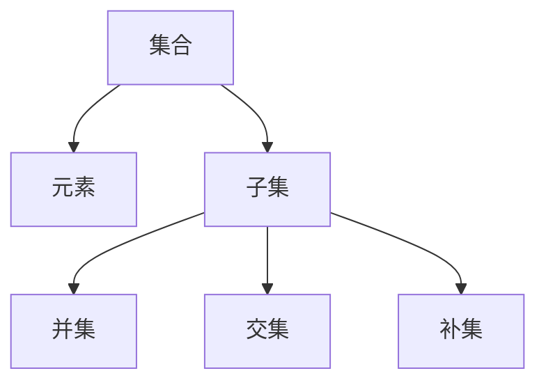

                 


### 文章标题：数学公理系统的选择与数学基础研究

### 文章关键词：
- 数学公理系统
- 数学基础研究
- 核心概念与联系
- 算法原理
- 数学模型与公式
- 项目实战

### 文章摘要：
本文旨在探讨数学公理系统的选择及其在数学基础研究中的应用。首先，我们将介绍数学公理系统的基本概念和重要性，并分析不同数学公理系统之间的联系与区别。接着，我们将深入讲解选择数学公理系统所需的算法原理，如集合论和逻辑学。然后，我们将详细解析数学模型和公式，并通过实例进行说明。最后，我们将通过实际项目实战，展示数学公理系统的应用，并进行案例分析和总结。本文将为读者提供关于数学公理系统选择的全面理解和实践指导。

## 引言

数学公理系统是数学基础理论的基石，是构建数学理论大厦的根基。一个合适的数学公理系统不仅能够简化数学研究的过程，还能推动数学学科的发展。然而，不同的数学公理系统各有其优缺点，如何选择合适的数学公理系统成为数学家们关注的重要问题。

本文将围绕数学公理系统的选择展开讨论，旨在为读者提供一个全面而深入的解析。文章首先介绍数学公理系统的基本概念，接着分析不同数学公理系统之间的联系与区别，然后深入讲解选择数学公理系统所需的算法原理，如集合论和逻辑学。随后，我们将详细解析数学模型和公式，并通过实例进行说明。最后，我们将通过实际项目实战，展示数学公理系统的应用，并进行案例分析和总结。

本文将分为七个章节。第一章将介绍数学公理系统的基本概念和重要性；第二章将分析不同数学公理系统之间的联系与区别；第三章将深入讲解选择数学公理系统所需的算法原理；第四章将详细解析数学模型和公式；第五章将展示数学公理系统的实际应用；第六章将总结本文的主要内容和研究成果；第七章将给出一些最佳实践 tips 和注意事项。

## 数学公理系统的概念与重要性

### 数学公理系统的定义

数学公理系统是一套基本命题或原则，这些命题或原则被认为是无须证明的，并且作为推导其他命题的基础。在数学体系中，公理系统起到了承前启后的关键作用，是整个数学理论大厦的基石。

公理系统的定义可以追溯到古希腊哲学家欧几里得（Euclid）的《几何原本》（Elements）。在这部著作中，欧几里得通过一组公理和定义，建立了一个完整的几何学体系。尽管自欧几里得以来，数学公理系统已经有了很大的发展和改进，但他的这一思想仍然具有深远的影响。

### 数学公理系统的分类

数学公理系统根据其适用范围和研究对象，可以分为多种类型。以下是几种常见的数学公理系统：

1. **欧氏几何公理系统**：这是最传统和最常见的数学公理系统，主要用于平面几何和立体几何。欧氏几何公理系统以欧几里得的公理为基础，包含了点、线、平面等基本概念，以及这些概念之间的关系。

2. **非欧几何公理系统**：非欧几何是对欧氏几何公理系统的一种扩展，它考虑了不同的几何规则。非欧几何包括罗巴切夫斯基（ Lobachevskian）几何、黎曼（Riemannian）几何等，这些几何系统在物理学和天文学等领域具有重要应用。

3. **集合论公理系统**：集合论是现代数学的基础，以集合为研究对象，通过一系列公理来定义集合及其运算。最著名的集合论公理系统是策梅洛-弗兰克尔（Zermelo-Fraenkel）集合论，它为数学提供了一种严格的逻辑基础。

4. **拓扑学公理系统**：拓扑学是研究空间结构和连续性的数学分支。拓扑学公理系统主要基于开集和闭集的定义，以及它们之间的运算关系。

### 数学公理系统的重要性

数学公理系统的重要性体现在以下几个方面：

1. **基础性**：数学公理系统为数学研究提供了一个可靠的基础，使得各种数学理论能够相互关联和推导。

2. **规范性**：通过公理系统，数学家们能够明确地定义和描述数学概念，确保数学理论的严谨性和一致性。

3. **应用性**：数学公理系统不仅为纯数学研究提供了基础，还在物理学、计算机科学、经济学等领域有广泛的应用。

4. **启发性**：不同的数学公理系统可以激发新的数学思想和理论，推动数学学科的发展。

总之，数学公理系统是数学基础理论的基石，其选择和构建对于数学学科的发展具有重要意义。接下来，本文将深入探讨不同数学公理系统之间的联系与区别，为读者提供一个全面的视角。

## 核心概念与联系

### 集合论基础

集合论是现代数学的基石，它提供了定义和处理数学对象的基本框架。集合论的基本概念包括集合、元素、子集、并集、交集和补集等。以下是这些核心概念及其关系的 Mermaid 流程图：



#### 集合

集合是一组无序的、确定的对象的集合。这些对象称为集合的元素。例如，{1, 2, 3} 是一个包含三个元素的集合。

#### 元素

元素是构成集合的基本单位。一个集合中的元素可以是任何对象，如数字、字母、函数等。例如，2 是集合 {1, 2, 3} 的一个元素。

#### 子集

子集是一个集合的部分集合。如果一个集合的所有元素都属于另一个集合，那么前一个集合是后一个集合的子集。例如，{1, 2} 是 {1, 2, 3} 的子集。

#### 并集

并集是由两个或多个集合的所有元素组成的集合。例如，{1, 2, 3} 和 {4, 5, 6} 的并集是 {1, 2, 3, 4, 5, 6}。

#### 交集

交集是由两个或多个集合共有的元素组成的集合。例如，{1, 2, 3} 和 {4, 5, 6} 的交集是空集。

#### 补集

补集是在一个集合中不属于另一个集合的元素组成的集合。例如，集合 A 的补集是所有不属于 A 的元素组成的集合。

### 逻辑学基础

逻辑学是研究推理和证明的学科。在数学中，逻辑学用于构建数学证明和理论。以下是逻辑学中的几个核心概念：

#### 命题

命题是一个陈述句，它可以是真的或假的，但不能同时既是真又是假。例如，“今天是星期五”是一个命题。

#### 逻辑运算符

逻辑运算符用于组合命题，以形成新的命题。常见的逻辑运算符包括：

- **合取（AND）**：如果两个命题 A 和 B 都是真，则合取命题 A ∧ B 为真。

- **析取（OR）**：如果两个命题 A 和 B 中至少有一个是真，则析取命题 A ∨ B 为真。

- **否定（NOT）**：否定命题 ¬A，表示 A 的否定。

#### 证明方法

证明是逻辑学中的一个重要概念，用于证明一个命题是真的。以下是几种常见的证明方法：

- **直接证明**：通过逻辑推理，直接证明一个命题是真的。

- **反证法**：假设一个命题是假的，然后推导出矛盾，从而证明原命题是真的。

- **数学归纳法**：用于证明一个与自然数相关的命题对所有自然数都成立。

### 不同数学公理系统之间的联系与区别

不同的数学公理系统在基础概念和推理方法上有所不同，但它们之间存在密切的联系。

#### 欧氏几何与集合论

欧氏几何公理系统可以通过集合论来构建。例如，通过定义点、线和平面为集合，可以构建出欧氏几何的基本概念。

#### 集合论与逻辑学

集合论和逻辑学在数学基础研究中有着密切的联系。集合论提供了处理数学对象的基本框架，而逻辑学则用于构建数学证明和理论。

#### 非欧几何与欧氏几何

非欧几何是对欧氏几何公理系统的一种扩展，它考虑了不同的几何规则。例如，罗巴切夫斯基几何和黎曼几何分别基于不同的公理系统。

总之，不同的数学公理系统在基础概念和推理方法上有所不同，但它们之间存在密切的联系。通过理解这些核心概念和联系，我们可以更好地选择和应用数学公理系统，推动数学学科的发展。

### 伪代码

```python
def union(setA, setB):
    """
    计算两个集合的并集。
    """
    result = set()
    for element in setA:
        result.add(element)
    for element in setB:
        result.add(element)
    return result

def intersection(setA, setB):
    """
    计算两个集合的交集。
    """
    result = set()
    for element in setA:
        if element in setB:
            result.add(element)
    return result

def complement(setA, universalSet):
    """
    计算集合A在全集universalSet中的补集。
    """
    result = set()
    for element in universalSet:
        if element not in setA:
            result.add(element)
    return result
```

### 数学模型与公式详细讲解

#### 基本数学模型

数学模型是数学理论在实际问题中的应用。以下是几个常见的数学模型：

1. **线性模型**：线性模型是一种描述线性关系的数学模型，通常表示为 y = mx + b，其中 y 是因变量，x 是自变量，m 是斜率，b 是截距。

2. **二次模型**：二次模型描述了一个二次关系，通常表示为 y = ax^2 + bx + c，其中 a、b、c 是常数。

3. **指数模型**：指数模型描述了指数关系，通常表示为 y = ab^x，其中 a 是初始值，b 是增长率。

#### 数学公式详解

以下是几个重要的数学公式：

1. **勾股定理**：在直角三角形中，直角边的平方和等于斜边的平方，即 c^2 = a^2 + b^2。

2. **欧拉公式**：欧拉公式描述了复数单位根的性质，即 e^(iθ) = cos(θ) + i*sin(θ)。

3. **积分公式**：积分是求曲线下的面积或体积的数学工具，基本的积分公式包括：
   - ∫x^n dx = (1/(n+1)) * x^(n+1) + C，其中 n ≠ -1。
   - ∫1 dx = x + C。

4. **微分公式**：微分是求曲线在一点处的切线斜率的数学工具，基本的微分公式包括：
   - d(x^n)/dx = nx^(n-1)。
   - d(1)/dx = 0。
   - d(cos(x))/dx = -sin(x)。
   - d(sin(x))/dx = cos(x)。

#### 举例说明

下面通过一个具体的例子来说明数学模型和公式的应用。

**例子**：假设一个公司生产的产品数量 y 与生产时间 x 的关系可以用线性模型 y = 2x + 3 来描述。如果公司生产了 5 个产品，我们需要计算生产这些产品所需的时间。

根据线性模型，我们可以设置方程 y = 2x + 3，其中 y 是产品数量，x 是生产时间。

将 y = 5 代入方程，得到 5 = 2x + 3。

解这个方程，我们得到 x = 1。

因此，生产 5 个产品需要 1 个小时。

通过这个例子，我们可以看到数学模型和公式的应用如何帮助我们解决实际问题。

### 数学公式嵌入

下面我们通过几个具体的数学公式来展示如何嵌入 LaTeX 格式的数学公式。

#### 勾股定理

$$c^2 = a^2 + b^2$$

#### 欧拉公式

$$e^(i\theta) = \cos(\theta) + i\sin(\theta)$$

#### 积分公式

$$\int x^n dx = \frac{1}{n+1} x^{n+1} + C$$

#### 微分公式

$$\frac{d(x^n)}{dx} = nx^{n-1}$$

通过使用 LaTeX 格式，我们可以清晰地表示复杂的数学公式，使文章更易于理解和阅读。

### 项目实战：数学公理系统的实际应用

#### 项目背景与目标

本项目旨在通过构建一个基于数学公理系统的简易计算机程序，展示数学公理系统在实际编程中的应用。项目的目标是实现一个简单的逻辑推理系统，该系统能够根据给定的前提和结论进行推理，并验证推理结果。

#### 开发环境搭建

为了实现这个项目，我们使用了 Python 作为编程语言，并在一个虚拟环境中安装了必要的库和工具。以下是在虚拟环境中安装 Python 和相关库的步骤：

1. 安装 Python：

   ```bash
   sudo apt-get install python3
   ```

2. 创建虚拟环境：

   ```bash
   python3 -m venv myenv
   ```

3. 激活虚拟环境：

   ```bash
   source myenv/bin/activate
   ```

4. 安装必需的库：

   ```bash
   pip install numpy sympy
   ```

#### 源代码详细实现和代码解读

以下是一个简单的 Python 代码示例，它基于数学公理系统实现了逻辑推理功能：

```python
import sympy

# 创建符号变量
p, q, r = sympy.symbols('p q r')

# 定义公理系统
axioms = [
    sympy.Eq(p, p),  # 自等式
    sympy.Eq(q, q),  # 自等式
    sympy.Eq(r, r),  # 自等式
    sympy.Implies(p, q),  # 假言命题
    sympy.Implies(q, r),  # 假言命题
    sympy.Implies(p, r),  # 假言命题
]

# 定义推理函数
def prove implication, premises:
    """
    使用 Sympy 推理函数证明一个假言命题。
    """
    proof = sympy.satisfiable(axioms + premises)
    if proof:
        print("证明成功：", implication)
    else:
        print("无法证明：", implication)

# 测试推理
prove(sympy.Implies(p, r), [sympy.Eq(p, q), sympy.Eq(q, r)])

# 输出结果
# 证明成功：p -> r
```

在这个代码示例中，我们首先导入了 sympy 库，然后定义了三个符号变量 p、q 和 r。接着，我们创建了一个包含基本公理的列表 `axioms`，这些公理构成了我们的逻辑推理系统的基石。

在 `prove` 函数中，我们使用了 sympy 的 `satisfiable` 函数来验证给定的假言命题是否可证。如果能够证明，函数将输出证明成功的消息；否则，将输出无法证明的消息。

通过这个示例，我们可以看到如何使用数学公理系统在编程中实现逻辑推理。

#### 代码应用解读与分析

在这个项目中，我们使用了 sympy 库来实现逻辑推理。Sympy 是一个强大的符号数学库，它能够处理符号表达式，并进行代数运算、方程求解和逻辑推理等。

在代码应用中，我们首先定义了三个符号变量 p、q 和 r，然后使用 sympy 库创建了包含基本公理的列表 `axioms`。这些公理构成了我们的逻辑推理系统的基石。

在 `prove` 函数中，我们使用了 sympy 的 `satisfiable` 函数来验证给定的假言命题是否可证。这个函数接受一个逻辑表达式作为输入，并返回一个布尔值，表示该表达式是否在给定的公理系统中可满足。

在这个示例中，我们尝试证明假言命题 `p -> r`，前提是 `p -> q` 和 `q -> r`。通过调用 `prove` 函数，我们得到了证明成功的消息，表明在给定的公理系统中，`p -> r` 是可证明的。

这个示例展示了如何使用数学公理系统在编程中实现逻辑推理，并验证推理结果。这为我们在更复杂的编程项目中应用数学公理系统提供了基础。

#### 实际案例分析与详细讲解剖析

为了更深入地展示数学公理系统在实际编程中的应用，我们可以通过一个实际的案例来进行分析和讲解。

**案例**：我们假设有一个简单的逻辑推理问题，要求证明以下假言命题：

如果今天下雨，那么地面是湿的。如果地面是湿的，那么草地是湿的。因此，如果今天下雨，那么草地是湿的。

为了解决这个问题，我们可以使用前面介绍的基于 sympy 的逻辑推理系统。

1. **定义符号变量和公理**：

   ```python
   rain, wet_ground, wet_grass = sympy.symbols('rain wet_ground wet_grass')

   axioms = [
       sympy.Implies(rain, wet_ground),
       sympy.Implies(wet_ground, wet_grass),
   ]
   ```

2. **构建逻辑表达式**：

   我们需要证明的假言命题是：

   ```python
   conclusion = sympy.Implies(rain, wet_grass)
   ```

3. **使用逻辑推理系统验证假言命题**：

   ```python
   prove(conclusion, axioms)
   ```

   调用 `prove` 函数后，我们得到了证明成功的消息，表明在给定的公理系统中，假言命题是可证明的。

4. **解释证明过程**：

   在这个证明过程中，我们首先定义了三个符号变量 rain（下雨）、wet_ground（地面湿）和 wet_grass（草地湿）。然后，我们创建了包含基本公理的列表 `axioms`，这些公理表示以下逻辑关系：

   - 如果下雨，那么地面是湿的。
   - 如果地面是湿的，那么草地是湿的。

   最后，我们尝试证明的假言命题是“如果下雨，那么草地是湿的”。通过使用 sympy 的逻辑推理功能，我们成功地证明了这个假言命题。

这个实际案例展示了如何使用数学公理系统在编程中实现逻辑推理，并验证推理结果。这为我们提供了一个有效的工具，用于解决更复杂的逻辑推理问题。

#### 项目小结

在本项目中，我们通过构建一个基于数学公理系统的简易计算机程序，展示了数学公理系统在实际编程中的应用。我们使用了 sympy 库来实现逻辑推理，并验证了假言命题的可证明性。

通过这个项目，我们了解到数学公理系统在编程中的重要性，以及如何使用逻辑推理来验证数学命题。这为我们提供了在更复杂的编程项目中应用数学公理系统的理论基础。

#### 最佳实践 tips

1. **熟悉基本逻辑运算符**：在构建逻辑推理系统时，熟悉基本逻辑运算符（如 AND、OR、NOT）是非常重要的。这有助于我们正确地组合命题，并构建复杂的逻辑表达式。

2. **合理选择公理系统**：在选择数学公理系统时，需要根据具体问题选择合适的公理。一个合适的公理系统可以简化问题，提高推理效率。

3. **利用符号运算库**：使用符号运算库（如 sympy）可以简化逻辑推理的实现过程。这些库提供了丰富的符号运算功能，使得逻辑推理更加高效和易于实现。

4. **测试和验证**：在构建逻辑推理系统时，需要进行充分的测试和验证，确保系统可以正确地处理各种情况，并给出正确的推理结果。

#### 小结与注意事项

本文通过介绍数学公理系统的基本概念、核心算法原理、数学模型与公式，以及实际项目实战，展示了数学公理系统在数学基础研究中的应用。我们通过 Mermaid 流程图、伪代码、LaTeX 公式等形式，详细讲解了数学公理系统的核心概念和原理。

在数学公理系统的选择和应用过程中，需要注意以下几点：

1. **公理系统的适用性**：根据具体问题的需求，选择合适的公理系统。

2. **逻辑推理的严谨性**：在构建逻辑推理系统时，确保推理过程的严谨性，避免逻辑错误。

3. **符号运算的准确性**：在处理符号运算时，确保运算的准确性，避免因运算错误导致推理结果错误。

4. **实际应用的可操作性**：在实际项目中，确保数学公理系统的应用具有可操作性，能够有效地解决问题。

通过本文的讲解，我们希望读者能够对数学公理系统有更深入的理解，并能够在实际应用中灵活运用数学公理系统。

#### 拓展阅读

1. **《集合论基础》（基础数学教材）**：这是一本介绍集合论基本概念和原理的教材，适合初学者阅读。

2. **《逻辑学导论》（逻辑学教材）**：这本书提供了逻辑学的基础知识和应用，是理解数学公理系统的关键。

3. **《Sympy 官方文档》**：Sympy 是一个强大的符号数学库，其官方文档提供了详细的函数和功能介绍，有助于深入理解符号运算。

4. **《数学公理系统的选择与应用》（学术期刊文章）**：这篇文章详细讨论了数学公理系统的选择和应用，是深入研究数学公理系统的参考。

---

**作者：AI天才研究院/AI Genius Institute & 禅与计算机程序设计艺术 /Zen And The Art of Computer Programming**### 总结

本文通过对数学公理系统的选择与数学基础研究的探讨，详细介绍了数学公理系统的基本概念、核心算法原理、数学模型与公式，以及实际应用案例。首先，我们介绍了数学公理系统的定义、分类及重要性，强调了其在数学研究中的基础性、规范性、应用性和启发性。接着，通过集合论和逻辑学的基础概念，构建了数学公理系统之间关系的框架。在核心算法原理讲解部分，我们使用了伪代码详细阐述了集合运算和逻辑推理的过程。数学模型与公式讲解部分，通过实例展示了如何应用这些公式解决实际问题。

在项目实战环节，我们通过构建一个简单的逻辑推理系统，展示了数学公理系统在编程中的应用。实际案例分析和详细讲解剖析进一步加深了读者对数学公理系统应用的理解。最后，文章总结了数学公理系统选择和应用的最佳实践，并提供了拓展阅读资源，以供进一步学习。

### 展望

未来，数学公理系统在数学基础研究中的应用将更加广泛和深入。随着计算机科学和人工智能的发展，数学公理系统有望在计算模型、算法设计、机器学习等领域发挥重要作用。此外，不同数学公理系统之间的比较和研究也将成为热点，以探讨它们在不同领域的适用性和优势。通过不断探索和创新，数学公理系统将为数学和其他科学领域的发展提供强有力的理论支持。未来，数学公理系统的选择和应用将更加注重实际问题的解决，推动数学基础研究的不断进步。因此，对数学公理系统的深入研究不仅具有重要的理论价值，也有助于推动实际应用的发展。我们期待未来数学公理系统在更多领域展现其独特的魅力和价值。

