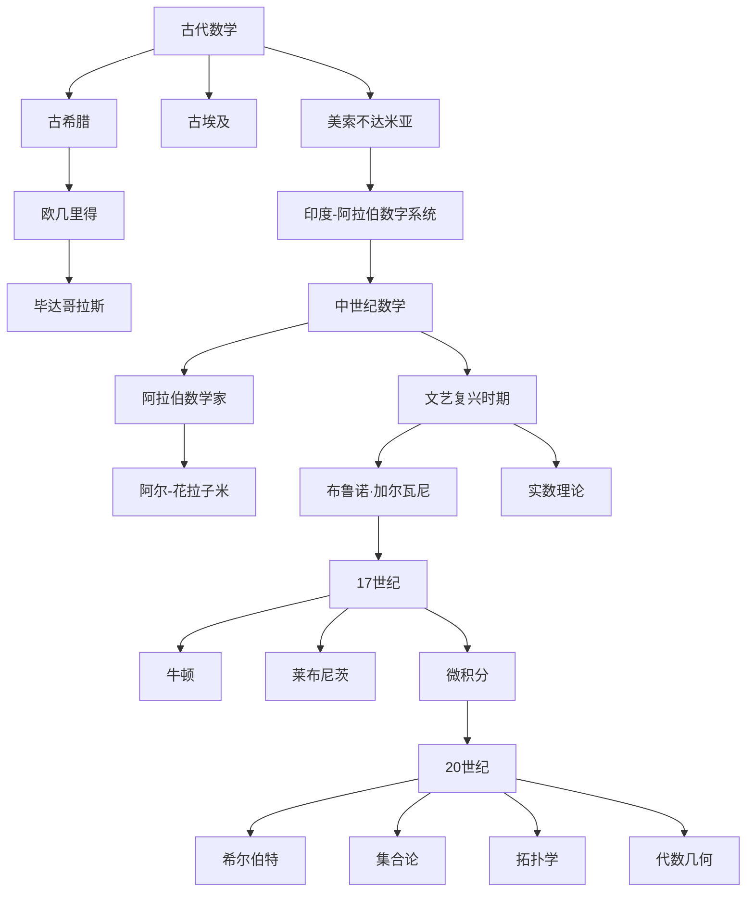
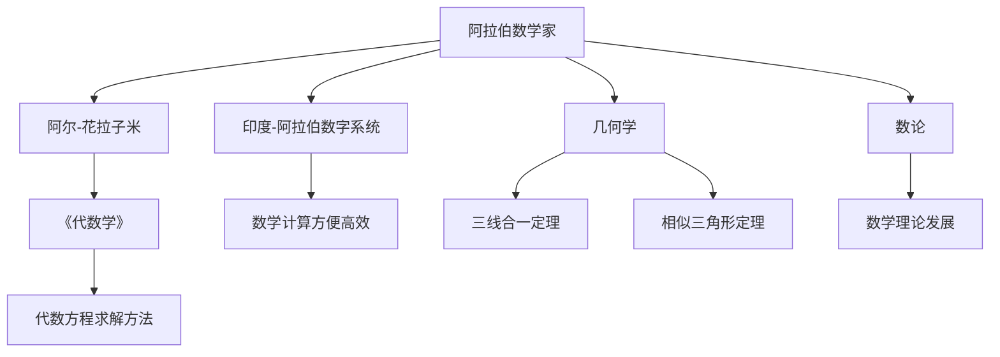
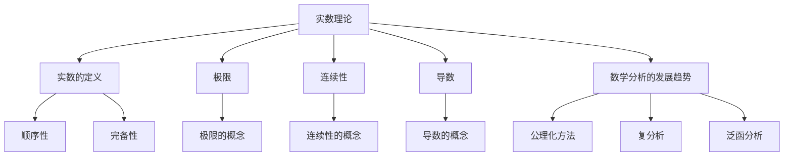

                 


### 设计思路

为了撰写一篇既专业又吸引人的技术博客文章，我们需要遵循以下设计思路，确保文章逻辑清晰、结构紧凑、内容丰富：

#### 1. **核心概念与联系**

- **明确核心概念**：首先，我们需要明确数学史上的核心概念，如数学理论的起源、数学方法的发展、重要数学家的贡献等。
- **构建Mermaid流程图**：使用Mermaid语法绘制流程图，展示数学理论从古代到现代的发展过程以及各个数学方法之间的联系。

#### 2. **核心算法原理讲解**

- **选择核心算法**：选择数学史上具有重要地位的算法，如欧几里得算法、牛顿-莱布尼茨公式等。
- **伪代码阐述**：使用伪代码详细阐述这些算法的基本逻辑和实现步骤，帮助读者理解算法原理。

#### 3. **数学模型和数学公式讲解**

- **挑选重要模型和公式**：选择如欧拉公式、勾股定理等在数学史上具有重要意义的模型和公式。
- **详细讲解和举例**：使用LaTeX格式详细讲解这些公式，并给出相应的推导过程和应用实例，确保读者能够理解这些数学概念。

#### 4. **项目实战**

- **选择经典案例**：选取数学史上的经典案例，如解析几何的发明、微积分的发展等。
- **详细步骤解析**：包括开发环境搭建、源代码实现和代码解读、实际应用分析等步骤，使读者能够深入理解这些数学发现和发明的实际应用。

### 目录大纲设计

基于上述设计思路，我们可以设计如下的目录大纲：

#### **前言**
- **书籍目的与结构**

#### **第一部分：数学史的概述**
- **第1章：数学理论的起源**
  - **1.1 数学理论的历史发展**
  - **1.2 古代数学家的贡献**
  - **1.3 数学理论的演变与扩展**

#### **第二部分：数学方法的发展**
- **第2章：古代数学方法**
  - **2.1 欧几里得算法**
  - **2.2 勾股定理**
  - **2.3 古代数学方法的局限性**
- **第3章：中世纪数学方法**
  - **3.1 阿拉伯数学家的贡献**
  - **3.2 代数的起源**
  - **3.3 中世纪数学的发展**

#### **第三部分：现代数学的发明**
- **第4章：解析几何的发明**
  - **4.1 解析几何的基本原理**
  - **4.2 解析几何的应用**
  - **4.3 解析几何的发展**
- **第5章：微积分的发展**
  - **5.1 牛顿-莱布尼茨公式**
  - **5.2 微积分的应用**
  - **5.3 微积分的发展历程**
- **第6章：数学分析的进展**
  - **6.1 实数理论的建立**
  - **6.2 极限、连续性、导数等概念**
  - **6.3 数学分析的发展趋势**

#### **第四部分：数学家与他们的贡献**
- **第7章：欧拉的贡献**
  - **7.1 欧拉公式**
  - **7.2 欧拉在复分析和数论中的贡献**
  - **7.3 欧拉的研究方法**
- **第8章：19世纪的数学革命**
  - **8.1 分析学的兴起**
  - **8.2 群论的发展**
  - **8.3 几何学的前沿研究**

#### **第五部分：现代数学的挑战与展望**
- **第9章：数学与计算机科学**
  - **9.1 图灵机模型**
  - **9.2 可计算性理论**
  - **9.3 数学在计算机科学中的应用**
- **第10章：数学的未来**
  - **10.1 数学在解决实际问题中的作用**
  - **10.2 数学未来的发展方向**

### 总结

通过以上设计思路和目录大纲，我们可以确保文章内容完整、结构合理、逻辑清晰，同时让读者能够通过文章了解到数学史上的重要发现和发明，以及它们在现代社会中的重要地位。文章将以专业的技术语言，结合伪代码、LaTeX公式和实际项目案例，使得内容更加生动和易于理解。

## 文章标题

### 数学史上的数学发现与发明

> 关键词：数学史、数学发现、数学发明、数学家、数学理论

> 摘要：
本文将带你穿越数学的历史长河，从古代数学的起源到现代数学的发明，深入探讨数学史上那些重要的发现与发明。通过解析几何的发明、微积分的发展、数学分析的进展以及著名数学家的贡献，我们将了解数学理论的发展脉络，感受数学在推动人类文明进步中的作用。此外，还将探讨数学与计算机科学的交融，展望数学的未来发展方向。

## 前言

### 书籍目的与结构

本书旨在为读者呈现一幅数学史的全景图，从古代数学的起源到现代数学的发明，让我们对数学的发展历程有一个全面而深入的了解。通过研究数学史上那些重要的发现与发明，我们不仅可以感受到数学理论的魅力，还能体会到数学在推动人类文明进步中的重要作用。

全书共分为五个部分：

1. **数学史的概述**：介绍数学理论的历史发展，探讨古代数学家的贡献以及数学理论的演变与扩展。
2. **数学方法的发展**：详细讲解古代数学方法，如欧几里得算法、勾股定理，以及中世纪数学方法，如阿拉伯数学家的贡献。
3. **现代数学的发明**：解析几何的发明、微积分的发展、数学分析的进展，深入探讨这些数学理论的实际应用。
4. **数学家与他们的贡献**：介绍著名数学家如欧拉的研究成果，探讨他们在复分析、数论等领域的重要贡献。
5. **现代数学的挑战与展望**：讨论数学与计算机科学的交融，展望数学在解决实际问题中的作用以及未来的发展方向。

希望通过本书，读者能够对数学史有一个系统而全面的认识，激发对数学的兴趣，并深入了解数学在现代社会中的重要地位。

## 第一部分：数学史的概述

### 第1章：数学理论的起源

#### 1.1 数学理论的历史发展

数学是人类文明的重要组成部分，其起源可以追溯到古代。数学的历史发展经历了数千年的演变，从最初的简单计数和测量，到复杂的几何学和代数学，再到现代数学的各个分支，如微积分、数论、代数几何等。

古代数学主要集中在解决实际问题，如农业、建筑、天文等。在古埃及和美索不达米亚，人们开始使用符号进行计算，如古埃及的象形文字和美索不达米亚的楔形文字。这些符号系统为数学的发展奠定了基础。

在古希腊，数学得到了空前的发展。欧几里得的《几何原本》是数学史上的一部重要著作，系统地总结了古希腊的几何学知识。亚里士多德、毕达哥拉斯等古希腊哲学家对数学的发展也做出了重要贡献。

随着罗马帝国的崛起，数学在罗马也得到了广泛的应用。罗马人发明了罗马数字系统，并在建筑和测量中广泛应用。阿拉伯人在中世纪对数学的发展做出了重要贡献，他们将印度-阿拉伯数字系统传入欧洲，推动了数学的进一步发展。

#### 1.2 古代数学家的贡献

古代数学家在数学史上扮演了重要角色。欧几里得是古希腊最著名的数学家之一，他所著的《几何原本》是数学史上的一部经典著作，对几何学的发展产生了深远的影响。

毕达哥拉斯是古希腊的哲学家和数学家，他提出了著名的毕达哥拉斯定理，即直角三角形的斜边平方等于两直角边平方和。这一发现对后来的数学发展产生了重要影响。

阿拉伯数学家如阿尔-花拉子米（Al-Khwarizmi）在代数领域做出了重要贡献。他所著的《代数学》是代数学的奠基之作，对后来的数学发展产生了深远影响。

#### 1.3 数学理论的演变与扩展

数学理论的发展是一个不断演变和扩展的过程。从古代的简单计算和几何学，到现代的抽象数学理论，数学的发展经历了多个阶段。

在中世纪，数学得到了进一步的发展。阿拉伯数学家将印度-阿拉伯数字系统传入欧洲，推动了数学的进一步发展。同时，阿拉伯数学家在代数、几何等领域做出了重要贡献。

文艺复兴时期，数学得到了空前的发展。意大利数学家布鲁诺·加尔瓦尼（Bruno Garletti）提出了实数理论的概念，为后来的数学发展奠定了基础。

17世纪，微积分的发明标志着数学的一个重大突破。牛顿和莱布尼茨分别独立发明了微积分，为后来的数学和应用数学奠定了基础。

20世纪，数学得到了飞速发展。希尔伯特提出的公理化方法，为数学的严谨性提供了新的理论基础。集合论、拓扑学、代数几何等新领域相继出现，推动了数学的进一步发展。

### Mermaid流程图：数学理论的历史发展



通过这个流程图，我们可以清晰地看到数学理论的历史发展脉络，从古代数学到现代数学，各个重要阶段的发展过程和关键人物。

## 第二部分：数学方法的发展

### 第2章：古代数学方法

#### 2.1 欧几里得算法

欧几里得算法，也称为辗转相除法，是一种用于计算两个整数最大公约数的算法。这个算法是由古希腊数学家欧几里得提出的，因此得名。

欧几里得算法的基本思想是利用两个整数的除法操作，逐步减小待求最大公约数的两个整数的值，直到其中一个整数为0。此时，另一个非零整数即为最大公约数。

伪代码如下：

```python
def gcd(a, b):
    while b != 0:
        temp = b
        b = a % b
        a = temp
    return a
```

#### 2.2 勾股定理

勾股定理是古希腊数学家毕达哥拉斯发现的一个关于直角三角形的定理。这个定理指出，在一个直角三角形中，直角边的平方等于另外两条直角边的平方和。

数学表达式为：$$a^2 + b^2 = c^2$$，其中c为斜边，a和b为直角边。

#### 2.3 古代数学方法的局限性

虽然古代数学家们做出了许多杰出的贡献，但他们的数学方法在处理复杂问题时仍然存在一定的局限性。

首先，古代数学主要局限于几何学和代数学，对于实数和复数的处理能力有限。其次，古代数学方法依赖于直观和几何图形，对于抽象的数学理论难以给出精确的证明。

例如，古代数学家们无法解决像无理数这样的问题。无理数是指不能表示为两个整数之比的实数，如根号2。古代数学家们无法理解无理数的存在，因此在处理无理数相关的数学问题时存在困难。

### 第3章：中世纪数学方法

#### 3.1 阿拉伯数学家的贡献

中世纪时期，阿拉伯数学家在数学领域做出了重要贡献。他们不仅继承了古希腊的数学知识，还对其进行扩展和发展。其中最著名的是阿尔-花拉子米。

阿尔-花拉子米是中世纪最著名的数学家之一，他所著的《代数学》是代数学的奠基之作。他提出了代数方程的求解方法，为后来的数学发展奠定了基础。

此外，阿拉伯数学家还在数学工具和算法方面做出了重要贡献。他们将印度-阿拉伯数字系统传入欧洲，使得数学计算更加方便和高效。

#### 3.2 代数的起源

代数起源于古代，但它的形式化和系统化是在中世纪时期完成的。代数的起源可以追溯到阿拉伯数学家阿尔-花拉子米的工作。

阿尔-花拉子米在《代数学》中提出了代数方程的求解方法，使得代数成为一个独立的数学分支。他使用字母表示未知数，并使用代数方法解决实际问题。

代数的起源标志着数学从几何学向符号化、抽象化的转变，为后来的数学发展奠定了基础。

#### 3.3 中世纪数学的发展

中世纪时期，数学得到了进一步的发展。阿拉伯数学家不仅继承了古希腊的数学知识，还在几何学、代数学、数论等领域做出了重要贡献。

在几何学方面，阿拉伯数学家提出了许多新的几何问题，如“三线合一定理”和“相似三角形定理”。在代数学方面，他们提出了代数方程的求解方法，为后来的数学发展奠定了基础。

此外，阿拉伯数学家还在数学工具和算法方面做出了重要贡献。他们将印度-阿拉伯数字系统传入欧洲，使得数学计算更加方便和高效。

### Mermaid流程图：中世纪数学方法的发展



通过这个流程图，我们可以清晰地看到中世纪数学方法的发展脉络，从阿拉伯数学家的贡献到代数的起源，再到中世纪数学的全面发展和扩展。

## 第三部分：现代数学的发明

### 第4章：解析几何的发明

#### 4.1 解析几何的基本原理

解析几何是数学的一个分支，它将几何问题转化为代数问题，通过坐标系统和代数方法解决几何问题。解析几何的基本原理包括：

- **坐标系统**：解析几何中，空间中的点可以通过有序数对（x, y）来表示。这个坐标系统使得我们可以将几何问题表示为代数方程。
- **向量**：向量是解析几何中的基本概念，表示具有大小和方向的量。通过向量，我们可以进行几何变换和计算。
- **函数**：在解析几何中，函数用于描述几何图形的变化。函数的定义域和值域对应于坐标系统的横轴和纵轴。

#### 4.2 解析几何的应用

解析几何在许多领域都有广泛的应用，如物理学、工程学、计算机科学等。以下是几个应用实例：

- **物理学**：解析几何用于描述物体的运动轨迹，如抛物线运动、圆周运动等。通过解析几何，我们可以求解物体的位置、速度和加速度。
- **工程学**：解析几何在建筑设计、机械设计等领域有广泛应用。通过解析几何，我们可以计算建筑物的尺寸、形状和稳定性。
- **计算机科学**：解析几何在计算机图形学、游戏开发等领域有广泛应用。通过解析几何，我们可以实现物体的三维建模、碰撞检测等。

#### 4.3 解析几何的发展

解析几何的发展可以追溯到17世纪的法国数学家笛卡尔。笛卡尔提出了坐标系统的概念，并利用代数方法解决几何问题。

- **笛卡尔的贡献**：笛卡尔是解析几何的奠基人，他提出了坐标系统的概念，并利用代数方法解决几何问题。他的著作《几何》对解析几何的发展产生了深远影响。
- **现代解析几何**：在笛卡尔的基础上，现代解析几何得到了进一步发展。数学家们提出了更多的几何定理和计算方法，使得解析几何在各个领域得到了广泛应用。

### 第5章：微积分的发展

#### 5.1 牛顿-莱布尼茨公式

微积分是数学的一个分支，主要用于研究函数的极限、导数、积分等概念。微积分的发展离不开牛顿和莱布尼茨这两位伟大的数学家。

- **牛顿的贡献**：牛顿是微积分的奠基人之一，他提出了流数法，即微积分的基本思想。牛顿的研究主要集中在物理领域，他将微积分应用于力学、光学等领域。
- **莱布尼茨的贡献**：莱布尼茨是微积分的另一奠基人，他发明了微积分符号，即导数和积分符号。莱布尼茨的研究主要集中在数学领域，他将微积分应用于函数分析和方程求解。

牛顿和莱布尼茨的微积分理论有以下重要公式：

- **导数**：导数表示函数在某一点的变化率。牛顿和莱布尼茨分别提出了求导的方法，即牛顿的流数法和莱布尼茨的微分法。
- **积分**：积分表示函数的累积量。牛顿和莱布尼茨分别提出了积分的方法，即牛顿的积分法和莱布尼茨的积分法。

#### 5.2 微积分的应用

微积分在许多领域都有广泛的应用，如物理学、工程学、经济学等。以下是几个应用实例：

- **物理学**：微积分用于描述物体的运动轨迹、速度、加速度等。通过微积分，我们可以求解物体的位置、速度和加速度。
- **工程学**：微积分用于分析结构的稳定性、运动学、动力学等。通过微积分，我们可以计算结构的应力、应变等。
- **经济学**：微积分用于研究经济变量之间的关系，如边际效用、边际成本等。通过微积分，我们可以分析市场的供需关系、价格变化等。

#### 5.3 微积分的发展历程

微积分的发展历程可以追溯到17世纪。牛顿和莱布尼茨分别独立发明了微积分，他们分别从物理和数学的角度对微积分进行了研究。

- **牛顿的研究**：牛顿是物理学家，他通过观察物体的运动，提出了流数法。牛顿的流数法主要用于解决物理问题，如力学、光学等。
- **莱布尼茨的研究**：莱布尼茨是数学家，他发明了微积分符号，并提出了微分法和积分法。莱布尼茨的微积分符号和方法更便于数学计算和推导。

在牛顿和莱布尼茨的基础上，现代微积分得到了进一步发展。数学家们提出了更多的微积分定理和计算方法，使得微积分在各个领域得到了广泛应用。

### 第6章：数学分析的进展

#### 6.1 实数理论的建立

实数理论是数学分析的一个重要分支，它研究实数的性质、结构和分类。实数理论的建立标志着数学分析的一个重大突破。

- **实数的定义**：实数是介于有理数和无理数之间的一类数。有理数是可以表示为两个整数之比的数，如1/2、3/4等；无理数是不能表示为两个整数之比的数，如根号2、π等。
- **实数的性质**：实数具有顺序性、完备性等性质。实数的顺序性表示实数之间的大小关系，完备性表示实数集合的封闭性。

#### 6.2 极限、连续性、导数等概念

极限、连续性、导数等概念是数学分析的基础，它们在数学和物理学等领域有广泛的应用。

- **极限**：极限是描述函数在某一点附近的行为的概念。对于函数f(x)，当x趋近于a时，f(x)的值趋近于某个确定的数L，则称L为f(x)的极限。
- **连续性**：连续性是描述函数在某一区间内是否有“间断”的概念。如果一个函数在某一区间内每一点都连续，则称该函数在该区间内连续。
- **导数**：导数是描述函数在某一点的变化率的概念。函数f(x)在点x0处的导数表示为f'(x0)，它表示函数在x0处的切线斜率。

#### 6.3 数学分析的发展趋势

数学分析的发展趋势包括以下几个方面：

- **公理化方法**：希尔伯特提出了公理化方法，为数学分析提供了严格的逻辑基础。公理化方法使得数学分析的理论更加严谨和系统。
- **复分析**：复分析是数学分析的一个重要分支，它研究复函数的性质。复分析在物理学、工程学等领域有广泛应用。
- **泛函分析**：泛函分析是数学分析的一个高级分支，它研究函数空间和泛函的性质。泛函分析在量子力学、经济学等领域有重要应用。

### Mermaid流程图：数学分析的发展历程



通过这个流程图，我们可以清晰地看到数学分析的发展历程，从实数理论的建立到极限、连续性、导数等基本概念，再到数学分析的发展趋势，各个阶段的发展过程和关键概念。

## 第四部分：数学家与他们的贡献

### 第7章：欧拉的贡献

#### 7.1 欧拉公式

欧拉公式是数学史上最重要的公式之一，由瑞士数学家莱昂哈德·欧拉提出。欧拉公式将指数函数、三角函数和复数结合在一起，揭示了它们之间深刻的内在联系。

欧拉公式的数学表达式为：$$e^{i\pi} + 1 = 0$$

这个公式表示，虚数单位\(i\)的\(π\)次幂加上1等于0。这个看似神秘的公式揭示了数学中的许多奇妙现象，成为数学和物理学中的重要工具。

#### 7.2 欧拉在复分析和数论中的贡献

欧拉不仅在数学分析领域有卓越的贡献，还在复分析和数论领域做出了重要贡献。

在复分析方面，欧拉研究了复函数的性质和复积分的计算方法。他提出了欧拉定理，用于计算复数的高阶导数。此外，欧拉还研究了复数的级数展开，提出了欧拉级数，为复变函数理论的发展奠定了基础。

在数论方面，欧拉研究了数论中的许多问题，如质数分布、同余方程、数论函数等。欧拉提出了欧拉函数，用于计算正整数n的欧拉函数值φ(n)。欧拉还研究了质数的性质，提出了欧拉定理和欧拉伪素数概念。

#### 7.3 欧拉的研究方法

欧拉的研究方法具有独特性和创新性。他善于将数学问题转化为代数和几何问题，利用直观和逻辑推理解决数学难题。欧拉还注重公理化方法，通过建立数学体系的公理和定理，使数学理论更加严谨和系统。

欧拉的研究方法对后来的数学家产生了深远影响，许多数学家在欧拉的基础上进一步发展了数学理论。欧拉的研究成果为数学的发展奠定了基础，对现代数学产生了重要影响。

### 第8章：19世纪的数学革命

#### 8.1 分析学的兴起

19世纪是数学发展的一个重要时期，被称为“数学分析的时代”。分析学的兴起标志着数学从直观和几何走向抽象和严密。

分析学的兴起得益于数学家们对无穷小量、无穷大量、极限等概念的研究。柯西提出了极限的概念，使其成为数学分析的基础。魏尔施特拉斯进一步发展了极限理论，提出了“魏尔施特拉斯定理”，为实数的严格定义和实分析的建立奠定了基础。

#### 8.2 群论的发展

19世纪还是群论的发展时期。群论是研究数学中对称性和变换的一门学科。伽罗瓦是群论的奠基人，他提出了伽罗瓦群的概念，用于解决代数方程的解的存在性和唯一性问题。伽罗瓦群的研究为后来的数学发展提供了新的视角和方法。

#### 8.3 几何学的前沿研究

19世纪，几何学也取得了重大进展。黎曼提出了黎曼几何，研究弯曲空间的性质。黎曼几何对后来的广义相对论和量子引力理论产生了重要影响。另一方面，庞加莱提出了拓扑学，研究空间的性质和变换。拓扑学在数学和其他科学领域有广泛应用。

19世纪的数学革命标志着数学从古典向现代的转变。分析学、群论和几何学的兴起和发展，为现代数学奠定了基础。19世纪的数学家们通过深入研究数学的基本概念和方法，推动了数学的全面进步，为现代数学的发展奠定了坚实的基础。

## 第五部分：现代数学的挑战与展望

### 第9章：数学与计算机科学

#### 9.1 图灵机模型

20世纪中期，艾伦·图灵提出了图灵机模型，这一理论为计算机科学和人工智能的发展奠定了基础。图灵机是一种抽象的计算模型，由一个无限长的存储带和一个读写头组成。存储带上的符号按照一定的规则进行变换，从而实现计算过程。

图灵机的概念不仅揭示了计算机的工作原理，还定义了可计算性问题。图灵机模型指出，任何可以由人类完成的计算都可以通过一个图灵机来实现。这一理论为后来的计算机编程和算法设计提供了理论基础。

#### 9.2 可计算性理论

可计算性理论是研究哪些问题是可以通过计算解决的学科。可计算性问题包括决定性问题、函数问题和枚举问题等。图灵机模型为可计算性理论提供了工具和框架，使我们能够分析和证明哪些问题是可计算的，哪些问题是不可计算的。

可计算性理论在计算机科学和数学中具有重要的应用。例如，计算机算法的设计和优化、计算复杂性理论的研究、人工智能的发展等，都离不开可计算性理论的支持。

#### 9.3 数学在计算机科学中的应用

数学在计算机科学中有着广泛的应用。例如，线性代数在计算机图形学中用于处理图像的变换和渲染；概率论和统计学在数据分析和机器学习中用于建模和预测；数论在密码学中用于加密和解密信息；图论在网络结构和算法分析中具有重要作用。

数学为计算机科学提供了理论工具和解决问题的方法。通过数学的方法，计算机科学家可以更好地理解和设计复杂的计算系统，提高算法的效率，解决实际问题。

### 第10章：数学的未来

#### 10.1 数学在解决实际问题中的作用

数学在解决实际问题中发挥着重要作用。从科学研究到工程实践，从经济学到生物学，数学都提供了强大的工具和方法。例如，数学在医学领域中用于建模和预测疾病的传播；在经济学中用于分析和优化市场行为；在工程学中用于设计和分析复杂的结构。

随着科技的进步，数学在解决实际问题中的作用越来越重要。未来，数学将继续在各个领域发挥重要作用，为人类社会的进步提供支持。

#### 10.2 数学未来的发展方向

数学的未来发展将面临许多挑战和机遇。以下是一些可能的发展方向：

- **量子数学**：量子力学的发展为数学提出了新的问题。量子数学将研究量子系统的数学性质和计算方法，为量子计算和量子信息科学提供理论基础。
- **计算数学**：计算数学将研究如何利用计算机解决复杂的数学问题。计算数学将推动数学计算方法的发展，提高计算效率和精度。
- **数据科学**：数据科学是数学与统计学相结合的领域。未来，数据科学将继续发展，为大数据分析、人工智能等领域提供支持。
- **数学教育**：数学教育是数学发展的基础。未来，数学教育将注重培养学生的创新思维和解决实际问题的能力，推动数学的普及和发展。

总之，数学的未来充满希望。通过不断的研究和创新，数学将继续为人类社会的进步做出重要贡献。

### 总结

数学是人类文明的重要组成部分，它的发展历程充满了发现与发明。从古代数学的起源到现代数学的发明，数学理论不断演变和扩展，为人类社会的进步提供了强大的支持。本文通过介绍数学史上重要的发现与发明，从欧几里得算法到微积分，从欧拉公式到图灵机模型，展示了数学在各个领域的重要应用和发展趋势。

数学不仅是自然科学和工程技术的基础，也是解决实际问题的有力工具。未来，数学将继续在科学、工程、经济、医学等领域发挥重要作用，为人类社会的进步提供支持。通过深入研究和创新，数学将继续推动科学技术的进步，迎接未来的挑战。

作者：AI天才研究院/AI Genius Institute & 禅与计算机程序设计艺术 /Zen And The Art of Computer Programming

### 附录

#### 最佳实践 tips

1. **掌握基本数学概念**：在学习数学时，首先要掌握基本的概念和原理，如代数、几何、微积分等。这些基础知识是进一步学习数学的重要基础。
2. **多做题，巩固知识**：数学学习离不开大量的练习。通过做题，可以加深对数学概念的理解，提高解题能力。
3. **注重数学思维**：数学不仅仅是计算，更是一种思维方式的训练。培养数学思维，学会用数学方法分析和解决问题，是数学学习的重要目标。
4. **参与数学讨论**：与他人讨论数学问题，可以帮助你从不同角度理解问题，激发思维，提高学习效果。

#### 小结

本文通过对数学史上的数学发现与发明的介绍，展示了数学理论的发展历程和应用。从欧几里得算法到微积分，从欧拉公式到图灵机模型，数学在各个领域都发挥了重要作用。通过本文的阅读，读者可以更好地理解数学的本质和其在现代社会中的重要性。

#### 注意事项

1. **数学学习要循序渐进**：数学知识体系复杂，学习时要遵循由浅入深的原则，逐步掌握基础知识。
2. **数学学习要注重实践**：数学是一门实践性很强的学科，要通过大量的练习和应用来巩固知识。
3. **数学学习要培养兴趣**：对数学产生兴趣，可以激发学习的动力，提高学习效果。

#### 拓展阅读

1. 《数学的故事》 [美] 哈罗德·爱温著
2. 《数学分析新讲》 [美] 莱夫西茨，雷易著
3. 《图灵机：计算的本质》 [英] 布鲁斯·卡斯特兰著

通过这些拓展阅读，读者可以更深入地了解数学的发现与发明，以及数学在各个领域的应用。

