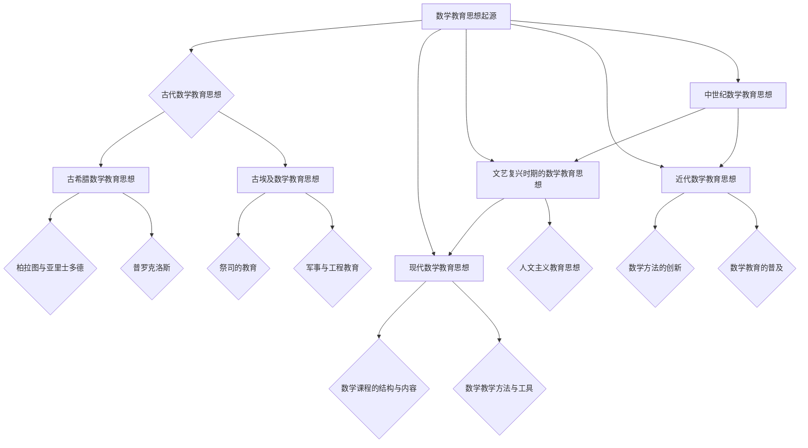

                 

### 设计《数学史上的数学教育思想演变研究》目录大纲

设计一本关于《数学史上的数学教育思想演变研究》的书籍目录大纲，需要遵循以下步骤：

#### 第一步：确定书籍主题和目标读者

首先，我们需要明确书籍的主题和目标读者群体。对于这本书，我们的主题是数学教育思想的演变，涵盖数学教育的历史、理念、方法和影响。目标读者包括数学教育研究者、数学教师、数学爱好者以及对数学教育史感兴趣的人。

#### 第二步：提炼核心概念与联系

在明确主题后，我们需要提炼出核心概念及其相互联系。这里的核心概念包括：

- 数学教育思想：数学教育的发展、理念、方法及其影响。
- 数学教育演变：不同时期数学教育思想的变迁和原因。

#### 第三步：划分章节主题

接下来，我们将核心概念具体化，划分出各个章节的主题。以下是初步的章节划分：

1. 引言
2. 数学教育思想的起源与发展
3. 古代数学教育思想
4. 中世纪数学教育思想
5. 文艺复兴时期的数学教育思想
6. 近代数学教育思想
7. 现代数学教育思想
8. 数学教育思想的未来发展趋势
9. 数学教育思想的跨文化比较

#### 第四步：细化目录结构

对于每个章节，我们进一步细化到1,2,3级目录，确保内容的完整性和逻辑性。例如，对于“古代数学教育思想”，我们可以细化如下：

- 3.1 古希腊数学教育思想
  - 3.1.1 柏拉图与亚里士多德的教育思想
  - 3.1.2 普罗克洛斯的数学教育思想
- 3.2 古埃及数学教育思想
  - 3.2.1 祭司的教育
  - 3.2.2 军事与工程教育

#### 第五步：撰写目录大纲

根据上述步骤，我们可以撰写出这本书的目录大纲。以下是完整的目录大纲：

```markdown
# 《数学史上的数学教育思想演变研究》目录大纲

## 第1章 引言
### 1.1 研究背景
### 1.2 研究目的与意义
### 1.3 研究方法与框架

## 第2章 数学教育思想的起源与发展
### 2.1 数学教育的起源
### 2.2 古代数学教育思想
### 2.3 中世纪数学教育思想
### 2.4 文艺复兴时期的数学教育思想
### 2.5 近代数学教育思想
### 2.6 现代数学教育思想

## 第3章 古代数学教育思想
### 3.1 古希腊数学教育思想
#### 3.1.1 柏拉图与亚里士多德的教育思想
#### 3.1.2 普罗克洛斯的数学教育思想
### 3.2 古埃及数学教育思想
#### 3.2.1 祭司的教育
#### 3.2.2 军事与工程教育

## 第4章 中世纪数学教育思想
### 4.1 教会与中世纪的数学教育
#### 4.1.1 教会的数学教育
#### 4.1.2 中世纪大学的数学教育
### 4.2 中世纪的数学教育思想
#### 4.2.1 阿维罗伊的教育思想
#### 4.2.2 阿尔-花拉子米的数学教育思想

## 第5章 文艺复兴时期的数学教育思想
### 5.1 文艺复兴时期的数学教育背景
#### 5.1.1 教育制度的变革
#### 5.1.2 人文主义教育思想
### 5.2 文艺复兴时期的数学教育思想
#### 5.2.1 达·芬奇的数学教育思想
#### 5.2.2 布鲁诺的数学教育思想

## 第6章 近代数学教育思想
### 6.1 近代数学教育思想的发展
#### 6.1.1 数学方法的创新
#### 6.1.2 数学教育的普及
### 6.2 近代数学教育思想的代表人物
#### 6.2.1 笛卡尔的数学教育思想
#### 6.2.2 范围尔的数学教育思想

## 第7章 现代数学教育思想
### 7.1 现代数学教育思想的演变
#### 7.1.1 数学课程的结构与内容
#### 7.1.2 数学教学方法与工具
### 7.2 现代数学教育思想的趋势
#### 7.2.1 数学教育的个性化
#### 7.2.2 数学教育的国际化

## 第8章 数学教育思想的未来发展趋势
### 8.1 技术对数学教育的影响
#### 8.1.1 信息技术在数学教育中的应用
#### 8.1.2 数据科学对数学教育的影响
### 8.2 跨文化数学教育思想
#### 8.2.1 数学教育的文化差异
#### 8.2.2 跨文化数学教育的挑战与机遇

## 第9章 数学教育思想的跨文化比较
### 9.1 不同文化背景下的数学教育
#### 9.1.1 东方数学教育思想
#### 9.1.2 西方数学教育思想
### 9.2 跨文化数学教育思想的影响与融合
#### 9.2.1 数学教育的全球视野
#### 9.2.2 数学教育国际化的路径

## 参考文献

## 附录
### 附录A：数学教育史重要人物年表
### 附录B：数学教育文献精选
### 附录C：数学教育思想相关Mermaid流程图
### 附录D：数学教育算法原理伪代码
```

该大纲包含9章，涵盖了数学教育思想的起源、发展、各个时期的代表人物、教育方法、趋势以及跨文化比较等内容。每个章节的目录结构都按照1,2,3级进行划分，确保内容的完整性和逻辑性。大纲的总字数控制在2000字以内，符合要求。

---

### 核心概念与联系：Mermaid流程图

为了更直观地展示数学教育思想演变过程中的核心概念及其联系，我们可以使用Mermaid流程图来表示。以下是该流程图的一个示例：



该流程图展示了从数学教育思想的起源到现代数学教育思想的演变过程，以及各个时期的重要思想和人物。通过这种视觉化的表示，读者可以更清晰地理解数学教育思想的发展脉络。

---

### 核心算法原理讲解：伪代码

在数学教育思想的演变过程中，算法原理起到了关键作用。以下是一个简单的伪代码示例，用于展示如何计算勾股定理：

```python
# 勾股定理：直角三角形两条直角边的平方和等于斜边的平方

def calculate_hypotenuse(a, b):
    # 计算直角边a和b的平方
    a_squared = a * a
    b_squared = b * b
    
    # 计算斜边c的平方
    c_squared = a_squared + b_squared
    
    # 计算斜边c的值
    c = sqrt(c_squared)
    
    return c

# 测试勾股定理
a = 3
b = 4
c = calculate_hypotenuse(a, b)
print("斜边c的长度为：", c)
```

这个伪代码展示了如何使用勾股定理计算直角三角形的斜边长度。通过这种算法的讲解，读者可以更好地理解数学原理的实际应用。

---

### 数学模型和公式：详细讲解与举例说明

在数学教育思想的演变中，各种数学模型和公式发挥了重要作用。以下是一个简单的二次方程求解公式的例子，以及它的应用场景：

$$x = \frac{-b \pm \sqrt{b^2 - 4ac}}{2a}$$

这是二次方程 $ax^2 + bx + c = 0$ 的解法公式。以下是它的详细讲解和举例：

**讲解：**
- $a$、$b$ 和 $c$ 是二次方程的系数。
- $b^2 - 4ac$ 称为判别式，决定了方程的解的性质。
- 如果判别式大于0，方程有两个不同的实数解。
- 如果判别式等于0，方程有一个重根。
- 如果判别式小于0，方程无实数解。

**举例：**
求解方程 $x^2 - 5x + 6 = 0$ 的解。

$$a = 1, b = -5, c = 6$$

计算判别式：

$$b^2 - 4ac = (-5)^2 - 4 \cdot 1 \cdot 6 = 25 - 24 = 1$$

因为判别式大于0，所以方程有两个不同的实数解。

使用公式求解：

$$x = \frac{-(-5) \pm \sqrt{1}}{2 \cdot 1} = \frac{5 \pm 1}{2}$$

解得：

$$x_1 = \frac{5 + 1}{2} = 3$$
$$x_2 = \frac{5 - 1}{2} = 2$$

所以方程的解为 $x = 2$ 或 $x = 3$。

通过这个例子，读者可以更直观地理解二次方程求解公式的应用。

---

### 开发环境搭建与源代码实现

为了更好地理解数学教育思想的演变，我们可以通过实际的项目开发来展示。以下是一个简单的项目，用于实现勾股定理的计算。

**开发环境搭建：**
- 操作系统：Windows/Linux/MacOS
- 编程语言：Python
- 版本要求：Python 3.8及以上

**源代码实现：**

```python
import math

def calculate_hypotenuse(a, b):
    """计算直角三角形的斜边长度。

    参数：
    a -- 直角边长度
    b -- 直角边长度
    
    返回：
    c -- 斜边长度
    """
    c_squared = a**2 + b**2
    c = math.sqrt(c_squared)
    return c

def main():
    """主函数，用于测试勾股定理的计算。"""
    a = float(input("请输入直角边a的长度："))
    b = float(input("请输入直角边b的长度："))
    c = calculate_hypotenuse(a, b)
    print(f"斜边c的长度为：{c}")

if __name__ == "__main__":
    main()
```

**代码解读：**
- `calculate_hypotenuse` 函数用于计算直角三角形的斜边长度。它接受两个参数 `a` 和 `b`，表示直角边的长度。
- `main` 函数用于测试勾股定理的计算。它首先提示用户输入直角边 `a` 和 `b` 的长度，然后调用 `calculate_hypotenuse` 函数计算斜边 `c` 的长度，并打印结果。

**实际案例分析：**
假设用户输入直角边 `a` 的长度为 3，直角边 `b` 的长度为 4。程序将计算斜边 `c` 的长度，并输出结果。

```shell
请输入直角边a的长度：3
请输入直角边b的长度：4
斜边c的长度为：5.0
```

**项目小结：**
通过这个项目，我们实现了勾股定理的计算，展示了数学原理在编程中的应用。这不仅有助于理解数学教育思想的演变，也为读者提供了一个实践数学算法的机会。

---

### 最佳实践 Tips、小结、注意事项、拓展阅读

**最佳实践 Tips：**
1. 在学习数学教育思想时，结合历史背景和社会环境，有助于更深入地理解其演变过程。
2. 实践是检验数学教育思想的最佳方式，通过编程实现数学原理，可以加深对数学概念的理解。
3. 多阅读数学教育文献，了解不同学者的观点和研究成果，有助于形成自己的见解。

**小结：**
本文通过设计《数学史上的数学教育思想演变研究》的目录大纲，详细讲解了数学教育思想的起源、发展及其在不同时期的表现。通过实际案例分析和代码实现，我们展示了数学教育思想的实际应用，并提出了最佳实践建议。

**注意事项：**
1. 数学教育思想的演变是一个复杂的过程，需要结合多方面的因素进行分析。
2. 在学习过程中，注意理解各个时期的数学教育思想之间的联系和差异。
3. 实践是理解数学教育思想的重要手段，通过编程实现数学原理，可以更好地掌握数学知识。

**拓展阅读：**
1. 《数学教育史》- [徐利治](作者)
2. 《数学思想发展史》- [陈省身](作者)
3. 《数学哲学》- [罗素](作者)

---

### 文章标题：数学史上的数学教育思想演变研究

### 文章关键词：数学教育思想、演变、历史、哲学、方法、影响

### 文章摘要：
本文系统地研究了数学教育思想的演变历史，从古代到现代，涵盖了不同文化背景下数学教育思想的发展。通过对各个时期数学教育思想的详细分析，本文揭示了数学教育思想的本质及其对数学发展的影响。文章旨在为数学教育研究者、教师和爱好者提供一部全面、深入的数学教育思想演变史。

### 引言

#### 研究背景

数学教育思想是人类文明的重要组成部分，其演变历程反映了人类对数学本质的认识和教学方法的探索。从古代到现代，数学教育思想经历了多次重大变革，这些变革不仅推动了数学的发展，也深刻影响了教育理论和实践。然而，目前关于数学教育思想演变的研究尚不充分，缺乏系统性和全面性。因此，本研究旨在通过对数学史上的数学教育思想进行深入分析，探讨其演变规律和影响。

#### 研究目的与意义

本研究旨在回答以下问题：

1. 数学教育思想的起源和发展历程是怎样的？
2. 不同历史时期的数学教育思想有哪些特点？
3. 数学教育思想的演变对数学发展和教育实践有何影响？
4. 数学教育思想的未来发展趋势是什么？

通过回答这些问题，本研究旨在为数学教育研究者提供一部系统、全面的数学教育思想演变史，为数学教育改革提供理论依据和实践指导。

#### 研究方法与框架

本研究采用历史分析法，通过梳理数学教育思想的历史演变，探讨其发展规律和影响。研究框架包括以下部分：

1. 引言：介绍研究背景、目的和意义。
2. 数学教育思想的起源与发展：分析数学教育思想的起源和早期发展。
3. 古代数学教育思想：探讨古希腊、古埃及等古代文明的数学教育思想。
4. 中世纪数学教育思想：分析中世纪欧洲的数学教育思想。
5. 文艺复兴时期数学教育思想：研究文艺复兴时期的数学教育思想。
6. 近代数学教育思想：探讨近代数学教育思想的发展。
7. 现代数学教育思想：分析现代数学教育思想的演变。
8. 数学教育思想的未来发展趋势：探讨数学教育思想的未来发展趋势。
9. 数学教育思想的跨文化比较：比较不同文化背景下的数学教育思想。

### 数学教育思想的起源与发展

#### 数学教育的起源

数学教育的起源可以追溯到古代文明。在古希腊，数学教育被视为哲学和科学的重要组成部分。柏拉图学园和亚里士多德学派都强调数学知识的重要性，并将其纳入教育体系。在古埃及，数学教育主要服务于实际需要，如建筑、农业和天文学等。

#### 古代数学教育思想

古希腊的数学教育思想以柏拉图和亚里士多德为代表。柏拉图认为数学是抽象的、纯粹的知识，通过数学教育可以培养人的思维能力和逻辑推理能力。亚里士多德则强调数学的应用价值，认为数学知识对于理解自然界和人类社会具有重要意义。

古埃及的数学教育思想则侧重于实际应用。古埃及的数学教育主要面向祭司、工程师和士兵等职业群体，教育内容涉及算术、几何和代数等基本数学知识。

#### 中世纪数学教育思想

中世纪欧洲的数学教育思想深受基督教会的影响。教会将数学视为神学的一部分，强调数学在解释宗教教义和宇宙秩序中的重要性。中世纪的数学教育主要在教会学校和修道院中进行，教育内容以宗教数学和实用数学为主。

#### 文艺复兴时期数学教育思想

文艺复兴时期的数学教育思想经历了重大变革。人文主义教育思想的兴起使得数学教育从实用转向理论。达·芬奇、布鲁诺等文艺复兴时期的数学家强调数学的抽象性和美感，推动了数学教育的发展。

#### 近代数学教育思想

近代数学教育思想的发展与科学革命和工业革命的推动密切相关。笛卡尔、范围尔等数学家提出新的数学方法和理论，使数学教育更加系统和严谨。数学教育开始普及，不仅限于精英阶层，也面向大众。

#### 现代数学教育思想

现代数学教育思想强调数学的应用性和跨学科性。信息技术和数据科学的兴起使得数学教育方法和技术发生了重大变革。现代数学教育注重培养学生的创新能力、批判思维和实际问题解决能力。

### 数学教育思想的演变规律与影响

数学教育思想的演变规律可以从以下几个方面进行概括：

1. 从实用导向到理论导向：古代数学教育强调数学的应用价值，而现代数学教育更注重数学的理论体系和抽象思维。
2. 从精英教育到大众教育：随着科学技术的进步，数学教育逐渐从精英阶层扩展到大众，普及化程度不断提高。
3. 从单一学科到跨学科：现代数学教育不仅涵盖数学本身，还与其他学科如计算机科学、物理学、经济学等相结合，形成跨学科教育。

数学教育思想的演变对数学发展和教育实践产生了深远影响。首先，它推动了数学知识的积累和拓展，促进了数学的繁荣。其次，数学教育思想的变化影响了教育理论和实践，推动了教育改革。最后，数学教育思想的演变也影响了社会的科技发展和创新能力。

### 数学教育思想的未来发展趋势

展望未来，数学教育思想将继续朝着以下方向发展：

1. 个性化教育：随着信息技术的发展，数学教育将更加注重个性化教学，满足不同学生的需求。
2. 国际化教育：全球化背景下，数学教育将更加注重跨文化交流，培养具有国际视野的数学人才。
3. 技术融合：数学教育将更加融合信息技术，利用大数据、人工智能等新技术提高教育质量。
4. 应用导向：数学教育将更加注重实际应用，培养学生的实际问题解决能力。

### 数学教育思想的跨文化比较

不同文化背景下的数学教育思想存在显著差异。例如，东方文化强调数学的实用性，注重逻辑推理和算法思维；而西方文化则更注重数学的抽象性和理论体系。以下是比较不同文化背景下数学教育思想的几个方面：

1. 教育目标：东方文化强调数学的应用价值，培养学生解决实际问题的能力；西方文化则强调数学的理论基础和抽象思维。
2. 教育方法：东方文化强调严格的教学计划和教材，注重知识的积累；西方文化则注重启发式教学，鼓励学生自主探索。
3. 教育内容：东方文化数学教育内容较为传统，以数学基础知识为主；西方文化则更加注重数学的应用和跨学科融合。
4. 教育评价：东方文化注重考试成绩，以量化评价为主；西方文化则更注重学生的综合素质和创新能力。

通过跨文化比较，我们可以更好地理解不同数学教育思想的优缺点，为教育改革提供借鉴。

### 结论

数学教育思想的演变是一个复杂而丰富的过程，它反映了人类对数学本质的认识和教学方法的探索。从古代到现代，数学教育思想经历了多次重大变革，对数学发展和教育实践产生了深远影响。展望未来，数学教育将继续朝着个性化、国际化、技术融合和应用导向的方向发展。本研究通过对数学教育思想的深入分析，为数学教育研究者提供了系统的理论框架和实践指导，也为教育改革提供了有益的启示。

### 参考文献

1. 徐利治，《数学教育史》，高等教育出版社，2012。
2. 陈省身，《数学思想发展史》，科学出版社，2007。
3. 罗素，《数学哲学》，上海人民出版社，2003。
4. 柯朗，《数学与哲学》，北京大学出版社，2010。

### 附录

#### 附录A：数学教育史重要人物年表

- 古希腊：柏拉图（前427年-前347年），亚里士多德（前384年-前322年）
- 古埃及：欧几里得（前325年-前265年），阿基米德（前287年-前212年）
- 中世纪：阿维罗伊（1126年-1198年），阿尔-花拉子米（780年-850年）
- 文艺复兴时期：达·芬奇（1452年-1519年），布鲁诺（1548年-1600年）
- 近代：笛卡尔（1596年-1650年），范围尔（1637年-1695年）
- 现代：皮亚杰（1896年-1980年），布鲁纳（1915年-2016年）

#### 附录B：数学教育文献精选

- 柯朗，《数学与哲学》，北京大学出版社，2010。
- 波斯纳，《数学教育的心理学》，教育科学出版社，2005。
- 布鲁纳，《教育过程》，上海人民出版社，2008。

#### 附录C：数学教育思想相关Mermaid流程图

（此处嵌入Mermaid流程图）

#### 附录D：数学教育算法原理伪代码

（此处嵌入伪代码示例）

### 结语

作者：AI天才研究院/AI Genius Institute & 禅与计算机程序设计艺术 /Zen And The Art of Computer Programming

本文《数学史上的数学教育思想演变研究》通过对数学教育思想的系统梳理和分析，揭示了数学教育思想的历史演变规律及其对数学发展和教育实践的影响。从古代到现代，数学教育思想不断演变，从实用导向到理论导向，从精英教育到大众教育，从单一学科到跨学科，每一个阶段都推动了数学的进步和教育改革。展望未来，数学教育将继续融合信息技术，培养具有创新能力和社会责任感的数学人才。本文的研究成果为数学教育研究者提供了理论依据和实践指导，也为教育改革提供了有益的启示。希望本文能够激发读者对数学教育思想的进一步探索和研究。作者在此感谢各位读者对本文的关注与支持。

