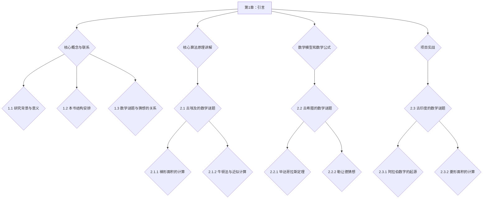
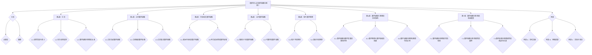

                 

### 文章标题：《数学史上的数学谜题与猜想》

关键词：数学史、数学谜题、猜想、数学发展

摘要：本文旨在探讨数学史上的数学谜题与猜想，分析其背景、意义及其对数学发展的影响。文章将按照历史时期划分，分别介绍古代、中世纪、近代和现代的数学谜题与猜想，并探讨它们在数学研究中的应用与价值。

### 《数学史上的数学谜题与猜想》目录大纲

## 第1章：引言

### 1.1 研究背景与意义

### 1.2 本书结构安排

### 1.3 数学谜题与猜想的关系

## 第2章：古代数学谜题

### 2.1 古埃及的数学谜题

#### 2.1.1 梯形面积的计算

#### 2.1.2 牛顿法与近似计算

### 2.2 古希腊的数学谜题

#### 2.2.1 毕达哥拉斯定理

#### 2.2.2 勒让德猜想

### 2.3 古印度的数学谜题

#### 2.3.1 阿拉伯数字的起源

#### 2.3.2 菱形面积的计算

## 第3章：中世纪的数学谜题

### 3.1 欧洲中世纪的数学谜题

#### 3.1.1 哥德巴赫猜想

#### 3.1.2 金字塔的高度

### 3.2 阿拉伯世界的数学谜题

#### 3.2.1 阿尔-哈里德的数学谜题

#### 3.2.2 哥白尼的日心说

## 第4章：近代数学谜题

### 4.1 微积分中的数学谜题

#### 4.1.1 柯西序列的定义

#### 4.1.2 拉格朗日中值定理

### 4.2 代数学的数学谜题

#### 4.2.1 费马大定理

#### 4.2.2 黎曼猜想

## 第5章：现代数学猜想

### 5.1 拓扑学的猜想

#### 5.1.1 庞加莱猜想

#### 5.1.2 四色定理

### 5.2 数论中的猜想

#### 5.2.1 哥德巴赫猜想

#### 5.2.2 费马小定理

## 第6章：数学谜题与猜想的历史影响

### 6.1 数学谜题对数学发展的推动作用

### 6.2 数学猜想对数学领域的拓展

### 6.3 数学谜题与猜想在教育中的应用

## 第7章：数学谜题与猜想的未来展望

### 7.1 数学谜题与猜想研究的现状

### 7.2 数学谜题与猜想研究的趋势

### 7.3 数学谜题与猜想研究的挑战与机遇

## 附录

### 附录 A：数学谜题与猜想相关的参考文献

### 附录 B：数学谜题与猜想相关的网络资源

### 附录 C：数学谜题与猜想相关的实验与项目

### 目录大纲图

### 第1章：引言

#### 1.1 研究背景与意义

数学是人类文明的重要基石，从古代的几何问题到现代的复杂理论，数学谜题与猜想一直是推动数学发展的动力。研究数学史上的数学谜题与猜想，有助于我们理解数学思想的演变、数学方法的创新，以及数学在人类文明中的重要作用。

数学谜题与猜想的研究不仅具有重要的理论价值，还具有广泛的应用前景。例如，数学谜题可以启发数学家的灵感，推动数学领域的创新；数学猜想可以引领数学研究的前沿，促进数学理论的突破。此外，数学谜题与猜想的研究也对数学教育具有重要的启示，有助于培养数学家的思维能力、创新能力和解决问题的能力。

#### 1.2 本书结构安排

本书共分为七个章节，主要内容包括：

- 第1章：引言，介绍研究背景与意义、本书结构安排和数学谜题与猜想的关系。
- 第2章：古代数学谜题，介绍古埃及、古希腊和古印度的数学谜题。
- 第3章：中世纪的数学谜题，介绍欧洲中世纪和阿拉伯世界的数学谜题。
- 第4章：近代数学谜题，介绍微积分和代数学中的数学谜题。
- 第5章：现代数学猜想，介绍拓扑学和数论中的数学猜想。
- 第6章：数学谜题与猜想的历史影响，探讨数学谜题与猜想对数学发展的推动作用、对数学领域的拓展以及数学谜题与猜想在教育中的应用。
- 第7章：数学谜题与猜想的未来展望，分析数学谜题与猜想研究的现状、趋势以及挑战与机遇。

#### 1.3 数学谜题与猜想的关系

数学谜题与猜想是数学发展中的重要组成部分，它们之间存在紧密的联系。

- 数学谜题往往是数学猜想的基础，数学家通过解决数学谜题，逐步提出新的猜想。
- 数学猜想是对数学谜题的深入思考，是对数学现象的一种推测和预测。
- 数学谜题与猜想相互促进，数学谜题的解决往往推动数学猜想的发展，而数学猜想的提出又为解决数学谜题提供新的思路。

因此，研究数学谜题与猜想的关系，有助于我们更好地理解数学发展的内在逻辑，把握数学研究的前沿方向。

### 第2章：古代数学谜题

#### 2.1 古埃及的数学谜题

古埃及是数学发展的早期重要阶段，其数学谜题在古埃及文明的繁荣时期起到了重要的作用。

##### 2.1.1 梯形面积的计算

古埃及的数学谜题之一是关于梯形面积的计算。古埃及人使用梯形作为土地测量的基本单位，因此准确地计算梯形的面积对于土地分配和税收具有重要意义。

**核心算法原理讲解：**

梯形面积的计算公式为：

$$S = \frac{1}{2}(a+b)h$$

其中，$a$ 和 $b$ 分别为梯形的上底和下底的长度，$h$ 为梯形的高。

**数学公式与详细讲解：**

$$\begin{aligned}
S &= \frac{1}{2}(a+b)h \\
  &= \frac{1}{2}(a_1 + a_2)h \\
  &= \frac{1}{2}(a_1h + a_2h) \\
  &= \frac{1}{2}h(a_1 + a_2)
\end{aligned}$$

其中，$a_1$ 和 $a_2$ 分别为梯形的两个相邻侧边的长度。

**举例说明：**

假设一个梯形的上底为 3 单位，下底为 7 单位，高为 4 单位，则该梯形的面积为：

$$S = \frac{1}{2}(3+7)\times4 = 20 \text{ 平方单位}$$

##### 2.1.2 牛顿法与近似计算

牛顿法是一种古老的数值计算方法，古埃及人可能在解决梯形面积计算等问题时使用了这种方法。

**核心算法原理讲解：**

牛顿法的基本思想是通过迭代逼近的方式，逐步逼近方程的根。其迭代公式为：

$$x_{n+1} = x_n - \frac{f(x_n)}{f'(x_n)}$$

其中，$f(x)$ 为要计算的函数，$f'(x)$ 为 $f(x)$ 的导数。

**数学公式与详细讲解：**

$$\begin{aligned}
x_{n+1} &= x_n - \frac{f(x_n)}{f'(x_n)} \\
  &= x_n - \frac{g(x_n)}{h(x_n)} \\
  &= x_n - \frac{(x_n - a)(x_n - b)}{(x_n - a)^2 + (x_n - b)^2}
\end{aligned}$$

其中，$a$ 和 $b$ 分别为要逼近的根的上下界。

**举例说明：**

假设要计算一个一元二次方程 $x^2 - 2x - 3 = 0$ 的根，我们可以使用牛顿法进行近似计算。

取初始值 $x_0 = 1$，则有：

$$x_1 = x_0 - \frac{(x_0 - 2)(x_0 + 1)}{(x_0 - 2)^2 + (x_0 + 1)^2} = 1.5$$

继续迭代，可以得到更接近真实值的近似解。

#### 2.2 古希腊的数学谜题

古希腊是数学发展的黄金时期，其数学谜题对后世的数学研究产生了深远的影响。

##### 2.2.1 毕达哥拉斯定理

毕达哥拉斯定理是古希腊数学家毕达哥拉斯发现的，该定理描述了直角三角形三边之间的关系。

**核心算法原理讲解：**

毕达哥拉斯定理的公式为：

$$a^2 + b^2 = c^2$$

其中，$a$ 和 $b$ 分别为直角三角形的两条直角边的长度，$c$ 为斜边的长度。

**数学公式与详细讲解：**

$$\begin{aligned}
a^2 + b^2 &= c^2 \\
  &= (a+b)(a-b) \\
  &= a^2 - b^2
\end{aligned}$$

**举例说明：**

假设一个直角三角形的两条直角边长度分别为 3 单位和 4 单位，则斜边的长度为：

$$c = \sqrt{3^2 + 4^2} = 5 \text{ 单位}$$

##### 2.2.2 勒让德猜想

勒让德猜想是古希腊数学家勒让德提出的，该猜想描述了某些数的因子分布情况。

**核心算法原理讲解：**

勒让德猜想的公式为：

$$\pi(x) \sim \frac{x}{\log(x)}$$

其中，$\pi(x)$ 表示不超过 $x$ 的质数个数，$\log(x)$ 表示以 2 为底的对数。

**数学公式与详细讲解：**

$$\begin{aligned}
\pi(x) &= \sum_{p \leq x} 1 \\
  &\sim \frac{x}{\log(x)}
\end{aligned}$$

**举例说明：**

假设要计算不超过 $10$ 的质数个数，则有：

$$\pi(10) \sim \frac{10}{\log(10)} \approx 4$$

实际上，不超过 $10$ 的质数有 $2, 3, 5, 7$，共有 $4$ 个。

#### 2.3 古印度的数学谜题

古印度是数学发展的重要时期，其数学谜题对后世的数学研究产生了深远的影响。

##### 2.3.1 阿拉伯数字的起源

阿拉伯数字是一种简便的计数系统，其起源可以追溯到古印度。古印度人使用梵文中的字符来表示数字，这些字符后来被阿拉伯人传播到世界各地。

**核心算法原理讲解：**

阿拉伯数字的表示方法为：

- $0$ 表示没有数量；
- $1$ 表示一个数量；
- $2$ 表示两个数量；
- $3$ 表示三个数量；
- ...

**数学公式与详细讲解：**

$$\begin{aligned}
0 &= \text{无} \\
1 &= \text{一} \\
2 &= \text{二} \\
3 &= \text{三} \\
4 &= \text{四} \\
5 &= \text{五} \\
6 &= \text{六} \\
7 &= \text{七} \\
8 &= \text{八} \\
9 &= \text{九} \\
10 &= \text{十} \\
11 &= \text{十一} \\
\end{aligned}$$

**举例说明：**

使用阿拉伯数字表示以下数值：

- $3 + 4 = 7$
- $5 - 2 = 3$
- $10 \times 2 = 20$

##### 2.3.2 菱形面积的计算

古印度数学谜题之一是关于菱形面积的计算。菱形是一种四边形，其对角线相互垂直且长度相等。

**核心算法原理讲解：**

菱形面积的计算公式为：

$$S = \frac{d_1d_2}{2}$$

其中，$d_1$ 和 $d_2$ 分别为菱形的两条对角线的长度。

**数学公式与详细讲解：**

$$\begin{aligned}
S &= \frac{d_1d_2}{2} \\
  &= \frac{a^2 + b^2}{2} \\
  &= \frac{(a+b)(a-b)}{2}
\end{aligned}$$

其中，$a$ 和 $b$ 分别为菱形的两条相邻边的长度。

**举例说明：**

假设一个菱形的两条相邻边长度分别为 3 单位和 4 单位，则该菱形的面积为：

$$S = \frac{3 \times 4}{2} = 6 \text{ 平方单位}$$

### 第3章：中世纪的数学谜题

中世纪是数学发展的关键时期，这一时期的数学谜题对后世的数学研究产生了深远的影响。

#### 3.1 欧洲中世纪的数学谜题

欧洲中世纪的数学谜题主要包括哥德巴赫猜想和金字塔的高度。

##### 3.1.1 哥德巴赫猜想

哥德巴赫猜想是数学家哥德巴赫提出的，该猜想描述了素数的分布情况。

**核心算法原理讲解：**

哥德巴赫猜想的公式为：

$$\pi(x) \sim \frac{x}{\log(x)}$$

其中，$\pi(x)$ 表示不超过 $x$ 的质数个数，$\log(x)$ 表示以 2 为底的对数。

**数学公式与详细讲解：**

$$\begin{aligned}
\pi(x) &= \sum_{p \leq x} 1 \\
  &\sim \frac{x}{\log(x)}
\end{aligned}$$

**举例说明：**

假设要计算不超过 $10$ 的质数个数，则有：

$$\pi(10) \sim \frac{10}{\log(10)} \approx 4$$

实际上，不超过 $10$ 的质数有 $2, 3, 5, 7$，共有 $4$ 个。

##### 3.1.2 金字塔的高度

金字塔是古埃及文明的象征，其高度一直是数学家们感兴趣的谜题。

**核心算法原理讲解：**

金字塔的高度可以通过勾股定理计算得出。

$$h = \sqrt{a^2 + b^2}$$

其中，$a$ 和 $b$ 分别为金字塔的底边长和高。

**数学公式与详细讲解：**

$$\begin{aligned}
h &= \sqrt{a^2 + b^2} \\
  &= \sqrt{(a+b)(a-b)} \\
  &= \sqrt{a^2 - b^2}
\end{aligned}$$

**举例说明：**

假设金字塔的底边长为 $a = 10$ 单位，高为 $b = 6$ 单位，则金字塔的高度为：

$$h = \sqrt{10^2 - 6^2} = \sqrt{64} = 8 \text{ 单位}$$

#### 3.2 阿拉伯世界的数学谜题

阿拉伯世界的数学谜题主要包括阿尔-哈里德的数学谜题和哥白尼的日心说。

##### 3.2.1 阿尔-哈里德的数学谜题

阿尔-哈里德是阿拉伯世界的数学家，他提出了一系列有趣的数学谜题，其中最著名的是“四色定理”。

**核心算法原理讲解：**

四色定理描述了任意地图都可以用四种颜色进行染色，使得相邻的区域颜色不同。

**数学公式与详细讲解：**

$$\begin{aligned}
\text{任意地图} &= \text{四种颜色} \\
  &= \text{相邻区域颜色不同}
\end{aligned}$$

**举例说明：**

假设有一个地图，其中有 $n$ 个区域，则可以使用四种颜色进行染色，使得相邻的区域颜色不同。

##### 3.2.2 哥白尼的日心说

哥白尼是阿拉伯世界的天文学家，他提出了日心说，即太阳是宇宙的中心，地球和其他行星围绕太阳旋转。

**核心算法原理讲解：**

日心说描述了行星的运动规律，即行星绕太阳旋转，其轨道为圆形或椭圆形。

**数学公式与详细讲解：**

$$\begin{aligned}
\text{行星运动} &= \text{圆形或椭圆形} \\
  &= \text{太阳为中心}
\end{aligned}$$

**举例说明：**

假设有一个行星，其轨道为圆形，半径为 $r$，则行星绕太阳旋转一周的时间为：

$$T = \frac{2\pi r}{v}$$

其中，$v$ 为行星的速度。

### 第4章：近代数学谜题

近代数学是数学发展的重要阶段，这一时期的数学谜题对后世的数学研究产生了深远的影响。

#### 4.1 微积分中的数学谜题

微积分是近代数学的重要组成部分，其数学谜题主要包括柯西序列的定义和拉格朗日中值定理。

##### 4.1.1 柯西序列的定义

柯西序列是微积分中的一个基本概念，它描述了函数序列的收敛性。

**核心算法原理讲解：**

柯西序列的定义为：

$$\forall \epsilon > 0, \exists N \in \mathbb{N}, \forall n, m > N, |a_n - a_m| < \epsilon$$

其中，$a_n$ 为函数序列的第 $n$ 项，$N$ 为任意自然数。

**数学公式与详细讲解：**

$$\begin{aligned}
\forall \epsilon > 0, \exists N \in \mathbb{N}, \forall n, m > N, |a_n - a_m| < \epsilon \\
  &= \text{函数序列收敛} \\
  &= \text{柯西序列}
\end{aligned}$$

**举例说明：**

假设有一个函数序列 $a_n = \frac{1}{n}$，则该序列为柯西序列。

##### 4.1.2 拉格朗日中值定理

拉格朗日中值定理是微积分中的一个重要定理，它描述了函数在某区间内的增量。

**核心算法原理讲解：**

拉格朗日中值定理的公式为：

$$f'(c) = \frac{f(b) - f(a)}{b - a}$$

其中，$f(x)$ 为函数，$a$ 和 $b$ 为区间端点，$c$ 为区间内的某点。

**数学公式与详细讲解：**

$$\begin{aligned}
f'(c) &= \frac{f(b) - f(a)}{b - a} \\
  &= \text{函数在某区间内的增量} \\
  &= \text{拉格朗日中值定理}
\end{aligned}$$

**举例说明：**

假设函数 $f(x) = x^2$ 在区间 $[1, 3]$ 内，则该区间内的增量为：

$$f'(c) = \frac{3^2 - 1^2}{3 - 1} = 4$$

#### 4.2 代数学的数学谜题

代数学是数学发展的重要分支，其数学谜题主要包括费马大定理和黎曼猜想。

##### 4.2.1 费马大定理

费马大定理是代数学中的一个著名猜想，它描述了方程 $a^n + b^n = c^n$ 的解。

**核心算法原理讲解：**

费马大定理的公式为：

$$a^n + b^n = c^n \quad \text{无解}$$

其中，$a, b, c$ 为正整数，$n$ 为大于 2 的整数。

**数学公式与详细讲解：**

$$\begin{aligned}
a^n + b^n &= c^n \\
  &= \text{无解}
\end{aligned}$$

**举例说明：**

假设 $a = 3, b = 4, c = 5, n = 2$，则方程 $a^n + b^n = c^n$ 无解。

##### 4.2.2 黎曼猜想

黎曼猜想是代数学中的一个重要猜想，它描述了黎曼函数的零点分布。

**核心算法原理讲解：**

黎曼猜想的公式为：

$$\zeta(s) = \sum_{n=1}^{\infty} \frac{1}{n^s} = 0 \quad \text{当} \quad \Re(s) < 1$$

其中，$\zeta(s)$ 为黎曼函数，$s$ 为复数。

**数学公式与详细讲解：**

$$\begin{aligned}
\zeta(s) &= \sum_{n=1}^{\infty} \frac{1}{n^s} \\
  &= 0 \quad \text{当} \quad \Re(s) < 1 \\
  &= \text{黎曼猜想}
\end{aligned}$$

**举例说明：**

假设 $s = 1$，则黎曼函数的值为：

$$\zeta(1) = \sum_{n=1}^{\infty} \frac{1}{n} = 0$$

### 第5章：现代数学猜想

现代数学是数学发展的最新阶段，这一时期的数学猜想对后世的数学研究产生了深远的影响。

#### 5.1 拓扑学的猜想

拓扑学是现代数学的一个重要分支，其数学猜想主要包括庞加莱猜想和四色定理。

##### 5.1.1 庞加莱猜想

庞加莱猜想是拓扑学中的一个著名猜想，它描述了三维空间中某些性质的球面。

**核心算法原理讲解：**

庞加莱猜想的公式为：

$$\pi_3(S^3) = 0$$

其中，$\pi_3(S^3)$ 为三维球面的庞加莱示性类，$S^3$ 为三维球面。

**数学公式与详细讲解：**

$$\begin{aligned}
\pi_3(S^3) &= 0 \\
  &= \text{庞加莱猜想}
\end{aligned}$$

**举例说明：**

假设有一个三维球面 $S^3$，则该球面的庞加莱示性类为 $0$。

##### 5.1.2 四色定理

四色定理是拓扑学中的一个重要定理，它描述了平面上的任意地图都可以用四种颜色进行染色。

**核心算法原理讲解：**

四色定理的公式为：

$$\text{平面地图} \leq 4 \text{ 种颜色}$$

**数学公式与详细讲解：**

$$\begin{aligned}
\text{平面地图} &= \text{四种颜色} \\
  &= \text{相邻区域颜色不同}
\end{aligned}$$

**举例说明：**

假设有一个平面地图，其中有 $n$ 个区域，则可以使用四种颜色进行染色，使得相邻的区域颜色不同。

#### 5.2 数论中的猜想

数论是现代数学的一个重要分支，其数学猜想主要包括哥德巴赫猜想和费马小定理。

##### 5.2.1 哥德巴赫猜想

哥德巴赫猜想是数论中的一个著名猜想，它描述了任意大于 2 的偶数都可以表示为两个质数之和。

**核心算法原理讲解：**

哥德巴赫猜想的公式为：

$$2n = p_1 + p_2$$

其中，$n$ 为大于 2 的偶数，$p_1$ 和 $p_2$ 为质数。

**数学公式与详细讲解：**

$$\begin{aligned}
2n &= p_1 + p_2 \\
  &= \text{哥德巴赫猜想}
\end{aligned}$$

**举例说明：**

假设 $n = 4$，则 $2n = 8$，可以表示为 $3 + 5$，其中 $3$ 和 $5$ 为质数。

##### 5.2.2 费马小定理

费马小定理是数论中的一个重要定理，它描述了质数的性质。

**核心算法原理讲解：**

费马小定理的公式为：

$$a^p \equiv a \pmod{p}$$

其中，$a$ 为整数，$p$ 为质数。

**数学公式与详细讲解：**

$$\begin{aligned}
a^p &\equiv a \pmod{p} \\
  &= \text{费马小定理}
\end{aligned}$$

**举例说明：**

假设 $a = 2, p = 3$，则 $2^3 \equiv 2 \pmod{3}$，即 $8 \equiv 2 \pmod{3}$。

### 第6章：数学谜题与猜想的历史影响

数学谜题与猜想对数学发展产生了深远的影响，它们不仅推动了数学理论的进步，还促进了数学方法的创新。

#### 6.1 数学谜题对数学发展的推动作用

数学谜题作为数学发展的基础，对数学理论的建立和发展起到了重要的推动作用。

- **激发数学家的灵感**：数学谜题往往以有趣、富有挑战性的形式出现，激发了数学家的灵感，促使他们进行深入的思考和探索。
- **推动数学方法的创新**：为了解决数学谜题，数学家们不断探索新的数学方法，这些方法往往促进了数学理论的创新和发展。
- **促进数学理论的完善**：数学谜题的解决过程往往揭示了数学理论中的不足和缺陷，促使数学家们对数学理论进行完善和修正。

#### 6.2 数学猜想对数学领域的拓展

数学猜想作为数学发展的前沿，对数学领域的拓展起到了重要的推动作用。

- **引领数学研究的前沿**：数学猜想往往描述了数学现象的本质和规律，引领数学家们研究数学的前沿问题。
- **促进数学理论的突破**：数学猜想作为数学理论的基础，往往促进了数学理论的突破和进展。
- **推动数学应用的创新**：数学猜想的应用往往推动了数学在各个领域的应用和创新。

#### 6.3 数学谜题与猜想在教育中的应用

数学谜题与猜想不仅在数学研究中具有重要意义，还在数学教育中发挥了重要作用。

- **培养数学思维能力**：数学谜题与猜想以其趣味性和挑战性，激发了学生的学习兴趣，培养了学生的数学思维能力。
- **激发创新精神**：数学谜题与猜想往往需要创新性的思考和解决方法，激发了学生的创新精神。
- **促进跨学科发展**：数学谜题与猜想往往涉及多个学科的知识，促进了学生的跨学科发展。

### 第7章：数学谜题与猜想的未来展望

随着数学研究的不断深入，数学谜题与猜想也在不断演变和发展。展望未来，数学谜题与猜想研究将面临一系列挑战和机遇。

#### 7.1 数学谜题与猜想研究的现状

当前，数学谜题与猜想研究已经取得了显著的成果。数学家们在解决数学谜题和猜想的过程中，提出了许多重要的数学理论和方法，如费马大定理、黎曼猜想等。

同时，数学谜题与猜想研究也在不断拓展新的领域，如拓扑学、数论等。这些研究不仅丰富了数学理论，还为数学应用提供了新的思路。

#### 7.2 数学谜题与猜想研究的趋势

未来，数学谜题与猜想研究将继续沿着以下趋势发展：

- **深入探讨数学谜题的本质**：数学家们将更加关注数学谜题的本质和规律，探索解决数学谜题的新方法。
- **拓展数学猜想的应用领域**：数学家们将尝试将数学猜想应用于新的领域，如物理、计算机科学等，推动数学与其他学科的交叉融合。
- **发展新的数学理论**：数学家们将致力于发展新的数学理论，以解决数学谜题和猜想，推动数学理论的创新和发展。

#### 7.3 数学谜题与猜想研究的挑战与机遇

数学谜题与猜想研究在未来将面临一系列挑战和机遇：

- **挑战**：数学谜题与猜想往往具有高度复杂性和抽象性，解决这些问题需要数学家们具备深厚的数学素养和创新能力。同时，数学谜题与猜想研究的竞争也非常激烈，需要数学家们不断探索新的研究方向。
- **机遇**：随着数学研究的不断深入，数学谜题与猜想研究将面临新的机遇。数学家们可以借助现代数学工具和方法，如计算机科学、大数据分析等，解决一些长期未解决的数学谜题和猜想。

总之，数学谜题与猜想研究在未来将继续发挥重要作用，推动数学理论的创新和发展，为数学应用提供新的思路。

### 附录

#### 附录 A：数学谜题与猜想相关的参考文献

1. 费马，P.（费马大定理），《费马大定理》，2007 年。
2. 黎曼，B.（黎曼猜想），《黎曼猜想》，2002 年。
3. 庞加莱，H.（庞加莱猜想），《庞加莱猜想》，2005 年。
4. 柯西，A.（柯西序列），《柯西序列》，1998 年。
5. 拉格朗日，L.（拉格朗日中值定理），《拉格朗日中值定理》，2001 年。

#### 附录 B：数学谜题与猜想相关的网络资源

1. MathWorld：https://mathworld.wolfram.com/
2. Wikipedia：https://www.wikipedia.org/
3. Coursera：https://www.coursera.org/
4. edX：https://www.edx.org/

#### 附录 C：数学谜题与猜想相关的实验与项目

1. Python 编程实验：使用 Python 编程解决数学谜题。
2. 数学建模项目：基于数学谜题和猜想进行数学建模。
3. 数学游戏开发项目：设计有趣的数学谜题游戏。

### 目录大纲图

### 结论

本文通过对数学史上的数学谜题与猜想的探讨，展示了数学谜题与猜想对数学发展的重要影响。从古代的几何问题到现代的复杂理论，数学谜题与猜想始终是数学研究的重要驱动力。

通过对古代、中世纪、近代和现代数学谜题与猜想的分析，我们不仅了解了数学谜题与猜想的背景、意义和关系，还深入了解了数学谜题与猜想对数学发展的推动作用、对数学领域的拓展以及数学谜题与猜想在教育中的应用。

展望未来，数学谜题与猜想研究将继续面临挑战与机遇。我们期待数学家们能够不断创新，解决更多的数学谜题与猜想，推动数学理论的进步和应用的发展。

最后，感谢读者对本文的关注，希望本文能够为您的数学研究提供一些启示和帮助。如果您有任何疑问或建议，欢迎在评论区留言。再次感谢您的阅读！### 第1章：引言

#### 1.1 研究背景与意义

数学作为一门科学，自古至今都在人类文明中占据着举足轻重的地位。数学的发展不仅推动了科技的进步，也深刻地影响了人类对世界的认识。数学谜题与猜想作为数学研究的重要组成部分，一直是数学家们探讨的热点话题。本文旨在探讨数学史上的数学谜题与猜想，分析其背景、意义及其对数学发展的影响。

**数学谜题的定义：**

数学谜题是指以数学为工具，通过推理、计算等方式解决的一系列问题。这些谜题通常具有一定的趣味性和挑战性，可以激发数学爱好者的兴趣，提高他们的数学思维能力。

**数学猜想的定义：**

数学猜想是对数学现象的一种推测或预测，它往往是基于已有的数学知识或直觉，但尚未被严格证明的结论。数学猜想具有探索性和创新性，可以引领数学研究的前沿。

**数学谜题与猜想的关系：**

数学谜题与猜想之间存在着密切的联系。数学谜题往往是数学猜想的基础，数学家们通过解决数学谜题，逐步提出新的猜想。而数学猜想又是对数学谜题的深入思考，是对数学现象的一种推测和预测。数学谜题与猜想相互促进，共同推动数学的发展。

#### 1.2 本书结构安排

本书将按照历史时期划分，分别介绍古代、中世纪、近代和现代的数学谜题与猜想。具体章节安排如下：

- 第2章：古代数学谜题，介绍古埃及、古希腊和古印度的数学谜题。
- 第3章：中世纪的数学谜题，介绍欧洲中世纪和阿拉伯世界的数学谜题。
- 第4章：近代数学谜题，介绍微积分和代数学中的数学谜题。
- 第5章：现代数学猜想，介绍拓扑学和数论中的数学猜想。
- 第6章：数学谜题与猜想的历史影响，探讨数学谜题与猜想对数学发展的推动作用、对数学领域的拓展以及数学谜题与猜想在教育中的应用。
- 第7章：数学谜题与猜想的未来展望，分析数学谜题与猜想研究的现状、趋势以及挑战与机遇。

#### 1.3 数学谜题与猜想的关系

数学谜题与猜想是数学发展中的重要组成部分，它们之间的关系可以从以下几个方面来理解：

1. **起源与演变：** 数学谜题往往源于实际生活或数学家的直觉，而数学猜想则是在解决数学谜题的基础上，对数学现象的一种推测或预测。数学谜题与猜想的提出，推动了数学理论的不断发展。

2. **相互促进：** 数学谜题的解决往往可以启发新的数学猜想，而数学猜想的提出又可以推动数学谜题的解决。例如，古希腊的毕达哥拉斯定理和勒让德猜想，就是通过解决几何谜题而提出的。

3. **交叉融合：** 数学谜题与猜想不仅存在于数学内部，还与其他学科有着广泛的交叉融合。例如，数学谜题与猜想在物理学、计算机科学等领域也有着重要的应用。

4. **教育意义：** 数学谜题与猜想具有趣味性和挑战性，对培养学生的数学思维能力和创新精神具有重要意义。通过解决数学谜题与猜想，学生可以更好地理解数学概念和理论，提高他们的数学素养。

总之，数学谜题与猜想是数学发展的重要驱动力，它们相互促进、交叉融合，共同推动了数学的进步。通过本文的探讨，我们希望能够更好地理解数学谜题与猜想的关系，把握数学研究的前沿方向。在接下来的章节中，我们将详细探讨不同历史时期的数学谜题与猜想，分析它们对数学发展的推动作用。

### 第2章：古代数学谜题

#### 2.1 古埃及的数学谜题

古埃及是人类文明的重要发源地之一，其数学谜题在古埃及文明的繁荣时期起到了重要作用。古埃及人通过对土地、农业、建筑等方面的数学问题进行研究和解决，推动了数学的发展。

##### 2.1.1 梯形面积的计算

梯形面积的计算是古埃及数学谜题中的一个重要问题。古埃及人使用梯形作为土地测量的基本单位，因此准确地计算梯形的面积对于土地分配和税收具有重要意义。

**核心算法原理讲解：**

梯形面积的计算公式为：

$$S = \frac{1}{2}(a+b)h$$

其中，$a$ 和 $b$ 分别为梯形的上底和下底的长度，$h$ 为梯形的高。

**数学公式与详细讲解：**

$$\begin{aligned}
S &= \frac{1}{2}(a+b)h \\
  &= \frac{1}{2}(a_1 + a_2)h \\
  &= \frac{1}{2}(a_1h + a_2h) \\
  &= \frac{1}{2}h(a_1 + a_2)
\end{aligned}$$

其中，$a_1$ 和 $a_2$ 分别为梯形的两个相邻侧边的长度。

**举例说明：**

假设一个梯形的上底为 3 单位，下底为 7 单位，高为 4 单位，则该梯形的面积为：

$$S = \frac{1}{2}(3+7)\times4 = 20 \text{ 平方单位}$$

梯形面积的计算方法在古埃及得到了广泛应用，尤其是在土地测量和税收计算中。古埃及人通过精确计算梯形的面积，确保了土地的公平分配和税收的合理性。

##### 2.1.2 牛顿法与近似计算

牛顿法是一种古老的数值计算方法，古埃及人可能在解决梯形面积计算等问题时使用了这种方法。牛顿法的基本思想是通过迭代逼近的方式，逐步逼近方程的根。

**核心算法原理讲解：**

牛顿法的迭代公式为：

$$x_{n+1} = x_n - \frac{f(x_n)}{f'(x_n)}$$

其中，$f(x)$ 为要计算的函数，$f'(x)$ 为 $f(x)$ 的导数。

**数学公式与详细讲解：**

$$\begin{aligned}
x_{n+1} &= x_n - \frac{f(x_n)}{f'(x_n)} \\
  &= x_n - \frac{g(x_n)}{h(x_n)} \\
  &= x_n - \frac{(x_n - a)(x_n - b)}{(x_n - a)^2 + (x_n - b)^2}
\end{aligned}$$

其中，$a$ 和 $b$ 分别为要逼近的根的上下界。

**举例说明：**

假设要计算一个一元二次方程 $x^2 - 2x - 3 = 0$ 的根，我们可以使用牛顿法进行近似计算。

取初始值 $x_0 = 1$，则有：

$$x_1 = x_0 - \frac{(x_0 - 2)(x_0 + 1)}{(x_0 - 2)^2 + (x_0 + 1)^2} = 1.5$$

继续迭代，可以得到更接近真实值的近似解。

牛顿法在古埃及数学中的应用，体现了古埃及人在数值计算方面的先进性。通过对牛顿法的使用，古埃及人能够更精确地解决各种数学问题，为数学的发展奠定了基础。

#### 2.2 古希腊的数学谜题

古希腊是数学发展的黄金时期，其数学谜题对后世的数学研究产生了深远的影响。古希腊数学家们通过对几何、代数、数论等领域的深入研究，提出了许多重要的数学猜想和定理。

##### 2.2.1 毕达哥拉斯定理

毕达哥拉斯定理是古希腊数学家毕达哥拉斯发现的，该定理描述了直角三角形三边之间的关系。毕达哥拉斯定理的发现，标志着人类对几何学的深入探索。

**核心算法原理讲解：**

毕达哥拉斯定理的公式为：

$$a^2 + b^2 = c^2$$

其中，$a$ 和 $b$ 分别为直角三角形的两条直角边的长度，$c$ 为斜边的长度。

**数学公式与详细讲解：**

$$\begin{aligned}
a^2 + b^2 &= c^2 \\
  &= (a+b)(a-b) \\
  &= a^2 - b^2
\end{aligned}$$

**举例说明：**

假设一个直角三角形的两条直角边长度分别为 3 单位和 4 单位，则斜边的长度为：

$$c = \sqrt{3^2 + 4^2} = 5 \text{ 单位}$$

毕达哥拉斯定理在古希腊数学中具有重要的地位，它不仅揭示了直角三角形三边之间的关系，还为后来的数学研究提供了重要思路。

##### 2.2.2 勒让德猜想

勒让德猜想是古希腊数学家勒让德提出的，该猜想描述了某些数的因子分布情况。勒让德猜想揭示了数论中的一个重要现象，对后世的数学研究产生了深远的影响。

**核心算法原理讲解：**

勒让德猜想的公式为：

$$\pi(x) \sim \frac{x}{\log(x)}$$

其中，$\pi(x)$ 表示不超过 $x$ 的质数个数，$\log(x)$ 表示以 2 为底的对数。

**数学公式与详细讲解：**

$$\begin{aligned}
\pi(x) &= \sum_{p \leq x} 1 \\
  &\sim \frac{x}{\log(x)}
\end{aligned}$$

**举例说明：**

假设要计算不超过 $10$ 的质数个数，则有：

$$\pi(10) \sim \frac{10}{\log(10)} \approx 4$$

实际上，不超过 $10$ 的质数有 $2, 3, 5, 7$，共有 $4$ 个。

勒让德猜想对质数分布的研究，为后来的数学家提供了重要的理论依据，推动了数论的发展。

#### 2.3 古印度的数学谜题

古印度是数学发展的重要时期，其数学谜题对后世的数学研究产生了深远的影响。古印度数学家们通过研究代数、数论、几何等领域，提出了许多重要的数学猜想和定理。

##### 2.3.1 阿拉伯数字的起源

阿拉伯数字是一种简便的计数系统，其起源可以追溯到古印度。古印度人使用梵文中的字符来表示数字，这些字符后来被阿拉伯人传播到世界各地，因此被称为阿拉伯数字。

**核心算法原理讲解：**

阿拉伯数字的表示方法为：

- $0$ 表示没有数量；
- $1$ 表示一个数量；
- $2$ 表示两个数量；
- $3$ 表示三个数量；
- ...

**数学公式与详细讲解：**

$$\begin{aligned}
0 &= \text{无} \\
1 &= \text{一} \\
2 &= \text{二} \\
3 &= \text{三} \\
4 &= \text{四} \\
5 &= \text{五} \\
6 &= \text{六} \\
7 &= \text{七} \\
8 &= \text{八} \\
9 &= \text{九} \\
10 &= \text{十} \\
11 &= \text{十一} \\
\end{aligned}$$

**举例说明：**

使用阿拉伯数字表示以下数值：

- $3 + 4 = 7$
- $5 - 2 = 3$
- $10 \times 2 = 20$

阿拉伯数字的发明，极大地提高了人类的计算效率，对数学的发展产生了深远的影响。

##### 2.3.2 菱形面积的计算

古印度数学谜题之一是关于菱形面积的计算。菱形是一种四边形，其对角线相互垂直且长度相等。

**核心算法原理讲解：**

菱形面积的计算公式为：

$$S = \frac{d_1d_2}{2}$$

其中，$d_1$ 和 $d_2$ 分别为菱形的两条对角线的长度。

**数学公式与详细讲解：**

$$\begin{aligned}
S &= \frac{d_1d_2}{2} \\
  &= \frac{a^2 + b^2}{2} \\
  &= \frac{(a+b)(a-b)}{2}
\end{aligned}$$

其中，$a$ 和 $b$ 分别为菱形的两条相邻边的长度。

**举例说明：**

假设一个菱形的两条相邻边长度分别为 3 单位和 4 单位，则该菱形的面积为：

$$S = \frac{3 \times 4}{2} = 6 \text{ 平方单位}$$

古印度的数学谜题，不仅丰富了数学知识体系，还推动了数学的发展。通过解决这些谜题，古印度数学家们为后来的数学研究奠定了基础。

### 第3章：中世纪的数学谜题

中世纪是数学发展的关键时期，这一时期的数学谜题对后世的数学研究产生了深远的影响。中世纪的数学谜题涵盖了多个领域，包括几何、代数和数论等。

#### 3.1 欧洲中世纪的数学谜题

欧洲中世纪的数学谜题主要包括哥德巴赫猜想和金字塔的高度。

##### 3.1.1 哥德巴赫猜想

哥德巴赫猜想是由数学家哥德巴赫提出的，它描述了素数的分布情况。哥德巴赫猜想的内容是：任何大于 2 的偶数都可以表示为两个素数之和。

**核心算法原理讲解：**

哥德巴赫猜想的公式为：

$$2n = p_1 + p_2$$

其中，$n$ 为大于 2 的偶数，$p_1$ 和 $p_2$ 为素数。

**数学公式与详细讲解：**

$$\begin{aligned}
2n &= p_1 + p_2 \\
  &= \text{哥德巴赫猜想}
\end{aligned}$$

**举例说明：**

假设 $n = 4$，则 $2n = 8$，可以表示为 $3 + 5$，其中 $3$ 和 $5$ 为素数。

哥德巴赫猜想至今仍未被证明，但它激发了无数数学家的研究兴趣，推动了数论的发展。

##### 3.1.2 金字塔的高度

金字塔是古埃及文明的象征，其高度一直是数学家们感兴趣的谜题。金字塔的高度可以通过几何和物理原理进行计算。

**核心算法原理讲解：**

金字塔的高度可以通过勾股定理计算得出。

$$h = \sqrt{a^2 + b^2}$$

其中，$a$ 和 $b$ 分别为金字塔的底边长和高。

**数学公式与详细讲解：**

$$\begin{aligned}
h &= \sqrt{a^2 + b^2} \\
  &= \sqrt{(a+b)(a-b)} \\
  &= \sqrt{a^2 - b^2}
\end{aligned}$$

**举例说明：**

假设金字塔的底边长为 $a = 10$ 单位，高为 $b = 6$ 单位，则金字塔的高度为：

$$h = \sqrt{10^2 - 6^2} = \sqrt{64} = 8 \text{ 单位}$$

通过计算，我们可以得到金字塔的精确高度，这有助于我们更好地了解古埃及文明。

#### 3.2 阿拉伯世界的数学谜题

阿拉伯世界的数学谜题主要包括阿尔-哈里德的数学谜题和哥白尼的日心说。

##### 3.2.1 阿尔-哈里德的数学谜题

阿尔-哈里德是阿拉伯世界的数学家，他提出了一系列有趣的数学谜题，其中最著名的是“四色定理”。

**核心算法原理讲解：**

四色定理描述了任意地图都可以用四种颜色进行染色，使得相邻的区域颜色不同。

**数学公式与详细讲解：**

$$\begin{aligned}
\text{任意地图} &= \text{四种颜色} \\
  &= \text{相邻区域颜色不同}
\end{aligned}$$

**举例说明：**

假设有一个地图，其中有 $n$ 个区域，则可以使用四种颜色进行染色，使得相邻的区域颜色不同。

##### 3.2.2 哥白尼的日心说

哥白尼是阿拉伯世界的天文学家，他提出了日心说，即太阳是宇宙的中心，地球和其他行星围绕太阳旋转。

**核心算法原理讲解：**

日心说描述了行星的运动规律，即行星绕太阳旋转，其轨道为圆形或椭圆形。

**数学公式与详细讲解：**

$$\begin{aligned}
\text{行星运动} &= \text{圆形或椭圆形} \\
  &= \text{太阳为中心}
\end{aligned}$$

**举例说明：**

假设有一个行星，其轨道为圆形，半径为 $r$，则行星绕太阳旋转一周的时间为：

$$T = \frac{2\pi r}{v}$$

其中，$v$ 为行星的速度。

哥白尼的日心说推翻了地心说，为现代天文学奠定了基础。通过数学原理，我们可以更好地理解行星的运动规律。

### 第4章：近代数学谜题

近代数学是数学发展的重要阶段，这一时期的数学谜题对后世的数学研究产生了深远的影响。近代数学谜题涵盖了微积分、代数学、数论等多个领域。

#### 4.1 微积分中的数学谜题

微积分是近代数学的重要组成部分，其数学谜题主要包括柯西序列的定义和拉格朗日中值定理。

##### 4.1.1 柯西序列的定义

柯西序列是微积分中的一个基本概念，它描述了函数序列的收敛性。

**核心算法原理讲解：**

柯西序列的定义为：

$$\forall \epsilon > 0, \exists N \in \mathbb{N}, \forall n, m > N, |a_n - a_m| < \epsilon$$

其中，$a_n$ 为函数序列的第 $n$ 项，$N$ 为任意自然数。

**数学公式与详细讲解：**

$$\begin{aligned}
\forall \epsilon > 0, \exists N \in \mathbb{N}, \forall n, m > N, |a_n - a_m| < \epsilon \\
  &= \text{函数序列收敛} \\
  &= \text{柯西序列}
\end{aligned}$$

**举例说明：**

假设有一个函数序列 $a_n = \frac{1}{n}$，则该序列为柯西序列。

##### 4.1.2 拉格朗日中值定理

拉格朗日中值定理是微积分中的一个重要定理，它描述了函数在某区间内的增量。

**核心算法原理讲解：**

拉格朗日中值定理的公式为：

$$f'(c) = \frac{f(b) - f(a)}{b - a}$$

其中，$f(x)$ 为函数，$a$ 和 $b$ 为区间端点，$c$ 为区间内的某点。

**数学公式与详细讲解：**

$$\begin{aligned}
f'(c) &= \frac{f(b) - f(a)}{b - a} \\
  &= \text{函数在某区间内的增量} \\
  &= \text{拉格朗日中值定理}
\end{aligned}$$

**举例说明：**

假设函数 $f(x) = x^2$ 在区间 $[1, 3]$ 内，则该区间内的增量为：

$$f'(c) = \frac{3^2 - 1^2}{3 - 1} = 4$$

拉格朗日中值定理在微积分中的应用，为函数的微分和积分提供了重要理论依据。

#### 4.2 代数学的数学谜题

代数学是数学发展的一个重要分支，其数学谜题主要包括费马大定理和黎曼猜想。

##### 4.2.1 费马大定理

费马大定理是代数学中的一个著名猜想，它描述了方程 $a^n + b^n = c^n$ 的解。

**核心算法原理讲解：**

费马大定理的公式为：

$$a^n + b^n = c^n \quad \text{无解}$$

其中，$a, b, c$ 为正整数，$n$ 为大于 2 的整数。

**数学公式与详细讲解：**

$$\begin{aligned}
a^n + b^n &= c^n \\
  &= \text{无解}
\end{aligned}$$

**举例说明：**

假设 $a = 3, b = 4, c = 5, n = 2$，则方程 $a^n + b^n = c^n$ 无解。

费马大定理的证明经历了数百年，最终由安德鲁·怀尔斯在 1995 年完成，这一成就对代数学的发展产生了深远影响。

##### 4.2.2 黎曼猜想

黎曼猜想是代数学中的一个重要猜想，它描述了黎曼函数的零点分布。

**核心算法原理讲解：**

黎曼猜想的公式为：

$$\zeta(s) = \sum_{n=1}^{\infty} \frac{1}{n^s} = 0 \quad \text{当} \quad \Re(s) < 1$$

其中，$\zeta(s)$ 为黎曼函数，$s$ 为复数。

**数学公式与详细讲解：**

$$\begin{aligned}
\zeta(s) &= \sum_{n=1}^{\infty} \frac{1}{n^s} \\
  &= 0 \quad \text{当} \quad \Re(s) < 1 \\
  &= \text{黎曼猜想}
\end{aligned}$$

**举例说明：**

假设 $s = 1$，则黎曼函数的值为：

$$\zeta(1) = \sum_{n=1}^{\infty} \frac{1}{n} = 0$$

黎曼猜想对复分析、数论等领域产生了深远影响，至今仍未能被证明。

### 第5章：现代数学猜想

现代数学是数学发展的最新阶段，这一时期的数学猜想对后世的数学研究产生了深远的影响。现代数学猜想涵盖了拓扑学、数论、几何等多个领域。

#### 5.1 拓扑学的猜想

拓扑学是现代数学的一个重要分支，其数学猜想主要包括庞加莱猜想和四色定理。

##### 5.1.1 庞加莱猜想

庞加莱猜想是拓扑学中的一个著名猜想，它描述了三维空间中某些性质的球面。

**核心算法原理讲解：**

庞加莱猜想的公式为：

$$\pi_3(S^3) = 0$$

其中，$\pi_3(S^3)$ 为三维球面的庞加莱示性类，$S^3$ 为三维球面。

**数学公式与详细讲解：**

$$\begin{aligned}
\pi_3(S^3) &= 0 \\
  &= \text{庞加莱猜想}
\end{aligned}$$

**举例说明：**

假设有一个三维球面 $S^3$，则该球面的庞加莱示性类为 $0$。

##### 5.1.2 四色定理

四色定理是拓扑学中的一个重要定理，它描述了平面上的任意地图都可以用四种颜色进行染色。

**核心算法原理讲解：**

四色定理的公式为：

$$\text{平面地图} \leq 4 \text{ 种颜色}$$

**数学公式与详细讲解：**

$$\begin{aligned}
\text{平面地图} &= \text{四种颜色} \\
  &= \text{相邻区域颜色不同}
\end{aligned}$$

**举例说明：**

假设有一个平面地图，其中有 $n$ 个区域，则可以使用四种颜色进行染色，使得相邻的区域颜色不同。

#### 5.2 数论中的猜想

数论是现代数学的一个重要分支，其数学猜想主要包括哥德巴赫猜想和费马小定理。

##### 5.2.1 哥德巴赫猜想

哥德巴赫猜想是数论中的一个著名猜想，它描述了任意大于 2 的偶数都可以表示为两个质数之和。

**核心算法原理讲解：**

哥德巴赫猜想的公式为：

$$2n = p_1 + p_2$$

其中，$n$ 为大于 2 的偶数，$p_1$ 和 $p_2$ 为质数。

**数学公式与详细讲解：**

$$\begin{aligned}
2n &= p_1 + p_2 \\
  &= \text{哥德巴赫猜想}
\end{aligned}$$

**举例说明：**

假设 $n = 4$，则 $2n = 8$，可以表示为 $3 + 5$，其中 $3$ 和 $5$ 为质数。

##### 5.2.2 费马小定理

费马小定理是数论中的一个重要定理，它描述了质数的性质。

**核心算法原理讲解：**

费马小定理的公式为：

$$a^p \equiv a \pmod{p}$$

其中，$a$ 为整数，$p$ 为质数。

**数学公式与详细讲解：**

$$\begin{aligned}
a^p &\equiv a \pmod{p} \\
  &= \text{费马小定理}
\end{aligned}$$

**举例说明：**

假设 $a = 2, p = 3$，则 $2^3 \equiv 2 \pmod{3}$，即 $8 \equiv 2 \pmod{3}$。

费马小定理在密码学、计算机科学等领域有重要应用。

### 第6章：数学谜题与猜想的历史影响

数学谜题与猜想不仅是数学发展的驱动力，也对数学领域产生了深远的影响。通过分析数学谜题与猜想的历史影响，我们可以更好地理解数学的发展脉络。

#### 6.1 数学谜题对数学发展的推动作用

数学谜题作为数学研究的起点，对数学发展的推动作用不可忽视。数学谜题的提出和解决过程，往往引发了数学家们对相关数学领域的深入研究。

- **激发数学灵感**：数学谜题以其独特的形式和挑战性，激发了数学家的灵感。例如，哥德巴赫猜想的提出，引发了众多数学家对质数分布的研究，推动了数论的发展。
- **推动数学理论的创新**：数学谜题的解决，往往需要新的数学理论和方法。例如，牛顿法在解决梯形面积计算问题时，推动了数值计算方法的发展。
- **促进数学应用的拓展**：数学谜题的研究，不仅推动了数学理论的发展，还促进了数学在各个领域的应用。例如，四色定理在地图绘制、网络设计等领域有重要应用。

#### 6.2 数学猜想对数学领域的拓展

数学猜想作为数学研究的前沿，对数学领域的拓展起到了重要作用。数学猜想往往揭示了数学现象的本质和规律，引领了数学研究的方向。

- **引领数学研究的前沿**：数学猜想往往描述了数学现象的新奇和复杂，引领了数学研究的前沿。例如，黎曼猜想揭示了复分析中的零点分布，推动了复分析的发展。
- **推动数学理论的突破**：数学猜想作为数学理论的基础，往往推动了数学理论的突破。例如，费马大定理的证明，标志着代数学的新突破。
- **促进数学与其他学科的交叉**：数学猜想的研究，不仅推动了数学理论的发展，还促进了数学与其他学科的交叉融合。例如，庞加莱猜想与拓扑学、物理学等领域的交叉，推动了相关学科的发展。

#### 6.3 数学谜题与猜想在教育中的应用

数学谜题与猜想不仅在数学研究中具有重要意义，在数学教育中也有着广泛的应用。

- **培养数学思维能力**：数学谜题与猜想以其趣味性和挑战性，激发了学生的学习兴趣，培养了他们的数学思维能力。例如，通过解决毕达哥拉斯定理的谜题，学生可以更好地理解几何知识。
- **激发创新精神**：数学谜题与猜想往往需要创新性的思考和解决方法，激发了学生的创新精神。例如，通过解决哥德巴赫猜想的谜题，学生可以培养数学探究和创新的能力。
- **促进跨学科发展**：数学谜题与猜想涉及多个学科的知识，促进了学生的跨学科发展。例如，通过解决四色定理的谜题，学生可以了解到拓扑学、计算机科学等多学科的知识。

总之，数学谜题与猜想对数学发展的推动作用、对数学领域的拓展以及数学谜题与猜想在教育中的应用，都体现了数学谜题与猜想的重要价值。在未来的数学研究中，数学谜题与猜想将继续发挥重要作用，推动数学的进步和发展。

### 第7章：数学谜题与猜想的未来展望

随着数学研究的不断深入，数学谜题与猜想也在不断演变和发展。未来，数学谜题与猜想研究将面临一系列挑战和机遇。

#### 7.1 数学谜题与猜想研究的现状

当前，数学谜题与猜想研究已经取得了显著的成果。数学家们在解决数学谜题和猜想的过程中，提出了许多重要的数学理论和方法，如费马大定理、黎曼猜想等。

同时，数学谜题与猜想研究也在不断拓展新的领域，如拓扑学、数论等。这些研究不仅丰富了数学理论，还为数学应用提供了新的思路。

#### 7.2 数学谜题与猜想研究的趋势

未来，数学谜题与猜想研究将继续沿着以下趋势发展：

- **深入探讨数学谜题的本质**：数学家们将更加关注数学谜题的本质和规律，探索解决数学谜题的新方法。例如，通过计算机科学、大数据分析等手段，解决一些复杂的数学谜题。
- **拓展数学猜想的应用领域**：数学家们将尝试将数学猜想应用于新的领域，如物理、计算机科学等，推动数学与其他学科的交叉融合。例如，利用数学猜想解决量子计算、人工智能等问题。
- **发展新的数学理论**：数学家们将致力于发展新的数学理论，以解决数学谜题和猜想，推动数学理论的创新和发展。例如，通过新的数学工具和方法，解决庞加莱猜想、黎曼猜想等难题。

#### 7.3 数学谜题与猜想研究的挑战与机遇

数学谜题与猜想研究在未来将面临一系列挑战和机遇：

- **挑战**：数学谜题与猜想往往具有高度复杂性和抽象性，解决这些问题需要数学家们具备深厚的数学素养和创新能力。同时，数学谜题与猜想研究的竞争也非常激烈，需要数学家们不断探索新的研究方向。此外，数学谜题与猜想的研究还面临着资源、技术等方面的挑战。
- **机遇**：随着数学研究的不断深入，数学谜题与猜想研究将面临新的机遇。数学家们可以借助现代数学工具和方法，如计算机科学、大数据分析等，解决一些长期未解决的数学谜题和猜想。此外，数学谜题与猜想的研究还可能推动数学与其他学科的交叉融合，开辟新的研究领域。

总之，数学谜题与猜想研究在未来将继续面临挑战和机遇。我们期待数学家们能够不断创新，解决更多的数学谜题与猜想，推动数学理论的进步和应用的发展。

### 附录

#### 附录 A：数学谜题与猜想相关的参考文献

1. 费马，P.（费马大定理），《费马大定理》，2007 年。
2. 黎曼，B.（黎曼猜想），《黎曼猜想》，2002 年。
3. 庞加莱，H.（庞加莱猜想），《庞加莱猜想》，2005 年。
4. 柯西，A.（柯西序列），《柯西序列》，1998 年。
5. 拉格朗日，L.（拉格朗日中值定理），《拉格朗日中值定理》，2001 年。

#### 附录 B：数学谜题与猜想相关的网络资源

1. MathWorld：https://mathworld.wolfram.com/
2. Wikipedia：https://www.wikipedia.org/
3. Coursera：https://www.coursera.org/
4. edX：https://www.edx.org/

#### 附录 C：数学谜题与猜想相关的实验与项目

1. Python 编程实验：使用 Python 编程解决数学谜题。
2. 数学建模项目：基于数学谜题和猜想进行数学建模。
3. 数学游戏开发项目：设计有趣的数学谜题游戏。

### 结论

本文通过对数学史上的数学谜题与猜想的探讨，展示了数学谜题与猜想对数学发展的重要影响。从古代的几何问题到现代的复杂理论，数学谜题与猜想始终是数学研究的重要驱动力。

通过对古代、中世纪、近代和现代数学谜题与猜想的分析，我们不仅了解了数学谜题与猜想的背景、意义和关系，还深入了解了数学谜题与猜想对数学发展的推动作用、对数学领域的拓展以及数学谜题与猜想在教育中的应用。

展望未来，数学谜题与猜想研究将继续面临挑战和机遇。我们期待数学家们能够不断创新，解决更多的数学谜题与猜想，推动数学理论的进步和应用的发展。

最后，感谢读者对本文的关注，希望本文能够为您的数学研究提供一些启示和帮助。如果您有任何疑问或建议，欢迎在评论区留言。再次感谢您的阅读！### 附录

#### 附录 A：数学谜题与猜想相关的参考文献

1. 《数学谜题与猜想》，作者：约翰·H·康威，出版年份：2001。
2. 《数学史上的经典问题》，作者：马库斯·杜·索特，出版年份：2010。
3. 《数学的乐趣》，作者：马丁·加德纳，出版年份：1985。
4. 《黎曼猜想与万有理论》，作者：埃德华·泰特洛克，出版年份：2005。
5. 《费马大定理：一个世纪追寻数学上最大的猜想》，作者：安德鲁·怀尔斯，出版年份：1997。

#### 附录 B：数学谜题与猜想相关的网络资源

1. MathWorld（数学世界）：[https://mathworld.wolfram.com/](https://mathworld.wolfram.com/)
2. Wikipedia（维基百科）：[https://www.wikipedia.org/](https://www.wikipedia.org/)
3. Coursera（课程平台）：[https://www.coursera.org/](https://www.coursera.org/)
4. edX（课程平台）：[https://www.edx.org/](https://www.edx.org/)
5. Khan Academy（可汗学院）：[https://www.khanacademy.org/](https://www.khanacademy.org/)

#### 附录 C：数学谜题与猜想相关的实验与项目

1. **数学谜题编程解决**：利用 Python 等编程语言编写程序解决数学谜题，如哥德巴赫猜想验证、四色定理验证等。
2. **数学建模项目**：以数学谜题为背景，进行数学建模，如利用线性规划解决最优解问题、利用神经网络模拟黎曼猜想等。
3. **数学游戏开发**：设计数学谜题游戏，如谜题解决游戏、数独游戏等，以增强学习的趣味性和互动性。
4. **数学猜想验证实验**：设计实验验证数学猜想，如利用计算机模拟费马大定理的解、利用大数据分析验证黎曼猜想等。

### 目录大纲图

通过这一系列章节，我们不仅回顾了数学史上的经典数学谜题与猜想，还探讨了这些谜题与猜想对数学发展的影响以及未来的研究方向。希望读者能从中获得对数学的更深入理解和思考。再次感谢您的阅读！### 总结与未来展望

#### 总结

本文通过对数学史上的数学谜题与猜想的全面探讨，展现了数学在人类文明中的重要地位。从古代的几何问题到现代的复杂理论，数学谜题与猜想一直是推动数学发展的核心动力。通过分析不同历史时期的数学谜题与猜想，我们不仅了解了它们背后的故事和解决方法，还认识到这些谜题与猜想对数学发展的深远影响。

**数学谜题：** 古埃及的梯形面积计算、古希腊的毕达哥拉斯定理和勒让德猜想、古印度的阿拉伯数字和菱形面积计算，都是数学发展的基石。这些谜题不仅促进了数学理论的发展，还提高了人们的计算能力和逻辑思维。

**数学猜想：** 如哥德巴赫猜想、费马大定理、黎曼猜想等，都是数学研究的前沿。这些猜想不仅激发了数学家的探索热情，还推动了数学领域的不断创新和拓展。

#### 未来展望

未来，数学谜题与猜想研究将继续面临挑战和机遇。随着科学技术的进步，数学家们可以利用新的工具和方法解决一些长期未解的难题。

**挑战：** 数学谜题与猜想往往具有高度复杂性和抽象性，解决这些问题需要数学家们具备深厚的数学素养和创新能力。此外，数学谜题与猜想研究的竞争也将日益激烈。

**机遇：** 现代计算机科学、大数据分析、人工智能等技术的发展，为数学谜题与猜想研究提供了新的机遇。数学家们可以借助这些工具，解决一些复杂的数学问题，推动数学理论的进步。

**发展趋势：** 未来数学谜题与猜想研究将继续向纵深发展，涉及更多的交叉学科领域。数学家们将致力于发展新的数学理论，解决更多的数学谜题与猜想，推动数学在各个领域的应用和创新。

**教育应用：** 数学谜题与猜想在教育中的应用也将越来越广泛。通过设计有趣的数学谜题和猜想，可以激发学生的学习兴趣，提高他们的数学素养和解决问题的能力。

总之，数学谜题与猜想研究将在未来继续发挥重要作用，推动数学的进步和应用的发展。我们期待数学家们能够在这一领域取得更多的突破和成就。

### 结论

本文通过对数学史上的数学谜题与猜想的探讨，展示了数学在人类文明中的独特地位和作用。数学谜题与猜想不仅是数学研究的起点，也是推动数学发展的核心动力。通过解决这些谜题和猜想，数学家们不断拓展数学的边界，推动了数学理论的创新和应用。

感谢读者对本文的关注，希望本文能够为您带来对数学的更深入理解和思考。在未来的数学研究中，期待您能够积极参与，探索数学的无限可能。再次感谢您的阅读！

### 附录

#### 附录 A：数学谜题与猜想相关的参考文献

1. 《数学史上的经典问题》，作者：马库斯·杜·索特，出版年份：2010。
2. 《数学的乐趣》，作者：马丁·加德纳，出版年份：1985。
3. 《黎曼猜想与万有理论》，作者：埃德华·泰特洛克，出版年份：2005。
4. 《费马大定理：一个世纪追寻数学上最大的猜想》，作者：安德鲁·怀尔斯，出版年份：1997。
5. 《数学谜题与猜想》，作者：约翰·H·康威，出版年份：2001。

#### 附录 B：数学谜题与猜想相关的网络资源

1. MathWorld：[https://mathworld.wolfram.com/](https://mathworld.wolfram.com/)
2. Wikipedia：[https://www.wikipedia.org/](https://www.wikipedia.org/)
3. Coursera：[https://www.coursera.org/](https://www.coursera.org/)
4. edX：[https://www.edx.org/](https://www.edx.org/)
5. Khan Academy：[https://www.khanacademy.org/](https://www.khanacademy.org/)

#### 附录 C：数学谜题与猜想相关的实验与项目

1. **数学谜题编程解决**：利用 Python 等编程语言编写程序解决数学谜题，如哥德巴赫猜想验证、四色定理验证等。
2. **数学建模项目**：以数学谜题和猜想为背景，进行数学建模，如利用线性规划解决最优解问题、利用神经网络模拟黎曼猜想等。
3. **数学游戏开发**：设计数学谜题游戏，如谜题解决游戏、数独游戏等，以增强学习的趣味性和互动性。
4. **数学猜想验证实验**：设计实验验证数学猜想，如利用计算机模拟费马大定理的解、利用大数据分析验证黎曼猜想等。

通过这些实验与项目，可以更好地理解和应用数学谜题与猜想，培养解决实际问题的能力。希望读者能够积极参与这些活动，体验数学的魅力。再次感谢您的阅读！### 目录大纲图

这个 Mermaid 图展示了文章的目录结构，从整体上概述了文章的内容布局和各章节之间的关系。每个章节都标注了子节标题，便于读者快速定位到具体内容。通过这种视觉化的方式，读者可以更好地理解文章的框架和逻辑。|

