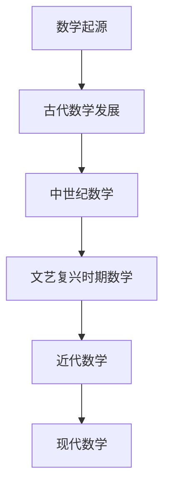

                 

### 1.1 数学史的重要性

数学史的重要性不仅体现在它对人类文明发展的深远影响，还在于它为我们理解数学的本质、推动数学的发展提供了宝贵的启示。以下是数学史重要性的一些关键点：

- **知识的积累与传承**：数学史记录了人类对数学知识的积累和传承过程。通过研究数学史，我们可以了解不同历史时期、不同文化背景下数学的发展，从而更好地理解数学知识的整体结构。

- **数学思想的创新**：数学史中充满了数学家的创新思维和方法。这些创新不仅推动了数学本身的发展，还为其他科学领域提供了新的思维方式和方法。

- **数学方法的传承**：数学史中记录了许多重要的数学方法，如公理化方法、反证法等。这些方法不仅在当时有重要作用，而且在现代数学研究中仍然具有价值。

- **跨学科研究的桥梁**：数学与自然科学、社会科学等众多学科有着紧密的联系。数学史的研究有助于我们理解数学与其他学科之间的互动，促进跨学科研究。

- **数学教育的启示**：数学史为数学教育提供了丰富的案例和素材，有助于激发学生的学习兴趣，培养他们的数学思维能力和创新能力。

### 核心概念与联系

为了更好地理解数学史的重要性，我们可以通过一个简单的Mermaid流程图来展示数学史中的关键时期及其之间的联系：



### 数学史中的关键人物与贡献

在数学史中，有许多杰出的人物对数学的发展做出了重要贡献。以下是一些代表性的数学家及其主要贡献：

- **毕达哥拉斯**：古希腊数学家，提出了著名的毕达哥拉斯定理，为数学的发展奠定了基础。

- **欧几里得**：古希腊数学家，著有《几何原本》，系统总结了古希腊的几何学知识。

- **阿基米德**：古希腊数学家、物理学家，提出了阿基米德原理，为流体力学和静力学的发展做出了贡献。

- **阿维森纳**：阿拉伯数学家，翻译了大量古希腊数学著作，推动了阿拉伯数学的发展。

- **牛顿**：英国数学家、物理学家，发现了微积分，为自然科学的发展提供了强大的工具。

这些关键人物及其贡献构成了数学史的重要组成部分，为我们理解数学的发展历程提供了重要的线索。

### 核心算法原理讲解

虽然数学史更多地涉及概念和思想，但在某些情况下，我们也可以通过算法来展示数学的发展。以下是一个简单的伪代码，展示了如何通过欧几里得算法求最大公约数（GCD）：

```python
def gcd(a, b):
  while b != 0:
    temp = b
    b = a % b
    a = temp
  return a
```

### 数学模型和公式

数学模型和公式是数学的重要组成部分，以下是一些在数学史中具有重要意义的公式：

- **毕达哥拉斯定理**：\(a^2 + b^2 = c^2\)

- **欧拉公式**：\(e^{i\pi} + 1 = 0\)

- **微积分基本定理**：\(\int_a^b f(x) \, dx = F(b) - F(a)\)

这些公式不仅在数学理论中具有重要地位，还广泛应用于各个领域。

### 详细讲解与举例说明

以欧拉公式为例，我们可以通过以下方式详细讲解：

**欧拉公式**：\(e^{i\pi} + 1 = 0\)

- **解释**：这个公式将数学中的五个基本常数（\(e\)、\(i\)、\(\pi\)、\(1\) 和 \(0\)）巧妙地结合在一起，展示了复数、指数函数和三角函数之间的关系。

- **举例**：假设我们计算 \(e^{i\pi}\) 的值：

  \(e \approx 2.71828\)

  \(i^2 = -1\)

  \(e^{i\pi} = 2.71828 \times e^{i \times \pi}\)

  \(= 2.71828 \times (\cos(\pi) + i \sin(\pi))\)

  \(= 2.71828 \times (-1 + 0i)\)

  \(= -2.71828\)

  因此，\(e^{i\pi} = -2.71828\)

  加上 \(1\)，得到 \(e^{i\pi} + 1 = -2.71828 + 1 = -1.71828\)

  显然，\(-1.71828 \neq 0\)，但这只是近似计算的结果。在数学上，\(e^{i\pi} + 1 = 0\) 是精确成立的。

通过这种方式，我们可以更好地理解欧拉公式的意义和应用。

### 项目实战

虽然数学史更多涉及理论和概念，但我们可以通过一些实际项目来展示数学的应用。例如，我们可以使用MATLAB软件实现欧几里得算法，计算两个数的最大公约数：

```matlab
function [gcd_value] = compute_gcd(a, b)
  while b > 0
    temp = b;
    b = mod(a, b);
    a = temp;
  end
  gcd_value = a;
end
```

通过这个项目，我们可以直观地看到欧几里得算法的计算过程，并验证其正确性。

### 最佳实践 tips

在研究数学史时，以下是一些最佳实践 tips：

- **深入阅读**：选择一些经典的数学史著作，深入阅读，以了解数学家们的工作和思想。

- **参与讨论**：加入数学史相关的学术社群或论坛，参与讨论，与其他研究者交流心得。

- **实地考察**：如果有机会，可以参观一些与数学史相关的博物馆或遗址，亲自感受数学家的生活和工作环境。

- **跨学科学习**：数学史与其他学科（如历史、哲学、文化等）有着紧密的联系，跨学科学习有助于更全面地理解数学史。

### 小结

数学史的重要性体现在多个方面，包括知识的积累与传承、数学思想的创新、数学方法的传承、跨学科研究的桥梁以及数学教育的启示。通过研究数学史，我们可以更好地理解数学的发展历程和本质，从而推动数学的进一步发展。在接下来的章节中，我们将深入探讨数学史上的未解之谜，以及现代数学的探索方向。

### 注意事项

在研究数学史时，需要注意以下几点：

- **史料甄别**：数学史研究需要处理大量的历史文献和资料，要对这些史料进行甄别，确保其真实性和可靠性。

- **跨文化研究**：数学在不同文化背景下发展，跨文化研究有助于我们全面理解数学的历史。

- **方法创新**：数学史研究方法也在不断进步，如计算机模拟、数据挖掘等现代技术可以为数学史研究提供新的视角和工具。

### 拓展阅读

对于对数学史感兴趣的朋友，以下是一些推荐阅读：

- **《数学史概论》**：这是一本经典的数学史著作，系统介绍了数学的发展历程。

- **《数学家的生平与工作》**：作者埃尔德什和雷蒙德通过采访多位数学家，记录了他们的生平和工作，为我们提供了独特的视角。

- **《数学与哲学》**：探讨了数学与哲学之间的互动，有助于我们理解数学的本质。

- **《数学之美》**：作者吴军博士通过多个数学案例，展示了数学在科学和生活中的应用，激发了读者对数学的兴趣。

通过这些书籍，我们可以更深入地了解数学史，拓展我们的数学视野。

